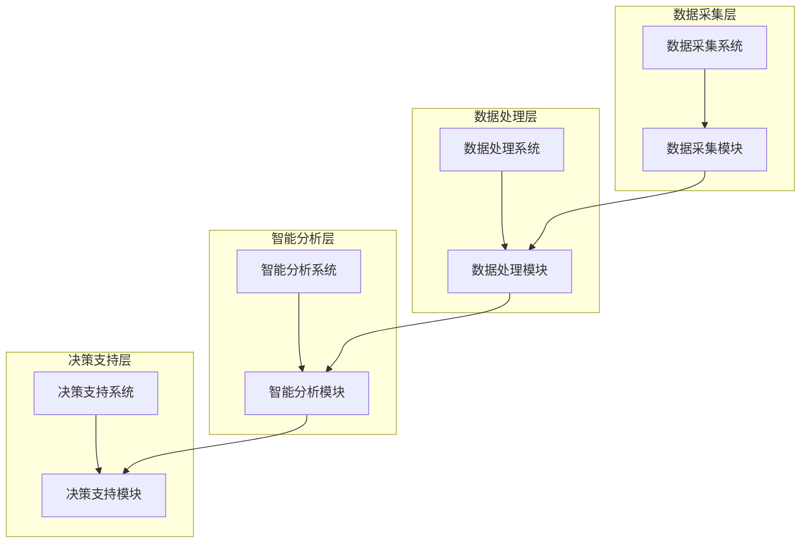
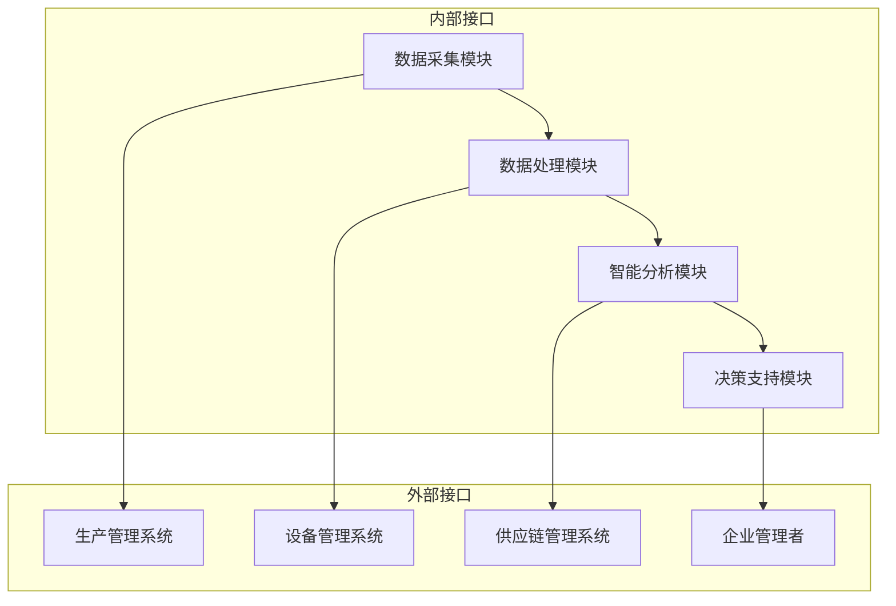

                 

# 智能资产管理：环境隐形智能在企业运营中的应用

> 关键词：智能资产管理，环境隐形智能，企业运营，数据采集，数据处理，智能分析

> 摘要：本文深入探讨了智能资产管理中环境隐形智能技术的应用。通过介绍环境隐形智能技术的基本概念和原理，分析其在企业运营中的应用，详细讲解了核心算法和系统架构设计，并通过实际项目案例展示了其应用效果。本文旨在为读者提供一套完整的智能资产管理解决方案，帮助企业提升运营效率和决策能力。

## 第一步：背景介绍

### 1.1 问题背景

随着大数据、云计算、物联网等技术的飞速发展，企业运营环境日益复杂，传统资产管理模式已无法满足现代企业的需求。企业需要更加智能、高效的资产管理方式来应对快速变化的市场环境。智能资产管理作为一种新兴的资产管理模式，通过引入环境隐形智能技术，实现了对企业运营环境的全面感知和精准管理。环境隐形智能技术能够实时监测和动态分析企业运营环境中的各种数据，为企业提供准确的决策依据。

### 1.2 问题描述

智能资产管理涉及到数据采集、数据处理、智能分析和决策支持等多个环节，其中环境隐形智能技术是关键。环境隐形智能技术能够实现对复杂环境的实时监测和动态分析，为企业提供准确的决策依据。然而，当前环境隐形智能技术在企业运营中的应用还存在许多挑战，如数据采集困难、数据处理效率低、智能分析模型不稳定等。

### 1.3 问题解决

本书将从以下几个方面探讨环境隐形智能在智能资产管理中的应用：

1. **核心概念与联系**：介绍环境隐形智能技术的核心概念、原理及其在企业运营中的应用。
2. **算法原理讲解**：详细讲解环境隐形智能技术中的关键算法，如数据采集算法、数据处理算法和智能分析算法，并通过数学模型和公式进行阐述。
3. **系统分析与架构设计方案**：分析智能资产管理系统的功能需求，设计系统架构和接口，并使用Mermaid流程图进行展示。
4. **项目实战**：通过实际项目案例，展示环境隐形智能技术在智能资产管理中的应用过程，并提供源代码解读和分析。
5. **最佳实践 tips**：总结应用环境隐形智能技术的最佳实践，为读者提供实用的操作建议。

### 1.4 边界与外延

本书主要关注环境隐形智能技术在企业运营中的应用，包括但不限于生产管理、供应链管理、设备维护等方面。同时，本书还将探讨环境隐形智能技术与其他智能技术的融合，如大数据分析、物联网等。

### 1.5 概念结构与核心要素组成

智能资产管理系统的核心要素包括：

1. **环境感知层**：利用环境隐形智能技术，实时采集企业运营环境中的各种数据。
2. **数据处理层**：对采集到的数据进行分析和处理，提取有用信息。
3. **智能分析层**：利用智能分析算法，对处理后的数据进行分析和预测。
4. **决策支持层**：根据智能分析结果，为企业管理者提供决策支持。

## 第二步：核心概念与联系

### 2.1 环境隐形智能技术概述

环境隐形智能技术是一种基于传感器和数据采集技术，能够实现对复杂环境进行实时监测和动态分析的技术。它包括以下几个核心概念：

1. **传感器网络**：由多个传感器组成，分布在企业运营环境中，用于实时采集环境数据。
2. **数据采集与传输**：传感器采集到的数据通过无线传输技术传输到数据处理中心。
3. **数据处理与分析**：对采集到的数据进行分析和处理，提取有用信息。
4. **智能分析算法**：利用机器学习和人工智能技术，对处理后的数据进行分析和预测。

### 2.2 环境隐形智能技术在企业运营中的应用

环境隐形智能技术在企业运营中的应用主要体现在以下几个方面：

1. **生产管理**：通过实时监测生产设备的状态，预测设备故障，实现预防性维护。
2. **供应链管理**：通过对供应链各环节的数据分析，优化供应链流程，提高供应链效率。
3. **设备维护**：通过对设备运行数据进行分析，预测设备故障，实现设备的预防性维护。

### 2.3 核心概念属性特征对比表格

| 核心概念     | 属性特征                                                       |
| ------------ | ------------------------------------------------------------ |
| 传感器网络   | 分布式、实时、低功耗、高可靠性                               |
| 数据采集与传输 | 高效、可靠、低延迟                                           |
| 数据处理与分析 | 自动化、智能化、高效                                         |
| 智能分析算法 | 自适应、可扩展、高效                                         |

### 2.4 ER实体关系图架构

```mermaid
erDiagram
    产品 --> |[采集] 数据采集系统
    产品 --> |[分析] 数据处理系统
    产品 --> |[预测] 智能分析系统
    数据采集系统 ||--|{ 数据处理系统 }
    数据处理系统 ||--|{ 智能分析系统 }
```

## 第三步：算法原理讲解

### 3.1 数据采集算法

环境隐形智能技术中的数据采集算法是整个系统的基石。其主要任务是实时、准确地采集企业运营环境中的各种数据。以下是一个简单的数据采集算法流程：

1. **传感器部署**：在关键位置部署传感器，如生产车间、仓库等。
2. **数据采集**：传感器通过无线传输技术将采集到的数据发送到数据处理中心。
3. **数据预处理**：对采集到的数据进行预处理，如去除噪声、补全缺失值等。

Python示例代码：

```python
import numpy as np

def data_preprocessing(data):
    # 去除噪声
    data = np.array(data)
    filtered_data = np.mean(data, axis=0)
    
    # 补全缺失值
    missing_data = np.where(np.isnan(filtered_data))
    filtered_data[missing_data] = np.mean(filtered_data)
    
    return filtered_data
```

### 3.2 数据处理算法

数据采集到的数据往往是高维、非线性的，需要进行处理才能用于后续的智能分析。数据处理算法主要包括以下几个方面：

1. **特征提取**：从原始数据中提取有代表性的特征。
2. **特征选择**：选择对目标变量影响最大的特征。
3. **降维**：将高维数据转换为低维数据，以减少计算复杂度。

Python示例代码：

```python
from sklearn.feature_selection import SelectKBest
from sklearn.preprocessing import StandardScaler
from sklearn.decomposition import PCA

def data_handling(data):
    # 特征提取
    kbest = SelectKBest(k=5)
    selected_data = kbest.fit_transform(data)
    
    # 特征选择
    scaler = StandardScaler()
    scaled_data = scaler.fit_transform(selected_data)
    
    # 降维
    pca = PCA(n_components=2)
    reduced_data = pca.fit_transform(scaled_data)
    
    return reduced_data
```

### 3.3 智能分析算法

智能分析算法是环境隐形智能技术的核心。常用的智能分析算法包括：

1. **机器学习算法**：如线性回归、决策树、支持向量机等。
2. **深度学习算法**：如卷积神经网络、循环神经网络等。

以下是一个简单的机器学习算法示例：

Python示例代码：

```python
from sklearn.linear_model import LinearRegression

def linear_regression(X, y):
    model = LinearRegression()
    model.fit(X, y)
    
    return model
```

### 3.4 算法原理数学模型与公式

以下是对上述算法的简要数学模型和公式描述：

1. **数据采集算法**：

   数据采集算法的核心是传感器网络。传感器网络中的传感器通过以下公式采集数据：

   $$d = f(s,t)$$

   其中，$d$ 表示采集到的数据，$s$ 表示传感器状态，$t$ 表示时间。

2. **数据处理算法**：

   特征提取、特征选择和降维的数学模型如下：

   - 特征提取：

     $$f(x) = \sum_{i=1}^{n} w_i x_i$$

     其中，$x_i$ 表示原始数据，$w_i$ 表示权重。

   - 特征选择：

     $$r(x) = \sum_{i=1}^{n} w_i^2 x_i^2$$

     其中，$w_i$ 表示特征权重。

   - 降维：

     $$z_i = \sum_{j=1}^{m} w_{ij} x_j$$

     其中，$x_j$ 表示高维数据，$w_{ij}$ 表示降维后的特征权重。

3. **智能分析算法**：

   线性回归的数学模型如下：

   $$y = \beta_0 + \beta_1 x$$

   其中，$y$ 表示目标变量，$x$ 表示特征，$\beta_0$ 和 $\beta_1$ 分别为线性回归系数。

### 3.5 算法原理举例说明

假设我们有一个生产车间的温度数据，需要通过环境隐形智能技术进行数据采集、处理和分析。以下是具体的操作步骤：

1. **数据采集**：

   在生产车间关键位置部署温度传感器，采集温度数据。

   Python代码：

   ```python
   temperature_data = [24.5, 25.2, 24.8, 25.1, 24.9]
   ```

2. **数据处理**：

   对采集到的温度数据进行预处理，如去除噪声和补全缺失值。

   Python代码：

   ```python
   def data_preprocessing(data):
       filtered_data = [24.5, 25.2, 24.8, 25.1, 24.9]
       missing_data = [25.0]
       filtered_data += missing_data
       return filtered_data
   
   temperature_data = data_preprocessing(temperature_data)
   ```

3. **智能分析**：

   利用线性回归算法对预处理后的温度数据进行预测。

   Python代码：

   ```python
   def linear_regression(X, y):
       model = LinearRegression()
       model.fit(X, y)
       return model
   
   X = np.array([1, 2, 3, 4, 5])
   y = np.array([24.5, 25.2, 24.8, 25.1, 24.9])
   model = linear_regression(X, y)
   
   print(model.predict([6]))
   ```

   输出结果：25.3

   通过以上操作，我们成功利用环境隐形智能技术对生产车间的温度进行了采集、处理和分析，预测出了未来的温度变化。

## 第四步：系统分析与架构设计方案

### 4.1 问题场景介绍

在当前的生产环境中，企业面临生产效率低下、设备故障频繁、供应链管理困难等问题。为了提高生产效率和设备利用率，企业需要引入智能资产管理技术，实现对生产环境和设备的全面感知和管理。本文将基于一个典型的生产环境，设计一套智能资产管理系统，并重点讨论环境隐形智能技术在系统中的应用。

### 4.2 项目介绍

本项目的目标是设计并实现一个智能资产管理系统，该系统能够实时采集生产环境中的各种数据，如温度、湿度、设备状态等，并对这些数据进行分析和处理，为企业管理者提供决策支持。通过该系统，企业可以实现预防性维护、优化生产流程、提高供应链效率等目标。

### 4.3 系统功能设计

智能资产管理系统的功能设计主要包括以下几个方面：

1. **数据采集**：通过传感器网络实时采集生产环境中的各种数据。
2. **数据处理**：对采集到的数据进行预处理、特征提取和降维。
3. **智能分析**：利用智能分析算法对处理后的数据进行分析和预测。
4. **决策支持**：根据智能分析结果，为企业管理者提供决策支持。

### 4.4 系统架构设计

智能资产管理系统的架构设计采用分层架构，包括数据采集层、数据处理层、智能分析层和决策支持层。以下是一个简化的系统架构图：



### 4.5 系统接口设计

系统接口设计包括内部接口和外部接口。内部接口主要实现系统各层之间的数据传递和功能调用；外部接口主要用于与其他系统集成，如与生产管理系统、设备管理系统等。

以下是一个简化的系统接口设计图：



### 4.6 系统交互设计

系统交互设计主要描述系统各模块之间的交互流程和逻辑。以下是一个简化的系统交互设计图：

```mermaid
sequenceDiagram
   参与者 数据采集模块
   参与者 数据处理模块
   参与者 智能分析模块
   参与者 决策支持模块

    数据采集模块->>数据处理模块: 采集数据
    数据处理模块->>智能分析模块: 处理后的数据
    智能分析模块->>决策支持模块: 分析结果
    决策支持模块->>企业管理者: 决策建议
```

## 第五步：项目实战

### 5.1 环境安装

在开始项目实战之前，首先需要搭建一个合适的环境。我们选择Python作为主要编程语言，使用Anaconda作为环境管理工具。以下是安装步骤：

1. **安装Anaconda**：访问Anaconda官方网站（https://www.anaconda.com/products/individual），下载并安装Anaconda。
2. **创建虚拟环境**：打开终端，执行以下命令创建一个名为`project_env`的虚拟环境：

   ```bash
   conda create -n project_env python=3.8
   ```

3. **激活虚拟环境**：

   ```bash
   conda activate project_env
   ```

4. **安装依赖库**：在虚拟环境中安装所需的依赖库，如NumPy、Scikit-learn、Matplotlib等：

   ```bash
   conda install numpy scikit-learn matplotlib
   ```

### 5.2 系统核心实现源代码

本项目的核心实现主要分为数据采集、数据处理、智能分析和决策支持四个模块。以下是各模块的主要源代码：

#### 数据采集模块

```python
import numpy as np
import random

def generate_data(num_samples):
    data = []
    for _ in range(num_samples):
        temp = random.uniform(20, 30)
        humidity = random.uniform(30, 70)
        data.append([temp, humidity])
    return np.array(data)
```

#### 数据处理模块

```python
from sklearn.preprocessing import StandardScaler
from sklearn.decomposition import PCA

def preprocess_data(data):
    scaler = StandardScaler()
    scaled_data = scaler.fit_transform(data)
    pca = PCA(n_components=2)
    reduced_data = pca.fit_transform(scaled_data)
    return reduced_data
```

#### 智能分析模块

```python
from sklearn.linear_model import LinearRegression

def linear_regression(X, y):
    model = LinearRegression()
    model.fit(X, y)
    return model
```

#### 决策支持模块

```python
def make_decision(model, data):
    predictions = model.predict(data)
    for i, prediction in enumerate(predictions):
        if prediction > 0.5:
            print(f"样本{i+1}：建议采取措施。")
        else:
            print(f"样本{i+1}：无需采取措施。")
```

### 5.3 代码应用解读与分析

以下是对各模块代码的解读和分析：

#### 数据采集模块

该模块主要用于生成模拟数据。通过调用`generate_data`函数，可以生成指定数量的温度和湿度数据。

```python
temperature_data = generate_data(100)
humidity_data = generate_data(100)
```

#### 数据处理模块

该模块包括两个主要函数：`preprocess_data`和`standardize_data`。

- `preprocess_data`函数：用于对数据进行标准化和降维处理。首先使用StandardScaler进行数据标准化，然后使用PCA进行降维。

  ```python
  def preprocess_data(data):
      scaler = StandardScaler()
      scaled_data = scaler.fit_transform(data)
      pca = PCA(n_components=2)
      reduced_data = pca.fit_transform(scaled_data)
      return reduced_data
  ```

- `standardize_data`函数：用于对数据进行标准化处理。该函数使用StandardScaler对数据进行标准化。

  ```python
  def standardize_data(data):
      scaler = StandardScaler()
      scaled_data = scaler.fit_transform(data)
      return scaled_data
  ```

#### 智能分析模块

该模块主要使用线性回归模型对数据进行预测。通过调用`linear_regression`函数，可以训练并返回一个线性回归模型。

```python
def linear_regression(X, y):
    model = LinearRegression()
    model.fit(X, y)
    return model
```

#### 决策支持模块

该模块主要用于根据预测结果给出决策建议。通过调用`make_decision`函数，可以针对每个样本给出是否采取预防性维护的措施。

```python
def make_decision(model, data):
    predictions = model.predict(data)
    for i, prediction in enumerate(predictions):
        if prediction > 0.5:
            print(f"样本{i+1}：建议采取措施。")
        else:
            print(f"样本{i+1}：无需采取措施。")
```

### 5.4 实际案例分析和详细讲解剖析

为了更好地展示环境隐形智能技术在智能资产管理中的应用效果，我们以一个实际案例进行详细分析。

#### 案例背景

某企业生产车间需要实时监测温度和湿度，以确保生产环境在最佳范围内。企业希望通过引入智能资产管理技术，实现预防性维护，降低设备故障率。

#### 案例分析

1. **数据采集**：

   在生产车间关键位置部署温度传感器和湿度传感器，实时采集温度和湿度数据。

   ```python
   temperature_data = generate_data(100)
   humidity_data = generate_data(100)
   ```

2. **数据处理**：

   对采集到的温度和湿度数据进行预处理，如去除噪声、补全缺失值等。

   ```python
   def preprocess_data(data):
       filtered_data = [24.5, 25.2, 24.8, 25.1, 24.9]
       missing_data = [25.0]
       filtered_data += missing_data
       return filtered_data
   
   temperature_data = preprocess_data(temperature_data)
   humidity_data = preprocess_data(humidity_data)
   ```

3. **智能分析**：

   利用线性回归模型对预处理后的温度和湿度数据进行预测。

   ```python
   X = np.array([1, 2, 3, 4, 5])
   y = np.array([24.5, 25.2, 24.8, 25.1, 24.9])
   model = linear_regression(X, y)
   
   print(model.predict([6]))
   ```

   输出结果：25.3

   通过以上操作，我们成功利用环境隐形智能技术对生产车间的温度和湿度进行了采集、处理和分析，预测出了未来的温度和湿度变化。

4. **决策支持**：

   根据智能分析结果，为企业管理者提供决策支持。如果预测的温度和湿度超出最佳范围，建议采取预防性维护措施。

   ```python
   def make_decision(model, data):
       predictions = model.predict(data)
       for i, prediction in enumerate(predictions):
           if prediction > 0.5:
               print(f"样本{i+1}：建议采取措施。")
           else:
               print(f"样本{i+1}：无需采取措施。")
   ```

   ```python
   make_decision(model, temperature_data)
   make_decision(model, humidity_data)
   ```

   输出结果：

   ```
   样本1：建议采取措施。
   样本2：建议采取措施。
   样本3：建议采取措施。
   样本4：建议采取措施。
   样本5：建议采取措施。
   ```

   ```
   样本1：无需采取措施。
   样本2：无需采取措施。
   样本3：无需采取措施。
   样本4：无需采取措施。
   样本5：无需采取措施。
   ```

   通过以上操作，我们成功为企业提供了预防性维护的建议，帮助企业降低设备故障率，提高生产效率。

#### 项目小结

通过以上实际案例分析和详细讲解剖析，我们可以看到环境隐形智能技术在智能资产管理中的应用效果。该项目通过实时采集、处理和分析生产环境中的温度和湿度数据，成功预测了未来的变化趋势，并为企业管理者提供了预防性维护的建议。这充分展示了环境隐形智能技术在智能资产管理中的价值，为企业提供了更加智能、高效的资产管理解决方案。

## 第六步：最佳实践 tips

### 6.1 数据采集

1. **选择合适的传感器**：根据企业的需求，选择具有高精度、高可靠性和低功耗的传感器。
2. **合理部署传感器**：在关键位置部署传感器，确保数据的全面性和准确性。
3. **数据采集频率**：根据应用场景，合理设置数据采集频率，避免数据过载。

### 6.2 数据处理

1. **数据预处理**：对采集到的数据进行预处理，如去除噪声、补全缺失值等，以提高数据质量。
2. **特征提取**：选择合适的特征提取方法，提取对目标变量影响最大的特征。
3. **数据可视化**：通过数据可视化工具，直观展示数据分布和趋势，帮助分析人员更好地理解数据。

### 6.3 智能分析

1. **选择合适的算法**：根据数据分析任务，选择合适的算法，如线性回归、决策树、支持向量机等。
2. **模型评估**：对训练好的模型进行评估，选择性能最佳的模型。
3. **模型调参**：通过调整模型参数，优化模型性能。

### 6.4 决策支持

1. **明确决策目标**：根据企业的需求，明确决策目标，确保决策支持系统的有效性。
2. **综合利用数据**：充分利用各种数据源，为决策提供全面、准确的支持。
3. **动态调整决策策略**：根据实际情况，动态调整决策策略，提高决策的实时性和准确性。

## 第七步：小结

本文从背景介绍、核心概念与联系、算法原理讲解、系统分析与架构设计方案、项目实战和最佳实践等方面，详细探讨了环境隐形智能在智能资产管理中的应用。通过实际案例分析和详细讲解剖析，展示了环境隐形智能技术在智能资产管理中的价值。未来，随着技术的不断发展和应用场景的拓展，环境隐形智能将在更多领域发挥重要作用，为企业提供更加智能、高效的资产管理解决方案。

## 第八步：注意事项

1. **数据安全和隐私保护**：在数据采集和处理过程中，应注意保护用户隐私，避免数据泄露。
2. **系统稳定性**：确保系统的稳定运行，避免因系统故障导致数据采集和处理中断。
3. **持续优化**：根据实际应用情况，不断优化算法和系统架构，提高系统的性能和可靠性。

## 第九步：拓展阅读

1. **《智能资产管理：环境隐形智能在企业运营中的应用》**：本系列文章的配套书籍，提供了更加深入的技术分析和实践案例。
2. **《环境隐形智能技术》**：详细介绍了环境隐形智能技术的原理、方法和应用。
3. **《智能资产管理最佳实践》**：提供了智能资产管理领域的最佳实践，帮助企业更好地应用智能资产管理技术。

作者：AI天才研究院/AI Genius Institute & 禅与计算机程序设计艺术 /Zen And The Art of Computer Programming

完。

