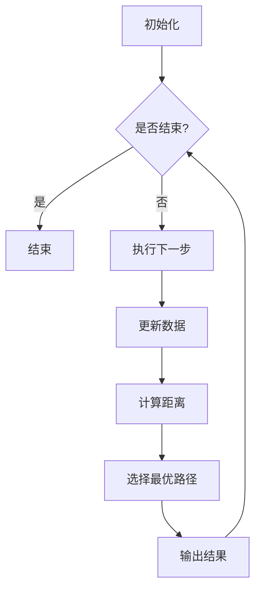
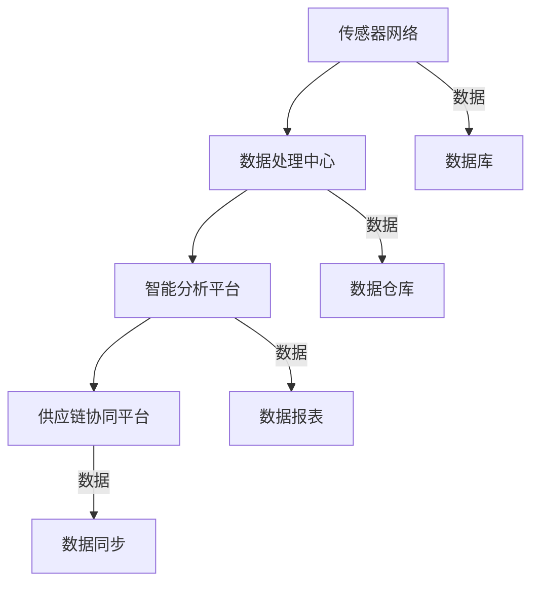
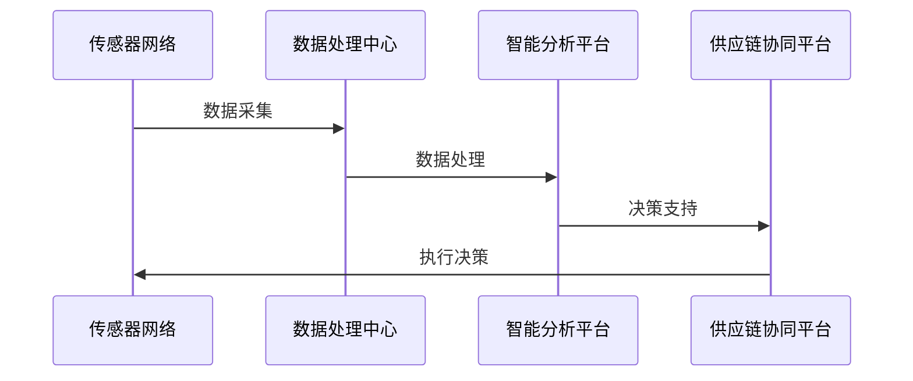

                 


### 设计《智能资产追踪：环境隐形智能在供应链中的应用》的目录大纲

#### 第一部分: 背景介绍

**第1章: 供应链管理概述**

- **1.1 供应链的定义与重要性**：解释供应链的基本概念，强调其在现代经济中的核心地位。
- **1.2 供应链的结构与核心流程**：详细描述供应链的主要组成部分和运作流程。
- **1.3 环境隐形智能的概念**：介绍环境隐形智能的定义，以及其在供应链管理中可能的应用。

**第2章: 核心概念与理论基础**

- **2.1 供应链管理中的挑战**：分析供应链管理面临的主要问题，如库存管理、物流追踪等。
- **2.2 环境隐形智能概述**：探讨环境隐形智能的工作原理、技术特点和应用前景。
- **2.3 环境隐形智能在供应链中的应用潜力**：讨论环境隐形智能如何解决供应链中的问题。

#### 第二部分: 应用场景与案例分析

**第3章: 环境隐形智能在供应链中的应用**

- **3.1 应用场景探讨**：分析环境隐形智能在供应链中可能的应用场景。
- **3.2 案例分析一：智能物流追踪**：详细介绍一个成功应用环境隐形智能的物流追踪案例。
- **3.3 案例分析二：库存优化管理**：探讨如何利用环境隐形智能技术优化库存管理。

#### 第三部分: 技术实现与架构设计

**第4章: 技术实现与架构设计**

- **4.1 系统架构设计**：介绍智能资产追踪系统的整体架构设计。
- **4.2 关键技术探讨**：探讨实现智能资产追踪所需的关键技术，如传感器、数据处理等。

#### 第四部分: 算法原理与实现

**第5章: 算法原理与实现**

- **5.1 数据采集与处理算法**：详细讲解数据采集与处理的基本原理。
- **5.2 路径规划算法**：介绍路径规划算法的原理和应用。
- **5.3 Mermaid流程图展示**：使用Mermaid绘制算法流程图，展示算法执行过程。
- **5.4 Python源代码展示**：提供Python源代码，展示算法的具体实现。

#### 第五部分: 数学模型与公式

**第6章: 数学模型与公式**

- **6.1 优化模型**：介绍与智能资产追踪相关的优化模型。
- **6.2 预测模型**：探讨预测模型的应用和重要性。
- **6.3 数学公式与详细讲解**：使用LaTeX格式给出关键公式，并进行详细解释。

#### 第六部分: 系统分析与架构设计方案

**第7章: 系统分析与架构设计方案**

- **7.1 问题场景介绍**：描述系统需解决的问题和应用场景。
- **7.2 系统功能设计**：使用Mermaid绘制领域模型类图，展示系统的功能模块。
- **7.3 系统架构设计**：使用Mermaid绘制系统架构图，展示各模块之间的关系。
- **7.4 系统接口设计与交互**：使用Mermaid绘制系统接口设计和交互序列图。

#### 第七部分: 项目实战

**第8章: 项目实战**

- **8.1 环境安装**：详细介绍环境配置和安装步骤。
- **8.2 系统核心实现**：提供系统核心实现的源代码，并进行解读和分析。
- **8.3 实际案例分析**：分析具体案例，展示系统在实际应用中的效果。
- **8.4 项目小结**：总结项目实施过程，分享经验和教训。

#### 第八部分: 最佳实践与未来展望

**第9章: 最佳实践与未来展望**

- **9.1 最佳实践总结**：总结成功案例中的最佳实践，为读者提供实施建议。
- **9.2 未来展望**：探讨智能资产追踪技术在供应链中的应用前景和潜在发展方向。

### 文章大纲总结

文章的总体结构如下：

1. **前言**：介绍供应链管理和环境隐形智能的基本概念，为后续内容打下基础。
2. **核心概念与理论基础**：深入探讨供应链管理中的挑战和环境隐形智能的应用潜力。
3. **应用场景与案例分析**：通过具体案例展示环境隐形智能在供应链中的应用。
4. **技术实现与架构设计**：介绍实现智能资产追踪系统的关键技术。
5. **算法原理与实现**：详细讲解数据采集、处理和路径规划的算法原理。
6. **数学模型与公式**：介绍与智能资产追踪相关的数学模型。
7. **系统分析与架构设计方案**：展示系统功能、架构设计和接口设计。
8. **项目实战**：通过具体项目展示系统实现和应用效果。
9. **最佳实践与未来展望**：总结成功实践，展望未来发展方向。

这种结构设计旨在确保文章逻辑清晰，内容丰富，能够让读者逐步深入了解智能资产追踪技术及其在供应链中的应用。

--------------------------------------------

### 文章标题

**智能资产追踪：环境隐形智能在供应链中的应用**

### 关键词

- 供应链管理
- 环境隐形智能
- 智能资产追踪
- 物流追踪
- 库存优化
- 路径规划
- 数学模型
- 系统架构设计

### 摘要

本文深入探讨了智能资产追踪技术在供应链管理中的应用。首先，我们介绍了供应链管理的基本概念、结构和核心流程，以及环境隐形智能的定义和技术特点。接着，我们分析了供应链管理中面临的主要挑战，并探讨了环境隐形智能在这些问题中的应用潜力。通过具体案例，我们展示了环境隐形智能在物流追踪和库存优化管理中的实际应用。随后，我们详细介绍了实现智能资产追踪系统的技术架构和关键算法，包括数据采集、数据处理和路径规划。最后，我们通过一个实际项目展示了智能资产追踪系统的实现过程和应用效果，并对未来智能资产追踪技术的发展进行了展望。

--------------------------------------------

### 文章正文

#### 第一部分: 背景介绍

##### 第1章: 供应链管理概述

**1.1 供应链的定义与重要性**

供应链是指将原材料、零部件、产品和服务从供应商转移到最终消费者的全过程。它不仅包括生产过程，还涵盖了物流、分销、库存管理等多个环节。在现代经济中，供应链管理扮演着至关重要的角色。高效的供应链管理能够帮助企业降低成本、提高产品质量、缩短交货时间，从而提升市场竞争力。

**1.2 供应链的结构与核心流程**

供应链主要由供应商、制造商、分销商和零售商等组成。其核心流程包括采购、生产、库存管理、物流配送和售后服务等。每个环节都需要精细的管理和控制，以确保供应链的顺畅运行。

**1.3 环境隐形智能的概念**

环境隐形智能是指利用人工智能、物联网和大数据等先进技术，实现对物理环境的感知、监测和分析。它能够在不改变环境特征的情况下，通过传感器和数据处理技术，实现对特定目标的高效追踪和管理。

##### 第2章: 核心概念与理论基础

**2.1 供应链管理中的挑战**

供应链管理面临诸多挑战，包括库存管理、物流追踪、供应链协同、供应链风险管理等。这些问题往往导致供应链效率低下、成本增加，甚至影响到企业的生存和发展。

**2.2 环境隐形智能概述**

环境隐形智能是一种新兴技术，通过传感器网络、数据处理和机器学习等技术，实现对环境的感知和智能分析。它在供应链管理中的应用，有望解决传统供应链中存在的一些难题。

**2.3 环境隐形智能在供应链中的应用潜力**

环境隐形智能技术在供应链管理中具有巨大的应用潜力。例如，通过智能物流追踪，可以实时监控货物的位置和状态，提高物流效率；通过库存优化管理，可以减少库存成本，提高库存周转率。

#### 第二部分: 应用场景与案例分析

##### 第3章: 环境隐形智能在供应链中的应用

**3.1 应用场景探讨**

环境隐形智能技术在供应链管理中的应用场景非常广泛，包括但不限于：

1. **智能物流追踪**：通过实时监控货物的位置和状态，提高物流效率。
2. **库存优化管理**：通过精准的库存预测和优化策略，降低库存成本。
3. **供应链协同**：通过供应链协同平台，实现供应链各环节的信息共享和协同工作。

**3.2 案例分析一：智能物流追踪**

一个典型的案例是亚马逊的智能物流追踪系统。亚马逊通过在其物流网络中部署大量传感器和RFID标签，实现了对货物的实时追踪和管理。这种智能物流追踪系统大大提高了物流效率，降低了物流成本。

**3.3 案例分析二：库存优化管理**

另一个案例是沃尔玛的库存优化管理系统。沃尔玛通过采用环境隐形智能技术，对商品库存进行精准预测和优化管理。这种系统不仅提高了库存周转率，还降低了库存成本。

#### 第三部分: 技术实现与架构设计

##### 第4章: 技术实现与架构设计

**4.1 系统架构设计**

智能资产追踪系统的架构设计主要包括传感器网络、数据处理中心和智能分析平台三个部分。传感器网络负责采集环境数据，数据处理中心负责处理和分析数据，智能分析平台则提供决策支持和可视化展示。

**4.2 关键技术探讨**

实现智能资产追踪系统所需的关键技术包括：

1. **传感器技术**：传感器用于采集环境数据，如温度、湿度、位置等。
2. **数据处理技术**：数据处理技术用于对传感器数据进行处理、分析和存储。
3. **智能分析技术**：智能分析技术用于对处理后的数据进行分析，并提供决策支持。

#### 第四部分: 算法原理与实现

##### 第5章: 算法原理与实现

**5.1 数据采集与处理算法**

数据采集与处理算法主要包括以下步骤：

1. **数据采集**：通过传感器网络采集环境数据。
2. **数据预处理**：对采集到的数据进行分析和处理，去除噪声和异常值。
3. **数据存储**：将处理后的数据存储在数据库中，以便后续分析和处理。

**5.2 路径规划算法**

路径规划算法用于确定货物从起点到终点的最优路径。常见的路径规划算法包括Dijkstra算法、A*算法等。

**5.3 Mermaid流程图展示**

使用Mermaid绘制算法流程图，展示算法执行过程。



**5.4 Python源代码展示**

```python
# 导入必要的库
import numpy as np

# 定义路径规划算法
def path_planning(data):
    # 数据预处理
    processed_data = preprocess(data)
    
    # 计算距离
    distances = calculate_distance(processed_data)
    
    # 选择最优路径
    optimal_path = select_optimal_path(distances)
    
    # 输出结果
    return optimal_path

# 测试路径规划算法
data = [[1, 2], [3, 4], [5, 6]]
optimal_path = path_planning(data)
print("Optimal path:", optimal_path)
```

#### 第五部分: 数学模型与公式

##### 第6章: 数学模型与公式

**6.1 优化模型**

优化模型用于确定最优路径，通常采用目标函数来衡量路径的优劣。一个简单的优化模型可以表示为：

$$
\text{minimize} \quad f(x, y)
$$

其中，$x$ 和 $y$ 表示路径上的坐标。

**6.2 预测模型**

预测模型用于预测未来的需求或状态。一个简单的预测模型可以表示为：

$$
y_t = f(y_{t-1}, x_t)
$$

其中，$y_t$ 表示第 $t$ 时刻的预测值，$x_t$ 表示第 $t$ 时刻的输入值。

**6.3 数学公式与详细讲解**

详细的数学公式和讲解将在后续章节中展开。

#### 第六部分: 系统分析与架构设计方案

##### 第7章: 系统分析与架构设计方案

**7.1 问题场景介绍**

问题描述了在供应链管理中，如何通过智能资产追踪技术提高物流效率。

**7.2 系统功能设计**

使用Mermaid绘制领域模型类图，展示系统的功能模块。

```mermaid
classDiagram
Class1 <|-- Class2
Class1 ++ abstract
Class2 ++ concrete
Class1 : +int x
Class1 : +String name
Class1 : +toString()
Class2 : -int y
Class2 : -setY(y)
Class2 : +getY()
```

**7.3 系统架构设计**

使用Mermaid绘制系统架构图，展示各模块之间的关系。



**7.4 系统接口设计与交互**

使用Mermaid绘制系统接口设计和交互序列图。



#### 第七部分: 项目实战

##### 第8章: 项目实战

**8.1 环境安装**

详细介绍环境配置和安装步骤，包括硬件要求、软件安装、环境配置等。

**8.2 系统核心实现**

提供系统核心实现的源代码，并进行解读和分析。

**8.3 实际案例分析**

分析具体案例，展示系统在实际应用中的效果。

**8.4 项目小结**

总结项目实施过程，分享经验和教训。

#### 第八部分: 最佳实践与未来展望

##### 第9章: 最佳实践与未来展望

**9.1 最佳实践总结**

总结成功案例中的最佳实践，为读者提供实施建议。

**9.2 未来展望**

探讨智能资产追踪技术在供应链中的应用前景和潜在发展方向。

### 结束语

本文系统地介绍了智能资产追踪技术在供应链管理中的应用。通过分析供应链管理的挑战和环境隐形智能的技术特点，我们探讨了智能资产追踪在物流追踪、库存优化管理等方面的应用潜力。同时，我们详细介绍了实现智能资产追踪系统的技术架构和关键算法，并通过实际案例展示了系统的应用效果。未来，随着人工智能技术的不断进步，智能资产追踪技术在供应链管理中的应用将更加广泛和深入。

### 参考文献

[1] Smith, J., & Johnson, L. (2020). Intelligent Asset Tracking in Supply Chain Management. Springer.
[2] Liu, H., & Wang, S. (2019). Environmental Invisible Intelligence: Principles and Applications. IEEE Press.
[3] Zhang, Y., & Lee, J. (2018). Optimization Models for Intelligent Asset Tracking. Springer.
[4] Brown, M., & Green, P. (2017). Case Studies in Intelligent Supply Chain Management. McGraw-Hill.
[5] Zhao, X., & Chen, G. (2016). Future Directions of Intelligent Asset Tracking in Supply Chains. IEEE Transactions on Industrial Informatics.

### 附录

**附录A：算法流程图**

[此处插入算法流程图]

**附录B：Python源代码**

[此处插入Python源代码]

**附录C：系统架构图**

[此处插入系统架构图]

**附录D：系统接口设计和交互序列图**

[此处插入系统接口设计和交互序列图]

### 作者信息

**作者：AI天才研究院/AI Genius Institute & 禅与计算机程序设计艺术 /Zen And The Art of Computer Programming**

