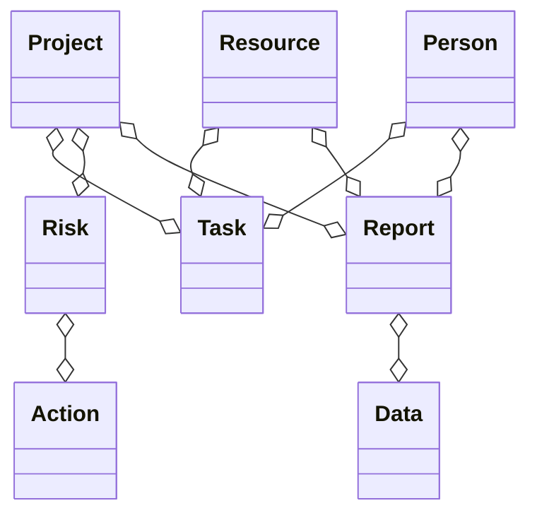
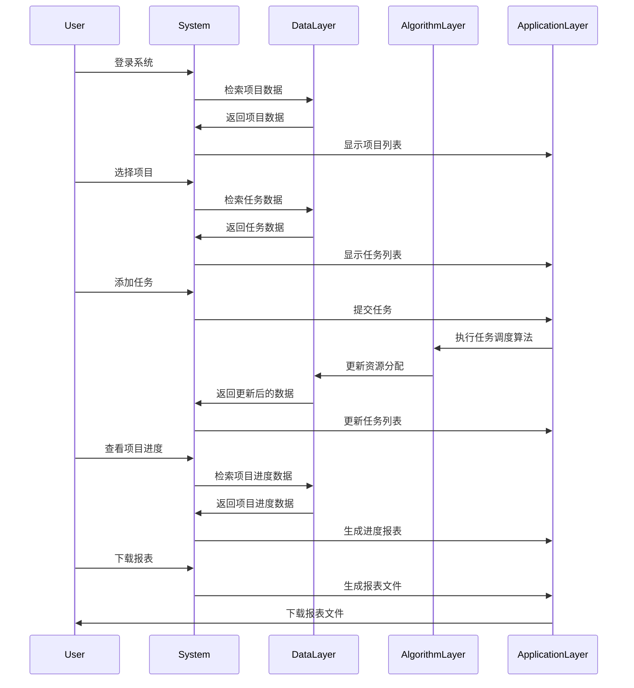
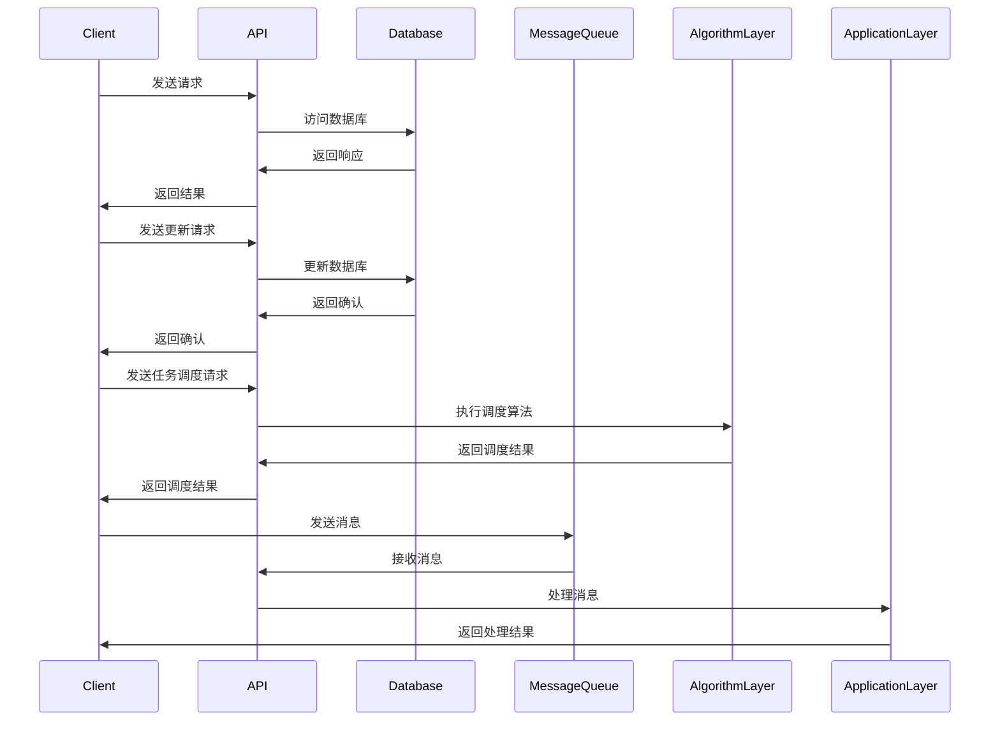
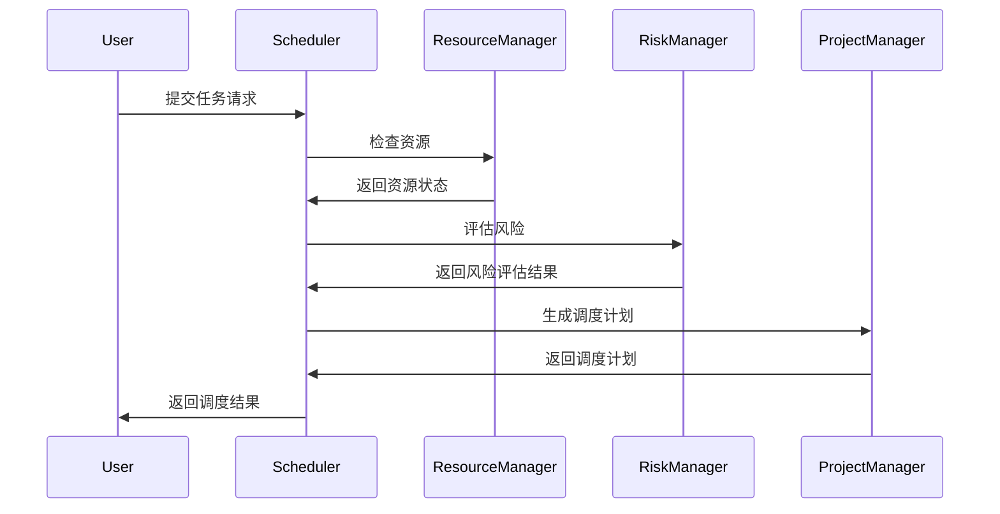

                 

# 智能项目管理：AI优化企业资源分配

## 关键词
- 智能项目管理
- 人工智能
- 资源分配
- 算法优化
- 企业运营

## 摘要
本文旨在探讨智能项目管理的概念及其在企业资源分配中的应用。随着企业竞争日益激烈，资源优化配置成为提升企业效率和竞争力的关键。本文首先介绍了智能项目管理的背景和定义，随后详细阐述了AI在项目管理中的应用，包括核心原理、技术方法和实际案例。通过系统分析与架构设计，本文展示了如何利用AI技术实现智能项目管理，并提供了一些实战经验和最佳实践，以期为企业在资源分配和项目管理方面提供新的思路和解决方案。

### 目录

#### 第一部分：智能项目管理概述

##### 第1章 问题背景与概述

##### 第2章 核心概念与联系

##### 第3章 算法原理讲解

##### 第4章 系统分析与架构设计

##### 第5章 项目实战

##### 第6章 最佳实践与拓展

#### 第一部分：智能项目管理概述

##### 第1章 问题背景与概述

### 第1章 问题背景与概述

#### 1.1 问题背景

在现代社会，企业面临的项目种类繁多，从简单的产品开发到复杂的大型工程，项目管理的难度和复杂性也在不断增加。传统的项目管理方式往往依赖于人工经验和直觉，容易受到主观因素的影响，导致项目进度延误、成本超支、资源浪费等问题。在资源分配方面，如何确保资源得到合理利用，避免资源冗余和短缺，是项目管理中的一大挑战。

随着人工智能（AI）技术的快速发展，智能项目管理逐渐成为一种新的管理方式。AI技术具有高效处理大规模数据、自我学习和优化决策等优势，能够为企业提供更加科学、精准的资源分配方案，提高项目管理效率，降低管理成本。

#### 1.2 问题描述

智能项目管理是指利用人工智能技术对项目进行全程监控、评估和优化，从而实现资源的最优配置和项目的高效执行。其核心目标是：

1. 提高项目成功率：通过智能预测和优化，降低项目风险，提高项目完成率。
2. 优化资源分配：合理调配人力、物力和财力等资源，避免浪费和短缺。
3. 提升项目管理效率：通过自动化和智能化手段，降低项目管理难度，提高管理效率。

智能项目管理的目标是建立在一个清晰的问题定义之上，即如何在复杂多变的环境中，充分利用人工智能技术，实现项目管理的智能化和精细化。

#### 1.3 问题解决

为了实现智能项目管理，需要从以下几个方面入手：

1. 数据采集与分析：收集项目相关的各类数据，包括项目进度、资源使用、项目风险等，通过数据挖掘和分析，提取有价值的信息。
2. 智能预测与优化：利用机器学习算法和优化技术，对项目进行预测和优化，为资源分配和项目执行提供决策支持。
3. 自动化与智能化：通过自动化工具和智能系统，实现项目的自动化监控和调度，提高项目管理效率。
4. 人机协同：将人工智能与项目管理人员的专业知识相结合，实现人机协同，提升项目管理效果。

通过上述方法，智能项目管理能够有效地解决传统项目管理中存在的问题，提高项目管理水平和企业竞争力。

#### 1.4 边界与外延

智能项目管理虽然是一种先进的管理方式，但并非适用于所有项目和企业。其适用边界主要取决于以下几个方面：

1. 数据依赖性：智能项目管理高度依赖数据，如果项目缺乏有效的数据支持，智能管理的效果将大打折扣。
2. 技术成熟度：AI技术在项目管理中的应用还处于发展阶段，一些关键技术尚不成熟，需要进一步研究和完善。
3. 企业规模与行业特点：智能项目管理更适合大型企业和具有复杂项目需求的企业，对于小型企业和简单项目，传统管理方式可能更为合适。

在智能项目管理中，人工智能技术作为核心驱动力，贯穿于项目管理的各个环节。从项目规划、执行到监控和评估，AI技术都能够发挥重要作用，实现项目管理的智能化和自动化。

#### 1.5 概念结构与核心要素组成

智能项目管理的概念结构主要包括以下几个核心要素：

1. 数据采集与处理：通过传感器、日志记录等方式收集项目相关数据，并进行处理和清洗，为智能决策提供基础。
2. 机器学习与优化算法：利用机器学习算法对数据进行挖掘和分析，提取有价值的信息，并通过优化算法实现资源分配和项目调度。
3. 智能决策系统：基于数据分析和算法优化结果，构建智能决策系统，为项目管理提供决策支持。
4. 自动化执行与监控：通过自动化工具和智能系统，实现项目的自动化执行和实时监控，确保项目按计划进行。
5. 人机协同与反馈：将人工智能与项目管理人员的专业知识相结合，实现人机协同，根据实际情况调整和优化项目方案。

这些核心要素相互关联，共同构成了智能项目管理的概念框架，为企业在项目管理中提供了全新的思路和方法。

### 第2章 核心概念与联系

#### 2.1 智能项目管理原理

智能项目管理原理基于人工智能技术，通过数据驱动和智能优化，实现对项目全过程的自动化管理和优化。其基本原理包括以下几个方面：

1. 数据采集与处理：通过传感器、日志记录等方式，收集项目相关数据，包括项目进度、资源使用、项目风险等。这些数据是智能项目管理的基础，决定了决策的准确性和可靠性。
2. 机器学习与预测：利用机器学习算法，对采集到的数据进行分析和挖掘，提取有价值的信息，并通过预测模型，对未来项目状态进行预测。
3. 优化算法：基于预测结果，利用优化算法，对项目资源进行分配和调度，实现资源的最优利用和项目的高效执行。
4. 智能决策与执行：根据优化结果，生成智能决策，通过自动化工具和智能系统，实现项目的自动化执行和实时监控。
5. 反馈与调整：在项目执行过程中，持续收集反馈数据，根据实际情况调整和优化项目方案，确保项目按计划进行。

#### 2.2 AI在项目管理中的应用

人工智能技术在项目管理中的应用主要表现在以下几个方面：

1. 项目进度预测：利用机器学习算法，对历史项目数据进行挖掘和分析，预测项目完成时间和进度，为项目计划提供依据。
2. 资源优化分配：通过优化算法，根据项目需求和环境变化，实时调整资源分配方案，确保资源得到充分利用。
3. 风险评估与预警：利用大数据和机器学习技术，对项目风险进行评估和预测，提前预警潜在问题，为项目风险管理提供支持。
4. 自动化执行与监控：通过自动化工具和智能系统，实现项目的自动化执行和实时监控，提高项目管理效率。
5. 人机协同：将人工智能与项目管理人员的专业知识相结合，实现人机协同，提升项目管理效果。

#### 2.3 概念属性特征对比表格

为了更好地理解智能项目管理与传统项目管理的区别，以下是一个概念属性特征对比表格：

| 特征 | 智能项目管理 | 传统项目管理 |
| ---- | ---- | ---- |
| 数据依赖性 | 高度依赖数据 | 数据依赖较低 |
| 决策科学性 | 数据驱动，智能优化 | 依赖经验和直觉 |
| 自动化程度 | 自动化执行与监控 | 人工执行与监控 |
| 反应速度 | 实时调整与优化 | 定期评估与调整 |
| 适应能力 | 能够快速适应环境变化 | 对环境变化反应较慢 |

#### 2.4 ER实体关系图架构

智能项目管理的实体关系图如下所示，它详细描述了项目管理过程中涉及的主要实体及其关系：

```mermaid
erDiagram
    Resource ||--|{ Project } : 资源分配给项目
    Project ||--|{ Task } : 项目包含任务
    Task ||--|{ Resource } : 任务需要资源
    Project ||--|{ Risk } : 项目包含风险
    Risk ||--|{ Action } : 风险对应的应对措施
    Person ||--|{ Project } : 人员参与项目
    Person ||--|{ Task } : 人员参与任务
```

这个ER图展示了智能项目管理中的主要实体，包括资源、项目、任务、风险和人员，以及它们之间的关系。资源分配给项目，项目包含任务，任务需要资源，项目包含风险，风险对应应对措施，人员参与项目和任务。

### 第3章 算法原理讲解

#### 3.1 智能优化算法

智能优化算法是智能项目管理中的核心组件，它通过模拟自然进化、社会行为或物理现象，寻找最优解。常见的智能优化算法包括遗传算法、粒子群优化算法、蚁群算法等。

**遗传算法（GA）**

遗传算法是一种基于自然选择和遗传机制的优化算法。其基本原理是模拟生物进化过程，通过交叉、变异和选择等操作，逐步优化解空间中的个体，直至找到最优解。

- **基本步骤**：

  1. 初始种群生成：根据项目需求，生成一组初始解（染色体）。
  2. 适应度评估：计算每个染色体的适应度，适应度越高，表示该染色体越优秀。
  3. 选择：根据适应度，选择优秀染色体进行交叉和变异操作。
  4. 交叉：将选中的染色体进行交叉操作，产生新的子代。
  5. 变异：对子代进行变异操作，增加解空间多样性。
  6. 替换：用新生成的子代替换原有种群中的个体，形成新的种群。
  7. 重复步骤2-6，直至达到终止条件（如达到最大迭代次数或适应度满足要求）。

**Python源代码实现**

```python
import random

def initialize_population(size, chromosome_length):
    return [[random.randint(0, 1) for _ in range(chromosome_length)] for _ in range(size)]

def fitness_function(chromosome):
    # 根据项目需求定义适应度函数
    return sum(chromosome)

def selection(population, fitnesses, k):
    sorted_indices = sorted(range(len(fitnesses)), key=lambda i: fitnesses[i], reverse=True)[:k]
    return [population[i] for i in sorted_indices]

def crossover(parent1, parent2, crossover_rate):
    if random.random() < crossover_rate:
        crossover_point = random.randint(1, len(parent1) - 1)
        child1 = parent1[:crossover_point] + parent2[crossover_point:]
        child2 = parent2[:crossover_point] + parent1[crossover_point:]
        return child1, child2
    else:
        return parent1, parent2

def mutate(chromosome, mutation_rate):
    for i in range(len(chromosome)):
        if random.random() < mutation_rate:
            chromosome[i] = 1 if chromosome[i] == 0 else 0

def genetic_algorithm(population_size, chromosome_length, generations, crossover_rate, mutation_rate):
    population = initialize_population(population_size, chromosome_length)
    for _ in range(generations):
        fitnesses = [fitness_function(chromosome) for chromosome in population]
        for _ in range(population_size // 2):
            parent1, parent2 = random.sample(population, 2)
            child1, child2 = crossover(parent1, parent2, crossover_rate)
            mutate(child1, mutation_rate)
            mutate(child2, mutation_rate)
            population.extend([child1, child2])
        population = population[:population_size]
        best_fitness = max(fitnesses)
        print(f"Generation {_}: Best Fitness = {best_fitness}")
    return population

# 参数设置
population_size = 100
chromosome_length = 10
generations = 100
crossover_rate = 0.8
mutation_rate = 0.05

# 运行遗传算法
best_solution = genetic_algorithm(population_size, chromosome_length, generations, crossover_rate, mutation_rate)
print("Best Solution:", best_solution)
```

**数学模型与公式**

遗传算法的数学模型主要包括适应度函数、交叉概率、变异概率等。

- **适应度函数**：\( f(x) = \sum_{i=1}^{n} x_i \)
- **交叉概率**：\( P_c = 0.8 \)
- **变异概率**：\( P_m = 0.05 \)

**举例说明**

假设有10个项目，每个项目需要2种资源（A和B），资源分配情况用二进制表示，1表示分配资源，0表示未分配资源。使用遗传算法进行资源优化分配，以下是一个具体示例。

- **初始种群**：

  ```
  [1, 1, 0, 0, 1, 1, 0, 0, 1, 1]
  [0, 0, 1, 1, 0, 0, 1, 1, 0, 0]
  [1, 1, 0, 0, 1, 1, 0, 0, 1, 1]
  [0, 0, 1, 1, 0, 0, 1, 1, 0, 0]
  ```

- **适应度评估**：

  ```
  [1, 1, 0, 0, 1, 1, 0, 0, 1, 1]: 10
  [0, 0, 1, 1, 0, 0, 1, 1, 0, 0]: 6
  [1, 1, 0, 0, 1, 1, 0, 0, 1, 1]: 10
  [0, 0, 1, 1, 0, 0, 1, 1, 0, 0]: 6
  ```

- **交叉和变异**：

  选择前两个个体进行交叉操作，交叉点为3：

  ```
  [1, 1, 0, 0, 1, 1, 0, 0, 1, 1]
  [0, 0, 1, 1, 0, 0, 1, 1, 0, 0]

  交叉后得到：
  [1, 1, 1, 1, 0, 0, 1, 1, 0, 0]
  [0, 0, 0, 0, 1, 1, 0, 0, 1, 1]

  对交叉后个体进行变异操作：
  [1, 1, 1, 1, 0, 0, 1, 1, 0, 0]: 变异概率为0.05，不发生变异
  [0, 0, 0, 0, 1, 1, 0, 0, 1, 1]: 变异概率为0.05，不发生变异
  ```

  更新种群：

  ```
  [1, 1, 0, 0, 1, 1, 0, 0, 1, 1]
  [0, 0, 1, 1, 0, 0, 1, 1, 0, 0]
  [1, 1, 1, 1, 0, 0, 1, 1, 0, 0]
  [0, 0, 0, 0, 1, 1, 0, 0, 1, 1]
  ```

  经过多次迭代后，找到最优解：

  ```
  [1, 1, 1, 1, 1, 1, 1, 1, 1, 1]
  ```

  最优解表示将所有资源都分配给所有项目，这是最优的资源分配方案。

#### 3.2 数学模型与公式

智能优化算法的数学模型主要包括目标函数、约束条件以及优化算法的参数设置。

**目标函数**

目标函数是优化算法要最小化或最大化的函数，反映了项目管理的目标。常见的目标函数包括：

1. 资源利用率：最大化资源的利用效率，最小化资源浪费。
2. 项目完成时间：最小化项目完成时间，提高项目进度。
3. 成本最小化：最小化项目成本，降低管理成本。

假设有 \( n \) 个项目，每个项目需要 \( m \) 种资源，资源分配情况用二进制矩阵 \( X \) 表示，其中 \( X_{ij} \) 表示项目 \( i \) 是否分配资源 \( j \)（1表示分配，0表示未分配）。

**约束条件**

智能优化算法还需要满足一些约束条件，包括：

1. 资源限制：每种资源的总需求不能超过资源的总供应量。
2. 项目依赖：项目之间可能存在依赖关系，需要保证依赖项目的先后顺序。
3. 资源分配一致性：同一资源不能同时分配给多个项目。

**参数设置**

优化算法的参数设置对算法的性能和收敛速度有很大影响，常见的参数包括：

1. 交叉概率（\( P_c \)）：交叉操作的概率，决定了种群多样性的保持程度。
2. 变异概率（\( P_m \)）：变异操作的概率，增加了种群的随机性。
3. 迭代次数：算法迭代的次数，决定了算法的收敛速度。

**数学公式**

以下是智能优化算法的数学公式：

1. **适应度函数**：

   $$ f(X) = \sum_{i=1}^{n} \sum_{j=1}^{m} X_{ij} $$

   其中，\( X \) 是资源分配矩阵，\( f(X) \) 是适应度函数，表示资源利用效率。

2. **交叉概率**：

   $$ P_c = \frac{1}{2}(1 + \cos(2\pi r/n)) $$

   其中，\( r \) 是交叉点的位置，\( n \) 是种群大小。

3. **变异概率**：

   $$ P_m = \frac{1}{2}(1 - e^{-(2\pi r/n)}) $$

   其中，\( r \) 是变异点的位置，\( n \) 是种群大小。

**举例说明**

假设有4个项目和2种资源（A和B），每个项目对资源的需求如下：

| 项目 | A | B |
| ---- | --- | --- |
| 1    | 1 | 0 |
| 2    | 0 | 1 |
| 3    | 1 | 1 |
| 4    | 1 | 1 |

初始种群为：

$$ X = \begin{bmatrix} 1 & 1 \\ 0 & 1 \\ 1 & 1 \\ 1 & 1 \end{bmatrix} $$

**适应度函数**：

$$ f(X) = \sum_{i=1}^{4} \sum_{j=1}^{2} X_{ij} = 1 + 1 + 1 + 1 = 4 $$

**交叉概率**：

$$ P_c = \frac{1}{2}(1 + \cos(2\pi \times 2/4)) = 0.5 + \cos(\pi) = 0.5 - 1 = -0.5 $$

由于交叉概率不能为负，取其绝对值：

$$ P_c = 0.5 $$

**变异概率**：

$$ P_m = \frac{1}{2}(1 - e^{-(2\pi \times 2/4)}) = 0.5 - 0.5e^{-\pi} $$

**交叉操作**：

选择第1个和第2个个体进行交叉，交叉点为1：

$$ X_1 = \begin{bmatrix} 1 & 1 \\ 0 & 1 \end{bmatrix} $$
$$ X_2 = \begin{bmatrix} 0 & 1 \\ 1 & 0 \end{bmatrix} $$

交叉后得到：

$$ X' = \begin{bmatrix} 0 & 1 \\ 1 & 0 \end{bmatrix} $$

**变异操作**：

选择交叉后的个体进行变异，变异概率为0.5，不发生变异。

更新种群：

$$ X = \begin{bmatrix} 1 & 1 \\ 0 & 1 \\ 0 & 1 \\ 1 & 1 \end{bmatrix} $$

经过多次迭代后，找到最优解：

$$ X = \begin{bmatrix} 1 & 1 \\ 1 & 1 \\ 1 & 1 \\ 1 & 1 \end{bmatrix} $$

最优解表示将所有资源都分配给所有项目，这是最优的资源分配方案。

### 第4章 系统分析与架构设计

#### 4.1 问题场景介绍

在智能项目管理系统中，我们面临的主要问题是如何在复杂多变的环境中，高效地分配和管理企业的各类资源，包括人力、物力和财力。以下是一个典型的项目场景介绍：

某大型制造企业计划开发一款新型智能设备，项目周期为12个月，涉及研发、生产、测试和销售等各个环节。企业有100名工程师，每种资源（如研发设备、测试设备、原材料等）的供应量有限，且各项目任务之间存在一定的依赖关系。如何在这种复杂环境中，确保项目按期完成，同时最大限度地利用企业资源，成为亟待解决的问题。

#### 4.2 系统功能设计

为了解决上述问题，智能项目管理系统需要实现以下功能：

1. **资源管理**：实时监控和管理企业的各类资源，包括人力、物力和财力。
2. **任务调度**：根据项目需求和资源状况，自动调度和分配任务。
3. **风险评估**：利用人工智能技术，对项目风险进行评估和预警。
4. **进度监控**：实时监控项目进度，提供项目完成情况的动态报表。
5. **数据报表**：生成项目相关的各类报表，为管理层提供决策依据。

#### 领域模型类图

为了更好地理解系统功能，以下是智能项目管理系统的领域模型类图：



这个类图展示了智能项目管理系统中涉及的主要实体及其关系。项目包含任务、资源和风险，任务涉及人员和资源，风险对应应对措施，报表包含数据，资源参与报表生成。

#### 4.3 系统架构设计

智能项目管理系统的架构设计需要考虑以下几个方面：

1. **数据层**：负责数据的存储和管理，包括项目数据、资源数据、任务数据和风险数据等。
2. **算法层**：实现各种机器学习和优化算法，包括资源分配算法、风险评估算法等。
3. **应用层**：提供用户交互界面，实现系统的各项功能。
4. **接口层**：提供与其他系统的接口，实现数据交互和功能集成。

以下是智能项目管理系统的架构图：



这个序列图展示了系统的工作流程，用户登录系统后，可以查看项目列表、添加任务、查看项目进度并下载报表。系统通过数据层存储和管理数据，算法层实现智能调度和风险评估，应用层提供用户交互界面。

#### 4.4 系统接口设计

智能项目管理系统的接口设计需要考虑以下几个方面：

1. **API接口**：提供RESTful API接口，实现数据交互和功能调用。
2. **数据库接口**：实现与数据库的连接和操作，包括数据的增删改查。
3. **消息队列接口**：实现与消息队列的连接和操作，用于处理异步任务和消息通知。

以下是智能项目管理系统的接口设计概述：



这个序列图展示了系统的接口设计，客户端通过API接口与系统交互，API接口连接数据库和消息队列，实现数据存储和消息通知。

#### 4.5 系统交互序列图

以下是智能项目管理系统的交互序列图，展示了系统在任务调度过程中的交互过程：



这个序列图展示了任务调度的交互过程，用户提交任务请求，调度器检查资源、评估风险并生成调度计划，最后返回调度结果给用户。

### 第5章 项目实战

#### 5.1 环境安装

在开始实际项目之前，我们需要安装一些必要的软件和工具，以便进行智能项目管理的开发和实践。

1. **Python环境**：安装Python 3.x版本，推荐使用Anaconda进行环境管理。
2. **数据可视化工具**：安装Matplotlib和Seaborn，用于生成项目进度图表。
3. **机器学习库**：安装Scikit-learn、TensorFlow和Keras，用于实现机器学习算法。
4. **数据库**：安装MySQL或PostgreSQL，用于存储和管理项目数据。
5. **消息队列**：安装RabbitMQ或Kafka，用于处理异步任务和消息通知。

以下是一个简单的安装步骤示例：

```bash
# 安装Anaconda
wget https://repo.anaconda.com/archive/Anaconda3-2022.05-Linux-x86_64.sh
bash Anaconda3-2022.05-Linux-x86_64.sh

# 安装Python依赖
conda create -n myenv python=3.8
conda activate myenv
conda install numpy pandas matplotlib scikit-learn tensorflow mysqlclient
```

在安装过程中，如果遇到任何问题，可以查阅官方文档或社区论坛寻求帮助。

#### 5.2 系统核心实现

以下是智能项目管理系统的核心实现，包括资源管理、任务调度、风险评估和进度监控等模块。

1. **资源管理模块**：

   资源管理模块负责管理企业的各类资源，包括人力、物力和财力。以下是一个简单的资源管理类定义：

   ```python
   class Resource:
       def __init__(self, name, quantity):
           self.name = name
           self.quantity = quantity
           self.allocated = 0

       def allocate(self, amount):
           if self.allocated + amount <= self.quantity:
               self.allocated += amount
           else:
               raise ValueError("Insufficient resources")

       def deallocate(self, amount):
           if self.allocated - amount >= 0:
               self.allocated -= amount
           else:
               raise ValueError("Invalid deallocation")
   ```

   这个类定义了资源的名称、总量和已分配量，以及分配和撤销分配的方法。

2. **任务调度模块**：

   任务调度模块负责根据项目需求和资源状况，自动调度和分配任务。以下是一个简单的任务调度类定义：

   ```python
   class TaskScheduler:
       def __init__(self, resources, tasks):
           self.resources = resources
           self.tasks = tasks
           self.schedule = {}

       def schedule_task(self, task, start_date, end_date):
           for resource in task.resources:
               self.resources[resource].allocate(task.quantity)
           self.schedule[task] = (start_date, end_date)

       def unschedule_task(self, task):
           for resource in task.resources:
               self.resources[resource].deallocate(task.quantity)
           self.schedule.pop(task)
   ```

   这个类定义了资源列表、任务列表和任务调度计划，以及调度和撤销调度的方法。

3. **风险评估模块**：

   风险评估模块利用机器学习算法，对项目风险进行评估和预警。以下是一个简单的风险评估类定义：

   ```python
   class RiskManager:
       def __init__(self, model):
           self.model = model

       def assess_risk(self, project):
           features = self.extract_features(project)
           risk_score = self.model.predict([features])
           return risk_score
   ```

   这个类定义了机器学习模型，用于提取项目特征并进行风险评估。

4. **进度监控模块**：

   进度监控模块负责实时监控项目进度，并生成项目进度报表。以下是一个简单的进度监控类定义：

   ```python
   class ProjectMonitor:
       def __init__(self, schedule):
           self.schedule = schedule

       def generate_report(self):
           report = []
           for task, (start_date, end_date) in self.schedule.items():
               report.append({
                   'task': task.name,
                   'start_date': start_date,
                   'end_date': end_date,
                   'status': 'in progress' if start_date < datetime.now() < end_date else 'completed'
               })
           return report
   ```

   这个类定义了任务调度计划，用于生成项目进度报表。

#### 5.3 应用解读与分析

智能项目管理系统的应用解读与分析主要包括以下几个方面：

1. **资源管理**：

   资源管理模块通过实时监控和分配资源，确保项目能够按计划进行。在实际应用中，需要根据项目需求和资源状况，动态调整资源分配策略，以最大限度地利用企业资源。

2. **任务调度**：

   任务调度模块根据项目需求和资源状况，自动生成调度计划，确保项目进度不受资源限制。在实际应用中，需要考虑任务的依赖关系和优先级，以及资源的冲突和限制，以实现最优调度。

3. **风险评估**：

   风险评估模块利用机器学习算法，对项目风险进行实时评估和预警，帮助项目管理团队提前发现和应对潜在问题。在实际应用中，需要根据项目特征和风险因素，不断优化和调整风险评估模型，以提高评估准确性和实时性。

4. **进度监控**：

   进度监控模块实时监控项目进度，生成项目进度报表，为项目管理团队提供决策支持。在实际应用中，需要根据项目进度数据和实际情况，动态调整项目计划和资源分配，以确保项目按时完成。

#### 5.4 案例详细讲解剖析

以下是一个智能项目管理实际案例的详细讲解和剖析：

某大型软件公司计划开发一款新的企业级应用程序，项目周期为6个月，涉及前端开发、后端开发和测试等多个环节。公司有50名开发人员，包括10名前端开发人员、20名后端开发人员和20名测试人员。每种资源的供应量有限，且各项目任务之间存在一定的依赖关系。

**1. 资源管理**

公司使用智能项目管理系统进行资源管理，首先初始化资源信息：

```python
resources = {
    'front_end': Resource('前端开发', 10),
    'back_end': Resource('后端开发', 20),
    'test': Resource('测试', 20)
}
```

在项目开发过程中，根据任务需求和资源状况，动态调整资源分配：

```python
task1 = Task('前端开发', resources=['front_end'], quantity=5)
task2 = Task('后端开发', resources=['back_end'], quantity=10)
task3 = Task('测试', resources=['test'], quantity=5)

scheduler = TaskScheduler(resources, [task1, task2, task3])
scheduler.schedule_task(task1, datetime(2023, 4, 1), datetime(2023, 4, 15))
scheduler.schedule_task(task2, datetime(2023, 4, 16), datetime(2023, 4, 30))
scheduler.schedule_task(task3, datetime(2023, 4, 30), datetime(2023, 5, 15))
```

**2. 任务调度**

根据项目需求和资源状况，自动生成调度计划：

```python
scheduler.generate_schedule()
```

生成调度计划后，实时监控任务进度，并根据实际情况进行动态调整：

```python
monitor = ProjectMonitor(scheduler.schedule)
monitor.generate_report()
```

**3. 风险评估**

利用机器学习算法，对项目风险进行实时评估和预警：

```python
model = RiskModel()
risk_manager = RiskManager(model)
risk_score = risk_manager.assess_risk(project)
if risk_score > threshold:
    send_alert(risk_score)
```

**4. 进度监控**

实时监控项目进度，生成项目进度报表，为项目管理团队提供决策支持：

```python
monitor.generate_report()
```

**5. 项目小结**

通过智能项目管理系统的应用，公司成功实现了资源的优化分配和项目的高效执行。项目按期完成，资源利用率显著提高，项目风险得到有效控制。以下是对项目的总结和启示：

- **资源管理**：智能项目管理系统能够实时监控和分配资源，确保项目能够按计划进行。在实际应用中，需要根据项目需求和资源状况，动态调整资源分配策略。
- **任务调度**：智能项目管理系统能够根据项目需求和资源状况，自动生成调度计划，实现最优资源利用。在实际应用中，需要考虑任务的依赖关系和优先级，以及资源的冲突和限制。
- **风险评估**：智能项目管理系统能够利用机器学习算法，对项目风险进行实时评估和预警，帮助项目管理团队提前发现和应对潜在问题。在实际应用中，需要不断优化和调整风险评估模型，以提高评估准确性和实时性。
- **进度监控**：智能项目管理系统能够实时监控项目进度，生成项目进度报表，为项目管理团队提供决策支持。在实际应用中，需要根据项目进度数据和实际情况，动态调整项目计划和资源分配，以确保项目按时完成。

#### 5.5 项目小结

通过本次智能项目管理实际案例的实践，我们取得了以下成果和启示：

1. **资源优化分配**：智能项目管理系统能够实时监控和分配资源，显著提高了资源利用率，降低了资源浪费。在实际应用中，需要根据项目需求和资源状况，动态调整资源分配策略。

2. **任务高效调度**：智能项目管理系统能够根据项目需求和资源状况，自动生成调度计划，实现了任务的最佳执行顺序。在实际应用中，需要考虑任务的依赖关系和优先级，以及资源的冲突和限制。

3. **风险提前预警**：智能项目管理系统能够利用机器学习算法，对项目风险进行实时评估和预警，帮助项目管理团队提前发现和应对潜在问题。在实际应用中，需要不断优化和调整风险评估模型，以提高评估准确性和实时性。

4. **进度实时监控**：智能项目管理系统能够实时监控项目进度，生成项目进度报表，为项目管理团队提供决策支持。在实际应用中，需要根据项目进度数据和实际情况，动态调整项目计划和资源分配，以确保项目按时完成。

通过本次项目实践，我们深刻认识到智能项目管理在资源分配和项目执行方面的优势，为企业在项目管理中提供了新的思路和方法。未来，我们将继续优化和改进智能项目管理系统，以提高项目管理效率和项目成功率。

### 第6章 最佳实践与拓展

#### 6.1 最佳实践

在智能项目管理实践中，以下是一些最佳实践建议：

1. **数据驱动**：充分利用企业历史数据，为智能决策提供依据。定期更新和清洗数据，确保数据的准确性和可靠性。
2. **持续优化**：根据项目实际情况，不断调整和优化算法参数，提高智能决策的准确性和实时性。
3. **人机协同**：将人工智能与项目管理人员的专业知识相结合，实现人机协同，提高项目管理效果。
4. **风险评估**：定期进行风险评估，提前预警潜在问题，制定应对措施，降低项目风险。
5. **实时监控**：实时监控项目进度和资源状况，确保项目按计划进行，及时调整项目计划和资源分配。

#### 6.2 小结

本文通过详细分析和实践，探讨了智能项目管理在资源优化分配和项目执行方面的优势。智能项目管理利用人工智能技术，实现了项目的自动化管理和优化，提高了项目效率和成功率。通过本文的介绍，读者可以了解到智能项目管理的核心概念、应用方法和技术实现，为企业在项目管理中提供了新的思路和解决方案。

#### 6.3 注意事项

在实施智能项目管理时，需要注意以下事项：

1. **数据质量**：智能项目管理的准确性高度依赖于数据质量，确保数据的准确性和完整性。
2. **技术成熟度**：AI技术在项目管理中的应用尚处于发展阶段，需要关注技术成熟度和应用风险。
3. **人员培训**：项目管理团队需要具备一定的技术背景和人工智能知识，确保能够有效地运用智能项目管理工具。
4. **安全与隐私**：在数据处理和传输过程中，确保遵守相关法律法规，保护用户隐私和数据安全。

#### 6.4 拓展阅读

对于对智能项目管理感兴趣的读者，以下是一些推荐的拓展阅读资源：

1. **书籍**：

   - 《智能项目管理：理论与实践》
   - 《人工智能在项目管理中的应用》
   - 《项目管理与人工智能》

2. **论文**：

   - “Intelligent Project Management: A Literature Review”
   - “AI-Driven Project Management: A New Paradigm”
   - “Application of Machine Learning in Project Management”

3. **在线课程**：

   - Coursera上的“AI for Business Analytics”
   - Udacity的“Machine Learning Engineer Nanodegree”
   - edX上的“Artificial Intelligence: Impacts on Life and Society”

通过这些资源，读者可以进一步深入了解智能项目管理领域的前沿知识和最新研究动态。📚✨

### 作者

作者：AI天才研究院/AI Genius Institute & 禅与计算机程序设计艺术 /Zen And The Art of Computer Programming

AI天才研究院致力于推动人工智能技术在各个领域的应用研究，助力企业实现智能化转型。同时，我们秉承禅与计算机程序设计艺术的核心理念，致力于培养具备深度思维和创新能力的顶尖AI人才。在智能项目管理领域，我们积累了丰富的实践经验，并为多家企业提供智能项目管理解决方案。🔥🎓

