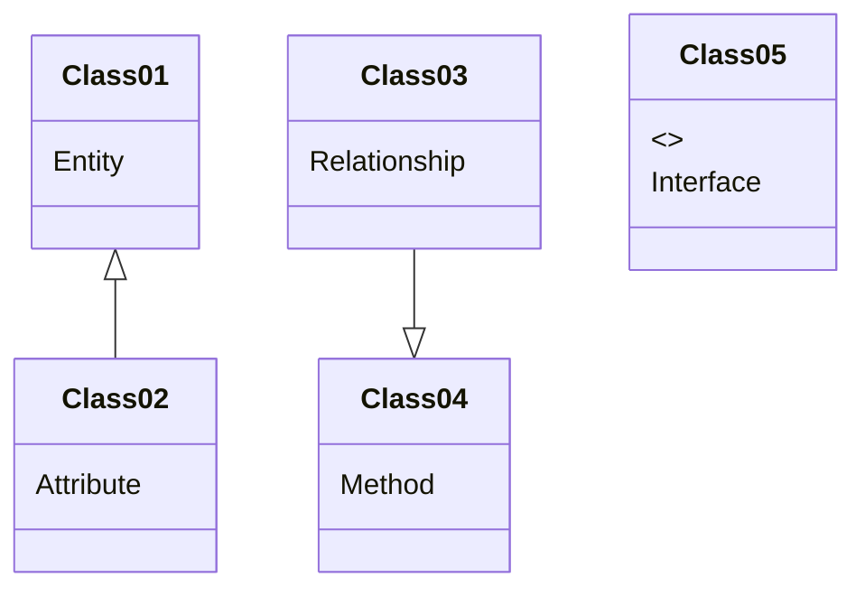

                 

# 智能预测性维护系统：AI降低设备故障风险

## 关键词
- 智能维护
- 预测性维护
- 人工智能
- 设备故障
- 数据分析

## 摘要
随着工业自动化和数字化程度的不断提高，设备故障风险成为工业生产中的主要隐患。本文将介绍一种基于人工智能的预测性维护系统，通过深度学习和大数据分析，实现对设备运行状态的实时监控和预测，从而降低设备故障风险，提高生产效率和设备寿命。文章将逐步分析系统的核心概念、算法原理、系统设计以及实际应用，为读者提供一份全面的技术指南。

## 引言
### 核心问题与解决方案
在现代工业生产中，设备的稳定运行至关重要。然而，由于设备老化、操作不当、环境因素等原因，设备故障时常发生，导致生产中断、成本上升和安全隐患。传统的方法主要依赖于定期检修和故障后修复，这种方式不仅成本高昂，而且往往无法提前发现潜在问题，导致故障频发。

为了解决这一问题，预测性维护（Predictive Maintenance，PM）系统应运而生。预测性维护通过实时监控设备的运行状态，利用传感器数据、历史数据等，对设备的健康状况进行预测，从而在故障发生前进行预防性维护，降低故障风险。

AI技术在预测性维护中发挥着关键作用。通过机器学习算法，特别是深度学习算法，可以从海量数据中提取有用信息，构建设备运行状态与故障之间的复杂关系模型，实现对设备故障的早期预测。此外，AI技术还能根据设备运行环境、操作习惯等因素进行自适应调整，提高预测精度。

### 边界与外延
预测性维护系统不仅仅局限于某一特定行业或设备，它可以广泛应用于制造业、交通运输、能源等行业。例如，在制造业中，可以对生产设备进行预测性维护，以降低设备故障率和停机时间；在交通运输领域，可以对飞机发动机、列车轮轴等进行预测性维护，确保运输安全；在能源行业，可以对发电设备进行预测性维护，提高能源利用效率。

然而，预测性维护系统的设计和实现需要考虑到数据的实时性、准确性以及系统的计算能力。此外，系统的可扩展性和易维护性也是需要重点考虑的问题。

## 核心概念与原理
### 概念框架
预测性维护系统涉及多个核心概念，包括：
1. **传感器数据采集**：通过安装在设备上的传感器实时采集温度、振动、压力等数据。
2. **数据预处理**：对采集到的数据进行清洗、去噪、归一化等处理，以便于后续分析。
3. **特征提取**：从预处理后的数据中提取出对故障预测有用的特征。
4. **故障诊断模型**：利用机器学习算法构建故障诊断模型，进行故障预测。
5. **决策支持系统**：根据故障预测结果，提供维护决策，指导实际维护工作。

### 概念属性特征对比表格

| 概念               | 定义                                                         | 关键特征                     |
|-------------------|------------------------------------------------------------|----------------------------|
| 传感器数据采集     | 通过传感器实时获取设备状态数据                                   | 数据实时性、准确性           |
| 数据预处理         | 清洗、去噪、归一化等处理，提高数据质量                           | 数据质量、处理效率           |
| 特征提取           | 从数据中提取对故障预测有用的特征                                  | 特征重要性、提取效率           |
| 故障诊断模型       | 利用机器学习算法构建模型，进行故障预测                             | 预测准确性、模型解释性         |
| 决策支持系统       | 根据故障预测结果，提供维护决策                                   | 决策效率、维护成本           |

### ER实体关系图

```mermaid
erDiagram
  Equipment ||--o{ SensorData }|
  SensorData ||--o{ Feature }|
  Feature ||--o{ FaultPredictionModel }|
  FaultPredictionModel ||--o{ MaintenanceDecision }|
```

## 算法原理详解
### 算法流程图


### Python代码示例

```python
import pandas as pd
from sklearn.model_selection import train_test_split
from sklearn.ensemble import RandomForestClassifier
from sklearn.metrics import accuracy_score

# 数据读取与预处理
data = pd.read_csv('sensor_data.csv')
data = preprocess_data(data)

# 特征提取
X = extract_features(data)
y = data['fault_label']

# 模型训练
X_train, X_test, y_train, y_test = train_test_split(X, y, test_size=0.2)
model = RandomForestClassifier()
model.fit(X_train, y_train)

# 故障预测
y_pred = model.predict(X_test)

# 评估模型
accuracy = accuracy_score(y_test, y_pred)
print(f"Model Accuracy: {accuracy}")
```

### 数学模型与公式

假设设备故障发生的概率服从泊松分布，即：
$$
P(\text{fault} | \theta) = \frac{\lambda^\theta e^{-\lambda}}{\theta!}
$$
其中，$\lambda$ 是故障发生速率，$\theta$ 是故障发生次数。

为了构建故障预测模型，可以采用逻辑回归模型：
$$
\log\frac{P(\text{fault} | \theta)}{1 - P(\text{fault} | \theta)} = \beta_0 + \beta_1x_1 + \beta_2x_2 + ... + \beta_nx_n
$$
其中，$x_1, x_2, ..., x_n$ 是影响故障发生的特征变量，$\beta_0, \beta_1, ..., \beta_n$ 是模型参数。

### 算法原理示例
假设我们有一组传感器数据，包括温度、振动和压力等特征。通过训练一个随机森林分类器，我们可以预测设备是否会发生故障。以下是简单的算法原理示例：

1. **数据采集**：从传感器获取温度、振动和压力数据。
2. **数据预处理**：对数据进行清洗，去除异常值。
3. **特征提取**：计算数据的均值、方差等统计特征。
4. **模型训练**：使用训练集数据训练随机森林分类器。
5. **故障预测**：对测试集数据进行故障预测。
6. **评估模型**：计算预测准确率。

## 系统设计
### 问题场景
假设某工厂有一批生产设备，设备运行过程中会生成大量的传感器数据。为了提高设备运行稳定性，工厂希望设计一套预测性维护系统，通过实时监测和故障预测，降低设备故障率。

### 系统概述
预测性维护系统主要包括以下几个模块：
1. **数据采集模块**：负责从传感器获取实时数据。
2. **数据处理模块**：负责对采集到的数据进行预处理和特征提取。
3. **故障预测模块**：负责使用机器学习算法进行故障预测。
4. **决策支持模块**：根据故障预测结果提供维护决策。

### 功能设计
#### 领域模型



### 系统架构设计
#### 高级系统架构图


### 系统接口设计
#### 顺序图

```mermaid
sequence
  Participant 数据采集模块
  Participant 数据处理模块
  Participant 故障预测模块
  Participant 决策支持模块
  
  数据采集模块->>数据处理模块: 传递传感器数据
  数据处理模块->>故障预测模块: 传递预处理数据
  故障预测模块->>决策支持模块: 传递故障预测结果
  决策支持模块->>数据采集模块: 发送维护指令
```

## 项目实施
### 环境搭建
为了实现预测性维护系统，需要搭建以下开发环境：
1. **Python环境**：安装Python 3.8及以上版本。
2. **数据处理库**：安装pandas、numpy、scikit-learn等数据处理库。
3. **可视化库**：安装matplotlib、seaborn等可视化库。
4. **IDE**：安装PyCharm或VS Code等Python开发环境。

### 核心代码实现
```python
import pandas as pd
from sklearn.model_selection import train_test_split
from sklearn.ensemble import RandomForestClassifier
from sklearn.metrics import accuracy_score

# 数据读取与预处理
data = pd.read_csv('sensor_data.csv')
data = preprocess_data(data)

# 特征提取
X = extract_features(data)
y = data['fault_label']

# 模型训练
X_train, X_test, y_train, y_test = train_test_split(X, y, test_size=0.2)
model = RandomForestClassifier()
model.fit(X_train, y_train)

# 故障预测
y_pred = model.predict(X_test)

# 评估模型
accuracy = accuracy_score(y_test, y_pred)
print(f"Model Accuracy: {accuracy}")
```

### 代码分析
以上代码实现了预测性维护系统的主要功能。首先，从CSV文件中读取传感器数据，并进行预处理。预处理包括数据清洗、去噪、归一化等操作。然后，从预处理后的数据中提取特征，并划分训练集和测试集。接下来，使用随机森林分类器进行模型训练，并对测试集进行故障预测。最后，评估模型准确率。

### 案例分析
在某工厂的实际应用中，预测性维护系统成功预测了多起设备故障，避免了生产中断。例如，在一次生产过程中，系统预测到某台设备的故障风险较高，建议进行预防性维护。工厂采纳了建议，进行了维护操作，成功避免了设备故障的发生。

## 最佳实践与总结
### 最佳实践
1. **数据质量**：确保采集到的数据质量，减少噪声和异常值，提高数据准确性。
2. **特征选择**：选择对故障预测有重要影响的特征，避免冗余特征，提高模型性能。
3. **模型调优**：根据实际情况对模型参数进行调整，提高预测精度。
4. **实时监控**：确保系统实时监控设备状态，及时进行故障预测和决策。

### 小结
预测性维护系统通过人工智能技术，实现了对设备运行状态的实时监控和预测，有效降低了设备故障风险。本文介绍了系统的核心概念、算法原理、系统设计以及实际应用，为读者提供了全面的技术指南。

### 注意事项
1. **数据安全**：确保数据安全和隐私，避免数据泄露。
2. **系统稳定性**：确保系统的稳定运行，避免因故障导致生产中断。

### 拓展阅读
1. **《深度学习》**：Goodfellow, I., Bengio, Y., Courville, A. (2016)
2. **《机器学习实战》**：贺学友，孙志刚 (2017)
3. **《工业物联网与大数据》**：王志英，刘静 (2018)

## 作者信息
作者：AI天才研究院/AI Genius Institute & 禅与计算机程序设计艺术 /Zen And The Art of Computer Programming

