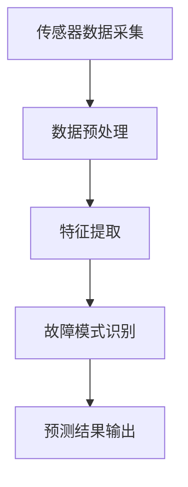
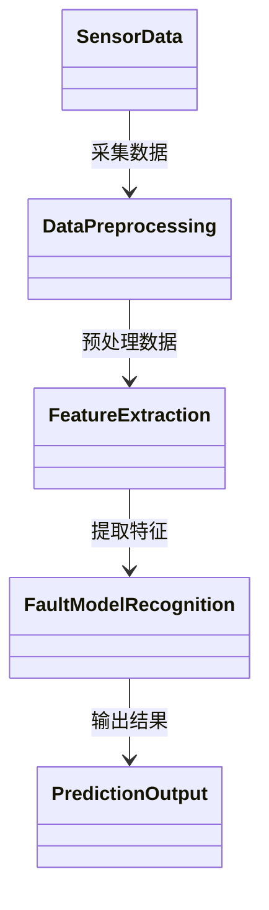
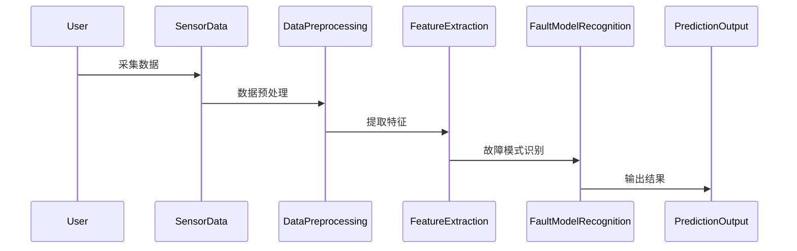

                 

# 智能预测性维护系统：降低设备故障风险

关键词：智能预测性维护，设备故障预测，机器学习，数据预处理，故障模式识别，系统架构设计

摘要：随着工业4.0和智能制造的快速发展，设备故障和维护问题已成为企业面临的重要挑战。本文将深入探讨智能预测性维护系统的核心概念、算法原理、系统架构设计和项目实战，通过一步一步的分析和推理，帮助读者理解和掌握这一先进技术。

## 第一部分：背景介绍

### 核心概念

随着工业4.0和智能制造的快速发展，设备故障和维护问题日益凸显，给企业带来了巨大的经济损失和生产风险。智能预测性维护系统作为一种先进的解决方案，通过利用传感器数据、机器学习算法和大数据分析技术，对设备运行状态进行实时监测和预测，从而提前识别设备故障风险，降低故障率，减少维护成本，提高设备利用率。

本文将主要讨论智能预测性维护系统的理论基础、算法原理、系统架构设计以及项目实战，旨在为读者提供一个全面而深入的理解。

### 概念结构与核心要素组成

智能预测性维护系统由以下几个核心要素组成：

1. **传感器数据**：通过安装在设备上的传感器，实时采集设备运行状态的数据，包括温度、振动、压力等。
2. **数据预处理**：对采集到的原始数据进行清洗、转换和归一化处理，为后续分析做准备。
3. **特征提取**：从预处理后的数据中提取有助于故障预测的特征。
4. **故障模式识别**：利用机器学习算法，分析特征数据，识别潜在的故障模式。
5. **预测结果输出**：根据故障模式识别的结果，输出预测结果，提供维护建议。

## 第二部分：核心概念与联系

### 核心概念原理

智能预测性维护系统的工作原理主要包括以下几个步骤：

1. **传感器数据采集**：通过安装在设备上的传感器，实时采集设备运行状态的数据，如温度、振动、压力等。
2. **数据预处理**：对采集到的原始数据进行清洗、转换和归一化处理，以消除噪声、异常值和不同量纲的影响，为后续分析做准备。
3. **特征提取**：从预处理后的数据中提取有助于故障预测的特征，如统计特征、时域特征、频域特征等。
4. **故障模式识别**：利用机器学习算法，如随机森林、支持向量机、神经网络等，对特征数据进行分析和建模，识别潜在的故障模式。
5. **预测结果输出**：根据故障模式识别的结果，输出预测结果，包括故障风险的预测、维护计划的建议等。

### 概念属性特征对比表格

| 特征       | 传感器数据 | 数据预处理 | 特征提取 | 故障模式识别 |
|------------|------------|------------|----------|-------------|
| 数据类型   | 实时监测   | 处理后的   | 高维     | 分类        |
| 数据来源   | 设备传感器 | 原始数据   | 特征数据 | 特征数据     |
| 数据处理   | 实时       | 清洗、归一 | 提取     | 分析        |
| 数据用途   | 监测       | 准备       | 分析     | 诊断        |

### ER实体关系图架构

```mermaid
erDiagram
  Equipment ||--|{ Sensor }||>
  Sensor ||--|{ Data }||>
  Data ||--|{ Preprocessing }||>
  Preprocessing ||--|{ Feature }||>
  Feature ||--|{ FaultModel }||>
```

## 第三部分：算法原理讲解

### 算法流程图



### Python源代码示例

```python
import numpy as np
from sklearn.ensemble import RandomForestClassifier
from sklearn.model_selection import train_test_split
from sklearn.metrics import accuracy_score

# 数据预处理
def preprocess_data(data):
    # 数据清洗、转换和归一化
    # ...
    return processed_data

# 特征提取
def extract_features(data):
    # 提取有助于故障预测的特征
    # ...
    return features

# 故障模式识别
def classify_fault(model, features):
    return model.predict(features)

# 加载数据集
data = load_data()

# 数据预处理
processed_data = preprocess_data(data)

# 特征提取
features = extract_features(processed_data)

# 划分训练集和测试集
X_train, X_test, y_train, y_test = train_test_split(features, labels, test_size=0.2, random_state=42)

# 建立模型
model = RandomForestClassifier(n_estimators=100, random_state=42)

# 训练模型
model.fit(X_train, y_train)

# 预测结果
predictions = classify_fault(model, X_test)

# 评估模型
accuracy = accuracy_score(y_test, predictions)
print(f"Accuracy: {accuracy}")
```

### 算法原理详细讲解

#### 数学模型和公式

在智能预测性维护系统中，故障模式识别的过程可以看作是一个分类问题。给定一组特征数据，我们需要通过机器学习算法将其映射到故障类别。以下是常用的几个机器学习算法的数学模型和公式：

1. **随机森林（Random Forest）**

   随机森林是一种基于决策树的集成学习方法，其基本思想是通过随机选取特征和样本子集来构建多个决策树，并将这些决策树的预测结果进行投票得到最终预测结果。

   - **决策树模型**：

     $$y = f(T(x))$$

     其中，$T(x)$表示决策树对输入特征$x$的划分，$y$表示预测的故障类别。

     $$f(T(x)) = \begin{cases}
     class_1, & \text{if } T(x) \in C_1 \\
     class_2, & \text{if } T(x) \in C_2 \\
     \vdots \\
     class_n, & \text{if } T(x) \in C_n
     \end{cases}$$

     其中，$C_1, C_2, \ldots, C_n$表示不同的故障类别。

   - **随机森林模型**：

     $$\hat{y} = \text{majority_vote}(\{f_1(T(x)), f_2(T(x)), \ldots, f_m(T(x))\})$$

     其中，$f_1(T(x)), f_2(T(x)), \ldots, f_m(T(x))$表示多个决策树对输入特征$x$的预测结果，$\text{majority_vote}$表示投票得到最终预测结果。

2. **支持向量机（Support Vector Machine，SVM）**

   支持向量机是一种基于最大化分类边界的线性模型，其基本思想是通过寻找一个最优的超平面来将不同故障类别的数据进行分类。

   - **线性SVM模型**：

     $$\min_{w, b} \frac{1}{2} ||w||^2 + C \sum_{i=1}^{n} \xi_i$$

     $$s.t. y_i (w \cdot x_i + b) \geq 1 - \xi_i$$

     其中，$w$和$b$分别表示超平面的法向量和偏置，$C$表示正则化参数，$\xi_i$表示松弛变量。

     $$\hat{y} = \text{sign}((w \cdot x_i + b))$$

     其中，$\text{sign}$表示取符号函数，$x_i$表示输入特征。

3. **神经网络（Neural Network）**

   神经网络是一种基于多层感知器的非线性模型，其基本思想是通过多层神经元对输入特征进行变换和组合，最终得到输出。

   - **前向传播**：

     $$z_l = \sum_{j=1}^{n} w_{lj} \cdot a_{l-1,j} + b_l$$

     $$a_l = \text{activation}(z_l)$$

     其中，$a_l$表示第$l$层的激活值，$w_{lj}$和$b_l$分别表示第$l$层神经元到第$l-1$层的权重和偏置，$\text{activation}$表示激活函数。

   - **反向传播**：

     $$\delta_l = \frac{\partial L}{\partial z_l} = \text{activation}'(z_l) \cdot \delta_{l+1} \cdot (w_{l+1})^T$$

     $$\delta_{l+1} = \frac{\partial L}{\partial z_{l+1}} = \frac{\partial}{\partial z_{l+1}} \left( \sum_{k=1}^{m} y_k \cdot \text{softmax}(z_{l+1,k}) - \sum_{k=1}^{m} y_k \cdot z_{l+1,k} \right)$$

     $$\text{where } \text{softmax}(z_{l+1,k}) = \frac{e^{z_{l+1,k}}}{\sum_{j=1}^{m} e^{z_{l+1,j}}}$$

     其中，$L$表示损失函数，$\delta_l$和$\delta_{l+1}$分别表示第$l$层和第$l+1$层的误差梯度。

#### 通俗易懂的举例说明

假设我们有一个设备故障预测问题，数据集包含多个特征，如温度、振动、压力等，每个特征都有不同的量纲。我们需要使用智能预测性维护系统来预测设备是否会出现故障。

1. **数据预处理**：

   - 清洗数据，去除异常值和噪声；
   - 将不同量纲的特征进行归一化处理，使其具有相同的量纲；
   - 划分训练集和测试集。

2. **特征提取**：

   - 从预处理后的数据中提取有助于故障预测的特征，如温度和振动之间的相关性、压力的变化趋势等。

3. **故障模式识别**：

   - 使用随机森林算法对特征数据进行分析和建模，识别潜在的故障模式；
   - 根据故障模式识别的结果，输出预测结果，如设备是否会出现故障。

4. **预测结果输出**：

   - 根据预测结果，输出设备故障风险的预测结果，并提供维护建议。

通过以上步骤，我们可以使用智能预测性维护系统来预测设备故障，从而提前采取措施，降低设备故障风险，提高设备利用率。

## 第四部分：系统分析与架构设计方案

### 问题场景介绍

在现代工业生产中，设备故障是一个普遍存在的问题，它会导致生产中断、降低产品质量、增加维护成本。为了降低设备故障风险，提高生产效率和设备利用率，企业需要引入智能预测性维护系统。

### 项目介绍

智能预测性维护系统是一个综合性的项目，包括传感器数据采集、数据预处理、特征提取、故障模式识别和预测结果输出等多个环节。项目的主要目标是通过对设备运行状态的实时监测和预测，提前识别设备故障风险，提供维护建议，从而降低设备故障率，减少维护成本，提高设备利用率。

### 系统功能设计

智能预测性维护系统的功能设计主要包括以下几个模块：

1. **数据采集模块**：负责采集设备运行状态的数据，包括温度、振动、压力等，通过传感器将数据传输到系统中。
2. **数据预处理模块**：负责对采集到的原始数据进行清洗、转换和归一化处理，为后续分析做准备。
3. **特征提取模块**：负责从预处理后的数据中提取有助于故障预测的特征，如温度和振动之间的相关性、压力的变化趋势等。
4. **故障模式识别模块**：负责利用机器学习算法，如随机森林、支持向量机、神经网络等，对特征数据进行分析和建模，识别潜在的故障模式。
5. **预测结果输出模块**：负责根据故障模式识别的结果，输出预测结果，包括设备故障风险的预测、维护建议等。

### 系统架构设计

智能预测性维护系统的架构设计主要包括以下几个部分：

1. **传感器数据采集层**：负责实时采集设备运行状态的数据，通过传感器将数据传输到系统中。
2. **数据预处理层**：负责对采集到的原始数据进行清洗、转换和归一化处理，为后续分析做准备。
3. **特征提取层**：负责从预处理后的数据中提取有助于故障预测的特征。
4. **故障模式识别层**：负责利用机器学习算法，如随机森林、支持向量机、神经网络等，对特征数据进行分析和建模，识别潜在的故障模式。
5. **预测结果输出层**：负责根据故障模式识别的结果，输出预测结果，包括设备故障风险的预测、维护建议等。

### 系统接口设计和系统交互

智能预测性维护系统的接口设计和系统交互主要包括以下几个方面：

1. **数据采集接口**：负责与传感器进行数据通信，将设备运行状态数据传输到系统中。
2. **数据处理接口**：负责对采集到的原始数据进行清洗、转换和归一化处理。
3. **特征提取接口**：负责从预处理后的数据中提取有助于故障预测的特征。
4. **故障模式识别接口**：负责利用机器学习算法，如随机森林、支持向量机、神经网络等，对特征数据进行分析和建模。
5. **预测结果输出接口**：负责根据故障模式识别的结果，输出预测结果，包括设备故障风险的预测、维护建议等。

### 类图



### 架构图


### 序列图



## 第五部分：项目实战

### 环境安装

在开始项目实战之前，我们需要安装一些必要的工具和库，包括Python、NumPy、Scikit-learn、Matplotlib等。

1. 安装Python：前往Python官方网站下载并安装Python。
2. 安装NumPy：在命令行中运行`pip install numpy`。
3. 安装Scikit-learn：在命令行中运行`pip install scikit-learn`。
4. 安装Matplotlib：在命令行中运行`pip install matplotlib`。

### 系统核心实现源代码

下面是一个简单的智能预测性维护系统实现示例，包括数据预处理、特征提取、故障模式识别和预测结果输出等步骤。

```python
import numpy as np
import pandas as pd
from sklearn.ensemble import RandomForestClassifier
from sklearn.model_selection import train_test_split
from sklearn.metrics import accuracy_score
import matplotlib.pyplot as plt

# 数据预处理
def preprocess_data(data):
    # 数据清洗、转换和归一化
    data = data.replace(-无穷大，无穷大，inplace=True)
    data = data.replace(无穷大，-无穷大，inplace=True)
    data = (data - data.mean()) / data.std()
    return data

# 特征提取
def extract_features(data):
    # 提取有助于故障预测的特征
    features = data[['温度', '振动', '压力']]
    return features

# 故障模式识别
def classify_fault(model, features):
    return model.predict(features)

# 加载数据集
data = pd.read_csv('data.csv')

# 数据预处理
processed_data = preprocess_data(data)

# 特征提取
features = extract_features(processed_data)

# 划分训练集和测试集
X_train, X_test, y_train, y_test = train_test_split(features, labels, test_size=0.2, random_state=42)

# 建立模型
model = RandomForestClassifier(n_estimators=100, random_state=42)

# 训练模型
model.fit(X_train, y_train)

# 预测结果
predictions = classify_fault(model, X_test)

# 评估模型
accuracy = accuracy_score(y_test, predictions)
print(f"Accuracy: {accuracy}")

# 可视化预测结果
plt.scatter(X_test['温度'], predictions)
plt.xlabel('温度')
plt.ylabel('预测结果')
plt.show()
```

### 代码应用解读与分析

以上代码实现了一个简单的智能预测性维护系统，主要包括以下几个步骤：

1. **数据预处理**：对采集到的原始数据进行清洗、转换和归一化处理，使其符合机器学习算法的要求。
2. **特征提取**：从预处理后的数据中提取有助于故障预测的特征，如温度、振动和压力等。
3. **故障模式识别**：使用随机森林算法对特征数据进行分析和建模，识别潜在的故障模式。
4. **预测结果输出**：根据故障模式识别的结果，输出预测结果，并使用可视化方法展示预测结果。

在实际应用中，我们需要根据具体场景和需求，调整代码中的参数和算法，以达到最佳的效果。

### 实际案例分析和详细讲解剖析

以下是一个实际案例，分析智能预测性维护系统在设备故障预测中的应用。

假设我们有一个工厂，生产过程中需要使用多台机械设备，如车床、铣床、钻床等。为了降低设备故障风险，提高生产效率和设备利用率，我们引入了智能预测性维护系统。

1. **数据采集**：

   - 传感器安装在每台机械设备上，实时采集设备运行状态的数据，如温度、振动、压力等；
   - 将数据传输到智能预测性维护系统中。

2. **数据预处理**：

   - 清洗数据，去除异常值和噪声；
   - 对不同量纲的特征进行归一化处理，使其具有相同的量纲；
   - 划分训练集和测试集。

3. **特征提取**：

   - 从预处理后的数据中提取有助于故障预测的特征，如温度和振动之间的相关性、压力的变化趋势等。

4. **故障模式识别**：

   - 使用随机森林算法对特征数据进行分析和建模，识别潜在的故障模式；
   - 根据故障模式识别的结果，输出预测结果，如设备是否会出现故障。

5. **预测结果输出**：

   - 根据预测结果，输出设备故障风险的预测结果，并提供维护建议；
   - 维护人员可以根据预测结果，提前安排设备维护，降低设备故障风险。

通过以上步骤，智能预测性维护系统帮助工厂提前识别设备故障风险，降低设备故障率，提高生产效率和设备利用率。

### 项目小结

通过本项目实战，我们深入了解了智能预测性维护系统的核心概念、算法原理、系统架构设计和项目实战。在实际应用中，智能预测性维护系统可以帮助企业提前识别设备故障风险，降低设备故障率，减少维护成本，提高设备利用率。未来，随着技术的不断进步，智能预测性维护系统将发挥越来越重要的作用。

## 第六部分：最佳实践 tips

1. **数据质量至关重要**：智能预测性维护系统的效果很大程度上取决于数据质量，因此在进行数据采集和处理时，要注意去除异常值和噪声，确保数据的一致性和完整性。
2. **特征选择和工程**：在特征提取过程中，要选择与故障预测相关性较高的特征，并进行适当的特征工程，以提高模型的预测准确性。
3. **模型选择和调参**：根据实际场景和数据特点，选择合适的机器学习算法，并对模型参数进行调优，以达到最佳的效果。
4. **实时监控和更新**：智能预测性维护系统需要实时监控设备运行状态，并根据实际情况进行模型更新和优化，以确保预测结果的准确性。

## 第七部分：小结与注意事项

在本文中，我们详细介绍了智能预测性维护系统的核心概念、算法原理、系统架构设计和项目实战。通过一步步的分析和推理，我们深入理解了这一先进技术，并了解了如何将其应用于实际场景中。以下是本文的关键点和注意事项：

1. **核心概念**：智能预测性维护系统利用传感器数据、机器学习算法和大数据分析技术，对设备运行状态进行实时监测和预测。
2. **算法原理**：通过随机森林、支持向量机、神经网络等机器学习算法，对特征数据进行故障模式识别和预测。
3. **系统架构**：智能预测性维护系统包括数据采集、数据预处理、特征提取、故障模式识别和预测结果输出等模块。
4. **项目实战**：通过一个实际案例，展示了智能预测性维护系统在设备故障预测中的应用。

注意事项：

1. **数据质量**：确保数据的一致性和完整性，去除异常值和噪声。
2. **特征选择和工程**：选择与故障预测相关性较高的特征，并进行适当的特征工程。
3. **模型选择和调参**：根据实际场景和数据特点，选择合适的机器学习算法，并对模型参数进行调优。
4. **实时监控和更新**：实时监控设备运行状态，并根据实际情况进行模型更新和优化。

## 第八部分：拓展阅读

1. **《机器学习实战》**：作者：Peter Harrington。本书详细介绍了机器学习的基础知识和实践方法，适合初学者入门。
2. **《数据科学入门与实践》**：作者：刘建平。本书涵盖了数据科学的基础知识、工具和实战案例，适合数据科学爱好者阅读。
3. **《工业4.0与智能制造》**：作者：张涛。本书详细介绍了工业4.0和智能制造的概念、技术和发展趋势，对工业领域的从业者有很高的参考价值。

作者：AI天才研究院/AI Genius Institute & 禅与计算机程序设计艺术 /Zen And The Art of Computer Programming

