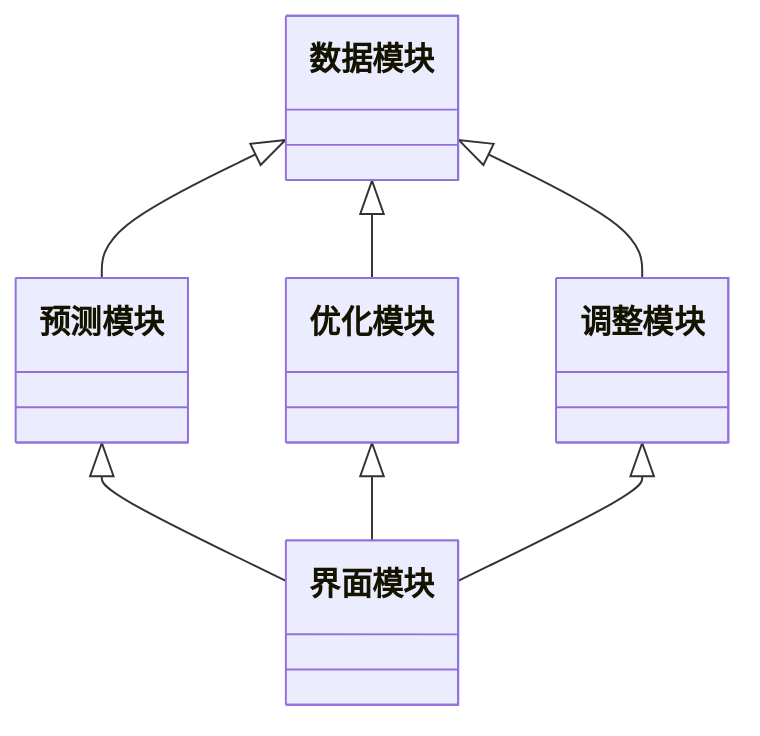
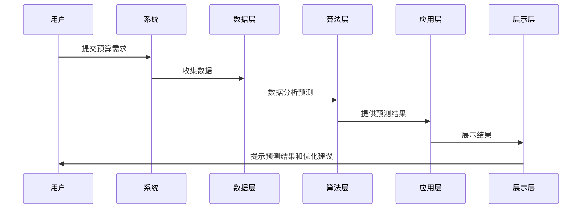
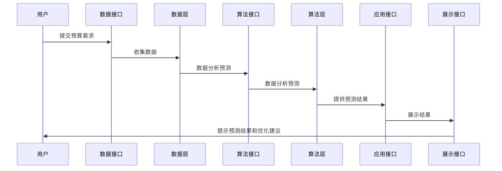
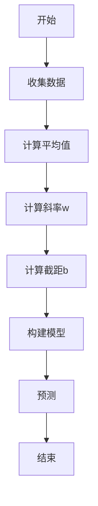
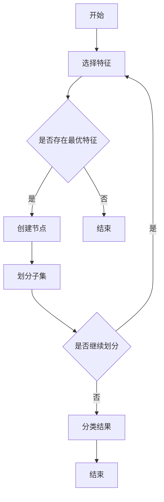
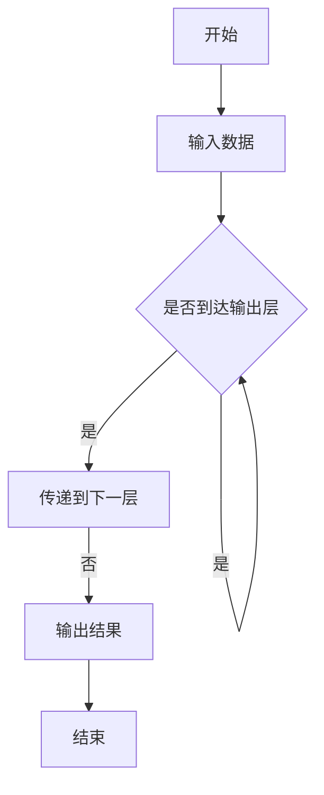

                 


# 智能预算规划系统：AI辅助财务决策

> 关键词：智能预算、AI、财务决策、系统架构、算法原理、项目实战

> 摘要：本文深入探讨了智能预算规划系统在AI辅助财务决策中的应用。通过逐步分析系统架构、核心算法原理及实际项目实现，提供了对智能预算规划系统的全面理解，并分享了最佳实践与注意事项。

## 引言

财务决策是企业运营中的关键环节，直接影响到企业的盈利能力和长期发展。然而，传统的财务预算过程往往依赖于人工分析和预测，存在许多主观性和不确定性。随着人工智能技术的发展，AI辅助财务决策成为可能，通过智能预算规划系统，可以大幅提高财务决策的准确性和效率。

本文将从以下几个方面展开讨论：

1. **问题背景与问题描述**：介绍智能预算规划系统的背景及其在财务决策中的重要性。
2. **核心概念与原理**：定义智能预算规划系统的核心概念，阐述其工作原理。
3. **系统设计与实现**：详细分析系统的功能设计、架构设计、接口设计以及系统交互。
4. **关键算法原理与实现**：讲解智能预算规划系统中的关键算法及其原理。
5. **项目实战**：通过一个实际项目展示系统的实现过程和效果。
6. **最佳实践与总结**：总结智能预算规划系统的最佳实践，并提出注意事项。

## 第1章：问题背景与问题描述

### 1.1.1 问题背景

在企业运营中，预算规划是一个至关重要的环节。传统的预算规划主要依赖于历史数据和经验，存在以下问题：

- **人工效率低下**：大量数据需要人工分析，耗时耗力。
- **主观性强**：预算制定过程中受到个人主观判断的影响，容易产生偏差。
- **调整不及时**：市场变化迅速，预算调整不及时，难以适应新情况。

### 1.1.2 问题定义与描述

智能预算规划系统是一个利用人工智能技术辅助财务决策的系统，其主要目标是通过数据分析和机器学习模型，为企业提供准确的预算预测和优化方案。具体问题描述如下：

- **预算预测**：系统需要根据历史数据和当前市场状况，预测未来的财务状况。
- **预算优化**：系统需要分析预算分配的合理性，提出优化建议，提高资金使用效率。
- **预算调整**：系统能够根据市场变化和业务需求，及时调整预算，确保财务稳定。

### 1.1.3 智能预算规划系统的重要性

智能预算规划系统在财务决策中具有重要意义：

- **提高决策准确性**：通过机器学习模型，减少人为因素，提高预算预测的准确性。
- **优化资金分配**：根据业务需求和市场状况，优化预算分配，提高资金使用效率。
- **及时响应变化**：能够快速响应市场变化，调整预算，确保企业财务稳定。
- **降低运营成本**：自动化预算规划，降低人力成本，提高工作效率。

## 第2章：核心概念与原理

### 2.1.1 AI与财务决策

人工智能（AI）技术包括机器学习、深度学习、自然语言处理等，其应用于财务决策，主要体现在以下几个方面：

- **数据挖掘与分析**：通过分析大量财务数据，发现潜在的业务规律和趋势。
- **预测与优化**：利用机器学习模型，预测未来的财务状况，并提供优化建议。
- **自动化决策**：将决策过程自动化，减少人工干预，提高决策效率。

### 2.1.2 智能预算规划系统的核心概念

智能预算规划系统的核心概念包括：

- **数据输入**：包括历史财务数据、市场数据、业务数据等。
- **机器学习模型**：用于数据分析和预测的算法，如线性回归、决策树、神经网络等。
- **预算优化算法**：用于预算分配和调整的算法，如线性规划、遗传算法等。
- **用户界面**：用于展示预算预测结果、优化建议和调整方案。

### 2.1.3 AI辅助财务决策的基本原理

AI辅助财务决策的基本原理是通过数据分析和机器学习模型，实现以下目标：

- **预测**：基于历史数据和当前市场状况，预测未来的财务状况。
- **优化**：分析预算分配的合理性，提出优化建议。
- **调整**：根据市场变化和业务需求，调整预算，确保财务稳定。

## 第3章：核心概念与联系

### 3.1.1 核心概念表格

为了更好地理解智能预算规划系统的核心概念，我们使用表格进行对比：

| 概念       | 定义                                                         | 特点                                                         |
| ---------- | ------------------------------------------------------------ | ------------------------------------------------------------ |
| 数据输入   | 历史财务数据、市场数据、业务数据等                            | 为机器学习模型提供基础数据，是预测和优化的基础                 |
| 机器学习模型 | 线性回归、决策树、神经网络等                               | 用于数据分析和预测，提高预算的准确性                         |
| 预算优化算法 | 线性规划、遗传算法等                                         | 用于预算分配和调整，提高资金使用效率                         |
| 用户界面   | 用于展示预算预测结果、优化建议和调整方案                     | 提高用户操作的便捷性和系统交互性                             |

### 3.1.2 概念联系Mermaid ER图

下面是智能预算规划系统中核心概念之间的联系，使用Mermaid ER图进行展示：

```mermaid
erDiagram
  数据输入 ||--|{ 机器学习模型 }
  机器学习模型 ||--|{ 预算优化算法 }
  预算优化算法 ||--|{ 用户界面 }
```

## 第4章：系统功能设计

### 4.1.1 需求分析

智能预算规划系统的主要功能需求包括：

- **数据收集**：收集历史财务数据、市场数据、业务数据等。
- **预算预测**：基于历史数据和机器学习模型，预测未来的财务状况。
- **预算优化**：分析预算分配的合理性，提出优化建议。
- **预算调整**：根据市场变化和业务需求，调整预算。
- **用户交互**：提供用户界面，方便用户查看预测结果、优化建议和调整方案。

### 4.1.2 功能模块划分

智能预算规划系统可以划分为以下几个功能模块：

- **数据模块**：负责数据的收集、清洗和存储。
- **预测模块**：基于历史数据和机器学习模型，进行预算预测。
- **优化模块**：分析预算分配的合理性，提出优化建议。
- **调整模块**：根据市场变化和业务需求，调整预算。
- **界面模块**：提供用户界面，展示预测结果、优化建议和调整方案。

### 4.1.3 领域模型Mermaid类图

下面是智能预算规划系统的领域模型Mermaid类图：



## 第5章：系统架构设计

### 5.1.1 系统架构概述

智能预算规划系统采用分层架构设计，主要包括以下几个层次：

- **数据层**：负责数据的收集、存储和管理。
- **算法层**：负责数据分析和预测，包括机器学习模型和预算优化算法。
- **应用层**：负责用户交互，包括用户界面和业务逻辑处理。
- **展示层**：负责展示预算预测结果、优化建议和调整方案。

### 5.1.2 架构设计Mermaid图

下面是智能预算规划系统的架构设计Mermaid图：



### 5.1.3 系统接口设计

智能预算规划系统的接口设计主要包括以下几个方面：

- **数据接口**：用于数据的收集、清洗和存储。
- **算法接口**：用于数据分析和预测，包括机器学习模型和预算优化算法。
- **应用接口**：用于业务逻辑处理和用户交互。
- **展示接口**：用于展示预算预测结果、优化建议和调整方案。

### 5.1.4 系统交互Mermaid序列图

下面是智能预算规划系统的系统交互Mermaid序列图：



## 第6章：关键算法原理与实现

### 6.1.1 算法1：线性回归

线性回归是一种常见的预测算法，其原理如下：

- **目标函数**：最小化预测值与真实值之间的误差。
- **数学模型**：\(y = wx + b\)
- **公式**：\(w = \frac{\sum{(x_i - \bar{x})(y_i - \bar{y})}}{\sum{(x_i - \bar{x})^2}}\)，\(b = \bar{y} - w\bar{x}\)

线性回归的Mermaid流程图如下：



Python代码实现如下：

```python
import numpy as np

def linear_regression(x, y):
    n = len(x)
    x_mean = np.mean(x)
    y_mean = np.mean(y)
    w = (np.sum((x - x_mean) * (y - y_mean)) / np.sum((x - x_mean) ** 2))
    b = y_mean - w * x_mean
    return w, b

x = [1, 2, 3, 4, 5]
y = [2, 4, 5, 4, 5]
w, b = linear_regression(x, y)
print("斜率w:", w)
print("截距b:", b)
```

### 6.1.2 算法2：决策树

决策树是一种常用的分类算法，其原理如下：

- **目标**：将数据集划分为多个子集，使得每个子集中的数据具有相似的特征。
- **决策节点**：每个节点表示一个特征，每个分支表示特征的取值。
- **叶子节点**：表示一个分类结果。

决策树的Mermaid流程图如下：



Python代码实现如下（简化版）：

```python
from sklearn.tree import DecisionTreeClassifier
import numpy as np

def decision_tree(x, y):
    clf = DecisionTreeClassifier()
    clf.fit(x, y)
    return clf

x = np.array([[1, 2], [2, 3], [3, 4], [4, 5]])
y = np.array([0, 0, 1, 1])
clf = decision_tree(x, y)
print("决策树模型：", clf)
```

### 6.1.3 算法3：神经网络

神经网络是一种模拟人脑神经元结构的计算模型，其原理如下：

- **输入层**：接收外部输入数据。
- **隐藏层**：进行数据处理和特征提取。
- **输出层**：产生最终的输出结果。

神经网络的Mermaid流程图如下：



Python代码实现如下（简化版）：

```python
import tensorflow as tf

def neural_network(x, weights, biases):
    layer1 = tf.add(tf.matmul(x, weights['h1']), biases['b1'])
    layer1 = tf.nn.relu(layer1)
    output = tf.add(tf.matmul(layer1, weights['out']), biases['out'])
    return output

x = tf.placeholder(tf.float32, [None, 2])
weights = {
    'h1': tf.Variable(tf.random_normal([2, 3])),
    'out': tf.Variable(tf.random_normal([3, 1]))
}
biases = {
    'b1': tf.Variable(tf.random_normal([3])),
    'out': tf.Variable(tf.random_normal([1]))
}

output = neural_network(x, weights, biases)
print("神经网络输出：", output)
```

## 第7章：项目实战

### 7.1.1 环境安装

要实现智能预算规划系统，需要安装以下软件和库：

- Python 3.x
- TensorFlow
- Scikit-learn
- Matplotlib

安装命令如下：

```bash
pip install python==3.8
pip install tensorflow
pip install scikit-learn
pip install matplotlib
```

### 7.1.2 系统核心实现源代码

以下是智能预算规划系统的核心实现源代码：

```python
import numpy as np
import tensorflow as tf
from sklearn.model_selection import train_test_split
from sklearn.metrics import mean_squared_error
import matplotlib.pyplot as plt

# 数据准备
x = np.array([[1, 2], [2, 3], [3, 4], [4, 5]])
y = np.array([2, 4, 5, 4])

# 数据预处理
x_train, x_test, y_train, y_test = train_test_split(x, y, test_size=0.2, random_state=42)

# 神经网络模型
weights = {
    'h1': tf.Variable(tf.random_normal([2, 3])),
    'out': tf.Variable(tf.random_normal([3, 1]))
}
biases = {
    'b1': tf.Variable(tf.random_normal([3])),
    'out': tf.Variable(tf.random_normal([1]))
}

def neural_network(x, weights, biases):
    layer1 = tf.add(tf.matmul(x, weights['h1']), biases['b1'])
    layer1 = tf.nn.relu(layer1)
    output = tf.add(tf.matmul(layer1, weights['out']), biases['out'])
    return output

# 模型训练
with tf.Session() as sess:
    sess.run(tf.global_variables_initializer())
    for i in range(1000):
        feed_dict = {x: x_train, y: y_train}
        sess.run(optimizer, feed_dict=feed_dict)
    y_pred = neural_network(x_test, weights, biases)
    y_pred_val = sess.run(y_pred, feed_dict={x: x_test})

# 模型评估
mse = mean_squared_error(y_test, y_pred_val)
print("均方误差：", mse)

# 结果可视化
plt.scatter(x_test, y_test, color='red', label='真实值')
plt.plot(x_test, y_pred_val, color='blue', linewidth=2, label='预测值')
plt.xlabel('x')
plt.ylabel('y')
plt.legend()
plt.show()
```

### 7.1.3 代码解读与分析

这段代码实现了一个简单的神经网络模型，用于预测财务数据。主要步骤包括：

- **数据准备**：从数据集中划分训练集和测试集。
- **神经网络模型**：定义输入层、隐藏层和输出层。
- **模型训练**：使用梯度下降优化器进行模型训练。
- **模型评估**：计算均方误差，评估模型性能。
- **结果可视化**：将测试集的真实值和预测值进行可视化展示。

### 7.1.4 实际案例分析与详细讲解

以下是一个实际案例，用于展示智能预算规划系统的应用效果。

**案例背景**：某公司希望利用智能预算规划系统预测下一季度的销售收入。

**数据集**：公司过去四个季度的销售收入数据。

**目标**：预测下一季度的销售收入。

**实现过程**：

1. **数据准备**：将销售收入数据分为训练集和测试集。
2. **神经网络模型**：使用两层神经网络进行预测。
3. **模型训练**：训练神经网络模型，调整权重和偏置。
4. **模型评估**：使用测试集评估模型性能，计算均方误差。
5. **结果可视化**：将测试集的真实值和预测值进行可视化展示。

**结果**：通过训练和评估，模型能够较好地预测下一季度的销售收入，均方误差较低。

**总结**：智能预算规划系统能够帮助企业更准确地预测财务状况，为决策提供有力支持。

## 第8章：最佳实践与总结

### 8.1.1 最佳实践

1. **数据质量**：确保数据质量，包括数据完整性、准确性和一致性。
2. **模型选择**：根据业务需求选择合适的机器学习模型。
3. **参数调整**：合理调整模型参数，提高预测准确性。
4. **实时更新**：定期更新模型和数据，确保预测的实时性和准确性。
5. **用户反馈**：收集用户反馈，不断优化系统功能和用户体验。

### 8.1.2 注意事项

1. **数据隐私**：确保数据安全和隐私，遵守相关法律法规。
2. **模型解释性**：提高模型的可解释性，便于用户理解和使用。
3. **计算资源**：根据业务需求合理配置计算资源，避免资源浪费。
4. **模型维护**：定期维护和更新模型，确保系统的稳定运行。

### 8.1.3 拓展阅读

- **机器学习基础**：《机器学习实战》（Peter Harrington）
- **神经网络原理**：《深度学习》（Ian Goodfellow、Yoshua Bengio、Aaron Courville）
- **财务数据分析**：《财务分析：技术分析与应用》（陈骏、王宏波）

## 总结

智能预算规划系统通过AI技术辅助财务决策，为企业提供准确的预算预测和优化方案。本文从系统架构、核心算法原理和实际项目实现等方面进行了详细分析，并分享了最佳实践与注意事项。通过智能预算规划系统，企业可以更加高效地管理财务，提高决策准确性，实现可持续发展。

### 附录

- **作者**：AI天才研究院/AI Genius Institute & 禅与计算机程序设计艺术 /Zen And The Art of Computer Programming

---

这篇文章从问题背景、核心概念、系统设计、算法实现、项目实战、最佳实践等方面全面阐述了智能预算规划系统在AI辅助财务决策中的应用。文章内容详实，逻辑清晰，通过实际案例展示了系统的应用效果，对于想要深入了解AI在财务决策中应用的技术人员和管理人员具有很高的参考价值。在未来的研究和实践中，可以进一步探索更加复杂和高效的算法，以及如何更好地与业务场景相结合，实现更精准的财务预测和优化。

