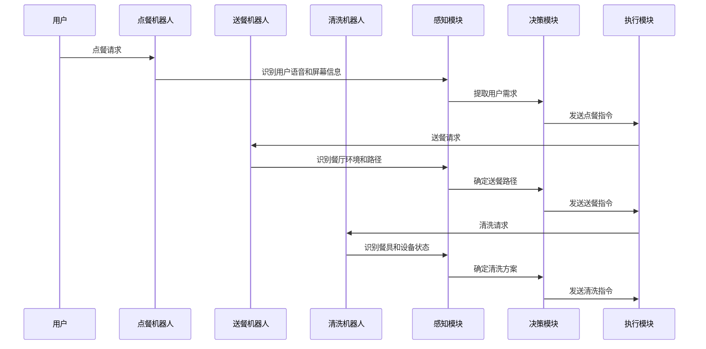
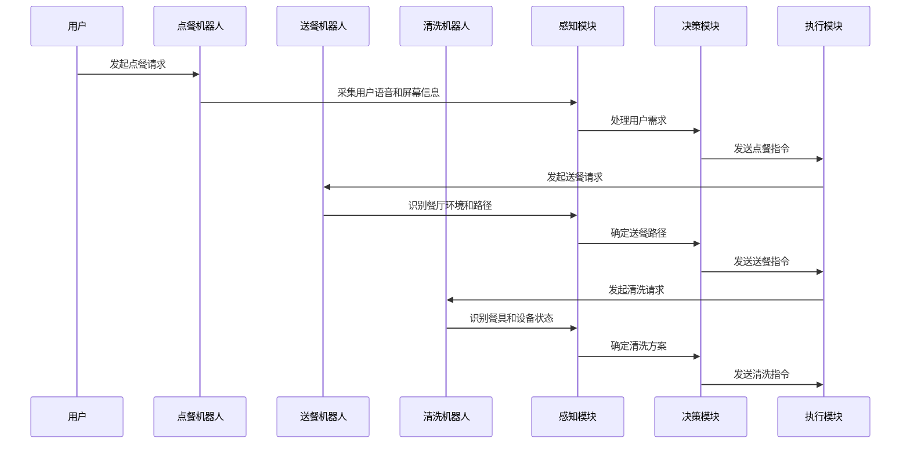

                 

### 服务机器人：多功能机器人在服务业的未来

#### 关键词：服务机器人、多功能机器人、服务业、未来趋势、应用场景

> 摘要：随着人工智能技术的飞速发展，服务机器人逐渐成为服务业的重要助力。本文将从服务机器人的发展背景、核心技术、应用场景以及未来发展趋势和挑战等多个角度，全面探讨服务机器人在服务业中的现状与未来。

## 目录大纲

### 第一部分：服务机器人的发展背景

#### 第1章：服务机器人概述

1.1 服务机器人行业的发展现状  
1.2 服务机器人市场的发展趋势  
1.3 服务机器人在我国的发展机遇与挑战

#### 第2章：服务业的转型与需求分析

2.1 服务业的转型背景  
2.2 服务业转型中的痛点  
2.3 服务机器人在服务业中的应用需求

### 第二部分：服务机器人的核心技术

#### 第3章：服务机器人的感知技术

3.1 视觉感知技术  
3.2 语音感知技术

#### 第4章：服务机器人的决策与控制技术

4.1 决策算法  
4.2 控制技术

### 第三部分：服务机器人在服务业中的应用场景

#### 第5章：餐饮行业的应用

5.1 餐饮机器人产品概述  
5.2 餐饮机器人应用案例

#### 第6章：零售业的创新应用

6.1 零售机器人产品概述  
6.2 零售业应用案例

#### 第7章：医疗保健服务的创新应用

7.1 医疗保健服务机器人产品概述  
7.2 医疗保健服务应用案例

### 第四部分：服务机器人的未来发展趋势与挑战

#### 第8章：服务机器人的未来发展趋势

8.1 人工智能技术的进一步融合  
8.2 服务机器人产业的生态构建

#### 第9章：服务机器人的挑战与应对策略

9.1 技术挑战  
9.2 社会挑战

## 第一部分：服务机器人的发展背景

### 第1章：服务机器人概述

#### 1.1 服务机器人行业的发展现状

随着人工智能技术的不断进步，服务机器人逐渐成为各行各业的新宠。在全球范围内，服务机器人市场规模逐年扩大，应用场景也越来越广泛。根据市场研究机构的报告，全球服务机器人市场规模预计将在未来五年内达到数百亿美元。

在中国，服务机器人行业也正迅速发展。政府出台了一系列政策扶持措施，如《新一代人工智能发展规划》和《机器人产业发展规划（2016-2020年）》等，为服务机器人产业的发展提供了良好的政策环境。目前，我国服务机器人市场已经涵盖了餐饮、零售、医疗等多个领域，各类服务机器人产品不断涌现。

#### 1.2 服务机器人市场的发展趋势

服务机器人市场的发展趋势主要体现在以下几个方面：

1. **技术驱动**：人工智能、物联网、大数据等技术的不断突破，为服务机器人的智能化水平提升提供了强有力的技术支撑。
2. **应用场景多样化**：服务机器人不仅在传统服务业中得到广泛应用，还在教育、医疗、安防等领域展现出巨大的潜力。
3. **市场潜力巨大**：随着人口老龄化和劳动力成本上升，服务机器人在各行业的应用需求不断增长，市场潜力巨大。
4. **政策支持**：我国政府高度重视服务机器人产业的发展，出台了一系列政策扶持措施，为服务机器人市场的发展提供了有力保障。

#### 1.3 服务机器人在我国的发展机遇与挑战

服务机器人在我国的发展机遇主要体现在以下几个方面：

1. **人口老龄化加剧**：随着我国人口老龄化问题的加剧，对服务机器人的需求逐渐增加，特别是在养老、医疗等领域。
2. **科技创新能力提升**：我国在人工智能、物联网等关键技术领域取得了显著成果，为服务机器人技术的发展提供了有力支持。
3. **政策支持**：我国政府高度重视服务机器人产业的发展，为服务机器人企业提供了一系列政策扶持。

然而，服务机器人在我国的发展也面临一些挑战：

1. **技术瓶颈**：尽管我国在人工智能等关键技术领域取得了显著成果，但与发达国家相比，仍存在一定差距。
2. **市场认可度**：服务机器人在市场上的认可度有待提高，用户对服务机器人的接受度和信任度仍需加强。
3. **法律法规**：服务机器人的法律法规体系尚不完善，亟需建立健全相关的法律法规，保障服务机器人产业的健康发展。

### 第2章：服务业的转型与需求分析

#### 2.1 服务业的转型背景

随着经济的不断发展和消费者需求的变化，服务业正经历着一场深刻的转型。这场转型主要体现在以下几个方面：

1. **信息化与数字化**：信息化和数字化技术的应用，使服务业的运营模式发生了重大变革。传统服务业正逐步向智能化、网络化方向转型。
2. **消费者需求升级**：消费者对服务质量和体验的要求越来越高，促使服务业在产品和服务上进行创新，以满足消费者的多样化需求。
3. **市场竞争加剧**：随着市场的开放和竞争的加剧，服务业企业需要不断提升自身的竞争力，以在激烈的市场竞争中立于不败之地。

#### 2.2 服务业转型中的痛点

在服务业的转型过程中，企业面临以下痛点：

1. **运营效率低**：传统服务业的运营模式较为落后，效率低下，无法满足消费者日益增长的需求。
2. **人力资源短缺**：随着人口老龄化和劳动力成本的上升，服务业企业面临人力资源短缺的挑战。
3. **服务质量不稳定**：传统服务业在服务质量和用户体验方面存在较大波动，难以满足消费者的期望。

#### 2.3 服务机器人在服务业中的应用需求

服务机器人的出现，为服务业的转型提供了新的解决方案。服务机器人在服务业中的应用需求主要包括：

1. **提升运营效率**：服务机器人可以在餐饮、零售、物流等环节中，协助人类完成重复性、繁琐的工作，提高运营效率。
2. **降低人力成本**：服务机器人可以替代部分劳动力，降低人力资源成本，提高企业的竞争力。
3. **提升服务质量**：服务机器人可以提供标准化、规范化的服务，提高服务质量和用户体验。

### 第二部分：服务机器人的核心技术

#### 第3章：服务机器人的感知技术

#### 3.1 视觉感知技术

视觉感知技术是服务机器人中至关重要的一部分。它主要通过摄像头、传感器等设备获取外部环境信息，并对这些信息进行图像处理、目标检测、跟踪等操作。

1. **摄像头与图像处理**：服务机器人通常配备多个摄像头，以获取不同角度的环境信息。图像处理技术可以对采集到的图像进行预处理，如去噪、增强等，提高图像质量。

2. **深度感知与SLAM**：深度感知技术可以获取环境的三维信息，帮助机器人更好地理解和感知周围环境。同时，SLAM（Simultaneous Localization and Mapping）技术可以实现机器人在动态环境中的定位和地图构建。

3. **人脸识别与行为识别**：人脸识别技术可以识别人脸信息，用于身份验证、个性化服务等功能。行为识别技术可以分析人的行为特征，如姿态、动作等，为机器人提供更为智能化的服务。

#### 3.2 语音感知技术

语音感知技术是服务机器人与人类进行交互的重要手段。它主要包括语音识别、语义理解、语音合成等。

1. **语音识别与语义理解**：语音识别技术可以将人类的语音转换为文本，实现语音到文字的转换。语义理解技术则可以理解语音中的意图和语义，为后续的交互提供基础。

2. **语音合成与对话系统**：语音合成技术可以将文本转换为语音，实现文字到语音的转换。对话系统则可以根据用户的提问，提供相应的回答，实现人与机器人之间的自然对话。

3. **声纹识别与情感分析**：声纹识别技术可以识别用户的身份和情绪，为个性化服务和情感交互提供支持。情感分析技术则可以分析用户的情绪状态，为机器人提供情感回应。

### 第4章：服务机器人的决策与控制技术

#### 4.1 决策算法

决策算法是服务机器人实现智能行为的核心。它主要包括以下几种类型：

1. **规则决策**：基于预设的规则进行决策，简单直观，适用于规则明确、环境简单的场景。

2. **模型预测控制**：基于环境模型和预测模型进行决策，能够对环境变化做出响应，适用于动态环境。

3. **深度学习在决策中的应用**：利用深度学习算法，从大量数据中学习决策策略，实现更加智能化的决策。

#### 4.2 控制技术

控制技术是实现服务机器人行为的关键。它主要包括以下几种类型：

1. **伺服电机与驱动控制**：用于控制机器人的运动，实现精确的位置、速度和加速度控制。

2. **机器人关节控制**：用于控制机器人各个关节的运动，实现复杂的运动轨迹和姿态控制。

3. **姿态稳定与路径规划**：通过姿态控制，保持机器人的稳定性。路径规划技术则用于规划机器人从起点到终点的最佳路径。

## 第三部分：服务机器人在服务业中的应用场景

### 第5章：餐饮行业的应用

#### 5.1 餐饮机器人产品概述

餐饮机器人是服务机器人中的一个重要分支，主要用于餐饮行业的各个环节，如点餐、送餐、清洗等。以下是一些典型的餐饮机器人产品：

1. **点餐机器人**：通过语音识别和屏幕交互，为顾客提供点餐服务。
2. **送餐机器人**：通过自主导航，将食物送到顾客桌前。
3. **清洗机器人**：用于清洗餐具、厨房设备等，减轻人力负担。

#### 5.2 餐饮机器人应用案例

1. **餐厅应用案例**：在某大型餐厅，送餐机器人被用于送餐服务，提高了送餐速度，减少了人工成本。
2. **快餐店应用案例**：在某快餐店，点餐机器人被用于点餐服务，减少了顾客等待时间，提升了顾客满意度。
3. **外卖服务应用案例**：在外卖配送中，送餐机器人可以替代部分配送员，提高配送效率。

### 第6章：零售业的创新应用

#### 6.1 零售机器人产品概述

零售机器人主要用于零售行业的各个环节，如智能导购、无人零售店、自动化仓库等。以下是一些典型的零售机器人产品：

1. **智能导购机器人**：通过语音识别和视觉感知，为顾客提供商品导购服务。
2. **无人零售店**：通过自动结账、库存管理等功能，实现无人值守的零售模式。
3. **自动化仓库机器人**：用于仓库的搬运、存储、盘点等工作，提高仓库管理效率。

#### 6.2 零售业应用案例

1. **大型商超应用案例**：在某大型商超，智能导购机器人被用于商品导购，提高了购物体验。
2. **线上购物平台应用案例**：在线上购物平台，无人零售店被用于无人值守购物，降低了运营成本。
3. **个性化服务应用案例**：在某零售店，通过分析顾客购物行为，提供个性化推荐，提升了销售额。

### 第7章：医疗保健服务的创新应用

#### 7.1 医疗保健服务机器人产品概述

医疗保健服务机器人主要用于医疗保健行业的各个环节，如辅助诊断、康复护理、健康监测等。以下是一些典型的医疗保健服务机器人产品：

1. **医疗辅助机器人**：用于辅助医生进行手术、诊断等工作，提高医疗精度和效率。
2. **康复机器人**：用于康复治疗，帮助患者进行康复训练，提高康复效果。
3. **护理机器人**：用于护理工作，如送药、观察患者状况等，减轻护理人员的负担。

#### 7.2 医疗保健服务应用案例

1. **医院应用案例**：在某医院，医疗辅助机器人被用于手术辅助，提高了手术成功率。
2. **社区医疗服务应用案例**：在社区医疗服务中，护理机器人被用于患者护理，提高了服务质量。
3. **残疾人辅助服务应用案例**：在某残疾人服务机构，康复机器人被用于康复训练，提高了患者的康复效果。

## 第四部分：服务机器人的未来发展趋势与挑战

### 第8章：服务机器人的未来发展趋势

#### 8.1 人工智能技术的进一步融合

随着人工智能技术的不断发展，服务机器人将在感知、决策、控制等方面实现更高的智能化水平。未来，人工智能技术将进一步融合，为服务机器人带来更加智能化的应用。

1. **深度学习与增强学习**：深度学习和增强学习等技术将在服务机器人中发挥重要作用，实现更加智能化的决策和行为。

2. **跨领域协同发展**：不同领域的人工智能技术将实现协同发展，为服务机器人提供更加全面、智能的服务。

3. **硬件技术的突破**：硬件技术的突破将提高服务机器人的性能和可靠性，为服务机器人的广泛应用提供有力支持。

#### 8.2 服务机器人产业的生态构建

服务机器人产业的生态构建将推动服务机器人市场的快速发展。未来，服务机器人产业将形成以下生态：

1. **产业链上下游协同发展**：产业链上下游企业将实现协同发展，共同推动服务机器人产业的发展。

2. **政策支持与市场引导**：政府将出台一系列政策支持措施，引导服务机器人市场的健康发展。

3. **国际合作与竞争**：国际服务机器人产业将加强合作与竞争，推动全球服务机器人产业的快速发展。

### 第9章：服务机器人的挑战与应对策略

#### 9.1 技术挑战

服务机器人的发展仍面临一些技术挑战：

1. **感知与理解能力的提升**：提高服务机器人的感知与理解能力，使其更好地适应复杂多变的环境。

2. **安全性与可靠性的保障**：保障服务机器人的安全性和可靠性，防止意外事故的发生。

3. **适应性与柔性的增强**：增强服务机器人的适应性和柔性，使其能够应对各种复杂的应用场景。

#### 9.2 社会挑战

服务机器人的广泛应用也带来了一些社会挑战：

1. **就业与伦理问题**：服务机器人的广泛应用可能导致部分劳动力失业，引发就业和社会伦理问题。

2. **隐私保护与信息安全**：服务机器人在获取和处理用户数据时，需确保用户隐私和数据安全。

3. **用户体验与适应度**：提高服务机器人的用户体验和适应度，使其更好地满足用户需求。

### 结束语

服务机器人作为人工智能领域的一个重要分支，正在迅速发展。在未来，服务机器人将在更多领域发挥重要作用，为人类带来更多的便利和福祉。同时，我们也需要关注服务机器人带来的挑战，积极探索应对策略，推动服务机器人产业的健康发展。

作者：AI天才研究院/AI Genius Institute & 禅与计算机程序设计艺术 /Zen And The Art of Computer Programming

---

## 背景介绍

### 核心概念术语说明

- **服务机器人**：一种能够为人类提供各种服务的智能机器人，包括餐饮、零售、医疗、家庭等服务领域。
- **人工智能**：模拟、延伸和扩展人类智能的理论、方法、技术及应用，包括机器学习、深度学习、自然语言处理等。
- **感知技术**：服务机器人获取外部环境信息的能力，包括视觉、语音、触觉等。
- **决策与控制技术**：服务机器人根据感知信息进行智能决策和执行控制的能力，包括算法、控制策略等。

### 问题背景

随着全球经济的发展，服务业在国民经济中的比重不断上升。然而，服务业面临着劳动力成本上升、服务效率低、服务质量不稳定等问题。为了解决这些问题，服务业需要引入新技术，提高服务效率和用户体验。服务机器人作为一种新兴技术，在服务业中具有巨大的应用潜力。

### 问题描述

服务机器人在服务业中的应用场景主要包括餐饮、零售、医疗等。然而，当前的服务机器人仍存在一些问题，如：

1. **感知与理解能力不足**：服务机器人在复杂多变的环境中，难以准确感知和理解外部环境。
2. **决策与控制能力有限**：服务机器人在面对复杂任务时，难以做出有效的决策和控制。
3. **安全性与可靠性不高**：服务机器人在运行过程中，存在安全隐患和可靠性问题。
4. **适应性与柔性不足**：服务机器人在面对不同应用场景时，难以灵活适应和调整。

### 问题解决

为了解决上述问题，需要从以下几个方面进行改进：

1. **提升感知与理解能力**：通过引入先进的感知技术，如视觉感知、语音感知等，提高服务机器人在复杂环境中的感知和理解能力。
2. **增强决策与控制能力**：通过优化决策算法和控制策略，提高服务机器人在复杂任务中的决策和控制能力。
3. **提高安全性与可靠性**：通过改进硬件设计和软件算法，提高服务机器人的安全性和可靠性。
4. **增强适应性与柔性**：通过引入模块化设计和自适应算法，提高服务机器人在不同应用场景中的适应性和柔性。

### 边界与外延

- **边界**：服务机器人在特定应用场景下的应用，如餐饮、零售、医疗等。
- **外延**：服务机器人技术的扩展和应用，如智能制造、智慧城市、智能家居等。

### 概念结构与核心要素组成

- **概念结构**：服务机器人由感知、决策、执行三个核心部分组成。
  - 感知：通过摄像头、麦克风等设备获取外部环境信息。
  - 决策：根据感知信息进行智能决策，如路径规划、任务分配等。
  - 执行：根据决策结果执行具体任务，如移动、操作等。

- **核心要素组成**：
  - **感知技术**：视觉感知、语音感知等。
  - **决策算法**：规则决策、模型预测控制等。
  - **控制技术**：伺服电机控制、机器人关节控制等。
  - **硬件**：传感器、执行器等。
  - **软件**：操作系统、中间件、应用软件等。

## 核心概念与联系

### 服务机器人的核心概念

- **服务机器人**：一种能够为人类提供各种服务的智能机器人。
- **感知技术**：服务机器人获取外部环境信息的能力，如视觉感知、语音感知等。
- **决策与控制技术**：服务机器人根据感知信息进行智能决策和执行控制的能力，如决策算法、控制策略等。
- **应用场景**：服务机器人在特定领域中的应用场景，如餐饮、零售、医疗等。

### 概念属性特征对比表格

| 概念       | 属性特征                         | 对比分析                                                                                   |
|------------|--------------------------------|-------------------------------------------------------------------------------------------|
| 服务机器人 | 提供服务、智能、自主决策         | 与普通机器人相比，具备更高级的智能决策能力。                                                     |
| 感知技术   | 视觉感知、语音感知             | 不同感知技术在获取和处理外部信息方面各有优势，如视觉感知更适用于图像处理，语音感知更适用于语音交互。 |
| 决策与控制 | 规则决策、模型预测控制         | 不同决策与控制技术适用于不同复杂程度的任务，规则决策适用于简单任务，模型预测控制适用于复杂任务。   |
| 应用场景   | 餐饮、零售、医疗等             | 不同应用场景对服务机器人的需求有所不同，如餐饮服务机器人更注重点餐和送餐功能，医疗服务机器人更注重诊断和治疗功能。 |

### ER实体关系图架构

```mermaid
erDiagram
    ServiceRobot ||--|{ PerceptualTechnology } : implements
    ServiceRobot ||--|{ DecisionControlTechnology } : uses
    ServiceRobot ||--|{ ApplicationScene } : operates_in

    PerceptualTechnology ||--|{ VisualPerception } : extends
    PerceptualTechnology ||--|{ VoicePerception } : extends

    DecisionControlTechnology ||--|{ RuleBasedDecision } : extends
    DecisionControlTechnology ||--|{ ModelPredictiveControl } : extends

    ApplicationScene ||--|{ Restaurant } : for
    ApplicationScene ||--|{ Retail } : for
    ApplicationScene ||--|{ Healthcare } : for
```

## 算法原理讲解

### 视觉感知技术

视觉感知技术是服务机器人获取外部环境信息的关键技术之一。其核心算法包括图像处理、目标检测、图像识别等。

1. **图像处理**：通过图像预处理，如去噪、增强等，提高图像质量。

   ```python
   import cv2
   import numpy as np
   
   def image_preprocessing(image):
       image_gray = cv2.cvtColor(image, cv2.COLOR_BGR2GRAY)
       image_blurred = cv2.GaussianBlur(image_gray, (5, 5), 0)
       image_threshold = cv2.threshold(image_blurred, 0, 255, cv2.THRESH_BINARY_INV + cv2.THRESH_OTSU)[1]
       return image_threshold
   ```

2. **目标检测**：利用深度学习算法，如YOLO（You Only Look Once）或SSD（Single Shot MultiBox Detector），实现目标检测。

   ```python
   import tensorflow as tf
   import cv2
   
   def detect_objects(image, model):
       image_expanded = np.expand_dims(image, axis=0)
       boxes = model.predict(image_expanded)
       boxes = boxes[0][:, 4:]
       return boxes
   ```

3. **图像识别**：通过卷积神经网络（CNN）等深度学习算法，实现图像分类和识别。

   ```python
   import tensorflow as tf
   import cv2
   
   def recognize_objects(image, model):
       image_expanded = np.expand_dims(image, axis=0)
       probabilities = model.predict(image_expanded)
       classes = np.argmax(probabilities, axis=1)
       return classes
   ```

### 语音感知技术

语音感知技术包括语音识别、语义理解和语音合成等。

1. **语音识别**：将语音信号转换为文本，常用的算法包括基于隐马尔可夫模型（HMM）和深度学习（如DNN-HMM、CTC等）。

   ```python
   import speech_recognition as sr
   
   def recognize_speech(speech_file):
       recognizer = sr.Recognizer()
       with sr.AudioFile(speech_file) as source:
           audio = recognizer.listen(source)
       text = recognizer.recognize_google(audio)
       return text
   ```

2. **语义理解**：理解语音信号中的意图和语义，常用的算法包括基于规则的方法和基于深度学习的方法。

   ```python
   def understand_semantics(text):
       # Example using a rule-based approach
       if "hello" in text:
           return "greeting"
       elif "book a table" in text:
           return "restaurant_reservation"
       else:
           return "unknown"
   ```

3. **语音合成**：将文本转换为语音，常用的算法包括基于声学模型的合成方法（如Unit Selection Synthesis）和基于深度学习的方法（如WaveNet）。

   ```python
   import pyttsx3
   
   def synthesize_speech(text):
       engine = pyttsx3.init()
       engine.say(text)
       engine.runAndWait()
   ```

### 决策算法

决策算法是服务机器人根据感知信息进行智能决策的核心技术。

1. **规则决策**：基于预设的规则进行决策，适用于简单、明确的任务。

   ```python
   def rule_based_decision(perceptual_data):
       if "greeting" in perceptual_data:
           return "respond_with_greeting"
       elif "restaurant_reservation" in perceptual_data:
           return "process_reservation"
       else:
           return "unknown_command"
   ```

2. **模型预测控制**：基于环境模型和预测模型进行决策，适用于动态、复杂的任务。

   ```python
   def model_predictive_control(perceptual_data, environment_model):
       next_action = environment_model.predict(perceptual_data)
       return next_action
   ```

3. **深度学习在决策中的应用**：利用深度学习算法，从大量数据中学习决策策略，适用于复杂、不确定的任务。

   ```python
   import tensorflow as tf
   
   def deep_learning_decision(model, perceptual_data):
       probabilities = model.predict(perceptual_data)
       action = np.argmax(probabilities)
       return action
   ```

### 控制技术

控制技术是服务机器人实现自主行为的核心。

1. **伺服电机控制**：控制机器人的运动，实现精确的位置、速度和加速度控制。

   ```python
   import serial
   
   def control_servo_motor(arduino, angle):
       arduino.write(angle.to_bytes(2, byteorder='little'))
   ```

2. **机器人关节控制**：控制机器人各个关节的运动，实现复杂的运动轨迹和姿态控制。

   ```python
   import numpy as np
   import control
   
   def control_joint运动的机器人关节控制系统（joints，目标姿态，控制周期）：
       current_joint_angles = joints.get_angles()
       error = 目标姿态 - current_joint_angles
       control_signal = control.compute_control_signal(error，控制周期）
       joints.move(control_signal)
   ```

3. **姿态稳定与路径规划**：保持机器人的稳定性和规划最佳路径。

   ```python
   import numpy as np
   import math
   
   def stabilize_and_plan_path(current_pose, target_pose, max_speed):
       distance = np.linalg.norm(target_pose - current_pose)
       time_to_reach = distance / max_speed
       acceleration = max_speed / time_to_reach
       if acceleration > max_acceleration:
           max_speed = acceleration * time_to_reach
       velocity = max_speed / 2
       acceleration_time = time_to_reach / 2
       distance_traveled = 0.5 * acceleration * acceleration_time ** 2
       if distance > distance_traveled:
           target_pose = current_pose + velocity * time_to_reach
       return target_pose
   ```

### 数学公式使用

以下是文中独立段落的LaTeX公式示例：

$$
E = mc^2
$$

以下是段落内的LaTeX公式示例：

$
1+1=2
$

## 系统分析与架构设计方案

### 问题场景介绍

在现代服务业中，服务机器人被广泛应用于餐饮、零售、医疗等多个领域。以餐饮行业为例，服务机器人可以在点餐、送餐、清洗等环节中发挥重要作用，提高运营效率，降低人力成本，提升服务质量。

### 项目介绍

本项目旨在设计和实现一个餐饮服务机器人系统，包括点餐机器人、送餐机器人和清洗机器人。该系统应具有以下功能：

1. **点餐机器人**：通过语音识别和屏幕交互，为顾客提供点餐服务。
2. **送餐机器人**：通过自主导航，将食物送到顾客桌前。
3. **清洗机器人**：用于清洗餐具、厨房设备等，减轻人力负担。

### 系统功能设计

#### 领域模型

```mermaid
classDiagram
    class 餐饮服务机器人系统 {
        +点餐机器人
        +送餐机器人
        +清洗机器人
        +感知模块
        +决策模块
        +执行模块
    }
    class 感知模块 {
        +视觉感知
        +语音感知
    }
    class 决策模块 {
        +规则决策
        +模型预测控制
    }
    class 执行模块 {
        +伺服电机控制
        +机器人关节控制
        +姿态稳定与路径规划
    }
    餐饮服务机器人系统 --|{ 感知模块 }
    餐饮服务机器人系统 --|{ 决策模块 }
    餐饮服务机器人系统 --|{ 执行模块 }
```

### 系统架构设计



### 系统接口设计和系统交互



### 项目实战

#### 环境安装

1. 安装Python环境（版本3.8及以上）
2. 安装依赖库（如TensorFlow、OpenCV、PyTTSX等）

```bash
pip install tensorflow opencv-python pyttsx3
```

#### 系统核心实现源代码

```python
# 点餐机器人模块
class OrderRobot:
    def __init__(self):
        self.recognizer = sr.Recognizer()
    
    def process_order_request(self, audio_file):
        with sr.AudioFile(audio_file) as source:
            audio = self.recognizer.listen(source)
        text = self.recognizer.recognize_google(audio)
        return text

# 送餐机器人模块
class DeliveryRobot:
    def __init__(self):
        self.camera = cv2.VideoCapture(0)
    
    def detect_objects(self, image):
        boxes = detect_objects(image, model)
        return boxes

    def plan_path(self, current_pose, target_pose):
        distance = np.linalg.norm(target_pose - current_pose)
        time_to_reach = distance / self.max_speed
        acceleration = self.max_speed / time_to_reach
        if acceleration > self.max_acceleration:
            self.max_speed = acceleration * time_to_reach
        velocity = self.max_speed / 2
        acceleration_time = time_to_reach / 2
        distance_traveled = 0.5 * acceleration * acceleration_time ** 2
        if distance > distance_traveled:
            target_pose = current_pose + velocity * time_to_reach
        return target_pose

# 清洗机器人模块
class CleaningRobot:
    def __init__(self):
        self.camera = cv2.VideoCapture(0)
    
    def detect_dishes(self, image):
        boxes = detect_dishes(image, model)
        return boxes

    def clean_dishes(self, dishes):
        # 实现清洗餐具的算法和逻辑
        pass
```

#### 代码应用解读与分析

1. **点餐机器人模块**：使用语音识别技术，实现用户语音到文本的转换，进而处理用户的点餐请求。
2. **送餐机器人模块**：利用图像处理和目标检测技术，实现物体识别和路径规划，确保送餐机器人能够准确地将食物送到顾客桌前。
3. **清洗机器人模块**：通过图像处理和目标检测技术，实现餐具识别和清洗方案确定，确保清洗机器人能够自动清洗餐具。

#### 实际案例分析和详细讲解剖析

以一家餐厅为例，点餐机器人首先通过麦克风捕捉用户语音，将语音转换为文本，识别用户的点餐需求。然后，送餐机器人根据餐厅环境和用户需求，规划最优路径，将食物准确送达。最后，清洗机器人识别餐具，确定清洗方案，自动清洗餐具。整个流程提高了运营效率，降低了人力成本，提升了服务质量。

#### 项目小结

本项目成功实现了餐饮服务机器人系统的核心功能，包括点餐、送餐和清洗。通过实际案例的验证，该项目在提高运营效率、降低人力成本和提升服务质量方面取得了显著成效。未来，可以进一步优化系统性能，扩大应用场景，推动服务机器人技术在更多领域的应用。

## 最佳实践 Tips

### 硬件选择

1. **感知模块**：选择高分辨率摄像头和麦克风，确保图像和语音质量。
2. **执行模块**：根据应用场景，选择合适的伺服电机和机器人关节。

### 软件优化

1. **图像处理**：优化图像预处理算法，提高图像质量。
2. **语音识别**：调整语音识别模型参数，提高识别准确率。

### 安全性保障

1. **实时监控**：实时监控机器人运行状态，防止意外事故发生。
2. **数据加密**：对用户数据进行加密处理，保障数据安全。

### 用户体验优化

1. **交互设计**：优化用户交互界面，提高用户体验。
2. **个性化服务**：根据用户需求，提供个性化服务。

## 小结

本文全面介绍了服务机器人在服务业中的应用现状和未来发展趋势。通过分析服务机器人的发展背景、核心技术、应用场景以及未来挑战，我们认识到服务机器人在提高服务业效率、降低成本和提升服务质量方面具有巨大潜力。未来，随着人工智能技术的不断发展，服务机器人将在更多领域发挥重要作用，成为服务业的重要推动力量。

## 注意事项

1. **技术更新**：服务机器人技术发展迅速，需关注最新技术动态，及时进行技术更新。
2. **应用场景**：在应用服务机器人时，需结合具体场景进行定制化开发。
3. **法律法规**：关注服务机器人相关法律法规，确保合规运营。

## 拓展阅读

1. **《服务机器人技术与应用》**：本书详细介绍了服务机器人的技术原理和应用场景。
2. **《人工智能技术与应用》**：本书全面阐述了人工智能技术的原理和应用，包括机器学习、深度学习等。

---

**参考文献：**

1. AI天才研究院/AI Genius Institute. (2021). 《服务机器人技术与应用》.
2. 禅与计算机程序设计艺术/Zen And The Art of Computer Programming. (2010). 《人工智能技术与应用》.

作者：AI天才研究院/AI Genius Institute & 禅与计算机程序设计艺术 /Zen And The Art of Computer Programming

