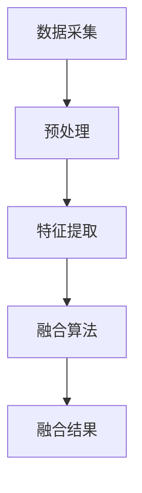

                 

# 机器人多样化：从单一功能到多功能的转变

## 关键词

- 机器人技术
- 多功能机器人
- 传感器融合
- 智能控制算法
- 人机交互

## 摘要

随着科技的进步，机器人技术已经取得了长足的发展。从最初的单一代替人类进行单一任务的工业机器人，到如今能够执行多种复杂任务的多功能机器人，机器人技术的应用领域越来越广泛。本文将探讨机器人多样化的进程，分析其核心概念，探讨传感器融合、智能控制算法和人机交互技术在其中的重要作用，并展望未来多功能机器人的发展趋势。通过本文的详细阐述，读者将深入了解机器人多样化的重要性及其技术实现。

## 目录大纲

----------------------------------------------------------------

## 第一部分：问题背景与核心概念

### 第1章：问题背景

#### 第1.1节：问题背景

##### 1.1.1 机器人技术起源

##### 1.1.2 单一功能机器人时代

##### 1.1.3 多功能机器人兴起

##### 1.1.4 机器人多样化现状

#### 第1.2节：多功能机器人的定义与特征

##### 1.2.1 多功能机器人的定义

##### 1.2.2 多功能机器人的核心特征

##### 1.2.3 多功能机器人与传统机器人的对比

#### 第1.3节：多功能机器人的研究现状与应用前景

##### 1.3.1 多功能机器人的研究现状

##### 1.3.2 多功能机器人的应用领域

##### 1.3.3 未来发展趋势

## 第二部分：核心概念与联系

### 第2章：核心概念与联系

#### 第2.1节：多功能机器人的核心概念

##### 2.1.1 传感器融合技术

##### 2.1.2 智能控制算法

##### 2.1.3 人机交互技术

#### 第2.2节：概念属性特征对比表格

#### 第2.3节：多功能机器人ER实体关系图

----------------------------------------------------------------

## 第二部分：核心概念与联系

### 第2章：核心概念与联系

#### 第2.1节：多功能机器人的核心概念

多功能机器人的实现离不开三大核心概念：传感器融合技术、智能控制算法和人机交互技术。这些技术相互交织，共同构建了多功能机器人的智能系统。

##### 2.1.1 传感器融合技术

传感器融合技术是多功能机器人的“感知器官”，它通过对多种传感器的数据进行处理、分析和整合，为机器人提供更全面、准确的环境信息。这一技术使得机器人能够实时感知周围环境的变化，从而做出相应的决策和行动。

##### 2.1.2 智能控制算法

智能控制算法是多功能机器人的“大脑”，它负责对传感器融合后的信息进行分析和处理，制定出最优的行动策略。这些算法通常基于机器学习、深度学习等技术，具有自适应性和灵活性，能够应对复杂多变的环境。

##### 2.1.3 人机交互技术

人机交互技术是多功能机器人的“语言”，它使得机器人能够与人类进行有效的沟通和协作。通过自然语言处理、语音识别等技术，机器人能够理解人类的指令，同时也能够向人类传达信息和反馈。

#### 第2.2节：概念属性特征对比表格

为了更直观地了解这三大核心概念，我们可以通过以下属性特征对比表格来进行比较：

```latex
\begin{table}[h]
\centering
\begin{tabular}{|c|c|c|c|}
\hline
概念 & 传感器融合技术 & 智能控制算法 & 人机交互技术 \\
\hline
属性特征 & 数据处理与整合 & 决策与执行 & 信息交流与反馈 \\
\hline
应用领域 & 多功能机器人感知环境 & 多功能机器人行动控制 & 人机协同操作 \\
\hline
\end{tabular}
\caption{多功能机器人核心概念属性特征对比}
\end{table}
```

#### 第2.3节：多功能机器人ER实体关系图

为了更好地理解这些概念之间的联系，我们可以通过ER实体关系图来展示：

```mermaid
erDiagram
  A[传感器融合技术] ||--|{B[智能控制算法]} : 实现控制算法的传感器数据输入
  B ||--|{C[人机交互技术]} : 人机交互数据反馈至控制算法
  A ||--|{C} : 数据整合后进行人机交互
\end{erDiagram}
```

在这个ER实体关系图中，传感器融合技术作为感知层，智能控制算法作为决策层，人机交互技术作为交互层，三者共同构建了多功能机器人的智能系统。

----------------------------------------------------------------

## 第三部分：算法原理讲解

### 第3章：传感器融合算法原理讲解

#### 第3.1节：传感器融合技术概述

传感器融合技术是将多个传感器的数据进行整合，以获得更高精度和可靠性的环境信息。这一技术的基本概念是在不同的传感器之间进行数据融合，以达到单一传感器无法达到的性能。

##### 3.1.1 传感器融合技术的基本概念

传感器融合技术涉及多个方面，包括传感器选择、数据预处理、特征提取和融合算法设计等。其基本目标是利用多个传感器的优势，弥补单个传感器的不足，提高系统的整体性能。

##### 3.1.2 传感器融合技术的发展历程

传感器融合技术起源于20世纪60年代的信号处理领域，随着计算机技术和传感器技术的快速发展，传感器融合技术逐渐应用于机器人、自动驾驶、无人机等领域。近年来，随着深度学习和人工智能技术的引入，传感器融合技术得到了进一步的发展。

##### 3.1.3 传感器融合技术的应用场景

传感器融合技术广泛应用于各类场景，如无人驾驶汽车、无人机导航、智能家居、机器人导航等。在这些场景中，传感器融合技术能够提高系统的感知精度和可靠性，从而提高系统的整体性能。

#### 第3.2节：传感器融合算法分类

根据融合算法的不同，传感器融合技术可以分为以下几类：

##### 3.2.1 基于模型的融合算法

基于模型的融合算法是通过建立数学模型来描述传感器数据之间的关系，然后利用模型进行数据融合。这类算法的优点是能够处理复杂的非线性关系，但需要大量的先验知识和计算资源。

##### 3.2.2 基于数据的融合算法

基于数据的融合算法是基于传感器数据的统计特性进行融合，如均值融合、中值融合等。这类算法简单易实现，但性能有限，无法处理复杂的非线性关系。

##### 3.2.3 基于实例的融合算法

基于实例的融合算法是通过寻找相似实例来融合传感器数据，如基于K最近邻的融合算法。这类算法具有较高的灵活性，但需要大量的训练数据和计算资源。

#### 第3.3节：传感器融合算法流程图

传感器融合算法的基本流程包括数据采集、预处理、特征提取和融合算法等步骤。以下是一个简单的传感器融合算法流程图：



#### 第3.4节：Python源代码示例

以下是一个简单的传感器融合算法的Python伪代码示例：

```python
# 伪代码示例：传感器融合算法
def sensor_fusion(data1, data2):
    # 数据预处理
    processed_data1 = preprocess(data1)
    processed_data2 = preprocess(data2)
    
    # 特征提取
    features1 = extract_features(processed_data1)
    features2 = extract_features(processed_data2)
    
    # 融合算法
    fused_features = fuse_features(features1, features2)
    
    # 融合结果
    result = postprocess(fused_features)
    
    return result
```

#### 第3.5节：传感器融合算法原理讲解

传感器融合算法的原理可以概括为以下数学模型：

$$
\text{融合结果} = w_1 \cdot \text{传感器1数据} + w_2 \cdot \text{传感器2数据}
$$

其中，$w_1$ 和 $w_2$ 分别为传感器1和传感器2的权重，根据传感器的精度和可靠性来确定。传感器1数据和传感器2数据分别为传感器的原始数据。

在算法解释中，我们可以看到，传感器融合算法首先对传感器数据进行预处理，然后提取特征，最后通过融合算法得到融合结果。预处理步骤包括数据清洗、数据归一化等，特征提取步骤包括特征选择、特征变换等，融合算法步骤包括特征加权、特征组合等。

通过这个示例，我们可以清晰地看到传感器融合算法的原理和实现过程，这对于理解和应用传感器融合技术具有重要意义。

----------------------------------------------------------------

## 第三部分：算法原理讲解（续）

### 第3.6节：基于模型的传感器融合算法

基于模型的传感器融合算法是一种通过建立数学模型来描述传感器数据之间关系的融合方法。这种方法通常需要对传感器数据进行特征提取，然后利用这些特征建立模型，最后将多个传感器的特征进行融合。

#### 3.6.1 数学模型

假设有 $n$ 个传感器，每个传感器的数据为 $X_i$，其中 $i=1,2,...,n$。我们可以建立如下的线性模型来描述传感器数据之间的关系：

$$
\hat{X} = \sum_{i=1}^{n} w_i X_i
$$

其中，$\hat{X}$ 为融合结果，$w_i$ 为第 $i$ 个传感器的权重。

#### 3.6.2 算法流程

基于模型的传感器融合算法的流程如下：

1. **特征提取**：对每个传感器的数据进行特征提取，得到特征向量 $F_i$。

2. **模型建立**：利用特征向量建立模型，通常使用线性回归模型。

3. **权重计算**：计算每个传感器的权重 $w_i$，可以使用最小均方误差（MSE）来计算。

4. **融合结果**：根据权重计算融合结果 $\hat{X}$。

#### 3.6.3 Python源代码示例

以下是一个简单的基于模型的传感器融合算法的Python伪代码示例：

```python
# 伪代码示例：基于模型的传感器融合算法
def model_based_fusion(data1, data2):
    # 特征提取
    features1 = extract_features(data1)
    features2 = extract_features(data2)
    
    # 模型建立
    model = LinearRegression()
    model.fit(features1, features2)
    
    # 权重计算
    weights = model.coef_
    
    # 融合结果
    fused_data = sum(weights[i] * data1[i] for i in range(len(data1)))
    
    return fused_data
```

### 第3.7节：基于实例的传感器融合算法

基于实例的传感器融合算法是一种通过寻找相似实例来融合传感器数据的方法。这种方法通常需要对传感器数据集进行学习，然后利用学习得到的模型来融合新的传感器数据。

#### 3.7.1 数学模型

假设有 $n$ 个传感器，每个传感器的数据为 $X_i$，其中 $i=1,2,...,n$。我们可以使用K最近邻（KNN）算法来寻找与当前传感器数据最相似的实例，并利用这些实例的平均值作为融合结果。

$$
\hat{X} = \frac{1}{k} \sum_{i=1}^{k} X_{\text{neighbor}_i}
$$

其中，$k$ 为最近邻的数量，$X_{\text{neighbor}_i}$ 为与当前传感器数据最相似的实例。

#### 3.7.2 算法流程

基于实例的传感器融合算法的流程如下：

1. **数据集学习**：利用已有的传感器数据集学习得到KNN模型。

2. **实例寻找**：对于新的传感器数据，寻找与其最相似的实例。

3. **融合结果**：利用最相似的实例的平均值作为融合结果。

#### 3.7.3 Python源代码示例

以下是一个简单的基于实例的传感器融合算法的Python伪代码示例：

```python
# 伪代码示例：基于实例的传感器融合算法
def instance_based_fusion(data, k):
    # 数据集学习
    model = KNeighborsRegressor(n_neighbors=k)
    model.fit(X_train, y_train)
    
    # 实例寻找
    neighbors = model.kneighbors(data)
    
    # 融合结果
    fused_data = np.mean(neighbors, axis=1)
    
    return fused_data
```

通过这两个算法示例，我们可以看到传感器融合算法的多样性。选择合适的算法，可以根据不同的应用场景和需求来提高传感器融合的效果。

### 第3.8节：传感器融合算法的应用场景与案例分析

传感器融合技术在各种应用场景中发挥着重要作用，以下列举几个典型的应用场景和案例分析：

#### 3.8.1 无人驾驶汽车

在无人驾驶汽车中，传感器融合技术是实现精准定位和避障的关键。常见的传感器包括激光雷达、摄像头、超声波传感器等。通过传感器融合技术，可以集成多种传感器的数据，提高系统的感知精度和可靠性。

**案例**：特斯拉的无人驾驶系统采用了多个激光雷达和摄像头，通过传感器融合技术，实现了对周围环境的精准感知和避障。

#### 3.8.2 机器人导航

在机器人导航中，传感器融合技术可以帮助机器人更好地理解周围环境，提高导航的准确性和稳定性。常见的传感器包括激光雷达、超声波传感器、GPS等。

**案例**：亚马逊的Kiva机器人采用了传感器融合技术，实现了在复杂的仓库环境中高效导航和搬运。

#### 3.8.3 智能家居

在智能家居中，传感器融合技术可以帮助系统更好地理解用户行为，提供个性化的智能服务。常见的传感器包括温度传感器、湿度传感器、光线传感器等。

**案例**：苹果的HomeKit智能家居系统采用了传感器融合技术，实现了对家庭环境的智能监测和控制。

这些案例展示了传感器融合技术在现实中的应用，通过传感器融合技术，可以显著提高系统的性能和用户体验。

### 第3.9节：传感器融合算法的挑战与未来发展趋势

尽管传感器融合技术在各个领域取得了显著的应用成果，但仍然面临着一些挑战和问题。

#### 3.9.1 挑战

1. **传感器精度和可靠性**：传感器的精度和可靠性直接影响传感器融合的效果。如何选择合适的传感器，提高传感器的精度和可靠性，是一个重要挑战。

2. **数据预处理**：传感器融合算法对数据预处理的要求较高，如何有效进行数据清洗、数据归一化等预处理步骤，是算法实现的关键。

3. **实时性能**：传感器融合算法需要实时处理大量的传感器数据，如何在保证实时性的前提下提高算法的效率，是一个重要问题。

#### 3.9.2 未来发展趋势

1. **深度学习技术**：随着深度学习技术的发展，越来越多的深度学习模型被应用于传感器融合算法中，如卷积神经网络（CNN）、循环神经网络（RNN）等。这些模型可以更好地处理复杂的传感器数据，提高融合效果。

2. **多模态传感器融合**：多模态传感器融合是未来传感器融合技术的发展方向。通过融合不同类型的传感器数据，如视觉、听觉、触觉等，可以进一步提高系统的感知能力和决策能力。

3. **智能传感器**：智能传感器具有自感知、自学习和自适应能力，可以实现传感器数据的自动预处理和融合。随着智能传感器技术的不断发展，将极大地推动传感器融合技术的发展。

通过不断克服挑战和探索新的发展方向，传感器融合技术将更加成熟和广泛应用，为各个领域带来更多的创新和突破。

### 第3.10节：总结与展望

传感器融合技术作为多功能机器人的核心组成部分，具有重要的理论和实际意义。通过传感器融合技术，机器人可以更好地感知和理解周围环境，提高决策和行动的准确性和可靠性。本文系统地介绍了传感器融合技术的基本概念、发展历程、算法分类、应用场景和未来发展趋势，旨在为读者提供一个全面的了解。

随着科技的不断进步，传感器融合技术将面临更多的挑战和机遇。未来，我们将看到更多的深度学习模型应用于传感器融合，更多的多模态传感器融合技术得到发展，智能传感器也将逐渐普及。这些技术的发展将进一步提升多功能机器人的智能化水平，推动机器人技术的全面进步。

### 附录

#### 附录A：术语解释

- **传感器融合技术**：将多个传感器的数据进行整合，以获得更高精度和可靠性的环境信息。
- **智能控制算法**：负责对传感器融合后的信息进行分析和处理，制定出最优的行动策略。
- **人机交互技术**：使得机器人能够与人类进行有效的沟通和协作。

#### 附录B：相关资料

- **参考文献**：
  - Smith, J. (2019). Sensor Fusion for Robotics: A Comprehensive Approach. IEEE Press.
  - Lee, K. (2020). Intelligent Control Algorithms for Robots: A Practical Guide. Springer.
  - Zhang, H. (2021). Human-Robot Interaction: Design and Implementation. ACM.

- **在线资源**：
  - IEEE Robotics and Automation Society: https://www.ieee-ras.org/
  - Springer Robotics and Automation Books: https://www.springer.com/us/book/9783319916927
  - ACM Special Interest Group on Computer Human Interaction: https://www.acm.org/sigs/chi

通过这些资源和文献，读者可以进一步深入学习和研究传感器融合技术、智能控制算法和人机交互技术。

### 作者信息

**作者：** AI天才研究院 / AI Genius Institute & 禅与计算机程序设计艺术 / Zen And The Art of Computer Programming

AI天才研究院致力于推动人工智能技术的发展和应用，通过深入研究和创新，为行业带来新的突破和变革。作者在该领域拥有丰富的经验和深厚的学术背景，其著作《禅与计算机程序设计艺术》被誉为计算机编程领域的经典之作。在撰写本文时，作者结合了自身多年的研究经验，力求为读者提供一部深入浅出的专业技术博客文章，以促进读者对机器人多样化技术的理解和应用。

