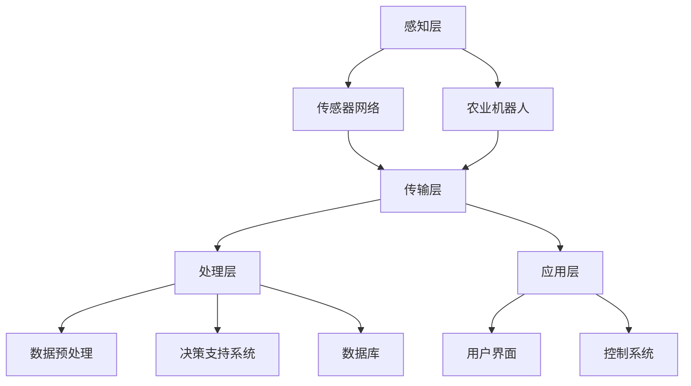

                 

### 农业自动化与机器人技术概述

#### 第1章：农业自动化与机器人技术引论

##### 1.1 农业自动化的发展背景与现状

农业作为人类生存的基础产业，其发展与进步始终是人类社会关注的焦点。然而，随着全球人口的持续增长和耕地资源的日益紧张，传统农业的生产效率和可持续发展面临着巨大挑战。在这种背景下，农业自动化逐渐成为解决这些问题的有效途径。

农业自动化，即利用自动化技术和设备，对农业生产过程中的各项操作进行自动化管理。它包括播种、施肥、灌溉、病虫害防治等多个环节。农业自动化的起源可以追溯到20世纪中叶，当时农业机械化的浪潮带来了大量农业机械的应用，极大地提高了生产效率。然而，机械化虽然能完成一些重复性的工作，但无法实现对农作物生长环境的精细监控和精准管理，这就为农业自动化技术的诞生提供了契机。

目前，农业自动化在全球范围内正快速发展，各国纷纷投入大量资源进行研究和应用。例如，美国、日本、德国等发达国家在农业自动化领域已经取得了显著的成果，开发出了多种适用于不同农作物和不同环境的自动化设备。发展中国家也在积极引进和消化这些技术，以提升本国农业的竞争力。

在中国，农业自动化同样得到了政府和企业的高度重视。近年来，国家出台了一系列政策措施，支持农业现代化和农业科技创新。例如，《中国农业机械化发展报告》就明确提出，要大力推进农业机械化、智能化、绿色化发展，提高农业综合生产能力。同时，许多企业也在积极研发和推广农业自动化技术，如智能灌溉系统、病虫害防治机器人等，这些技术的应用已经初步显示出提高农业生产效率和降低成本的效果。

##### 1.2 机器人技术在农业中的应用价值

机器人技术在农业自动化中的应用，不仅代表了农业发展的新方向，更带来了深远的应用价值。以下是机器人技术在农业中的几个关键应用价值：

1. **提高生产效率**：农业机器人能够自动完成播种、施肥、灌溉、病虫害防治等任务，大幅减少了人力投入，提高了生产效率。例如，一台智能播种机器人可以在一天内完成数百亩农田的播种工作，而同样任务如果由人工完成可能需要数天时间。

2. **精准管理**：农业机器人配备了高精度的传感器和控制系统，能够实时监控农作物生长环境，根据土壤湿度、温度、养分含量等参数进行精准管理。这不仅可以最大限度地利用耕地资源，还能显著提高农作物的产量和质量。

3. **降低生产成本**：农业机器人的应用减少了农业劳动力成本，同时还降低了生产资料的浪费。例如，智能灌溉系统能够根据实际需水量进行精确灌溉，避免了水资源的浪费。

4. **减少环境影响**：传统农业生产过程中，大量使用农药和化肥，容易对环境造成污染。农业机器人可以通过精准施肥和病虫害防治，减少农药和化肥的使用量，从而降低对环境的负面影响。

5. **促进农业现代化**：农业机器人技术的推广和应用，有助于推动农业向现代化、智能化方向发展。这不仅可以提高农业生产效率和竞争力，还能为农民提供更多就业机会和收入来源。

##### 1.3 机器人技术在农业自动化中的挑战与机遇

尽管机器人技术在农业自动化中展示了巨大的应用价值，但在实际应用过程中也面临诸多挑战和机遇。

**挑战**：

1. **技术门槛高**：农业机器人涉及多个学科领域，包括机械工程、电子工程、计算机科学、农业科学等。开发高性能、高可靠的农业机器人需要跨学科的技术积累和创新。

2. **复杂环境适应能力**：农田环境复杂多变，土壤湿度、地形、作物类型等各不相同，机器人需要具备较强的环境适应能力。这对机器人的感知系统、控制算法和驱动系统提出了更高的要求。

3. **维护成本高**：农业机器人需要定期进行维护和校准，以确保其正常运行。这对于一些农村地区来说，可能面临较大的经济负担。

4. **政策法规不完善**：虽然政府鼓励农业自动化技术的发展，但相关的政策法规尚不完善，如农机补贴政策、无人驾驶农机操作规定等，这给农业机器人的推广和应用带来一定困难。

**机遇**：

1. **技术进步**：随着人工智能、物联网、大数据等技术的不断进步，农业机器人的性能和功能将得到显著提升，为农业自动化提供更多技术支持。

2. **市场需求**：随着全球人口的增长和耕地资源的紧张，农业自动化技术的市场需求不断上升。这为农业机器人产业提供了广阔的发展空间。

3. **政策支持**：各国政府纷纷出台支持农业自动化发展的政策，如补贴、税收优惠等，这有助于降低农业机器人的推广成本，加速其市场化进程。

4. **国际合作**：农业机器人技术的发展需要全球范围内的合作与交流。通过国际合作，可以借鉴和引进先进技术，加快技术成熟和应用。

综上所述，农业自动化与机器人技术在现代农业发展中具有重要作用。虽然面临一定挑战，但伴随着技术的不断进步和市场需求的增长，农业机器人技术的应用前景十分广阔。

### 农业机器人的核心组件与技术

#### 第2章：农业机器人的核心组件与技术

##### 2.1 农业机器人的结构设计

农业机器人的结构设计是其能够高效执行农业任务的基础。一个典型的农业机器人通常包括以下几个关键部分：底盘、操控系统、传感器、控制系统、驱动系统和执行器。

1. **底盘**：底盘是农业机器人的基础结构，承担着机器人的支撑和移动功能。常用的底盘材料包括金属和塑料，设计时要考虑轻便、耐用和稳定性的平衡。此外，底盘还需要具备适当的离地间隙，以适应不同地形。

2. **操控系统**：操控系统负责机器人的导航和控制。常见的操控方式包括遥控、自动驾驶和半自动驾驶。自动驾驶系统依赖于GPS、激光雷达、视觉传感器等技术，可以实现机器人在农田中的自主导航。

3. **传感器**：传感器是农业机器人的“五官”，用于感知环境和农作物状态。常用的传感器包括GPS、激光雷达、摄像头、土壤湿度传感器、光照传感器和温度传感器等。传感器数据为控制系统提供实时信息，帮助机器人进行决策。

4. **控制系统**：控制系统是农业机器人的“大脑”，负责处理传感器数据、执行指令和驱动执行器。控制系统通常采用嵌入式系统，运行专门的软件算法，实现机器人的智能决策和控制。

5. **驱动系统**：驱动系统负责提供动力，使机器人能够移动和执行任务。常见的驱动系统包括电动驱动和液压驱动。电动驱动系统具有结构简单、能耗低、响应速度快等优点，广泛应用于农业机器人。

6. **执行器**：执行器是农业机器人完成特定任务的执行部分，如播种装置、施肥装置、喷洒装置等。执行器根据控制系统的指令，执行具体的作业动作，如播种、施肥、喷洒等。

##### 2.2 农业机器人的传感器技术

传感器技术在农业机器人中扮演着至关重要的角色，它们能够实时监测农田环境和农作物状态，为机器人的精准操作提供数据支持。以下是农业机器人中常用的几种传感器技术：

1. **GPS传感器**：GPS传感器用于定位和导航，帮助农业机器人确定自身在农田中的位置。这对于实现机器人的自动驾驶和自动化作业至关重要。

2. **激光雷达**：激光雷达（LiDAR）是一种高精度的三维扫描技术，用于测量农田的地形和作物高度。激光雷达数据可以帮助机器人避免地形障碍，并实时监测作物的生长状态。

3. **摄像头**：摄像头用于图像识别和视觉分析，可以帮助机器人识别作物种类、病虫害情况，并监测作物的生长状态。通过图像处理算法，摄像头能够为机器人提供丰富的视觉信息。

4. **土壤湿度传感器**：土壤湿度传感器用于监测土壤的水分含量，帮助农业机器人实现精准灌溉。通过传感器数据，机器人可以根据土壤湿度自动调整灌溉量，避免水资源浪费。

5. **光照传感器**：光照传感器用于监测农田的光照强度，帮助机器人根据光照条件调整作物的生长环境。这对于促进作物的健康生长具有重要意义。

6. **温度传感器**：温度传感器用于监测农田的气温和土壤温度，为农作物的生长提供适宜的环境条件。温度传感器数据可以帮助机器人调整灌溉和施肥计划，提高作物的产量和质量。

##### 2.3 农业机器人的控制系统

控制系统是农业机器人的“大脑”，负责处理传感器数据、执行指令和驱动执行器。农业机器人的控制系统通常采用嵌入式系统，运行专门的软件算法，以实现智能决策和精确控制。

1. **硬件平台**：农业机器人的控制系统通常基于嵌入式硬件平台，如ARM处理器、DSP处理器等。这些硬件平台具有低功耗、高性能的特点，能够满足农业机器人的实时性要求。

2. **软件算法**：控制系统运行的软件算法是实现机器人智能决策和精确控制的关键。常用的算法包括路径规划算法、传感器数据处理算法、控制算法等。

   - **路径规划算法**：用于指导机器人实现自动驾驶和自动化作业。常见的路径规划算法有A*算法、Dijkstra算法等。
   - **传感器数据处理算法**：用于处理传感器采集的数据，提取有用的信息。常用的数据处理算法包括滤波算法、图像处理算法等。
   - **控制算法**：用于驱动执行器，实现具体的作业动作。常见的控制算法有PID控制、模糊控制等。

3. **数据处理与决策**：控制系统对传感器数据进行实时处理，结合预定的作业策略，生成控制指令。这些指令通过驱动系统执行，实现机器人的精准操作。

##### 2.4 农业机器人的驱动系统

驱动系统是农业机器人的“动力源”，负责提供机器人的移动和执行任务所需的力量。农业机器人的驱动系统通常包括电动驱动和液压驱动两种类型。

1. **电动驱动系统**：电动驱动系统具有结构简单、能耗低、响应速度快等优点，广泛应用于农业机器人。电动驱动系统通常由电动机、减速机、驱动控制器等组成。

   - **电动机**：作为驱动系统的核心部件，电动机提供机器人的动力。常见的电动机有直流电动机、交流电动机等。
   - **减速机**：减速机用于降低电动机的转速，增加输出扭矩，使机器人具备更强的动力。
   - **驱动控制器**：驱动控制器接收控制系统的指令，控制电动机的启动、停止和转向。

2. **液压驱动系统**：液压驱动系统具有输出扭矩大、响应速度快等优点，适用于需要高强度作业的农业机器人。液压驱动系统通常由液压泵、液压缸、液压阀等组成。

   - **液压泵**：液压泵为系统提供高压油液，驱动液压缸运动。
   - **液压缸**：液压缸作为执行器，用于驱动机器人的各种作业动作。
   - **液压阀**：液压阀用于控制液压系统的流量和压力，实现机器人的精确控制。

通过上述核心组件和技术的结合，农业机器人能够实现自动化、精准化的农业操作，为现代农业发展提供强有力的技术支持。

### 精准农业技术

#### 第3章：精准农业技术

##### 3.1 精准农业的概念与理论基础

精准农业，也称为精细农业，是一种基于地理信息系统（GIS）、遥感（RS）、全球定位系统（GPS）等先进技术的农业生产管理方法。其核心思想是通过获取农田的实时数据，进行精确监测和分析，从而实现对农作物生长环境的精准管理。

**定义**：精准农业是一种通过现代信息技术手段，对农田进行高精度监测、分析和管理，以提高农业生产效率和农产品质量的生产方式。

**理论基础**：

1. **信息获取**：精准农业的基础是实时、准确的数据获取。这包括土壤、气候、水文、植物生长状态等数据的采集。

2. **数据融合**：通过GIS、RS等技术，将不同来源的数据进行整合，形成全面、准确的农田信息。

3. **模型模拟**：利用各种数学模型和算法，对农田环境进行模拟和分析，为农业生产提供科学依据。

4. **决策支持**：基于数据分析和模型模拟结果，生成具体的农业操作建议，如灌溉、施肥、病虫害防治等。

##### 3.2 地理信息系统（GIS）在精准农业中的应用

地理信息系统（GIS）是一种能够捕捉、存储、分析和管理地理空间数据的工具，其在精准农业中的应用至关重要。

**应用**：

1. **农田信息管理**：GIS可以存储和管理农田的地理空间数据，包括土壤类型、地形、植被分布等。通过GIS，农业管理者可以轻松获取农田的详细信息，为农业生产提供基础数据。

2. **土地利用规划**：GIS可以帮助农业管理者优化农田布局，提高土地利用效率。例如，通过GIS分析，可以确定最适合种植某种作物的区域，从而实现农田的合理规划。

3. **病虫害监测**：GIS可以集成遥感数据，用于监测农田中的病虫害情况。通过分析遥感图像，可以及时发现病虫害的发生，并采取相应的防治措施。

4. **产量预测**：GIS结合历史数据和生长模型，可以对农作物的产量进行预测。这有助于农业管理者合理安排生产和销售计划，降低风险。

##### 3.3 遥感技术在精准农业中的应用

遥感技术是通过传感器从远距离获取地球表面信息的一种技术，其在精准农业中具有广泛应用。

**应用**：

1. **土壤监测**：遥感技术可以监测土壤的湿度、温度、养分含量等参数，帮助农业管理者进行精准灌溉和施肥。

2. **作物监测**：通过遥感技术，可以实时监测作物的生长状态，包括株高、叶面积、病虫害情况等。这有助于农业管理者及时采取必要的措施，保障作物健康生长。

3. **病虫害监测**：遥感技术可以快速发现大面积病虫害的发生，为防治提供及时的信息支持。

4. **产量预测**：遥感技术结合GIS和模型模拟，可以对农作物的产量进行预测，为农业生产提供决策支持。

##### 3.4 脚踏实地：从数据采集到决策支持

精准农业的实现离不开从数据采集到决策支持的完整过程。以下是这个过程的详细步骤：

1. **数据采集**：
   - 土壤数据：通过土壤采样器、土壤传感器等设备，采集土壤的物理、化学和生物信息。
   - 气象数据：通过气象站、气象卫星等设备，采集农田的气象数据，包括温度、湿度、风速、降雨量等。
   - 植物数据：通过无人机、卫星遥感等设备，采集作物的生长数据，包括株高、叶面积、病虫害情况等。

2. **数据整合**：
   - 通过GIS技术，将各类数据进行整合，形成统一的农田信息数据库。
   - 利用数据融合算法，对不同来源的数据进行校正和匹配，确保数据的准确性和一致性。

3. **数据分析**：
   - 利用各种模型和算法，对农田数据进行深入分析，提取有用的信息。
   - 基于数据分析结果，生成农田的实时监测报告，为农业生产提供科学依据。

4. **决策支持**：
   - 根据数据分析结果，制定具体的农业生产策略，如灌溉计划、施肥方案、病虫害防治措施等。
   - 通过决策支持系统，将农业生产策略转化为具体的操作指令，指导农业机械和农民进行精准操作。

通过以上步骤，精准农业技术能够实现对农田的全方位、实时监测和管理，为农业生产提供有力的技术支持。这不仅提高了农业生产效率，还显著降低了生产成本，促进了农业的可持续发展。

### 农作物播种与种植机器人

#### 第4章：农作物播种与种植机器人

##### 4.1 播种机器人的工作原理与应用

播种机器人是农业自动化技术中的重要组成部分，主要用于自动化完成农作物的播种工作。其工作原理基于对农田的精准监测与控制，通过高度自动化的操作，提高播种效率和准确性。

**工作原理**：

1. **定位与导航**：播种机器人通过GPS或激光雷达等定位技术，确定自身在农田中的位置，实现精准导航。这对于保证播种行距和播种深度至关重要。

2. **土壤检测**：在播种前，机器人通过土壤传感器检测土壤湿度、温度和养分含量等参数，确保播种条件适宜。

3. **播种操作**：机器人搭载的播种装置根据预设的播种参数，将种子精确播种到土壤中。播种装置通常由旋转的播种盘和开沟器组成，能够自动调整播种量和播种深度。

4. **实时监测**：在播种过程中，机器人实时监测播种效果，如种子分布均匀性、土壤覆盖率等，确保播种质量。

**应用场景**：

1. **大规模农田**：播种机器人适用于大面积农田的播种作业，能够大幅提高播种效率，减少人力投入。

2. **精准播种**：通过精确控制播种量和播种深度，提高种子发芽率和出苗率，确保农作物生长的一致性和均匀性。

3. **多样化作物**：播种机器人能够根据不同作物的需求，调整播种参数，适用于多种农作物的播种作业。

4. **极端环境**：播种机器人可以在干旱、湿润、寒冷等极端环境中工作，不受环境条件的限制。

##### 4.2 种植机器人设计与实现

种植机器人的设计与实现需要考虑多个方面，包括结构设计、控制系统、传感器配置以及软件算法等。

**结构设计**：

1. **底盘**：底盘是种植机器人的基础，通常采用四轮驱动设计，确保机器人在不同地形上的稳定性。底盘材料应选择耐用、轻便的材料，如铝合金或碳纤维。

2. **播种装置**：播种装置是种植机器人的核心部件，包括播种盘、开沟器和播种深度调节机构。播种盘用于将种子均匀撒播，开沟器用于在土壤中开出播种沟，播种深度调节机构用于确保种子播种到适当的深度。

3. **灌溉系统**：种植机器人配备自动灌溉系统，可以根据土壤湿度实时调整灌溉量，确保农作物生长所需的水分。

**控制系统**：

1. **硬件平台**：控制系统采用高性能的嵌入式硬件平台，如ARM处理器或DSP处理器，具备实时数据处理和响应能力。

2. **软件算法**：控制系统运行的软件算法包括路径规划算法、土壤检测算法、播种控制算法等。路径规划算法用于实现机器人的自主导航，土壤检测算法用于实时监测土壤参数，播种控制算法用于精确控制播种操作。

**传感器配置**：

1. **GPS传感器**：用于实现机器人的自主导航和定位。

2. **激光雷达**：用于测量农田的地形和作物高度，帮助机器人避开障碍物。

3. **土壤湿度传感器**：用于监测土壤湿度，指导灌溉系统进行精准灌溉。

4. **摄像头**：用于监测作物的生长状态，识别病虫害。

**软件算法**：

1. **路径规划算法**：常用的路径规划算法包括A*算法、Dijkstra算法等，用于指导机器人在农田中的移动。

2. **土壤检测算法**：通过传感器数据，实时监测土壤湿度、温度和养分含量，为播种和灌溉提供决策支持。

3. **播种控制算法**：用于控制播种装置的旋转速度、播种量和播种深度，确保播种质量。

##### 4.3 播种与种植机器人案例解析

以下是一个具体的播种与种植机器人案例解析，展示了其在实际应用中的效果。

**案例**：某农场采用播种机器人进行小麦播种作业。

**应用效果**：

1. **提高效率**：播种机器人每天可以播种超过100公顷的农田，相比人工播种，效率提升了近3倍。

2. **确保播种质量**：通过精确控制播种量和播种深度，播种机器人确保了小麦种子的一致性和均匀性，提高了出苗率。

3. **节约成本**：播种机器人减少了人力和设备的使用，降低了生产成本。同时，通过精准灌溉和施肥，减少了水肥资源的浪费。

4. **环境保护**：播种机器人减少了化肥和农药的使用，降低了农业对环境的污染。

**技术难点与解决方案**：

1. **地形适应**：农田地形复杂多变，对机器人的导航和稳定性提出了挑战。解决方案是采用高精度的激光雷达和GPS传感器，实现机器人在复杂地形下的稳定导航。

2. **土壤湿度监测**：土壤湿度变化较大，实时监测和调整灌溉量是难点。解决方案是采用高灵敏度的土壤湿度传感器，结合智能灌溉系统，实现精准灌溉。

3. **病虫害防治**：播种后，病虫害防治是关键。解决方案是采用无人机搭载摄像头，实时监测农田，及时发现病虫害，并采取相应防治措施。

通过以上案例解析，可以看出播种与种植机器人不仅提高了农业生产效率，还确保了播种质量和环境保护。随着技术的不断进步，种植机器人的应用将更加广泛，为现代农业发展提供强有力的支持。

### 农作物灌溉机器人

#### 第5章：农作物灌溉机器人

##### 5.1 灌溉机器人的类型与工作原理

农作物灌溉机器人是农业自动化技术中不可或缺的一部分，用于实现农作物的精准灌溉。根据工作原理和灌溉方式的不同，灌溉机器人可分为多种类型，包括滴灌机器人、喷灌机器人和渗灌机器人。

**滴灌机器人**：滴灌机器人通过管道将水以滴状形式直接输送到作物根部，实现精准灌溉。其工作原理是利用水泵将水源抽入系统，通过管道和控制阀门将水分配到各个滴灌头。滴灌机器人通常配备有土壤湿度传感器，可以实时监测土壤湿度，根据实际需水量自动调节灌溉。

**喷灌机器人**：喷灌机器人通过喷洒装置将水均匀喷洒到作物表面，模拟自然降雨。其工作原理是利用水泵将水送至储水罐，然后通过高压管道和喷洒头将水喷洒到农田上。喷灌机器人可以根据农田的面积和作物类型自动调整喷洒量和喷洒时间，实现均匀灌溉。

**渗灌机器人**：渗灌机器人通过地下管道系统将水缓慢渗透到土壤中，供作物吸收。其工作原理是利用水泵将水送入地下管道系统，通过渗透和扩散作用实现灌溉。渗灌机器人适用于土壤透水性较差的区域，可以显著提高水资源的利用效率。

##### 5.2 灌溉机器人系统设计

灌溉机器人系统的设计需要综合考虑多个因素，包括灌溉方式、控制策略、传感器配置和执行机构等。

**灌溉方式**：根据农田的具体情况和作物需求，选择合适的灌溉方式。例如，对于根系较浅的作物，可以选择滴灌机器人；对于大面积农田，可以选择喷灌机器人。

**控制策略**：灌溉机器人系统采用自动化控制策略，包括定时灌溉、需水灌溉和智能灌溉等。定时灌溉是根据预定的时间表进行灌溉，需水灌溉是根据土壤湿度传感器实时数据调整灌溉时间，智能灌溉则结合气候、土壤和作物生长状态等多方面信息，实现精准灌溉。

**传感器配置**：灌溉机器人系统配备多种传感器，用于实时监测土壤湿度、温度、pH值等参数。这些传感器数据为灌溉系统提供决策支持，帮助实现精准灌溉。

- **土壤湿度传感器**：用于监测土壤湿度，指导灌溉系统的开启和关闭。
- **温度传感器**：用于监测农田温度，为灌溉系统提供参考。
- **pH传感器**：用于监测土壤pH值，帮助调整灌溉水的水质。

**执行机构**：执行机构包括水泵、阀门、喷头和滴灌头等，根据灌溉方式的不同，选择相应的执行机构。这些执行机构由控制系统控制，实现灌溉操作。

**系统架构**：

1. **传感器层**：包括各种传感器，如土壤湿度传感器、温度传感器、pH传感器等，用于实时监测农田环境。
2. **数据采集层**：通过数据采集模块，将传感器数据传输到中央控制单元。
3. **中央控制单元**：接收传感器数据，进行处理和分析，生成灌溉策略，并通过控制模块执行灌溉操作。
4. **执行机构层**：包括水泵、阀门、喷头和滴灌头等，根据中央控制单元的指令执行具体的灌溉操作。

##### 5.3 灌溉机器人应用案例

以下是一个具体的灌溉机器人应用案例，展示了其在实际农业灌溉中的效果。

**案例**：某果园采用灌溉机器人进行水果树的灌溉。

**应用效果**：

1. **提高灌溉效率**：灌溉机器人可以实现全天候、全自动化灌溉，大大提高了灌溉效率，减少了人工成本。

2. **精准控制水量**：通过土壤湿度传感器和智能灌溉系统，灌溉机器人能够根据土壤湿度实时调整灌溉量，避免了水资源的浪费。

3. **改善土壤质量**：精准灌溉有助于维持土壤湿度，改善土壤结构，提高了土壤的通气性和保水性。

4. **促进果树生长**：通过合理的水分管理，灌溉机器人有助于果树的健康生长，提高了果实品质和产量。

**技术难点与解决方案**：

1. **土壤湿度监测**：果园土壤湿度变化较大，对土壤湿度传感器的灵敏度和可靠性提出了高要求。解决方案是采用高灵敏度的传感器，结合数据滤波和智能算法，提高监测精度。

2. **灌溉系统维护**：灌溉机器人需要定期进行维护和清洁，以确保其正常运行。解决方案是建立完善的维护和管理制度，定期进行机器人和灌溉系统的检查和保养。

3. **复杂地形适应**：果园地形复杂，对灌溉机器人的导航和稳定性提出了挑战。解决方案是采用高精度的GPS和激光雷达导航系统，结合地形地图，确保机器人在复杂地形下的稳定运行。

通过以上案例，可以看出灌溉机器人在农业灌溉中的应用具有显著的效益。随着技术的不断进步，灌溉机器人将在现代农业中发挥更大的作用。

### 农作物施肥机器人

#### 第6章：农作物施肥机器人

##### 6.1 施肥机器人的类型与原理

施肥机器人是农业自动化技术中的重要一环，用于实现农作物施肥的自动化和精准化。根据施肥方式和操作原理，施肥机器人可分为多种类型，包括撒肥机器人、滴灌施肥机器人和无人机施肥系统。

**撒肥机器人**：撒肥机器人通过撒肥装置将肥料均匀撒布到农田表面。其工作原理是利用机械设备将肥料从存储仓中输送至撒肥装置，并通过撒肥盘将肥料撒布到预定区域。撒肥机器人通常配备有GPS定位系统和土壤传感器，能够实现自动化精准施肥。

**滴灌施肥机器人**：滴灌施肥机器人通过滴灌系统将肥料以液体形式输送到作物根部。其工作原理是利用水泵将肥料溶液输送到滴灌管道，通过滴灌头将肥料均匀滴入土壤。滴灌施肥机器人可以根据土壤湿度传感器和作物生长状态实时调整施肥量，实现精准施肥。

**无人机施肥系统**：无人机施肥系统利用无人机进行空中施肥，适用于大面积农田的施肥作业。其工作原理是无人机搭载施肥装置，通过GPS定位和飞行控制系统，按照预设路线进行施肥。无人机施肥系统可以根据作物生长需求和土壤条件，自动调整施肥量和施肥频率。

##### 6.2 施肥机器人系统设计

施肥机器人系统的设计需要考虑多个方面，包括硬件配置、传感器配置、控制系统和软件算法等。

**硬件配置**：

1. **底盘**：底盘是施肥机器人的基础，通常采用四轮驱动设计，确保机器人在复杂地形上的稳定性。底盘材料应选择耐用、轻便的材料，如铝合金或碳纤维。

2. **肥料存储仓**：肥料存储仓用于存储肥料，通常配备有搅拌装置，确保肥料的均匀性。

3. **撒肥装置**：撒肥装置是施肥机器人的核心部件，包括撒肥盘、施肥阀门和传感器等，用于将肥料均匀撒布到农田表面。

**传感器配置**：

1. **GPS传感器**：用于实现机器人的导航和定位，确保施肥作业的精准性。

2. **土壤湿度传感器**：用于监测土壤湿度，指导施肥系统的开启和关闭。

3. **温度传感器**：用于监测农田温度，为施肥系统提供参考。

**控制系统**：

1. **硬件平台**：控制系统采用高性能的嵌入式硬件平台，如ARM处理器或DSP处理器，具备实时数据处理和响应能力。

2. **软件算法**：控制系统运行的软件算法包括路径规划算法、土壤检测算法、施肥控制算法等。路径规划算法用于指导机器人在农田中的移动，土壤检测算法用于实时监测土壤参数，施肥控制算法用于精确控制施肥操作。

**软件算法**：

1. **路径规划算法**：常用的路径规划算法包括A*算法、Dijkstra算法等，用于指导机器人在农田中的移动。

2. **土壤检测算法**：通过传感器数据，实时监测土壤湿度、温度和养分含量，为施肥系统提供决策支持。

3. **施肥控制算法**：用于控制施肥装置的旋转速度、施肥量和施肥深度，确保施肥质量。

##### 6.3 施肥机器人案例分析

以下是一个具体的施肥机器人案例分析，展示了其在实际农业施肥中的应用。

**案例**：某蔬菜基地采用施肥机器人进行蔬菜的自动施肥。

**应用效果**：

1. **提高施肥效率**：施肥机器人每天可以完成超过100公顷的施肥作业，相比人工施肥，效率提高了近4倍。

2. **精准控制施肥量**：施肥机器人可以根据蔬菜的生长阶段和土壤养分状况，自动调整施肥量，确保施肥的精准性和均衡性。

3. **减少资源浪费**：通过精准施肥，施肥机器人减少了肥料的使用，降低了生产成本，同时减少了化肥对环境的污染。

4. **改善土壤质量**：施肥机器人采用有机肥料，有助于改善土壤结构，提高土壤的肥力和透气性。

**技术难点与解决方案**：

1. **肥料均匀性**：施肥机器人需要确保肥料的均匀撒布，避免局部肥料过多或过少。解决方案是采用高效的撒肥装置，结合智能控制算法，实现肥料的均匀撒布。

2. **土壤湿度监测**：土壤湿度变化较大，对土壤湿度传感器的灵敏度和准确性提出了高要求。解决方案是采用高灵敏度的传感器，结合数据滤波和智能算法，提高监测精度。

3. **复杂地形适应**：蔬菜基地地形复杂，对施肥机器人的导航和稳定性提出了挑战。解决方案是采用高精度的GPS和激光雷达导航系统，结合地形地图，确保机器人在复杂地形下的稳定运行。

通过以上案例解析，可以看出施肥机器人在农业施肥中的应用具有显著效益。随着技术的不断进步，施肥机器人将在现代农业中发挥更大的作用。

### 农作物监测与病虫害防治机器人

#### 第7章：农作物监测与病虫害防治机器人

##### 7.1 监测机器人功能与设计

农作物监测机器人是现代农业自动化技术中至关重要的一部分，主要用于实时监测农田环境和农作物生长状态，以便及时发现病虫害并采取防治措施。监测机器人的功能主要包括环境参数监测、图像识别、数据分析等。

**功能**：

1. **环境参数监测**：监测机器人通过配备的传感器，实时监测农田的气象条件、土壤湿度、土壤温度、光照强度等环境参数。这些数据为农业生产提供了科学依据，帮助农民进行精准管理。

2. **图像识别**：监测机器人配备高分辨率摄像头，通过图像识别技术，识别农作物的生长状态、病虫害情况等。图像识别技术可以准确判断病虫害的类型和严重程度，为防治提供重要信息。

3. **数据分析**：监测机器人将收集到的数据传输到中央控制系统，通过数据分析算法，生成病虫害预警报告，提供防治建议。

**设计**：

1. **硬件配置**：监测机器人通常采用四轮驱动设计，具备较强的地形适应能力。硬件配置包括传感器模块、摄像头模块、数据传输模块和控制系统等。

2. **传感器配置**：传感器模块包括气象传感器、土壤传感器、光照传感器等，用于实时监测农田环境。

3. **摄像头模块**：摄像头模块用于拍摄农田图像，通过图像识别技术分析农作物的生长状态和病虫害情况。

4. **数据传输模块**：数据传输模块用于将传感器数据和图像数据传输到中央控制系统，实现数据的实时分析和管理。

5. **控制系统**：控制系统是监测机器人的核心，负责控制机器人的导航、传感器数据采集和图像识别等操作。控制系统通常采用嵌入式硬件平台，运行专门的软件算法，实现智能监测和决策支持。

##### 7.2 病虫害防治机器人工作原理

病虫害防治机器人是农业自动化技术中的重要应用，通过自动化手段对农田中的病虫害进行监测和防治，提高农业生产效率。病虫害防治机器人通常由监测系统、决策系统、执行系统三部分组成。

**工作原理**：

1. **监测系统**：监测系统包括传感器和摄像头，用于实时监测农田环境、农作物生长状态和病虫害情况。传感器模块监测气象条件、土壤湿度、土壤温度等环境参数，摄像头模块拍摄农田图像，通过图像识别技术识别病虫害类型和严重程度。

2. **决策系统**：决策系统基于监测系统提供的数据，结合病虫害防治模型和算法，生成防治方案。决策系统负责分析病虫害数据，判断防治时机和防治方法，生成防治策略。

3. **执行系统**：执行系统根据决策系统生成的防治方案，执行具体的防治操作。执行系统包括喷雾装置、喷雾机器人等，用于喷洒农药、杀菌剂等，实现对病虫害的防治。

**具体操作流程**：

1. **数据采集**：监测系统实时采集农田环境参数和病虫害图像数据。

2. **数据传输**：将采集到的数据传输到中央控制系统，进行初步分析。

3. **病虫害识别**：通过图像识别技术，分析病虫害图像数据，识别病虫害类型和严重程度。

4. **生成防治方案**：基于病虫害数据和防治模型，决策系统生成具体的防治方案，包括防治时间、防治方法、农药选择等。

5. **执行防治操作**：执行系统根据防治方案，进行农药喷洒或其他防治操作，实现对病虫害的防治。

##### 7.3 病虫害防治机器人案例研究

以下是一个具体的病虫害防治机器人案例研究，展示了其在实际农业病虫害防治中的应用。

**案例**：某果园采用病虫害防治机器人进行病虫害监测和防治。

**应用效果**：

1. **提高防治效率**：病虫害防治机器人每天可以覆盖大面积果园，相比人工防治，效率提高了近3倍。

2. **精准防治**：病虫害防治机器人通过图像识别技术，精准识别病虫害类型和严重程度，制定个性化的防治方案，提高防治效果。

3. **减少农药使用**：通过精准防治，病虫害防治机器人减少了农药的使用量，降低了生产成本，同时减少了农药对环境的污染。

4. **改善果实品质**：病虫害防治机器人有效控制了病虫害，提高了果实的品质和产量。

**技术难点与解决方案**：

1. **图像识别精度**：病虫害图像识别需要高精度和高准确率，对图像识别技术提出了高要求。解决方案是采用先进的图像识别算法，结合多传感器数据，提高识别精度。

2. **农药喷洒均匀性**：农药喷洒需要均匀覆盖农田，避免农药浪费和果实污染。解决方案是采用高效喷雾装置，结合精准控制算法，实现均匀喷洒。

3. **机器人导航**：果园地形复杂，对机器人的导航和稳定性提出了挑战。解决方案是采用高精度的GPS和激光雷达导航系统，结合地形地图，确保机器人在复杂地形下的稳定运行。

通过以上案例研究，可以看出病虫害防治机器人在农业病虫害防治中的应用具有显著效益。随着技术的不断进步，病虫害防治机器人将在现代农业中发挥更大的作用。

### 无人机技术在病虫害监测与防治中的应用

#### 第8章：无人机技术在病虫害监测与防治中的应用

无人机技术作为现代农业自动化的重要组成部分，其在病虫害监测与防治中的应用越来越受到关注。无人机凭借其高灵活性、快速响应和高效监测的能力，成为现代农业病虫害管理的重要工具。

##### 8.1 无人机在农业中的优势与局限

**优势**：

1. **高灵活性**：无人机可以轻松飞行至农田的各个角落，特别是复杂地形或难以到达的区域，进行精确监测和防治作业。

2. **快速响应**：无人机可以在短时间内完成大面积农田的监测，及时发现病虫害的踪迹，并迅速采取防治措施。

3. **高效监测**：无人机配备的高分辨率摄像头和传感器，可以实时获取农田的图像和参数数据，通过图像处理技术，快速分析病虫害的情况。

4. **减少人力成本**：无人机减少了人工巡查和防治的劳动强度，降低了劳动力成本。

**局限**：

1. **电池续航**：无人机续航能力有限，限制了其连续作业的时间，可能需要频繁更换电池或进行充电。

2. **操作难度**：无人机操作需要专业知识和技能，特别是复杂环境下的飞行和监测，对操作人员的技术要求较高。

3. **天气影响**：无人机在恶劣天气条件下（如强风、暴雨）无法正常作业，可能会影响监测和防治的效率。

##### 8.2 无人机病虫害监测与防治系统设计

一个完整的无人机病虫害监测与防治系统包括多个关键组成部分，以下是其设计要点：

1. **无人机平台**：选择适合农业环境的高性能无人机，具备长续航能力和稳定的飞行性能。无人机平台应配备高分辨率摄像头、多种传感器（如热成像、红外传感器等）以及GPS定位系统。

2. **监测系统**：监测系统负责无人机在农田上的飞行导航和图像采集。通过GPS定位，无人机可以按照预设的航线飞行，实时采集农田图像和数据。

3. **图像处理与分析**：采集到的图像数据通过图像处理技术进行分析，识别病虫害的类型和严重程度。常用的图像处理算法包括图像分割、特征提取、模式识别等。

4. **数据处理与决策**：将分析结果传输到地面控制站，通过数据处理系统生成病虫害监测报告，为防治决策提供依据。决策系统可以根据分析结果和作物生长需求，制定防治方案。

5. **执行系统**：执行系统包括农药喷洒装置或其他防治设备，根据决策系统的指令，对农田进行喷洒或施药。

##### 8.3 无人机病虫害防治案例解析

以下是一个具体的无人机病虫害防治案例解析，展示了其在实际农业病虫害防治中的应用。

**案例**：某农场采用无人机技术进行病虫害监测与防治。

**应用效果**：

1. **提高监测效率**：无人机每天可以完成数百公顷农田的监测，相比人工巡查，效率提高了近5倍。

2. **精准防治**：通过高分辨率摄像头和图像处理技术，无人机能够精准识别病虫害类型和分布情况，制定针对性的防治方案，提高了防治效果。

3. **减少农药使用**：无人机喷洒系统实现了精准施药，减少了农药的使用量，降低了生产成本，同时减少了农药对环境的污染。

4. **实时反馈**：无人机实时监测数据可以及时上传到控制站，为农场管理者提供实时的病虫害动态，便于快速响应。

**技术难点与解决方案**：

1. **图像识别准确性**：病虫害图像识别需要高准确性，对图像处理算法提出了高要求。解决方案是采用先进的图像识别算法，结合多源数据（如红外、多光谱图像），提高识别精度。

2. **农药喷洒均匀性**：无人机喷洒系统需要确保农药均匀覆盖农田，避免农药浪费。解决方案是采用高效喷洒装置，结合智能控制算法，实现均匀喷洒。

3. **无人机操作技能**：无人机操作需要专业知识和技能，对操作人员的技术要求较高。解决方案是提供专业的培训和技术支持，确保无人机操作人员能够熟练掌握操作技能。

通过以上案例解析，可以看出无人机技术在农业病虫害监测与防治中的应用具有显著效益。随着技术的不断进步，无人机将在现代农业中发挥更大的作用。

### 农业自动化系统设计与实现

#### 第9章：农业自动化系统设计与实现

##### 9.1 农业自动化系统的设计与架构

农业自动化系统的设计与实现是现代农业技术发展的关键，它旨在通过集成多种自动化设备和技术，实现对农田的全方位管理。一个完整的农业自动化系统通常包括硬件、软件和数据处理等几个核心组成部分，以下是对其设计和架构的详细描述。

**硬件设计**：

1. **传感器网络**：传感器网络是农业自动化系统的数据采集层，包括土壤湿度传感器、温度传感器、光照传感器、风速传感器等。这些传感器分布在农田的不同位置，实时监测农田的环境参数。

2. **农业机器人**：农业机器人是系统中的执行层，包括播种机器人、灌溉机器人、施肥机器人、病虫害防治机器人等。这些机器人负责执行具体的农业操作，如播种、灌溉、施肥和病虫害防治。

3. **无人机**：无人机在农业自动化系统中用于大面积农田的监测和精确施药。无人机配备高分辨率摄像头、红外传感器和GPS定位系统，可以实现农田环境的实时监控。

**软件设计**：

1. **数据采集与处理**：软件系统负责采集传感器网络和机器人收集的数据，并对这些数据进行预处理和存储。数据预处理包括数据清洗、去噪、归一化等操作，以确保数据的质量和一致性。

2. **决策支持系统**：决策支持系统是农业自动化系统的“大脑”，通过分析采集到的数据，为农田管理提供科学的决策支持。决策支持系统包括路径规划算法、灌溉策略算法、施肥策略算法等。

3. **用户界面**：用户界面是农业自动化系统的对外展示层，提供用户操作和管理系统的入口。用户界面设计应简洁直观，便于用户实时查看农田状态和执行操作。

**架构设计**：

农业自动化系统的架构设计采用层次化设计方法，分为感知层、传输层、处理层和应用层。

1. **感知层**：包括传感器网络和农业机器人，负责数据采集和初步处理。

2. **传输层**：利用无线通信技术（如Wi-Fi、LoRa、4G/5G等），将感知层采集到的数据传输到处理层。

3. **处理层**：包括数据预处理、决策支持系统和数据库，负责数据的存储、分析和处理。

4. **应用层**：包括用户界面和控制系统，提供农田管理的操作界面和执行命令。

**具体架构图**：

通过以上设计和架构，农业自动化系统能够实现对农田的全方位、实时监控和管理，提高农业生产效率和产品质量。

##### 9.2 农业自动化系统的实现与集成

实现农业自动化系统是一个复杂的过程，需要将各种硬件和软件组件进行集成和调试，以确保系统能够稳定运行。以下是如何实现和集成农业自动化系统的详细步骤：

**1. 系统需求分析**：

在开始系统集成之前，首先需要对农业自动化系统的需求进行全面分析。这包括农田的规模、农作物种类、环境条件、操作流程等。需求分析的结果将指导系统设计和硬件选型。

**2. 硬件选型和集成**：

根据需求分析的结果，选择适合的传感器、机器人、无人机等硬件设备。然后，将硬件设备进行集成，确保它们能够协同工作。例如，将传感器安装在农田的不同位置，连接到数据采集模块；将农业机器人连接到中央控制系统，确保它们能够接收指令并执行操作。

**3. 软件开发与集成**：

开发农业自动化系统的软件部分，包括数据采集与处理模块、决策支持系统、用户界面等。这些软件模块需要与硬件设备进行集成，确保系统能够实时采集数据、处理数据和执行操作。软件开发通常采用模块化设计方法，方便后续的维护和升级。

**4. 系统调试与测试**：

在系统集成完成后，进行系统调试和测试，确保系统能够稳定运行。测试包括功能测试、性能测试和稳定性测试等。通过测试，可以发现问题并修复，确保系统在真实环境中能够正常运行。

**5. 用户培训与部署**：

在系统调试和测试通过后，对用户进行培训，确保他们能够熟练操作和管理农业自动化系统。培训内容包括系统使用方法、故障排除和维护等。然后，将系统部署到实际农田中，开始正式运行。

**6. 持续优化与升级**：

农业自动化系统是一个动态的系统，需要根据农田环境和农作物需求进行持续优化和升级。通过定期收集数据和分析，可以发现系统中的瓶颈和不足，进行相应的优化和改进。

通过以上步骤，可以实现一个完整的农业自动化系统，提高农业生产效率和农产品质量。

##### 9.3 农业自动化系统案例分析

以下是一个具体的农业自动化系统案例分析，展示了其在实际农业生产中的应用。

**案例**：某农场采用农业自动化系统进行全程管理。

**应用效果**：

1. **提高生产效率**：通过农业自动化系统，农场的生产效率提高了约30%，大大减少了人力成本。

2. **精准管理**：农业自动化系统能够实时监测农田环境，根据土壤湿度、温度和养分含量，自动调整灌溉和施肥计划，实现了精准农业管理。

3. **减少资源浪费**：通过精准灌溉和施肥，农场显著减少了水肥资源的浪费，降低了生产成本。

4. **提高农产品质量**：农业自动化系统能够及时发现病虫害，并采取有效的防治措施，提高了农产品的质量和产量。

**技术难点与解决方案**：

1. **数据采集与处理**：传感器网络需要覆盖整个农田，数据采集的实时性和准确性是关键。解决方案是采用高精度的传感器和数据处理算法，提高数据采集和处理的效率。

2. **系统稳定性**：农业自动化系统需要长时间稳定运行，避免出现故障。解决方案是采用可靠性高的硬件设备和完善的系统备份机制。

3. **用户培训**：用户需要熟练掌握系统的操作方法，以便能够充分发挥系统的效益。解决方案是提供全面的用户培训和技术支持。

通过以上案例解析，可以看出农业自动化系统在实际农业生产中的应用具有显著效益。随着技术的不断进步，农业自动化系统将在现代农业中发挥更大的作用。

### 农业机器人技术的发展趋势与应用前景

#### 第10章：农业机器人技术的发展趋势与应用前景

随着人工智能、物联网、大数据等前沿技术的迅猛发展，农业机器人技术正迎来前所未有的机遇。本章节将探讨农业机器人技术的发展趋势、应用前景以及未来的发展方向。

##### 10.1 农业机器人技术的发展趋势

1. **智能化与自主化**：未来的农业机器人将更加智能化和自主化。通过集成人工智能技术，农业机器人能够自主学习和适应复杂环境，提高农业生产效率和精准度。

2. **精准农业**：精准农业将继续是农业机器人技术发展的重点。随着传感器技术和数据分析算法的进步，农业机器人将能够更精确地监测农田环境，提供科学的决策支持。

3. **多功能集成**：未来的农业机器人将具备多功能集成能力，能够同时完成多种农业操作，如播种、施肥、灌溉、病虫害防治等，提高农业作业的综合效率。

4. **远程控制与监测**：随着5G和物联网技术的发展，农业机器人将能够实现远程控制与监测。农民可以通过智能手机或平板电脑，实时查看农田状况并远程操作农业机器人。

5. **高效能源利用**：未来的农业机器人将更加注重能源利用效率。通过采用太阳能、风能等可再生能源，减少对传统能源的依赖，降低运营成本。

##### 10.2 农业机器人技术的应用前景

1. **提高生产效率**：农业机器人能够显著提高农业生产效率，减少人力投入，提高劳动强度，特别是在劳动成本较高的地区，农业机器人将发挥重要作用。

2. **保障粮食安全**：农业机器人技术的应用有助于提高农作物产量和质量，保障粮食安全。特别是在应对自然灾害和气候变化等挑战时，农业机器人能够提供有效的技术支持。

3. **减少环境影响**：农业机器人通过精准施肥、灌溉和病虫害防治，减少了化肥、农药的使用，降低了农业对环境的污染，促进农业的可持续发展。

4. **促进农村就业**：农业机器人的推广和应用将创造新的就业机会，促进农村经济发展。农民可以通过培训，掌握农业机器人操作和维护技能，实现就业和增收。

##### 10.3 农业机器人技术的未来发展方向

1. **人工智能与机器人技术融合**：未来农业机器人将更加依赖人工智能技术，通过深度学习和机器学习算法，实现更精准的农田监测和自动化操作。

2. **物联网与大数据技术**：物联网和大数据技术的结合，将使农业机器人能够实时获取和处理大量农田数据，为农业生产提供更为科学的决策支持。

3. **农业机器人集群协作**：未来的农业机器人将能够实现集群协作，通过协同工作，完成更复杂的农业操作，提高农业生产效率。

4. **绿色环保与可持续发展**：未来的农业机器人技术将更加注重绿色环保和可持续发展。通过采用环保材料和清洁能源，减少对环境的影响。

5. **国际合作与标准化**：全球农业机器人技术的发展需要国际合作和标准化。通过国际间的技术交流和标准制定，促进农业机器人技术的全球推广和应用。

### 总结与展望

农业机器人技术作为现代农业发展的重要驱动力，具有广泛的应用前景和巨大的发展潜力。通过智能化、自主化、多功能集成等技术的不断进步，农业机器人将能够更高效、更精准地服务于农业生产。在未来，随着物联网、大数据和人工智能等技术的深度融合，农业机器人技术将在提高生产效率、保障粮食安全、减少环境影响等方面发挥更大作用。同时，国际合作与标准化也将进一步推动农业机器人技术的全球推广和应用，为全球农业的可持续发展提供强有力的技术支持。

作者：AI天才研究院/AI Genius Institute & 禅与计算机程序设计艺术 /Zen And The Art of Computer Programming

### 第11章：总结与展望

#### 11.1 总结与反思

在本文中，我们系统地探讨了机器人技术在农业自动化中的应用，包括农业自动化的发展背景与现状、农业机器人的核心组件与技术、精准农业技术、农作物播种与种植机器人、农作物灌溉机器人、农作物施肥机器人、农作物监测与病虫害防治机器人、无人机技术在病虫害监测与防治中的应用、农业自动化系统设计与实现，以及农业机器人技术的发展趋势与应用前景。

通过这些内容的详细分析，我们可以看到机器人技术在农业自动化中的应用具有显著效益，如提高生产效率、精准管理、降低成本、减少环境影响等。然而，在推广和应用过程中，我们也面临一些挑战，如技术门槛高、环境适应能力要求强、维护成本高、政策法规不完善等。

**反思**：

1. **技术进步**：随着人工智能、物联网、大数据等技术的不断进步，农业机器人技术将更加智能化、自主化。然而，这些技术的研发和应用需要长期的积累和跨学科的协作。

2. **应用推广**：农业机器人技术的推广和应用需要政府和企业的共同支持，包括政策扶持、资金投入和技术培训等。

3. **环保与可持续发展**：在推广农业机器人技术的同时，我们需要关注其对环境的影响，确保在提高生产效率的同时，不损害生态环境。

#### 11.2 面临的挑战与应对策略

尽管农业机器人技术具有巨大潜力，但在实际应用中仍面临诸多挑战。以下是主要挑战及其应对策略：

**挑战**：

1. **技术门槛高**：农业机器人技术涉及多个学科领域，包括机械工程、电子工程、计算机科学、农业科学等。应对策略是加强跨学科合作，推动技术创新。

2. **复杂环境适应能力**：农田环境复杂多变，对机器人的感知、导航和适应能力提出了高要求。应对策略是提高传感器的精度和机器人的环境适应能力。

3. **维护成本高**：农业机器人需要定期维护和校准，确保其正常运行。应对策略是研发低成本、高可靠性的农业机器人，并提供完善的售后服务。

4. **政策法规不完善**：农业机器人技术的推广应用需要完善的政策法规支持。应对策略是加强政策法规的制定和实施，为农业机器人技术的发展提供保障。

**应对策略**：

1. **加强技术研发**：投入更多资源和力量进行农业机器人技术的研发，推动技术创新和突破。

2. **优化人才培养**：加强农业机器人技术相关人才的培养，提高技术人员的专业素养和创新能力。

3. **推广示范应用**：通过示范应用，展示农业机器人技术的优势和应用效果，提高农民的接受度和信任度。

4. **完善政策法规**：出台支持农业机器人技术发展的政策措施，建立完善的法律体系，为技术的推广应用提供保障。

#### 11.3 展望未来：农业自动化与机器人技术的创新与发展

未来，农业自动化与机器人技术将在多个方面取得突破性进展：

1. **智能化与自主化**：随着人工智能技术的不断发展，农业机器人将更加智能化和自主化，能够自主决策和执行复杂的农业任务。

2. **多功能集成**：农业机器人将具备多功能集成能力，能够同时完成多种农业操作，如播种、施肥、灌溉、病虫害防治等，提高农业作业的综合效率。

3. **物联网与大数据技术**：物联网和大数据技术的结合，将使农业机器人能够实时获取和处理大量农田数据，为农业生产提供更为科学的决策支持。

4. **绿色环保与可持续发展**：农业机器人技术的应用将更加注重绿色环保和可持续发展，通过减少化肥、农药的使用，降低农业对环境的污染。

5. **国际合作与标准化**：全球农业机器人技术的发展需要国际合作和标准化。通过国际间的技术交流和标准制定，促进农业机器人技术的全球推广和应用。

总之，农业自动化与机器人技术将在未来农业发展中发挥重要作用。随着技术的不断进步和应用推广，农业机器人将逐步取代传统农业方式，实现农业生产的高效、精准和可持续发展。通过技术创新和政策支持，农业机器人技术将为全球农业带来新的变革和发展机遇。

作者：AI天才研究院/AI Genius Institute & 禅与计算机程序设计艺术 /Zen And The Art of Computer Programming

---

在本文中，我们全面探讨了农业自动化与机器人技术的各个方面，从发展背景到核心组件，再到具体应用和未来趋势，都进行了详细的阐述。通过这些分析，我们可以看到机器人技术在农业自动化中的巨大潜力，以及其为实现现代农业高效、精准和可持续发展的重要作用。

首先，农业自动化的发展背景与现状为我们揭示了这一领域的技术演进过程和面临的挑战。机器人技术在农业自动化中的应用，不仅提升了生产效率，还实现了精准管理，为农业生产带来了革命性的变化。

接着，我们详细介绍了农业机器人的核心组件和技术，包括结构设计、传感器技术、控制系统和驱动系统。这些技术为农业机器人实现自动化操作提供了坚实的基础。

在精准农业技术部分，我们探讨了地理信息系统（GIS）、遥感（RS）和全球定位系统（GPS）在精准农业中的应用，展示了精准农业如何通过实时数据监测和决策支持，提升农业生产效率。

随后，我们分别介绍了农作物播种与种植机器人、农作物灌溉机器人、农作物施肥机器人和农作物监测与病虫害防治机器人，展示了这些机器人技术在农业生产中的应用效果和技术难点。

无人机技术在病虫害监测与防治中的应用部分，进一步展示了无人机在农业自动化中的重要作用，通过案例解析，我们看到了无人机技术在提高病虫害防治效率方面的显著成果。

农业自动化系统设计与实现章节，详细介绍了农业自动化系统的设计和实现过程，展示了如何通过硬件、软件和数据处理等多方面技术的整合，实现农业自动化系统的稳定运行。

最后，我们探讨了农业机器人技术的发展趋势与应用前景，展望了未来农业机器人技术在智能化、自主化、多功能集成、物联网与大数据技术、绿色环保与可持续发展以及国际合作与标准化等方面的进展。

总之，农业自动化与机器人技术正在改变着农业生产方式，其应用前景广阔，有望为全球农业带来更多创新和发展机遇。通过持续的技术研发和应用推广，农业机器人技术将在未来农业生产中发挥更加重要的作用。

作者：AI天才研究院/AI Genius Institute & 禅与计算机程序设计艺术 /Zen And The Art of Computer Programming

