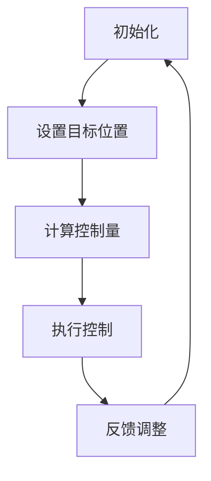

                 


### 机器人技术在医疗保健领域的创新

#### 关键词：机器人技术，医疗保健，创新应用，算法原理，数学模型，系统架构，最佳实践

#### 摘要：
本文将深入探讨机器人技术在医疗保健领域的创新应用。我们将从机器人技术的发展背景、核心概念、算法原理、数学模型、系统架构设计、项目实战到最佳实践，逐步分析机器人技术在医疗保健领域的贡献与挑战。

#### 目录：

# 第一部分：机器人技术基础与医疗保健应用

## 1.1 机器人技术的发展背景

### 1.1.1 机器人技术的发展历程

机器人技术的发展可以追溯到上世纪50年代。从最初的机械手臂到今天的智能机器人，机器人技术经历了从机械自动化到智能化的转变。特别是在人工智能技术的推动下，机器人技术取得了显著进展，逐步应用于各个领域，包括医疗保健。

### 1.1.2 机器人技术的主要分类

机器人技术主要分为工业机器人和服务机器人。工业机器人主要用于生产制造领域，如汽车制造、电子产品装配等。服务机器人则主要用于日常生活和医疗保健领域，如康复护理、辅助诊断等。

### 1.1.3 机器人技术在全球医疗保健领域的应用现状

随着机器人技术的不断进步，全球医疗保健领域对其应用越来越广泛。例如，机器人手术系统在发达国家已经得到了广泛应用，辅助诊断机器人也在逐步提高医疗诊断的准确性。同时，康复护理机器人和陪伴机器人在老年人护理和心理健康方面也展现出巨大潜力。

## 1.2 机器人技术在医疗保健中的核心概念与联系

### 1.2.1 医疗保健机器人技术的核心概念

医疗保健机器人技术主要包括机器人手术系统、辅助诊断机器人、康复护理机器人和陪伴机器人等。这些机器人在医疗保健中的应用，不仅提高了医疗服务的效率和质量，也减轻了医护人员的工作负担。

### 1.2.2 机器人技术与医疗保健的融合

机器人技术与医疗保健的融合，使得医疗保健服务更加智能化、个性化。例如，通过辅助诊断机器人，医生可以更快、更准确地诊断疾病，提高治疗效果。康复护理机器人则可以帮助患者更快地恢复健康。

### 1.2.3 机器人技术对医疗保健的影响与挑战

机器人技术的应用对医疗保健领域带来了巨大的影响，但也带来了新的挑战。例如，机器人技术在提高医疗服务质量的同时，也引发了对医疗安全、医疗伦理等方面的担忧。如何确保机器人技术的安全性和合规性，是当前需要解决的重要问题。

## 1.3 机器人技术相关的算法原理讲解

### 1.3.1 医疗保健机器人技术算法原理概述

医疗保健机器人技术算法主要包括机器人控制算法、图像处理算法和机器学习算法等。这些算法的应用，使得机器人能够更精准地执行任务，提高医疗服务的效率和质量。

### 1.3.2 算法mermaid流程图与python源代码示例

为了更好地理解这些算法，我们可以通过mermaid流程图和python源代码示例来展示。以下是机器人控制算法的mermaid流程图和python源代码示例：



```python
# Python代码示例
def control_algorithm(target_position):
    current_position = get_current_position()
    control量 = calculate_control(target_position, current_position)
    execute_control(control量)
    feedback = get_feedback()
    adjust_target_position(target_position, feedback)
```

### 1.3.3 算法原理的数学模型与公式讲解

机器人控制算法的数学模型主要包括控制量计算公式和反馈调整公式。以下是这两个公式的latex格式：

```latex
$$
控制量 = k_p \times (目标位置 - 当前位置)
$$

$$
目标位置 = 目标位置 + k_d \times (目标位置 - 当前位置)
$$
```

## 1.4 医疗保健机器人技术的数学模型和数学公式讲解

### 1.4.1 医疗保健机器人技术的数学模型

医疗保健机器人技术的数学模型主要包括机器人运动学模型、机器人动力学模型和机器人控制模型等。这些模型可以帮助我们更好地理解机器人技术的工作原理。

### 1.4.2 数学公式的latex格式嵌入

为了更直观地展示这些数学模型，我们可以使用latex格式将公式嵌入到文中。以下是机器人运动学模型的latex公式：

```latex
$$
x = x_0 + v \times t
$$

$$
y = y_0 + v \times t
$$
```

### 1.4.3 举例说明与解释

我们可以通过一个简单的例子来解释这些数学模型。假设一个机器人从原点(x=0, y=0)开始运动，速度为v=1，运动时间为t=2。根据机器人运动学模型，我们可以计算出机器人最终的位置(x, y)。

根据第一个公式，我们有：

```latex
$$
x = 0 + 1 \times 2 = 2
$$
```

根据第二个公式，我们有：

```latex
$$
y = 0 + 1 \times 2 = 2
$$
```

因此，机器人最终的位置为(x=2, y=2)。

## 1.5 本章小结

本章我们介绍了机器人技术的发展背景、核心概念、算法原理和数学模型。通过对这些内容的了解，我们可以更好地理解机器人技术在医疗保健领域的应用和贡献。在接下来的章节中，我们将进一步探讨机器人技术在医疗保健领域的创新应用和最佳实践。


# 第二部分：机器人技术在医疗保健领域的创新应用

## 2.1 机器人手术系统的创新应用

### 2.1.1 机器人手术系统的技术原理

机器人手术系统是一种集成了高精度机械臂、高分辨率摄像头和智能控制系统的机器人。它能够通过手术器械进行微创手术，实现高精度的手术操作。机器人手术系统的技术原理主要包括以下几个方面：

- **机械臂控制**：机械臂通过电机驱动，实现高精度的运动控制，保证手术器械的稳定性和灵活性。
- **摄像头成像**：摄像头用于获取手术视野，提供高清晰度的图像，辅助医生进行手术操作。
- **智能控制系统**：智能控制系统通过算法实现对机械臂和摄像头的控制，实现手术过程的自动化和智能化。

### 2.1.2 机器人手术系统的应用实例

机器人手术系统在医疗保健领域的应用已经非常广泛，以下是一些典型的应用实例：

- **心脏手术**：机器人手术系统在心脏手术中能够实现高精度的血管缝合和心脏结构的重建，减少手术创伤和并发症。
- **骨科手术**：机器人手术系统在骨科手术中能够实现精确的骨切除和骨移植，提高手术的成功率和康复效果。
- **神经外科手术**：机器人手术系统在神经外科手术中能够实现精细的神经缝合和血管修复，减少手术风险。

### 2.1.3 机器人手术系统的未来发展趋势

随着机器人技术的不断进步，机器人手术系统在未来有望实现以下几个发展趋势：

- **智能化**：通过人工智能技术，机器人手术系统将能够实现更加智能的手术决策和操作，提高手术的精准性和效率。
- **个性化**：机器人手术系统将能够根据患者的个性化需求，提供定制化的手术方案，提高手术的适应性和治疗效果。
- **远程手术**：通过互联网技术，机器人手术系统将能够实现远程手术操作，为偏远地区患者提供高质量的医疗服务。

## 2.2 辅助诊断与医疗监护机器人

### 2.2.1 辅助诊断机器人的原理与分类

辅助诊断机器人是一种能够辅助医生进行疾病诊断的机器人。它的原理主要包括以下几个方面：

- **图像处理**：辅助诊断机器人通过图像处理技术，对医学影像进行分析和处理，提取出有诊断价值的特征。
- **机器学习**：辅助诊断机器人通过机器学习技术，从大量的医学数据中学习诊断规律，提高诊断的准确性和效率。

根据诊断任务的不同，辅助诊断机器人可以分为以下几类：

- **影像辅助诊断**：主要对医学影像进行分析，如X光、CT、MRI等。
- **病理辅助诊断**：主要对病理切片进行分析，辅助医生进行病理诊断。
- **生物标志物辅助诊断**：主要对生物标志物进行分析，辅助医生进行疾病预测和诊断。

### 2.2.2 医疗监护机器人的功能与作用

医疗监护机器人是一种能够对病人进行实时监护的机器人。它的功能主要包括以下几个方面：

- **生理参数监测**：医疗监护机器人能够实时监测病人的血压、心率、呼吸等生理参数，及时发现异常情况。
- **药物管理**：医疗监护机器人能够根据医生开具的处方，自动管理病人的药物使用，确保病人按时服药。
- **心理支持**：医疗监护机器人通过语音交互和情感分析技术，为病人提供心理支持，缓解病人的焦虑和抑郁情绪。

### 2.2.3 辅助诊断与医疗监护机器人的创新案例

以下是一些辅助诊断与医疗监护机器人的创新案例：

- **影像辅助诊断**：某公司研发了一款基于深度学习的辅助诊断机器人，能够对医学影像进行快速、准确的诊断，提高医生的诊断效率。
- **病理辅助诊断**：某医院引入了一款病理辅助诊断机器人，能够对病理切片进行精确的分析，提高病理诊断的准确性。
- **医疗监护机器人**：某公司研发了一款医疗监护机器人，能够对重症病人进行实时监护，及时发现病情变化，提高病人的生存率。

## 2.3 机器人康复训练系统

### 2.3.1 机器人康复训练系统的技术原理

机器人康复训练系统是一种能够帮助患者进行康复训练的机器人。它的原理主要包括以下几个方面：

- **运动控制**：机器人康复训练系统通过高精度的运动控制系统，帮助患者进行各种康复训练，如关节活动、肌肉力量训练等。
- **传感器监测**：机器人康复训练系统通过传感器监测患者的运动状态，实时调整康复训练方案，提高康复效果。

### 2.3.2 机器人康复训练系统的应用场景

机器人康复训练系统的应用场景主要包括以下几个方面：

- **骨折康复**：机器人康复训练系统可以帮助骨折患者进行关节活动训练，防止关节僵硬，提高康复效果。
- **肌肉损伤康复**：机器人康复训练系统可以帮助肌肉损伤患者进行肌肉力量训练，增强肌肉力量，提高康复效果。
- **神经系统康复**：机器人康复训练系统可以帮助神经系统损伤患者进行康复训练，如中风康复、帕金森病康复等。

### 2.3.3 机器人康复训练系统的创新设计

以下是一些机器人康复训练系统的创新设计：

- **智能调整**：某公司研发了一款智能调整的机器人康复训练系统，能够根据患者的运动状态，自动调整康复训练的强度和难度，提高康复效果。
- **远程监控**：某公司研发了一款远程监控的机器人康复训练系统，医生可以通过网络远程监控患者的康复训练过程，及时调整康复方案。
- **个性化定制**：某公司研发了一款个性化定制的机器人康复训练系统，根据患者的具体病情和康复需求，提供个性化的康复训练方案。

## 2.4 机器人护理与陪伴机器人

### 2.4.1 机器人护理的功能与特点

机器人护理是一种能够为病人提供护理服务的机器人。它的功能主要包括以下几个方面：

- **基础护理**：机器人护理可以提供病人日常生活的基础护理服务，如翻身、喂食、清洁等。
- **监测健康**：机器人护理可以实时监测病人的生理参数，如血压、心率等，及时发现异常情况。
- **心理支持**：机器人护理可以通过语音交互和情感分析技术，为病人提供心理支持，缓解病人的焦虑和抑郁情绪。

机器人护理的特点主要包括以下几个方面：

- **高效性**：机器人护理能够高效地完成护理工作，减轻护理人员的工作负担。
- **精准性**：机器人护理通过传感器和智能控制系统，能够精准地完成护理任务，提高护理质量。
- **可扩展性**：机器人护理可以通过软件升级，不断扩展新的功能，满足不同病人的需求。

### 2.4.2 机器人陪伴机器人的技术挑战与创新

机器人陪伴机器人是一种能够为老年人、残疾人等需要陪伴的人群提供陪伴服务的机器人。它的技术挑战主要包括以下几个方面：

- **自然语言处理**：机器人陪伴机器人需要具备自然语言处理能力，能够理解人类语言，进行有效的交流。
- **情感识别与反馈**：机器人陪伴机器人需要具备情感识别能力，能够理解人的情绪变化，提供相应的情感反馈。
- **移动性**：机器人陪伴机器人需要具备良好的移动性能，能够在不同环境中灵活移动。

为了解决这些技术挑战，机器人陪伴机器人进行了以下创新：

- **多模态交互**：机器人陪伴机器人采用了多模态交互方式，包括语音、文字、表情等多种交互方式，提高交互的自然性和效果。
- **自适应导航**：机器人陪伴机器人采用了自适应导航技术，能够根据环境变化自动调整导航路径，保证移动的稳定性。
- **智能情感反馈**：机器人陪伴机器人通过情感识别技术，能够理解人的情绪变化，提供相应的情感反馈，如语音安慰、表情互动等。

### 2.4.3 机器人护理与陪伴机器人的未来前景

随着机器人技术的不断进步，机器人护理与陪伴机器人在医疗保健领域的应用前景十分广阔。未来，机器人护理与陪伴机器人将实现以下几个发展趋势：

- **智能化**：机器人护理与陪伴机器人将采用更加智能的算法和控制系统，提高护理和陪伴的精准性和效果。
- **个性化**：机器人护理与陪伴机器人将能够根据个人的需求和喜好，提供个性化的护理和陪伴服务。
- **多功能化**：机器人护理与陪伴机器人将集成更多的功能，如健康管理、药物管理、心理支持等，提高护理和陪伴的全面性。

## 2.5 本章小结

本章我们介绍了机器人手术系统、辅助诊断与医疗监护机器人、机器人康复训练系统、机器人护理与陪伴机器人的创新应用。这些机器人技术在医疗保健领域的应用，不仅提高了医疗服务的效率和质量，也为病人提供了更加人性化、个性化的护理服务。在未来，随着机器人技术的不断进步，这些机器人技术将发挥更大的作用，为医疗保健领域带来更多的创新和变革。


# 第三部分：机器人技术在医疗保健领域的最佳实践

## 3.1 医疗保健机器人项目的实施策略

### 3.1.1 项目管理的方法与工具

在实施医疗保健机器人项目时，科学的项目管理是确保项目成功的关键。以下是一些常用的项目管理方法和工具：

- **项目管理方法**：包括敏捷开发（Agile Development）、Scrum框架等，这些方法强调快速迭代、持续交付和团队合作。
- **项目管理工具**：如JIRA、Trello、Asana等，用于任务分配、进度跟踪和协作。

### 3.1.2 技术选型与解决方案

选择合适的技术和解决方案是项目成功的重要环节。以下是一些技术选型和解决方案的建议：

- **硬件选型**：根据应用需求，选择适合的医疗机器人硬件平台，如Rethink Robotics、Universal Robots等。
- **软件选型**：选择具有高可靠性、可扩展性和安全性的软件平台，如ROS（Robot Operating System）。

### 3.1.3 风险评估与应对措施

在项目实施过程中，风险评估和应对措施至关重要。以下是一些常见的风险和应对措施：

- **技术风险**：包括技术实现难度、系统集成难度等。应对措施包括技术预研、技术合作。
- **安全风险**：包括机器人的操作安全、数据安全等。应对措施包括安全认证、数据加密。

## 3.2 机器人技术在医疗保健领域的案例分析

### 3.2.1 国内外成功的机器人医疗案例

以下是一些国内外成功的机器人医疗案例：

- **达芬奇手术机器人**：美国Intuitive Surgical公司研发的达芬奇手术机器人，在全球范围内被广泛应用于微创手术，提高了手术的精度和安全性。
- **天智手术机器人**：我国天智机器人公司研发的手术机器人，已经在多个医院成功应用于微创手术，取得了良好的临床效果。

### 3.2.2 案例的启示与经验总结

通过分析这些成功案例，我们可以得到以下启示和经验总结：

- **技术创新**：不断推动技术创新，提高机器人的性能和智能化程度。
- **合作协同**：与医疗机构、科研机构等建立紧密的合作关系，共同推动机器人技术在医疗保健领域的应用。
- **法规合规**：确保机器人技术符合相关法规和标准，确保安全和有效性。

### 3.2.3 案例中的技术创新点

以下是一些案例中的技术创新点：

- **高精度控制**：通过精密控制技术，实现手术机器人的高精度操作，提高手术的成功率。
- **智能辅助系统**：通过机器学习和人工智能技术，为医生提供智能辅助，提高手术的效率和质量。
- **远程手术**：通过互联网技术，实现远程手术操作，为偏远地区患者提供高质量的医疗服务。

## 3.3 机器人技术在医疗保健领域的挑战与解决方案

### 3.3.1 技术难题与挑战

在机器人技术在医疗保健领域的应用中，仍存在一些技术难题和挑战：

- **环境适应能力**：医疗环境复杂多变，机器人需要具备良好的环境适应能力。
- **人机交互**：提高人机交互的自然性和高效性，使医生和机器人能够顺畅地协作。

### 3.3.2 法规与伦理问题

机器人技术在医疗保健领域的应用也引发了一些法规和伦理问题：

- **医疗责任**：如何界定机器人和医生在医疗过程中的责任？
- **数据隐私**：如何保护患者的数据隐私和安全？

### 3.3.3 创新解决方案与未来展望

针对上述挑战，以下是一些创新解决方案和未来展望：

- **多模态传感器**：结合多模态传感器，提高机器人对环境变化的感知能力。
- **自然语言处理**：通过自然语言处理技术，实现更自然、高效的人机交互。
- **法规制定**：制定相关的法规和标准，明确机器人技术在医疗保健领域的法律地位和责任。
- **伦理审查**：建立伦理审查机制，确保机器人技术的应用符合伦理原则。

## 3.4 最佳实践 tips

### 3.4.1 医疗保健机器人项目实践经验

以下是一些医疗保健机器人项目的实践经验：

- **团队合作**：建立跨学科的团队，包括医生、工程师、护士等，共同推动机器人技术在医疗保健领域的应用。
- **用户反馈**：及时收集用户（医生和患者）的反馈，不断优化机器人的性能和用户体验。

### 3.4.2 提高医疗保健机器人效率的策略

以下是一些提高医疗保健机器人效率的策略：

- **自动化流程**：通过自动化流程，减少重复性工作，提高工作效率。
- **优化算法**：不断优化机器人控制算法，提高机器人的响应速度和操作精度。

### 3.4.3 医疗保健机器人使用的注意事项

以下是一些医疗保健机器人使用的注意事项：

- **安全第一**：确保机器人的操作安全，防止误操作和事故发生。
- **维护保养**：定期对机器人进行维护和保养，确保机器人的正常运行。

## 3.5 本章小结

本章我们介绍了医疗保健机器人项目的实施策略、案例分析、挑战与解决方案、最佳实践 tips。通过这些内容，我们可以更好地理解和应用机器人技术在医疗保健领域的创新。在未来，随着技术的不断进步，机器人技术将为医疗保健领域带来更多的创新和变革。

# 第四部分：展望与拓展

## 4.1 机器人技术在医疗保健领域的未来发展趋势

### 4.1.1 新技术对医疗保健机器人领域的影响

随着人工智能、物联网、大数据等新技术的不断发展，机器人技术在医疗保健领域将迎来新的发展机遇。以下是一些新技术对医疗保健机器人领域的影响：

- **人工智能**：通过人工智能技术，医疗保健机器人将实现更智能的决策和操作，提高医疗服务的质量和效率。
- **物联网**：通过物联网技术，医疗保健机器人可以实现与各种医疗设备的互联互通，提高医疗数据的共享和利用效率。
- **大数据**：通过大数据技术，医疗保健机器人可以从海量医疗数据中挖掘有价值的信息，为医生提供更精准的诊断和治疗方案。

### 4.1.2 未来的医疗保健机器人产品与解决方案

未来，医疗保健机器人产品将更加多样化，满足不同医疗场景的需求。以下是一些可能的未来医疗保健机器人产品与解决方案：

- **智能手术机器人**：通过人工智能技术，实现更精准的手术操作，减少手术创伤和并发症。
- **智能康复机器人**：通过智能控制系统，帮助患者进行个性化的康复训练，提高康复效果。
- **智能护理机器人**：通过自然语言处理和情感识别技术，为患者提供更人性化的护理服务。

### 4.1.3 机器人技术在医疗保健领域的未来展望

在未来，机器人技术将在医疗保健领域发挥更重要的作用，推动医疗服务的变革。以下是一些未来展望：

- **个性化医疗**：通过机器人技术和大数据分析，实现个性化医疗，为患者提供更精准、个性化的治疗方案。
- **远程医疗**：通过机器人技术和互联网技术，实现远程医疗，为偏远地区患者提供高质量的医疗服务。
- **智慧医院**：通过机器人技术和信息化技术，构建智慧医院，提高医疗服务的效率和质量。

## 4.2 拓展阅读

为了更深入地了解机器人技术在医疗保健领域的创新，读者可以参考以下拓展阅读：

- **《机器人技术在医疗保健领域的创新与应用》**：详细介绍了机器人技术在医疗保健领域的创新应用和发展趋势。
- **《人工智能在医疗保健中的应用》**：探讨了人工智能技术在医疗保健领域的应用，包括疾病诊断、手术辅助、康复护理等。
- **《智慧医疗：互联网+医疗的变革之路》**：分析了智慧医疗的发展趋势和未来展望，包括机器人技术、大数据、云计算等。

## 4.3 结束语

本文我们探讨了机器人技术在医疗保健领域的创新应用、最佳实践和未来发展趋势。随着机器人技术的不断进步，医疗保健领域将迎来更多的创新和变革。我们期待在不久的将来，机器人技术能够为人类带来更加健康、美好的生活。作者：AI天才研究院/AI Genius Institute & 禅与计算机程序设计艺术 /Zen And The Art of Computer Programming。

