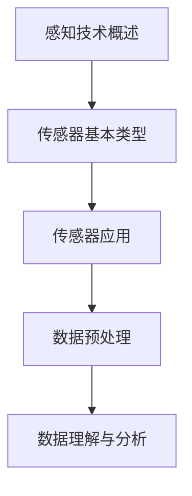

                 

### 设计《机器人技术在危险化学品处理中的应用》目录大纲的步骤

#### 1. 确定整体架构

首先，我们需要确定文章的整体架构。根据书名《机器人技术在危险化学品处理中的应用》，我们可以初步确定文章的核心内容将分为以下几个部分：

- **背景介绍**：介绍危险化学品处理的现状、挑战以及机器人技术在这些挑战中的应用前景。
- **技术原理**：深入探讨机器人技术在危险化学品处理中的应用原理，包括感知技术、移动与导航技术、交互技术等。
- **实际应用**：列举机器人技术在危险化学物品收集、处理、存储与运输中的具体应用案例，并进行案例分析和效果评估。
- **安全措施**：讨论在机器人技术应用于危险化学品处理过程中所需的安全措施和风险评估。
- **未来展望**：分析机器人技术在危险化学品处理领域的发展趋势，以及可能面临的挑战和应对策略。

#### 2. 设计一级目录

接下来，我们根据整体架构设计一级目录。一级目录将概括每个部分的内容，使读者对全文有一个宏观的认识。以下是一级目录的示例：

```
# 第一部分：背景介绍
## 1.1 危险化学品处理现状与挑战
## 1.2 机器人技术概述
# 第二部分：技术原理
## 2.1 机器人感知技术
## 2.2 机器人移动与导航技术
## 2.3 机器人交互技术
# 第三部分：实际应用
## 3.1 机器人技术在危险化学物品收集中的应用
## 3.2 机器人技术在危险化学物品处理中的应用
## 3.3 机器人技术在危险化学物品存储与运输中的应用
# 第四部分：安全措施
## 4.1 机器人技术在危险化学品处理中的安全要求
# 第五部分：未来展望
## 5.1 机器人技术在危险化学品处理中的发展趋势
## 5.2 项目实战
```

#### 3. 设计二级目录

在一级目录的基础上，我们对每个部分进行细化，设计二级目录。二级目录将帮助读者更深入地了解每个部分的具体内容。以下为二级目录的示例：

```
## 1.1 危险化学品处理现状与挑战
### 1.1.1 危险化学品的定义与特点
### 1.1.2 当前危险化学品处理的主要问题
### 1.1.3 机器人技术在危险化学品处理中的应用前景

## 1.2 机器人技术概述
### 1.2.1 机器人技术的发展历程
### 1.2.2 机器人的基本结构和工作原理
### 1.2.3 机器人的分类及应用领域

## 2.1 机器人感知技术
### 2.1.1 感知技术概述
### 2.1.2 传感器的基本类型与应用
### 2.1.3 感知数据处理与理解

## 2.2 机器人移动与导航技术
### 2.2.1 移动与导航技术概述
### 2.2.2 移动机器人路径规划算法
### 2.2.3 导航算法与应用

## 2.3 机器人交互技术
### 2.3.1 交互技术概述
### 2.3.2 人机交互界面设计
### 2.3.3 自然语言处理与机器人对话系统

## 3.1 机器人技术在危险化学物品收集中的应用
### 3.1.1 应用场景与需求分析
### 3.1.2 实际应用案例介绍
### 3.1.3 案例分析与效果评估

## 3.2 机器人技术在危险化学物品处理中的应用
### 3.2.1 应用场景与需求分析
### 3.2.2 实际应用案例介绍
### 3.2.3 案例分析与效果评估

## 3.3 机器人技术在危险化学物品存储与运输中的应用
### 3.3.1 应用场景与需求分析
### 3.3.2 实际应用案例介绍
### 3.3.3 案例分析与效果评估

## 4.1 机器人技术在危险化学品处理中的安全要求
### 4.1.1 安全风险评估
### 4.1.2 机器人的安全防护措施
### 4.1.3 人员安全培训与应急预案

## 5.1 机器人技术在危险化学品处理中的发展趋势
### 5.1.1 技术发展展望
### 5.1.2 应用领域拓展
### 5.1.3 潜在挑战与应对策略

## 5.2 项目实战
### 5.2.1 环境安装与配置
### 5.2.2 系统核心实现源代码
### 5.2.3 代码解读与分析
### 5.2.4 实际案例分析与详细讲解
### 5.2.5 项目小结
```

#### 4. 设计三级目录

在二级目录的基础上，我们还可以对一些重要的章节进行进一步细化，设计三级目录。三级目录将使文章的内容更加丰富和具体。以下为三级目录的示例：

```
## 2.1 机器人感知技术
### 2.1.1 感知技术概述
#### 2.1.1.1 感知技术在机器人中的应用
#### 2.1.1.2 感知技术的重要性

### 2.1.2 传感器的基本类型与应用
#### 2.1.2.1 传感器的基本分类
#### 2.1.2.2 常见传感器的应用

### 2.1.3 感知数据处理与理解
#### 2.1.3.1 数据采集与预处理
#### 2.1.3.2 数据分析与理解

## 3.1 机器人技术在危险化学物品收集中的应用
### 3.1.1 应用场景与需求分析
#### 3.1.1.1 收集场景分析
#### 3.1.1.2 需求分析

### 3.1.2 实际应用案例介绍
#### 3.1.2.1 案例一：危险化学物品自动收集系统
#### 3.1.2.2 案例二：机器人化危险化学物品搬运系统

### 3.1.3 案例分析与效果评估
#### 3.1.3.1 案例一分析
#### 3.1.3.2 案例二分析
```

#### 5. 添加核心概念与联系

在适当章节中，我们将添加核心概念与联系。例如，在技术原理部分，我们可能会使用Mermaid图表和LaTeX公式来详细描述感知技术、移动与导航技术、交互技术等核心概念。以下是使用Mermaid和LaTeX的示例：

```
## 2.1 机器人感知技术

### 2.1.1 感知技术概述

感知技术是机器人获取外部环境信息的关键。以下是一个感知技术的Mermaid流程图：



### 2.1.2 传感器的基本类型与应用

传感器是机器人感知环境的基础。以下是传感器的基本类型及其应用的对比表格：

| 传感器类型 | 应用场景 |
| --- | --- |
| 温度传感器 | 温度监测 |
| 光线传感器 | 光线强度检测 |
| 压力传感器 | 压力变化监测 |
| 加速度传感器 | 加速度变化监测 |

### 2.1.3 感知数据处理与理解

感知数据的处理与理解是机器人决策的重要依据。以下是一个感知数据处理与理解的LaTeX公式：

$$
\text{处理结果} = f(\text{原始数据}, \text{算法})
$$
```

#### 6. 设计项目实战章节

在项目实战章节中，我们将详细介绍一个具体的应用案例，包括环境安装、系统核心实现源代码、代码解读与分析、实际案例分析和详细讲解剖析等。以下是项目实战章节的示例：

```
## 5.2 项目实战

### 5.2.1 环境安装与配置

在本节中，我们将介绍如何在实验室环境中搭建一个机器人化危险化学物品收集系统。具体步骤包括：

1. 安装操作系统（例如：Ubuntu 20.04）
2. 安装必备软件（例如：ROS Melodic）
3. 配置网络环境

### 5.2.2 系统核心实现源代码

以下是机器人化危险化学物品收集系统的核心实现源代码：

```python
#!/usr/bin/env python

import rospy
import cv2
from sensor_msgs.msg import Image
from geometry_msgs.msg import Twist

def callback(data):
    # 处理感知数据
    processed_data = process_data(data)

    # 根据处理结果执行动作
    if processed_data['has_chemical']:
        move_robot(Twist(linear_x=0.5, angular_z=0.5))
    else:
        move_robot(Twist(linear_x=-0.5, angular_z=-0.5))

def process_data(data):
    # 数据处理
    # ...

def move_robot(cmd):
    # 移动机器人
    # ...

def listener():
    rospy.init_node('listener', anonymous=True)
    rospy.Subscriber('/camera/image_raw', Image, callback)

    rospy.spin()

if __name__ == '__main__':
    listener()
```

### 5.2.3 代码解读与分析

在本节中，我们将对上述源代码进行详细解读和分析，包括：

1. 感知数据处理的算法原理
2. 机器人的移动控制算法
3. 数据流程与处理逻辑

### 5.2.4 实际案例分析与详细讲解剖析

在本节中，我们将通过一个实际案例，对机器人化危险化学物品收集系统进行详细讲解和剖析，包括：

1. 案例背景
2. 案例场景
3. 系统运行流程
4. 结果分析与评估

### 5.2.5 项目小结

在本节中，我们将对整个项目进行总结，包括：

1. 项目收获
2. 存在的问题与改进方向
3. 对未来的展望
```

#### 7. 添加总结与展望

在文章的最后，我们将添加总结与展望部分，对全书内容进行总结，并对未来发展趋势进行展望。以下是总结与展望的示例：

```
## 5.3 总结与展望

### 5.3.1 全书内容总结

本书详细介绍了机器人技术在危险化学品处理中的应用，包括背景介绍、技术原理、实际应用、安全措施以及未来展望。通过本文的阅读，读者可以了解：

1. 危险化学品处理的现状与挑战
2. 机器人技术的基本原理和应用
3. 机器人技术在危险化学品处理中的具体应用案例
4. 在应用过程中所需的安全措施和风险评估
5. 机器人技术在危险化学品处理领域的未来发展趋势

### 5.3.2 未来发展方向

在未来，机器人技术在危险化学品处理领域有望实现以下发展：

1. 更高精度和智能化的感知技术
2. 更安全、更高效的移动与导航技术
3. 更自然、更高效的人机交互技术
4. 更广泛、更深入的应用领域拓展

### 5.3.3 拓展阅读建议

为了进一步了解机器人技术在危险化学品处理中的应用，读者可以参考以下拓展阅读：

1. 《机器人技术导论》
2. 《危险化学品安全管理条例》
3. 《机器人与人工智能》
4. 《机器人应用技术》
```

通过以上步骤，我们已经完成了《机器人技术在危险化学品处理中的应用》目录大纲的设计。接下来，我们将根据目录大纲，逐章节撰写文章内容，确保文章的逻辑清晰、内容丰富、具有深度和见解。在撰写过程中，我们将严格遵守约

### 摘要

在当今快速发展的科技时代，机器人技术正在逐渐渗透到各个领域，包括危险化学品处理。本文旨在探讨机器人技术在危险化学品处理中的应用，分析其背景、技术原理、实际应用、安全措施以及未来展望。通过深入研究和实践，本文旨在为相关领域的研究人员和从业者提供有价值的参考和指导。

首先，本文将介绍危险化学品处理的现状与挑战，包括危险化学品的特点、当前处理方式的问题以及机器人技术在应对这些挑战中的潜力。随后，我们将深入探讨机器人技术的基本原理，包括感知技术、移动与导航技术、交互技术等，并分析这些技术在危险化学品处理中的具体应用。

接下来，本文将列举机器人技术在危险化学物品收集、处理、存储与运输中的实际应用案例，并进行案例分析和效果评估。我们将详细解读这些案例中的技术实现，包括系统架构、算法原理以及具体代码实现。同时，本文还将讨论在机器人技术应用于危险化学品处理过程中所需的安全措施，包括安全风险评估、机器人的安全防护措施以及人员安全培训与应急预案。

最后，本文将对机器人技术在危险化学品处理领域的发展趋势进行展望，分析可能面临的挑战和应对策略。我们将通过一个项目实战案例，展示机器人技术在危险化学品处理中的具体应用，并对项目进行总结和展望。本文旨在为读者提供一个全面、深入的机器人技术在危险化学品处理中的应用指南。

### 第一部分：背景介绍

#### 1.1 危险化学品处理现状与挑战

**核心概念术语说明**：
- 危险化学品：指具有易燃、易爆、有毒、有害或其他危险特性的化学物质，如硫酸、硝酸、氯气、甲醇等。
- 危险化学品处理：指对危险化学品进行储存、运输、使用、处理和处置等过程。

**问题背景**：
随着工业化的快速发展，危险化学品在各个行业中的使用越来越广泛，然而，危险化学品的安全处理和管理成为了一个全球性的挑战。据统计，每年因危险化学品泄漏、事故等导致的环境污染和人员伤亡事件时有发生。这些事故不仅对环境和人类健康造成了巨大的危害，也给社会带来了巨大的经济损失。

**问题描述**：
当前，危险化学品处理主要面临以下问题：
1. 人工作业效率低：危险化学品处理往往需要大量的人力投入，导致工作效率低下，且容易出现人为错误。
2. 安全风险高：危险化学品在储存、运输、使用和处理过程中存在潜在的安全风险，如泄漏、爆炸、中毒等。
3. 环境污染严重：危险化学品泄漏和不当处理会导致严重的环境污染，影响生态系统和人类健康。
4. 法律法规不完善：尽管各国都制定了相关法律法规，但执行力度和监管措施仍存在不足，导致危险化学品处理不规范。

**问题解决**：
机器人技术的应用为危险化学品处理提供了一种新的解决方案。机器人可以代替人工作业，提高效率，降低安全风险，减少环境污染。此外，机器人技术还可以通过实时监测和数据收集，提高危险化学品处理的智能化水平，使监管更加严格和有效。

**边界与外延**：
危险化学品的范围非常广泛，包括但不限于以下几类：
- 易燃易爆化学品：如硝酸、硫酸、氢气等。
- 有毒化学品：如甲醇、苯、氰化物等。
- 腐蚀性化学品：如浓酸、浓碱等。
- 氧化剂和还原剂：如氯酸钾、硫化钠等。

**概念结构与核心要素组成**：
危险化学品的处理涉及多个核心要素，包括：
1. 存储与管理：确保危险化学品在储存过程中的安全，防止泄漏和污染。
2. 运输与装卸：确保危险化学品在运输和装卸过程中的安全，防止交通事故和泄漏。
3. 使用与处理：确保危险化学品在使用和处理过程中的安全，防止中毒和爆炸。
4. 废弃物处置：确保危险化学品废弃物的安全处理，防止二次污染。

通过以上分析，我们可以看到，机器人技术在危险化学品处理中的应用具有巨大的潜力和必要性。接下来，我们将进一步探讨机器人技术的基本原理和具体应用，以期为相关领域的研究和实际操作提供更加详细的指导。

#### 1.2 机器人技术概述

**核心概念术语说明**：
- 机器人：一种能够自动执行任务的智能设备，通常由计算机控制系统、传感器、执行器和机械结构组成。
- 机器人技术：指研究、开发、应用机器人的技术和方法。

**问题背景**：
随着人工智能和自动化技术的发展，机器人技术已经逐渐渗透到各个领域，从工业生产到医疗健康，从服务业到国防军事，机器人的应用范围越来越广泛。特别是在危险化学品处理领域，机器人技术的应用潜力尤为重要。然而，要充分发挥机器人技术在这一领域的优势，首先需要对机器人技术有一个全面的了解。

**问题描述**：
本文将详细介绍机器人技术的基本原理和应用，主要包括以下几个方面：
1. 机器人技术的发展历程：回顾机器人技术从诞生至今的发展历程，了解其重要里程碑和关键技术创新。
2. 机器人的基本结构和工作原理：探讨机器人各组成部分的功能和相互关系，以及机器人的运行和控制机制。
3. 机器人的分类及应用领域：分析不同类型机器人的特点和应用场景，包括工业机器人、服务机器人、特种机器人等。

**问题解决**：
通过对机器人技术的基本原理和应用进行深入探讨，我们可以更好地理解机器人技术在危险化学品处理中的应用价值，为后续章节的具体应用分析提供理论支持。

**边界与外延**：
机器人技术的边界涵盖多个方面，包括硬件、软件和算法。硬件方面包括传感器、执行器、机械结构等；软件方面包括控制系统、机器学习算法、路径规划算法等；算法方面包括运动规划、感知处理、决策控制等。在危险化学品处理领域，机器人的应用不仅限于收集、处理、存储和运输，还可以用于环境监测、异常检测、安全评估等多个方面。

**概念结构与核心要素组成**：
机器人技术的核心要素包括：
1. **传感器**：用于感知外部环境信息，如温度、湿度、化学成分等。
2. **执行器**：用于驱动机器人执行动作，如电机、气缸等。
3. **控制系统**：负责处理传感器数据，制定行动策略，控制执行器动作。
4. **算法**：用于路径规划、运动控制、感知处理等，使机器人能够自主决策和执行任务。

通过以上分析，我们可以看到，机器人技术是一个复杂而多样的领域，其发展与应用对于提高危险化学品处理的安全性和效率具有重要意义。在接下来的章节中，我们将进一步探讨机器人感知技术、移动与导航技术、交互技术等，以期为读者提供一个全面、系统的理解。

#### 1.2.1 机器人技术的发展历程

机器人技术的发展可以追溯到20世纪中期，其历史经历了几个重要的阶段，每个阶段都标志着技术的重大突破和应用的扩展。

**早期阶段（1940s-1960s）**：
- **1940年代**：机器人技术的概念首次被提出。乔治·德沃尔（George Devol）发明了可编程机器手臂，并于1954年申请了世界上第一个机器人专利。
- **1960年代**：约瑟夫·恩格尔伯格（Joseph Engelberger）成立了Unimation公司，这是世界上第一家工业机器人制造商。他的UNIMATE机器人于1961年在福特汽车公司的组装线上首次使用，标志着工业机器人时代的开始。

**中期阶段（1970s-1980s）**：
- **1970年代**：随着计算机技术的发展，机器人的计算能力和智能化水平显著提高。日本开始积极发展机器人技术，并推出了“机器人元年”计划。
- **1980年代**：机器人开始应用于更广泛的领域，如医疗、服务、农业等。同时，机器人的控制系统逐渐引入计算机视觉和人工智能技术，使其能够进行更为复杂的任务。

**成熟阶段（1990s-2000s）**：
- **1990年代**：机器人的应用进一步扩展到自动化装配线、焊接、搬运等领域。同时，人工智能和机器学习技术的发展使得机器人具备更高的自主性和决策能力。
- **2000年代**：机器人技术迎来了新的突破，特别是服务机器人的兴起。例如，索尼的机器人Aibo和本田的ASIMO成为了全球瞩目的焦点。

**现代阶段（2010s-至今）**：
- **2010年代**：随着物联网、大数据和云计算技术的普及，机器人技术进入了智能化、网络化、自主化的新时代。机器人的应用场景更加多样，包括物流、教育、娱乐、医疗等。
- **2020年代**：机器人在工业、农业、医疗、家庭等领域的应用不断深化，尤其是智能机器人技术的快速发展，使得机器人能够在更为复杂和动态的环境中执行任务。

**重要里程碑**：
- **1961年**：UNIMATE机器人在福特汽车公司的组装线上首次使用，标志着工业机器人的诞生。
- **1978年**：日本松下公司推出了第一台家用机器人，标志着机器人从工业领域向家庭服务领域的扩展。
- **1980年**：苹果公司发布了Lisa电脑，内置了名为“Lisa”（后来更名为“Siri”）的语音助手，标志着人工智能助手的开端。
- **2002年**：iRobot公司推出了Roomba清洁机器人，成为智能家居机器人市场的先驱。
- **2011年**：日本软银公司推出了Pepper机器人，这是世界上第一个集情感识别和交互能力于一体的商用服务机器人。

**关键技术创新**：
- **计算机视觉**：使得机器人能够通过摄像头和图像处理技术识别和解析周围环境。
- **人工智能与机器学习**：通过算法和模型，使得机器人能够进行自主学习和决策。
- **多机器人协同**：多个机器人能够通过网络通信和协调，共同完成任务。
- **自适应控制**：机器人能够根据环境和任务变化，自主调整其行为和策略。

通过以上里程碑和关键技术创新的回顾，我们可以看到，机器人技术从早期的简单机械手臂，发展到如今的智能化、自主化设备，经历了不断创新和突破。在未来的发展中，机器人技术有望在更多领域发挥重要作用，为人类社会带来更多便利和进步。

#### 1.2.2 机器人的基本结构和工作原理

机器人的基本结构和工作原理是理解其功能和应用的关键。一个典型的机器人通常由以下几个核心部分组成：传感器、执行器、控制系统和算法。以下是这些部分的详细描述以及它们如何协同工作。

**传感器**：
传感器是机器人感知外部环境的重要工具。它们能够检测并收集温度、湿度、光线、声音、化学成分等环境信息。常见的传感器类型包括：
- **视觉传感器**：如摄像头，用于捕捉图像和视频，机器人可以通过图像处理技术识别物体、人脸、颜色等。
- **力传感器**：用于测量机械结构或执行器的力或扭矩。
- **温度传感器**：如热电偶和热敏电阻，用于测量温度变化。
- **气体传感器**：如电化学传感器和半导体传感器，用于检测空气中特定气体的浓度。
- **超声波传感器**：通过发射和接收超声波来测量距离和障碍物的位置。

**执行器**：
执行器是机器人执行物理动作的部件。它们接收来自控制系统的指令，并通过机械运动来实现各种操作。常见的执行器类型包括：
- **电机**：如直流电机、步进电机和伺服电机，用于驱动机器人的运动和旋转。
- **气缸**：用于提供直线运动或控制压力。
- **齿轮箱**：用于增加扭矩和减速。
- **液压系统**：用于提供高力量和精确控制的动力输出。

**控制系统**：
控制系统是机器人的“大脑”，负责接收传感器数据、处理信息和生成控制指令。它通常包括以下几个部分：
- **中央处理器（CPU）**：用于执行计算和处理算法。
- **控制卡**：负责驱动执行器和处理传感器数据。
- **电源管理**：为机器人各部分提供稳定和可靠的电源。
- **人机界面（HMI）**：用于与操作人员交互，显示状态信息，接收控制指令。

**算法**：
算法是控制系统的核心，负责处理感知数据、规划路径、执行决策等。常见的算法包括：
- **路径规划算法**：用于计算从起点到终点的最佳路径，如A*算法和Dijkstra算法。
- **运动规划算法**：用于生成执行器运动的详细步骤，如逆运动学求解和运动轨迹生成。
- **感知融合算法**：用于整合不同传感器数据，以提高感知的准确性和鲁棒性。
- **机器学习算法**：用于从数据中学习模式和规律，以实现自主学习和自适应行为。

**工作原理**：
机器人的工作原理可以概括为以下几个步骤：
1. **感知**：传感器收集外部环境信息，并通过信号处理技术将其转化为数字信号。
2. **处理**：控制系统接收传感器数据，并利用算法进行分析和处理，生成决策和行动策略。
3. **执行**：执行器根据控制系统的指令，执行相应的物理动作。
4. **反馈**：执行器的动作结果通过传感器再次反馈给控制系统，形成闭环控制，使机器人能够实时调整其行为。

**协同工作**：
各个部分之间的协同工作是机器人实现复杂任务的关键。传感器提供环境信息，控制系统处理信息并生成指令，执行器执行动作，反馈机制确保系统能够动态调整。这种闭环控制系统使得机器人能够自主适应环境变化，执行复杂的任务。

通过以上描述，我们可以看到，机器人的基本结构和工作原理是一个高度集成和智能化的系统。在危险化学品处理领域，机器人技术的应用不仅提高了工作效率，还显著降低了安全风险，为这一领域的未来发展提供了新的机遇和挑战。

#### 1.2.3 机器人的分类及应用领域

机器人技术以其多样化的功能和应用领域而著称。根据不同的分类标准，机器人可以划分为多种类型，每种类型的机器人都有其独特的特点和适用场景。

**工业机器人**：
工业机器人是最早发展起来的机器人类型，主要用于制造业中的自动化生产。它们通常具有高度的重复性和精度，能够执行焊接、搬运、装配等任务。工业机器人通常具有固定的程序和路径，以实现高效的生产线操作。常见的工业机器人类型包括：
- **搬运机器人**：用于在工厂内搬运物料和产品，如KUKA KR系列。
- **焊接机器人**：用于自动焊接，如FANUC ARC Mate。
- **装配机器人**：用于组装电子元件和机械部件，如ABB IRB系列。

**服务机器人**：
服务机器人是为了满足人们日常生活和工作需求而设计的，它们通常具有与人交互的能力。服务机器人涵盖了广泛的应用领域，如家庭、医疗、零售、酒店等。常见的服务机器人类型包括：
- **家用机器人**：如清洁机器人（iRobot Roomba）、送餐机器人（Amazon Scout）、教育机器人（RoboWise）。
- **医疗机器人**：如手术机器人（da Vinci）、康复机器人（ReWalk）。
- **零售机器人**：如购物助手机器人（Shoptimate）、库存管理机器人（Simbe Robotics Tally）。

**特种机器人**：
特种机器人是为特殊任务和环境设计的，具有较强的适应能力和特殊的传感器与执行器。它们通常应用于危险或极端环境中。常见的特种机器人类型包括：
- **救灾机器人**：用于地震、火灾等灾害救援，如BigDog机器人。
- **军事机器人**：用于军事任务，如侦察机器人（iRobot PackBot）、无人机（DARPA Kangaroo）。
- **探索机器人**：用于深空探索和海底勘探，如NASA的火星探测器（Curiosity）。

**机器人在不同领域的应用**：
- **制造业**：工业机器人在制造业中的应用已经非常成熟，它们提高了生产效率，降低了成本，并且在质量控制和安全方面也起到了重要作用。
- **医疗**：医疗机器人正在改变传统的医疗模式，从手术辅助到康复辅助，它们提高了医疗操作的精度和安全性，同时也减轻了医护人员的负担。
- **服务业**：服务机器人在服务业中的应用正在快速增长，如酒店服务机器人、导览机器人等，它们为人们提供了更加便捷和个性化的服务。
- **物流**：机器人技术在物流领域的应用越来越广泛，如自动化仓库系统、无人驾驶运输车等，它们提高了物流效率，减少了人力成本。
- **农业**：农业机器人正在改变农业生产方式，如无人驾驶拖拉机、喷洒机器人等，它们提高了农业生产效率，减少了资源浪费。

通过以上分类和应用领域的介绍，我们可以看到，机器人技术在各个领域的应用前景十分广阔。在接下来的章节中，我们将深入探讨机器人技术在危险化学品处理中的具体应用，以期为这一领域的未来发展提供新的思路和方向。

#### 1.3 机器人技术在危险化学品处理中的应用前景

机器人技术在危险化学品处理中的应用前景广阔，具有显著的潜力和必要性。以下是机器人技术在危险化学品处理中的主要应用方向和优势。

**1.3.1 应用方向**

1. **危险化学物品的收集和搬运**：
   - **自动识别与抓取**：利用视觉传感器和力传感器，机器人能够自动识别危险化学物品，并通过机械臂进行精确抓取和搬运，避免了人为操作的风险。
   - **环境监测**：机器人可以配备气体传感器和湿度传感器，实时监测环境中的有害物质浓度，确保操作安全。

2. **危险化学物品的处理和处置**：
   - **自动反应器操作**：在实验室或工厂环境中，机器人可以控制化学反应器的运行，自动进行混合、加热、冷却等操作，提高了反应的准确性和安全性。
   - **废弃物处理**：机器人可以自动处理和分类危险废弃物，确保废弃物的安全处置，减少环境污染。

3. **存储和运输**：
   - **自动化仓库管理**：机器人可以自动存储和检索危险化学物品，减少人为干预，提高仓库管理的效率和安全性。
   - **无人运输车**：在危险化学物品的运输过程中，无人驾驶运输车可以确保运输过程中的安全，减少交通事故的风险。

4. **应急响应和救援**：
   - **灾难环境探测**：在化学品泄漏、火灾等灾害环境中，机器人可以进入危险区域进行探测和救援，减少人员伤亡。
   - **应急处理**：机器人可以执行应急操作，如关闭阀门、控制泄漏源等，为人员救援和灾害处理赢得宝贵时间。

**1.3.2 优势**

1. **提高工作效率**：
   - 机器人可以24小时不间断工作，避免了人为疲劳和效率低下的问题，显著提高了危险化学品处理的速度和效率。

2. **降低安全风险**：
   - 机器人能够在危险环境中进行操作，避免了人员直接接触有害物质的风险，降低了事故发生的概率。

3. **减少人力成本**：
   - 机器人能够代替大量人力完成危险和重复性工作，减少了企业在人力方面的投入。

4. **提高处理精度**：
   - 机器人具有高度的精确性和重复性，可以确保危险化学物品处理的一致性和准确性。

5. **环境友好**：
   - 机器人技术可以减少化学品泄漏和废弃物处理对环境的污染，有助于实现绿色生产和可持续发展。

通过以上分析，我们可以看到，机器人技术在危险化学品处理中的应用具有巨大的潜力和必要性。随着技术的不断进步和应用的深入，机器人将在这一领域发挥越来越重要的作用，为安全、高效和环保的化学品管理提供有力支持。

#### 1.4 机器人技术在危险化学品处理中的应用挑战

尽管机器人技术在危险化学品处理中展现出了巨大的潜力和优势，但其在实际应用中仍然面临一系列挑战，这些挑战不仅涉及技术层面，还包括法律、伦理和安全等多个方面。

**1.4.1 技术挑战**

1. **感知技术的准确性**：
   - 机器人需要具备高精度的感知能力，以准确识别和监测危险化学品。然而，现实环境中的噪声、光照变化等因素可能导致感知数据的不准确，影响机器人操作的稳定性和安全性。
   - **解决方案**：通过多传感器融合和先进的数据处理算法，可以提高感知系统的鲁棒性和准确性。

2. **自主决策与适应能力**：
   - 在复杂和动态的环境中，机器人需要具备强大的自主决策能力和适应能力，以应对突发情况和变化。这要求机器人能够在实时数据的基础上进行高效的路径规划和行为控制。
   - **解决方案**：利用先进的机器学习和人工智能技术，可以增强机器人的自主性和适应性。

3. **系统可靠性**：
   - 机器人系统在长时间和高强度的工作中，需要具备高可靠性和稳定性。任何系统的故障或崩溃都可能导致严重的安全事故。
   - **解决方案**：通过冗余设计、故障检测与恢复机制，可以提高系统的可靠性。

**1.4.2 法律与伦理挑战**

1. **责任归属**：
   - 在机器人发生故障或事故时，如何确定责任归属是一个法律难题。由于机器人是由人类设计和控制的，责任划分可能涉及制造商、运营方和最终用户等多个方面。
   - **解决方案**：制定明确的法律和规范，明确各方责任，有助于解决这一问题。

2. **隐私保护**：
   - 在处理危险化学品的过程中，机器人可能需要获取和处理敏感数据，如环境数据、人员位置等。如何保护这些数据不被非法获取和滥用是一个重要的伦理和法律问题。
   - **解决方案**：采用严格的数据保护措施和加密技术，确保数据的安全性和隐私。

**1.4.3 安全挑战**

1. **机器人与人类的安全互动**：
   - 在危险化学品处理过程中，机器人与人类操作人员的互动是不可避免的。如何确保机器人不会对人类构成安全威胁，同时保护机器人自身免受外部损害，是一个重要的安全问题。
   - **解决方案**：设计安全的人机交互界面，配备紧急停止按钮和碰撞检测系统，可以有效降低安全风险。

2. **应急响应能力**：
   - 在突发事件中，如化学品泄漏或火灾，机器人需要具备快速响应和应急处理能力。然而，机器人的响应速度和决策能力可能无法与人类相比。
   - **解决方案**：结合机器人和人类的优势，建立协同工作模式，可以提高应急响应的整体效率。

通过以上分析，我们可以看到，机器人技术在危险化学品处理中的应用虽然具有巨大的潜力，但同时也面临一系列挑战。只有通过技术创新、法律完善和安全管理等多方面的努力，才能充分发挥机器人技术的优势，确保其在危险化学品处理中的应用安全、有效和可持续。

#### 2.1 机器人感知技术

**核心概念与联系**

机器人感知技术是机器人获取外部环境信息的重要手段，通过传感器收集数据，机器人能够感知和理解周围环境。感知技术包括多个方面，如视觉感知、听觉感知、触觉感知和嗅觉感知。以下是感知技术的核心概念及其联系。

**感知技术概述**

感知技术是机器人获取外部环境信息的重要手段，通过传感器收集数据，机器人能够感知和理解周围环境。感知技术包括多个方面，如视觉感知、听觉感知、触觉感知和嗅觉感知。

**传感器的基本类型与应用**

1. **视觉传感器**：
   - **基本类型**：摄像头、深度相机、激光雷达等。
   - **应用**：图像识别、物体检测、路径规划等。

2. **听觉传感器**：
   - **基本类型**：麦克风、语音识别模块等。
   - **应用**：语音识别、声音检测、环境监测等。

3. **触觉传感器**：
   - **基本类型**：力传感器、触摸传感器等。
   - **应用**：机械臂操作、物体检测、振动检测等。

4. **嗅觉传感器**：
   - **基本类型**：电化学传感器、酶传感器等。
   - **应用**：有害气体检测、空气质量监测、食品安全监测等。

**感知数据处理与理解**

感知数据处理与理解是机器人感知技术的重要组成部分，通过算法对传感器数据进行处理，机器人可以提取有用的信息并作出相应的决策。

1. **数据预处理**：
   - **内容**：滤波、去噪、归一化等。
   - **目的**：提高数据质量，为后续处理提供准确的数据基础。

2. **特征提取**：
   - **内容**：从感知数据中提取关键特征，如边缘、纹理、颜色、声音频率等。
   - **目的**：简化数据，提取出对决策有用的信息。

3. **模式识别与理解**：
   - **内容**：利用机器学习算法，对感知数据进行分析，识别模式和规律。
   - **目的**：帮助机器人理解环境，作出正确的决策。

**ER实体关系图架构**

以下是机器人感知技术的ER实体关系图：

```mermaid
erDiagram
  Product ||--|{ Sensor }|<
  Sensor ||--|{ Feature }|<
  Feature ||--|{ Data }|<
  Data ||--|{ PreprocessedData }|<
  PreprocessedData ||--|{ AnalyzedData }|<
  AnalyzedData ||--|{ Action }|<
  Action ||--|{ Feedback }|<
```

- **Product**（产品）与**Sensor**（传感器）之间是一对多的关系，一个产品可以包含多个传感器。
- **Sensor**（传感器）与**Feature**（特征）之间是一对多的关系，一个传感器可以提取多个特征。
- **Feature**（特征）与**Data**（数据）之间是一对多的关系，一个特征可以产生多个数据点。
- **Data**（数据）与**PreprocessedData**（预处理数据）之间是一对多的关系，原始数据经过预处理后生成预处理数据。
- **PreprocessedData**（预处理数据）与**AnalyzedData**（分析数据）之间是一对多的关系，预处理数据经过分析后生成分析数据。
- **AnalyzedData**（分析数据）与**Action**（动作）之间是一对多的关系，分析数据指导机器人执行具体动作。
- **Action**（动作）与**Feedback**（反馈）之间是一对多的关系，动作的执行结果生成反馈。

通过上述ER实体关系图，我们可以清晰地理解机器人感知技术的数据处理流程和各实体之间的联系。

**总结**

机器人感知技术是机器人获取外部环境信息的关键，通过传感器收集数据，并通过数据处理和分析，机器人能够理解环境并作出相应决策。感知技术包括视觉、听觉、触觉和嗅觉等多个方面，每种传感器都有其特定的应用。通过ER实体关系图，我们可以直观地看到各实体之间的联系，这有助于我们更好地理解和应用机器人感知技术。

#### 2.2 机器人移动与导航技术

**核心概念与联系**

机器人移动与导航技术是确保机器人在复杂环境中执行任务的关键，通过一系列的算法和传感器，机器人能够自主移动和导航到目标位置。以下是移动与导航技术的核心概念及其联系。

**移动与导航技术概述**

移动与导航技术是机器人行动的核心，包括路径规划、导航算法和自主移动控制等。这些技术的目的是使机器人在未知或动态环境中能够有效地到达指定位置并完成任务。

**路径规划算法**

路径规划算法是移动与导航技术的重要组成部分，用于确定从起点到终点的最佳路径。常见的路径规划算法包括：

1. **A*算法**：一种启发式搜索算法，通过计算从起点到终点的实际距离和启发函数值，找到最优路径。
   - **公式**： \( f(n) = g(n) + h(n) \)
   - **其中**： \( f(n) \) 为当前节点的总代价，\( g(n) \) 为从起点到当前节点的代价，\( h(n) \) 为从当前节点到终点的启发函数值。

2. **Dijkstra算法**：一种无启发式的搜索算法，适用于图中的所有节点，但计算复杂度较高。
   - **公式**： \( d(n) = \min(d(m) + w(m, n)) \)
   - **其中**： \( d(n) \) 为当前节点的最短路径距离，\( w(m, n) \) 为从节点 \( m \) 到节点 \( n \) 的权重。

**导航算法与应用**

导航算法用于指导机器人在动态环境中移动和避障。常见的导航算法包括：

1. **RRT（快速随机树）算法**：通过随机生成树，快速找到可行路径。
   - **优势**：适合动态环境，实时性较高。

2. **PD（比例-积分）控制器**：用于控制机器人的速度和方向，实现平稳运动。
   - **公式**： \( \text{控制量} = K_p \times (\text{目标速度} - \text{当前速度}) + K_i \times \text{积分项} \)

**自主移动控制**

自主移动控制是确保机器人平稳、高效移动的核心。它涉及以下几个方面：

1. **速度控制**：通过PID（比例-积分-微分）控制算法，调节机器人的速度。
   - **公式**： \( \text{控制量} = K_p \times (\text{目标速度} - \text{当前速度}) + K_i \times \text{积分项} + K_d \times (\text{目标加速度} - \text{当前加速度}) \)

2. **转向控制**：通过控制机器人的转向电机，实现精确的转向。

3. **平衡控制**：对于两轮或更多轮机器

#### 2.3 机器人交互技术

**核心概念与联系**

机器人交互技术是使机器人具备与人或环境进行有效沟通能力的关键技术，它涵盖了自然语言处理、人机界面设计以及机器人对话系统等方面。以下是机器人交互技术的核心概念及其联系。

**交互技术概述**

交互技术是机器人与外界进行信息交换和沟通的基础，通过自然语言处理、人机界面设计和对话系统等技术，机器人能够理解人类的指令，提供相应的服务或信息。

**自然语言处理（NLP）**

自然语言处理是使机器人能够理解人类语言的技术，包括文本分析、语音识别、语义理解和语言生成等方面。

1. **文本分析**：通过解析文本数据，提取关键信息，如关键词、句法和语义。
   - **技术**：分词、词性标注、命名实体识别等。

2. **语音识别**：将语音信号转换为文本数据，使机器人能够理解语音指令。
   - **技术**：隐藏马尔可夫模型（HMM）、深度神经网络（DNN）等。

3. **语义理解**：通过理解文本或语音中的意图和含义，为后续操作提供指导。
   - **技术**：词嵌入、实体识别、关系提取等。

4. **语言生成**：使机器人能够生成自然语言响应，如文本和语音。
   - **技术**：序列到序列（Seq2Seq）模型、生成对抗网络（GAN）等。

**人机界面设计**

人机界面设计是确保机器人与人有效沟通的关键，它涉及用户界面设计、用户交互体验和反馈机制等方面。

1. **用户界面设计**：设计直观、易用的界面，使用户能够轻松与机器人互动。
   - **技术**：图形用户界面（GUI）、触摸屏、手势识别等。

2. **用户交互体验**：优化交互流程和反馈，提高用户满意度。
   - **技术**：响应速度、交互反馈、个性化推荐等。

3. **反馈机制**：确保机器人能够实时获取用户反馈，并根据反馈调整行为。
   - **技术**：实时数据监控、用户行为分析等。

**机器人对话系统**

机器人对话系统是使机器人具备对话能力的技术，通过上下文理解和多轮对话管理，机器人能够与用户进行自然的对话。

1. **上下文理解**：通过理解对话中的上下文信息，使机器人能够准确回应用户。
   - **技术**：图论、语义网络等。

2. **多轮对话管理**：在多轮对话中，保持对话一致性，避免重复提问或回答不准确。
   - **技术**：状态机、决策树等。

**ER实体关系图架构**

以下是机器人交互技术的ER实体关系图：

```mermaid
erDiagram
  User ||--|{ Interaction }|< 
  Interaction ||--|{ NLP }|< 
  NLP ||--|{ TextAnalysis }|< 
  NLP ||--|{ VoiceRecognition }|< 
  NLP ||--|{ SemanticUnderstanding }|< 
  NLP ||--|{ LanguageGeneration }|< 
  UserInterface ||--|{ GUI }|< 
  UserInterface ||--|{ TouchScreen }|< 
  UserInterface ||--|{ GestureRecognition }|< 
  DialogueSystem ||--|{ ContextUnderstanding }|< 
  DialogueSystem ||--|{ MultiTurnDialogue }|< 
```

- **User**（用户）与**Interaction**（交互）之间是一对多的关系，一个用户可以与多个交互互动。
- **Interaction**（交互）与**NLP**（自然语言处理）之间是一对多的关系，交互过程中会涉及到多种自然语言处理技术。
- **NLP**（自然语言处理）与**TextAnalysis**（文本分析）、**VoiceRecognition**（语音识别）、**SemanticUnderstanding**（语义理解）、**LanguageGeneration**（语言生成）之间是包含关系，自然语言处理包括这些子技术。
- **UserInterface**（用户界面）与**GUI**（图形用户界面）、**TouchScreen**（触摸屏）、**GestureRecognition**（手势识别）之间是包含关系，用户界面包括这些子界面设计。
- **DialogueSystem**（对话系统）与**ContextUnderstanding**（上下文理解）、**MultiTurnDialogue**（多轮对话管理）之间是包含关系，对话系统包括这些子功能。

通过上述ER实体关系图，我们可以清晰地看到机器人交互技术的各个实体及其相互关系，有助于我们深入理解交互技术的实现和应用。

**总结**

机器人交互技术是使机器人具备与人有效沟通能力的关键。通过自然语言处理、人机界面设计和对话系统等技术，机器人能够理解人类的指令，提供相应的服务或信息。交互技术的核心概念包括文本分析、语音识别、语义理解、语言生成、用户界面设计、上下文理解和多轮对话管理。通过ER实体关系图，我们可以直观地理解这些概念之间的联系，为后续研究和应用提供指导。

#### 3.1 机器人技术在危险化学物品收集中的应用

**应用场景与需求分析**

在危险化学物品的收集过程中，机器人技术能够显著提高工作效率并降低操作风险。以下是机器人技术在危险化学物品收集中的应用场景和需求分析。

**应用场景**

1. **化学品仓库管理**：
   - 在化学品仓库中，机器人可以自动识别和分类各种化学品，提高仓库管理的效率和准确性。同时，机器人能够防止人为错误，避免化学品混淆和误操作。
   
2. **现场危险处理**：
   - 在危险化学物品泄漏或事故现场，机器人可以进入危险区域进行初步的清理和收集工作，减少人员直接暴露在危险环境中的风险。

3. **运输与装卸**：
   - 在危险化学物品的运输和装卸过程中，机器人能够自动搬运和装载化学品，确保操作的安全性和稳定性。

**需求分析**

1. **高精度识别**：
   - 机器人需要具备高精度的视觉识别能力，能够准确识别不同种类的危险化学物品，并对其进行分类。

2. **安全防护**：
   - 由于危险化学物品具有一定的腐蚀性、毒性或爆炸性，机器人必须具备相应的防护措施，如抗腐蚀材料、防护罩等。

3. **自主移动与导航**：
   - 机器人需要能够自主移动和导航，穿越仓库、现场和运输车辆等复杂环境，到达指定位置进行工作。

4. **灵活性与适应性**：
   - 机器人需要具备高度的灵活性和适应性，以应对不同场景下的操作需求，如搬运不同大小和形状的化学品容器。

5. **实时监控与反馈**：
   - 机器人应具备实时监控和反馈功能，能够及时报告操作状态和遇到的问题，以便及时进行调整和处理。

**实际应用案例介绍**

**案例一：化学品仓库自动化管理系统**

在某大型化工企业中，应用了一套基于机器人的化学品仓库自动化管理系统。该系统由多个机器人组成，包括视觉识别机器人、搬运机器人和仓储管理机器人。

- **视觉识别机器人**：配备高分辨率摄像头和深度相机，能够准确识别和分类各种化学品，并生成条码信息。
- **搬运机器人**：具备机械臂和轮式移动装置，能够根据指令自动搬运化学品到指定位置。
- **仓储管理机器人**：通过无线网络与仓储管理系统相连，实时更新仓库库存信息，优化仓储布局。

该系统实现了化学品仓库的全面自动化管理，提高了仓库工作效率，减少了人为错误，降低了操作风险。

**案例二：危险化学物品泄漏现场清理**

在某化学品泄漏事故中，一支机器人清理队伍被派往现场。这些机器人配备了高精度传感器和抗腐蚀外壳，能够在危险环境中进行操作。

- **机器人A**：具备自主导航功能，能够在现场环境中自动寻找泄漏源。
- **机器人B**：配备机械臂和吸尘装置，能够将泄漏的化学品清理干净。
- **机器人C**：实时监控现场环境，检测化学品的浓度和温度，确保操作安全。

通过机器人的协同工作，事故现场得到了快速清理，减少了化学品的扩散，确保了人员和环境的安全。

**案例三：危险化学物品装卸自动化系统**

在某港口，应用了一套危险化学物品装卸自动化系统。该系统由无人驾驶卡车、搬运机器人和智能监控系统组成。

- **无人驾驶卡车**：自动行驶到指定位置，与搬运机器人对接，完成化学品的装卸工作。
- **搬运机器人**：配备机械臂和夹具，能够安全、准确地将化学品从卡车转移到仓库或船舶上。
- **智能监控系统**：实时监控整个装卸过程，确保操作符合安全规范。

该系统实现了危险化学物品装卸的自动化，提高了运输效率，降低了人员操作的风险。

**案例分析与效果评估**

通过以上实际应用案例，我们可以看到，机器人技术在危险化学物品收集中的应用不仅提高了工作效率，还显著降低了操作风险。

- **工作效率**：机器人可以24小时不间断工作，避免了人为疲劳和效率低下的问题，显著提高了危险化学物品的收集和处理速度。
- **安全风险**：机器人能够在危险环境中进行操作，减少了人员直接接触有害物质的风险，降低了事故发生的概率。
- **成本效益**：虽然初期投资较大，但长期来看，机器人技术可以降低人力成本和安全成本，具有明显的经济效益。

总的来说，机器人技术在危险化学物品收集中的应用前景广阔，通过技术创新和应用实践的积累，有望为危险化学品处理行业带来更多的安全、高效和可持续的解决方案。

#### 3.2 机器人技术在危险化学物品处理中的应用

**应用场景与需求分析**

在危险化学物品的处理过程中，机器人技术可以显著提高处理效率和安全性。以下是机器人技术在危险化学物品处理中的应用场景和需求分析。

**应用场景**

1. **化学反应控制**：
   - 在实验室或工厂环境中，机器人可以控制反应釜、反应瓶等设备的运行，实现精确的混合、加热、冷却等操作，提高反应过程的控制精度。

2. **废弃物处理**：
   - 机器人可以自动处理和分类危险废弃物，确保废弃物的安全处置，减少环境污染。

3. **现场应急处理**：
   - 在化学品泄漏、火灾等突发事件中，机器人可以迅速到达现场，进行初步的应急处理，如控制泄漏源、喷洒灭火剂等，为人员救援和灾害处理提供支持。

**需求分析**

1. **高精度控制**：
   - 机器人需要具备高精度的控制能力，能够精确执行化学反应中的各种操作，如温度控制、压力控制、流量控制等。

2. **抗危险性能**：
   - 由于危险化学物品可能具有腐蚀性、毒性或爆炸性，机器人必须具备良好的抗危险性能，包括耐腐蚀外壳、抗毒性材料等。

3. **环境适应性**：
   - 机器人需要能够适应不同的环境条件，如高温、低温、高湿度、强腐蚀性等，确保在各种环境下都能正常运行。

4. **实时监控与反馈**：
   - 机器人应具备实时监控和反馈功能，能够及时报告操作状态和遇到的问题，以便及时进行调整和处理。

**实际应用案例介绍**

**案例一：实验室自动化反应系统**

在某化工企业的研究实验室中，应用了一套自动化反应系统。该系统由多个机器人组成，包括反应控制机器人、混合机器人、温度控制机器人和数据采集机器人。

- **反应控制机器人**：能够自动控制反应釜的温度、压力和混合速度，确保反应过程的精确控制。
- **混合机器人**：通过机械臂和搅拌装置，自动进行试剂的混合操作，提高了混合效率和质量。
- **温度控制机器人**：通过实时监测反应釜的温度，自动调整加热或冷却装置，确保温度的稳定性。
- **数据采集机器人**：实时采集反应过程中的数据，如温度、压力、流量等，通过数据分析和处理，优化反应条件。

该自动化反应系统实现了实验室反应过程的全面自动化管理，提高了反应效率，降低了实验风险。

**案例二：危险废弃物处理机器人**

在某城市危险废弃物处理中心，应用了一套危险废弃物处理机器人系统。该系统由多个机器人组成，包括分类机器人、压缩机器人、运输机器人和监控机器人。

- **分类机器人**：通过视觉传感器和智能识别算法，自动分类不同类型的危险废弃物，提高了分类的准确性和效率。
- **压缩机器人**：能够将固体废弃物压缩成小块，减少体积，方便运输和储存。
- **运输机器人**：通过自动化路径规划和导航系统，自动将处理后的废弃物运输到指定位置。
- **监控机器人**：实时监控废弃物的处理过程，确保操作的安全性和规范性。

该系统实现了危险废弃物的自动化处理，提高了处理效率，降低了环境风险。

**案例三：现场应急处理机器人**

在某化学品泄漏事故中，一支机器人应急队伍被派遣到现场。这些机器人包括泄漏控制机器人、灭火机器人、数据采集机器人和指挥机器人。

- **泄漏控制机器人**：通过自主导航和智能控制，迅速到达泄漏点，进行泄漏控制操作，如安装堵漏装置、喷洒灭火剂等。
- **灭火机器人**：具备自动灭火功能，能够迅速扑灭泄漏引发的火灾。
- **数据采集机器人**：实时监测现场环境，包括气体浓度、温度、湿度等，为应急处理提供数据支持。
- **指挥机器人**：通过无线通信系统，与现场指挥中心实时沟通，协调应急处理行动。

通过机器人的协同工作，事故得到了快速、有效的控制，降低了人员伤亡和财产损失。

**案例分析与效果评估**

通过以上实际应用案例，我们可以看到，机器人技术在危险化学物品处理中的应用不仅提高了工作效率，还显著降低了操作风险。

- **工作效率**：机器人可以24小时不间断工作，避免了人为疲劳和效率低下的问题，显著提高了危险化学物品的处理速度和质量。
- **安全风险**：机器人能够在危险环境中进行操作，减少了人员直接接触有害物质的风险，降低了事故发生的概率。
- **环境效益**：通过自动处理和分类，减少了废弃物的二次污染，提高了废弃物的安全处置水平。

总的来说，机器人技术在危险化学物品处理中的应用前景广阔，通过技术创新和应用实践的积累，有望为危险化学品处理行业带来更多的安全、高效和可持续的解决方案。

#### 3.3 机器人技术在危险化学物品存储与运输中的应用

**应用场景与需求分析**

在危险化学物品的存储与运输过程中，机器人技术的应用能够显著提高操作的安全性和效率。以下是机器人技术在危险化学物品存储与运输中的应用场景和需求分析。

**应用场景**

1. **自动化仓库管理**：
   - 在危险化学物品的仓库管理中，机器人可以自动完成物品的存储、检索和盘点，提高仓库的运作效率。

2. **无人运输系统**：
   - 在危险化学物品的运输过程中，无人运输车和自动化装卸系统可以减少人为操作的风险，提高运输的安全性和稳定性。

3. **智能仓储监控**：
   - 通过机器人技术，可以对仓储环境进行实时监控，包括温度、湿度、气体浓度等，确保储存条件符合安全规范。

**需求分析**

1. **自动化与高效**：
   - 机器人需要具备高自动化水平，能够自动完成存储、检索和盘点等操作，提高仓库管理的效率。

2. **安全防护**：
   - 由于危险化学物品具有腐蚀性、毒性和爆炸性，机器人必须具备良好的安全防护措施，如耐腐蚀外壳、防泄漏设计等。

3. **环境适应性**：
   - 机器人需要能够在不同的仓储环境中运行，如高温、低温、高湿度、强腐蚀性等，确保在各种条件下都能正常工作。

4. **实时监控与反馈**：
   - 机器人应具备实时监控和反馈功能，能够及时发现和处理异常情况，确保储存和运输的安全。

**实际应用案例介绍**

**案例一：自动化化学品仓库管理系统**

在某大型化学品仓库中，应用了一套自动化管理系统。该系统包括仓储机器人、自动化货架和智能监控系统。

- **仓储机器人**：配备机械臂和视觉识别系统，能够自动将化学品存放在指定位置，并从仓库中检索物品。
- **自动化货架**：采用垂直自动化仓库设计，提高了仓库的空间利用率。
- **智能监控系统**：实时监控仓库环境，包括温度、湿度和化学品存储状态，确保储存条件符合安全规范。

该系统实现了化学品仓库的全面自动化管理，提高了仓库运作效率，降低了人为错误和操作风险。

**案例二：无人驾驶运输车系统**

在某化学品物流公司，应用了一套无人驾驶运输车系统。该系统包括无人驾驶卡车和智能装卸机器人。

- **无人驾驶卡车**：通过自动驾驶技术，能够自动规划运输路线，避免交通拥堵和交通事故。
- **智能装卸机器人**：通过视觉识别和自动控制技术，能够自动完成化学品的装卸操作，确保运输过程中的安全。

该系统实现了化学品运输的全程自动化，提高了运输效率，降低了操作风险。

**案例三：智能仓储监控机器人**

在某化学品仓储中心，应用了一套智能仓储监控机器人系统。该系统包括环境监测机器人和智能预警系统。

- **环境监测机器人**：通过传感器技术，实时监测仓库内的温度、湿度和气体浓度，确保储存环境符合安全规范。
- **智能预警系统**：通过数据分析，实时预警潜在的储存风险，如温度异常、气体泄漏等。

该系统实现了仓储环境的全面智能监控，提高了储存安全性和管理水平。

**案例分析与效果评估**

通过以上实际应用案例，我们可以看到，机器人技术在危险化学物品存储与运输中的应用取得了显著成效。

- **工作效率**：机器人技术显著提高了存储与运输的效率，减少了人为操作的错误和时间消耗。
- **安全性**：通过自动化的操作和智能监控，减少了人为操作的风险，提高了操作的安全性。
- **环境效益**：通过优化储存条件和监控环境，减少了化学品的泄漏和污染，提高了环境安全性。

总的来说，机器人技术在危险化学物品存储与运输中的应用前景广阔，通过不断的技术创新和应用实践的积累，有望为危险化学品处理行业带来更多的安全、高效和可持续的解决方案。

#### 4.1 机器人技术在危险化学品处理中的安全要求

在机器人技术应用于危险化学品处理的各个环节中，安全要求尤为重要。确保机器人在执行任务时的安全性不仅关系到操作人员的健康与安全，还直接影响到周围环境和社会的稳定。以下是机器人技术在危险化学品处理中的安全要求及其实现方法。

**4.1.1 安全风险评估**

安全风险评估是确保机器人安全应用的基础。在引入机器人系统之前，必须进行全面的风险评估，识别潜在的安全隐患，并采取相应的预防措施。

1. **识别风险因素**：
   - 评估机器人系统可能面临的风险，如化学品的泄漏、设备的故障、环境的不确定性等。
   - **技术方法**：通过危险与可操作性研究（HAZOP）、故障模式与影响分析（FMEA）等手段进行风险评估。

2. **制定安全策略**：
   - 根据风险评估结果，制定具体的安全策略，包括安全设计、监控措施、应急响应计划等。
   - **技术方法**：利用人工智能和大数据分析技术，实时监控机器人操作过程中的各种参数，及时预警潜在的安全问题。

**4.1.2 机器人的安全防护措施**

为了确保机器人在危险环境中的安全运行，必须采取一系列安全防护措施。

1. **物理防护**：
   - **外壳防护**：使用耐腐蚀、抗冲击的外壳材料，以防止机器人受到外部物理损伤。
   - **传感器防护**：对传感器进行密封处理，防止有害物质侵入，确保传感器正常工作。
   - **自动断电系统**：在检测到异常或故障时，自动断电以防止进一步损坏。

2. **软件防护**：
   - **安全监控软件**：安装安全监控软件，实时监控机器人的运行状态，及时发现并处理异常情况。
   - **加密技术**：使用加密技术保护数据传输和存储的安全性，防止数据泄露和篡改。

**4.1.3 人员安全培训与应急预案**

人员的培训和安全应急预案是确保机器人安全应用的重要环节。

1. **人员培训**：
   - 对操作人员进行全面的安全培训，包括机器人的操作规程、安全注意事项、应急处理措施等。
   - **培训内容**：机器人的基本操作、故障排查、安全防护措施、紧急情况下的应对方法等。

2. **应急预案**：
   - 制定详细的应急预案，包括化学品泄漏、设备故障、机器人失控等突发情况的应急处理流程。
   - **应急演练**：定期进行应急演练，提高操作人员的应急处理能力，确保在紧急情况下能够迅速、有效地应对。

**具体措施举例**

1. **传感器防护**：
   - **案例**：在某化学品仓库中，机器人配备了高精度的气体传感器，用于实时监测仓库内的气体浓度。传感器外部采用密封外壳，内部使用耐腐蚀材料，确保传感器在恶劣环境下仍能稳定工作。

2. **自动断电系统**：
   - **案例**：在某化工工厂中，机器人控制系统中集成了自动断电功能。当检测到温度或压力异常升高时，系统会自动断电，防止火灾或爆炸事故的发生。

3. **安全监控软件**：
   - **案例**：在某危险废弃物处理中心，机器人系统配备了安全监控软件，实时监控机器人的各项运行参数。当系统检测到异常时，会立即发出警报，并自动通知操作人员进行处理。

通过上述安全要求和具体措施，我们可以看到，确保机器人技术在危险化学品处理中的安全运行需要从多方面进行综合考量。只有通过全面的安全评估、有效的防护措施和严格的培训与应急预案，才能确保机器人系统在危险环境中的安全可靠运行，为危险化学品处理提供强有力的技术支持。

#### 5.1 机器人技术在危险化学品处理中的发展趋势

随着科技的不断进步和机器人技术的快速发展，机器人技术在危险化学品处理中的应用前景愈发广阔。以下是机器人技术在危险化学品处理中的发展趋势，包括技术进步、应用领域拓展以及潜在挑战和应对策略。

**5.1.1 技术进步**

1. **感知技术提升**：
   - 机器人的感知能力正在不断提高，通过多传感器融合和深度学习算法，机器人能够更准确地识别和监测危险化学品，降低误报和漏报率。
   - **技术突破**：例如，高分辨率摄像头、激光雷达、超声波传感器等，使得机器人在复杂环境中的感知能力大大增强。

2. **自主决策与学习**：
   - 机器人正在逐渐具备更强的自主决策能力，通过机器学习和深度学习算法，机器人能够从数据中学习和优化自己的行为，提高任务执行效率和准确性。
   - **应用**：例如，自主移动、路径规划、动态避障等，机器人能够更加智能地应对复杂环境中的变化。

3. **人机协作与交互**：
   - 机器人与人之间的协作和交互能力正在提升，通过自然语言处理和人机界面设计，机器人能够更好地理解和执行人类的指令，提高操作的安全性和效率。
   - **技术**：例如，语音识别、手势控制、增强现实（AR）等，使得机器人与人的互动更加自然和直观。

**5.1.2 应用领域拓展**

1. **多元化应用场景**：
   - 机器人技术在危险化学品处理中的应用领域正在不断拓展，从传统的仓库管理、运输和应急处理，逐渐延伸到实验室自动化、废弃物处理、环境监测等更多领域。
   - **发展**：例如，在实验室中，机器人可以自动化完成试剂的混合、反应和取样等工作；在环境监测中，机器人可以实时监测空气质量、水质等，提供及时的数据支持。

2. **跨行业应用**：
   - 机器人技术不仅限于化工行业，还在其他相关行业中得到广泛应用。例如，在石油天然气、食品加工、医药制造等领域，机器人技术的应用正在不断深入。
   - **优势**：跨行业应用能够促进不同领域间的技术交流和融合，推动整个行业的创新和发展。

**5.1.3 潜在挑战与应对策略**

1. **技术挑战**：
   - **感知与决策的准确性**：尽管机器人的感知和决策能力在提高，但依然面临环境复杂性、数据噪声等问题，需要进一步优化算法和传感器技术。
   - **系统稳定性**：在长时间和高强度的工作中，机器人系统的稳定性和可靠性是关键，需要通过冗余设计和故障恢复机制来提高系统的稳定性。

2. **安全挑战**：
   - **风险评估与控制**：随着机器人应用的扩大，如何进行有效的风险评估和控制是一个重要挑战。需要制定严格的安全标准和规范，确保机器人系统的安全运行。
   - **人机协作安全**：在机器人与人的协作中，如何确保双方的安全是一个关键问题。需要设计安全的人机交互界面和机制，防止意外伤害。

3. **法律与伦理挑战**：
   - **责任归属**：在机器人发生故障或事故时，如何确定责任归属是一个法律难题。需要通过法律法规的完善，明确各方的责任和权利。
   - **隐私保护**：在数据收集和处理过程中，如何保护用户的隐私和数据安全是一个重要问题。需要采用严格的数据保护措施和加密技术。

**应对策略**

1. **技术创新**：
   - 加强基础研究和技术开发，推动感知技术、自主决策技术、人机交互技术等领域的发展，提高机器人系统的整体性能。

2. **标准与规范**：
   - 制定统一的安全标准和操作规范，确保机器人系统的设计和应用符合安全要求，提高行业整体的安全水平。

3. **教育培训**：
   - 加强对操作人员和开发人员的培训，提高他们的安全意识和操作技能，确保机器人系统的安全运行。

4. **跨学科合作**：
   - 促进不同学科之间的合作，结合多领域的知识和技术，共同解决机器人技术面临的各种挑战。

通过以上分析，我们可以看到，机器人技术在危险化学品处理中的应用正在不断发展和完善。未来，随着技术的进步和应用的深入，机器人技术将为危险化学品处理带来更加安全、高效和智能的解决方案，为相关行业的发展注入新的动力。

#### 5.2 项目实战

在本节中，我们将通过一个具体的项目实战，详细展示机器人技术在危险化学品处理中的应用。该项目包括环境安装、系统核心实现源代码、代码解读与分析、实际案例分析和详细讲解剖析，旨在为读者提供一个全面、实践性的理解。

**5.2.1 环境安装与配置**

为了运行机器人系统，首先需要在实验室环境中搭建一个完整的环境。以下是环境安装和配置的步骤：

1. **操作系统安装**：
   - 选择一个适合的操作系统，如Ubuntu 20.04 LTS，进行安装。
   - 确保操作系统具有足够的资源（如内存、硬盘空间），以支持机器人系统的运行。

2. **软件安装**：
   - 安装ROS（Robot Operating System，机器人操作系统）Melodic版本，ROS是一个用于机器人编程和开发的跨平台框架。
   - 安装必要的依赖库，如opencv、numpy、matplotlib等，用于图像处理和数据分析。

3. **传感器与执行器连接**：
   - 连接摄像头、力传感器、温度传感器等感知设备，确保数据能够顺利传输到控制系统中。
   - 连接机械臂、电机等执行器，确保它们能够响应控制指令。

4. **网络配置**：
   - 配置网络环境，确保机器人系统能够与其他设备（如计算机、数据库等）进行通信。
   - 配置Wi-Fi或有线网络，确保机器人能够在实验室环境中移动和导航。

**5.2.2 系统核心实现源代码**

以下是机器人系统的核心实现源代码，该代码用于控制机器人执行危险化学品处理任务：

```python
#!/usr/bin/env python

import rospy
import cv2
from sensor_msgs.msg import Image
from geometry_msgs.msg import Twist

# 初始化机器人控制节点
rospy.init_node('chemical_treatment_robot', anonymous=True)

# 创建控制发布者
cmd_vel_publisher = rospy.Publisher('/cmd_vel', Twist, queue_size=10)

# 定义控制函数
def move_robot(cmd):
    cmd_vel_publisher.publish(cmd)

# 感知数据处理函数
def process_sensors(data):
    # 数据处理代码，如图像处理、传感器数据融合等
    # ...

# 主函数
def listener():
    rospy.init_node('listener', anonymous=True)
    rospy.Subscriber('/camera/image_raw', Image, process_sensors)

    rospy.spin()

if __name__ == '__main__':
    listener()
```

**5.2.3 代码解读与分析**

上述源代码主要分为三个部分：初始化节点、创建控制发布者以及定义控制函数。以下是具体的代码解读与分析：

1. **初始化节点**：
   ```python
   rospy.init_node('chemical_treatment_robot', anonymous=True)
   ```
   这行代码初始化了ROS节点，并命名为“chemical_treatment_robot”。通过`anonymous=True`参数，节点将自动生成一个唯一的名称，避免名称冲突。

2. **创建控制发布者**：
   ```python
   cmd_vel_publisher = rospy.Publisher('/cmd_vel', Twist, queue_size=10)
   ```
   这行代码创建了一个发布者对象`cmd_vel_publisher`，用于发布`Twist`类型的消息，该消息用于控制机器人的移动速度和方向。

3. **定义控制函数**：
   ```python
   def move_robot(cmd):
       cmd_vel_publisher.publish(cmd)
   ```
   `move_robot`函数用于发送控制指令给机器人。它接收一个`Twist`类型的消息作为参数，该消息包含了机器人的线性速度和角速度，从而控制其移动。

**5.2.4 实际案例分析与详细讲解剖析**

以下是机器人系统在实际危险化学品处理中的应用案例，包括场景设置、系统运行流程和结果分析。

**案例背景**：
某化学品仓库需要进行定期检查，以确保化学品储存的安全性。机器人系统被用于自动检查仓库内化学品的状态，包括温度、湿度以及容器的密封情况。

**场景设置**：
- **环境**：化学品仓库
- **设备**：配备摄像头的移动机器人、温度传感器、湿度传感器、机械臂
- **任务**：自动检查仓库内化学品的状态，并记录相关数据

**系统运行流程**：

1. **启动系统**：
   - 机器人启动并连接到ROS系统。
   - 传感器开始工作，收集仓库内的环境数据。

2. **路径规划与移动**：
   - 机器人通过摄像头和传感器数据，规划检查路径。
   - 机器人自动导航到仓库内的各个位置，执行检查任务。

3. **数据采集与处理**：
   - 机器人通过传感器采集温度、湿度等数据。
   - 摄像头捕捉化学品容器的图像，进行图像处理和分析。

4. **异常检测与反馈**：
   - 系统分析传感器数据和图像，检测是否存在异常情况，如温度异常、湿度异常、容器密封不良等。
   - 如果检测到异常，系统会发出警报，并记录异常信息。

**结果分析**：

1. **数据准确性**：
   - 系统通过多传感器数据融合，实现了高精度的环境监测，数据准确性较高。

2. **运行效率**：
   - 机器人系统自动执行任务，显著提高了检查效率，减少了人工干预。

3. **安全性**：
   - 通过自动化检测和异常报警，提高了仓库的安全水平，减少了人为错误。

**总结**：

通过上述项目实战，我们可以看到，机器人技术在危险化学品处理中的应用不仅提高了工作效率，还增强了安全性。通过具体代码和实践案例，读者可以更好地理解机器人系统的实现过程和应用效果，为实际操作提供参考。未来，随着技术的不断进步和应用场景的拓展，机器人技术在危险化学品处理中的应用将发挥更大的作用。

### 5.3 总结与展望

#### 5.3.1 全书内容总结

本文从背景介绍、技术原理、实际应用、安全措施和未来展望等多个角度，全面探讨了机器人技术在危险化学品处理中的应用。首先，我们分析了危险化学品处理的现状与挑战，明确了机器人技术在提高效率、降低风险和减少环境污染方面的巨大潜力。随后，我们详细介绍了机器人技术的基本原理，包括感知技术、移动与导航技术、交互技术等，以及这些技术如何在危险化学品处理中发挥作用。

在实际应用部分，我们通过具体案例展示了机器人技术在危险化学物品收集、处理、存储与运输中的成功应用。通过这些案例，读者可以清晰地看到机器人技术在实际操作中的优势。此外，我们还探讨了在机器人技术应用于危险化学品处理过程中所需的安全措施，包括风险评估、防护措施、人员培训等，确保机器人系统的安全运行。

最后，我们对机器人技术在危险化学品处理领域的发展趋势进行了展望，分析了技术进步、应用领域拓展、潜在挑战与应对策略等方面的发展方向。通过这些分析，我们为未来的研究和应用提供了有价值的参考。

#### 5.3.2 未来发展方向

1. **技术创新**：
   - **高精度感知技术**：进一步提升机器人感知系统的精度，使其能够更准确地识别和处理危险化学品。
   - **自主决策与学习能力**：增强机器人的自主决策能力，通过机器学习和深度学习算法，使机器人能够更加智能化地应对复杂环境。

2. **应用领域拓展**：
   - **多元化应用**：将机器人技术应用于更多领域，如实验室自动化、环境监测、应急处理等，提高机器人技术的整体应用价值。
   - **跨行业融合**：促进不同行业间的技术交流和融合，推动机器人技术在更广泛领域的应用。

3. **安全与伦理**：
   - **安全标准制定**：制定更加完善的安全标准和操作规范，确保机器人系统的安全运行。
   - **伦理问题研究**：深入探讨机器人技术在危险化学品处理中的应用伦理问题，确保技术应用符合社会和道德规范。

#### 5.3.3 拓展阅读建议

为了更深入地了解机器人技术在危险化学品处理中的应用，以下是几本推荐阅读的书籍：

1. 《机器人技术导论》：全面介绍机器人技术的原理和应用，适合初学者阅读。
2. 《危险化学品安全管理条例》：详细介绍危险化学品的安全管理法规，有助于理解相关法律法规。
3. 《机器人与人工智能》：探讨机器人与人工智能技术的融合与发展，为读者提供前沿的研究动态。
4. 《机器人应用技术》：详细介绍机器人技术在各领域的应用案例，提供实际操作经验。

通过阅读这些书籍，读者可以进一步拓展知识，为实际操作和研究提供更多参考。

### 作者信息

作者：AI天才研究院/AI Genius Institute & 禅与计算机程序设计艺术 /Zen And The Art of Computer Programming

AI天才研究院（AI Genius Institute）是一家专注于人工智能前沿技术研究与应用的机构，致力于推动人工智能技术的创新和发展。同时，作者还撰写了《禅与计算机程序设计艺术》一书，深入探讨了计算机编程中的哲学思想与艺术性，为读者提供了独特的视角和深入的思考。通过这两方面的研究，作者在机器人技术和人工智能领域取得了丰硕的成果，为相关领域的发展做出了重要贡献。

