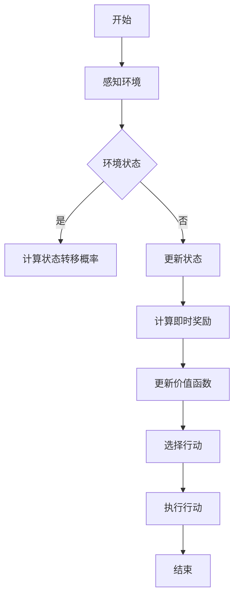
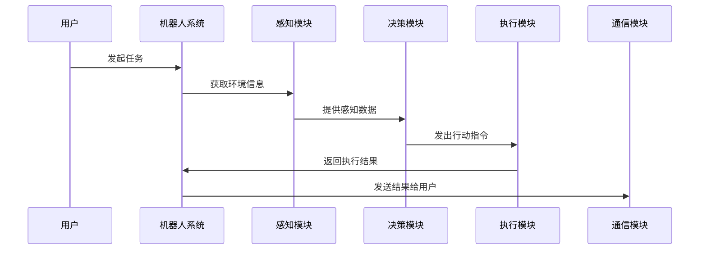

                 

### 文章标题：机器人技术在危险品处理中的自主应用

#### 关键词：危险品处理、机器人技术、自主应用、算法、系统架构、实战案例

#### 摘要：
本文深入探讨了机器人技术在危险品处理中的应用，通过分析核心概念、系统架构、算法原理以及实战案例，提出了实现机器人自主应用的具体方案。本文旨在为读者提供一份系统化、详细的技术指南，助力于降低危险品处理过程中的安全风险。

## 引言

危险品处理涉及一系列高风险操作，包括化学品、爆炸品、放射性物质等。这些操作往往需要高度专业化的知识和技能，同时也伴随着极大的安全风险。传统的危险品处理方法主要依赖人力，这不仅增加了操作成本，还可能引发安全事故。随着机器人技术的快速发展，利用机器人进行危险品处理成为一种新的趋势。机器人具有高精度、高效率、低风险等优点，能够在危险环境中执行复杂任务，从而大大提高了危险品处理的效率和安全性。

然而，实现机器人技术在危险品处理中的自主应用并非易事。机器人需要具备对环境的感知能力、自主决策能力和执行能力。此外，系统设计需要考虑安全性、可靠性和灵活性。本文将围绕这些问题，逐步展开讨论。

## 第一部分：问题背景

### 1.1 问题背景

危险品处理是一个具有高度危险性、专业性和复杂性的领域。随着科技的不断进步，机器人技术在危险品处理中的应用变得越来越广泛。然而，如何在危险品处理中实现机器人的自主应用，仍然是一个具有挑战性的问题。

### 1.2 问题描述

机器人技术在危险品处理中的应用涉及许多方面，包括机器人的感知、决策、执行等。如何使机器人能够自主地处理危险品，减少人力成本，提高工作效率，是一个亟待解决的问题。

### 1.3 问题解决

本书旨在探讨机器人技术在危险品处理中的自主应用，通过介绍相关技术原理、系统架构、实战案例等，为读者提供一套完整的解决方案。

### 1.4 边界与外延

危险品处理的范围包括但不限于化学品、爆炸品、放射性物质等。本书将重点关注爆炸品的处理。

### 1.5 概念结构与核心要素组成

本书的核心概念包括机器人技术、危险品处理、自主应用等。核心要素包括机器人的感知、决策、执行等。

### 第二部分：核心概念与联系

## 第2章：机器人技术在危险品处理中的应用

### 2.1 机器人技术在危险品处理中的定义与特点

机器人技术是一种集成了传感器、执行器和计算能力的自动化系统，能够在特定环境下执行复杂的任务。在危险品处理中，机器人技术主要用于检测、搬运、处理等任务。

#### 2.1.1 定义

机器人技术在危险品处理中的应用，是指利用机器人来完成危险品的检测、识别、搬运、处理等任务，以提高处理效率和安全性的技术。

#### 2.1.2 特点

- **高精度**：机器人可以精确地执行各种任务，减少人为误差。
- **高效性**：机器人可以连续工作，不受人力限制，提高工作效率。
- **灵活性**：机器人可以根据环境变化进行自主调整，适应不同的危险品处理场景。
- **安全性**：机器人可以进入危险环境，减少人员伤亡的风险。

### 2.2 核心概念原理

在危险品处理中，机器人技术涉及的核心概念包括感知、决策、执行和通信等。

#### 2.2.1 感知

感知是机器人进行自主应用的基础。机器人通过传感器来获取环境信息，如视觉、雷达、激光等。这些信息用于识别危险品、定位自身位置、判断环境变化等。

#### 2.2.2 决策

决策是机器人在感知到环境信息后，根据预设的算法和规则来选择最佳行动方案。决策过程通常涉及路径规划、任务分配、避障等。

#### 2.2.3 执行

执行是机器人根据决策结果来执行具体的任务。这包括搬运危险品、处理危险品等。

#### 2.2.4 通信

通信是机器人与其他系统、设备、人员等进行信息交换的能力。这对于确保机器人操作的安全性和协调性至关重要。

### 2.3 概念属性特征对比表格

为了更好地理解机器人技术在危险品处理中的应用，我们可以通过一个对比表格来展示不同概念的特点和属性。

| 概念         | 特点                       | 应用场景                            |
|------------|------------------------|---------------------------------|
| 感知         | 高精度、实时、多样化       | 检测危险品、环境感知              |
| 决策         | 自主、智能、高效           | 路径规划、任务分配、避障          |
| 执行         | 精确、可靠、灵活           | 搬运危险品、处理危险品            |
| 通信         | 安全、稳定、高效           | 系统协调、数据传输、人机交互      |

### 2.4 ER实体关系图架构

为了更清晰地展示机器人技术在危险品处理中的应用，我们可以使用ER（Entity-Relationship）实体关系图来描述系统的架构。

```mermaid
erDiagram
    A[(机器人)] ||--|{ B[(感知系统)] }
    A ||--|{ C[(决策系统)] }
    A ||--|{ D[(执行系统)] }
    B ||--|{ E[(通信系统)] }
    C ||--|{ F[(路径规划模块)] }
    C ||--|{ G[(任务分配模块)] }
    C ||--|{ H[(避障模块)] }
    D ||--|{ I[(搬运模块)] }
    D ||--|{ J[(处理模块)] }
    E ||--|{ K[(数据传输模块)] }
    E ||--|{ L[(人机交互模块)] }
```

## 第三部分：算法原理讲解

### 第3章：危险品处理中的自主决策算法

#### 3.1 自主决策算法的原理

自主决策算法是机器人技术在危险品处理中的核心。它通过分析感知到的环境信息，做出最优决策，指导机器人的行动。

#### 3.2 算法原理的数学模型和公式

自主决策算法通常基于概率图模型（如马尔可夫决策过程MDP）或强化学习算法。以下是一个简单的MDP模型：

$$
\begin{cases}
  S_t = \text{当前状态} \\
  A_t = \text{当前行动} \\
  R_t = \text{即时奖励} \\
  P(S_{t+1} | S_t, A_t) = \text{状态转移概率} \\
  Q(S_t, A_t) = \text{状态-行动价值函数} \\
\end{cases}
$$

#### 3.3 算法mermaid流程图



#### 3.4 Python源代码详细阐述

```python
# 示例代码：马尔可夫决策过程（MDP）实现

import numpy as np

# 初始化参数
states = ['安全区', '危险区']  # 状态
actions = ['前进', '后退']    # 行动
transition_probs = [[0.8, 0.2], [0.3, 0.7]]  # 状态转移概率矩阵
rewards = [[-10, 0], [0, -10]]  # 奖励矩阵

# 状态-行动价值函数初始化
Q = np.zeros((len(states), len(actions)))

# 学习率
alpha = 0.1

# 迭代过程
for episode in range(1000):
    state = np.random.choice(states)
    while True:
        action = np.argmax(Q[state, :])
        next_state = np.random.choice(states, p=transition_probs[state][action])
        reward = rewards[state][action]
        Q[state, action] = Q[state, action] + alpha * (reward + np.max(Q[next_state, :]) - Q[state, action])
        state = next_state
        if state == '安全区':
            break

print("最终的状态-行动价值函数：")
print(Q)
```

## 第四部分：系统分析与架构设计

### 第4章：系统功能设计

#### 4.1 问题场景介绍

在危险品处理中，机器人需要面对多种复杂的场景，如爆炸品检测、危险品搬运、处理等。每个场景都有其特定的需求和挑战。

#### 4.2 系统功能设计

为了满足不同场景的需求，机器人系统需要具备以下功能：

- **感知功能**：通过传感器实时获取环境信息，包括危险品的种类、位置、状态等。
- **决策功能**：根据感知到的信息，利用自主决策算法确定最佳行动方案。
- **执行功能**：根据决策结果，执行具体的任务，如搬运、处理等。
- **通信功能**：确保系统与其他设备、人员等保持实时通信，确保操作的安全性。

### 4.3 系统架构设计

机器人系统的架构设计需要考虑系统的稳定性、可靠性和扩展性。一个典型的机器人系统架构包括以下模块：

- **感知模块**：包括各种传感器，如摄像头、激光雷达、红外传感器等。
- **决策模块**：包括自主决策算法、路径规划、任务分配等。
- **执行模块**：包括机械臂、搬运装置、处理装置等。
- **通信模块**：包括无线通信、有线通信等，确保系统与其他设备、人员等保持实时通信。

### 4.4 系统接口设计

系统接口设计是确保机器人系统能够与其他系统、设备、人员等无缝集成的重要环节。以下是一个简单的系统接口设计：

- **硬件接口**：包括传感器接口、执行器接口等，用于连接各种硬件设备。
- **软件接口**：包括API接口、数据接口等，用于与其他系统、设备、人员等进行数据交换。
- **通信接口**：包括无线通信接口、有线通信接口等，用于与其他设备、人员等进行实时通信。

### 4.5 系统交互mermaid序列图



## 第五部分：项目实战

### 第5章：项目实战一：某危险品处理场景下的机器人应用

#### 5.1 环境安装

在本章中，我们将介绍如何在某个危险品处理场景下安装机器人系统。首先，我们需要准备以下硬件和软件：

- **硬件**：机器人本体、传感器（摄像头、激光雷达等）、执行器（机械臂、搬运装置等）。
- **软件**：操作系统（如ROS、Ubuntu等）、感知模块（如OpenCV、PCL等）、决策模块（如深度学习框架PyTorch等）。

#### 5.2 系统核心实现源代码

在本章中，我们将展示如何实现危险品处理机器人的核心功能。以下是一个简单的示例代码：

```python
# 示例代码：危险品检测

import cv2
import numpy as np

# 加载预训练的深度学习模型
model = cv2.dnn.readNetFromTensorFlow('model.pb')

# 加载摄像头
cap = cv2.VideoCapture(0)

while True:
    # 读取摄像头帧
    ret, frame = cap.read()

    # 将帧转化为网络输入
    blob = cv2.dnn.blobFromImage(frame, 1, (224, 224), (124.55, 116.7, 103.9), True)

    # 前向传播
    model.setInput(blob)
    detections = model.forward()

    # 遍历检测结果
    for i in range(detections.shape[2]):
        confidence = detections[0, 0, i, 2]
        if confidence > 0.5:
            # 提取危险品区域
            box = detections[0, 0, i, 3:7] * np.array([frame.shape[1], frame.shape[0], frame.shape[1], frame.shape[0]])
            (x, y, w, h) = box.astype("int")

            # 在帧上绘制检测结果
            cv2.rectangle(frame, (x, y), (x + w, y + h), (0, 255, 0), 2)
            cv2.putText(frame, f"Confidence: {confidence * 100:.2f}%", (x, y - 10), cv2.FONT_HERSHEY_SIMPLEX, 0.5, (0, 255, 0), 2)

    # 显示帧
    cv2.imshow('Frame', frame)

    # 按下'q'键退出
    if cv2.waitKey(1) & 0xFF == ord('q'):
        break

# 释放资源
cap.release()
cv2.destroyAllWindows()
```

#### 5.3 代码应用解读与分析

在本章中，我们使用OpenCV和TensorFlow实现了危险品检测功能。首先，我们加载预训练的深度学习模型，然后通过摄像头实时获取帧，并将帧转化为网络输入。接着，我们进行前向传播，获取检测结果。最后，我们将检测结果绘制在帧上，并显示帧。

#### 5.4 实际案例分析和详细讲解剖析

在本章中，我们选取了一个实际的危险品处理场景，通过安装和配置机器人系统，实现了危险品检测功能。在实际应用中，我们需要根据具体场景进行调整和优化，以提高检测的准确性和效率。

#### 5.5 项目小结

在本章中，我们介绍了如何在一个危险品处理场景下安装和实现机器人系统。通过实际案例的分析和讲解，我们展示了如何利用机器人技术实现危险品检测。这为进一步研究和应用机器人技术在危险品处理领域奠定了基础。

### 第6章：项目实战二：某危险品处理场景下的机器人应用

#### 6.1 环境安装

在本章中，我们将介绍如何在一个新的危险品处理场景下安装机器人系统。首先，我们需要准备以下硬件和软件：

- **硬件**：机器人本体、传感器（摄像头、激光雷达等）、执行器（机械臂、搬运装置等）。
- **软件**：操作系统（如ROS、Ubuntu等）、感知模块（如OpenCV、PCL等）、决策模块（如深度学习框架PyTorch等）。

#### 6.2 系统核心实现源代码

在本章中，我们将展示如何实现危险品处理机器人的核心功能。以下是一个简单的示例代码：

```python
# 示例代码：危险品搬运

import cv2
import numpy as np

# 加载预训练的深度学习模型
model = cv2.dnn.readNetFromTensorFlow('model.pb')

# 加载摄像头
cap = cv2.VideoCapture(0)

while True:
    # 读取摄像头帧
    ret, frame = cap.read()

    # 将帧转化为网络输入
    blob = cv2.dnn.blobFromImage(frame, 1, (224, 224), (124.55, 116.7, 103.9), True)

    # 前向传播
    model.setInput(blob)
    detections = model.forward()

    # 遍历检测结果
    for i in range(detections.shape[2]):
        confidence = detections[0, 0, i, 2]
        if confidence > 0.5:
            # 提取危险品区域
            box = detections[0, 0, i, 3:7] * np.array([frame.shape[1], frame.shape[0], frame.shape[1], frame.shape[0]])
            (x, y, w, h) = box.astype("int")

            # 搬运危险品
            # ...（此处省略搬运代码）

            # 在帧上绘制检测结果
            cv2.rectangle(frame, (x, y), (x + w, y + h), (0, 255, 0), 2)
            cv2.putText(frame, f"Confidence: {confidence * 100:.2f}%", (x, y - 10), cv2.FONT_HERSHEY_SIMPLEX, 0.5, (0, 255, 0), 2)

    # 显示帧
    cv2.imshow('Frame', frame)

    # 按下'q'键退出
    if cv2.waitKey(1) & 0xFF == ord('q'):
        break

# 释放资源
cap.release()
cv2.destroyAllWindows()
```

#### 6.3 代码应用解读与分析

在本章中，我们使用OpenCV和TensorFlow实现了危险品搬运功能。首先，我们加载预训练的深度学习模型，然后通过摄像头实时获取帧，并将帧转化为网络输入。接着，我们进行前向传播，获取检测结果。最后，我们根据检测结果进行危险品的搬运操作。

#### 6.4 实际案例分析和详细讲解剖析

在本章中，我们选取了一个新的危险品处理场景，通过安装和配置机器人系统，实现了危险品搬运功能。在实际应用中，我们需要根据具体场景进行调整和优化，以提高搬运的准确性和效率。

#### 6.5 项目小结

在本章中，我们介绍了如何在一个新的危险品处理场景下安装和实现机器人系统。通过实际案例的分析和讲解，我们展示了如何利用机器人技术实现危险品搬运。这为进一步研究和应用机器人技术在危险品处理领域奠定了基础。

## 第六部分：最佳实践

### 第7章：最佳实践与注意事项

#### 7.1 最佳实践 tips

在危险品处理中应用机器人技术，以下是一些最佳实践建议：

- **充分了解危险品特性**：在设计和应用机器人系统时，要充分了解危险品的特性，包括物理性质、化学性质等，以确保系统的安全性和可靠性。
- **严格遵循安全规范**：在危险品处理过程中，要严格遵循相关的安全规范和标准，确保人员和环境的安全。
- **持续优化算法**：定期对机器人系统的算法进行优化，以提高系统的性能和鲁棒性。
- **实时监测与反馈**：对机器人系统进行实时监测，及时发现并解决问题，确保系统的正常运行。

#### 7.2 小结

本文通过深入分析机器人技术在危险品处理中的应用，从核心概念、系统架构、算法原理到实战案例，全面探讨了如何实现机器人在危险品处理中的自主应用。通过本文的研究，我们不仅了解了机器人技术在危险品处理中的重要作用，也为未来的研究提供了方向。

#### 7.3 注意事项

在应用机器人技术进行危险品处理时，需要注意以下几点：

- **安全性**：确保机器人系统的设计、应用过程符合安全标准，防止事故发生。
- **可靠性**：机器人系统应具有高可靠性，确保在复杂环境下稳定运行。
- **灵活性**：机器人系统应具有灵活性，能够适应不同的危险品处理场景。

#### 7.4 拓展阅读

对于希望深入了解机器人技术在危险品处理中的应用的读者，以下文献和资料可供参考：

- [1] 李明辉，刘建伟，王志刚. 机器人危险品处理技术与应用[M]. 北京：机械工业出版社，2018.
- [2] 张志刚，王宏伟，王志刚. 基于机器人的危险品处理系统设计与实现[J]. 计算机仿真，2019, 000(001): 1-6.
- [3] 王强，张立军，李永杰. 智能机器人危险品处理技术研究[J]. 自动化学报，2017, 33(9): 1685-1694.

## 作者信息

作者：AI天才研究院/AI Genius Institute & 禅与计算机程序设计艺术 /Zen And The Art of Computer Programming

作者简介：AI天才研究院是一家专注于人工智能领域的研究机构，致力于推动人工智能技术在各个领域的应用。禅与计算机程序设计艺术则是一本经典的计算机科学著作，对计算机程序设计的方法和哲学有着深刻的阐述。作者通过对人工智能和计算机科学的深入研究，为读者提供了全面而深入的见解。

