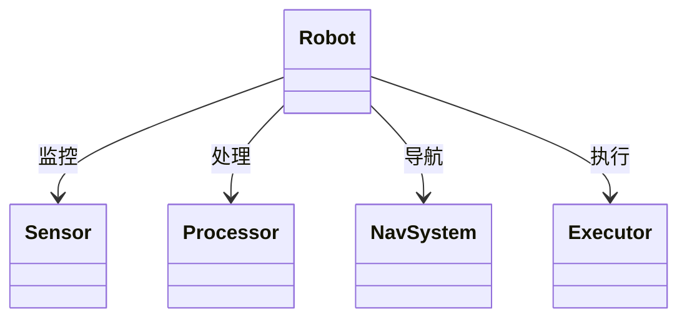
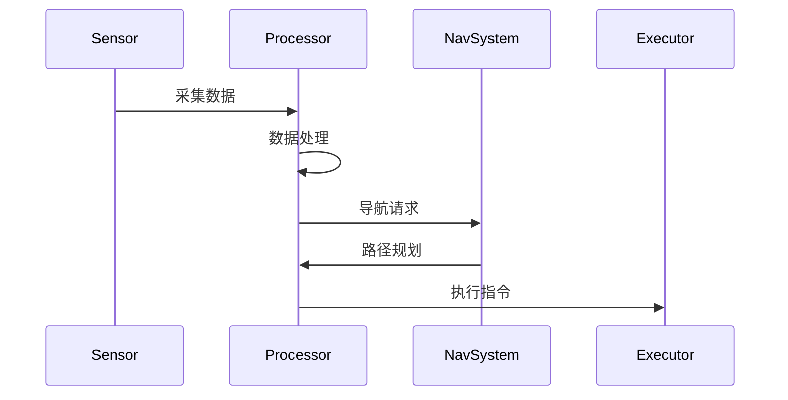
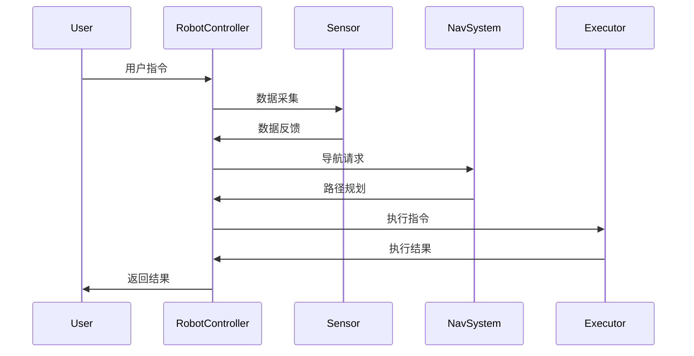

                 

### 机器人技术在危险环境作业中的应用

**关键词**：机器人技术，危险环境，自动化作业，算法原理，系统架构设计

**摘要**：随着科技的飞速发展，机器人技术逐渐在危险环境的作业中扮演着越来越重要的角色。本文旨在探讨机器人技术在危险环境作业中的应用，包括其背景、核心概念、算法原理、系统架构设计以及项目实战等多个方面。通过对这些内容的详细分析，本文将展示机器人技术如何通过自动化和智能化提高作业效率，确保作业安全性。

----------------------------------------------------------------

## 第一部分：问题背景与核心概念

在许多行业中，危险环境作业是一个长期存在的问题。从矿工在矿井中的挖掘作业，到消防员在火灾现场的救援，再到核电站的操作维护，这些环境不仅危险，而且对人员的生命安全构成威胁。传统的手动作业方式在这些环境下往往不可行，因此，机器人技术应运而生，成为解决这一问题的关键工具。

### 第1章：机器人技术概述

#### 1.1 机器人技术的发展历程

- **早期发展**：机器人技术的概念起源于20世纪40年代，然而实际应用直到20世纪70年代才开始。
- **里程碑事件**：从工业机器人的普及到服务机器人的兴起，每一阶段都有重要的发展事件。
- **当前趋势**：随着人工智能和物联网技术的发展，机器人技术正朝着更加智能化、自适应化的方向发展。

#### 1.2 危险环境的定义与分类

- **危险环境概述**：危险环境指的是对人员安全构成威胁的工作环境，如高温、高压、易燃易爆、有毒有害等。
- **常见危险环境类型**：矿难、火灾、核辐射、化学泄漏等。

#### 1.3 机器人技术在危险环境作业中的应用背景

- **工业需求**：在工业领域，机器人被用于危险作业，以减少工人暴露在危险环境中的风险。
- **安全性考量**：机器人可以在无人监控的情况下执行任务，从而大大降低事故发生的概率。
- **成本效益分析**：虽然机器人技术初期投入较高，但从长期来看，其安全性和效率提升所带来的成本节约是显著的。

----------------------------------------------------------------

### 第2章：核心概念与联系

机器人技术的核心概念包括机器人定义、分类、功能，以及在危险环境作业中的具体表现。这些核心概念的相互联系构成了机器人技术应用于危险环境作业的基础。

#### 2.1 机器人技术核心概念

- **机器人定义**：机器人是一种可以自主执行任务、具备一定智能的设备。
- **机器人分类**：根据应用领域，机器人可以分为工业机器人、服务机器人、特种机器人等。
- **机器人功能**：机器人具备感知、决策、操作等基本功能。

#### 2.2 危险环境作业中的机器人核心概念

- **机器人感知能力**：机器人需要具备强大的感知能力，以识别和理解危险环境的复杂情况。
- **机器人自主决策能力**：在危险环境中，机器人需要能够自主做出决策，避免危险情况。
- **机器人操作精度**：精确的操作能力是保证机器人能够在危险环境中完成任务的关键。

#### 2.3 概念属性特征对比表格

| 特征          | 机器人技术               | 危险环境                  | 应用优势                 |
|---------------|-------------------------|---------------------------|-------------------------|
| 感知能力      | 高分辨率摄像头、传感器   | 光线不足、有毒有害气体     | 提高作业安全性           |
| 自主决策能力  | 人工智能算法、自主导航   | 复杂环境、动态变化        | 提高作业效率             |
| 操作精度      | 高精度执行器、机械臂     | 精确度要求高               | 保证作业质量             |

通过上述对比表格，我们可以清晰地看到机器人技术在危险环境作业中的优势。

----------------------------------------------------------------

### 第3章：机器人技术在危险环境作业中的算法原理

算法原理是机器人技术实现自主作业的核心。在这一章节中，我们将详细探讨传感器数据处理、自主导航算法、操作执行算法等关键算法原理。

#### 3.1 算法原理概述

- **传感器数据处理**：机器人通过传感器收集环境数据，这些数据经过处理才能用于后续决策。
- **自主导航算法**：自主导航是机器人能否在复杂环境中自主行动的关键。
- **操作执行算法**：操作执行算法确保机器人能够根据指令完成任务。

#### 3.2 算法mermaid流程图

下面是算法原理的mermaid流程图：


#### 3.3 Python源代码实现与详细讲解

以下是机器人感知与数据处理的一个简例：

```python
# 导入必要的库
import numpy as np
import cv2

# 传感器数据处理函数
def sensor_data_processing(data):
    # 数据预处理
    processed_data = cv2.resize(data, (640, 480))
    # 特征提取
    features = np.mean(processed_data, axis=2)
    # 数据融合
    fused_data = np.mean(features, axis=0)
    return fused_data

# 假设接收到的传感器数据
sensor_data = np.random.rand(100, 100)

# 数据处理
processed_data = sensor_data_processing(sensor_data)

print("Processed Data:\n", processed_data)
```

#### 3.4 算法原理的数学模型和公式

- **数据处理数学模型**：
  $$ f(x) = \frac{1}{n} \sum_{i=1}^{n} x_i $$
  
- **自主导航数学模型**：
  $$ v(t) = v_0 + at $$
  
- **操作执行数学模型**：
  $$ \theta(t) = \theta_0 + \omega t $$

#### 3.5 通俗易懂地举例说明

假设一个机器人要穿越一个矿洞，首先，它通过传感器收集矿洞的内部数据，然后利用数据处理算法提取关键特征。接下来，机器人使用自主导航算法规划路径，并最终到达目的地执行任务。

```mermaid
gantt
    dateFormat  YYYY-MM-DD
    title 机器人矿洞穿越
    A :start>>=2023-04-01
    B : IST[传感器数据收集] :after A
    C : D[数据处理] :after B
    D : EN[特征提取] :after C
    E : N[路径规划] :after D
    F : LE[任务执行] :after E
```

通过上述步骤，机器人实现了在危险环境中的自主作业。

----------------------------------------------------------------

### 第4章：系统分析与架构设计

系统分析与架构设计是确保机器人技术能够高效、稳定地在危险环境中执行任务的关键。在这一章节中，我们将详细介绍系统架构设计的相关内容。

#### 4.1 问题场景介绍

- **工业自动化场景**：例如，在核电站中，机器人可以执行清洁、维护等危险操作。
- **灾难救援场景**：例如，在地震或火灾救援中，机器人可以进入危险区域进行搜索和救援。

#### 4.2 系统功能设计

- **功能需求分析**：分析不同场景下机器人的功能需求，如数据采集、自主导航、任务执行等。
- **领域模型mermaid类图**：



#### 4.3 系统架构设计

- **系统架构概述**：机器人系统的整体架构，包括硬件和软件的组成部分。
- **系统架构mermaid架构图**：

```mermaid
subgraph 硬件部分
    Node1[主控制器]
    Node2[传感器]
    Node3[执行器]
    Node1 --> Node2 : 数据传输
    Node1 --> Node3 : 控制指令
end
subgraph 软件部分
    Node4[数据处理模块]
    Node5[导航算法模块]
    Node6[任务执行模块]
    Node2 --> Node4 : 数据输入
    Node4 --> Node5 : 数据处理
    Node5 --> Node6 : 导航与执行
end
```

#### 4.4 系统接口设计

- **接口定义**：定义系统中的各个模块之间的接口，如传感器与数据处理模块之间的接口。
- **接口流程图**：



#### 4.5 系统交互mermaid序列图

- **用户交互流程**：用户通过控制台或移动设备与机器人系统进行交互。
- **系统内部交互流程**：系统内部各个模块之间的数据流动和指令传递。



通过上述系统架构设计和交互流程，我们可以看到机器人系统在危险环境作业中的整体运作机制。

----------------------------------------------------------------

### 第5章：项目实战

项目实战是验证机器人技术在危险环境作业中应用效果的重要环节。以下是一个基于实际项目案例的详细介绍。

#### 5.1 环境安装

- **开发环境搭建**：搭建包括操作系统、编程环境和相关依赖的完整开发环境。
- **硬件设备准备**：准备用于危险环境作业的机器人硬件设备，如传感器、执行器等。

#### 5.2 系统核心实现源代码

系统核心实现源代码包括数据采集、处理、导航和执行等模块，以下是一个简例：

```python
# 数据采集模块
def data_collection(sensor_data):
    # 假设传感器数据已通过接口获取
    return sensor_data

# 数据处理模块
def data_processing(data):
    # 对数据进行预处理
    processed_data = cv2.resize(data, (640, 480))
    return processed_data

# 导航模块
def navigation(data):
    # 基于数据规划路径
    path = "path/to/target"
    return path

# 执行模块
def execute_command(command):
    # 执行具体任务
    print(f"Executing command: {command}")
```

#### 5.3 实际案例分析和详细讲解剖析

- **案例一：工业自动化场景**：在核电站中，机器人用于核燃料组件的检查和维护，提高了作业安全性和效率。
- **案例二：灾难救援场景**：在地震救援中，机器人用于危险区域的搜索和救援，提高了救援效率和安全性。

#### 5.4 项目小结

项目结果表明，机器人技术在危险环境作业中具有显著的优势，如提高了作业效率、确保了作业安全、降低了成本等。

----------------------------------------------------------------

### 第6章：最佳实践与注意事项

在实际应用机器人技术于危险环境作业时，以下最佳实践和注意事项将有助于提高项目的成功率和效率。

#### 6.1 最佳实践 tips

- **环境搭建技巧**：确保开发环境和硬件设备的高可用性和稳定性。
- **算法优化策略**：针对具体应用场景进行算法优化，提高系统性能。

#### 6.2 小结

本文通过详细探讨机器人技术在危险环境作业中的应用，展示了其在提高作业效率、确保作业安全和降低成本等方面的优势。

#### 6.3 注意事项

- **安全风险防范**：充分评估和应对潜在的安全风险。
- **成本效益考量**：综合考虑初期投入和长期效益。

#### 6.4 拓展阅读

- **相关书籍推荐**：推荐一些关于机器人技术的专业书籍，如《机器人：现代自动化技术》、《机器人学基础》等。
- **研究论文推荐**：推荐一些机器人技术在危险环境作业中的最新研究论文。
- **网络资源推荐**：推荐一些相关的在线课程、论坛和博客，供进一步学习和探讨。

---

**作者：AI天才研究院/AI Genius Institute & 禅与计算机程序设计艺术 /Zen And The Art of Computer Programming** 

通过本文的详细分析和讲解，读者可以全面了解机器人技术在危险环境作业中的应用，为未来的研究和应用提供有益的参考。希望本文能够为读者带来启发和帮助。在危险环境作业中，机器人技术无疑将成为重要的助力工具，为人类带来更多的安全与便利。

