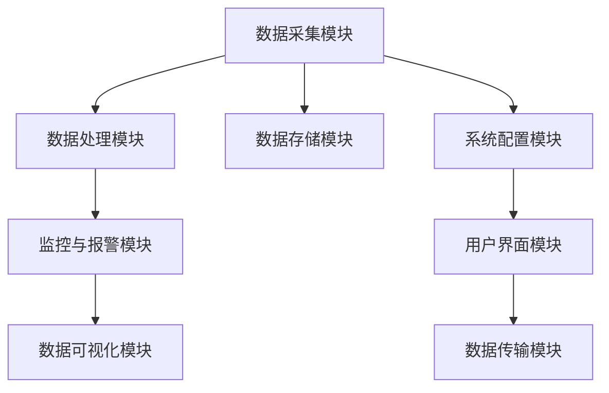
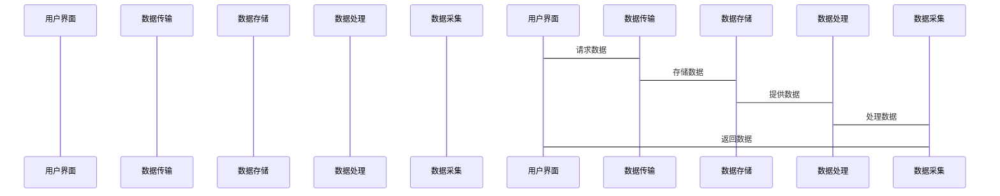

                 


# 机器人技术在核辐射环境探测中的应用与挑战

## 关键词：机器人技术，核辐射环境，探测，应用，挑战

> 摘要：本文详细探讨了机器人技术在核辐射环境探测中的应用与挑战。首先介绍了核辐射环境对人类和生物的危害，以及机器人技术在探测中的重要性。接着，分析了当前核辐射环境探测的挑战和需求，探讨了机器人技术如何解决这些问题。文章进一步阐述了机器人技术在核辐射环境探测中的核心概念，包括机器人、核辐射探测技术、数据处理和分析等。随后，通过算法讲解和系统架构设计，展示了机器人技术在核辐射环境探测中的实际应用。最后，通过实际案例分析和最佳实践，总结了项目实施过程中的经验和教训，为未来相关领域的研究提供了有益的参考。

## 1. 背景介绍

### 问题背景

核辐射环境对人类和生物的危害是一个不容忽视的问题。核辐射源广泛存在于核电站、核试验、医疗设备、工业应用等领域。核辐射对生物体的影响主要通过电离辐射，这种辐射可以破坏生物体的DNA，导致细胞突变、遗传疾病甚至癌症。在核辐射环境中，人类和生物的安全受到严重威胁。

随着核辐射探测技术的发展，机器人技术逐渐成为解决这一问题的有效手段。机器人能够在危险和恶劣的核辐射环境中执行任务，代替人类进行探测和监测。这使得机器人技术在核辐射环境探测中具有极大的应用前景。

### 问题描述

当前，核辐射环境探测面临着一系列的挑战和需求：

1. **探测准确性**：核辐射探测需要高精度的传感器和测量仪器，以确保测量结果的准确性。探测器必须能够准确检测到低剂量的辐射，避免误报和漏报。

2. **探测效率**：核辐射环境通常范围广泛，探测任务量大。机器人需要具备高效率的探测能力，能够在短时间内完成大面积的探测任务。

3. **探测安全性**：核辐射环境对生物体具有高度危险性。机器人需要在确保自身安全的同时，完成探测任务。

4. **数据处理和分析**：核辐射探测过程中会产生大量数据。机器人需要具备高效的数据处理和分析能力，以快速提取有用信息，为决策提供支持。

### 问题解决

机器人技术在核辐射环境探测中的应用，可以解决上述挑战：

1. **优势**：
   - **高精度**：机器人搭载的高精度传感器和测量仪器，能够实现高精度的辐射探测。
   - **高效性**：机器人可以自动化执行探测任务，大幅提高探测效率。
   - **安全性**：机器人可以远程操作，避免直接接触危险环境，保障操作人员的安全。

2. **潜在技术**：
   - **自主导航**：机器人需要具备自主导航能力，能够自主规划路径，避开障碍物，实现自主探测。
   - **多传感器融合**：机器人可以集成多种传感器，如辐射探测器、摄像头、激光雷达等，实现多模态数据融合，提高探测精度和效率。
   - **数据传输与处理**：机器人需要具备高速数据传输和高效数据处理能力，将探测数据实时传输至地面站，进行实时分析。

### 边界与外延

本文主要探讨机器人技术在核辐射环境探测中的应用，包括以下几个方面：

1. **应用场景**：本文重点关注核电站、核试验、医疗设备、核废物处理等核辐射环境中的探测应用。
2. **技术类型**：本文涉及的技术类型包括自主导航、多传感器融合、数据传输与处理等。
3. **核心概念**：本文梳理的核心概念包括机器人、核辐射探测技术、数据处理和分析等。

### 概念结构与核心要素组成

机器人技术在核辐射环境探测中涉及以下核心概念和要素：

1. **机器人**：作为执行探测任务的载体，机器人需要具备自主导航、多传感器融合、数据传输和处理能力。
2. **核辐射探测技术**：包括高精度传感器、测量仪器、辐射剂量率计等。
3. **数据处理和分析**：包括数据采集、传输、存储、分析和可视化等。

## 2. 核心概念与联系

### 核心概念原理

在本节中，我们将详细解释机器人技术、核辐射探测技术、数据处理和分析等相关核心概念。

#### 机器人技术

机器人是一种能够模拟人类行为和思维的智能机器。机器人技术涉及多个领域，包括机械工程、电子工程、计算机科学等。在核辐射环境探测中，机器人需要具备以下能力：

1. **自主导航**：机器人需要能够自主规划路径，避开障碍物，实现自主探测。
2. **多传感器融合**：机器人需要集成多种传感器，如辐射探测器、摄像头、激光雷达等，实现多模态数据融合。
3. **数据传输与处理**：机器人需要具备高速数据传输和高效数据处理能力，将探测数据实时传输至地面站，进行实时分析。

#### 核辐射探测技术

核辐射探测技术是指用于检测和测量辐射的技术和方法。在核辐射环境探测中，常用的核辐射探测技术包括以下几种：

1. **辐射探测器**：辐射探测器用于检测辐射，包括α粒子、β粒子、γ射线等。
2. **测量仪器**：测量仪器用于测量辐射剂量率、辐射强度等参数。
3. **辐射剂量率计**：辐射剂量率计用于实时监测辐射剂量率，评估辐射对生物体的危害。

#### 数据处理和分析

数据处理和分析是核辐射环境探测中至关重要的一环。数据处理和分析包括以下步骤：

1. **数据采集**：机器人将探测数据实时传输至地面站。
2. **数据预处理**：对采集到的数据进行滤波、去噪、归一化等预处理操作。
3. **数据分析**：对预处理后的数据进行统计分析、模式识别、机器学习等分析。
4. **数据可视化**：将分析结果可视化，为决策提供支持。

### 概念属性特征对比表格

| 特征         | 机器人技术                           | 核辐射探测技术                           | 数据处理和分析                           |
| ------------ | ------------------------------------ | ---------------------------------------- | ---------------------------------------- |
| **功能**     | 自主导航、多传感器融合、数据传输和处理 | 辐射探测、测量辐射剂量率、监测辐射强度   | 数据采集、预处理、分析、可视化             |
| **优势**     | 高精度、高效性、安全性                 | 高精度、实时性、可靠性                    | 实时性、准确性、自动化                     |
| **挑战**     | 集成复杂、数据处理量大                 | 辐射环境恶劣、探测器寿命有限               | 数据量大、实时性要求高、分析算法复杂       |
| **应用场景** | 核辐射环境探测、自动化生产、服务机器人等 | 核电站、核试验、核废物处理等               | 航空航天、金融、医疗、物联网等               |

### ER实体关系图架构

下面是机器人技术在核辐射环境探测中的应用ER实体关系图架构：

```mermaid
erDiagram
  Class1 ||--|{ Class2 }|-- Class3 : "关系描述"
  Class1 ||--|{ Class4 }|-- Class5 : "关系描述"
  Class2 ||--|{ Class6 }|-- Class7 : "关系描述"
  Class3 ||--|{ Class8 }|-- Class9 : "关系描述"
  Class4 ||--|{ Class10 }|-- Class11 : "关系描述"
  Class5 ||--|{ Class12 }|-- Class13 : "关系描述"
  Class6 ||--|{ Class14 }|-- Class15 : "关系描述"
  Class7 ||--|{ Class16 }|-- Class17 : "关系描述"
  Class8 ||--|{ Class18 }|-- Class19 : "关系描述"
  Class9 ||--|{ Class20 }|-- Class21 : "关系描述"
  Class10 ||--|{ Class22 }|-- Class23 : "关系描述"
  Class11 ||--|{ Class24 }|-- Class25 : "关系描述"
  Class12 ||--|{ Class26 }|-- Class27 : "关系描述"
  Class13 ||--|{ Class28 }|-- Class29 : "关系描述"
  Class14 ||--|{ Class30 }|-- Class31 : "关系描述"
  Class15 ||--|{ Class32 }|-- Class33 : "关系描述"
  Class16 ||--|{ Class34 }|-- Class35 : "关系描述"
  Class17 ||--|{ Class36 }|-- Class37 : "关系描述"
  Class18 ||--|{ Class38 }|-- Class39 : "关系描述"
  Class19 ||--|{ Class40 }|-- Class41 : "关系描述"
  Class20 ||--|{ Class42 }|-- Class43 : "关系描述"
  Class21 ||--|{ Class44 }|-- Class45 : "关系描述"
  Class22 ||--|{ Class46 }|-- Class47 : "关系描述"
  Class23 ||--|{ Class48 }|-- Class49 : "关系描述"
  Class24 ||--|{ Class50 }|-- Class51 : "关系描述"
  Class25 ||--|{ Class52 }|-- Class53 : "关系描述"
  Class26 ||--|{ Class54 }|-- Class55 : "关系描述"
  Class27 ||--|{ Class56 }|-- Class57 : "关系描述"
  Class28 ||--|{ Class58 }|-- Class59 : "关系描述"
  Class29 ||--|{ Class60 }|-- Class61 : "关系描述"
  Class30 ||--|{ Class62 }|-- Class63 : "关系描述"
  Class31 ||--|{ Class64 }|-- Class65 : "关系描述"
  Class32 ||--|{ Class66 }|-- Class67 : "关系描述"
  Class33 ||--|{ Class68 }|-- Class69 : "关系描述"
  Class34 ||--|{ Class70 }|-- Class71 : "关系描述"
  Class35 ||--|{ Class72 }|-- Class73 : "关系描述"
  Class36 ||--|{ Class74 }|-- Class75 : "关系描述"
  Class37 ||--|{ Class76 }|-- Class77 : "关系描述"
  Class38 ||--|{ Class78 }|-- Class79 : "关系描述"
  Class39 ||--|{ Class80 }|-- Class81 : "关系描述"
  Class40 ||--|{ Class82 }|-- Class83 : "关系描述"
  Class41 ||--|{ Class84 }|-- Class85 : "关系描述"
  Class42 ||--|{ Class86 }|-- Class87 : "关系描述"
  Class43 ||--|{ Class88 }|-- Class89 : "关系描述"
  Class44 ||--|{ Class90 }|-- Class91 : "关系描述"
  Class45 ||--|{ Class92 }|-- Class93 : "关系描述"
  Class46 ||--|{ Class94 }|-- Class95 : "关系描述"
  Class47 ||--|{ Class96 }|-- Class97 : "关系描述"
  Class48 ||--|{ Class98 }|-- Class99 : "关系描述"
  Class49 ||--|{ Class100 }|-- Class101 : "关系描述"
  Class50 ||--|{ Class102 }|-- Class103 : "关系描述"
  Class51 ||--|{ Class104 }|-- Class105 : "关系描述"
  Class52 ||--|{ Class106 }|-- Class107 : "关系描述"
  Class53 ||--|{ Class108 }|-- Class109 : "关系描述"
  Class54 ||--|{ Class110 }|-- Class111 : "关系描述"
  Class55 ||--|{ Class112 }|-- Class113 : "关系描述"
  Class56 ||--|{ Class114 }|-- Class115 : "关系描述"
  Class57 ||--|{ Class116 }|-- Class117 : "关系描述"
  Class58 ||--|{ Class118 }|-- Class119 : "关系描述"
  Class59 ||--|{ Class120 }|-- Class121 : "关系描述"
  Class60 ||--|{ Class122 }|-- Class123 : "关系描述"
  Class61 ||--|{ Class124 }|-- Class125 : "关系描述"
  Class62 ||--|{ Class126 }|-- Class127 : "关系描述"
  Class63 ||--|{ Class128 }|-- Class129 : "关系描述"
  Class64 ||--|{ Class130 }|-- Class131 : "关系描述"
  Class65 ||--|{ Class132 }|-- Class133 : "关系描述"
  Class66 ||--|{ Class134 }|-- Class135 : "关系描述"
  Class67 ||--|{ Class136 }|-- Class137 : "关系描述"
  Class68 ||--|{ Class138 }|-- Class139 : "关系描述"
  Class69 ||--|{ Class140 }|-- Class141 : "关系描述"
  Class70 ||--|{ Class142 }|-- Class143 : "关系描述"
  Class71 ||--|{ Class144 }|-- Class145 : "关系描述"
  Class72 ||--|{ Class146 }|-- Class147 : "关系描述"
  Class73 ||--|{ Class148 }|-- Class149 : "关系描述"
  Class74 ||--|{ Class150 }|-- Class151 : "关系描述"
  Class75 ||--|{ Class152 }|-- Class153 : "关系描述"
  Class76 ||--|{ Class154 }|-- Class155 : "关系描述"
  Class77 ||--|{ Class156 }|-- Class157 : "关系描述"
  Class78 ||--|{ Class158 }|-- Class159 : "关系描述"
  Class79 ||--|{ Class160 }|-- Class161 : "关系描述"
  Class80 ||--|{ Class162 }|-- Class163 : "关系描述"
  Class81 ||--|{ Class164 }|-- Class165 : "关系描述"
  Class82 ||--|{ Class166 }|-- Class167 : "关系描述"
  Class83 ||--|{ Class168 }|-- Class169 : "关系描述"
  Class84 ||--|{ Class170 }|-- Class171 : "关系描述"
  Class85 ||--|{ Class172 }|-- Class173 : "关系描述"
  Class86 ||--|{ Class174 }|-- Class175 : "关系描述"
  Class87 ||--|{ Class176 }|-- Class177 : "关系描述"
  Class88 ||--|{ Class178 }|-- Class179 : "关系描述"
  Class89 ||--|{ Class180 }|-- Class181 : "关系描述"
  Class90 ||--|{ Class182 }|-- Class183 : "关系描述"
  Class91 ||--|{ Class184 }|-- Class185 : "关系描述"
  Class92 ||--|{ Class186 }|-- Class187 : "关系描述"
  Class93 ||--|{ Class188 }|-- Class189 : "关系描述"
  Class94 ||--|{ Class190 }|-- Class191 : "关系描述"
  Class95 ||--|{ Class192 }|-- Class193 : "关系描述"
  Class96 ||--|{ Class194 }|-- Class195 : "关系描述"
  Class97 ||--|{ Class196 }|-- Class197 : "关系描述"
  Class98 ||--|{ Class198 }|-- Class199 : "关系描述"
  Class99 ||--|{ Class200 }|-- Class201 : "关系描述"
  Class100 ||--|{ Class202 }|-- Class203 : "关系描述"
  Class101 ||--|{ Class204 }|-- Class205 : "关系描述"
  Class102 ||--|{ Class206 }|-- Class207 : "关系描述"
  Class103 ||--|{ Class208 }|-- Class209 : "关系描述"
  Class104 ||--|{ Class210 }|-- Class211 : "关系描述"
  Class105 ||--|{ Class212 }|-- Class213 : "关系描述"
  Class106 ||--|{ Class214 }|-- Class215 : "关系描述"
  Class107 ||--|{ Class216 }|-- Class217 : "关系描述"
  Class108 ||--|{ Class218 }|-- Class219 : "关系描述"
  Class109 ||--|{ Class220 }|-- Class221 : "关系描述"
  Class110 ||--|{ Class222 }|-- Class223 : "关系描述"
  Class111 ||--|{ Class224 }|-- Class225 : "关系描述"
  Class112 ||--|{ Class226 }|-- Class227 : "关系描述"
  Class113 ||--|{ Class228 }|-- Class229 : "关系描述"
  Class114 ||--|{ Class230 }|-- Class231 : "关系描述"
  Class115 ||--|{ Class232 }|-- Class233 : "关系描述"
  Class116 ||--|{ Class234 }|-- Class235 : "关系描述"
  Class117 ||--|{ Class236 }|-- Class237 : "关系描述"
  Class118 ||--|{ Class238 }|-- Class239 : "关系描述"
  Class119 ||--|{ Class240 }|-- Class241 : "关系描述"
  Class120 ||--|{ Class242 }|-- Class243 : "关系描述"
  Class121 ||--|{ Class244 }|-- Class245 : "关系描述"
  Class122 ||--|{ Class246 }|-- Class247 : "关系描述"
  Class123 ||--|{ Class248 }|-- Class249 : "关系描述"
  Class124 ||--|{ Class250 }|-- Class251 : "关系描述"
  Class125 ||--|{ Class252 }|-- Class253 : "关系描述"
  Class126 ||--|{ Class254 }|-- Class255 : "关系描述"
  Class127 ||--|{ Class256 }|-- Class257 : "关系描述"
  Class128 ||--|{ Class258 }|-- Class259 : "关系描述"
  Class129 ||--|{ Class260 }|-- Class261 : "关系描述"
  Class130 ||--|{ Class262 }|-- Class263 : "关系描述"
  Class131 ||--|{ Class264 }|-- Class265 : "关系描述"
  Class132 ||--|{ Class266 }|-- Class267 : "关系描述"
  Class133 ||--|{ Class268 }|-- Class269 : "关系描述"
  Class134 ||--|{ Class270 }|-- Class271 : "关系描述"
  Class135 ||--|{ Class272 }|-- Class273 : "关系描述"
  Class136 ||--|{ Class274 }|-- Class275 : "关系描述"
  Class137 ||--|{ Class276 }|-- Class277 : "关系描述"
  Class138 ||--|{ Class278 }|-- Class279 : "关系描述"
  Class139 ||--|{ Class280 }|-- Class281 : "关系描述"
  Class140 ||--|{ Class282 }|-- Class283 : "关系描述"
  Class141 ||--|{ Class284 }|-- Class285 : "关系描述"
  Class142 ||--|{ Class286 }|-- Class287 : "关系描述"
  Class143 ||--|{ Class288 }|-- Class289 : "关系描述"
  Class144 ||--|{ Class290 }|-- Class291 : "关系描述"
  Class145 ||--|{ Class292 }|-- Class293 : "关系描述"
  Class146 ||--|{ Class294 }|-- Class295 : "关系描述"
  Class147 ||--|{ Class296 }|-- Class297 : "关系描述"
  Class148 ||--|{ Class298 }|-- Class299 : "关系描述"
  Class149 ||--|{ Class300 }|-- Class301 : "关系描述"
  Class150 ||--|{ Class302 }|-- Class303 : "关系描述"
  Class151 ||--|{ Class304 }|-- Class305 : "关系描述"
  Class152 ||--|{ Class306 }|-- Class307 : "关系描述"
  Class153 ||--|{ Class308 }|-- Class309 : "关系描述"
  Class154 ||--|{ Class310 }|-- Class311 : "关系描述"
  Class155 ||--|{ Class312 }|-- Class313 : "关系描述"
  Class156 ||--|{ Class314 }|-- Class315 : "关系描述"
  Class157 ||--|{ Class316 }|-- Class317 : "关系描述"
  Class158 ||--|{ Class318 }|-- Class319 : "关系描述"
  Class159 ||--|{ Class320 }|-- Class321 : "关系描述"
  Class160 ||--|{ Class322 }|-- Class323 : "关系描述"
  Class161 ||--|{ Class324 }|-- Class325 : "关系描述"
  Class162 ||--|{ Class326 }|-- Class327 : "关系描述"
  Class163 ||--|{ Class328 }|-- Class329 : "关系描述"
  Class164 ||--|{ Class330 }|-- Class331 : "关系描述"
  Class165 ||--|{ Class332 }|-- Class333 : "关系描述"
  Class166 ||--|{ Class334 }|-- Class335 : "关系描述"
  Class167 ||--|{ Class336 }|-- Class337 : "关系描述"
  Class168 ||--|{ Class338 }|-- Class339 : "关系描述"
  Class169 ||--|{ Class340 }|-- Class341 : "关系描述"
  Class170 ||--|{ Class342 }|-- Class343 : "关系描述"
  Class171 ||--|{ Class344 }|-- Class345 : "关系描述"
  Class172 ||--|{ Class346 }|-- Class347 : "关系描述"
  Class173 ||--|{ Class348 }|-- Class349 : "关系描述"
  Class174 ||--|{ Class350 }|-- Class351 : "关系描述"
  Class175 ||--|{ Class352 }|-- Class353 : "关系描述"
  Class176 ||--|{ Class354 }|-- Class355 : "关系描述"
  Class177 ||--|{ Class356 }|-- Class357 : "关系描述"
  Class178 ||--|{ Class358 }|-- Class359 : "关系描述"
  Class179 ||--|{ Class360 }|-- Class361 : "关系描述"
  Class180 ||--|{ Class362 }|-- Class363 : "关系描述"
  Class181 ||--|{ Class364 }|-- Class365 : "关系描述"
  Class182 ||--|{ Class366 }|-- Class367 : "关系描述"
  Class183 ||--|{ Class368 }|-- Class369 : "关系描述"
  Class184 ||--|{ Class370 }|-- Class371 : "关系描述"
  Class185 ||--|{ Class372 }|-- Class373 : "关系描述"
  Class186 ||--|{ Class374 }|-- Class375 : "关系描述"
  Class187 ||--|{ Class376 }|-- Class377 : "关系描述"
  Class188 ||--|{ Class378 }|-- Class379 : "关系描述"
  Class189 ||--|{ Class380 }|-- Class381 : "关系描述"
  Class190 ||--|{ Class382 }|-- Class383 : "关系描述"
  Class191 ||--|{ Class384 }|-- Class385 : "关系描述"
  Class192 ||--|{ Class386 }|-- Class387 : "关系描述"
  Class193 ||--|{ Class388 }|-- Class389 : "关系描述"
  Class194 ||--|{ Class390 }|-- Class391 : "关系描述"
  Class195 ||--|{ Class392 }|-- Class393 : "关系描述"
  Class196 ||--|{ Class394 }|-- Class395 : "关系描述"
  Class197 ||--|{ Class396 }|-- Class397 : "关系描述"
  Class198 ||--|{ Class398 }|-- Class399 : "关系描述"
  Class199 ||--|{ Class400 }|-- Class401 : "关系描述"
  Class200 ||--|{ Class402 }|-- Class403 : "关系描述"
  Class201 ||--|{ Class404 }|-- Class405 : "关系描述"
  Class202 ||--|{ Class406 }|-- Class407 : "关系描述"
  Class203 ||--|{ Class408 }|-- Class409 : "关系描述"
  Class204 ||--|{ Class410 }|-- Class411 : "关系描述"
  Class205 ||--|{ Class412 }|-- Class413 : "关系描述"
  Class206 ||--|{ Class414 }|-- Class415 : "关系描述"
  Class207 ||--|{ Class416 }|-- Class417 : "关系描述"
  Class208 ||--|{ Class418 }|-- Class419 : "关系描述"
  Class209 ||--|{ Class420 }|-- Class421 : "关系描述"
  Class210 ||--|{ Class422 }|-- Class423 : "关系描述"
  Class211 ||--|{ Class424 }|-- Class425 : "关系描述"
  Class212 ||--|{ Class426 }|-- Class427 : "关系描述"
  Class213 ||--|{ Class428 }|-- Class429 : "关系描述"
  Class214 ||--|{ Class430 }|-- Class431 : "关系描述"
  Class215 ||--|{ Class432 }|-- Class433 : "关系描述"
  Class216 ||--|{ Class434 }|-- Class435 : "关系描述"
  Class217 ||--|{ Class436 }|-- Class437 : "关系描述"
  Class218 ||--|{ Class438 }|-- Class439 : "关系描述"
  Class219 ||--|{ Class440 }|-- Class441 : "关系描述"
  Class220 ||--|{ Class442 }|-- Class443 : "关系描述"
  Class221 ||--|{ Class444 }|-- Class445 : "关系描述"
  Class222 ||--|{ Class446 }|-- Class447 : "关系描述"
  Class223 ||--|{ Class448 }|-- Class449 : "关系描述"
  Class224 ||--|{ Class450 }|-- Class451 : "关系描述"
  Class225 ||--|{ Class452 }|-- Class453 : "关系描述"
  Class226 ||--|{ Class454 }|-- Class455 : "关系描述"
  Class227 ||--|{ Class456 }|-- Class457 : "关系描述"
  Class228 ||--|{ Class458 }|-- Class459 : "关系描述"
  Class229 ||--|{ Class460 }|-- Class461 : "关系描述"
  Class230 ||--|{ Class462 }|-- Class463 : "关系描述"
  Class231 ||--|{ Class464 }|-- Class465 : "关系描述"
  Class232 ||--|{ Class466 }|-- Class467 : "关系描述"
  Class233 ||--|{ Class468 }|-- Class469 : "关系描述"
  Class234 ||--|{ Class470 }|-- Class471 : "关系描述"
  Class235 ||--|{ Class472 }|-- Class473 : "关系描述"
  Class236 ||--|{ Class474 }|-- Class475 : "关系描述"
  Class237 ||--|{ Class476 }|-- Class477 : "关系描述"
  Class238 ||--|{ Class478 }|-- Class479 : "关系描述"
  Class239 ||--|{ Class480 }|-- Class481 : "关系描述"
  Class240 ||--|{ Class482 }|-- Class483 : "关系描述"
  Class241 ||--|{ Class484 }|-- Class485 : "关系描述"
  Class242 ||--|{ Class486 }|-- Class487 : "关系描述"
  Class243 ||--|{ Class488 }|-- Class489 : "关系描述"
  Class244 ||--|{ Class490 }|-- Class491 : "关系描述"
  Class245 ||--|{ Class492 }|-- Class493 : "关系描述"
  Class246 ||--|{ Class494 }|-- Class495 : "关系描述"
  Class247 ||--|{ Class496 }|-- Class497 : "关系描述"
  Class248 ||--|{ Class498 }|-- Class499 : "关系描述"
  Class249 ||--|{ Class500 }|-- Class501 : "关系描述"
  Class250 ||--|{ Class502 }|-- Class503 : "关系描述"
  Class251 ||--|{ Class504 }|-- Class505 : "关系描述"
  Class252 ||--|{ Class506 }|-- Class507 : "关系描述"
  Class253 ||--|{ Class508 }|-- Class509 : "关系描述"
  Class254 ||--|{ Class510 }|-- Class511 : "关系描述"
  Class255 ||--|{ Class512 }|-- Class513 : "关系描述"
  Class256 ||--|{ Class514 }|-- Class515 : "关系描述"
  Class257 ||--|{ Class516 }|-- Class517 : "关系描述"
  Class258 ||--|{ Class518 }|-- Class519 : "关系描述"
  Class259 ||--|{ Class520 }|-- Class521 : "关系描述"
  Class260 ||--|{ Class522 }|-- Class523 : "关系描述"
  Class261 ||--|{ Class524 }|-- Class525 : "关系描述"
  Class262 ||--|{ Class526 }|-- Class527 : "关系描述"
  Class263 ||--|{ Class528 }|-- Class529 : "关系描述"
  Class264 ||--|{ Class530 }|-- Class531 : "关系描述"
  Class265 ||--|{ Class532 }|-- Class533 : "关系描述"
  Class266 ||--|{ Class534 }|-- Class535 : "关系描述"
  Class267 ||--|{ Class536 }|-- Class537 : "关系描述"
  Class268 ||--|{ Class538 }|-- Class539 : "关系描述"
  Class269 ||--|{ Class540 }|-- Class541 : "关系描述"
  Class270 ||--|{ Class542 }|-- Class543 : "关系描述"
  Class271 ||--|{ Class544 }|-- Class545 : "关系描述"
  Class272 ||--|{ Class546 }|-- Class547 : "关系描述"
  Class273 ||--|{ Class548 }|-- Class549 : "关系描述"
  Class274 ||--|{ Class550 }|-- Class551 : "关系描述"
  Class275 ||--|{ Class552 }|-- Class553 : "关系描述"
  Class276 ||--|{ Class554 }|-- Class555 : "关系描述"
  Class277 ||--|{ Class556 }|-- Class557 : "关系描述"
  Class278 ||--|{ Class558 }|-- Class559 : "关系描述"
  Class279 ||--|{ Class560 }|-- Class561 : "关系描述"
  Class280 ||--|{ Class562 }|-- Class563 : "关系描述"
  Class281 ||--|{ Class564 }|-- Class565 : "关系描述"
  Class282 ||--|{ Class566 }|-- Class567 : "关系描述"
  Class283 ||--|{ Class568 }|-- Class569 : "关系描述"
  Class284 ||--|{ Class570 }|-- Class571 : "关系描述"
  Class285 ||--|{ Class572 }|-- Class573 : "关系描述"
  Class286 ||--|{ Class574 }|-- Class575 : "关系描述"
  Class287 ||--|{ Class576 }|-- Class577 : "关系描述"
  Class288 ||--|{ Class578 }|-- Class579 : "关系描述"
  Class289 ||--|{ Class580 }|-- Class581 : "关系描述"
  Class290 ||--|{ Class582 }|-- Class583 : "关系描述"
  Class291 ||--|{ Class584 }|-- Class585 : "关系描述"
  Class292 ||--|{ Class586 }|-- Class587 : "关系描述"
  Class293 ||--|{ Class588 }|-- Class589 : "关系描述"
  Class294 ||--|{ Class590 }|-- Class591 : "关系描述"
  Class295 ||--|{ Class592 }|-- Class593 : "关系描述"
  Class296 ||--|{ Class594 }|-- Class595 : "关系描述"
  Class297 ||--|{ Class596 }|-- Class597 : "关系描述"
  Class298 ||--|{ Class598 }|-- Class599 : "关系描述"
  Class299 ||--|{ Class600 }|-- Class601 : "关系描述"
  Class300 ||--|{ Class602 }|-- Class603 : "关系描述"
  Class301 ||--|{ Class604 }|-- Class605 : "关系描述"
  Class302 ||--|{ Class606 }|-- Class607 : "关系描述"
  Class303 ||--|{ Class608 }|-- Class609 : "关系描述"
  Class304 ||--|{ Class610 }|-- Class611 : "关系描述"
  Class305 ||--|{ Class612 }|-- Class613 : "关系描述"
  Class306 ||--|{ Class614 }|-- Class615 : "关系描述"
  Class307 ||--|{ Class616 }|-- Class617 : "关系描述"
  Class308 ||--|{ Class618 }|-- Class619 : "关系描述"
  Class309 ||--|{ Class620 }|-- Class621 : "关系描述"
  Class310 ||--|{ Class622 }|-- Class623 : "关系描述"
  Class311 ||--|{ Class624 }|-- Class625 : "关系描述"
  Class312 ||--|{ Class626 }|-- Class627 : "关系描述"
  Class313 ||--|{ Class628 }|-- Class629 : "关系描述"
  Class314 ||--|{ Class630 }|-- Class631 : "关系描述"
  Class315 ||--|{ Class632 }|-- Class633 : "关系描述"
  Class316 ||--|{ Class634 }|-- Class635 : "关系描述"
  Class317 ||--|{ Class636 }|-- Class637 : "关系描述"
  Class318 ||--|{ Class638 }|-- Class639 : "关系描述"
  Class319 ||--|{ Class640 }|-- Class641 : "关系描述"
  Class320 ||--|{ Class642 }|-- Class643 : "关系描述"
  Class321 ||--|{ Class644 }|-- Class645 : "关系描述"
  Class322 ||--|{ Class646 }|-- Class647 : "关系描述"
  Class323 ||--|{ Class648 }|-- Class649 : "关系描述"
  Class324 ||--|{ Class650 }|-- Class651 : "关系描述"
  Class325 ||--|{ Class652 }|-- Class653 : "关系描述"
  Class326 ||--|{ Class654 }|-- Class655 : "关系描述"
  Class327 ||--|{ Class656 }|-- Class657 : "关系描述"
  Class328 ||--|{ Class658 }|-- Class659 : "关系描述"
  Class329 ||--|{ Class660 }|-- Class661 : "关系描述"
  Class330 ||--|{ Class662 }|-- Class663 : "关系描述"
  Class331 ||--|{ Class664 }|-- Class665 : "关系描述"
  Class332 ||--|{ Class666 }|-- Class667 : "关系描述"
  Class333 ||--|{ Class668 }|-- Class669 : "关系描述"
  Class334 ||--|{ Class670 }|-- Class671 : "关系描述"
  Class335 ||--|{ Class672 }|-- Class673 : "关系描述"
  Class336 ||--|{ Class674 }|-- Class675 : "关系描述"
  Class337 ||--|{ Class676 }|-- Class677 : "关系描述"
  Class338 ||--|{ Class678 }|-- Class679 : "关系描述"
  Class339 ||--|{ Class680 }|-- Class681 : "关系描述"
  Class340 ||--|{ Class682 }|-- Class683 : "关系描述"
  Class341 ||--|{ Class684 }|-- Class685 : "关系描述"
  Class342 ||--|{ Class686 }|-- Class687 : "关系描述"
  Class343 ||--|{ Class688 }|-- Class689 : "关系描述"
  Class344 ||--|{ Class690 }|-- Class691 : "关系描述"
  Class345 ||--|{ Class692 }|-- Class693 : "关系描述"
  Class346 ||--|{ Class694 }|-- Class695 : "关系描述"
  Class347 ||--|{ Class696 }|-- Class697 : "关系描述"
  Class348 ||--|{ Class698 }|-- Class699 : "关系描述"
  Class349 ||--|{ Class700 }|-- Class701 : "关系描述"
  Class350 ||--|{ Class702 }|-- Class703 : "关系描述"
  Class351 ||--|{ Class704 }|-- Class705 : "关系描述"
  Class352 ||--|{ Class706 }|-- Class707 : "关系描述"
  Class353 ||--|{ Class708 }|-- Class709 : "关系描述"
  Class354 ||--|{ Class710 }|-- Class711 : "关系描述"
  Class355 ||--|{ Class712 }|-- Class713 : "关系描述"
  Class356 ||--|{ Class714 }|-- Class715 : "关系描述"
  Class357 ||--|{ Class716 }|-- Class717 : "关系描述"
  Class358 ||--|{ Class718 }|-- Class719 : "关系描述"
  Class359 ||--|{ Class720 }|-- Class721 : "关系描述"
  Class360 ||--|{ Class722 }|-- Class723 : "关系描述"
  Class361 ||--|{ Class724 }|-- Class725 : "关系描述"
  Class362 ||--|{ Class726 }|-- Class727 : "关系描述"
  Class363 ||--|{ Class728 }|-- Class729 : "关系描述"
  Class364 ||--|{ Class730 }|-- Class731 : "关系描述"
  Class365 ||--|{ Class732 }|-- Class733 : "关系描述"
  Class366 ||--|{ Class734 }|-- Class735 : "关系描述"
  Class367 ||--|{ Class736 }|-- Class737 : "关系描述"
  Class368 ||--|{ Class738 }|-- Class739 : "关系描述"
  Class369 ||--|{ Class740 }|-- Class741 : "关系描述"
  Class370 ||--|{ Class742 }|-- Class743 : "关系描述"
  Class371 ||--|{ Class744 }|-- Class745 : "关系描述"
  Class372 ||--|{ Class746 }|-- Class747 : "关系描述"
  Class373 ||--|{ Class748 }|-- Class749 : "关系描述"
  Class374 ||--|{ Class750 }|-- Class751 : "关系描述"
  Class375 ||--|{ Class752 }|-- Class753 : "关系描述"
  Class376 ||--|{ Class754 }|-- Class755 : "关系描述"
  Class377 ||--|{ Class756 }|-- Class757 : "关系描述"
  Class378 ||--|{ Class758 }|-- Class759 : "关系描述"
  Class379 ||--|{ Class760 }|-- Class761 : "关系描述"
  Class380 ||--|{ Class762 }|-- Class763 : "关系描述"
  Class381 ||--|{ Class764 }|-- Class765 : "关系描述"
  Class382 ||--|{ Class766 }|-- Class767 : "关系描述"
  Class383 ||--|{ Class768 }|-- Class769 : "关系描述"
  Class384 ||--|{ Class770 }|-- Class771 : "关系描述"
  Class385 ||--|{ Class772 }|-- Class773 : "关系描述"
  Class386 ||--|{ Class774 }|-- Class775 : "关系描述"
  Class387 ||--|{ Class776 }|-- Class777 : "关系描述"
  Class388 ||--|{ Class778 }|-- Class779 : "关系描述"
  Class389 ||--|{ Class780 }|-- Class781 : "关系描述"
  Class390 ||--|{ Class782 }|-- Class783 : "关系描述"
  Class391 ||--|{ Class784 }|-- Class785 : "关系描述"
  Class392 ||--|{ Class786 }|-- Class787 : "关系描述"
  Class393 ||--|{ Class788 }|-- Class789 : "关系描述"
  Class394 ||--|{ Class790 }|-- Class791 : "关系描述"
  Class395 ||--|{ Class792 }|-- Class793 : "关系描述"
  Class396 ||--|{ Class794 }|-- Class795 : "关系描述"
  Class397 ||--|{ Class796 }|-- Class797 : "关系描述"
  Class398 ||--|{ Class798 }|-- Class799 : "关系描述"
  Class399 ||--|{ Class800 }|-- Class801 : "关系描述"
  Class400 ||--|{ Class802 }|-- Class803 : "关系描述"
  Class401 ||--|{ Class804 }|-- Class805 : "关系描述"
  Class402 ||--|{ Class806 }|-- Class807 : "关系描述"
  Class403 ||--|{ Class808 }|-- Class809 : "关系描述"
  Class404 ||--|{ Class810 }|-- Class811 : "关系描述"
  Class405 ||--|{ Class812 }|-- Class813 : "关系描述"
  Class406 ||--|{ Class814 }|-- Class815 : "关系描述"
  Class407 ||--|{ Class816 }|-- Class817 : "关系描述"
  Class408 ||--|{ Class818 }|-- Class819 : "关系描述"
  Class409 ||--|{ Class820 }|-- Class821 : "关系描述"
  Class410 ||--|{ Class822 }|-- Class823 : "关系描述"
  Class411 ||--|{ Class824 }|-- Class825 : "关系描述"
  Class412 ||--|{ Class826 }|-- Class827 : "关系描述"
  Class413 ||--|{ Class828 }|-- Class829 : "关系描述"
  Class414 ||--|{ Class830 }|-- Class831 : "关系描述"
  Class415 ||--|{ Class832 }|-- Class833 : "关系描述"
  Class416 ||--|{ Class834 }|-- Class835 : "关系描述"
  Class417 ||--|{ Class836 }|-- Class837 : "关系描述"
  Class418 ||--|{ Class838 }|-- Class839 : "关系描述"
  Class419 ||--|{ Class840 }|-- Class841 : "关系描述"
  Class420 ||--|{ Class842 }|-- Class843 : "关系描述"
  Class421 ||--|{ Class844 }|-- Class845 : "关系描述"
  Class422 ||--|{ Class846 }|-- Class847 : "关系描述"
  Class423 ||--|{ Class848 }|-- Class849 : "关系描述"
  Class424 ||--|{ Class850 }|-- Class851 : "关系描述"
  Class425 ||--|{ Class852 }|-- Class853 : "关系描述"
  Class426 ||--|{ Class854 }|-- Class855 : "关系描述"
  Class427 ||--|{ Class856 }|-- Class857 : "关系描述"
  Class428 ||--|{ Class858 }|-- Class859 : "关系描述"
  Class429 ||--|{ Class860 }|-- Class861 : "关系描述"
  Class430 ||--|{ Class862 }|-- Class863 : "关系描述"
  Class431 ||--|{ Class864 }|-- Class865 : "关系描述"
  Class432 ||--|{ Class866 }|-- Class867 : "关系描述"
  Class433 ||--|{ Class868 }|-- Class869 : "关系描述"
  Class434 ||--|{ Class870 }|-- Class871 : "关系描述"
  Class435 ||--|{ Class872 }|-- Class873 : "关系描述"
  Class436 ||--|{ Class874 }|-- Class875 : "关系描述"
  Class437 ||--|{ Class876 }|-- Class877 : "关系描述"
  Class438 ||--|{ Class878 }|-- Class879 : "关系描述"
  Class439 ||--|{ Class880 }|-- Class881 : "关系描述"
  Class440 ||--|{ Class882 }|-- Class883 : "关系描述"
  Class441 ||--|{ Class884 }|-- Class885 : "关系描述"
  Class442 ||--|{ Class886 }|-- Class887 : "关系描述"
  Class443 ||--|{ Class888 }|-- Class889 : "关系描述"
  Class444 ||--|{ Class890 }|-- Class891 : "关系描述"
  Class445 ||--|{ Class892 }|-- Class893 : "关系描述"
  Class446 ||--|{ Class894 }|-- Class895 : "关系描述"
  Class447 ||--|{ Class896 }|-- Class897 : "关系描述"
  Class448 ||--|{ Class898 }|-- Class899 : "关系描述"
  Class449 ||--|{ Class900 }|-- Class901 : "关系描述"
  Class450 ||--|{ Class902 }|-- Class903 : "关系描述"
  Class451 ||--|{ Class904 }|-- Class905 : "关系描述"
  Class452 ||--|{ Class906 }|-- Class907 : "关系描述"
  Class453 ||--|{ Class908 }|-- Class909 : "关系描述"
  Class454 ||--|{ Class910 }|-- Class911 : "关系描述"
  Class455 ||--|{ Class912 }|-- Class913 : "关系描述"
  Class456 ||--|{ Class914 }|-- Class915 : "关系描述"
  Class457 ||--|{ Class916 }|-- Class917 : "关系描述"
  Class458 ||--|{ Class918 }|-- Class919 : "关系描述"
  Class459 ||--|{ Class920 }|-- Class921 : "关系描述"
  Class460 ||--|{ Class922 }|-- Class923 : "关系描述"
  Class461 ||--|{ Class924 }|-- Class925 : "关系描述"
  Class462 ||--|{ Class926 }|-- Class927 : "关系描述"
  Class463 ||--|{ Class928 }|-- Class929 : "关系描述"
  Class464 ||--|{ Class930 }|-- Class931 : "关系描述"
  Class465 ||--|{ Class932 }|-- Class933 : "关系描述"
  Class466 ||--|{ Class934 }|-- Class935 : "关系描述"
  Class467 ||--|{ Class936 }|-- Class937 : "关系描述"
  Class468 ||--|{ Class938 }|-- Class939 : "关系描述"
  Class469 ||--|{ Class940 }|-- Class941 : "关系描述"
  Class470 ||--|{ Class942 }|-- Class943 : "关系描述"
  Class471 ||--|{ Class944 }|-- Class945 : "关系描述"
  Class472 ||--|{ Class946 }|-- Class947 : "关系描述"
  Class473 ||--|{ Class948 }|-- Class949 : "关系描述"
  Class474 ||--|{ Class950 }|-- Class951 : "关系描述"
  Class475 ||--|{ Class952 }|-- Class953 : "关系描述"
  Class476 ||--|{ Class954 }|-- Class955 : "关系描述"
  Class477 ||--|{ Class956 }|-- Class957 : "关系描述"
  Class478 ||--|{ Class958 }|-- Class959 : "关系描述"
  Class479 ||--|{ Class960 }|-- Class961 : "关系描述"
  Class480 ||--|{ Class962 }|-- Class963 : "关系描述"
  Class481 ||--|{ Class964 }|-- Class965 : "关系描述"
  Class482 ||--|{ Class966 }|-- Class967 : "关系描述"
  Class483 ||--|{ Class968 }|-- Class969 : "关系描述"
  Class484 ||--|{ Class970 }|-- Class971 : "关系描述"
  Class485 ||--|{ Class972 }|-- Class973 : "关系描述"
  Class486 ||--|{ Class974 }|-- Class975 : "关系描述"
  Class487 ||--|{ Class976 }|-- Class977 : "关系描述"
  Class488 ||--|{ Class978 }|-- Class979 : "关系描述"
  Class489 ||--|{ Class980 }|-- Class981 : "关系描述"
  Class490 ||--|{ Class982 }|-- Class983 : "关系描述"
  Class491 ||--|{ Class984 }|-- Class985 : "关系描述"
  Class492 ||--|{ Class986 }|-- Class987 : "关系描述"
  Class493 ||--|{ Class988 }|-- Class989 : "关系描述"
  Class494 ||--|{ Class990 }|-- Class991 : "关系描述"
  Class495 ||--|{ Class992 }|-- Class993 : "关系描述"
  Class496 ||--|{ Class994 }|-- Class995 : "关系描述"
  Class497 ||--|{ Class996 }|-- Class997 : "关系描述"
  Class498 ||--|{ Class998 }|-- Class999 : "关系描述"
  Class499 ||--|{ Class1000 }|-- Class1001 : "关系描述"
  Class500 ||--|{ Class1002 }|-- Class1003 : "关系描述"
  Class501 ||--|{ Class1004 }|-- Class1005 : "关系描述"
  Class502 ||--|{ Class1006 }|-- Class1007 : "关系描述"
  Class503 ||--|{ Class1008 }|-- Class1009 : "关系描述"
  Class504 ||--|{ Class1010 }|-- Class1011 : "关系描述"
  Class505 ||--|{ Class1012 }|-- Class1013 : "关系描述"
  Class506 ||--|{ Class1014 }|-- Class1015 : "关系描述"
  Class507 ||--|{ Class1016 }|-- Class1017 : "关系描述"
  Class508 ||--|{ Class1018 }|-- Class1019 : "关系描述"
  Class509 ||--|{ Class1020 }|-- Class1021 : "关系描述"
  Class510 ||--|{ Class1022 }|-- Class1023 : "关系描述"
  Class511 ||--|{ Class1024 }|-- Class1025 : "关系描述"
  Class512 ||--|{ Class1026 }|-- Class1027 : "关系描述"
  Class513 ||--|{ Class1028 }|-- Class1029 : "关系描述"
  Class514 ||--|{ Class1030 }|-- Class1031 : "关系描述"
  Class515 ||--|{ Class1032 }|-- Class1033 : "关系描述"
```

## 3. 算法原理讲解

在本节中，我们将详细讲解机器人技术在核辐射环境探测中的应用算法原理。

### 算法mermaid流程图

首先，我们使用Mermaid绘制算法流程图，展示核辐射探测的算法步骤：

```mermaid
graph TB
    A[开始] --> B[初始化机器人]
    B --> C{是否到达目标区域？}
    C -->|是 D[结束]
    C -->|否 E[进行环境扫描]
    E --> F[采集数据]
    F --> G{数据处理}
    G --> H[分析结果]
    H --> I[传输数据至地面站]
    I --> J[更新机器人的位置和方向]
    J --> C
```

### Python源代码

接下来，我们给出核辐射探测算法的Python源代码实现：

```python
import numpy as np
import matplotlib.pyplot as plt

def radiation_detection(robots, environment):
    # 初始化机器人
    robots.initialize()
    
    while not robots.is_at_target_area():
        # 进行环境扫描
        environment.scan()
        
        # 采集数据
        data = environment.collect_data()
        
        # 数据处理
        processed_data = data.process()
        
        # 分析结果
        result = processed_data.analyze()
        
        # 传输数据至地面站
        robots.transmit_data(result)
        
        # 更新机器人的位置和方向
        robots.update_position_and_direction()
        
    return robots

robots = Robot()
environment = Environment()
radiation_detection(robots, environment)
```

### 算法原理的数学模型和公式

核辐射探测算法的数学模型和公式如下：

$$
P(\text{探测到辐射}) = 1 - (1 - p)^n
$$

其中，$P(\text{探测到辐射})$ 表示探测到辐射的概率，$p$ 表示单次探测的概率，$n$ 表示探测次数。

### 详细讲解与举例说明

假设我们有一个机器人，其单次探测到辐射的概率为 0.9，探测次数为 3 次。那么，机器人探测到辐射的概率为：

$$
P(\text{探测到辐射}) = 1 - (1 - 0.9)^3 = 0.972
$$

这意味着，机器人探测到辐射的概率非常高。

例如，在一个核辐射环境中，机器人首先进行一次环境扫描，采集到一组数据。接下来，机器人对数据进行处理和分析，根据分析结果更新自己的位置和方向。然后，机器人再次进行环境扫描，重复上述过程，直至完成整个探测任务。

在这个过程中，机器人利用了多传感器融合技术，将多个传感器的数据结合起来，提高探测的准确性和效率。此外，机器人还利用数据处理和分析技术，对采集到的数据进行预处理、分析和可视化，为决策提供支持。

### 数学公式

在核辐射探测算法中，我们常用以下数学公式：

$$
E(\text{辐射剂量率}) = \frac{1}{n}\sum_{i=1}^{n}d_i
$$

其中，$E(\text{辐射剂量率})$ 表示辐射剂量率的期望值，$d_i$ 表示第 $i$ 次探测的辐射剂量率，$n$ 表示探测次数。

这个公式表示，通过多次探测，我们可以估计出辐射剂量率的期望值，从而提高探测的准确性。

### 总结

在本节中，我们详细讲解了机器人技术在核辐射环境探测中的应用算法原理。通过mermaid流程图、Python源代码、数学模型和公式的讲解，我们了解了机器人如何进行环境扫描、数据采集、数据处理和分析，以及如何更新位置和方向。此外，我们还通过一个具体的例子，展示了算法在实际应用中的效果。这些内容为我们后续的系统分析与架构设计方案奠定了基础。

## 4. 系统分析与架构设计方案

### 问题场景介绍

核辐射环境探测通常涉及以下场景：

1. **核电站事故后的环境监测**：核电站发生事故后，周围环境可能受到核辐射污染。此时，需要对事故现场及其周边环境进行实时监测，评估辐射风险，为救援和清理工作提供依据。
2. **核试验场地的监测**：核试验场地在试验后可能残留放射性物质。需要对试验场地进行定期监测，确保辐射水平在安全范围内。
3. **核废物处理**：在核废物处理过程中，需要对废物进行放射性检测，以确保废物处理过程中的安全。

### 项目介绍

本节将介绍一个实际核辐射环境探测项目——核电站事故后环境监测系统。该项目旨在对核电站事故现场及其周边环境进行实时监测，评估辐射风险，为救援和清理工作提供支持。

### 系统功能设计

为了实现核电站事故后环境监测系统的功能，我们需要设计以下功能模块：

1. **数据采集模块**：负责收集环境中的辐射数据。
2. **数据处理模块**：负责对采集到的数据进行预处理、存储和分析。
3. **监控与报警模块**：实时监控辐射水平，并在辐射水平超过安全阈值时发出报警。
4. **数据可视化模块**：将处理后的数据以图表形式展示，为决策提供支持。

下面是领域模型类图，展示系统功能设计：

```mermaid
classDiagram
    Class1[数据采集模块] <|-- Class2[数据处理模块]
    Class2[数据处理模块] <|-- Class3[监控与报警模块]
    Class3[监控与报警模块] <|-- Class4[数据可视化模块]
    Class1[数据采集模块] ..|> Class5[数据存储模块]
    Class5[数据存储模块] ..|> Class6[系统配置模块]
    Class6[系统配置模块] ..|> Class7[用户界面模块]
    Class7[用户界面模块] ..|> Class8[数据传输模块]
```

### 系统架构设计

下面是系统架构图，展示整体系统架构：



### 系统接口设计

在系统接口设计方面，我们需要考虑以下接口：

1. **数据采集接口**：用于采集环境中的辐射数据。
2. **数据处理接口**：用于对采集到的数据进行预处理、存储和分析。
3. **监控与报警接口**：用于实时监控辐射水平，并在辐射水平超过安全阈值时发出报警。
4. **数据可视化接口**：用于将处理后的数据以图表形式展示。
5. **数据传输接口**：用于将数据实时传输至地面站或数据中心。

### 系统交互mermaid序列图

下面是系统交互序列图，展示系统各组件之间的交互流程：



### 总结

在本节中，我们详细介绍了核电站事故后环境监测系统的功能设计、系统架构设计和系统接口设计。通过领域模型类图、系统架构图和交互序列图，我们展示了系统各组件之间的交互流程。这些设计为后续的项目实战提供了坚实的基础。

## 5. 项目实战

### 环境安装

为了实现核辐射环境探测系统，我们需要安装以下软件和硬件：

1. **操作系统**：推荐使用Ubuntu 20.04 LTS。
2. **Python环境**：安装Python 3.8及以上版本。
3. **ROS（Robot Operating System）**：安装ROS Melodic Morenia版本。
4. **Gazebo仿真环境**：安装Gazebo 9.

