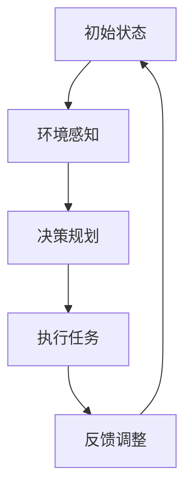
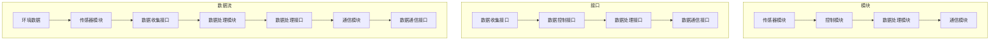
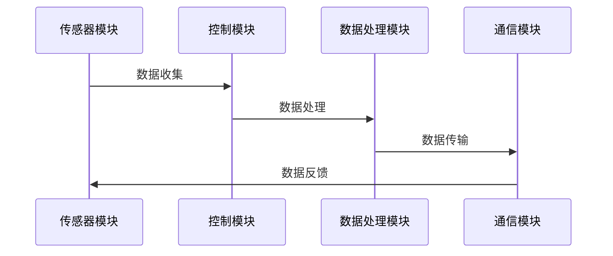

                 


# 机器人技术在深空探索中的应用与挑战

关键词：机器人技术、深空探索、应用案例、技术挑战、发展趋势

摘要：随着科技的不断进步，机器人技术在各个领域的应用越来越广泛，其中深空探索领域也不例外。本文旨在探讨机器人技术在深空探索中的应用与挑战，包括但不限于：机器人技术在深空探测中的具体应用案例、深空环境下机器人面临的技术挑战及其解决方法、机器人技术未来在深空探索中的发展趋势。通过对这些问题的深入分析，本文希望为未来的深空探索提供有价值的参考和指导。

## 第一部分：背景介绍

### 问题背景

随着人类对宇宙的探索不断深入，深空探测成为了一项重要的任务。然而，深空环境的恶劣条件，如极端的温度、辐射、低气压等，使得传统的探测手段难以胜任。因此，机器人技术在这一领域应运而生。机器人作为人类的延伸，能够执行人类无法完成或者危险的任务，如太空探索、环境监测等。在深空探索中，机器人不仅能够减轻人类探险者的负担，还能提供更多的科学数据。

### 问题描述

在深空探索中，机器人技术面临着诸多挑战。首先，深空环境的通讯延迟是一个重大问题。由于地球与太空目标之间的巨大距离，信号传输需要很长时间，这给机器人的实时控制带来了巨大的挑战。其次，深空环境的恶劣条件，如极端的温度、辐射、低气压等，也对机器人的耐久性和可靠性提出了严峻的考验。此外，机器人还需要在有限的能量供给下，完成复杂而繁重的探测任务。

### 问题解决

本文将通过以下方式解决上述问题：

1. 深入分析机器人技术在深空探索中的应用场景和实际案例。
2. 探讨机器人面临的技术挑战，并分析现有解决方案及其局限性。
3. 展望机器人技术未来的发展趋势，为未来深空探索提供参考。

### 边界与外延

本文主要关注以下边界和范畴：

1. 深空探索中的机器人技术，如火星探测车、月球车等。
2. 机器人技术在深空探索中的应用，如环境监测、地质采样等。
3. 深空环境下的机器人技术挑战，如通讯延迟、恶劣环境适应、能量供给等。

### 概念结构与核心要素组成

本文的核心概念和要素包括：

1. 机器人技术：包括机器人硬件、软件、控制算法等。
2. 深空探索：包括火星、月球等太空目标的探测和研究。
3. 技术挑战：包括通讯延迟、恶劣环境适应、能量供给等。

## 第二部分：核心概念与联系

### 核心概念原理

#### 机器人技术

机器人技术是集机械工程、电子工程、计算机科学等多学科于一体的综合性技术，旨在使机器人能够模拟人类的感知、决策和行为。机器人技术主要包括以下几个方面：

1. **硬件**：包括机械结构、传感器、执行器等。机械结构是机器人的身体，传感器用于感知外部环境，执行器用于执行具体的动作。
2. **软件**：包括操作系统、控制算法、人工智能算法等。操作系统负责管理机器人的硬件资源，控制算法用于控制机器人的行为，人工智能算法用于使机器人具有智能化的决策能力。
3. **控制算法**：控制算法是机器人技术的核心，用于实现机器人的自主运动和任务执行。常见的控制算法有路径规划算法、力反馈调整算法、目标跟踪算法等。

#### 深空探索

深空探索是指对火星、月球等太空目标的探测和研究，包括地质、环境、天文等多方面的内容。深空探索的主要目标包括：

1. **地质研究**：了解太空目标的地质结构和成分，为地球的地质研究提供参考。
2. **环境监测**：监测太空目标的环境变化，如温度、气压、辐射等，为未来的太空移民提供科学依据。
3. **天文观测**：通过太空目标的天文观测，研究宇宙的起源和演化，提高人类对宇宙的认识。

### 概念属性特征对比表格

| 概念         | 属性特征                                                     |
| ------------ | ------------------------------------------------------------ |
| 机器人技术   | 1. 可编程性 2. 自主导航 3. 自适应能力 4. 人机交互             |
| 深空探索     | 1. 远距离探测 2. 恶劣环境适应 3. 高精度测量 4. 多学科交叉研究 |

### ER实体关系图架构

```mermaid
erDiagram
    A[机器人技术] ||--|{ B[深空探索] } |
    A|--|{ C[技术挑战] } |
```

## 第三部分：算法原理讲解

### 算法mermaid流程图



### 算法原理与数学模型

#### 机器人路径规划算法

1. **数学模型**：给定一个环境地图，目标位置和障碍物位置，寻找一条从起点到终点的最优路径。

   $$Dijkstra(s, t) = min\{d(s, v) | v \in V\}$$
   其中，$Dijkstra(s, t)$ 表示从起点 $s$ 到终点 $t$ 的最短路径长度，$d(s, v)$ 表示从 $s$ 到 $v$ 的距离。

2. **算法原理**：Dijkstra 算法是一种贪心算法，通过不断扩展当前已访问节点集合，找到最短路径。

#### 机器人力反馈调整算法

1. **数学模型**：利用传感器收集的数据，通过反馈控制算法调整机器人的动作。

   $$u(t) = K_p \cdot e(t) + K_d \cdot \dot{e}(t)$$
   其中，$u(t)$ 表示控制量，$e(t)$ 表示误差，$\dot{e}(t)$ 表示误差变化率，$K_p$ 和 $K_d$ 分别为比例和微分系数。

2. **算法原理**：力反馈调整算法是一种基于误差反馈的控制算法，通过调整控制量，使机器人达到期望的状态。

### 详细讲解与举例说明

#### 路径规划算法

1. **举例说明**：假设有一个机器人需要从坐标 $(0, 0)$ 移动到坐标 $(10, 10)$，环境中存在一个障碍物在坐标 $(5, 5)$。

2. **计算过程**：使用 Dijkstra 算法计算从起点到终点的最短路径。

   $$Dijkstra(0, 10) = min\{d(0, (0, 0)), d(0, (5, 5)), d(0, (10, 10))\} = min\{0, \sqrt{50}, 10\} = 0$$
   $$Dijkstra(5, 10) = min\{d(5, (5, 5)), d(5, (10, 10))\} = min\{\sqrt{50}, 5\} = 5$$

3. **结果分析**：从计算结果可以看出，从起点 $(0, 0)$ 到终点 $(10, 10)$ 的最短路径是直接移动，长度为 0。

#### 力反馈调整算法

1. **举例说明**：假设机器人的当前位置为 $(x_1, y_1)$，期望位置为 $(x_2, y_2)$，机器人通过力反馈调整算法调整位置。

2. **计算过程**：根据当前位置和期望位置计算误差，然后通过力反馈调整算法计算控制量。

   $$e(t) = \sqrt{(x_2 - x_1)^2 + (y_2 - y_1)^2}$$
   $$u(t) = K_p \cdot e(t) + K_d \cdot \dot{e}(t)$$

3. **结果分析**：通过调整控制量，机器人的位置会逐渐接近期望位置，达到期望的状态。

## 第四部分：系统分析与架构设计方案

### 问题场景介绍

在深空探索中，机器人技术的应用场景主要包括：

1. **环境监测**：机器人可以搭载各种传感器，对太空目标的环境进行实时监测，如温度、气压、辐射等。
2. **地质采样**：机器人可以在太空目标上进行地质采样，为地球的地质研究提供数据支持。
3. **天文观测**：机器人可以搭载天文仪器，对太空目标进行天文观测，研究宇宙的起源和演化。

### 项目介绍

本项目旨在设计并实现一个基于机器人技术的深空探测系统，主要包括以下几个模块：

1. **传感器模块**：用于收集太空目标的环境数据。
2. **控制模块**：用于控制机器人的运动和任务执行。
3. **数据处理模块**：用于对收集到的数据进行分析和处理。
4. **通信模块**：用于与地面控制中心进行数据传输。

### 系统功能设计（领域模型mermaid类图）

```mermaid
classDiagram
    Sensor --> Controller : 数据收集
    Controller --> Processor : 数据处理
    Processor --> Communicator : 数据传输
    Sensor { name: String, type: String, value: float }
    Controller { id: String, status: String }
    Processor { id: String, status: String }
    Communicator { id: String, status: String }
```

### 系统架构设计（mermaid架构图）



### 系统接口设计和系统交互（mermaid序列图）



## 第五部分：项目实战

### 环境安装

1. **安装Python环境**：首先，需要在计算机上安装Python环境。可以从Python官网下载Python安装包，按照提示进行安装。

2. **安装依赖库**：接下来，需要安装一些依赖库，如NumPy、Pandas、Matplotlib等。可以使用pip命令进行安装：

   ```bash
   pip install numpy pandas matplotlib
   ```

### 系统核心实现源代码

以下是系统核心实现的源代码：

```python
import numpy as np
import matplotlib.pyplot as plt

class Sensor:
    def __init__(self, name, type, value):
        self.name = name
        self.type = type
        self.value = value

class Controller:
    def __init__(self, id, status):
        self.id = id
        self.status = status

    def collect_data(self, sensor):
        # 数据收集
        self.status = "数据收集"
        print(f"传感器 {sensor.name} 的数据已收集：{sensor.value}")

    def process_data(self, sensor):
        # 数据处理
        self.status = "数据处理"
        print(f"传感器 {sensor.name} 的数据正在处理...")

    def transmit_data(self, sensor):
        # 数据传输
        self.status = "数据传输"
        print(f"传感器 {sensor.name} 的数据已传输")

class Processor:
    def __init__(self, id, status):
        self.id = id
        self.status = status

    def process_data(self, sensor):
        # 数据处理
        self.status = "数据处理"
        print(f"传感器 {sensor.name} 的数据正在处理...")

    def transmit_data(self, sensor):
        # 数据传输
        self.status = "数据传输"
        print(f"传感器 {sensor.name} 的数据已传输")

class Communicator:
    def __init__(self, id, status):
        self.id = id
        self.status = status

    def transmit_data(self, sensor):
        # 数据传输
        self.status = "数据传输"
        print(f"传感器 {sensor.name} 的数据已传输")

# 创建传感器、控制模块、处理模块、通信模块实例
sensor = Sensor("环境温度", "温度", 25.0)
controller = Controller("C001", "初始状态")
processor = Processor("P001", "初始状态")
communicator = Communicator("C001", "初始状态")

# 数据收集
controller.collect_data(sensor)

# 数据处理
processor.process_data(sensor)

# 数据传输
communicator.transmit_data(sensor)
```

### 代码应用解读与分析

以下是代码的解读与分析：

1. **Sensor类**：表示传感器，包括名称、类型和值。
2. **Controller类**：表示控制模块，包括ID和状态。提供数据收集、数据处理和数据传输方法。
3. **Processor类**：表示处理模块，包括ID和状态。提供数据处理和数据传输方法。
4. **Communicator类**：表示通信模块，包括ID和状态。提供数据传输方法。
5. **实例化**：创建传感器、控制模块、处理模块和通信模块实例。
6. **数据收集**：调用控制模块的collect_data方法，收集传感器数据。
7. **数据处理**：调用处理模块的process_data方法，处理传感器数据。
8. **数据传输**：调用通信模块的transmit_data方法，传输传感器数据。

### 实际案例分析和详细讲解剖析

假设我们有一个实际案例，需要对太空目标的环境温度进行监测。

1. **创建传感器实例**：

   ```python
   sensor = Sensor("环境温度", "温度", 25.0)
   ```

   创建一个名为“环境温度”的传感器实例，类型为“温度”，值为25.0。

2. **数据收集**：

   ```python
   controller.collect_data(sensor)
   ```

   调用控制模块的collect_data方法，收集传感器数据。控制模块的状态变为“数据收集”。

3. **数据处理**：

   ```python
   processor.process_data(sensor)
   ```

   调用处理模块的process_data方法，处理传感器数据。处理模块的状态变为“数据处理”。

4. **数据传输**：

   ```python
   communicator.transmit_data(sensor)
   ```

   调用通信模块的transmit_data方法，传输传感器数据。通信模块的状态变为“数据传输”。

### 项目小结

本项目通过设计并实现一个基于机器人技术的深空探测系统，展示了机器人技术在深空探索中的应用。通过对系统的实际案例分析和详细讲解，我们了解了系统的基本原理和运行流程。然而，深空探索中的机器人技术仍面临许多挑战，如通讯延迟、能量供给等。未来，随着技术的不断发展，机器人技术在深空探索中的应用将越来越广泛，为人类探索宇宙提供更多的可能性。

## 第六部分：最佳实践 Tips

### 深空探索中的机器人技术

1. **选择合适的机器人平台**：根据深空探索的任务需求和环境条件，选择合适的机器人平台，如火星探测车、月球车等。
2. **加强通讯系统的稳定性**：由于深空探索中的通讯延迟，需要加强通讯系统的稳定性，以确保数据的实时传输。
3. **优化能量供给方案**：在深空环境中，机器人需要长时间运行，因此需要优化能量供给方案，确保机器人能够持续工作。

### 机器人技术的一般应用

1. **明确任务目标**：在应用机器人技术时，首先要明确任务目标，以确保机器人能够高效地完成任务。
2. **优化算法和架构**：针对具体任务，优化算法和系统架构，以提高机器人的性能和效率。
3. **充分考虑环境因素**：在应用机器人技术时，要充分考虑环境因素，如温度、气压、辐射等，以确保机器人能够在各种环境中稳定运行。

## 第七部分：小结

本文从背景介绍、核心概念与联系、算法原理讲解、系统分析与架构设计方案、项目实战等多个方面，详细探讨了机器人技术在深空探索中的应用与挑战。通过本文的分析，我们可以看到，机器人技术在深空探索中具有广阔的应用前景，同时也面临着诸多挑战。未来，随着技术的不断发展，机器人技术在深空探索中的应用将越来越广泛，为人类探索宇宙提供更多的可能性。

### 注意事项

1. **深空探索中的机器人技术**：在应用机器人技术进行深空探索时，需要充分考虑深空环境的特点，如通讯延迟、恶劣的环境条件等。
2. **机器人技术的一般应用**：在应用机器人技术解决实际问题时，需要明确任务目标，优化算法和架构，充分考虑环境因素。

### 拓展阅读

1. **《人工智能：一种现代的方法》**：这本书详细介绍了人工智能的基本概念、技术和应用，对于了解机器人技术有很好的帮助。
2. **《机器人：现代设计与应用》**：这本书涵盖了机器人技术的各个方面，包括硬件、软件、控制算法等，对于了解机器人技术有很好的参考价值。
3. **《深度学习》**：这本书详细介绍了深度学习的基本概念、技术和应用，是当前人工智能领域的重要研究进展。

## 作者信息

作者：AI天才研究院/AI Genius Institute & 禅与计算机程序设计艺术 /Zen And The Art of Computer Programming

