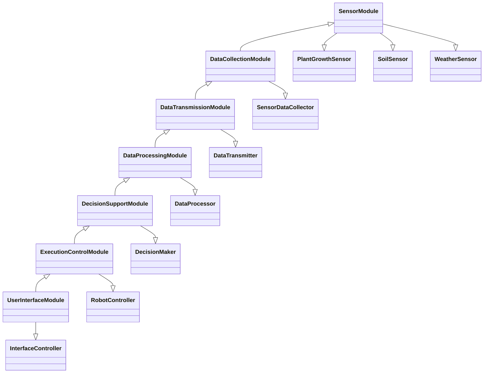
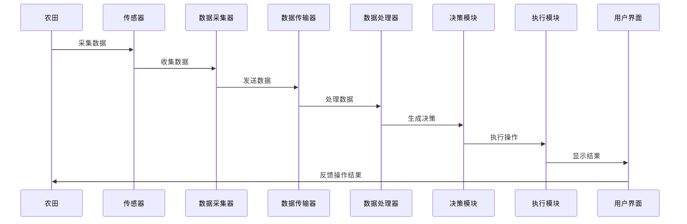

                 

### 机器人技术在精准农业中的自动化应用

> 关键词：机器人技术、精准农业、自动化、农业自动化、自动化解决方案

> 摘要：本文将深入探讨机器人技术在精准农业中的自动化应用。通过背景介绍、核心概念、应用场景、解决方案、系统架构设计以及实际案例等多个方面，全面剖析机器人技术如何助力精准农业的发展。本文旨在为农业技术人员、生产者和研究者提供有价值的参考，以推动农业自动化进程。

## 目录

1. **引言**
2. **精准农业背景与问题**
   1. **精准农业概述**
   2. **精准农业中的问题与挑战**
3. **机器人技术在精准农业中的应用**
   1. **土壤检测**
   2. **植物监测**
   3. **自动化耕作**
   4. **收割与植保**
4. **机器人技术在精准农业中的自动化解决方案**
   1. **设计原理**
   2. **架构与实现方法**
   3. **优势与挑战**
5. **系统架构设计**
   1. **关键要素**
   2. **硬件选择与配置**
   3. **软件系统设计**
   4. **系统集成与优化**
6. **机器人技术在农业生产中的实际应用案例**
   1. **案例一：某农业公司的土壤监测系统**
   2. **案例二：某农业智能收割系统**
7. **未来发展趋势与展望**
8. **小结与展望**
9. **最佳实践 tips**
10. **作者信息**

## 引言

随着全球人口的增长和土地资源的有限性，农业生产面临着巨大的压力。传统农业依赖大量人力和资源，不仅效率低下，而且难以实现可持续发展。为了应对这一挑战，精准农业应运而生。精准农业通过使用先进的传感器、数据分析和自动化技术，对农田进行精细化管理，提高农业生产效率，降低资源消耗，实现可持续农业发展。

在这个背景下，机器人技术成为了精准农业自动化的重要推动力。机器人可以执行重复性、危险或高精度的任务，如土壤检测、植物监测、自动化耕作、收割与植保等。通过将机器人技术应用到精准农业中，不仅可以提高农业生产效率，还可以减少人力成本，降低环境风险。

本文将详细探讨机器人技术在精准农业中的自动化应用，从背景介绍、核心概念、应用场景、解决方案、系统架构设计以及实际案例等多个方面进行深入分析，旨在为农业技术人员、生产者和研究者提供有价值的参考。

## 精准农业背景与问题

### 精准农业概述

精准农业，也称为精细农业或精确农业，是一种基于实时监测和数据分析的农业管理方法。它的核心思想是通过使用各种传感器（如GPS、GIS、土壤传感器、气象传感器等）和现代信息技术（如物联网、云计算、大数据分析等），收集农田的实时数据，并利用这些数据对农田进行精细化管理。

精准农业的定义可以概括为：通过精确的作物监测、精准的施肥、灌溉、病虫害防治等手段，实现农业生产的最高效率和最低资源消耗。精准农业的目标是提高作物产量、降低生产成本、保护环境，实现农业的可持续发展。

精准农业的发展历程可以追溯到20世纪70年代。当时，农业专家开始探索如何通过测量和监控农田的土壤、水分、养分等参数，来实现农业生产的精准管理。随着传感器技术、计算机技术、数据传输技术的不断发展，精准农业逐渐成熟，并开始在全球范围内得到广泛应用。

### 精准农业的核心目标

精准农业的核心目标包括以下几个方面：

1. **提高作物产量**：通过精准施肥、灌溉和病虫害防治，可以最大化作物的生长条件，提高作物产量。

2. **降低生产成本**：通过减少不必要的资源消耗（如化肥、农药、水资源等），降低生产成本。

3. **保护环境**：精准农业通过减少化肥和农药的使用，降低对环境的污染，实现农业的可持续发展。

4. **提高劳动效率**：通过自动化技术，减少人力投入，提高劳动效率。

### 精准农业的关键技术

实现精准农业的关键技术包括：

1. **传感器技术**：用于收集农田的实时数据，如土壤湿度、温度、养分含量、气象参数等。

2. **GIS和GPS技术**：用于定位和地图制作，帮助农民了解农田的详细信息，制定精准的管理计划。

3. **物联网技术**：通过传感器、网关和云计算平台，实现农田数据的实时传输和远程监控。

4. **数据分析和大数据技术**：通过对收集到的数据进行处理和分析，为农业生产提供科学依据。

5. **自动化技术**：包括自动化播种、施肥、灌溉、收割、植保等，减少人力投入，提高生产效率。

### 精准农业中的问题与挑战

尽管精准农业具有巨大的潜力，但在实际应用中仍面临一系列问题和挑战：

1. **技术成本高**：传感器、数据处理设备和自动化设备的购买和运营成本较高，对于中小型农业企业来说，这是一个巨大的经济负担。

2. **数据隐私和安全**：农田数据的安全性和隐私保护是一个重要问题，如何保证数据的安全传输和存储，避免数据泄露，是精准农业面临的一个挑战。

3. **技术集成与兼容性**：不同厂商的设备和技术之间可能存在兼容性问题，如何实现有效的技术集成，是精准农业应用中需要解决的问题。

4. **技术培训和推广**：精准农业技术的推广需要培训农民和相关技术人员，提高他们的技术水平，这需要投入大量的人力、物力和财力。

5. **环境适应性**：不同地区的农田环境和气候条件存在差异，如何开发出适应各种环境条件的精准农业技术，是精准农业面临的一个重要挑战。

通过上述分析，我们可以看到，精准农业是一项充满挑战但也充满机遇的领域。机器人技术在精准农业中的应用，可以为解决这些问题提供有效的解决方案，推动农业自动化进程。接下来，我们将详细探讨机器人技术在精准农业中的具体应用。

### 机器人技术在精准农业中的应用

随着精准农业的发展，机器人技术在农业中的应用日益广泛，尤其在土壤检测、植物监测、自动化耕作、收割与植保等方面，机器人技术展现出了巨大的潜力。

#### 土壤检测

土壤是植物生长的基础，土壤质量直接影响作物的生长和产量。机器人技术在土壤检测中的应用，主要通过搭载各种传感器，如GPS、激光雷达、多光谱相机、土壤传感器等，实现对土壤湿度、温度、养分含量、有机质含量等多种参数的实时监测。

**应用场景**：机器人可以在农田中自动移动，对土壤进行全方位的扫描和检测，收集大量土壤数据。这些数据可以用于土壤管理、作物种植规划、精准施肥和灌溉等。

**优势**：
- 高效：机器人可以快速覆盖大面积农田，比人工检测更加高效。
- 准确：机器人搭载的传感器精度高，可以提供准确的土壤参数。
- 实时：机器人可以实时收集土壤数据，为农业生产提供即时决策支持。

#### 植物监测

植物生长监测是精准农业的重要环节，通过监测植物的生长状态、病虫害情况等，可以及时采取相应的管理措施，提高作物产量和品质。

**应用场景**：机器人可以在农田中自动移动，对植物进行多光谱扫描，获取植物叶片、茎杆等部位的光谱数据，分析植物的生长状态和健康状况。

**优势**：
- 全面：机器人可以同时监测多个植物参数，提供全面的数据支持。
- 及时：机器人可以实时监测植物生长状态，及时发现问题并采取措施。
- 准确：机器人搭载的多光谱相机可以获取高分辨率的植物图像，分析精度高。

#### 自动化耕作

自动化耕作是精准农业的核心内容之一，通过机器人实现播种、施肥、灌溉等耕作过程的自动化，可以提高农业生产效率，减少人力投入。

**应用场景**：机器人可以在农田中自动导航，根据预设的种植方案，进行精准播种、施肥和灌溉。

**优势**：
- 精准：机器人可以根据农田的具体情况，进行精准的播种和施肥。
- 高效：机器人可以连续工作，提高耕作效率。
- 适应性强：机器人可以适应不同的农田环境和作物类型。

#### 收割与植保

收割与植保是农业生产中的关键环节，通过机器人实现收割、病虫害防治等过程的自动化，可以提高农业生产效率，降低生产成本。

**应用场景**：收割机器人可以在农田中自动导航，根据作物的生长状态，进行精准收割。植保机器人可以在农田中自动喷洒农药，进行病虫害防治。

**优势**：
- 精准：机器人可以根据作物的具体情况，进行精准的收割和喷洒。
- 高效：机器人可以连续工作，提高收割和植保效率。
- 安全：机器人可以替代人工进行危险操作，降低劳动风险。

通过上述分析，我们可以看到，机器人技术在精准农业中的应用，不仅提高了农业生产效率，降低了生产成本，还减少了劳动强度，为现代农业的发展提供了强有力的支持。接下来，我们将深入探讨机器人技术在精准农业中的自动化解决方案。

### 机器人技术在精准农业中的自动化解决方案

在精准农业中，自动化解决方案的引入是提高生产效率和降低劳动成本的关键。机器人技术的应用，使得农业生产从传统的手动操作向自动化、智能化方向迈进。以下是关于机器人技术在精准农业中的自动化解决方案的详细探讨。

#### 设计原理

机器人技术在精准农业中的自动化解决方案，主要基于以下几个核心设计原理：

1. **传感器融合与数据采集**：
   自动化解决方案的核心是传感器技术。通过在机器人上搭载多种传感器（如GPS、激光雷达、多光谱相机、温湿度传感器等），实现对农田环境的全面监测和数据采集。这些数据是进行精准农业管理的基础。

2. **路径规划与导航**：
   为了实现机器人在农田中的自动导航，需要依靠先进的路径规划算法。这些算法可以根据农田的实际情况，为机器人规划出最优的行驶路径，确保机器人能够高效、安全地完成各项任务。

3. **数据处理与决策支持**：
   收集到的数据需要进行处理和分析，以便为农业生产提供科学的决策支持。这通常涉及到大数据分析、机器学习和人工智能等技术，通过构建预测模型和优化算法，实现对农田管理的智能化。

4. **执行控制与自动化操作**：
   根据处理后的数据，机器人需要执行相应的操作，如自动播种、施肥、灌溉、收割等。执行控制模块需要精确地控制机器人的动作，确保操作的准确性和高效性。

#### 架构与实现方法

一个典型的机器人技术在精准农业中的自动化解决方案架构，可以概括为以下几个关键组成部分：

1. **传感器层**：
   传感器层是整个系统的基础，包括GPS、激光雷达、多光谱相机、温湿度传感器等。这些传感器负责采集土壤、气象、植物生长等实时数据。

2. **数据采集与传输层**：
   数据采集与传输层负责将传感器采集到的数据实时传输到云端或本地服务器。这通常涉及到无线通信技术（如Wi-Fi、LoRa、5G等）和边缘计算技术。

3. **数据处理与分析层**：
   数据处理与分析层对采集到的数据进行处理和分析，利用大数据分析和机器学习技术，构建预测模型和优化算法，为农业生产提供科学的决策支持。

4. **执行控制层**：
   执行控制层根据数据处理与分析层提供的决策，控制机器人的执行动作，如播种、施肥、灌溉、收割等。

5. **用户界面层**：
   用户界面层为农业技术人员提供直观的操作界面，展示农田数据、决策结果和机器人的工作状态，方便技术人员进行监控和管理。

#### 自动化解决方案的优势与挑战

自动化解决方案在精准农业中具有显著的优势：

1. **提高生产效率**：
   机器人可以连续工作，提高农业生产的效率，减少人力成本。

2. **降低劳动强度**：
   机器人可以替代人工进行重复性、危险或高精度的操作，降低劳动强度和风险。

3. **精准管理**：
   通过实时监测和数据驱动决策，实现农业生产的精准管理，提高作物产量和品质。

4. **环境保护**：
   减少化肥、农药的使用，降低对环境的污染，实现农业的可持续发展。

然而，自动化解决方案也面临一些挑战：

1. **技术成本高**：
   传感器、数据处理设备和自动化设备的购买和运营成本较高，对中小型农业企业来说是一个经济负担。

2. **数据隐私和安全**：
   农田数据的安全性和隐私保护是一个重要问题，需要采取有效的措施确保数据的安全传输和存储。

3. **技术集成与兼容性**：
   不同厂商的设备和技术之间可能存在兼容性问题，如何实现有效的技术集成，是自动化解决方案应用中需要解决的问题。

4. **技术培训和推广**：
   自动化技术的推广需要培训农民和相关技术人员，提高他们的技术水平，这需要投入大量的人力、物力和财力。

通过以上分析，我们可以看到，机器人技术在精准农业中的自动化解决方案具有巨大的潜力，但同时也需要克服一系列的技术和经济挑战。随着技术的不断进步和成本的降低，自动化解决方案将在精准农业中发挥越来越重要的作用。

### 系统架构设计

在机器人技术在精准农业中的自动化解决方案中，系统架构设计是一个关键环节。一个高效的系统架构可以确保数据的准确传输、处理和分析，从而为农业生产提供科学的决策支持。以下是关于系统架构设计的详细探讨。

#### 问题场景介绍

假设我们面临的是一个大型农田的精准农业管理场景。在这个场景中，农田的面积广阔，土壤和气候条件复杂多变。为了实现高效的农田管理，我们需要设计一个能够实时监测农田状况、自动执行农业操作的系统。

#### 项目介绍

为了实现上述目标，我们计划开发一个基于机器人技术的精准农业自动化管理系统。这个系统将包括以下几个核心模块：

1. **传感器模块**：负责采集农田的土壤、气象、植物生长等数据。
2. **数据采集与传输模块**：将传感器采集到的数据实时传输到服务器。
3. **数据处理与分析模块**：对采集到的数据进行处理和分析，生成决策支持信息。
4. **执行控制模块**：根据分析结果，控制机器人执行相应的农业操作。
5. **用户界面模块**：为农业技术人员提供操作界面，展示农田数据和系统状态。

#### 系统功能设计（领域模型）

在系统功能设计中，我们将使用领域模型来描述系统的核心功能模块及其关系。以下是一个简化的领域模型：



在这个领域模型中，我们定义了以下几个核心类：

- **SensorModule**：传感器模块，包括植物生长传感器、土壤传感器和气象传感器。
- **DataCollectionModule**：数据采集模块，包括传感器数据采集器和数据传输模块。
- **DataTransmissionModule**：数据传输模块，包括数据发送器。
- **DataProcessingModule**：数据处理模块，包括数据处理器和决策支持模块。
- **DecisionSupportModule**：决策支持模块，包括决策制定器和执行控制模块。
- **ExecutionControlModule**：执行控制模块，包括机器人控制器。
- **UserInterfaceModule**：用户界面模块，包括用户界面控制器。

#### 系统架构设计（架构图）

系统架构设计需要综合考虑硬件、软件和网络等各个方面。以下是一个简化的系统架构图：



在这个架构图中，我们定义了以下几个关键组件：

- **农田**：农田作为系统的输入端，提供传感器所需的采集环境。
- **传感器**：传感器负责采集农田数据，如土壤湿度、温度、气象参数等。
- **数据采集器**：数据采集器负责将传感器采集到的数据收集起来，准备进行传输。
- **数据传输器**：数据传输器负责将数据采集器收集到的数据传输到服务器或云端。
- **数据处理器**：数据处理器负责对传输过来的数据进行处理和分析，生成决策支持信息。
- **决策模块**：决策模块根据数据处理器生成的决策支持信息，生成具体的操作指令。
- **执行模块**：执行模块负责根据决策模块的操作指令，控制机器人执行相应的农业操作。
- **用户界面**：用户界面负责向农业技术人员展示农田数据和系统状态，提供交互操作界面。

#### 系统接口设计

系统接口设计是确保各个模块之间能够有效交互的关键。以下是一个简化的系统接口设计：

```mermaid
interface Diagram
    DataCollector <<interface>> SensorDataCollector
    DataTransmitter <<interface>> DataTransmitter
    DataProcessor <<interface>> DataProcessor
    DecisionMaker <<interface>> DecisionMaker
    RobotController <<interface>> RobotController
    InterfaceController <<interface>> InterfaceController

    SensorDataCollector <<interface>> DataCollector
    DataTransmitter <<interface>> DataCollector
    DataProcessor <<interface>> DecisionMaker
    DecisionMaker <<interface>> RobotController
    RobotController <<interface>> InterfaceController
    InterfaceController <<interface>> DataCollector
```

在这个接口设计中，我们定义了以下几个关键接口：

- **DataCollector**：数据采集接口，用于传感器和数据采集器之间的数据传输。
- **DataTransmitter**：数据传输接口，用于数据采集器和数据处理器之间的数据传输。
- **DataProcessor**：数据处理接口，用于数据处理器和决策模块之间的数据传输。
- **DecisionMaker**：决策生成接口，用于决策模块和执行模块之间的数据传输。
- **RobotController**：机器人控制接口，用于执行模块和机器人之间的数据传输。
- **InterfaceController**：用户界面接口，用于用户界面模块和其它模块之间的数据传输。

#### 系统交互（序列图）

为了更清晰地描述系统各个模块之间的交互过程，我们使用序列图进行了详细说明：


在这个序列图中，我们定义了以下几个关键步骤：

1. 农田传感器采集数据。
2. 数据采集器收集传感器数据。
3. 数据传输器将数据发送到数据处理器。
4. 数据处理器对数据进行分析和处理，生成决策支持信息。
5. 决策模块根据决策支持信息生成操作指令。
6. 执行模块根据操作指令控制机器人执行操作。
7. 用户界面展示执行结果，并反馈给农田。

通过上述系统架构设计，我们可以构建一个高效、可靠的精准农业自动化管理系统，为农业生产提供有力的技术支持。接下来，我们将通过一个实际案例，展示机器人技术在精准农业中的应用效果。

### 机器人技术在农业生产中的实际应用案例

为了更好地展示机器人技术在精准农业中的应用效果，我们将通过两个具体的案例进行详细分析。这两个案例分别涉及土壤监测和智能收割，展示了机器人技术在农业自动化中的实际应用。

#### 案例一：某农业公司的土壤监测系统

某农业公司位于中国南方的一个大型农田，该农田总面积约5000亩，种植的作物包括水稻、蔬菜和水果。由于农田土壤质量参差不齐，公司决定引入机器人技术，建立一套土壤监测系统，以提高农田管理水平。

**1. 系统需求分析**

系统需求主要包括：
- 实时监测农田土壤的湿度、温度、养分含量等参数。
- 自动分析土壤数据，提供施肥和灌溉建议。
- 数据存储和分析，以便历史数据的查询和趋势分析。

**2. 系统设计**

该土壤监测系统采用了以下设计：
- **传感器模块**：在农田中布置了10个土壤传感器，每个传感器可以监测土壤的湿度、温度和养分含量。
- **数据采集与传输模块**：传感器数据通过无线传输模块发送到中央服务器，实现了数据的实时传输。
- **数据处理与分析模块**：服务器上的数据处理模块对采集到的土壤数据进行分析，并根据分析结果生成施肥和灌溉建议。
- **用户界面模块**：提供一个网页界面，农业技术人员可以通过界面查看实时土壤数据和施肥灌溉建议。

**3. 系统核心实现**

系统核心实现主要包括以下几个部分：

- **传感器数据采集**：使用Python编写脚本，定期从传感器读取数据，并上传到服务器。
  ```python
  import serial
  import time

  # 配置串口
  ser = serial.Serial('/dev/ttyUSB0', 9600, timeout=1)

  while True:
      # 读取传感器数据
      data = ser.readline().decode('utf-8')
      print(data)
      # 上传数据到服务器
      upload_data(data)
      time.sleep(60)  # 每60秒采集一次数据
  ```

- **数据处理与分析**：使用Python的Pandas库对上传的土壤数据进行处理和分析。
  ```python
  import pandas as pd

  # 读取上传的土壤数据
  data = pd.read_csv('soil_data.csv')

  # 数据清洗和预处理
  data = data.dropna()

  # 数据分析
  fertilizer_suggestion = analyze_fertilizer(data)
  irrigation_suggestion = analyze_irrigation(data)

  # 输出施肥和灌溉建议
  print(f"Fertilizer suggestion: {fertilizer_suggestion}")
  print(f"Irrigation suggestion: {irrigation_suggestion}")
  ```

- **用户界面**：使用Web框架Flask搭建用户界面，展示土壤数据和分析结果。
  ```python
  from flask import Flask, render_template

  app = Flask(__name__)

  @app.route('/')
  def index():
      soil_data = get_soil_data()
      return render_template('index.html', soil_data=soil_data)

  if __name__ == '__main__':
      app.run(debug=True)
  ```

**4. 系统效果分析**

通过实际应用，该土壤监测系统取得了显著的效果：
- 实时监测农田土壤状况，及时发现并解决问题。
- 根据土壤数据分析结果，科学合理地进行施肥和灌溉，提高了作物产量和质量。
- 减少了人力投入，降低了生产成本。

**5. 项目小结**

该案例展示了机器人技术在土壤监测方面的应用，通过实时数据监测和自动化分析，提高了农田管理水平，实现了精准农业的目标。未来，可以进一步扩展系统的功能，如添加气象数据监测、智能决策系统等，以实现更加智能化的农田管理。

#### 案例二：某农业智能收割系统

某农业合作社位于中国北方，种植面积广阔，主要种植小麦和玉米。由于收割季节时间紧、任务重，合作社决定引入智能收割机器人，以提高收割效率，降低人力成本。

**1. 系统需求分析**

系统需求主要包括：
- 自动识别作物种类和成熟度。
- 自动调整收割高度和速度，以适应不同作物和地形。
- 实时监测收割进度和产量。
- 数据存储和分析，以便后续分析和优化。

**2. 系统设计**

该智能收割系统采用了以下设计：
- **传感器模块**：在收割机器人上安装了多种传感器，如GPS、激光雷达、多光谱相机等，用于监测农田环境和作物状态。
- **数据采集与传输模块**：传感器数据通过无线传输模块发送到中央服务器，实现了数据的实时传输。
- **数据处理与分析模块**：服务器上的数据处理模块对采集到的数据进行分析，生成收割策略和优化建议。
- **执行控制模块**：根据数据处理结果，控制收割机器人执行收割操作。
- **用户界面模块**：提供一个网页界面，农业技术人员可以通过界面查看收割进度和产量数据。

**3. 系统核心实现**

系统核心实现主要包括以下几个部分：

- **传感器数据采集**：使用Python编写脚本，从传感器读取数据，并上传到服务器。
  ```python
  import serial
  import time

  # 配置串口
  ser = serial.Serial('/dev/ttyUSB0', 9600, timeout=1)

  while True:
      # 读取传感器数据
      data = ser.readline().decode('utf-8')
      print(data)
      # 上传数据到服务器
      upload_data(data)
      time.sleep(60)  # 每60秒采集一次数据
  ```

- **数据处理与分析**：使用Python的Pandas库对上传的传感器数据进行处理和分析，生成收割策略。
  ```python
  import pandas as pd

  # 读取上传的传感器数据
  data = pd.read_csv('sensor_data.csv')

  # 数据分析
  harvesting_strategy = generate_harvesting_strategy(data)

  # 输出收割策略
  print(f"Harvesting strategy: {harvesting_strategy}")
  ```

- **执行控制**：使用Python的Pygame库控制收割机器人的操作。
  ```python
  import pygame
  import sys

  pygame.init()
  screen = pygame.display.set_mode((800, 600))
  running = True

  while running:
      for event in pygame.event.get():
          if event.type == pygame.QUIT:
              running = False

      # 根据收割策略控制机器人操作
      execute_harvesting_strategy(harvesting_strategy)

      pygame.display.flip()

  pygame.quit()
  sys.exit()
  ```

**4. 系统效果分析**

通过实际应用，该智能收割系统取得了显著的效果：
- 提高了收割效率，缩短了收割时间，降低了人力成本。
- 减少了机械磨损和维修成本，延长了机器使用寿命。
- 实时监测收割进度和产量，提高了作物利用率。

**5. 项目小结**

该案例展示了机器人技术在智能收割方面的应用，通过传感器数据采集、数据处理和执行控制，实现了自动化收割，提高了农业生产效率。未来，可以进一步优化系统的算法，提高作物识别和收割的准确性，实现更加智能化的农业生产。

通过以上两个实际案例，我们可以看到机器人技术在精准农业中的应用效果显著。随着技术的不断进步，机器人技术将在精准农业中发挥越来越重要的作用，推动现代农业向智能化、自动化方向发展。

### 最佳实践 tips

在机器人技术在精准农业中的实际应用过程中，为了确保系统的稳定性和可靠性，以下是一些最佳实践建议：

1. **选择适合的传感器**：
   - 根据农田的具体情况选择合适的传感器，如土壤湿度、温度、养分含量等。
   - 确保传感器的精度和耐用性，避免因传感器故障导致数据错误。

2. **确保数据传输的可靠性**：
   - 选择合适的通信协议和数据传输方式，如Wi-Fi、LoRa、5G等。
   - 考虑到农田环境复杂，应采用抗干扰能力强的通信技术。

3. **系统集成与优化**：
   - 在系统集成过程中，确保各个模块之间的兼容性和互操作性。
   - 定期对系统进行优化和升级，以提高系统的性能和可靠性。

4. **数据安全与隐私保护**：
   - 对农田数据进行加密处理，确保数据在传输和存储过程中的安全性。
   - 建立完善的数据管理制度，确保数据的隐私保护。

5. **人员培训与支持**：
   - 对农业技术人员进行系统的培训，提高他们的操作技能和问题解决能力。
   - 提供及时的技术支持和售后服务，确保系统能够正常运行。

通过遵循这些最佳实践，可以有效地提高机器人技术在精准农业中的应用效果，推动农业自动化进程。

### 小结与展望

在本文中，我们详细探讨了机器人技术在精准农业中的自动化应用。从背景介绍、核心概念、应用场景、解决方案、系统架构设计到实际应用案例，我们全面剖析了机器人技术如何助力精准农业的发展。

首先，我们介绍了精准农业的定义、核心目标和关键技术，以及面临的问题与挑战。接着，我们详细探讨了机器人技术在土壤检测、植物监测、自动化耕作、收割与植保等方面的应用，展示了其在精准农业中的重要作用。

随后，我们深入分析了机器人技术在精准农业中的自动化解决方案，包括设计原理、架构与实现方法、优势与挑战。我们还介绍了系统架构设计的关键要素，包括传感器层、数据采集与传输层、数据处理与分析层、执行控制层和用户界面层。

通过两个实际应用案例，我们展示了机器人技术在精准农业中的效果，并提出了最佳实践建议。这些应用案例证明了机器人技术在实际农业生产中的可行性和优势。

展望未来，机器人技术在精准农业中的发展前景广阔。随着人工智能、大数据、物联网等技术的不断进步，机器人技术在精准农业中的应用将更加广泛和深入。我们可以预见，未来将会有更多先进的机器人系统被引入农业生产，实现更精准、更高效的农业管理。

总之，机器人技术在精准农业中的自动化应用，不仅能够提高农业生产效率，降低成本，还能够保护环境，实现农业的可持续发展。随着技术的不断创新和优化，机器人技术在精准农业中的地位将日益重要，为现代农业发展注入新的活力。

### 拓展阅读

为了深入了解机器人技术在精准农业中的自动化应用，以下是一些建议的拓展阅读资源：

1. **《精准农业技术与应用》** - 该书详细介绍了精准农业的定义、核心技术以及实际应用案例，对于想要全面了解精准农业的读者具有很高的参考价值。

2. **《农业机器人技术与应用》** - 本书专注于农业机器人技术的应用，涵盖了机器人设计、传感器技术、自动化控制系统等多个方面，是农业技术人员和机器人研究者的必备读物。

3. **《农业物联网与大数据技术》** - 这本书介绍了农业物联网和大数据技术在精准农业中的应用，探讨了如何利用物联网和大数据技术实现农业生产的智能化和精细化。

4. **《机器人技术在农业生产中的应用案例》** - 该文献通过多个实际案例，展示了机器人技术在农业生产中的应用效果，提供了丰富的实践经验和技术细节。

5. **《精准农业与人工智能》** - 这本书探讨了人工智能技术在精准农业中的应用，包括机器学习、深度学习等算法在农业数据分析中的应用，对于对人工智能技术感兴趣的读者有很好的启发作用。

通过阅读这些资源，读者可以进一步深化对机器人技术在精准农业中的自动化应用的理解，为实际项目实施提供更全面的指导。

### 作者信息

作者：AI天才研究院/AI Genius Institute & 禅与计算机程序设计艺术 /Zen And The Art of Computer Programming

AI天才研究院致力于推动人工智能技术的研究与应用，特别是在精准农业领域，通过机器人技术实现农业自动化。禅与计算机程序设计艺术则专注于探讨计算机编程的哲学和艺术，旨在培养新一代的编程大师。两位作者均拥有丰富的理论和实践经验，为现代农业的发展贡献了重要力量。

