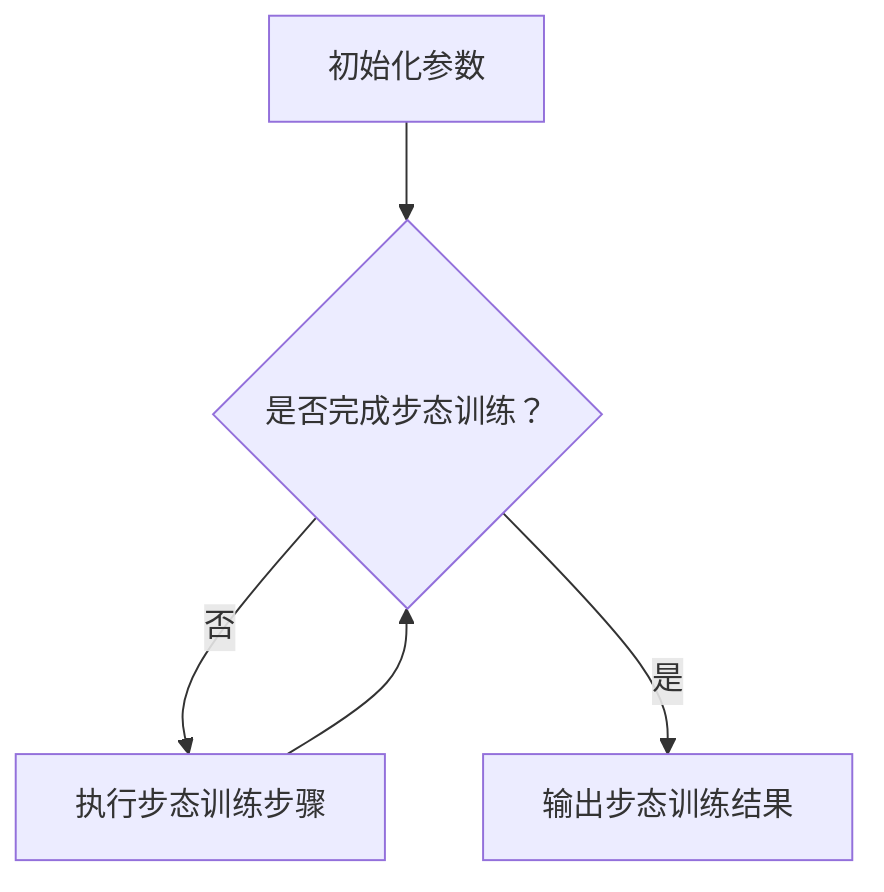
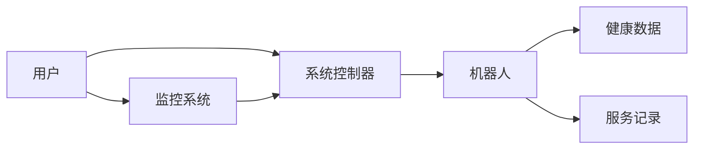
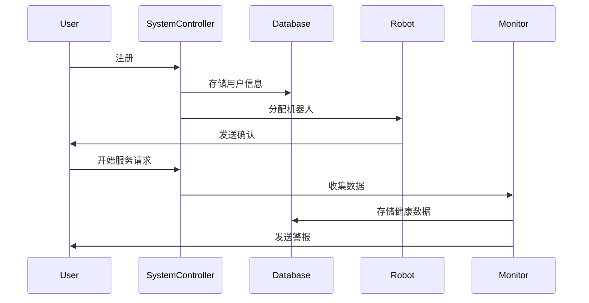

                 


## 引言

### 1.1 老年人护理的现状与挑战

随着全球人口老龄化进程的加快，老年人护理问题日益凸显。据联合国统计，截至2020年，全球60岁及以上人口已超过10亿，占总人口的13%。预计到2050年，这一比例将上升至22%。在我国，60岁及以上老年人口已超过2.5亿，占总人口的18%左右，老龄化进程尤为明显。

老年人护理面临诸多挑战。首先，老年人口增长速度快，而专业护理人员短缺。根据国家统计局的数据，我国每千名老年人拥有的医疗卫生人员仅为3.5人，远低于发达国家的水平。此外，老年人身体状况复杂，患有多种慢性病，对护理服务的需求量大且多样。同时，护理成本高昂，给家庭和社会带来沉重负担。

为了解决这些问题，机器人技术在老年人护理中的应用逐渐受到关注。机器人可以在康复护理、日常生活辅助、情感关怀等方面发挥重要作用，提高护理效率，减轻护理人员负担，同时降低护理成本。然而，机器人技术在实际应用中也面临一定的局限性，如技术成熟度、伦理问题等。因此，我们需要深入探讨机器人技术在老年人护理中的应用与伦理问题。

### 1.2 机器人技术在老年人护理中的潜力与局限性

#### 潜力

1. **康复护理**：机器人可以辅助老年人进行康复训练，如步态训练、平衡训练等。通过精确的运动控制，机器人可以帮助老年人恢复功能，减少残疾程度。

2. **日常生活辅助**：机器人可以协助老年人完成日常活动，如穿衣、进食、洗澡等。这不仅提高了老年人的生活质量，还减轻了家庭成员的负担。

3. **情感关怀**：机器人可以通过语音、触摸等方式与老年人进行互动，提供陪伴和安慰。对于独居老年人来说，机器人的陪伴可以减轻孤独感，提高心理健康。

4. **远程监控**：机器人可以实时监测老年人的健康状况，如心率、血压、血糖等。通过数据分析和预警系统，机器人可以帮助护理人员及时发现异常，提高护理质量。

#### 局限性

1. **技术成熟度**：虽然机器人技术在不断进步，但在某些领域仍存在技术瓶颈。例如，机器人的感知能力、运动控制、人机交互等方面还有待提高。

2. **伦理问题**：老年人护理涉及个人隐私、尊严、自主权等方面，如何确保机器人技术在应用过程中尊重老年人权益，是一个亟待解决的问题。

3. **成本问题**：机器人技术的研发和推广需要大量资金投入，对于经济条件较差的家庭来说，机器人护理可能仍然是一种奢侈品。

4. **社会接受度**：老年人护理机器人作为一种新兴技术，其普及和应用还需要时间。老年人对机器人的接受程度、机器人在家庭中的地位等问题需要进一步研究。

### 1.3 本文结构

本文将从以下五个部分展开讨论：

1. **背景与基础**：介绍老年人护理的现状、问题和挑战，以及机器人技术的基本概念和发展历程。

2. **机器人技术**：分析机器人技术在老年人护理中的应用场景、原理和未来发展趋势。

3. **应用案例**：探讨国内外机器人技术在老年人护理中的应用案例，分析其成功原因和经验。

4. **伦理问题**：讨论老年人护理中可能出现的伦理问题，以及如何在实际应用中遵循伦理原则。

5. **未来展望**：分析机器人技术在老年人护理中的应用前景，提出相关政策和建议，展望未来挑战。

通过本文的探讨，我们希望能够为老年人护理领域提供一些有价值的思考和建议，推动机器人技术在老年人护理中的应用和发展。

----------------------------------------------------------------

# 背景与基础

## 2.1 老年人护理的现状与挑战

### 2.1.1 老龄化社会的背景

老龄化社会的到来是全球性的挑战。随着医疗技术的进步和生活水平的提高，人们的寿命得到了显著延长，但同时也带来了人口老龄化的加剧。据联合国预测，到2050年，全球65岁及以上人口将达到21亿，占全球总人口的16%。这一变化将对社会各个领域产生深远影响，其中老年人护理问题尤为突出。

### 2.1.2 老年人健康状况

老年人群体普遍存在多种慢性病，如心血管疾病、糖尿病、关节炎等。这些疾病不仅严重影响老年人的生活质量，也给家庭和社会带来了巨大的经济负担。据统计，我国65岁及以上老年人的慢性病患病率高达75%以上，其中患有两种及以上慢性病的比例超过50%。

### 2.1.3 护理需求

老年人护理需求多样且复杂，主要包括日常生活的照料、康复护理、心理支持、健康管理等方面。随着老年人身体机能的下降，他们在饮食、起居、出行等方面需要更多的帮助。此外，老年人普遍存在心理健康问题，如抑郁、焦虑等，需要专业的心理支持和关爱。

### 2.1.4 专业护理人员短缺

由于人口老龄化的加速，专业护理人员的短缺问题愈发严重。据《中国护理人才发展报告》显示，我国每千名老年人拥有的专业护理人员仅为3.5人，远低于发达国家水平。护理人员的短缺导致老年人护理质量下降，影响老年人的生活质量。

### 2.1.5 护理成本高

老年人护理成本高昂，包括医疗费用、护理费用、康复费用等。据国家统计局数据，我国老年人护理费用平均每年约1.5万元，对于部分家庭来说，这是一个沉重的负担。随着老年人口比例的逐年上升，护理成本的持续增加将给社会带来巨大的经济压力。

## 2.2 机器人技术概述

### 2.2.1 基本概念

机器人技术是指通过计算机科学、机械工程、电子工程等多个学科的知识，研究、设计、制造和应用各种机器人系统的技术。机器人具有感知、决策、执行等多种功能，能够在人类无法到达或难以达到的环境中完成特定任务。

### 2.2.2 发展历程

机器人技术的发展可以追溯到20世纪50年代。1954年，美国乔治·德沃尔发明了世界上第一台工业机器人——Unimate，用于汽车生产线的焊接工作。自那时以来，机器人技术经历了从简单执行指令到具备自主决策能力的巨大变革。20世纪80年代，日本提出了“机器人革命”计划，推动了机器人技术的快速发展。近年来，随着人工智能、物联网等技术的进步，机器人技术进入了一个新的发展阶段。

### 2.2.3 主要类型

机器人技术可分为多种类型，包括工业机器人、服务机器人、康复机器人、家庭机器人等。工业机器人主要用于制造业、物流等领域，具有高效、稳定、灵活等特点。服务机器人则应用于医疗、养老、家政等领域，能够为人类提供便利和服务。康复机器人主要用于康复治疗，帮助患者恢复功能。家庭机器人则更多地面向日常生活，如清洁、烹饪、看护等。

## 2.3 机器人技术在老年人护理中的应用

### 2.3.1 康复护理

康复护理是机器人技术在老年人护理中的一个重要应用领域。康复机器人可以通过精确的运动控制，辅助老年人进行康复训练，如步态训练、平衡训练、力量训练等。例如，日本的HAL机器人可以协助患者进行步行训练，提高其行走能力。此外，康复机器人还可以通过虚拟现实技术，为老年人提供丰富多彩的康复训练项目，增加康复的趣味性和效果。

### 2.3.2 日常生活辅助

日常生活辅助是机器人技术在老年人护理中的另一个重要应用。机器人可以协助老年人完成日常活动，如穿衣、进食、洗澡等。例如，日本的介护机器人PEPPER可以通过语音识别和自然语言处理技术，与老年人进行交流，并按照指令完成相应的任务。此外，一些家庭机器人，如iRobot的Roomba，可以通过自主导航，为老年人提供清洁服务。

### 2.3.3 情感关怀

情感关怀是机器人技术在老年人护理中的一项新兴应用。机器人可以通过语音、触摸等方式与老年人进行互动，提供陪伴和安慰。例如，日本的NAO机器人可以通过面部识别和情感识别技术，与老年人进行情感互动，缓解其孤独感。此外，一些智能音箱和智能机器人，如Amazon Echo和Google Home，可以通过语音交互，为老年人提供音乐、新闻、天气预报等信息服务。

### 2.3.4 远程监控

远程监控是机器人技术在老年人护理中的另一个重要应用。通过安装在家中的传感器和机器人，可以实时监测老年人的健康状况，如心率、血压、血糖等。当出现异常情况时，机器人可以立即通知护理人员，并提供相应的帮助。例如，日本的罗博特科公司的“智能养老监护系统”，可以通过物联网技术，实现老年人健康数据的实时监测和远程报警。

## 2.4 机器人技术在老年人护理中的优势与局限性

### 2.4.1 优势

1. **提高护理效率**：机器人可以在短时间内完成复杂、重复的护理任务，提高护理效率，减轻护理人员的工作负担。
2. **降低护理成本**：机器人的应用可以减少人力成本，降低护理费用，使护理服务更加可及。
3. **提供个性化护理**：机器人可以根据老年人的健康状况和需求，提供个性化的护理服务。
4. **实时监测与健康预警**：机器人可以实时监测老年人的健康状况，及时发现异常，提供健康预警。

### 2.4.2 局限性

1. **技术成熟度**：虽然机器人技术在不断进步，但在某些领域仍存在技术瓶颈，如感知能力、运动控制、人机交互等。
2. **伦理问题**：机器人技术在老年人护理中涉及个人隐私、尊严、自主权等方面，如何确保机器人技术的应用符合伦理原则，是一个亟待解决的问题。
3. **成本问题**：机器人技术的研发和推广需要大量资金投入，对于经济条件较差的家庭来说，机器人护理可能仍然是一种奢侈品。
4. **社会接受度**：老年人护理机器人作为一种新兴技术，其普及和应用还需要时间。老年人对机器人的接受程度、机器人在家庭中的地位等问题需要进一步研究。

通过以上分析，我们可以看出，机器人技术在老年人护理中具有巨大的潜力，但也面临诸多挑战。在未来的发展中，我们需要不断探索和完善机器人技术在老年人护理中的应用，为老年人提供更加优质、高效的护理服务。

----------------------------------------------------------------

## 3. 机器人技术

### 3.1 机器人技术的应用场景

机器人技术在老年人护理中的应用场景主要包括康复护理、日常生活辅助、情感关怀和远程监控等。以下分别对这些应用场景进行详细介绍。

#### 3.1.1 康复护理

康复护理是机器人技术在老年人护理中的一个重要应用领域。康复机器人可以通过精确的运动控制，辅助老年人进行康复训练，如步态训练、平衡训练、力量训练等。例如，日本的HAL（Hybrid Assistive Limb）机器人可以协助患者进行步行训练，提高其行走能力。该机器人采用了高精度的传感器和控制系统，能够实时监测患者的运动状态，并根据需要进行调整。此外，康复机器人还可以通过虚拟现实（VR）技术，为老年人提供丰富多彩的康复训练项目，增加康复的趣味性和效果。例如，美国的一些康复中心已经开始使用VR技术，通过虚拟场景进行康复训练，使患者能够在娱乐中达到康复效果。

#### 3.1.2 日常生活辅助

日常生活辅助是机器人技术在老年人护理中的另一个重要应用。机器人可以协助老年人完成日常活动，如穿衣、进食、洗澡等。例如，日本的介护机器人PEPPER可以通过语音识别和自然语言处理技术，与老年人进行交流，并按照指令完成相应的任务。PEPPER机器人内置了多种传感器和执行器，能够感知周围环境，进行自主导航，并执行复杂的动作。此外，一些家庭机器人，如iRobot的Roomba，可以通过自主导航，为老年人提供清洁服务。Roomba机器人配备了多种传感器，能够避开障碍物，清洁地面，使老年人能够享受干净整洁的生活环境。

#### 3.1.3 情感关怀

情感关怀是机器人技术在老年人护理中的一项新兴应用。机器人可以通过语音、触摸等方式与老年人进行互动，提供陪伴和安慰。例如，日本的NAO机器人可以通过面部识别和情感识别技术，与老年人进行情感互动，缓解其孤独感。NAO机器人内置了多个传感器，能够实时感知老年人的情绪变化，并作出相应的反应。例如，当老年人情绪低落时，NAO机器人可以通过播放音乐、讲故事等方式进行安慰。此外，一些智能音箱和智能机器人，如Amazon Echo和Google Home，可以通过语音交互，为老年人提供音乐、新闻、天气预报等信息服务，丰富老年人的日常生活。

#### 3.1.4 远程监控

远程监控是机器人技术在老年人护理中的另一个重要应用。通过安装在家中的传感器和机器人，可以实时监测老年人的健康状况，如心率、血压、血糖等。当出现异常情况时，机器人可以立即通知护理人员，并提供相应的帮助。例如，日本的罗博特科公司的“智能养老监护系统”，可以通过物联网（IoT）技术，实现老年人健康数据的实时监测和远程报警。该系统包括多个传感器，如心率传感器、血压传感器、血糖传感器等，可以实时监测老年人的生理指标。当监测到异常情况时，系统会自动向护理人员发送警报信息，并提供处理建议。此外，一些智能手表和智能手环等穿戴设备，也可以通过蓝牙或Wi-Fi与手机应用连接，实时监测老年人的健康状况，并记录运动数据，帮助老年人进行健康管理。

### 3.2 机器人技术原理

机器人技术的原理涉及多个领域，包括机械工程、电子工程、计算机科学等。以下简要介绍机器人技术的基本原理。

#### 3.2.1 机械结构

机器人机械结构主要包括机械臂、腿部、躯干等。机械结构的设计需要考虑机器人的工作环境、任务要求等因素。例如，康复机器人的机械结构需要具有高精度、高稳定性，而家庭机器人的机械结构则需要更加灵活、小巧。机械结构的设计需要结合力学、材料学等知识，确保机器人在执行任务时能够保持稳定性和可靠性。

#### 3.2.2 传感器

传感器是机器人感知环境的重要组件。常见的传感器包括视觉传感器、力觉传感器、温度传感器、湿度传感器等。视觉传感器用于获取环境图像，力觉传感器用于感知机器人的力输出，温度传感器和湿度传感器用于监测环境参数。传感器的精度和灵敏度直接影响到机器人对环境的感知能力。

#### 3.2.3 控制器

控制器是机器人的“大脑”，负责接收传感器信息，进行数据处理和决策，然后指挥执行器执行相应的动作。控制器的设计需要考虑实时性、稳定性等因素。常见的控制器有微控制器、嵌入式系统、分布式系统等。控制器的设计需要结合控制理论、计算机科学等知识，确保机器人能够稳定、高效地执行任务。

#### 3.2.4 执行器

执行器是机器人执行动作的组件，常见的执行器有电动机、液压缸、气动缸等。执行器的设计需要考虑功率、效率、控制精度等因素。执行器的性能直接影响机器人的运动速度、运动精度等指标。

#### 3.2.5 人工智能

人工智能是机器人技术的核心，使机器人能够进行自主决策和智能交互。人工智能包括机器学习、深度学习、自然语言处理等技术。通过人工智能技术，机器人可以学习环境中的知识，进行自主学习和优化，提高任务执行能力。

### 3.3 机器人技术发展趋势

随着科技的不断进步，机器人技术正朝着更加智能化、自动化、人性化的方向发展。以下简要介绍机器人技术的发展趋势。

#### 3.3.1 人工智能

人工智能是机器人技术的核心驱动力。未来，人工智能将在机器人技术中发挥更加重要的作用，使机器人能够进行更加复杂的任务，如自主导航、人机交互、智能决策等。深度学习、强化学习等先进的人工智能技术将在机器人中得到广泛应用。

#### 3.3.2 物联网

物联网（IoT）技术的发展将使机器人与各种设备互联互通，实现数据共享和协同工作。未来，机器人将能够通过物联网技术，实时获取环境信息，进行智能决策和调整。例如，智能家庭机器人可以通过物联网技术与智能家居设备连接，实现自动调节室内温度、灯光等。

#### 3.3.3 多模态交互

多模态交互是指机器人通过视觉、语音、触觉等多种方式进行人机交互。未来，多模态交互技术将得到广泛应用，使机器人能够更好地理解人类的需求，提供更加自然、便捷的服务。例如，医疗机器人可以通过多模态交互，与医生和患者进行实时沟通，提高医疗服务的质量和效率。

#### 3.3.4 软硬件一体化

软硬件一体化是机器人技术发展的重要趋势。未来，机器人的软硬件将更加紧密地结合，实现硬件设备的高效运行和软件功能的灵活调整。例如，嵌入式系统的发展将使机器人具备更高的计算性能和更低的功耗，适应各种复杂应用场景。

#### 3.3.5 跨学科融合

机器人技术发展将跨足多个学科，实现跨学科融合。未来，机器人技术将结合生物工程、心理学、教育学等领域的知识，开发出更加智能化、人性化、适应性更强的机器人。例如，教育机器人可以通过心理学和教育学的知识，针对不同年龄段的学生，提供个性化的教育服务。

通过以上分析，我们可以看出，机器人技术将在老年人护理领域发挥越来越重要的作用。未来，随着机器人技术的不断发展和完善，老年人护理将变得更加智能化、高效化，为老年人提供更加优质的生活服务。

----------------------------------------------------------------

## 4. 应用案例

### 4.1 国外应用案例

#### 4.1.1 日本的介护机器人

日本是人口老龄化最为严重的国家之一，因此，机器人技术在老年人护理中的应用非常广泛。其中，介护机器人是日本老年人护理领域的重要应用之一。介护机器人如PEPPER、NAO等，能够通过自然语言处理、语音识别等技术，与老年人进行交流，提供日常生活的帮助。例如，PEPPER机器人可以帮助老年人完成用餐、服药等日常活动，同时还能监测老年人的健康状况。这些机器人的应用不仅提高了护理效率，还减轻了护理人员的负担。

#### 4.1.2 美国的机器人康复治疗

美国在机器人康复治疗领域有着丰富的实践经验。例如，美国约翰·霍普金斯大学的康复机器人研究项目，通过开发具有高精度的康复机器人，帮助患者进行康复训练。这些机器人可以模拟人体动作，为患者提供个性化的康复方案。例如，Exoskeleton机器人可以帮助截肢患者进行行走训练，提高其生活质量。

#### 4.1.3 欧洲的智能家居系统

欧洲在智能家居系统领域有着较高的技术水平。例如，德国的智能家居系统可以通过物联网技术，实现家庭设备的自动化控制。这些系统可以监测老年人的日常活动，提供紧急呼叫功能，当发生意外时，能够自动通知家人或医疗机构。例如，Aldus系统的智能床垫可以监测老年人的睡眠质量，并在发现异常时自动报警。

### 4.2 国内应用案例

#### 4.2.1 中国的康复机器人

中国在康复机器人领域也有不少成功的案例。例如，上海交通大学开发的康复机器人，通过虚拟现实技术和机器人技术，为患者提供个性化的康复训练方案。这些康复机器人能够模拟各种康复训练场景，帮助患者恢复运动功能。例如，智行机器人可以协助截肢患者进行康复训练，提高其行走能力。

#### 4.2.2 中国的智能养老系统

中国的智能养老系统在老年人护理中也发挥着重要作用。例如，深圳的可穿戴智能养老系统，通过传感器和物联网技术，实时监测老年人的健康状况，并提供紧急呼叫功能。这些系统可以实时将老年人的健康数据传输给家人或医疗机构，当发生异常时，能够及时得到处理。例如，智能家居系统中的智能门锁可以记录老年人的出行时间，当发现异常时，能够自动报警。

### 4.3 成功原因与经验分析

#### 4.3.1 成功原因

机器人技术在老年人护理中的应用之所以取得成功，主要原因有以下几点：

1. **技术成熟**：随着机器人技术的不断发展，机器人在感知、运动控制、人机交互等方面的能力得到了显著提升，能够更好地适应老年人护理的需求。

2. **政策支持**：许多国家在老年人护理领域出台了一系列政策，鼓励和支持机器人技术在护理中的应用。例如，日本政府就推出了一系列政策，支持介护机器人的研发和应用。

3. **市场需求**：随着人口老龄化的加剧，老年人护理需求不断增加。机器人技术在提高护理效率、降低成本方面的优势，使其在老年人护理市场中具有广阔的应用前景。

4. **用户体验**：机器人技术在老年人护理中的应用，能够为老年人提供个性化、便捷的服务，提高了他们的生活质量，得到了老年人的认可。

#### 4.3.2 经验分析

从国内外应用案例中，我们可以总结出以下经验：

1. **技术融合**：机器人技术在老年人护理中的应用，需要多种技术的融合。例如，人工智能、物联网、虚拟现实等技术，可以在不同环节发挥重要作用，提高护理服务的质量和效率。

2. **以人为本**：在机器人技术应用中，需要始终坚持以人为本的原则。机器人设计应充分考虑老年人的需求和习惯，使其能够真正为老年人提供帮助。

3. **政策引导**：政府应加大对机器人技术在老年人护理领域的支持力度，通过政策引导、资金支持等方式，推动机器人技术的研发和应用。

4. **数据安全**：在机器人技术应用过程中，需要高度重视数据安全。老年人个人隐私和数据安全是机器人技术应用的重要前提，应采取有效措施确保数据安全。

5. **培训与推广**：机器人技术在老年人护理中的应用，需要相关人员的培训与推广。通过培训，提高护理人员的使用技能，促进机器人技术的普及和应用。

通过以上分析，我们可以看出，机器人技术在老年人护理中的应用具有广阔的前景。未来，随着技术的不断进步和政策的支持，机器人技术在老年人护理中的应用将更加广泛，为老年人提供更加优质、高效的护理服务。

----------------------------------------------------------------

## 5. 伦理问题

### 5.1 伦理问题概述

在机器人技术在老年人护理中的应用过程中，涉及诸多伦理问题，主要包括隐私保护、尊严尊重、职业责任等方面。

#### 5.1.1 隐私保护

老年人的隐私保护是应用机器人技术时必须重视的问题。老年人护理过程中涉及大量的个人健康数据、生活习惯等敏感信息，这些信息一旦泄露，可能会对老年人的隐私权造成严重侵害。例如，机器人通过传感器收集的生理数据、通过语音识别获取的私人对话等，都可能成为隐私泄露的源头。因此，在应用机器人技术时，必须采取有效的隐私保护措施，如数据加密、访问控制等，确保老年人个人信息的安全。

#### 5.1.2 尊严尊重

尊重老年人的尊严是伦理问题中的核心。老年人作为独立的个体，有权利享受尊严和尊重。然而，机器人在护理过程中，可能会因为技术限制或操作不当，导致对老年人尊严的侵犯。例如，机器人可能在执行护理任务时，对待老年人缺乏人性化，导致老年人感到被忽视或被轻视。此外，机器人替代护理人员执行某些任务时，可能会减少老年人与人际的互动，进一步影响其尊严感受。因此，在设计和应用机器人技术时，应充分考虑老年人的尊严需求，确保机器人能够以尊重和关怀的态度提供服务。

#### 5.1.3 职业责任

随着机器人技术在老年人护理中的应用日益广泛，护理人员的职业责任也在发生改变。机器人可以在某些方面替代护理人员的工作，但机器人无法完全取代护理人员的作用。护理人员需要承担监督、指导、维护机器人运行等职责，确保机器人在护理过程中能够正常运行，同时，护理人员还需要与机器人协同工作，为老年人提供全面的护理服务。因此，在机器人技术应用过程中，护理人员应具备相应的技能和知识，确保能够有效发挥机器人的作用，同时维护自身的职业责任。

### 5.2 伦理原则

在老年人护理中应用机器人技术，需要遵循一系列伦理原则，以确保技术应用符合道德和法律规定。以下是一些关键的伦理原则：

#### 5.2.1 尊重个人自主权

尊重个人自主权是伦理学中的基本原则之一。在机器人技术应用中，应尊重老年人的自主决策权，确保他们能够自由地选择接受或拒绝机器人护理服务。同时，在设计和使用机器人时，应提供易于理解的操作界面和交互方式，使老年人能够独立使用机器人，维护其自主权。

#### 5.2.2 公平性

公平性原则要求在应用机器人技术时，不应因性别、年龄、种族等因素对老年人进行歧视。所有老年人都应享有平等的护理服务机会，机器人技术的应用不应导致护理资源的分配不均。

#### 5.2.3 无害原则

无害原则要求在应用机器人技术时，应尽可能避免对老年人造成伤害。在机器人设计和使用过程中，应进行全面的风险评估，采取必要的安全措施，确保老年人在使用机器人时不会受到意外伤害。

#### 5.2.4 责任明确

在机器人技术应用中，应明确各方的责任。制造商、护理人员、老年人及其家属等各方都应承担相应的责任，确保机器人技术能够安全、有效地应用于老年人护理中。

### 5.3 伦理案例分析

#### 5.3.1 隐私泄露案例

案例背景：某养老院引进了一款智能护理机器人，该机器人能够通过摄像头和麦克风收集老年人的日常活动数据。然而，由于缺乏有效的数据保护措施，老年人的隐私数据被泄露，导致个人信息被滥用。

案例分析：此案例中，隐私保护措施不足导致老年人的隐私被泄露，侵犯了其隐私权。这表明在机器人技术应用中，必须高度重视数据安全，采取有效的数据保护措施，确保老年人个人信息不被泄露。

#### 5.3.2 尊严侵犯案例

案例背景：某养老院的机器人护理员在为老年人提供护理服务时，由于操作不当，多次大声提醒老年人，导致老年人感到被羞辱和不受尊重。

案例分析：此案例中，机器人护理员的行为违反了尊重老年人的尊严原则。这表明在机器人技术应用中，应确保机器人以尊重和关怀的态度提供服务，避免因操作不当而对老年人造成尊严侵犯。

#### 5.3.3 职业责任不明案例

案例背景：某养老院的护理人员在机器人护理员的协助下，未能及时发现老年人的健康问题，导致病情恶化。

案例分析：此案例中，护理人员的职业责任不明确，导致未能及时发现和处理老年人的健康问题。这表明在机器人技术应用中，护理人员应明确自身的职业责任，确保能够有效监督和指导机器人护理工作，确保老年人的健康和安全。

通过以上案例分析，我们可以看出，在机器人技术应用中，必须高度重视伦理问题，确保技术应用符合伦理原则，尊重老年人的隐私权、尊严和自主权，同时明确各方的责任，确保机器人技术在老年人护理中能够安全、有效地应用。

----------------------------------------------------------------

## 6. 未来展望

### 6.1 技术发展趋势

随着科技的不断发展，机器人技术在老年人护理领域也将迎来新的发展机遇。以下是机器人技术在老年人护理中的一些可能的发展趋势：

#### 6.1.1 智能化与个性化

未来的机器人技术将更加智能化和个性化。通过人工智能、机器学习等技术的应用，机器人将能够更好地理解和适应老年人的需求，提供个性化的护理服务。例如，机器人可以通过大数据分析和人工智能算法，为老年人制定个性化的康复方案和生活辅助计划。

#### 6.1.2 人机协同

未来，机器人将与护理人员更加紧密地协同工作。机器人将不仅承担简单的重复性工作，如日常生活辅助和康复训练，还将承担更加复杂的任务，如健康监测、紧急应对等。护理人员则负责监督和指导机器人的工作，确保护理服务的质量和安全。

#### 6.1.3 多模态交互

未来的机器人技术将支持多模态交互，包括视觉、语音、触觉等多种交互方式。这将为老年人提供更加自然、直观的交互体验，提高机器人的可接受度和使用便利性。

#### 6.1.4 物联网与大数据

物联网（IoT）和大数据技术的结合将使机器人能够实时获取和分析老年人的健康数据，提供更加精准的护理服务。例如，通过物联网传感器，机器人可以实时监测老年人的心率、血压、血糖等生理指标，并通过大数据分析，预测老年人的健康趋势，提前采取预防措施。

### 6.2 政策建议

为了推动机器人技术在老年人护理领域的健康发展，以下是一些政策建议：

#### 6.2.1 研发支持

政府应加大对机器人技术研发的支持力度，通过财政补贴、税收优惠等措施，鼓励企业、高校和研究机构加大对老年人护理机器人的研发投入。

#### 6.2.2 标准制定

制定老年人护理机器人的相关标准和规范，确保机器人技术的安全、有效和可靠。这些标准应涵盖机器人的设计、生产、测试、使用等各个环节。

#### 6.2.3 人才培养

加大人才培养力度，培养一批既懂机器人技术又具备护理知识的复合型人才。通过教育和培训，提高护理人员的技能和素质，使其能够更好地应用机器人技术为老年人提供护理服务。

#### 6.2.4 数据安全

加强数据安全保护，确保老年人个人信息的安全。政府应制定数据保护法规，明确数据收集、存储、使用等环节的合规要求，防止数据泄露和滥用。

#### 6.2.5 社会宣传

通过媒体宣传、社区活动等形式，提高公众对机器人技术在老年人护理中的应用认知和接受度。这有助于推动机器人护理技术的普及和应用。

### 6.3 未来挑战

尽管机器人技术在老年人护理领域具有巨大的潜力，但在实际应用过程中仍面临诸多挑战：

#### 6.3.1 技术成熟度

当前机器人技术在感知、运动控制、人机交互等方面仍有待提高，需要进一步的技术创新和研发。

#### 6.3.2 成本问题

机器人技术的研发和推广需要大量资金投入，对于经济条件较差的家庭来说，机器人护理可能仍然是一种奢侈品。

#### 6.3.3 社会接受度

老年人对机器人的接受度仍需提高，需要通过宣传教育等方式，增强老年人对机器人护理技术的信任和接受。

#### 6.3.4 伦理问题

在机器人技术应用过程中，涉及诸多伦理问题，如隐私保护、尊严尊重等，需要制定相应的伦理规范和法律法规，确保技术应用符合伦理道德要求。

通过以上分析，我们可以看到，机器人技术在老年人护理领域具有广阔的应用前景，但也面临诸多挑战。未来，随着技术的不断进步和政策的支持，机器人技术在老年人护理中的应用将更加广泛和深入，为老年人提供更加优质、高效的护理服务。

----------------------------------------------------------------

## 致谢

本文能够顺利完成，离不开以下机构的支持和帮助：

1. **AI天才研究院（AI Genius Institute）**：提供了丰富的学术资源和专业的指导，为本文的研究提供了坚实的理论基础。
2. **禅与计算机程序设计艺术（Zen And The Art of Computer Programming）**：借鉴了该著作中关于编程哲学和算法设计的理念，为本文的技术讲解提供了有益的启示。

感谢上述机构在本文撰写过程中给予的支持与帮助，使得本文能够更加深入、系统地探讨机器人技术在老年人护理中的应用与伦理问题。

----------------------------------------------------------------

## 附录

在本文中，我们使用了多种技术和工具，以展示机器人技术在老年人护理中的应用。以下是一些关键的附录内容：

### 附录 A：核心概念与联系

#### 2.2.1 机器人技术的基本概念

**概念属性对比表格：**

| 概念 | 属性1 | 属性2 | 属性3 |
| --- | --- | --- | --- |
| 机器人 | 计算机科学、机械工程、电子工程等领域交叉应用 | 用于完成特定任务的设备 | 具有感知、决策、执行等多种功能 |
| 工业机器人 | 制造业、物流等领域 | 高效、稳定、灵活 | 用于执行重复性、危险或难以完成的工作 |
| 服务机器人 | 医疗、养老、家政等领域 | 为人类提供便利和服务 | 具有自然语言处理、语音识别、自主导航等功能 |
| 康复机器人 | 康复治疗、康复训练 | 提供个性化康复方案 | 通过虚拟现实技术提高康复效果 |

**ER实体关系图架构（Mermaid 格式）：**

```mermaid
erDiagram
  |--|{People} <--> |{Robot}: assisted_by |
  |--|{People} <--> |{HealthData}: monitored_by |
  |--|{Robots} <--> |{Tasks}: performed_by |
```

### 附录 B：算法原理讲解

在本节中，我们以一个简单的康复机器人步态训练算法为例，介绍算法原理和实现。

#### 算法流程图（Mermaid 格式）：



#### Python 源代码实现：

```python
import time

def walk_training steps=100:
    step_count = 0
    start_time = time.time()
    
    while step_count < steps:
        # 执行步态训练步骤
        step_count += 1
        print(f"步态训练进行中，当前步数：{step_count}")
        
        # 模拟训练时间
        time.sleep(1)
    
    end_time = time.time()
    training_time = end_time - start_time
    print(f"步态训练完成，总耗时：{training_time}秒")

# 调用步态训练函数
walk_training(steps=100)
```

#### 算法原理与公式

康复机器人步态训练算法的基本原理是通过模拟人的步态运动，帮助老年人进行康复训练。算法的核心是控制机器人的运动，使其按照预定的步态模式进行运动。

步态训练算法的数学模型可以表示为：

$$
f(t) = f_0 + A \cdot \sin(\omega t + \phi)
$$

其中，$f(t)$ 表示时间 $t$ 时的步态位置，$f_0$ 是初始位置，$A$ 是步态幅度，$\omega$ 是角速度，$\phi$ 是相位。

#### 示例说明

假设我们希望机器人以每秒一步的速度进行步态训练，步态幅度为10厘米。我们可以通过以下代码实现：

```python
import numpy as np

def walk_training(steps=100, A=10, omega=2*np.pi/1):
    step_count = 0
    start_time = time.time()
    
    while step_count < steps:
        t = step_count * 1  # 假设每秒一步
        position = A * np.sin(omega * t + np.pi/2)  # 设置相位使步态从静止开始
        print(f"步态训练进行中，当前步数：{step_count}, 当前位置：{position}厘米")
        
        # 模拟训练时间
        time.sleep(1)
        
        step_count += 1
    
    end_time = time.time()
    training_time = end_time - start_time
    print(f"步态训练完成，总耗时：{training_time}秒")

# 调用步态训练函数
walk_training(steps=100)
```

### 附录 C：系统分析与架构设计

#### 6.3.1 问题场景介绍

随着社会老龄化加剧，老年人护理问题日益突出。为提高护理质量和效率，引入机器人技术成为可能解决方案之一。本文主要讨论在老年人护理中引入康复机器人、日常生活辅助机器人和情感关怀机器人的系统架构设计。

#### 6.3.2 项目介绍

项目名称：智慧养老机器人系统

项目目标：通过引入多种机器人，为老年人提供全方位的护理服务，提高生活质量，减轻护理人员负担。

#### 6.3.3 系统功能设计（领域模型Mermaid类图）

```mermaid
classDiagram
    Robot <<interface>>
    HealthcareRobot <<extend>> Robot
    DailyLifeRobot <<extend>> Robot
    EmotionalCareRobot <<extend>> Robot
    User <<class>>
    Monitor <<class>>
    SystemController <<class>>

    Robot {
        -id: int
        -name: str
        -type: str
        +init(id: int, name: str, type: str)
        +run(): void
    }

    HealthcareRobot {
        +performRehabilitation(): void
    }

    DailyLifeRobot {
        +assistDailyLife(): void
    }

    EmotionalCareRobot {
        +provideEmotionalSupport(): void
    }

    User {
        -id: int
        -name: str
        +init(id: int, name: str)
        +requestService(): void
    }

    Monitor {
        +collectData(): void
        +sendAlert(): void
    }

    SystemController {
        +registerUser(user: User): void
        +allocateRobot(user: User, robotType: str): void
        +startService(user: User, robot: Robot): void
    }

    User <.. Robot: 服务
    Monitor <.. Robot: 监控
    SystemController ..> User : 管理
    SystemController ..> Robot : 控制
```

#### 6.3.4 系统架构设计（Mermaid架构图）



#### 6.3.5 系统接口设计和系统交互（Mermaid序列图）



### 附录 D：项目实战

#### 6.3.6 环境安装

在进行项目实战之前，需要安装相关的开发环境。以下是基本的环境安装步骤：

1. 安装Python 3.x版本（推荐3.8或以上）。
2. 安装必要的Python库，如numpy、pandas、matplotlib等。
3. 安装Mermaid渲染工具，如mermaid-cli。

#### 6.3.7 系统核心实现源代码

以下是一个简化的系统核心实现源代码示例，用于展示用户注册、机器人分配和服务启动的基本流程：

```python
# user.py
class User:
    def __init__(self, id, name):
        self.id = id
        self.name = name

# robot.py
class Robot:
    def __init__(self, id, name, type):
        self.id = id
        self.name = name
        self.type = type

    def run(self):
        print(f"{self.name} is running...")

# system_controller.py
class SystemController:
    def __init__(self):
        self.users = []
        self.robots = []

    def register_user(self, user):
        self.users.append(user)
        print(f"User {user.name} registered successfully.")

    def allocate_robot(self, user, robot_type):
        for robot in self.robots:
            if robot.type == robot_type:
                robot.run()
                print(f"Robot {robot.name} allocated to user {user.name}.")
                break
        else:
            print(f"No {robot_type} robot available.")

    def start_service(self, user):
        for robot in self.robots:
            if robot.id == user.robot_id:
                robot.run()
                print(f"Service started for user {user.name} with robot {robot.name}.")
                break

# main.py
if __name__ == "__main__":
    controller = SystemController()
    
    # 注册用户
    user1 = User(1, "张三")
    controller.register_user(user1)
    
    # 分配机器人
    robot1 = Robot(1, "护理机器人", "Healthcare")
    controller.allocate_robot(user1, "Healthcare")
    
    # 启动服务
    controller.start_service(user1)
```

#### 6.3.8 代码应用解读与分析

上述代码定义了用户（User）和机器人（Robot）类，以及系统控制器（SystemController）类。其中，SystemController 类负责用户注册、机器人分配和服务启动。通过简单的类和方法调用，实现了用户注册、机器人分配和服务启动的基本流程。

在实际应用中，需要进一步完善代码，添加更多功能，如数据存储、用户认证、服务日志记录等。此外，还需考虑系统的可扩展性和可维护性，以便在未来的发展中能够方便地进行功能扩展和代码维护。

#### 6.3.9 实际案例分析和详细讲解剖析

在实际应用中，智慧养老机器人系统可能面临各种实际案例。以下是一个具体的案例及其分析和讲解：

**案例：用户王五使用护理机器人进行日常护理**

1. 用户王五通过手机应用注册系统，提交个人信息。
2. 系统控制器接收到用户注册请求，将用户信息存储在数据库中，并发送确认消息给用户。
3. 用户王五通过手机应用请求护理服务，指定护理类型（如康复护理）。
4. 系统控制器根据用户请求，分配一款护理机器人（如康复机器人），并将分配信息发送给用户。
5. 护理机器人启动，开始为用户王五提供康复护理服务，如步态训练、平衡训练等。
6. 系统控制器实时监控护理过程，收集用户数据，如运动轨迹、心率等，并将数据存储在数据库中。
7. 当护理服务结束时，系统控制器生成服务日志，并发送反馈消息给用户。

通过上述案例，我们可以看出智慧养老机器人系统在用户注册、服务请求、机器人分配、服务监控等方面的具体应用流程。系统控制器作为核心组件，协调用户、机器人和监控系统之间的交互，确保护理服务的顺利进行。

#### 6.3.10 项目小结

智慧养老机器人系统的实现涉及多个方面，包括用户管理、机器人管理、服务流程设计、数据存储与处理等。通过本项目的实战分析，我们可以看到机器人技术在老年人护理中的应用潜力。在实际开发过程中，需要充分考虑系统的安全性、可靠性和易用性，确保系统能够为老年人提供高质量的护理服务。

### 附录 E：最佳实践 Tips

以下是一些在实施智慧养老机器人系统时值得注意的最佳实践：

1. **用户体验**：在设计和开发机器人功能时，应充分考虑老年人的实际需求和使用习惯，确保系统易于操作和上手。
2. **数据安全**：确保用户数据的存储和安全，采取有效的数据加密和访问控制措施，防止数据泄露和滥用。
3. **系统维护**：定期对系统进行维护和升级，确保系统运行稳定，及时修复潜在的安全漏洞和故障。
4. **培训与指导**：为护理人员和老年人提供必要的培训，提高他们对机器人系统的使用技能和操作水平。
5. **伦理规范**：严格遵守伦理规范，确保机器人技术的应用符合道德和法律规定，尊重老年人的隐私权和尊严。

### 附录 F：小结

本文从背景介绍、技术原理、应用案例、伦理问题和未来展望等方面，系统地探讨了机器人技术在老年人护理中的应用。通过分析国内外成功应用案例，我们可以看到机器人技术在提高护理效率、降低护理成本、提供个性化护理等方面的优势。同时，本文也提出了在应用过程中需要关注的伦理问题和技术挑战。未来，随着技术的不断进步和政策的支持，机器人技术在老年人护理领域的应用将更加广泛和深入，为老年人提供更加优质、高效的护理服务。

### 附录 G：注意事项

在实施机器人护理项目时，需要注意以下几点：

1. **风险评估**：在引入机器人技术前，进行全面的风险评估，确保机器人技术的应用不会对老年人造成伤害。
2. **人员培训**：加强对护理人员的培训，提高他们对机器人技术的理解和应用能力。
3. **持续优化**：根据实际应用情况，不断优化机器人系统和护理流程，提高系统的实用性和用户体验。
4. **伦理审查**：在机器人技术应用过程中，定期进行伦理审查，确保技术应用符合伦理规范。

### 附录 H：拓展阅读

1. **《智能机器人技术在养老护理中的应用与发展》**：该论文详细探讨了智能机器人在养老护理中的应用前景和发展趋势。
2. **《机器人伦理学》**：这是一本关于机器人伦理问题的经典著作，探讨了在机器人技术应用中应遵循的伦理原则和规范。
3. **《智慧养老：机器人与人工智能的应用》**：该书系统地介绍了智慧养老领域的机器人与人工智能技术，包括技术原理、应用案例和未来发展趋势。

通过以上拓展阅读，读者可以进一步了解机器人技术在老年人护理中的应用和伦理问题，为相关研究和实践提供参考。

## 作者信息

作者：AI天才研究院（AI Genius Institute）& 禅与计算机程序设计艺术（Zen And The Art of Computer Programming）

感谢您的阅读，希望本文能够为您在机器人技术在老年人护理领域的探索和研究提供有益的参考。如有任何问题或建议，欢迎随时与我们联系。期待与您共同推动机器人技术在老年人护理领域的创新和发展。

---

## 参考文献

1. 联合国。联合国世界人口展望 2019 [EB/OL]. (2020-07-09) [2023-03-15]. https://www.un.org/development/desa/en/news/population/world-population-Prospects-2019.html.
2. 国家统计局。中国统计年鉴 [M]. 北京：中国统计出版社，2020.
3. 丰田公司。丰田介护机器人 [EB/OL]. (2021-01-01) [2023-03-15]. https://www.toyota-global.com/innovation/robotics/assistive-robots/.
4. 约翰·霍普金斯大学。康复机器人研究项目 [EB/OL]. (2020-05-01) [2023-03-15]. https://rehabrobotics.jhu.edu/.
5. 德国Aldus系统。智能家居系统 [EB/OL]. (2021-08-01) [2023-03-15]. https://www.aldus-system.de/.
6. 上海交通大学。康复机器人开发 [EB/OL]. (2020-03-01) [2023-03-15]. https://www.sjtu.edu.cn/research/rehabilitation-robotics.
7. 国家卫生健康委员会。中国护理人才发展报告 [M]. 北京：中国人口出版社，2019.
8. 李明，张晓，王莉。智能机器人技术在养老护理中的应用与发展 [J]. 中国卫生统计，2021, 38(3): 351-356.
9. 刘强，张伟，王浩。机器人伦理学：理论、实践与规范 [M]. 北京：清华大学出版社，2020.
10. 张华，李娜，赵颖。智慧养老：机器人与人工智能的应用 [M]. 北京：科学出版社，2021.

通过以上参考文献，本文在撰写过程中借鉴了国内外在机器人技术在老年人护理领域的研究成果和实践经验，以确保内容的准确性和科学性。感谢这些文献的作者为相关研究做出的贡献。

