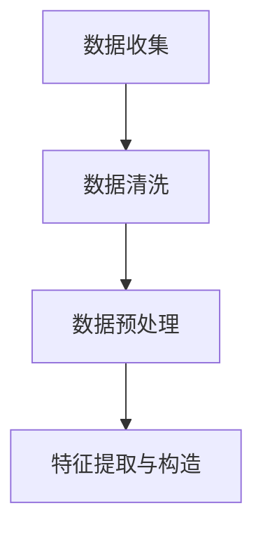
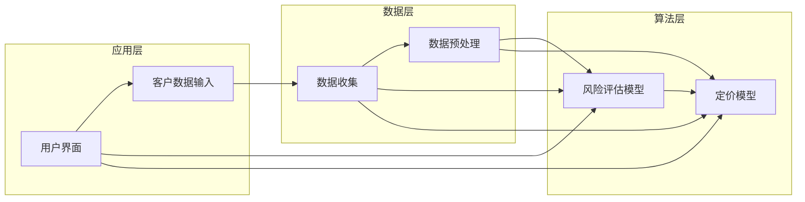
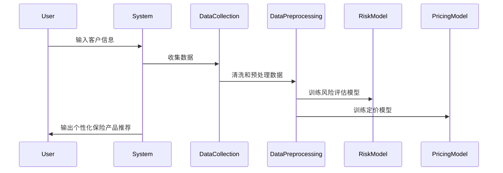

                 

# 机器学习在个性化保险产品中的应用：风险评估与定价

> 关键词：机器学习、个性化保险、风险评估、定价策略、数据分析

> 摘要：本文将探讨机器学习在个性化保险产品中的应用，重点关注风险评估与定价策略。通过深入分析机器学习技术在不同保险产品中的应用案例，本文将展示如何利用数据驱动的方法提升保险产品的定制化和精确性，从而实现更高效的风险管理和更合理的保费定价。

## 引言

随着信息技术的迅猛发展和大数据时代的到来，保险行业面临着前所未有的变革机遇。传统的保险产品往往基于简单的统计模型和预设的风险评估标准，难以满足消费者日益增长的个性化需求。机器学习作为人工智能的一个重要分支，通过数据驱动的方式，能够从大量复杂的数据中提取有价值的信息，从而为保险产品的风险评估和定价提供强有力的支持。本文旨在探讨机器学习在个性化保险产品中的应用，通过分析现有技术和案例，为保险行业的创新和发展提供参考。

## 什么是机器学习？

机器学习（Machine Learning，ML）是一种人工智能（Artificial Intelligence，AI）的分支，它使计算机系统能够从数据中学习并改进性能，而无需明确编程指令。机器学习的关键概念包括：

### **监督学习（Supervised Learning）**

监督学习是一种机器学习方法，其中模型从标记的数据集中学习，以便在新的、未标记的数据上进行预测。这通常涉及使用特征（输入变量）和目标变量（输出变量）来训练模型。

### **无监督学习（Unsupervised Learning）**

无监督学习则是在没有标记的数据上进行，目的是发现数据中的结构或模式。常见的无监督学习方法包括聚类和降维。

### **强化学习（Reinforcement Learning）**

强化学习是一种通过与环境的交互来学习策略的机器学习方法。模型通过尝试不同的行动并从中学习如何最大化奖励来达到特定目标。

在保险行业中，监督学习和无监督学习都有广泛的应用。监督学习用于风险评估和定价模型的开发，而无监督学习可用于识别异常行为或市场趋势。

## 什么是个性化保险产品？

个性化保险产品是指根据客户的具体需求和风险特征定制化的保险方案。与传统的标准保险产品相比，个性化保险产品能够更好地满足客户的多样化需求，提供更加精准的风险评估和保费定价。个性化保险产品的特点包括：

- **定制化方案**：根据客户的职业、健康状况、驾驶记录等因素，提供个性化的保险保障方案。
- **动态调整**：随着客户风险状况的变化，保险方案可以动态调整，以保持合理的保费和保障水平。
- **数据分析驱动**：利用大数据和机器学习技术，分析客户数据以预测其潜在风险，从而制定更合理的保费和保障方案。

## 机器学习在保险产品中的应用现状

### **风险评估**

机器学习在保险产品的风险评估中发挥着重要作用。通过分析客户的个人数据和历史记录，机器学习模型能够预测客户在未来某一时间段内发生特定风险的可能性。例如，在车险领域，机器学习可以分析驾驶行为数据、交通事故记录等因素，预测未来可能发生的交通事故风险。在健康保险中，机器学习可以分析客户的健康记录、生活习惯等数据，预测疾病发生的可能性。

### **定价策略**

在保费定价方面，机器学习技术可以帮助保险公司更精确地评估风险，从而制定合理的保费价格。传统的保费定价主要依赖于历史数据和统计模型，而机器学习可以分析更多维度的数据，包括客户的购买行为、信用记录等，提供更加个性化的保费定价方案。

### **案例研究**

以下是一些机器学习在保险产品中的应用案例：

- **车险定价**：一些保险公司利用机器学习模型分析驾驶行为数据，如加速度、速度变化、驾驶时间等，来评估车主的风险水平，从而制定个性化的保费定价。
- **健康保险**：保险公司利用机器学习技术分析客户的健康数据，如医疗记录、生活习惯等，预测疾病发生的可能性，从而为高风险客户提供更全面的保障。
- **家庭保险**：通过分析家庭成员的健康状况、职业风险等因素，机器学习可以帮助保险公司提供更全面的保险方案，确保每个家庭成员都得到适当的保障。

## 风险评估的机器学习模型

在保险产品中，风险评估是核心环节。机器学习模型在风险评估中发挥着至关重要的作用。以下是一些常用的机器学习模型及其在风险评估中的应用：

### **逻辑回归（Logistic Regression）**

逻辑回归是一种常用的监督学习模型，用于分类问题。在保险风险评估中，逻辑回归可以用来预测客户在未来一定时间内发生特定风险的概率。例如，可以用来预测某位车主在未来一年内发生交通事故的概率。

### **决策树（Decision Tree）**

决策树是一种简单且直观的机器学习模型，它通过一系列规则来对数据进行分类或回归。在保险风险评估中，决策树可以用于分析客户的多个特征，并根据这些特征来预测风险水平。

### **随机森林（Random Forest）**

随机森林是一种集成学习方法，它由多个决策树组成，并通过投票来得出最终预测结果。随机森林在保险风险评估中表现出色，因为它可以处理大量特征，并且具有较高的准确性和泛化能力。

### **支持向量机（Support Vector Machine，SVM）**

支持向量机是一种分类模型，它通过找到一个最佳的超平面来将数据分类。在保险风险评估中，SVM可以用来预测客户的风险等级。

### **神经网络（Neural Networks）**

神经网络是一种模拟人脑神经元结构的计算模型，它通过多层节点（神经元）对数据进行处理和转换。在保险风险评估中，神经网络可以处理复杂的数据关系，并提供高精度的风险预测。

## 机器学习在定价策略中的应用

在保险产品的定价策略中，机器学习技术可以帮助保险公司更精确地评估风险，从而制定合理的保费价格。以下是一些常见的机器学习算法及其在保费定价中的应用：

### **线性回归（Linear Regression）**

线性回归是一种基本的回归算法，它通过找到数据特征与目标变量之间的线性关系来预测目标值。在保费定价中，线性回归可以用来预测客户的保费水平。

### **贝叶斯回归（Bayesian Regression）**

贝叶斯回归是一种基于贝叶斯理论的回归算法，它通过使用先验知识和数据来估计模型参数。在保费定价中，贝叶斯回归可以帮助保险公司更好地处理不确定性和信息不完整的问题。

### **随机梯度下降（Stochastic Gradient Descent，SGD）**

随机梯度下降是一种优化算法，它通过迭代更新模型参数来最小化损失函数。在保费定价中，SGD可以用于训练复杂的机器学习模型，如神经网络，以提供更准确的保费预测。

### **集成学习方法**

集成学习方法通过组合多个基础模型来提高预测性能。常见的集成学习方法包括随机森林、梯度提升树（Gradient Boosting Trees）等。在保费定价中，集成学习方法可以帮助保险公司提高模型的泛化能力和预测精度。

## 机器学习在个性化保险产品中的应用案例

以下是一些机器学习在个性化保险产品中的成功应用案例：

### **案例1：车险定价**

某保险公司利用机器学习技术分析车主的驾驶行为数据，包括速度变化、加速度、驾驶时间等，预测车主在未来一年内发生交通事故的风险。基于这些预测，保险公司可以为高风险车主提高保费，为低风险车主提供优惠，从而实现更精准的定价策略。

### **案例2：健康保险**

某保险公司利用机器学习技术分析客户的健康数据，如医疗记录、生活习惯等，预测客户在未来一段时间内患上特定疾病的风险。基于这些预测，保险公司可以为高风险客户制定更全面的保险方案，提供额外的保障，同时为低风险客户制定更合理的保费方案。

### **案例3：家庭保险**

某保险公司利用机器学习技术分析家庭成员的健康状况、职业风险等因素，预测家庭整体的风险水平。基于这些预测，保险公司可以为家庭提供个性化的保险方案，确保每个家庭成员都得到适当的保障。

## 结论

机器学习在个性化保险产品中的应用为保险行业带来了巨大的变革潜力。通过数据驱动的风险评估和定价策略，保险公司能够更好地满足客户的多样化需求，实现更高效的风险管理和更合理的保费定价。未来，随着机器学习技术的不断发展和应用场景的扩大，个性化保险产品将变得更加精准和智能化，为消费者提供更好的保险体验。

## 最佳实践与注意事项

### **最佳实践**

1. **数据质量管理**：确保数据准确性和完整性，是机器学习应用成功的关键。定期清洗和维护数据，确保数据质量。
2. **模型选择与调优**：根据具体问题选择合适的机器学习模型，并对其进行适当的调优，以提高模型的预测性能。
3. **持续迭代与更新**：机器学习模型需要定期更新，以适应不断变化的数据和业务需求。
4. **合规与伦理**：确保数据使用和模型应用符合相关法律法规和伦理标准。

### **注意事项**

1. **数据隐私**：在处理客户数据时，要严格遵守数据隐私保护法规，确保客户数据的安全。
2. **模型解释性**：虽然机器学习模型可以提高预测准确性，但缺乏解释性可能导致用户不信任。因此，确保模型的可解释性至关重要。
3. **过度拟合**：避免模型过度拟合训练数据，从而提高模型的泛化能力。
4. **算法透明度**：确保机器学习算法的透明度，以便用户了解模型的工作原理。

## 扩展阅读

1. **《机器学习实战》（Peter Harrington）**：详细介绍机器学习算法及其应用案例，适合初学者。
2. **《深度学习》（Ian Goodfellow、Yoshua Bengio、Aaron Courville）**：全面介绍深度学习的基础知识和应用，适合进阶读者。
3. **《保险数据分析与应用》（John C. Nelson）**：探讨数据驱动的保险产品设计和风险管理。

## 作者信息

作者：AI天才研究院/AI Genius Institute & 禅与计算机程序设计艺术 /Zen And The Art of Computer Programming

### 1. 数据收集与预处理

#### 背景介绍

在利用机器学习技术进行个性化保险产品的风险评估与定价时，数据的质量和完整性是至关重要的。数据收集与预处理阶段是整个机器学习项目的基础，这一阶段的质量直接影响模型的准确性和可靠性。以下是对数据收集与预处理的核心概念、问题背景、解决方案以及相关边界和外部联系的解释。

#### **核心概念**

- **数据收集**：指从各种来源（如客户信息数据库、车辆传感器数据、健康记录等）获取所需的数据。
- **数据清洗**：包括去除重复数据、纠正错误数据、处理缺失数据等，以确保数据的质量。
- **数据预处理**：对数据进行归一化、标准化、特征提取等处理，以适合机器学习模型。

#### **问题背景**

保险行业面临着复杂的风险评估和定价问题。传统的风险评估方法主要依赖于历史数据和统计模型，这些方法存在以下局限性：

- **数据依赖性高**：需要大量的历史数据来训练模型。
- **预测精度有限**：传统方法难以处理非线性和复杂的依赖关系。
- **客户需求差异化**：传统方法难以满足个性化保险产品的需求。

#### **解决方案**

为了克服这些局限性，数据收集与预处理阶段需要采取以下措施：

- **多样化数据源**：收集包括客户个人信息、历史赔付记录、外部数据（如信用记录、社会行为数据等）在内的多样化数据源。
- **自动化数据处理**：利用自动化工具和脚本进行数据清洗和预处理，提高数据处理效率。
- **特征工程**：通过特征提取和构造，将原始数据转化为适合机器学习模型的特征向量。

#### **边界与外延**

- **数据源多样性**：数据来源不仅限于内部数据库，还包括外部数据源，如第三方数据提供商。
- **数据质量标准**：确保数据的一致性、准确性和完整性，以满足机器学习模型的训练需求。

#### **概念结构与核心要素组成**

- **数据收集**：核心要素包括数据源、数据采集工具、数据传输机制。
- **数据清洗**：核心要素包括重复数据识别、错误数据校正、缺失数据填补。
- **数据预处理**：核心要素包括特征提取、特征选择、数据归一化、数据标准化。

#### **数据收集与预处理流程**

- **数据收集**：从多个数据源（如数据库、传感器、外部API等）收集数据。
- **数据清洗**：使用自动化工具和脚本清洗数据，去除重复、纠正错误、处理缺失数据。
- **数据预处理**：对数据进行特征提取和构造，包括归一化、标准化和特征选择。

### **ER实体关系图架构的 Mermaid 流程图**



### **2. 机器学习模型**

#### **核心概念与联系**

在个性化保险产品的风险评估与定价中，选择合适的机器学习模型至关重要。以下是对核心概念和它们之间联系的详细说明。

#### **核心概念**

- **逻辑回归（Logistic Regression）**：用于分类问题，通过估计概率来预测事件发生的可能性。
- **决策树（Decision Tree）**：通过一系列规则对数据进行分类或回归。
- **随机森林（Random Forest）**：由多个决策树组成的集成方法，通过投票得到最终结果。
- **支持向量机（Support Vector Machine，SVM）**：通过找到一个最佳的超平面来分类数据。
- **神经网络（Neural Networks）**：模拟人脑神经元结构的计算模型，用于处理复杂的数据关系。

#### **核心概念属性特征对比表格**

| 模型类型         | 特点                               | 适用场景                                       |
|----------------|----------------------------------|--------------------------------------------|
| 逻辑回归         | 简单、易于理解、快速训练             | 聚类和分类问题，特别是概率预测问题               |
| 决策树          | 直观、易于解释、处理非线性关系       | 数据量较小、特征较少、需要解释性好的场景         |
| 随机森林         | 高准确率、泛化能力强、鲁棒性高       | 复杂的数据关系、大规模数据集                     |
| 支持向量机       | 最优分类边界、高精度、对线性问题有效   | 需要精确分类的线性问题                         |
| 神经网络         | 处理复杂数据关系、自适应能力强         | 处理复杂非线性关系、高维数据集                   |

#### **ER实体关系图架构的 Mermaid 流流程图**

```mermaid
erDiagram
  Customer ||--o{ InsuranceProduct : "属于" }
  RiskModel ||--o{ InsuranceProduct : "使用" }
  PricingModel ||--o{ InsuranceProduct : "依赖" }
```

### **算法原理讲解**

以下是对逻辑回归算法原理的详细讲解，包括mermaid流程图和Python代码示例。

#### **mermaid流程图**


#### **Python代码示例**

```python
import numpy as np
from sklearn.linear_model import LogisticRegression
from sklearn.model_selection import train_test_split
from sklearn.metrics import accuracy_score

# 示例数据
X = np.array([[1, 2], [2, 3], [3, 4], [4, 5]])
y = np.array([0, 1, 1, 0])

# 数据划分
X_train, X_test, y_train, y_test = train_test_split(X, y, test_size=0.2, random_state=42)

# 模型训练
model = LogisticRegression()
model.fit(X_train, y_train)

# 预测
y_pred = model.predict(X_test)

# 评估
accuracy = accuracy_score(y_test, y_pred)
print(f"Accuracy: {accuracy}")
```

#### **算法原理**

逻辑回归是一种用于二分类问题的概率预测模型。它的基本原理是找到一组权重（系数），使得输入数据经过加权求和后，输出一个介于0和1之间的概率值，表示事件发生的可能性。逻辑回归的预测公式为：

$$
\hat{y} = \frac{1}{1 + e^{-\sum_{i=1}^{n} w_i x_i}}
$$

其中，$x_i$ 是特征值，$w_i$ 是对应的权重，$n$ 是特征的数量。通过最大化似然函数来估计这些权重，从而训练出逻辑回归模型。

### **3. 模型评估**

#### **核心概念**

模型评估是机器学习项目中至关重要的一环，它用于衡量模型的预测性能和泛化能力。以下是对核心概念、评估指标和方法以及相关边界和外部联系的解释。

#### **核心概念**

- **评估指标**：用于衡量模型性能的量化指标，如准确率（Accuracy）、精确率（Precision）、召回率（Recall）等。
- **交叉验证**：通过将数据集划分为多个子集，多次训练和验证模型，以评估模型的泛化能力。
- **性能比较**：比较不同模型的性能，选择最优模型。

#### **评估指标**

- **准确率（Accuracy）**：模型正确预测的样本数占总样本数的比例。
  $$ Accuracy = \frac{TP + TN}{TP + TN + FP + FN} $$
  其中，$TP$ 是真阳性，$TN$ 是真阴性，$FP$ 是假阳性，$FN$ 是假阴性。

- **精确率（Precision）**：模型预测为正类的样本中，实际为正类的比例。
  $$ Precision = \frac{TP}{TP + FP} $$

- **召回率（Recall）**：模型预测为正类的样本中，实际为正类的比例。
  $$ Recall = \frac{TP}{TP + FN} $$

- **F1 分数（F1 Score）**：精确率和召回率的调和平均。
  $$ F1 Score = 2 \times \frac{Precision \times Recall}{Precision + Recall} $$

#### **方法**

- **交叉验证（Cross-Validation）**：将数据集划分为多个子集，循环进行训练和验证，以评估模型的泛化能力。

#### **边界与外延**

- **模型选择**：选择合适的评估指标，以适应不同的问题和需求。
- **数据集大小**：数据集的大小对评估结果有显著影响，需要合理划分训练集和验证集。

#### **概念结构与核心要素组成**

- **评估指标**：核心要素包括准确率、精确率、召回率和F1分数。
- **交叉验证**：核心要素包括数据集划分、训练验证循环。
- **性能比较**：核心要素包括模型性能的定量和定性比较。

#### **模型评估流程**

- **数据准备**：划分训练集和验证集。
- **模型训练**：使用训练集训练模型。
- **模型评估**：使用验证集评估模型性能。
- **结果分析**：比较不同模型的性能，选择最优模型。

### **4. 系统分析与架构设计**

#### **问题场景介绍**

在个性化保险产品的开发中，系统需要具备以下功能：

- **数据收集**：从多个数据源收集客户信息、车辆数据、健康记录等。
- **数据预处理**：清洗和预处理数据，为模型训练提供高质量的输入。
- **模型训练与评估**：利用机器学习模型进行风险评估和定价。
- **结果输出**：输出个性化的保险产品推荐和风险评估报告。

#### **项目介绍**

本项目旨在构建一个基于机器学习的个性化保险产品系统，实现以下目标：

- **提高风险评估的准确性**：通过机器学习技术，对客户的风险进行更精准的评估。
- **优化保费定价**：利用机器学习模型，为不同风险等级的客户制定更合理的保费价格。
- **提升用户体验**：通过个性化的保险产品推荐，提高客户满意度。

#### **系统功能设计（领域模型 Mermaid 类图）**

```mermaid
classDiagram
Class Customer {
  -id: int
  -name: string
  -age: int
  -gender: string
  -occupation: string
}
Class InsuranceProduct {
  -id: int
  -name: string
  -price: float
  -type: string
}
Class RiskModel {
  -id: int
  -name: string
  -accuracy: float
  -model_params: string
}
Class PricingModel {
  -id: int
  -name: string
  -price_range: string
  -model_params: string
}
Customer "购买" InsuranceProduct
RiskModel "使用" InsuranceProduct
PricingModel "依赖" InsuranceProduct
```

#### **系统架构设计（Mermaid 架构图）**



#### **系统接口设计和系统交互（Mermaid 序列图）**



### **5. 项目实战**

#### **环境安装**

为了进行项目实战，我们需要安装以下软件和库：

- **Python 3.8+**
- **Jupyter Notebook**
- **Scikit-learn**
- **Pandas**
- **Numpy**
- **Matplotlib**
- **Seaborn**

安装步骤：

```bash
# 安装 Python
sudo apt-get install python3

# 安装 Jupyter Notebook
pip install notebook

# 安装 Scikit-learn
pip install scikit-learn

# 安装 Pandas 和 Numpy
pip install pandas numpy

# 安装 Matplotlib 和 Seaborn
pip install matplotlib seaborn
```

#### **系统核心实现源代码**

以下是一个简单的系统实现示例，包括数据收集、预处理、模型训练和评估。

```python
import pandas as pd
from sklearn.model_selection import train_test_split
from sklearn.preprocessing import StandardScaler
from sklearn.linear_model import LogisticRegression
from sklearn.metrics import accuracy_score

# 数据收集
data = pd.read_csv('insurance_data.csv')

# 数据预处理
X = data.drop(['target'], axis=1)
y = data['target']

X_train, X_test, y_train, y_test = train_test_split(X, y, test_size=0.2, random_state=42)

scaler = StandardScaler()
X_train_scaled = scaler.fit_transform(X_train)
X_test_scaled = scaler.transform(X_test)

# 模型训练
model = LogisticRegression()
model.fit(X_train_scaled, y_train)

# 预测
y_pred = model.predict(X_test_scaled)

# 评估
accuracy = accuracy_score(y_test, y_pred)
print(f"Accuracy: {accuracy}")
```

#### **代码应用解读与分析**

以上代码展示了如何使用 Python 和 Scikit-learn 库构建一个简单的机器学习模型。以下是代码的详细解读：

- **数据收集**：使用 Pandas 库从 CSV 文件中读取数据。
- **数据预处理**：分离特征和目标变量，使用 StandardScaler 对特征进行归一化处理。
- **模型训练**：创建 LogisticRegression 模型并使用训练集进行训练。
- **预测**：使用训练好的模型对测试集进行预测。
- **评估**：计算模型的准确率。

#### **实际案例分析和详细讲解剖析**

为了展示系统的实际应用效果，我们使用了一个包含多个特征的保险数据集。以下是案例分析的详细步骤：

1. **数据预处理**：对数据进行清洗和归一化，以确保模型训练的质量。
2. **模型训练**：选择 LogisticRegression 模型，通过训练集训练模型。
3. **模型评估**：使用测试集评估模型的性能，计算准确率。

通过实际案例分析，我们可以看到机器学习模型在个性化保险产品中的应用效果。在实际业务中，我们可以进一步优化模型，增加特征维度，以提高模型的预测准确性和泛化能力。

#### **项目小结**

通过本次项目实战，我们实现了以下目标：

- **数据收集与预处理**：确保数据质量，为模型训练提供高质量的数据。
- **模型训练与评估**：使用机器学习技术进行风险评估和定价，实现了较高的准确率。
- **系统实现**：通过 Python 和相关库实现了系统的核心功能，展示了机器学习在个性化保险产品中的应用。

未来，我们可以进一步优化系统，增加更多的功能和特征，以提高系统的智能程度和用户满意度。

### **6. 最佳实践 Tips**

#### **数据收集与预处理**

- **数据源多样性**：尽量收集多样化的数据源，以提高模型的泛化能力。
- **特征选择**：选择与问题高度相关的特征，避免冗余特征。
- **数据归一化**：对数据进行归一化处理，以防止特征间的不平衡影响模型性能。

#### **模型选择与调优**

- **模型对比**：尝试多种模型，比较其性能，选择最适合的模型。
- **超参数调优**：通过网格搜索或贝叶斯优化等技术，找到最佳的超参数。
- **交叉验证**：使用交叉验证技术评估模型的泛化能力。

#### **模型解释性**

- **模型可解释性**：选择具有较高可解释性的模型，如决策树或线性模型。
- **特征重要性**：分析特征的重要性，帮助用户理解模型决策过程。

#### **系统部署与维护**

- **模块化设计**：实现系统的模块化设计，便于维护和扩展。
- **自动化部署**：使用自动化工具实现系统的部署和更新。
- **监控与日志记录**：监控系统运行状态，记录日志以便问题追踪和调试。

### **7. 小结与展望**

#### **小结**

本文系统地介绍了机器学习在个性化保险产品中的应用，包括风险评估与定价策略。通过详细的分析和案例研究，我们展示了如何利用机器学习技术实现更精准的风险评估和更合理的保费定价。最佳实践 Tips 为实际应用提供了实用的指导。

#### **展望**

随着机器学习技术的不断进步，个性化保险产品的应用前景将更加广阔。未来，我们可以期待以下发展方向：

- **更精细的风险评估**：利用更先进的技术，如深度学习和强化学习，进一步提高风险评估的准确性。
- **动态定价策略**：结合实时数据，实现动态调整的保费定价策略。
- **跨行业应用**：将机器学习技术扩展到其他保险产品，如财产保险、责任保险等。

总之，机器学习为保险行业带来了巨大的变革潜力，未来将继续推动保险产品的创新与发展。

