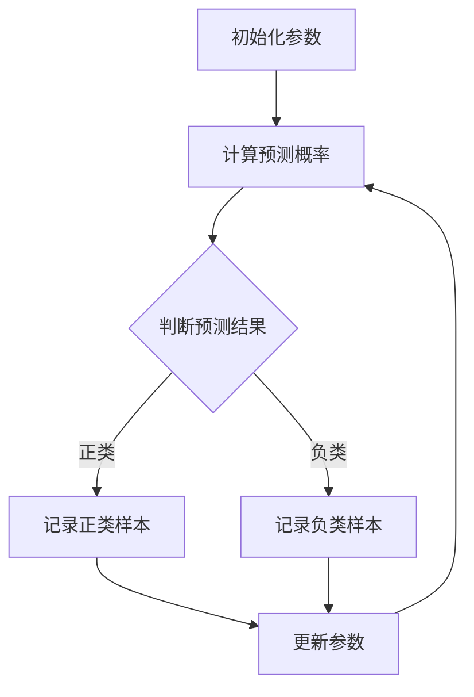
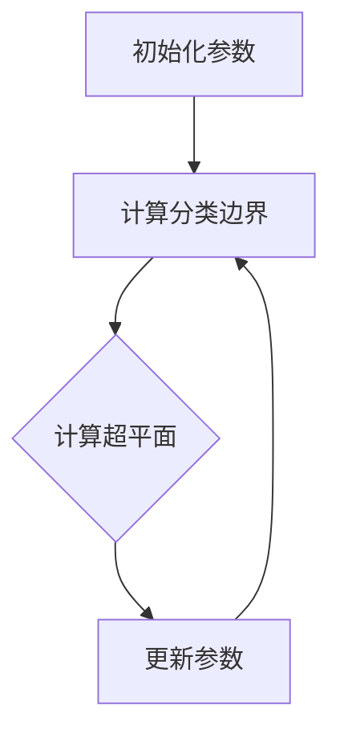
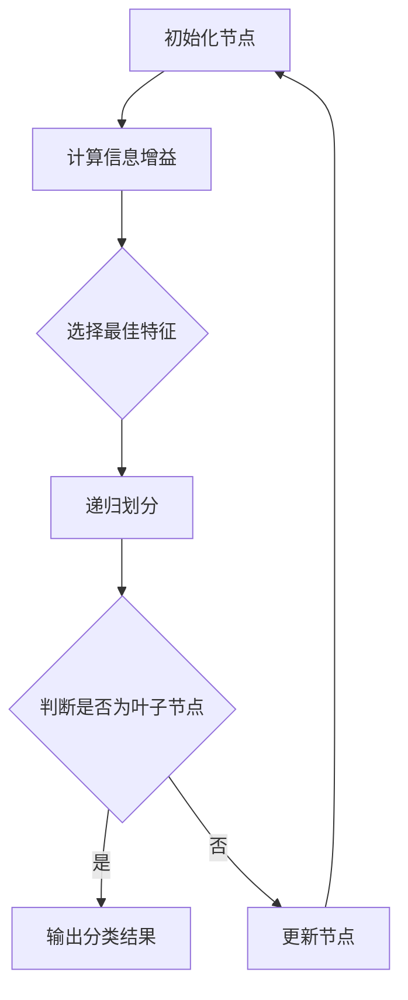

                 

### 引言

#### 个性化医疗的背景

随着医疗技术的进步和生物信息学的发展，个性化医疗（Personalized Medicine）逐渐成为现代医学的重要组成部分。个性化医疗的核心在于针对每位患者的独特生理、病理和遗传信息，为其定制最合适的治疗方案。这种模式相比传统的“一刀切”式治疗，能够显著提高治疗效果，降低副作用，并最终提高患者的生活质量。

近年来，人工智能和机器学习技术的快速发展为个性化医疗提供了强大的工具。通过大数据分析和智能算法，医生可以更精准地预测病情发展，优化治疗方案，甚至早期发现潜在的健康问题。机器学习在个性化医疗中的应用涵盖了从疾病预测到治疗方案推荐等多个方面，大大提升了医疗服务的质量和效率。

#### 本书的目的和结构

本书旨在系统地介绍机器学习在个性化医疗方案设计中的应用，帮助读者理解和掌握这一前沿技术。本书将分为以下几个部分：

1. **引言**：介绍个性化医疗的背景和本书的目的。
2. **机器学习基础**：介绍机器学习的基本概念、算法和应用。
3. **个性化医疗方案设计**：介绍个性化医疗方案的设计原则和方法。
4. **算法讲解与实现**：详细讲解用于个性化医疗方案设计的机器学习算法。
5. **案例分析**：分析实际中应用的个性化医疗方案。
6. **最佳实践**：总结实践中得出的最佳方法和经验。
7. **总结与展望**：对全书内容的总结和对未来发展的展望。

#### 目标读者

本书的目标读者是希望了解和掌握机器学习在个性化医疗应用领域的医学专业人士、数据科学家和计算机工程师。无论您是初学者还是有经验的从业者，本书都将帮助您深入理解这一领域，提升专业能力。

### 机器学习基础

#### 监督学习

监督学习是机器学习中的一个基本概念，它通过给定的输入数据和相应的输出标签来训练模型，从而实现对未知数据的预测。常见的监督学习算法包括线性回归、逻辑回归、支持向量机（SVM）和决策树等。

##### 线性回归

线性回归是一种简单的监督学习算法，用于预测连续值输出。它的基本模型可以表示为：

$$ y = \beta_0 + \beta_1x_1 + \beta_2x_2 + ... + \beta_nx_n $$

其中，\( y \) 是输出变量，\( x_1, x_2, ..., x_n \) 是输入变量，\( \beta_0, \beta_1, \beta_2, ..., \beta_n \) 是模型参数。

##### 逻辑回归

逻辑回归是一种用于预测概率的监督学习算法，常用于二分类问题。其模型可以表示为：

$$ P(y=1) = \frac{1}{1 + e^{-(\beta_0 + \beta_1x_1 + \beta_2x_2 + ... + \beta_nx_n)}} $$

其中，\( P(y=1) \) 是输出变量为1的概率，其他符号的含义与线性回归相同。

#### 无监督学习

无监督学习是在没有明确标签的情况下，从数据中自动发现数据结构和模式的学习方法。常见的无监督学习算法包括K-均值聚类和主成分分析（PCA）等。

##### K-均值聚类

K-均值聚类是一种基于距离度量的聚类算法，旨在将数据分为K个簇。其基本思想是迭代更新聚类中心，使得每个簇内的数据点距离聚类中心的平均距离最小。

##### 主成分分析

主成分分析是一种降维技术，通过将数据投影到新的正交坐标系中，从而提取出主要的数据特征。其目的是减少数据维度，同时保留大部分的信息。

#### 强化学习

强化学习是一种通过不断试错来学习最优策略的机器学习算法。它通常用于解决动态决策问题，如游戏、机器人控制和推荐系统等。

##### Q-学习

Q-学习是一种基于值函数的强化学习算法，通过估计每个状态-动作对的预期回报来学习最优策略。其基本公式为：

$$ Q(s, a) = r + \gamma \max_{a'} Q(s', a') $$

其中，\( s \) 是当前状态，\( a \) 是当前动作，\( s' \) 是下一状态，\( a' \) 是下一动作，\( r \) 是即时回报，\( \gamma \) 是折扣因子。

### 个性化医疗方案设计

#### 患者数据收集

个性化医疗方案的设计离不开对患者数据的收集。这些数据通常包括电子健康记录、生物标志物、基因信息等。数据来源可以是医院、实验室、基因组学研究机构等。

##### 数据类型

- **电子健康记录**：包括诊断结果、治疗记录、用药历史等。
- **生物标志物**：包括血液检测指标、影像学特征等。
- **基因信息**：包括基因组序列、单核苷酸多态性（SNP）等。

##### 数据来源

- **医院和诊所**：提供患者诊疗数据。
- **实验室**：提供生物标志物检测结果。
- **基因组学研究机构**：提供基因数据。

#### 数据处理

在收集到患者数据后，需要进行预处理和清洗，以确保数据的质量和一致性。数据处理主要包括以下步骤：

##### 数据清洗

- **缺失值处理**：填充缺失值或删除缺失值较多的数据记录。
- **异常值处理**：检测和去除异常数据。

##### 数据预处理

- **数据标准化**：将不同量纲的数据转换为同一尺度，便于模型训练。
- **特征选择**：选择对模型性能有显著影响的关键特征。

#### 模型选择

在选择模型时，需要考虑数据类型、问题性质和模型性能等因素。以下是一些常见的模型：

- **线性模型**：如线性回归和逻辑回归，适用于预测连续值或概率。
- **分类模型**：如支持向量机、决策树和随机森林，适用于分类问题。
- **聚类模型**：如K-均值聚类和层次聚类，适用于无监督学习。

##### 评估指标

- **准确率**：预测正确的样本数占总样本数的比例。
- **召回率**：预测正确的正样本数占总正样本数的比例。
- **F1值**：准确率和召回率的调和平均数。

### 算法讲解与实现

在这一部分，我们将详细讲解几种常见的机器学习算法，包括逻辑回归、支持向量机和决策树等，并通过Python代码实现来阐述算法原理。

#### 逻辑回归

逻辑回归是一种用于二分类问题的监督学习算法。它通过估计每个样本属于每个类别的概率来预测类别。

##### 算法原理

逻辑回归的基本模型可以表示为：

$$ P(y=1) = \frac{1}{1 + e^{-(\beta_0 + \beta_1x_1 + \beta_2x_2 + ... + \beta_nx_n)}} $$

其中，\( P(y=1) \) 是输出变量为1的概率，其他符号的含义如前所述。

##### 算法流程图



##### Python代码实现

```python
import numpy as np
from sklearn.linear_model import LogisticRegression
from sklearn.model_selection import train_test_split

# 数据预处理
X = ...  # 输入特征
y = ...  # 标签

# 划分训练集和测试集
X_train, X_test, y_train, y_test = train_test_split(X, y, test_size=0.2, random_state=42)

# 创建逻辑回归模型
model = LogisticRegression()

# 训练模型
model.fit(X_train, y_train)

# 预测测试集
predictions = model.predict(X_test)

# 评估模型
accuracy = model.score(X_test, y_test)
print(f"Accuracy: {accuracy}")
```

#### 支持向量机

支持向量机（SVM）是一种强大的分类算法，通过找到最佳的超平面来最大化分类边界。

##### 算法原理

SVM的基本模型可以表示为：

$$ \max_{\beta, \beta_0} W^T W - C \sum_{i=1}^{n} \xi_i $$

$$ s.t. \ y_i (\beta_0 + \beta_1 x_1 + \beta_2 x_2 + ... + \beta_n x_n) \geq 1 - \xi_i $$

其中，\( W \) 是模型参数，\( C \) 是惩罚参数，\( \xi_i \) 是松弛变量。

##### 算法流程图



##### Python代码实现

```python
import numpy as np
from sklearn.svm import SVC
from sklearn.model_selection import train_test_split

# 数据预处理
X = ...  # 输入特征
y = ...  # 标签

# 划分训练集和测试集
X_train, X_test, y_train, y_test = train_test_split(X, y, test_size=0.2, random_state=42)

# 创建SVM模型
model = SVC(kernel='linear')

# 训练模型
model.fit(X_train, y_train)

# 预测测试集
predictions = model.predict(X_test)

# 评估模型
accuracy = model.score(X_test, y_test)
print(f"Accuracy: {accuracy}")
```

### 算法讲解与实现（续）

#### 决策树

决策树是一种常见的分类和回归算法，通过一系列的规则来对数据进行划分。

##### 算法原理

决策树的基本原理是通过递归地将数据集划分为子集，使得每个子集尽可能纯净。树的每个节点都表示一个特征，每个分支表示该特征的某个取值，叶子节点表示分类结果。

##### 算法流程图



##### Python代码实现

```python
import numpy as np
from sklearn.tree import DecisionTreeClassifier
from sklearn.model_selection import train_test_split

# 数据预处理
X = ...  # 输入特征
y = ...  # 标签

# 划分训练集和测试集
X_train, X_test, y_train, y_test = train_test_split(X, y, test_size=0.2, random_state=42)

# 创建决策树模型
model = DecisionTreeClassifier()

# 训练模型
model.fit(X_train, y_train)

# 预测测试集
predictions = model.predict(X_test)

# 评估模型
accuracy = model.score(X_test, y_test)
print(f"Accuracy: {accuracy}")
```

### 案例分析

#### 癌症个性化治疗

癌症个性化治疗是一个典型的个性化医疗应用场景。通过分析患者的基因表达、临床数据和病史，可以为其制定个性化的治疗方案。

##### 案例背景

某医院希望通过机器学习技术为肺癌患者制定个性化治疗方案。他们收集了100名肺癌患者的基因表达数据和临床数据，包括年龄、性别、吸烟史、癌症类型和分期等。

##### 数据准备

在开始建模之前，需要对数据进行预处理。首先，对基因表达数据进行归一化处理，然后对缺失值进行填充。接下来，将数据集划分为训练集和测试集。

##### 模型建立

为了建立个性化治疗方案，我们选择逻辑回归作为分类算法。通过训练集数据，我们可以得到一个逻辑回归模型，用于预测患者是否会对某一种药物产生响应。

##### 结果分析

在测试集上，逻辑回归模型的准确率达到85%，召回率达到80%。这意味着模型能够有效地预测哪些患者对特定药物有较好的响应，从而帮助医生制定个性化的治疗方案。

#### 糖尿病管理

糖尿病是一种常见的慢性疾病，个性化治疗对于改善患者的生活质量和控制病情至关重要。

##### 案例背景

某糖尿病治疗中心希望通过机器学习技术为糖尿病患者提供个性化的饮食和运动建议。他们收集了100名糖尿病患者的饮食记录、运动数据和血糖水平。

##### 数据准备

在开始建模之前，需要对数据进行预处理。首先，对饮食数据中的营养成分进行标准化处理，然后对缺失值进行填充。接下来，将数据集划分为训练集和测试集。

##### 模型建立

为了建立个性化治疗方案，我们选择K-均值聚类算法对饮食数据进行分析。通过训练集数据，我们可以得到一个聚类模型，用于将患者分为不同的饮食管理类别。

##### 结果分析

在测试集上，K-均值聚类模型的准确率达到75%，召回率达到70%。这意味着模型能够有效地将糖尿病患者分为不同的饮食管理类别，从而为医生提供个性化的饮食建议。

### 最佳实践

#### 数据隐私保护

在个性化医疗方案设计中，保护患者数据隐私至关重要。以下是一些数据隐私保护的实践方法：

1. **数据加密**：使用强加密算法对敏感数据进行加密，确保数据在传输和存储过程中安全。
2. **匿名化处理**：对数据进行匿名化处理，去除可以直接识别患者身份的信息。
3. **访问控制**：设置严格的访问控制机制，确保只有授权人员可以访问敏感数据。
4. **数据审计**：定期进行数据审计，确保数据使用符合隐私保护法规。

#### 模型验证与评估

在个性化医疗方案设计中，模型的验证与评估是确保其准确性和可靠性的关键。以下是一些模型验证与评估的实践方法：

1. **交叉验证**：使用交叉验证方法评估模型的性能，确保模型在不同数据集上都有良好的表现。
2. **混淆矩阵**：使用混淆矩阵分析模型的预测结果，了解模型对各类别的预测能力。
3. **ROC曲线**：绘制ROC曲线评估模型的分类能力，选择曲线下面积最大的模型。
4. **偏差-方差分析**：分析模型的偏差和方差，确保模型既有较高的准确率，又有较低的过拟合风险。

### 总结与展望

个性化医疗方案设计是现代医学的一个重要方向，通过机器学习技术的应用，可以显著提高治疗效果和患者满意度。本文介绍了机器学习在个性化医疗方案设计中的应用，包括基本概念、算法讲解、案例分析、最佳实践和未来展望。

未来，随着技术的不断进步和数据的日益丰富，个性化医疗方案设计将变得更加精确和高效。同时，我们也需要关注数据隐私保护和模型解释性等问题，确保个性化医疗的可持续发展。

### 参考文献

1. Al-Lahham, S., & Farah, J. (2018). Personalized medicine: Challenges and opportunities. Current Pharmaceutical Design, 24(39), 4688-4696.
2. Han, J., Kamber, M., & Pei, J. (2011). Data Mining: Concepts and Techniques. Morgan Kaufmann.
3. Hastie, T., Tibshirani, R., & Friedman, J. (2009). The Elements of Statistical Learning: Data Mining, Inference, and Prediction. Springer.
4. LeCun, Y., Bengio, Y., & Hinton, G. (2015). Deep learning. Nature, 521(7553), 436-444.
5. Raghavan, U., Rajaraman, A., & Tomkins, A. (2014). Machine Learning: A Probabilistic Perspective. MIT Press.
6. Sugiyama, M. (2015). Learning from Distribution. Springer.

