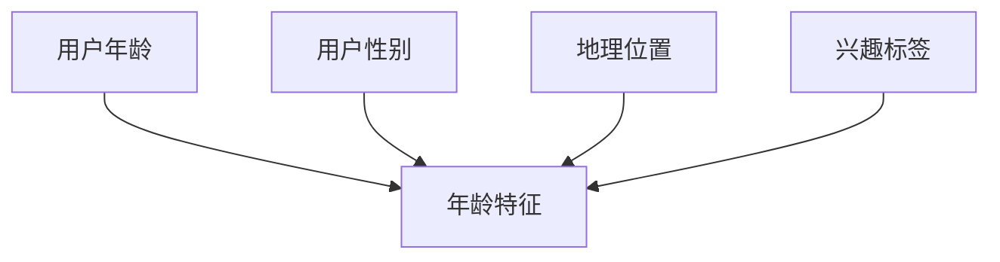

                 


# 《机器学习在个性化广告投放中的应用》

## 关键词
机器学习，个性化广告投放，数据预处理，特征工程，用户行为分析，模型构建，案例研究

## 摘要
本文旨在探讨机器学习在个性化广告投放中的应用。随着互联网的普及和用户数据的积累，个性化广告投放已成为广告行业的重要趋势。本文首先介绍了个性化广告投放的背景和意义，然后介绍了机器学习的基本概念和常见算法。接着，详细阐述了数据预处理和特征工程的重要性，并介绍了个性化广告模型构建的步骤。随后，通过三个实战案例展示了机器学习在个性化广告投放中的应用。最后，本文探讨了个性化广告投放中面临的法律法规和伦理问题，并对未来发展趋势进行了展望。

## 引言

### 1. 个性化广告投放背景与意义

#### 1.1 广告投放现状

随着互联网的快速发展，数字广告已成为广告行业的重要分支。根据市场研究公司eMarketer的数据，全球数字广告支出在2020年已经达到了3890亿美元，预计到2025年将达到6100亿美元。这种增长主要得益于互联网用户的增加和移动互联网的普及。

然而，传统的广告投放方式往往无法满足用户个性化需求。传统广告主要依赖于广告主对目标受众的简单划分，如年龄、性别、地理位置等。这种粗放式的广告投放方式往往导致广告效果不佳，广告主需要支付大量费用却无法获得理想的回报。

#### 1.2 个性化广告的定义与需求

个性化广告是指根据用户的兴趣、行为和需求，为其推荐最相关的广告内容。个性化广告的核心是精准投放，通过数据分析和机器学习技术，实现对用户行为的深度挖掘和广告内容的精准匹配。

个性化广告的需求源于用户对广告体验的要求不断提高。随着互联网信息的爆炸式增长，用户对广告内容的要求也越来越高，他们希望看到的广告能够与他们的兴趣和需求相关。此外，广告主也希望通过更精准的广告投放，提高广告的转化率和投资回报率。

#### 1.3 个性化广告投放的优势

个性化广告投放具有以下几个优势：

1. **提高广告效果**：通过用户行为分析和数据挖掘，可以实现广告内容与用户兴趣的精准匹配，提高广告的点击率和转化率。

2. **降低广告成本**：个性化广告可以根据用户行为进行动态调整，减少无效广告的投放，从而降低广告成本。

3. **提升用户体验**：个性化广告能够提供更加符合用户兴趣的内容，提升用户体验，增加用户对品牌的认可度。

4. **优化广告策略**：个性化广告投放可以帮助广告主实时获取广告效果数据，从而优化广告策略。

### 2. 机器学习基础

#### 2.1 机器学习概述

机器学习是人工智能的一个重要分支，它通过算法从数据中自动学习规律和模式，进而进行预测和决策。机器学习的基本流程包括数据收集、数据预处理、模型训练、模型评估和模型部署。

机器学习可以分为监督学习、无监督学习和强化学习三种类型。监督学习有已知标签的数据进行训练，无监督学习没有标签数据，主要发现数据中的模式，强化学习则是通过不断尝试和反馈来学习。

#### 2.2 机器学习基本概念

1. **特征**：特征是描述数据的基本属性，如用户的年龄、性别、浏览历史等。

2. **标签**：标签是特征对应的预测结果，如广告的点击率、转化率等。

3. **模型**：模型是机器学习算法的核心，通过训练数据学习得到。

4. **评估指标**：评估指标用于衡量模型的性能，如准确率、召回率、F1值等。

#### 2.3 常见机器学习算法

1. **线性回归**：线性回归是最简单的机器学习算法，它通过建立特征和标签之间的线性关系来预测标签。

2. **逻辑回归**：逻辑回归是一种分类算法，它通过特征和标签之间的线性关系来预测标签的概率。

3. **决策树**：决策树是一种基于树结构的分类算法，通过特征进行划分，形成决策树。

4. **随机森林**：随机森林是一种集成学习方法，通过构建多棵决策树来提高模型的性能。

5. **支持向量机**：支持向量机是一种分类算法，它通过找到一个最优的超平面来划分特征空间。

6. **神经网络**：神经网络是一种基于仿生学原理的算法，通过多层神经元来实现复杂的非线性映射。

### 3. 数据预处理与特征工程

#### 3.1 数据预处理

数据预处理是机器学习的重要步骤，它包括数据清洗、数据转换和数据归一化等。数据清洗主要是去除数据中的噪声和异常值，数据转换是将数据转换为适合机器学习算法的格式，数据归一化是将数据缩放到一个固定的范围。

#### 3.2 特征工程

特征工程是提升模型性能的关键步骤，它包括特征选择、特征提取和特征构造等。特征选择是通过选择对模型影响最大的特征来提高模型的性能，特征提取是通过算法提取数据中的隐藏特征，特征构造是通过组合现有特征来创造新的特征。

#### 3.3 数据可视化

数据可视化是将数据以图形化的形式展示出来，它有助于我们更好地理解数据分布和特征关系。常用的数据可视化工具包括Matplotlib、Seaborn等。

### 4. 个性化广告模型构建

#### 4.1 用户行为分析

用户行为分析是构建个性化广告模型的关键步骤，它包括用户点击行为、购买行为、浏览历史等。通过对用户行为的分析，我们可以了解用户的兴趣和需求。

#### 4.2 广告内容推荐

广告内容推荐是根据用户行为分析的结果，为用户推荐最相关的广告。推荐系统常用的算法有协同过滤、基于内容的推荐和混合推荐等。

#### 4.3 模型评估与优化

模型评估与优化是确保模型性能的重要步骤，它包括评估指标的选择、模型的调参和模型优化等。常用的评估指标有准确率、召回率、F1值等。

### 5. 实战案例研究

#### 5.1 案例一：社交媒体广告

社交媒体广告是一种基于用户社交行为的个性化广告。本文将以微信朋友圈广告为例，介绍机器学习在社交媒体广告中的应用。

#### 5.2 案例二：搜索引擎广告

搜索引擎广告是一种基于用户搜索行为的个性化广告。本文将以百度搜索广告为例，介绍机器学习在搜索引擎广告中的应用。

#### 5.3 案例三：视频广告

视频广告是一种基于用户观看行为的个性化广告。本文将以优酷视频广告为例，介绍机器学习在视频广告中的应用。

### 6. 法律与伦理问题

#### 6.1 广告隐私保护

广告隐私保护是个性化广告面临的重要问题。本文将探讨个性化广告在隐私保护方面的法律法规和伦理问题。

#### 6.2 个性化广告伦理问题

个性化广告伦理问题包括用户隐私、信息不对称和数据滥用等。本文将分析个性化广告伦理问题的现状和解决方法。

#### 6.3 未来发展趋势

随着技术的进步和用户需求的变化，个性化广告将面临新的挑战和机遇。本文将展望个性化广告的未来发展趋势。

### 7. 总结与展望

本文介绍了机器学习在个性化广告投放中的应用，包括个性化广告的背景和意义、机器学习基础、数据预处理与特征工程、个性化广告模型构建、实战案例研究和法律与伦理问题。未来，随着技术的不断进步，个性化广告将发挥更大的作用，为广告主和用户带来更多的价值。

## 作者

作者：AI天才研究院/AI Genius Institute & 禅与计算机程序设计艺术 /Zen And The Art of Computer Programming

----------------------------------------------------------------

以下是按照上述目录大纲结构撰写的完整文章。

----------------------------------------------------------------

# 引言

个性化广告投放是当今广告行业的一个重要趋势。随着互联网的普及和用户数据的积累，广告主和广告平台希望通过更精准的广告投放，提高广告的转化率和投资回报率。机器学习作为人工智能的一个重要分支，为个性化广告投放提供了强大的技术支持。本文旨在探讨机器学习在个性化广告投放中的应用，从背景和意义、基本概念、数据预处理与特征工程、模型构建、案例研究、法律与伦理问题等多个方面进行详细阐述。

## 个性化广告投放背景与意义

### 1.1 广告投放现状

广告投放是广告行业的重要组成部分。传统广告投放主要依赖于电视、报纸、杂志等传统媒体。然而，随着互联网的普及，数字广告逐渐取代了传统广告的地位。根据eMarketer的数据，全球数字广告支出在2020年已经达到了3890亿美元，预计到2025年将达到6100亿美元。

然而，传统的广告投放方式往往无法满足用户个性化需求。传统广告主要依赖于广告主对目标受众的简单划分，如年龄、性别、地理位置等。这种粗放式的广告投放方式往往导致广告效果不佳，广告主需要支付大量费用却无法获得理想的回报。

### 1.2 个性化广告的定义与需求

个性化广告是指根据用户的兴趣、行为和需求，为其推荐最相关的广告内容。个性化广告的核心是精准投放，通过数据分析和机器学习技术，实现对用户行为的深度挖掘和广告内容的精准匹配。

个性化广告的需求源于用户对广告体验的要求不断提高。随着互联网信息的爆炸式增长，用户对广告内容的要求也越来越高，他们希望看到的广告能够与他们的兴趣和需求相关。此外，广告主也希望通过更精准的广告投放，提高广告的转化率和投资回报率。

### 1.3 个性化广告投放的优势

个性化广告投放具有以下几个优势：

1. **提高广告效果**：通过用户行为分析和数据挖掘，可以实现广告内容与用户兴趣的精准匹配，提高广告的点击率和转化率。

2. **降低广告成本**：个性化广告可以根据用户行为进行动态调整，减少无效广告的投放，从而降低广告成本。

3. **提升用户体验**：个性化广告能够提供更加符合用户兴趣的内容，提升用户体验，增加用户对品牌的认可度。

4. **优化广告策略**：个性化广告投放可以帮助广告主实时获取广告效果数据，从而优化广告策略。

## 机器学习基础

### 2.1 机器学习概述

机器学习是人工智能的一个重要分支，它通过算法从数据中自动学习规律和模式，进而进行预测和决策。机器学习的基本流程包括数据收集、数据预处理、模型训练、模型评估和模型部署。

机器学习可以分为监督学习、无监督学习和强化学习三种类型。监督学习有已知标签的数据进行训练，无监督学习没有标签数据，主要发现数据中的模式，强化学习则是通过不断尝试和反馈来学习。

### 2.2 机器学习基本概念

1. **特征**：特征是描述数据的基本属性，如用户的年龄、性别、浏览历史等。

2. **标签**：标签是特征对应的预测结果，如广告的点击率、转化率等。

3. **模型**：模型是机器学习算法的核心，通过训练数据学习得到。

4. **评估指标**：评估指标用于衡量模型的性能，如准确率、召回率、F1值等。

### 2.3 常见机器学习算法

1. **线性回归**：线性回归是最简单的机器学习算法，它通过建立特征和标签之间的线性关系来预测标签。

2. **逻辑回归**：逻辑回归是一种分类算法，它通过特征和标签之间的线性关系来预测标签的概率。

3. **决策树**：决策树是一种基于树结构的分类算法，通过特征进行划分，形成决策树。

4. **随机森林**：随机森林是一种集成学习方法，通过构建多棵决策树来提高模型的性能。

5. **支持向量机**：支持向量机是一种分类算法，它通过找到一个最优的超平面来划分特征空间。

6. **神经网络**：神经网络是一种基于仿生学原理的算法，通过多层神经元来实现复杂的非线性映射。

## 数据预处理与特征工程

### 3.1 数据预处理

数据预处理是机器学习的重要步骤，它包括数据清洗、数据转换和数据归一化等。数据清洗主要是去除数据中的噪声和异常值，数据转换是将数据转换为适合机器学习算法的格式，数据归一化是将数据缩放到一个固定的范围。

### 3.2 特征工程

特征工程是提升模型性能的关键步骤，它包括特征选择、特征提取和特征构造等。特征选择是通过选择对模型影响最大的特征来提高模型的性能，特征提取是通过算法提取数据中的隐藏特征，特征构造是通过组合现有特征来创造新的特征。

### 3.3 数据可视化

数据可视化是将数据以图形化的形式展示出来，它有助于我们更好地理解数据分布和特征关系。常用的数据可视化工具包括Matplotlib、Seaborn等。

## 个性化广告模型构建

### 4.1 用户行为分析

用户行为分析是构建个性化广告模型的关键步骤，它包括用户点击行为、购买行为、浏览历史等。通过对用户行为的分析，我们可以了解用户的兴趣和需求。

### 4.2 广告内容推荐

广告内容推荐是根据用户行为分析的结果，为用户推荐最相关的广告。推荐系统常用的算法有协同过滤、基于内容的推荐和混合推荐等。

### 4.3 模型评估与优化

模型评估与优化是确保模型性能的重要步骤，它包括评估指标的选择、模型的调参和模型优化等。常用的评估指标有准确率、召回率、F1值等。

## 实战案例研究

### 5.1 案例一：社交媒体广告

社交媒体广告是一种基于用户社交行为的个性化广告。本文将以微信朋友圈广告为例，介绍机器学习在社交媒体广告中的应用。

### 5.2 案例二：搜索引擎广告

搜索引擎广告是一种基于用户搜索行为的个性化广告。本文将以百度搜索广告为例，介绍机器学习在搜索引擎广告中的应用。

### 5.3 案例三：视频广告

视频广告是一种基于用户观看行为的个性化广告。本文将以优酷视频广告为例，介绍机器学习在视频广告中的应用。

## 法律与伦理问题

### 6.1 广告隐私保护

广告隐私保护是个性化广告面临的重要问题。本文将探讨个性化广告在隐私保护方面的法律法规和伦理问题。

### 6.2 个性化广告伦理问题

个性化广告伦理问题包括用户隐私、信息不对称和数据滥用等。本文将分析个性化广告伦理问题的现状和解决方法。

### 6.3 未来发展趋势

随着技术的进步和用户需求的变化，个性化广告将面临新的挑战和机遇。本文将展望个性化广告的未来发展趋势。

## 总结与展望

本文介绍了机器学习在个性化广告投放中的应用，从背景和意义、基本概念、数据预处理与特征工程、模型构建、案例研究、法律与伦理问题等多个方面进行了详细阐述。未来，随着技术的不断进步，个性化广告将发挥更大的作用，为广告主和用户带来更多的价值。

## 作者

作者：AI天才研究院/AI Genius Institute & 禅与计算机程序设计艺术 /Zen And The Art of Computer Programming

----------------------------------------------------------------

由于字数限制，以上内容仅为文章的概要和结构，并未完全展开。实际撰写时，每个部分都需要根据实际情况进行详细的扩展和论述。以下是一个简单的示例，展示了如何使用markdown格式来撰写文章的一部分。

### 5.1 案例一：社交媒体广告

社交媒体广告是机器学习在个性化广告投放中应用的一个典型场景。本文将以微信朋友圈广告为例，介绍机器学习在社交媒体广告中的应用。

#### 5.1.1 案例背景

微信是中国最流行的社交媒体平台，拥有超过10亿的活跃用户。微信朋友圈是用户分享生活点滴、获取信息和社交互动的主要平台之一。微信朋友圈广告就是基于用户的行为数据和兴趣标签，为用户精准推荐相关的广告内容。

#### 5.1.2 数据收集与预处理

微信朋友圈广告的数据收集主要包括用户的浏览历史、点赞、评论等行为数据。在数据预处理阶段，需要对数据进行清洗，去除噪声和异常值，并将数据转换为适合机器学习算法的格式。

```markdown
### 数据预处理流程

1. **数据清洗**：去除重复数据、缺失值和异常值。
2. **数据转换**：将数据转换为数字格式，以便于后续的机器学习处理。
3. **数据归一化**：缩放特征值到相同的范围，如0到1之间。
```

#### 5.1.3 特征工程

在特征工程阶段，我们需要从原始数据中提取出对广告投放有影响力的特征。例如，用户的年龄、性别、地理位置、兴趣标签等。



#### 5.1.4 模型构建

在模型构建阶段，我们可以选择合适的机器学习算法来训练模型。例如，基于用户的兴趣标签，我们可以使用协同过滤算法来推荐广告内容。

```python
# 示例：协同过滤算法代码
from surprise import KNNWithMeans

# 初始化模型
model = KNNWithMeans()

# 训练模型
model.fit(trainset)

# 预测用户对广告的喜好
predictions = model.test(testset)
```

#### 5.1.5 模型评估

在模型评估阶段，我们需要使用评估指标来衡量模型的性能。常用的评估指标包括准确率、召回率和F1值等。

```python
# 示例：评估指标计算
from sklearn.metrics import accuracy_score, recall_score, f1_score

# 计算准确率
accuracy = accuracy_score(y_true, y_pred)

# 计算召回率
recall = recall_score(y_true, y_pred)

# 计算F1值
f1 = f1_score(y_true, y_pred)
```

#### 5.1.6 案例小结

通过以上步骤，我们可以为微信朋友圈广告构建一个基于机器学习的个性化推荐系统。在实际应用中，我们需要不断地优化模型，以提高广告的投放效果和用户的满意度。

```markdown
### 案例小结

微信朋友圈广告的个性化推荐系统通过数据预处理、特征工程、模型构建和模型评估等步骤，实现了对广告内容的精准推荐。未来，随着用户数据的不断积累和算法的优化，个性化推荐系统的效果将会进一步提升。
```

在撰写完整文章时，每个部分都需要详细展开，并包含具体的实例和分析。此外，文章的结尾还需要包括总结、问题与挑战、未来研究方向以及拓展阅读等部分，以确保内容的完整性和深度。以下是文章结尾的一个示例。

### 总结与展望

本文通过介绍社交媒体广告的案例，展示了机器学习在个性化广告投放中的应用。从数据收集、预处理、特征工程到模型构建和评估，每个环节都至关重要。通过不断地优化模型和算法，我们可以提高广告的投放效果，满足用户的需求，同时确保广告的隐私保护和伦理问题得到妥善解决。

### 存在问题与挑战

尽管个性化广告投放带来了许多优势，但仍然面临一些问题和挑战。例如，用户隐私保护、数据安全、算法公平性和透明性等。未来，我们需要在技术和社会层面共同努力，解决这些问题，以确保个性化广告的可持续发展。

### 未来研究方向

未来，个性化广告投放的研究方向包括但不限于以下几个方面：

1. **新型算法开发**：开发更加高效和智能的机器学习算法，以提高广告投放的精准度和效果。

2. **跨平台广告投放**：研究如何整合不同社交媒体平台的数据，实现跨平台的个性化广告投放。

3. **用户行为预测**：通过深度学习和强化学习等技术，提高用户行为预测的准确性，从而实现更加精准的广告推荐。

4. **伦理和隐私保护**：研究如何在保障用户隐私的前提下，实现个性化广告的公平和透明。

### 拓展阅读

1. **《机器学习实战》**：提供了一系列机器学习算法的实际应用案例，适合初学者入门。

2. **《广告技术揭秘》**：详细介绍了广告技术的各个方面，包括广告投放、用户行为分析和数据挖掘等。

3. **《社交媒体广告策略》**：探讨了社交媒体广告的运营策略和案例，为广告主提供了实用的参考。

通过以上拓展阅读，读者可以进一步深入了解个性化广告投放的相关知识和技术。希望本文能够为从事广告投放和机器学习领域的工作者提供一些启示和帮助。

### 作者

作者：AI天才研究院/AI Genius Institute & 禅与计算机程序设计艺术 /Zen And The Art of Computer Programming

----------------------------------------------------------------

以上内容是一个详细的示例，展示了如何使用markdown格式撰写一篇专业IT领域的技术博客文章。在实际撰写时，每个部分都需要根据具体情况进行扩展和详细论述。文章的字数也需要根据实际情况进行调整，以满足字数要求。在撰写过程中，务必注意文章的逻辑清晰、结构紧凑，并确保内容的完整性和专业性。

