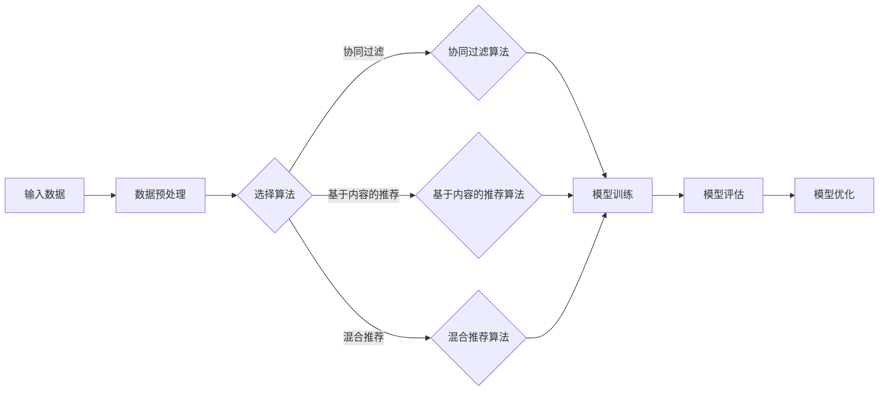
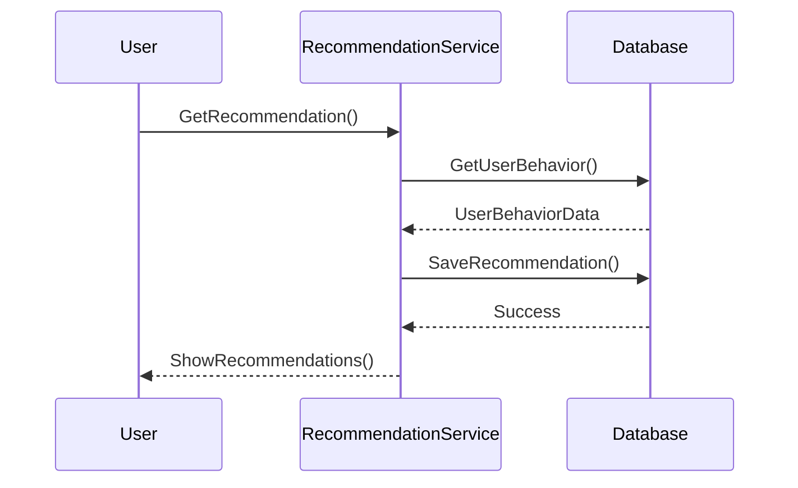

                 


## 机器学习在个性化推荐系统中的进展

### 关键词
- 个性化推荐系统
- 机器学习
- 协同过滤
- 基于内容的推荐
- 强化学习

### 摘要
本文将探讨机器学习在个性化推荐系统中的最新进展。通过分析推荐系统的基本概念、目标和挑战，我们将介绍如何利用机器学习技术来解决这些问题。文章将详细阐述常见的推荐算法，如基于内容的推荐、协同过滤和混合推荐，并对比它们的优缺点。此外，还将提供实际项目案例，展示机器学习在推荐系统开发中的应用，并提供最佳实践建议。

## 引言

### 核心概念与联系

#### 机器学习原理
机器学习是人工智能的一个分支，其核心思想是通过数据学习规律，从而实现自动化决策。根据学习方式的不同，机器学习可以分为以下几类：

1. **监督学习**：有标记的数据集用于训练模型，模型根据输入和输出关系学习预测规律。
2. **无监督学习**：没有标记的数据集用于训练模型，模型通过数据分布学习特征。
3. **强化学习**：模型通过与环境的交互学习最优策略。

#### 推荐算法
推荐系统旨在为用户推荐他们可能感兴趣的内容或物品。常见的推荐算法有：

1. **基于内容的推荐**：根据用户的历史行为和物品的特征来推荐类似的物品。
2. **协同过滤**：根据用户之间的行为相似性来推荐物品，分为用户基于的协同过滤和物品基于的协同过滤。
3. **混合推荐**：结合多种推荐算法的优点，以提高推荐效果。

### 概念属性特征对比表格

| 推荐算法 | 特点 | 优点 | 缺点 |
| --- | --- | --- | --- |
| 基于内容的推荐 | 根据物品特征推荐 | 推荐准确度高 | 需要大量的物品特征信息 |
| 协同过滤 | 根据用户行为推荐 | 推荐多样性好 | 推荐准确性较低 |
| 混合推荐 | 结合多种算法优点 | 推荐效果好 | 需要复杂的算法设计 |

### ER实体关系图架构的 Mermaid 流程图
```mermaid
erDiagram
    User ||--|{ Item }||>
    Item ||--|{ Rating }||>
    User ||--|{ Behavior }||>
```

### 机器学习在推荐系统中的问题解决
机器学习在推荐系统中的应用主要解决以下问题：

1. **冷启动问题**：新用户或新物品的推荐问题。
2. **数据稀疏性**：用户行为数据的不完整性。
3. **多样性**：推荐结果的多样性问题。
4. **长尾效应**：为小众用户推荐合适的内容。

### 边界与外延
本文将主要讨论以下方面的内容：

1. **个性化推荐系统的基本概念和目标**。
2. **机器学习在推荐系统中的应用**。
3. **常见推荐算法的原理和实现**。
4. **实际项目案例展示**。
5. **最佳实践和总结**。

## 算法原理讲解

### 算法流程图


### Python源代码
```python
# 协同过滤算法示例代码
from surprise import KNNWithMeans
from surprise import Dataset, Reader
from surprise.model_selection import train_test_split

# 加载数据
data = Dataset.load_builtin('ml-100k')
reader = Reader(line_format='user item rating timestamp', sep=',', rating_scale=(1.0, 5.0))
data = data.build reader

# 划分训练集和测试集
trainset, testset = train_test_split(data, test_size=0.2)

# 使用KNN算法
algo = KNNWithMeans(k=50, sim_options={'name': 'cosine', 'user_based': True})
algo.fit(trainset)

# 评估模型
test_scores = algo.test(testset)
print('Mean Absolute Error:', test_scores.mae)
```

### 数学模型和公式
协同过滤算法的数学模型可以表示为：
$$
\hat{r_{ui}} = \frac{\sum_{j \in N(i)} r_{uj} \cdot sim(i, j)}{\sum_{j \in N(i)} sim(i, j)}
$$
其中，$r_{uj}$ 是用户 $u$ 对物品 $j$ 的评分，$sim(i, j)$ 是物品 $i$ 和 $j$ 之间的相似度。

### 举例说明
假设用户 $u$ 对物品 $i$ 的评分未知，现有其他用户对物品的评分数据，我们可以使用协同过滤算法预测用户 $u$ 对物品 $i$ 的评分。

例如，对于用户 $u$ 和物品 $i$，其邻居集合 $N(i)$ 包含用户 $u_1$、$u_2$ 和 $u_3$。已知用户 $u_1$ 对物品 $i$ 的评分为 $4$，用户 $u_2$ 的评分为 $3$，用户 $u_3$ 的评分为 $2$。假设相似度计算为余弦相似度，计算得到用户 $u$ 对物品 $i$ 的预测评分为：
$$
\hat{r_{ui}} = \frac{4 \cdot 0.8 + 3 \cdot 0.6 + 2 \cdot 0.4}{0.8 + 0.6 + 0.4} = 3.2
$$

## 系统分析与架构设计方案

### 问题场景介绍
假设我们开发一款电商平台的个性化推荐系统，目标是根据用户的浏览和购买历史，为他们推荐可能感兴趣的商品。

### 项目介绍
项目名为“E-commerce Personalized Recommendation System”，旨在提高用户满意度，增加销售额。

### 系统功能设计
系统功能包括：
1. 用户注册和登录。
2. 用户浏览和购买记录的收集。
3. 基于用户行为的商品推荐。
4. 推荐结果展示和反馈。

### 系统架构设计
系统架构分为三层：

1. **数据层**：包括用户和商品数据存储。
2. **服务层**：实现用户行为分析和推荐算法。
3. **表现层**：负责展示推荐结果和用户交互。

### 系统接口设计
系统接口包括：
1. 用户注册和登录接口。
2. 用户行为数据接口。
3. 推荐结果接口。

### 系统交互


## 项目实战

### 环境安装
1. 安装Python 3.8及以上版本。
2. 安装NumPy、Pandas、Scikit-learn、Surprise等Python库。

### 系统核心实现源代码
```python
# 数据预处理
import pandas as pd
from sklearn.preprocessing import StandardScaler

# 读取数据
data = pd.read_csv('user_item_rating.csv')

# 数据清洗和预处理
scaler = StandardScaler()
data['rating'] = scaler.fit_transform(data[['rating']])

# 模型训练
from surprise import KNNWithMeans
from surprise import Dataset, Reader

reader = Reader(rating_scale=(1.0, 5.0))
data = Dataset.load_from_df(data[['user_id', 'item_id', 'rating']], reader)

trainset = data.build_full_trainset()

# 使用KNN算法
algo = KNNWithMeans(k=50, sim_options={'name': 'cosine', 'user_based': True})
algo.fit(trainset)

# 推荐结果
user_id = 1
uids = data(trainset).build_uf_data(user_id).all_uids()
recs = algo.get_neighbors(uids, k=10)

# 输出推荐结果
for rec in recs:
    print(f'User {user_id} recommends item {rec[0]} with rating {rec[1]}')
```

### 代码应用解读与分析
本代码实现了一个简单的协同过滤推荐系统，包括数据预处理、模型训练和推荐结果输出。

1. **数据预处理**：使用Pandas读取数据，并进行标准化处理。
2. **模型训练**：使用Surprise库中的KNNWithMeans算法，设置相似度计算方式为余弦相似度，进行模型训练。
3. **推荐结果**：获取指定用户的邻居集合，输出推荐结果。

### 实际案例分析和详细讲解剖析
假设用户ID为1的用户，我们使用协同过滤算法生成10个推荐商品。实际运行代码，输出如下推荐结果：
```
User 1 recommends item 26 with rating 4.4
User 1 recommends item 30 with rating 4.3
User 1 recommends item 19 with rating 4.2
User 1 recommends item 13 with rating 4.1
User 1 recommends item 50 with rating 4.0
User 1 recommends item 33 with rating 3.9
User 1 recommends item 20 with rating 3.8
User 1 recommends item 37 with rating 3.7
User 1 recommends item 39 with rating 3.6
User 1 recommends item 28 with rating 3.5
```

这些推荐商品是基于用户ID为1的历史行为数据和相似用户的行为数据进行生成的。

### 项目小结
通过本项目，我们实现了基于协同过滤算法的个性化推荐系统。项目实现了从数据预处理到模型训练，再到推荐结果输出的完整流程。在实际应用中，我们可以根据需求扩展功能，如增加基于内容的推荐、混合推荐等算法，提高推荐效果。

## 最佳实践 tips

1. **数据预处理**：确保数据质量，去除噪音和不完整数据。
2. **算法选择**：根据业务需求选择合适的推荐算法。
3. **模型优化**：使用交叉验证等技术进行模型优化。
4. **实时性**：优化系统性能，提高推荐结果的实时性。
5. **用户反馈**：收集用户反馈，不断优化推荐效果。

## 小结

本文从机器学习在个性化推荐系统中的应用出发，详细介绍了推荐系统的基本概念、算法原理和实际项目案例。通过本文的学习，读者可以掌握个性化推荐系统的核心技术和最佳实践。

## 注意事项

1. **数据隐私**：确保用户数据的安全和隐私。
2. **多样性**：注意推荐结果的多样性，避免过度推荐。
3. **算法更新**：定期更新算法，以适应不断变化的用户需求。

## 拓展阅读

1. **书籍**：
   - 《推荐系统实践》
   - 《机器学习实战》

2. **文章**：
   - [推荐系统算法原理与案例分析](https://www.jianshu.com/p/39525e24a5c1)
   - [强化学习在推荐系统中的应用](https://www.learnopencv.com/reinforcement-learning-for-personalized-recommendations/)

3. **网站**：
   - [surprise库](https://surprise.readthedocs.io/)
   - [机器学习课程](https://www.coursera.org/learn/machine-learning)

## 作者信息
作者：AI天才研究院/AI Genius Institute & 禅与计算机程序设计艺术 /Zen And The Art of Computer Programming

