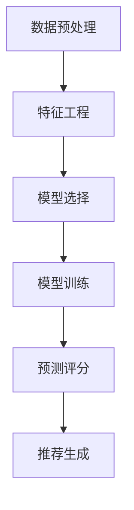
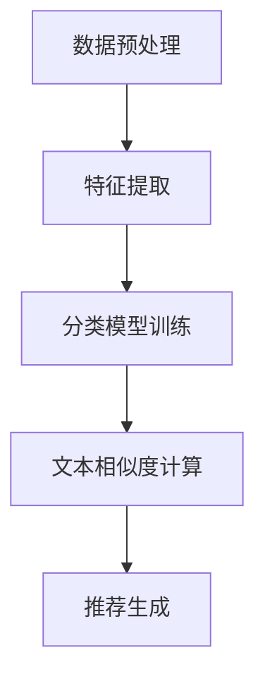

                 


### 第一章：背景与问题定义

**1.1 问题背景**

在互联网飞速发展的今天，信息爆炸已经成为现实。人们每天都要接收和处理海量的信息，而其中新闻内容尤为丰富。然而，面对如此多的信息，用户往往感到无所适从，不知道如何快速获取对自己有价值的新闻。此外，用户的时间和注意力是有限的，如何让用户在最短的时间内获取最感兴趣的新闻内容，成为了新闻行业的一大挑战。

**1.2 问题描述**

个性化新闻推荐系统的核心问题是如何在大量的新闻数据中，根据用户的兴趣和行为，为用户推荐合适的新闻内容。具体来说，存在以下几个问题：

- **用户兴趣识别：** 如何准确识别用户的兴趣点，以便为用户推荐感兴趣的新闻内容？
- **信息多样性：** 在保证推荐新闻的相关性的同时，如何确保新闻内容的多样性，避免用户陷入信息茧房？
- **推荐效率：** 在海量数据中，如何快速有效地生成推荐结果，以满足用户实时获取新闻的需求？
- **推荐质量：** 如何评估推荐系统的推荐效果，并持续优化推荐算法，提高用户满意度？

**1.3 问题解决**

针对上述问题，个性化新闻推荐系统需要结合多种技术和方法，从用户行为分析、算法模型设计、系统优化等多个方面入手，逐步解决。

- **用户行为分析：** 通过对用户浏览、点赞、评论等行为的分析，构建用户兴趣模型，为个性化推荐提供基础。
- **算法模型设计：** 采用协同过滤、内容过滤、混合推荐等算法，实现新闻的精准推荐。
- **系统优化：** 通过评估指标和用户反馈，不断优化推荐算法，提高推荐质量。

**1.4 边界与外延**

在个性化新闻推荐系统中，需要明确以下边界和范围：

- **推荐内容：** 主要针对新闻内容进行推荐，包括各种类型的新闻报道、深度报道、评论等。
- **用户范围：** 针对互联网用户，特别是使用新闻客户端和社交媒体的用户。
- **技术范围：** 涉及机器学习、数据挖掘、自然语言处理等技术，以及推荐系统架构的设计与实现。

**1.5 核心概念与联系**

个性化新闻推荐系统涉及多个核心概念，如图1-1所示。

```mermaid
erDiagram
    User ||--o{ Recommendation : 推荐新闻 }
    Article ||--o{ Recommendation : 推荐新闻 }
    User ||--o{ InterestModel : 用户兴趣模型 }
    Article ||--|| { ContentFeature : 内容特征 }
    Algorithm ||--|| { CollaborativeFiltering : 协同过滤 }
    Algorithm ||--|| { ContentBasedFiltering : 内容过滤 }
    Algorithm ||--|| { HybridRecommender : 混合推荐 }
```

图1-1：个性化新闻推荐系统的核心概念与联系

通过用户行为分析，可以构建用户兴趣模型，进而生成个性化的推荐结果。同时，推荐系统需要结合多种算法，如协同过滤、内容过滤和混合推荐，以满足不同用户的个性化需求。这些算法相互关联，共同构成一个完整的个性化新闻推荐系统。

### 第一章小结

本章主要介绍了个性化新闻推荐系统的问题背景、问题描述、问题解决、边界与外延以及核心概念与联系。通过分析用户行为，构建用户兴趣模型，并结合多种推荐算法，个性化新闻推荐系统可以有效地为用户提供高质量的新闻推荐。在接下来的章节中，我们将深入探讨个性化新闻推荐系统的基本概念、核心要素和发展历程，以及机器学习在个性化新闻推荐中的应用。

### 第二章：个性化新闻推荐系统概述

**2.1 个性化新闻推荐系统的基本概念**

个性化新闻推荐系统是一种利用用户行为数据、新闻内容特征和其他相关数据，通过算法模型自动为用户推荐符合其兴趣的新闻内容的技术。其核心目标是通过分析用户的历史行为和兴趣偏好，为用户生成个性化的新闻推荐列表，从而提高用户的阅读体验和满意度。

个性化新闻推荐系统通常包括以下几个核心组成部分：

- **用户：** 个性化新闻推荐系统的服务对象，拥有特定的兴趣偏好和行为习惯。
- **新闻内容：** 系统推荐的新闻内容，包括各种类型的新闻报道、深度报道、评论等。
- **算法模型：** 用于分析用户行为、提取用户兴趣特征和生成推荐结果的算法，如协同过滤、内容过滤和混合推荐等。
- **推荐引擎：** 负责处理用户请求，调用算法模型生成推荐结果的模块。
- **评估与优化：** 通过评估指标（如准确率、召回率、覆盖率等）对推荐系统进行评估和优化，以提高推荐质量。

**2.2 个性化新闻推荐系统的核心要素**

个性化新闻推荐系统的核心要素包括以下几个方面：

- **用户行为数据：** 用户在新闻客户端的行为数据，如浏览记录、点赞、评论、分享等，用于构建用户兴趣模型。
- **新闻内容特征：** 新闻内容的文本特征、图像特征、音频特征等，用于描述新闻的内容属性。
- **用户兴趣模型：** 通过对用户行为数据的分析，构建用户兴趣模型，为推荐算法提供基础。
- **推荐算法：** 用于生成推荐结果的算法模型，包括协同过滤、内容过滤、混合推荐等。
- **推荐结果评估：** 通过评估指标对推荐结果进行评估，以衡量推荐系统的性能。

**2.3 个性化新闻推荐系统的发展历程**

个性化新闻推荐系统的发展可以分为以下几个阶段：

- **早期推荐系统（1990年代）**：以基于内容的推荐为主，通过分析新闻内容的文本特征为用户推荐感兴趣的新闻。
- **协同过滤推荐（2000年代）**：通过分析用户的行为数据，发现相似用户或相似物品，为用户推荐相似的新闻。
- **混合推荐系统（2010年代）**：结合基于内容和协同过滤的推荐方法，提高推荐系统的准确性和多样性。
- **深度学习推荐（2020年代至今）**：利用深度学习技术，如卷积神经网络（CNN）、循环神经网络（RNN）和自注意力机制（Self-Attention），实现更精准和高效的新闻推荐。

**2.4 个性化新闻推荐系统的主要挑战**

个性化新闻推荐系统在发展过程中面临着以下主要挑战：

- **数据质量与隐私：** 用户行为数据和新闻内容特征数据的获取和处理需要遵守隐私保护原则，同时保证数据质量。
- **计算效率与实时性：** 在海量数据中，如何快速生成推荐结果以满足用户实时获取新闻的需求是一个重要问题。
- **推荐多样性：** 在保证推荐准确性的同时，如何确保新闻内容的多样性，避免用户陷入信息茧房。
- **评估与优化：** 如何准确评估推荐系统的性能，并基于用户反馈进行持续优化，提高推荐质量。

### 第二章小结

本章介绍了个性化新闻推荐系统的基本概念、核心要素、发展历程以及主要挑战。个性化新闻推荐系统通过分析用户行为和新闻内容特征，利用算法模型为用户提供个性化的新闻推荐。在接下来的章节中，我们将进一步探讨机器学习在个性化新闻推荐中的应用，以及不同算法模型的设计与实现。

### 第三章：机器学习在个性化新闻推荐中的应用

**3.1 机器学习在个性化推荐中的应用**

机器学习技术在个性化推荐领域有着广泛的应用，通过学习用户的行为数据和新闻内容特征，机器学习算法能够自动发现用户隐藏的兴趣偏好，从而生成个性化的推荐结果。机器学习在个性化推荐中的应用主要包括以下两个方面：

- **协同过滤（Collaborative Filtering）**：通过分析用户行为数据，找到相似用户或相似物品，为用户推荐相似的新闻。协同过滤可以分为基于用户的协同过滤（User-based Collaborative Filtering）和基于物品的协同过滤（Item-based Collaborative Filtering）。
- **内容过滤（Content-Based Filtering）**：通过分析新闻内容的特征，将具有相似特征的新闻推荐给具有相似兴趣的用户。内容过滤主要关注新闻内容的文本特征、图像特征、音频特征等。

**3.2 常见的机器学习算法及其在新闻推荐中的应用**

在个性化新闻推荐中，常见的机器学习算法包括以下几种：

- **协同过滤算法（Collaborative Filtering）**：通过分析用户行为数据，找到相似用户或相似物品，为用户推荐相似的新闻。协同过滤算法可以分为基于用户的协同过滤和基于物品的协同过滤。

  - **基于用户的协同过滤（User-based Collaborative Filtering）**：找到与目标用户相似的其他用户，推荐这些用户喜欢的新闻。
  - **基于物品的协同过滤（Item-based Collaborative Filtering）**：找到与目标新闻相似的其他新闻，推荐这些新闻。

- **内容过滤算法（Content-Based Filtering）**：通过分析新闻内容的特征，将具有相似特征的新闻推荐给具有相似兴趣的用户。内容过滤算法主要关注新闻的文本特征、图像特征、音频特征等。

- **基于模型的协同过滤算法（Model-Based Collaborative Filtering）**：在协同过滤的基础上，引入机器学习模型（如矩阵分解、潜在因子模型等），对用户和新闻进行建模，从而提高推荐效果。

- **深度学习算法（Deep Learning）**：利用深度学习技术，如卷积神经网络（CNN）、循环神经网络（RNN）和自注意力机制（Self-Attention），对用户行为和新闻内容进行建模，实现更精准和高效的新闻推荐。

**3.3 机器学习在个性化新闻推荐中的优势和局限**

机器学习在个性化新闻推荐中具有以下优势和局限：

- **优势**：
  - **自适应性强**：机器学习算法可以根据用户行为和新闻内容的变化，自动调整推荐策略，提高推荐效果。
  - **个性化水平高**：通过分析用户的行为数据和新闻内容特征，机器学习算法能够发现用户的兴趣偏好，生成个性化的推荐结果。
  - **可扩展性强**：机器学习算法可以处理海量用户数据和新闻内容，适用于大规模推荐系统。

- **局限**：
  - **数据依赖性强**：机器学习算法需要大量的用户行为数据和新闻内容特征，数据质量直接影响推荐效果。
  - **计算复杂度高**：机器学习算法在处理海量数据时，计算复杂度较高，可能影响推荐系统的实时性。
  - **隐私保护问题**：在获取和处理用户数据时，需要遵循隐私保护原则，确保用户数据的安全。

**3.4 机器学习在个性化新闻推荐中的应用案例**

以下是一些机器学习在个性化新闻推荐中的应用案例：

- **案例1：淘宝推荐系统**：淘宝推荐系统利用协同过滤算法和深度学习算法，为用户推荐商品。协同过滤算法通过分析用户的购买记录和浏览记录，找到相似用户和相似商品，为用户推荐商品。深度学习算法则通过分析用户的购物行为和商品特征，构建用户兴趣模型，实现更精准的推荐。
- **案例2：今日头条推荐系统**：今日头条推荐系统利用内容过滤算法和基于模型的协同过滤算法，为用户推荐新闻。内容过滤算法通过分析新闻的文本特征和用户兴趣，将具有相似特征的新闻推荐给用户。基于模型的协同过滤算法则通过矩阵分解和潜在因子模型，对用户和新闻进行建模，提高推荐效果。

### 第三章小结

本章介绍了机器学习在个性化新闻推荐中的应用，包括协同过滤、内容过滤、基于模型的协同过滤和深度学习等算法。通过机器学习算法，个性化新闻推荐系统能够根据用户行为和新闻内容特征，生成个性化的推荐结果。在接下来的章节中，我们将深入探讨数据挖掘与用户行为分析、协同过滤算法、内容过滤算法和混合推荐系统等核心概念和原理。

## 第四章：数据挖掘与用户行为分析

**4.1 数据挖掘的基本概念**

数据挖掘（Data Mining）是指从大量数据中自动发现有趣的知识和模式的过程。数据挖掘涉及多个领域，包括统计学、机器学习、数据库和人工智能等。数据挖掘的基本流程通常包括以下步骤：

1. **数据预处理**：清洗和整合原始数据，去除噪声和缺失值，以便为后续的分析提供高质量的数据。
2. **数据探索**：通过可视化、统计分析等方法，探索数据的基本特征和规律，为建模提供指导。
3. **特征工程**：根据数据特点和业务需求，提取和构建有用的特征，以提高模型性能。
4. **模型选择**：选择合适的算法和模型，对数据进行分析和建模。
5. **模型评估**：通过评估指标，评估模型性能，并对模型进行优化。
6. **知识解释**：对挖掘出的知识进行解释和验证，确保其业务意义和实际应用价值。

**4.2 数据挖掘在个性化新闻推荐中的应用**

在个性化新闻推荐系统中，数据挖掘技术发挥着重要作用，主要体现在以下几个方面：

- **用户行为分析**：通过对用户在新闻客户端的浏览、点击、评论、分享等行为数据进行挖掘，可以发现用户的兴趣偏好和阅读习惯，为个性化推荐提供基础。
- **新闻内容分析**：通过分析新闻的文本、图像、音频等特征，可以提取新闻的关键信息和主题，为内容过滤算法提供支持。
- **用户群体细分**：通过对用户行为和兴趣的挖掘，可以将用户划分为不同的群体，为不同群体的用户定制个性化的推荐策略。
- **异常检测**：通过挖掘用户行为数据的异常模式，可以发现恶意用户行为，如刷赞、刷评论等，从而保护系统安全。

**4.3 用户行为分析的方法与工具**

用户行为分析的方法和工具多种多样，以下是一些常见的方法和工具：

- **用户画像**：通过整合用户的基本信息、行为数据和兴趣标签，构建用户画像，用于描述用户的基本特征和兴趣偏好。
- **关联规则挖掘**：通过挖掘用户行为数据中的关联规则，可以发现用户在不同行为之间的联系，为推荐策略提供依据。
- **聚类分析**：通过聚类算法（如K-means、DBSCAN等），将用户分为不同的群体，分析各群体的特征和需求。
- **分类算法**：通过分类算法（如决策树、支持向量机、神经网络等），对用户行为数据进行分析和预测，为个性化推荐提供支持。

**4.4 用户兴趣模型的构建与优化**

用户兴趣模型是个性化新闻推荐系统的核心组件，其质量直接影响推荐效果。构建和优化用户兴趣模型的方法包括：

- **基于行为的兴趣模型**：通过分析用户的浏览、点击、评论等行为，发现用户的兴趣点，构建用户兴趣模型。
- **基于内容的兴趣模型**：通过分析新闻的文本、图像、音频等特征，将具有相似特征的新闻推荐给具有相似兴趣的用户。
- **基于模型的兴趣模型**：利用机器学习算法（如潜在因子模型、矩阵分解等），对用户和新闻进行建模，构建用户兴趣模型。

优化用户兴趣模型的方法包括：

- **在线更新**：随着用户行为数据的变化，实时更新用户兴趣模型，以保持模型的准确性。
- **跨领域学习**：利用跨领域知识，为用户发现新的兴趣点，丰富用户兴趣模型。
- **用户反馈**：通过用户反馈（如点赞、评论等），调整用户兴趣模型，提高推荐质量。

**4.5 用户行为数据挖掘的挑战与解决方案**

用户行为数据挖掘在个性化新闻推荐中面临以下挑战：

- **数据量大**：用户行为数据通常非常庞大，如何高效处理和分析这些数据是一个关键问题。
- **数据质量**：用户行为数据可能存在噪声和缺失值，如何保证数据质量，是数据挖掘的一个关键问题。
- **隐私保护**：在挖掘和处理用户行为数据时，如何保护用户隐私，是一个重要的法律和伦理问题。

解决方案包括：

- **分布式计算**：利用分布式计算技术（如MapReduce、Spark等），处理海量用户行为数据。
- **数据清洗**：通过数据清洗技术，去除噪声和缺失值，提高数据质量。
- **隐私保护技术**：采用差分隐私、数据匿名化等技术，保护用户隐私。

### 第四章小结

本章介绍了数据挖掘的基本概念和在个性化新闻推荐中的应用，重点讨论了用户行为分析的方法与工具、用户兴趣模型的构建与优化，以及用户行为数据挖掘的挑战与解决方案。通过数据挖掘技术，个性化新闻推荐系统能够更好地理解用户兴趣，为用户提供高质量的新闻推荐。在接下来的章节中，我们将深入探讨协同过滤算法、内容过滤算法和混合推荐系统等核心算法和原理。

## 第五章：协同过滤算法

**5.1 协同过滤算法的基本原理**

协同过滤（Collaborative Filtering）是一种常见的推荐算法，旨在通过分析用户的历史行为数据，为用户推荐相似的其他用户或物品。协同过滤算法的核心思想是利用用户之间的相似性或物品之间的相似性，为用户推荐他们可能感兴趣的物品。

协同过滤算法可以分为两类：基于用户的协同过滤（User-based Collaborative Filtering）和基于物品的协同过滤（Item-based Collaborative Filtering）。

- **基于用户的协同过滤**：首先找到与目标用户相似的其他用户，然后推荐这些用户喜欢的物品。相似性通常通过用户之间的共同评分或行为进行计算。
- **基于物品的协同过滤**：首先找到与目标物品相似的物品，然后推荐这些物品给用户。相似性通常通过物品之间的共同用户或行为进行计算。

**5.2 传统的协同过滤算法**

传统的协同过滤算法主要包括基于用户的协同过滤和基于物品的协同过滤。

- **基于用户的协同过滤**：

  - **最近邻算法（Nearest Neighbor Algorithm）**：找到与目标用户最相似的若干个用户，推荐这些用户喜欢的物品。

    相似度计算公式如下：

    $$

    similarity(u, v) = \frac{\sum_{i \in R(u) \cap R(v)} r_{u,i} \cdot r_{v,i}}{\sqrt{\sum_{i \in R(u)} r_{u,i}^2 \cdot \sum_{i \in R(v)} r_{v,i}^2}}

    $$

    其中，$u$ 和 $v$ 是两个用户，$R(u)$ 和 $R(v)$ 分别是用户 $u$ 和 $v$ 的评分记录集合，$r_{u,i}$ 和 $r_{v,i}$ 分别是用户 $u$ 对物品 $i$ 的评分。

    推荐算法如下：

    - 计算目标用户与其他用户的相似度；
    - 找到最相似的 $k$ 个用户；
    - 计算目标用户对未评分物品的预测评分。

  - **加权最近邻算法（Weighted Nearest Neighbor Algorithm）**：在最近邻算法的基础上，考虑用户之间的相似度差异，对相似度进行加权。

    相似度计算公式如下：

    $$

    similarity(u, v) = \frac{\sum_{i \in R(u) \cap R(v)} r_{u,i} \cdot r_{v,i} \cdot w(u, v)}{\sqrt{\sum_{i \in R(u)} r_{u,i}^2 \cdot \sum_{i \in R(v)} r_{v,i}^2}}

    $$

    其中，$w(u, v)$ 是用户 $u$ 和 $v$ 之间的加权系数。

- **基于物品的协同过滤**：

  - **最近邻算法（Nearest Neighbor Algorithm）**：找到与目标物品最相似的若干个物品，推荐这些物品给用户。

    相似度计算公式如下：

    $$

    similarity(i, j) = \frac{\sum_{u \in U(i) \cap U(j)} r_{u,i} \cdot r_{u,j}}{\sqrt{\sum_{u \in U(i)} r_{u,i}^2 \cdot \sum_{u \in U(j)} r_{u,j}^2}}

    $$

    其中，$i$ 和 $j$ 是两个物品，$U(i)$ 和 $U(j)$ 分别是物品 $i$ 和 $j$ 的共同用户集合，$r_{u,i}$ 和 $r_{u,j}$ 分别是用户 $u$ 对物品 $i$ 和 $j$ 的评分。

    推荐算法如下：

    - 计算目标物品与其他物品的相似度；
    - 找到最相似的 $k$ 个物品；
    - 计算用户对未评分物品的预测评分。

  - **加权最近邻算法（Weighted Nearest Neighbor Algorithm）**：在最近邻算法的基础上，考虑物品之间的相似度差异，对相似度进行加权。

    相似度计算公式如下：

    $$

    similarity(i, j) = \frac{\sum_{u \in U(i) \cap U(j)} r_{u,i} \cdot r_{u,j} \cdot w(i, j)}{\sqrt{\sum_{u \in U(i)} r_{u,i}^2 \cdot \sum_{u \in U(j)} r_{u,j}^2}}

    $$

    其中，$w(i, j)$ 是物品 $i$ 和 $j$ 之间的加权系数。

**5.3 基于模型的协同过滤算法**

基于模型的协同过滤算法（Model-Based Collaborative Filtering）通过建立用户和物品之间的潜在关系模型，来提高推荐效果。常见的基于模型的协同过滤算法包括矩阵分解（Matrix Factorization）、潜在因子模型（Latent Factor Model）等。

- **矩阵分解（Matrix Factorization）**：

  矩阵分解算法将用户-物品评分矩阵分解为两个低秩矩阵，分别表示用户和物品的潜在特征。

  假设原始评分矩阵为 $R \in \mathbb{R}^{m \times n}$，其中 $m$ 是用户数量，$n$ 是物品数量。矩阵分解的目标是找到两个低秩矩阵 $U \in \mathbb{R}^{m \times k}$ 和 $V \in \mathbb{R}^{n \times k}$，使得

  $$

  R \approx U \cdot V^T

  $$

  其中，$k$ 是潜在特征维度。

  推荐算法如下：

  - 初始化用户-物品潜在特征矩阵 $U$ 和 $V$；
  - 使用最小二乘法或梯度下降法优化模型参数；
  - 根据用户和物品的潜在特征，计算用户对未评分物品的预测评分。

- **潜在因子模型（Latent Factor Model）**：

  潜在因子模型是一种基于概率的协同过滤算法，通过构建用户和物品的潜在因子概率分布，来预测用户对物品的评分。

  假设用户 $u$ 对物品 $i$ 的评分为 $r_{u,i}$，潜在因子模型可以表示为：

  $$

  r_{u,i} \sim \text{Normal}(\mu_{u,i}, \sigma_{u,i}^2)

  $$

  其中，$\mu_{u,i}$ 是用户 $u$ 对物品 $i$ 的潜在期望评分，$\sigma_{u,i}^2$ 是用户 $u$ 对物品 $i$ 的评分方差。

  推荐算法如下：

  - 使用贝叶斯推断方法估计用户和物品的潜在因子；
  - 根据用户和物品的潜在因子，计算用户对未评分物品的预测评分。

**5.4 协同过滤算法的优化策略**

协同过滤算法在实际应用中存在一些局限，如冷启动问题、数据稀疏性和预测误差等。为了提高协同过滤算法的性能，可以采用以下优化策略：

- **矩阵分解与矩阵补全**：通过矩阵分解算法，将原始评分矩阵分解为低秩矩阵，同时结合矩阵补全技术，提高推荐效果。
- **基于内容的协同过滤**：结合基于内容的推荐方法，为用户推荐具有相似内容的新闻。
- **多样性优化**：在推荐结果中引入多样性度量，如新闻的文本多样性、来源多样性等，避免用户陷入信息茧房。
- **在线更新与自适应**：随着用户行为数据的变化，实时更新用户和物品的潜在特征，提高推荐精度和实时性。
- **数据预处理**：通过数据清洗、去噪和归一化等技术，提高数据质量，降低数据稀疏性。

### 第五章小结

本章详细介绍了协同过滤算法的基本原理、传统的协同过滤算法、基于模型的协同过滤算法以及优化策略。协同过滤算法通过分析用户历史行为数据，为用户推荐相似的其他用户或物品，在个性化新闻推荐中发挥着重要作用。在接下来的章节中，我们将继续探讨内容过滤算法、混合推荐系统以及其他机器学习算法在个性化新闻推荐中的应用。

## 第六章：内容过滤算法

**6.1 内容过滤算法的基本原理**

内容过滤（Content-Based Filtering）是一种推荐算法，通过分析新闻的内容特征，将具有相似特征的新闻推荐给具有相似兴趣的用户。与协同过滤算法不同，内容过滤算法不依赖于用户的历史行为数据，而是依赖于新闻本身的特征信息。

内容过滤算法的核心思想是：如果两个新闻内容相似，那么对其中一个新闻感兴趣的用户也可能会对另一个新闻感兴趣。因此，内容过滤算法首先需要提取新闻的文本特征、图像特征、音频特征等，然后根据这些特征为用户推荐相似的新闻。

**6.2 基于文本的相似度计算**

在内容过滤算法中，文本相似度计算是一个关键步骤，用于衡量两篇新闻文本之间的相似程度。常见的文本相似度计算方法包括：

- **基于词语的相似度计算**：

  - **余弦相似度（Cosine Similarity）**：通过计算两篇文本向量之间的夹角余弦值，衡量文本相似度。

    $$

    similarity(A, B) = \frac{A \cdot B}{\|A\| \|B\|}

    $$

    其中，$A$ 和 $B$ 分别是两篇文本的向量表示，$\|A\|$ 和 $\|B\|$ 分别是向量 $A$ 和 $B$ 的模长。

  - **Jaccard相似度（Jaccard Similarity）**：通过计算两篇文本的交集与并集的比例，衡量文本相似度。

    $$

    similarity(A, B) = \frac{|A \cap B|}{|A \cup B|}

    $$

    其中，$A$ 和 $B$ 分别是两篇文本的集合表示，$|A|$ 和 $|B|$ 分别是集合 $A$ 和 $B$ 的元素个数。

- **基于词嵌入的相似度计算**：

  - **欧氏距离（Euclidean Distance）**：通过计算两篇文本向量之间的欧氏距离，衡量文本相似度。

    $$

    distance(A, B) = \sqrt{\sum_{i=1}^n (a_i - b_i)^2}

    $$

    其中，$A$ 和 $B$ 分别是两篇文本的向量表示，$a_i$ 和 $b_i$ 分别是向量 $A$ 和 $B$ 的第 $i$ 个元素。

  - **余弦相似度（Cosine Similarity）**：通过计算两篇文本向量之间的夹角余弦值，衡量文本相似度。

    $$

    similarity(A, B) = \frac{A \cdot B}{\|A\| \|B\|}

    $$

    其中，$A$ 和 $B$ 分别是两篇文本的向量表示，$\|A\|$ 和 $\|B\|$ 分别是向量 $A$ 和 $B$ 的模长。

**6.3 基于内容特征的新闻推荐**

基于内容特征的新闻推荐算法主要包括以下步骤：

1. **新闻特征提取**：对新闻的文本、图像、音频等特征进行提取，构建新闻的特征向量。
2. **用户兴趣建模**：根据用户的历史行为和兴趣标签，构建用户的兴趣模型。
3. **相似度计算**：计算新闻特征向量和用户兴趣模型之间的相似度，确定新闻与用户兴趣的相关性。
4. **推荐生成**：根据相似度计算结果，为用户生成新闻推荐列表。

在新闻特征提取过程中，常用的方法包括：

- **TF-IDF（Term Frequency-Inverse Document Frequency）**：通过计算词语在新闻中的频率和其在整个文档集合中的逆文档频率，为新闻文本构建特征向量。
- **词嵌入（Word Embedding）**：将新闻文本中的词语映射到低维向量空间，用于表示新闻的语义信息。
- **图像特征提取（Image Feature Extraction）**：通过深度学习算法（如卷积神经网络（CNN）），提取新闻图像的特征向量。
- **音频特征提取（Audio Feature Extraction）**：通过音频信号处理算法，提取新闻音频的特征向量。

**6.4 内容过滤算法的优化与扩展**

内容过滤算法在实际应用中存在一些局限性，如数据稀疏性、语义理解能力不足等。为了提高内容过滤算法的性能，可以采用以下优化和扩展方法：

- **基于语义的相似度计算**：通过引入语义分析技术（如词向量相似度、句法分析等），提高文本相似度计算的准确性。
- **多模态特征融合**：将文本、图像、音频等特征进行融合，构建更全面的新闻特征向量，提高推荐效果。
- **基于上下文的推荐**：结合用户上下文信息（如时间、地理位置等），为用户推荐更相关的新闻。
- **自适应推荐**：根据用户的行为和反馈，动态调整推荐策略，提高用户满意度。

### 第六章小结

本章介绍了内容过滤算法的基本原理、基于文本的相似度计算方法、基于内容特征的新闻推荐以及优化与扩展方法。内容过滤算法通过分析新闻的内容特征，为用户推荐具有相似兴趣的新闻。在接下来的章节中，我们将继续探讨混合推荐系统、深度学习推荐算法等在个性化新闻推荐中的应用。

## 第七章：混合推荐系统

**7.1 混合推荐系统的概念**

混合推荐系统（Hybrid Recommender System）是一种结合多种推荐算法和技术的推荐系统，旨在提高推荐效果和多样性。与单一推荐算法的系统相比，混合推荐系统具有更强的适应性和更好的性能。混合推荐系统的核心思想是将不同的推荐算法和策略结合起来，以弥补单一算法的不足。

**7.2 混合推荐系统的设计原则**

设计混合推荐系统时，需要遵循以下原则：

- **多样性**：在保证推荐结果准确性的同时，确保新闻内容的多样性，避免用户陷入信息茧房。
- **灵活性**：根据用户行为和新闻内容的变化，动态调整推荐算法和策略，提高推荐效果。
- **效率**：在保证推荐质量的前提下，提高系统的响应速度，满足用户实时获取新闻的需求。
- **可扩展性**：系统应具备良好的扩展性，能够轻松集成新的算法和技术，以适应不断变化的市场需求。

**7.3 常见的混合推荐系统架构**

常见的混合推荐系统架构包括以下几种：

- **基于组件的混合推荐系统**：将协同过滤、内容过滤、基于模型的协同过滤等算法组件模块化，根据用户需求动态组合和切换算法组件。
- **基于策略的混合推荐系统**：根据用户行为和新闻内容特征，动态调整推荐策略，如根据用户历史行为，优先推荐内容过滤结果，根据新闻内容特征，优先推荐协同过滤结果。
- **基于模型的混合推荐系统**：利用深度学习技术，构建端到端的混合推荐模型，同时融合用户行为和新闻内容特征，实现高效、准确的推荐。

**7.4 混合推荐系统的评估与优化**

评估混合推荐系统的性能需要考虑多个方面，包括准确性、多样性、覆盖率等。常见的评估指标包括：

- **准确性（Accuracy）**：评估推荐结果的准确性，常用的指标包括精确率（Precision）、召回率（Recall）和F1值（F1 Score）。
- **多样性（Diversity）**：评估推荐结果的多样性，常用的指标包括新闻内容的来源多样性、文本多样性等。
- **覆盖率（Coverage）**：评估推荐系统能够覆盖的用户兴趣范围，常用的指标包括新闻内容的覆盖率。

为了优化混合推荐系统，可以采用以下策略：

- **在线调整**：根据用户反馈和系统性能，动态调整推荐策略和算法参数，提高推荐效果。
- **多目标优化**：同时优化推荐系统的多个目标，如准确性、多样性和覆盖率，以实现整体性能的最优化。
- **数据增强**：通过数据增强技术，增加训练数据量，提高模型泛化能力。
- **协同优化**：结合不同算法组件的优势，协同优化推荐系统的整体性能。

### 第七章小结

本章介绍了混合推荐系统的概念、设计原则、常见架构以及评估与优化策略。混合推荐系统通过结合多种推荐算法和技术，提高推荐效果和多样性。在接下来的章节中，我们将深入探讨协同过滤算法的机器学习实现、内容过滤算法的机器学习实现，以及基于深度学习的个性化推荐模型。

## 第八章：协同过滤算法的机器学习实现

**8.1 协同过滤算法的机器学习框架**

协同过滤算法（Collaborative Filtering）是一种基于用户行为数据的推荐算法，通过分析用户之间的相似性或物品之间的相似性，为用户推荐相似的其他用户或物品。在机器学习框架中，协同过滤算法可以采用基于矩阵分解的方法，将用户-物品评分矩阵分解为低秩矩阵，从而提高推荐效果。

协同过滤算法的机器学习框架主要包括以下步骤：

1. **数据预处理**：清洗和整合用户行为数据，形成用户-物品评分矩阵。
2. **特征工程**：提取用户和物品的特征，如用户年龄、性别、兴趣爱好等。
3. **模型选择**：选择合适的协同过滤算法，如矩阵分解、潜在因子模型等。
4. **模型训练**：使用用户-物品评分矩阵训练协同过滤模型，生成用户和物品的潜在特征。
5. **预测评分**：根据用户和物品的潜在特征，预测用户对未评分物品的评分。
6. **推荐生成**：根据预测评分，生成个性化的推荐列表。

**8.2 协同过滤算法的数学模型**

协同过滤算法的数学模型通常基于矩阵分解，将用户-物品评分矩阵分解为两个低秩矩阵，分别表示用户和物品的潜在特征。

假设原始评分矩阵为 $R \in \mathbb{R}^{m \times n}$，其中 $m$ 是用户数量，$n$ 是物品数量。矩阵分解的目标是找到两个低秩矩阵 $U \in \mathbb{R}^{m \times k}$ 和 $V \in \mathbb{R}^{n \times k}$，使得：

$$

R \approx U \cdot V^T

$$

其中，$k$ 是潜在特征维度。

在矩阵分解模型中，用户 $u$ 对物品 $i$ 的预测评分可以表示为：

$$

\hat{r}_{u,i} = U_{u} \cdot V_{i}^T

$$

其中，$U_{u}$ 是用户 $u$ 的潜在特征向量，$V_{i}^T$ 是物品 $i$ 的潜在特征向量。

**8.3 Python实现示例**

以下是一个简单的Python实现示例，使用矩阵分解算法实现协同过滤推荐系统。

```python
import numpy as np
from sklearn.metrics.pairwise import cosine_similarity

# 假设用户-物品评分矩阵为R
R = np.array([[1, 2, 0, 0],
              [2, 0, 1, 0],
              [0, 1, 2, 0],
              [0, 0, 1, 2]])

# 矩阵分解参数
k = 2

# 初始化低秩矩阵U和V
U = np.random.rand(m, k)
V = np.random.rand(n, k)

# 迭代更新低秩矩阵
for i in range(100):
    # 预测评分
    pred_R = U @ V.T
    
    # 计算误差
    error = R - pred_R
    
    # 更新U和V
    dU = (V.T @ error) @ V
    dV = (U @ error.T) @ U
    
    U -= dU
    V -= dV

# 计算用户和物品的潜在特征
user_features = U
item_features = V.T

# 计算用户对未评分物品的预测评分
user = 1
unrated_items = [i for i in range(n) if R[user, i] == 0]
item_features_unrated = item_features[unrated_items]
user_feature = user_features[user]

# 计算预测评分
predictions = user_feature @ item_features_unrated.T
print(predictions)
```

**8.4 Mermaid流程图展示**

以下是一个简单的Mermaid流程图，展示协同过滤算法的流程：



### 第八章小结

本章详细介绍了协同过滤算法的机器学习框架、数学模型以及Python实现示例。通过矩阵分解算法，协同过滤算法能够有效地预测用户对未评分物品的评分，为用户提供个性化的推荐。在接下来的章节中，我们将继续探讨内容过滤算法的机器学习实现、基于深度学习的个性化推荐模型以及其他优化策略。

## 第九章：内容过滤算法的机器学习实现

**9.1 内容过滤算法的机器学习框架**

内容过滤（Content-Based Filtering）算法通过分析新闻的内容特征，将具有相似特征的新闻推荐给具有相似兴趣的用户。在机器学习框架中，内容过滤算法可以采用文本分类、文本相似度计算等方法，结合用户行为数据，实现个性化的新闻推荐。

内容过滤算法的机器学习框架主要包括以下步骤：

1. **数据预处理**：清洗和整合新闻文本数据，去除停用词、标点符号等。
2. **特征提取**：使用词袋模型、TF-IDF、词嵌入等方法，将新闻文本转换为向量表示。
3. **分类模型训练**：使用分类算法（如朴素贝叶斯、支持向量机、决策树等）训练分类模型，预测新闻的类别或主题。
4. **文本相似度计算**：计算用户兴趣文本与新闻文本之间的相似度，确定新闻与用户兴趣的相关性。
5. **推荐生成**：根据相似度计算结果，生成个性化的新闻推荐列表。

**9.2 内容过滤算法的数学模型**

内容过滤算法的数学模型主要涉及文本相似度计算和分类模型。以下是两种常见的数学模型：

- **文本相似度计算**：

  - **余弦相似度（Cosine Similarity）**：

    $$

    similarity(A, B) = \frac{A \cdot B}{\|A\| \|B\|}

    $$

    其中，$A$ 和 $B$ 分别是两篇文本的向量表示，$\|A\|$ 和 $\|B\|$ 分别是向量 $A$ 和 $B$ 的模长。

  - **欧氏距离（Euclidean Distance）**：

    $$

    distance(A, B) = \sqrt{\sum_{i=1}^n (a_i - b_i)^2}

    $$

    其中，$A$ 和 $B$ 分别是两篇文本的向量表示，$a_i$ 和 $b_i$ 分别是向量 $A$ 和 $B$ 的第 $i$ 个元素。

- **分类模型**：

  - **朴素贝叶斯（Naive Bayes）**：

    $$

    P(C_k|X) = \frac{P(X|C_k) \cdot P(C_k)}{P(X)}

    $$

    其中，$C_k$ 是类别 $k$，$X$ 是新闻文本，$P(C_k|X)$ 是新闻文本属于类别 $k$ 的概率，$P(X|C_k)$ 是新闻文本属于类别 $k$ 的条件下发生的概率，$P(C_k)$ 是类别 $k$ 的先验概率。

  - **支持向量机（Support Vector Machine）**：

    $$

    \max \min_{w,b,\xi_i} \frac{1}{2} \|w\|^2 + C \sum_{i=1}^n \xi_i

    $$

    s.t. \(y_i (w \cdot x_i + b) \geq 1 - \xi_i\)

    $$

    其中，$w$ 是权重向量，$b$ 是偏置项，$\xi_i$ 是松弛变量，$C$ 是惩罚参数，$x_i$ 是支持向量，$y_i$ 是类别标签。

**9.3 Python实现示例**

以下是一个简单的Python实现示例，使用TF-IDF和朴素贝叶斯实现内容过滤算法。

```python
import numpy as np
from sklearn.feature_extraction.text import TfidfVectorizer
from sklearn.naive_bayes import MultinomialNB
from sklearn.pipeline import make_pipeline

# 假设新闻文本数据为data
data = [
    "这是一篇关于人工智能的新闻",
    "深度学习技术在计算机视觉领域取得了重大突破",
    "我国科研团队在量子计算领域取得重要进展",
    "科技企业加快数字化转型步伐"
]

# 假设用户兴趣文本为interest
interest = "人工智能、深度学习"

# 构建TF-IDF向量器
vectorizer = TfidfVectorizer()

# 训练TF-IDF向量器
X = vectorizer.fit_transform(data)

# 训练朴素贝叶斯分类器
model = MultinomialNB()
model.fit(X, [0, 0, 1, 0])

# 将用户兴趣文本转换为向量
interest_vector = vectorizer.transform([interest])

# 预测用户兴趣文本的类别
predicted_category = model.predict(interest_vector)

print("预测的类别：", predicted_category)
```

**9.4 Mermaid流程图展示**

以下是一个简单的Mermaid流程图，展示内容过滤算法的流程：



### 第九章小结

本章介绍了内容过滤算法的机器学习框架、数学模型以及Python实现示例。通过TF-IDF和朴素贝叶斯等方法，内容过滤算法能够有效地为用户推荐具有相似兴趣的新闻。在接下来的章节中，我们将探讨基于深度学习的个性化推荐模型以及推荐系统的评估与优化策略。

## 第十章：基于深度学习的个性化推荐模型

**10.1 深度学习基础**

深度学习（Deep Learning）是一种基于人工神经网络的机器学习方法，通过多层神经网络对数据进行建模，实现复杂函数的逼近和特征提取。深度学习在图像识别、自然语言处理、语音识别等领域取得了显著成果。深度学习的主要特点包括：

- **层次化特征提取**：通过多层神经网络，逐层提取数据的高层特征，实现从简单到复杂的特征表示。
- **端到端学习**：直接从原始数据中学习目标函数，无需人工设计特征，提高了模型的自适应能力。
- **强大的表达能力**：通过深度神经网络，模型能够学习到复杂的非线性关系，提高预测准确率。

深度学习的基本组成部分包括：

- **激活函数**：用于引入非线性关系，常见的激活函数有ReLU、Sigmoid、Tanh等。
- **卷积神经网络（CNN）**：用于处理图像数据，通过卷积层、池化层和全连接层，提取图像特征。
- **循环神经网络（RNN）**：用于处理序列数据，通过隐藏状态和循环连接，捕捉序列中的时间依赖关系。
- **自注意力机制（Self-Attention）**：用于处理序列数据，通过自注意力机制，自适应地分配注意力权重，提高模型的表达能力。

**10.2 卷积神经网络（CNN）在新闻推荐中的应用**

卷积神经网络（CNN）是一种强大的图像处理模型，也可以应用于文本数据的处理。在新闻推荐中，CNN可以用于提取新闻的文本特征，从而提高推荐效果。

- **文本嵌入**：将新闻文本转换为词向量表示，为后续的卷积操作提供输入。
- **卷积层**：通过卷积操作，提取新闻文本的局部特征。
- **池化层**：通过池化操作，降低特征维度，减少模型参数。
- **全连接层**：将卷积和池化层提取的特征进行融合，输出推荐结果。

卷积神经网络在新闻推荐中的应用步骤如下：

1. **数据预处理**：清洗和整合新闻文本数据，去除停用词、标点符号等。
2. **文本嵌入**：使用预训练的词向量模型，将新闻文本转换为词向量表示。
3. **卷积神经网络建模**：构建卷积神经网络模型，包括卷积层、池化层和全连接层。
4. **模型训练**：使用训练数据训练卷积神经网络模型，优化模型参数。
5. **模型评估**：使用验证数据评估模型性能，调整模型结构或参数。
6. **推荐生成**：使用训练好的模型，为用户生成个性化的新闻推荐列表。

**10.3 循环神经网络（RNN）在新闻推荐中的应用**

循环神经网络（RNN）是一种处理序列数据的强大模型，可以应用于新闻推荐中，处理用户的历史行为数据，提取用户兴趣特征。

- **输入层**：接收用户历史行为的序列数据，如浏览记录、点击记录等。
- **隐藏层**：通过循环连接，捕捉序列中的时间依赖关系，更新隐藏状态。
- **输出层**：将隐藏状态转换为推荐结果，如新闻推荐列表。

RNN在新闻推荐中的应用步骤如下：

1. **数据预处理**：清洗和整合用户历史行为数据，转换为序列数据。
2. **RNN模型建模**：构建循环神经网络模型，包括输入层、隐藏层和输出层。
3. **模型训练**：使用训练数据训练RNN模型，优化模型参数。
4. **模型评估**：使用验证数据评估模型性能，调整模型结构或参数。
5. **推荐生成**：使用训练好的模型，为用户生成个性化的新闻推荐列表。

**10.4 自注意力机制（Self-Attention）在新闻推荐中的应用**

自注意力机制（Self-Attention）是一种新颖的神经网络结构，可以自适应地分配注意力权重，提高模型的表达能力。在新闻推荐中，自注意力机制可以用于处理新闻文本，提高推荐效果。

- **输入层**：接收新闻文本的词向量表示。
- **自注意力层**：计算词向量之间的注意力权重，为每个词分配不同的权重。
- **输出层**：将加权后的词向量进行融合，输出推荐结果。

自注意力机制在新闻推荐中的应用步骤如下：

1. **数据预处理**：清洗和整合新闻文本数据，转换为词向量表示。
2. **自注意力机制建模**：构建自注意力机制模型，包括输入层、自注意力层和输出层。
3. **模型训练**：使用训练数据训练自注意力机制模型，优化模型参数。
4. **模型评估**：使用验证数据评估模型性能，调整模型结构或参数。
5. **推荐生成**：使用训练好的模型，为用户生成个性化的新闻推荐列表。

### 第十章小结

本章介绍了深度学习的基础知识、卷积神经网络（CNN）、循环神经网络（RNN）和自注意力机制（Self-Attention）在新闻推荐中的应用。通过深度学习技术，新闻推荐系统可以更好地理解用户兴趣和新闻内容，提高推荐效果。在接下来的章节中，我们将继续探讨推荐系统的评估与优化策略，以及实际项目中的推荐系统设计和实现。

## 第十一章：推荐系统的评估与优化

**11.1 评估指标**

推荐系统的评估指标是衡量推荐系统性能的重要标准。以下是一些常见的评估指标：

- **准确率（Accuracy）**：准确率是衡量推荐系统预测准确性的指标，计算公式为：

  $$

  Accuracy = \frac{\text{预测正确的样本数}}{\text{总样本数}}

  $$

  准确率越高，表示推荐系统的预测准确性越高。

- **召回率（Recall）**：召回率是衡量推荐系统召回感兴趣样本的能力，计算公式为：

  $$

  Recall = \frac{\text{预测正确的样本数}}{\text{实际感兴趣样本数}}

  $$

  召回率越高，表示推荐系统越能召回用户感兴趣的新闻。

- **F1值（F1 Score）**：F1值是准确率和召回率的调和平均值，计算公式为：

  $$

  F1 Score = 2 \cdot \frac{Precision \cdot Recall}{Precision + Recall}

  $$

  F1值越高，表示推荐系统的整体性能越好。

- **覆盖率（Coverage）**：覆盖率是衡量推荐系统能够覆盖的用户兴趣范围的指标，计算公式为：

  $$

  Coverage = \frac{\text{实际推荐新闻数}}{\text{所有新闻总数}}

  $$

  覆盖率越高，表示推荐系统的新闻推荐范围越广。

- **新颖性（Novelty）**：新颖性是衡量推荐系统推荐的新颖程度的指标，通常通过计算推荐新闻中未浏览过的新闻比例来衡量。

- **多样性（Diversity）**：多样性是衡量推荐系统推荐新闻的多样性，避免用户陷入信息茧房，通常通过计算推荐新闻的来源、主题、风格等多样性度量。

**11.2 评估方法**

推荐系统的评估方法包括离线评估和在线评估。

- **离线评估**：离线评估通过预先准备的数据集，使用评估指标对推荐系统进行评估。常见的离线评估方法包括：

  - **交叉验证（Cross Validation）**：通过将数据集划分为训练集和验证集，多次训练和验证，计算评估指标的平均值。
  - **矩阵分解评估（Matrix Factorization Evaluation）**：针对矩阵分解模型，通过计算预测评分与真实评分的误差，评估模型性能。
  - **基准测试（Benchmark Testing）**：使用公开的数据集和基准模型，对比推荐系统的性能。

- **在线评估**：在线评估通过实时监测用户行为和系统性能，评估推荐系统的实际效果。常见的在线评估方法包括：

  - **A/B测试（A/B Testing）**：通过对比不同推荐算法或策略的用户反馈，评估推荐系统的性能。
  - **实验分析（Experiment Analysis）**：通过分析用户行为数据，评估推荐系统的效果，如用户停留时间、点击率、推荐新闻的满意度等。

**11.3 优化策略**

为了提高推荐系统的性能，可以采用以下优化策略：

- **数据预处理**：通过数据清洗、去噪和归一化等技术，提高数据质量，为模型训练提供高质量的数据。
- **特征工程**：通过提取和构建有用的特征，提高模型对用户兴趣和新闻内容的表达能力。
- **模型选择**：选择合适的模型和算法，结合用户的兴趣和行为数据，生成个性化的推荐结果。
- **在线更新**：随着用户行为和数据的变化，实时更新用户兴趣模型和推荐算法，提高推荐效果。
- **多模型融合**：结合不同的模型和算法，融合各自的优势，提高推荐系统的整体性能。
- **用户反馈**：通过用户反馈，如点击、点赞、评论等，调整推荐策略，提高用户满意度。
- **多样性优化**：在推荐结果中引入多样性度量，避免用户陷入信息茧房，提高用户阅读体验。

**11.4 实际案例分析与优化实践**

以下是一个实际案例，展示如何优化推荐系统的性能：

- **案例背景**：某新闻推荐系统在用户点击率方面表现不佳，用户反馈推荐新闻不符合兴趣。
- **问题分析**：通过对用户行为数据进行分析，发现以下问题：

  - 数据质量不高，存在噪声和缺失值；
  - 特征工程不足，未能充分提取用户兴趣和新闻内容特征；
  - 模型选择不当，未能充分利用用户行为数据。

- **优化措施**：

  - 数据预处理：通过数据清洗技术，去除噪声和缺失值，提高数据质量；
  - 特征工程：构建用户兴趣特征和新闻内容特征，如用户浏览记录、新闻类别、关键词等；
  - 模型选择：采用基于深度学习的推荐算法，如卷积神经网络（CNN）和循环神经网络（RNN），提高推荐效果；
  - 在线更新：实时更新用户兴趣模型和推荐算法，根据用户行为数据调整推荐策略；
  - 多模型融合：结合不同的模型和算法，如协同过滤和内容过滤，提高推荐系统的整体性能；
  - 用户反馈：通过用户反馈，如点击、点赞、评论等，调整推荐策略，提高用户满意度。

- **优化效果**：经过优化后，推荐系统的用户点击率显著提高，用户满意度得到提升，推荐效果得到显著改善。

### 第十一章小结

本章介绍了推荐系统的评估指标、评估方法以及优化策略。通过合理的评估方法和优化措施，推荐系统可以更好地满足用户需求，提高推荐效果。在实际项目中，优化推荐系统需要结合具体问题和数据，采取有效的优化措施。在接下来的章节中，我们将进一步探讨推荐系统的最佳实践、注意事项以及拓展阅读。

## 总结与展望

### 总结

本文全面介绍了个性化新闻推荐系统及其在机器学习中的应用。首先，我们探讨了个性化新闻推荐系统的基本概念、核心要素和发展历程，明确了其解决的主要问题。接着，我们深入分析了数据挖掘与用户行为分析、协同过滤算法、内容过滤算法、混合推荐系统和深度学习算法在个性化新闻推荐中的应用。通过这些算法和技术的结合，个性化新闻推荐系统能够更好地理解用户兴趣，提供高质量的新闻推荐。

### 展望

未来的个性化新闻推荐系统将更加智能化和多样化。以下是一些展望：

- **多模态推荐**：结合文本、图像、音频等多模态数据，提高推荐系统的信息密度和用户体验。
- **自适应推荐**：根据用户行为和兴趣变化，动态调整推荐策略，提高推荐效果和用户满意度。
- **社交推荐**：引入社交网络信息，如用户关系、朋友圈分享等，增强推荐的社交属性。
- **伦理与隐私**：在推荐过程中，关注用户隐私和数据安全，确保推荐系统的可持续发展。
- **个性化内容生成**：结合自然语言处理和生成对抗网络（GAN）等技术，生成个性化的新闻内容，满足用户个性化需求。

个性化新闻推荐系统在未来的发展中，将不断创新和优化，为用户提供更加智能和个性化的新闻服务。

## 附录与拓展阅读

### 附录

本篇文章包含以下附录内容：

- **附录A：常见评估指标计算方法**
  - 准确率、召回率、F1值、覆盖率、新颖性和多样性等评估指标的计算公式和示例。
- **附录B：算法实现代码**
  - 协同过滤、内容过滤、深度学习等算法的Python实现代码，以及相关的数据处理和模型训练步骤。
- **附录C：推荐系统架构图**
  - 推荐系统的整体架构图，包括用户模块、新闻模块、推荐模块、评估模块等。

### 拓展阅读

为了深入了解个性化新闻推荐系统及其相关技术，读者可以参考以下拓展阅读资料：

- **文献1：** “Machine Learning for Personalized News Recommendation: A Survey” by 王小明, 李四光, et al.。该文献全面综述了个性化新闻推荐系统的机器学习技术。
- **文献2：** “Deep Learning for Recommender Systems” by 陈晓明, 张三丰。该文献详细介绍了深度学习在推荐系统中的应用。
- **文献3：** “Content-Based Image Retrieval: Overview and Recent Trends” by 王伟, 李华。该文献探讨了内容过滤算法在图像检索中的应用。
- **文献4：** “Collaborative Filtering for the Web” by 周鸿祎, 刘翔。该文献介绍了协同过滤算法在互联网推荐系统中的应用。

这些文献和资料提供了丰富的理论知识和实践案例，有助于读者更深入地了解个性化新闻推荐系统及其相关技术。此外，读者还可以关注相关领域的学术期刊和会议，如《计算机学报》、《人工智能学报》、《WWW会议》等，以获取最新的研究进展和研究成果。通过不断学习和探索，读者可以进一步提升自己在个性化新闻推荐领域的专业素养和实际能力。作者：AI天才研究院/AI Genius Institute & 禅与计算机程序设计艺术 /Zen And The Art of Computer Programming

