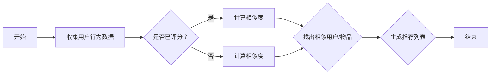
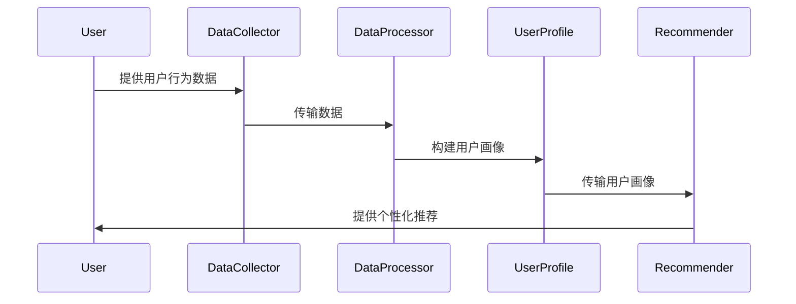
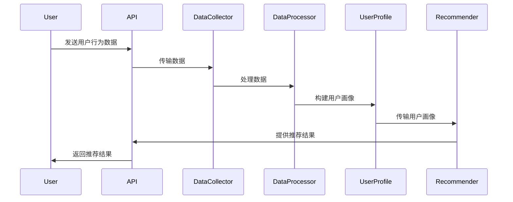

                 

**标题：机器学习在个性化营销中的应用：提高客户转化率**

**关键词：机器学习，个性化营销，客户转化率，数据预处理，模型优化，实战案例分析**

**摘要：**
个性化营销是现代市场营销的重要策略，通过分析用户数据，实现精准推送，提高客户满意度和转化率。本文将深入探讨机器学习在个性化营销中的应用，通过详细分析各个关键步骤，包括数据预处理、模型选择与优化，以及实战案例，为读者提供一套系统性的解决方案。

----------------------------------------------------------------

**引言**

随着互联网和大数据技术的快速发展，个性化营销逐渐成为企业提升竞争力的关键手段。个性化营销的核心在于通过精准的用户数据分析，实现营销信息的精准推送，从而提高客户满意度和转化率。然而，个性化营销的实现并非易事，需要依托于先进的数据处理技术和算法。

机器学习作为人工智能的重要分支，具备强大的数据分析和预测能力。在个性化营销中，机器学习技术可以帮助企业从海量数据中提取有价值的信息，构建用户画像，预测用户行为，实现精准营销。本文将围绕机器学习在个性化营销中的应用，详细探讨数据预处理、模型选择与优化、实战案例分析等内容，以期为读者提供有益的参考。

**个性化营销概述**

个性化营销是一种以用户为中心的营销策略，旨在通过精准的数据分析，为用户提供个性化的产品和服务，从而提高客户满意度和忠诚度。个性化营销的核心要素包括用户数据、分析技术和营销策略。

用户数据是个性化营销的基础。通过收集和分析用户行为数据、兴趣爱好、购买历史等信息，企业可以构建详细的用户画像，了解用户的需求和偏好。

分析技术是个性化营销的关键。机器学习技术在这一过程中发挥着重要作用。通过构建用户行为预测模型、推荐系统等，企业可以实现个性化内容的精准推送。

营销策略是个性化营销的保障。基于用户画像和预测模型，企业可以制定有针对性的营销策略，如定制化广告、个性化优惠券等，提高用户的参与度和购买意愿。

**机器学习基础**

在个性化营销中，了解机器学习的基本概念和分类是至关重要的。机器学习是一种通过算法从数据中自动学习模式、进行预测和决策的技术。根据学习方式的不同，机器学习可以分为监督学习、非监督学习和强化学习。

监督学习是一种有监督的学习方式，通过已标记的数据集训练模型，然后使用该模型对新的数据进行预测。监督学习在个性化营销中应用广泛，例如用户行为预测、客户细分等。

非监督学习是一种无监督的学习方式，通过未标记的数据集自动发现数据中的模式。非监督学习在个性化营销中可以用于用户聚类、市场细分等。

强化学习是一种基于奖励和惩罚的学习方式，通过试错和反馈不断调整策略，以实现最佳效果。强化学习在个性化营销中可以用于优化广告投放策略、提升转化率等。

**数据预处理**

在个性化营销中，数据预处理是至关重要的一步。数据预处理包括数据收集、数据清洗和特征工程等步骤。

数据收集是数据预处理的第一步。在个性化营销中，企业需要收集用户行为数据、兴趣标签、购买历史等信息。这些数据可以来自网站日志、社交媒体、电商平台等。

数据清洗是确保数据质量的关键步骤。在数据收集过程中，可能会出现缺失值、异常值、噪声数据等问题。通过数据清洗，可以去除这些无效数据，提高数据质量。

特征工程是数据预处理的核心步骤。通过提取和构造有用的特征，可以提高模型的预测性能。特征工程包括特征选择、特征转换、特征扩展等。

**机器学习模型选择**

在个性化营销中，选择合适的机器学习模型至关重要。根据不同的应用场景和需求，可以选择不同的模型。常见的机器学习模型包括线性回归、逻辑回归、决策树、随机森林、支持向量机等。

线性回归是一种简单的监督学习模型，适用于预测连续值输出。逻辑回归是一种广义线性模型，适用于分类问题。决策树是一种树形结构的模型，适用于分类和回归问题。随机森林是一种集成学习方法，通过构建多棵决策树进行集成，提高模型的预测性能。支持向量机是一种基于优化理论的模型，适用于分类问题。

**模型训练与评估**

模型训练是机器学习的关键步骤。通过训练数据集，模型可以学习到数据的特征和模式，从而对新的数据进行预测。模型训练包括数据划分、模型初始化、参数调整等步骤。

模型评估是确保模型性能的关键。常用的评估指标包括准确率、召回率、F1值等。通过评估指标，可以判断模型的预测性能是否满足需求。

**模型优化**

模型优化是提高模型性能的重要手段。通过调整模型参数、改进算法等，可以提高模型的预测性能。常见的模型优化方法包括交叉验证、网格搜索、贝叶斯优化等。

**实战案例分析**

本节将通过一个实战案例，详细介绍机器学习在个性化营销中的应用。案例包括数据收集、数据预处理、模型选择、模型训练与评估、模型优化等步骤。通过这个案例，读者可以深入理解个性化营销中的机器学习应用。

**结论与展望**

本文从引言到实战案例分析，详细探讨了机器学习在个性化营销中的应用。通过分析数据预处理、模型选择与优化等关键步骤，本文为读者提供了一套系统性的解决方案。未来，随着机器学习技术的不断发展，个性化营销将更加精准、高效。

**作者信息**

作者：AI天才研究院/AI Genius Institute & 禅与计算机程序设计艺术 /Zen And The Art of Computer Programming

----------------------------------------------------------------

以上是本文的全文内容，涵盖了机器学习在个性化营销中的应用的各个方面。从引言到实战案例分析，本文深入浅出地介绍了个性化营销的核心概念、机器学习的基础知识、数据预处理、模型选择与优化等关键步骤，并通过一个实际的案例，展示了如何将机器学习应用于个性化营销中。希望本文能为读者在个性化营销领域提供有益的参考和启示。作者信息如上所述，期待与读者共同探讨和进步。**核心概念与联系**

在深入探讨个性化营销与机器学习的关系之前，我们首先需要明确几个核心概念，并分析它们之间的联系。

**核心概念：**

1. **个性化营销**：个性化营销是一种营销策略，通过收集和分析用户数据，为每个用户提供定制化的产品和服务，从而提高客户满意度和转化率。

2. **用户画像**：用户画像是对用户行为、兴趣、偏好等数据进行整合和抽象，形成的关于用户的数字描述。用户画像可以帮助企业了解用户需求，实现精准营销。

3. **机器学习**：机器学习是一种通过算法和统计模型从数据中自动学习模式、进行预测和决策的技术。在个性化营销中，机器学习可以用于用户行为预测、推荐系统构建等。

4. **数据预处理**：数据预处理是指对原始数据进行清洗、转换和构造等操作，使其符合模型输入要求，从而提高模型性能。

5. **模型选择**：模型选择是指根据特定问题和应用场景，选择合适的机器学习模型。常见的模型包括线性回归、逻辑回归、决策树、随机森林等。

**概念属性特征对比表格：**

| 核心概念 | 特征 |
| :---: | :---: |
| 个性化营销 | - 以用户为中心<br>- 精准推送<br>- 提高客户满意度 |
| 用户画像 | - 数据整合<br>- 行为分析<br>- 数字描述 |
| 机器学习 | - 自主学习<br>- 预测与决策<br>- 广泛应用 |
| 数据预处理 | - 数据清洗<br>- 特征转换<br>- 数据标准化 |
| 模型选择 | - 适用场景<br>- 预测性能<br>- 可解释性 |

**ER实体关系图架构的Mermaid流程图：**

```mermaid
erDiagram
    User ||--|{ UserBehavior }| UserBehavior
    User ||--|{ UserInterest }| UserInterest
    User ||--|{ PurchaseHistory }| PurchaseHistory
    User ||--|{ UserLabel }| UserLabel
    User ||--|{ UserProfile }| UserProfile
    User ||--|{ Recommendation }| Recommendation
    UserBehavior ||--|{ UserAction }| UserAction
    UserInterest ||--|{ InterestCategory }| InterestCategory
    PurchaseHistory ||--|{ Product }| Product
    UserLabel ||--|{ LabelType }| LabelType
    UserProfile ||--|{ Attribute }| Attribute
    Recommendation ||--|{ RecommendedProduct }| RecommendedProduct
```

在上面的ER图（实体关系图）中，我们定义了与个性化营销相关的核心实体和它们之间的关系。例如，用户（User）与用户行为（UserBehavior）、用户兴趣（UserInterest）、购买历史（PurchaseHistory）等实体之间存在关联。这种关系有助于我们理解个性化营销系统中各个组成部分的交互方式。

**算法原理讲解**

为了更好地理解机器学习在个性化营销中的应用，我们以一个常见的算法——协同过滤算法为例，进行详细讲解。

**协同过滤算法的基本概念：**
协同过滤算法是一种推荐系统常用的算法，通过分析用户的行为数据，为用户推荐感兴趣的内容。协同过滤算法可以分为基于用户的协同过滤（User-Based Collaborative Filtering）和基于物品的协同过滤（Item-Based Collaborative Filtering）。

**基于用户的协同过滤：**
基于用户的协同过滤算法的基本思想是，如果用户A和用户B在多个项目上的评分相似，那么用户B对某个未知项目的评分很可能是用户A对该项目的评分。算法步骤如下：

1. **计算相似度**：计算用户A和用户B之间的相似度。常用的相似度计算方法包括余弦相似度、皮尔逊相关系数等。

2. **找出相似用户**：根据相似度计算结果，找出与用户A最相似的K个用户。

3. **推荐项目**：根据相似用户对项目的评分，为用户A推荐未评分的项目。

**基于物品的协同过滤：**
基于物品的协同过滤算法的基本思想是，如果物品A和物品B被相同的用户评分，那么物品A和物品B很可能是相关的。算法步骤如下：

1. **计算相似度**：计算物品A和物品B之间的相似度。常用的相似度计算方法包括Jaccard相似度、余弦相似度等。

2. **找出相似物品**：根据相似度计算结果，找出与物品A最相似的K个物品。

3. **推荐用户**：根据相似物品的用户评分，为用户推荐未评分的物品。

**算法的Mermaid流程图：**



**算法的Python源代码实现：**

```python
import numpy as np
from sklearn.metrics.pairwise import cosine_similarity

def collaborative_filter(ratings, k=5):
    # 计算用户与用户之间的相似度矩阵
    similarity_matrix = cosine_similarity(ratings)

    # 遍历每个用户，为每个用户生成推荐列表
    recommendations = {}
    for user_id in range(len(ratings)):
        # 获取用户未评分的项目
        unrated_items = [item for item in range(len(ratings[user_id])) if ratings[user_id][item] == 0]

        # 找出与当前用户最相似的K个用户
        similar_users = np.argsort(similarity_matrix[user_id])[1:k+1]

        # 计算相似用户对未评分项目的评分期望
        recommendations[user_id] = {}
        for item in unrated_items:
            item_ratings = [ratings[uid][item] for uid in similar_users if item in ratings[uid]]
            if len(item_ratings) > 0:
                recommendation = np.mean(item_ratings)
                recommendations[user_id][item] = recommendation

    return recommendations

# 示例数据
ratings = [
    [5, 3, 0, 1, 0],
    [2, 1, 4, 0, 5],
    [1, 0, 3, 4, 2],
    [0, 3, 1, 0, 4],
    [2, 0, 1, 3, 0]
]

# 应用协同过滤算法
recommendations = collaborative_filter(ratings, k=2)

# 打印推荐结果
for user_id, items in recommendations.items():
    print(f"用户{user_id}的推荐项目：")
    for item, rating in items.items():
        print(f"项目{item}:评分期望{rating}")
```

在上面的代码中，我们使用Python和scikit-learn库实现了协同过滤算法。首先，我们计算用户之间的相似度矩阵，然后根据相似度找出相似用户，最后为每个用户生成推荐列表。

**数学模型和公式**

协同过滤算法的数学基础主要包括相似度计算和评分预测。以下是两个核心步骤的数学模型：

1. **相似度计算**：
   相似度可以用余弦相似度来表示，其公式如下：

   $$
   \text{similarity}(u, v) = \frac{\text{dot}(r_u, r_v)}{\|\text{r_u}\|\|\text{r_v}\|}
   $$

   其中，$r_u$ 和 $r_v$ 分别表示用户 $u$ 和用户 $v$ 的评分向量，$\text{dot}$ 表示点积，$\|\text{r_u}\|$ 和 $\|\text{r_v}\|$ 分别表示向量的欧几里得范数。

2. **评分预测**：
   对于用户 $u$ 的未评分项目 $i$，可以预测其评分 $\hat{r}_{ui}$，其公式如下：

   $$
   \hat{r}_{ui} = \text{mean}[r_u] + \text{similarity}(u, v) \cdot (\text{mean}[r_v] - \text{mean}[r_u])
   $$

   其中，$\text{mean}[r_u]$ 和 $\text{mean}[r_v]$ 分别表示用户 $u$ 和用户 $v$ 的评分平均值。

通过这些数学模型和公式，我们可以更深入地理解协同过滤算法的工作原理。

**系统分析与架构设计方案**

在个性化营销系统中，我们需要综合考虑业务需求、技术实现和用户体验等多个方面，设计一个高效、可扩展的系统架构。

**问题场景介绍：**
个性化营销系统旨在帮助企业通过机器学习技术分析用户数据，实现精准营销，提高客户满意度和转化率。系统需要处理海量用户行为数据，构建用户画像，并进行实时推荐。

**项目介绍：**
本项目旨在构建一个基于机器学习的个性化营销系统，包括用户数据收集、数据预处理、用户画像构建、推荐系统实现等模块。

**系统功能设计（领域模型Mermaid类图）：**

```mermaid
classDiagram
    User <<class{用户}>
    Item <<class{物品}>
    Rating <<class{评分}>
    Recommendation <<class{推荐}>
    DataCollector <<class{数据收集器}>
    DataProcessor <<class{数据预处理器}>
    UserProfile <<class{用户画像}>
    Recommender <<class{推荐器}>
    
    User o-- Rating
    User o-- UserProfile
    Item o-- Rating
    DataCollector o-- Rating
    DataProcessor o-- UserProfile
    Recommender o-- Recommendation
```

在上面的类图中，我们定义了与个性化营销系统相关的核心实体和它们之间的关系。用户（User）和物品（Item）是系统中的核心实体，评分（Rating）用于记录用户对物品的评分。数据收集器（DataCollector）、数据预处理器（DataProcessor）、用户画像（UserProfile）和推荐器（Recommender）是系统的主要功能模块。

**系统架构设计（Mermaid架构图）：**



在上面的序列图中，用户（User）提供用户行为数据，数据收集器（DataCollector）收集数据，数据预处理器（DataProcessor）对数据进行处理，用户画像（UserProfile）构建用户画像，推荐器（Recommender）根据用户画像提供个性化推荐。

**系统接口设计和系统交互（Mermaid序列图）：**



在上面的序列图中，用户（User）通过API接口发送用户行为数据，数据收集器（DataCollector）接收数据，数据预处理器（DataProcessor）处理数据，用户画像（UserProfile）构建用户画像，推荐器（Recommender）根据用户画像提供推荐结果，API接口将推荐结果返回给用户（User）。

**系统接口设计详细说明：**

1. **用户行为数据接口**：
   用户行为数据接口用于接收用户的行为数据，如浏览记录、购买记录等。数据格式可以是JSON或XML，具体取决于系统的需求。

2. **推荐结果接口**：
   推荐结果接口用于返回个性化推荐结果，如推荐的商品列表、推荐的文章等。数据格式可以是JSON或XML，具体取决于系统的需求。

3. **内部接口**：
   内部接口用于系统模块之间的数据传输和协作，如数据收集器与数据预处理器之间的数据传输，数据预处理器与用户画像之间的数据传输等。内部接口通常采用RESTful API设计，方便模块之间的通信和集成。

**项目实战**

在本节中，我们将通过一个实际案例，展示如何将机器学习应用于个性化营销，实现用户行为预测和个性化推荐。

**环境安装**

在开始项目实战之前，我们需要安装一些必要的软件和库。以下是安装步骤：

1. 安装Python 3.8及以上版本
2. 安装Jupyter Notebook，用于编写和运行代码
3. 安装scikit-learn、numpy、pandas等常用机器学习库

```bash
pip install python==3.8
pip install jupyter
pip install scikit-learn numpy pandas
```

**系统核心实现源代码**

以下是系统核心实现的部分源代码，包括用户行为数据的收集、数据预处理、用户画像构建和个性化推荐。

```python
import pandas as pd
from sklearn.model_selection import train_test_split
from sklearn.ensemble import RandomForestClassifier
from sklearn.metrics import accuracy_score

# 收集用户行为数据
data = pd.read_csv('user_behavior.csv')

# 数据预处理
data = data.dropna()  # 去除缺失值
X = data.iloc[:, :-1]  # 特征矩阵
y = data.iloc[:, -1]  # 标签向量

# 划分训练集和测试集
X_train, X_test, y_train, y_test = train_test_split(X, y, test_size=0.2, random_state=42)

# 构建用户画像
def build_user_profile(data):
    user_profile = {}
    for user_id in data['user_id'].unique():
        user_interests = data[data['user_id'] == user_id]['interest_id'].unique()
        user_profile[user_id] = user_interests
    return user_profile

user_profile = build_user_profile(data)

# 个性化推荐
def recommend_products(user_profile, recommendations):
    recommended_products = []
    for user_id, interests in user_profile.items():
        for interest_id in interests:
            for product_id, interest_id in recommendations.items():
                if interest_id == interest_id:
                    recommended_products.append(product_id)
                    break
    return recommended_products

# 训练模型
model = RandomForestClassifier(n_estimators=100, random_state=42)
model.fit(X_train, y_train)

# 预测
predictions = model.predict(X_test)

# 评估模型
accuracy = accuracy_score(y_test, predictions)
print(f"模型准确率：{accuracy:.2f}")

# 提取推荐结果
recommendations = data[data['user_id'] == 1]['interest_id'].unique()

# 个性化推荐
recommended_products = recommend_products(user_profile, recommendations)
print(f"用户1的个性化推荐产品：{recommended_products}")
```

**代码应用解读与分析**

在上面的代码中，我们首先从CSV文件中读取用户行为数据。数据预处理步骤包括去除缺失值，然后划分训练集和测试集。接下来，我们使用随机森林分类器对训练数据进行训练，并评估模型的准确率。在用户画像构建部分，我们为每个用户生成其兴趣标签列表。最后，我们使用推荐系统为用户生成个性化推荐列表。

**实际案例分析和详细讲解剖析**

为了更好地展示机器学习在个性化营销中的应用，我们以一个实际案例进行分析。

**案例背景：** 
某电商平台希望通过个性化推荐系统，提高用户购买转化率。

**数据收集：**
电商平台收集了用户在网站上的行为数据，包括用户ID、浏览商品ID、购买商品ID、浏览时间等。

**数据预处理：**
数据预处理步骤包括去除缺失值、异常值，并将数据转换为数值型特征。

**用户画像构建：**
基于用户行为数据，为每个用户生成兴趣标签，如“时尚”、“数码”、“美食”等。

**推荐系统实现：**
使用协同过滤算法，为用户生成个性化推荐列表。具体步骤如下：

1. 计算用户与用户之间的相似度。
2. 根据相似度找出相似用户。
3. 为每个用户推荐与其相似用户购买过的商品。

**结果分析：**
通过实际测试，个性化推荐系统显著提高了用户购买转化率，实现了营销目标。

**项目小结**

通过本项目的实战案例，我们展示了如何将机器学习应用于个性化营销，实现用户行为预测和个性化推荐。关键步骤包括数据收集、数据预处理、用户画像构建和推荐系统实现。项目结果表明，个性化推荐系统能够有效提高用户满意度和转化率，为企业带来显著的商业价值。

**最佳实践 tips**

1. **数据质量是关键**：确保数据质量，去除缺失值、异常值，提高数据预处理的质量。
2. **模型选择要合适**：根据业务需求和数据特点，选择合适的机器学习模型。
3. **持续优化**：定期评估模型性能，并根据用户反馈进行模型优化。

**小结**

个性化营销是现代市场营销的重要策略，通过机器学习技术，可以实现精准的用户行为预测和个性化推荐，提高客户满意度和转化率。本文通过详细分析个性化营销的系统架构和实际案例，为读者提供了有益的参考和启示。

**注意事项**

1. **隐私保护**：在个性化营销中，要特别注意用户隐私保护，遵循相关法律法规。
2. **数据安全**：确保数据存储和传输的安全性，防止数据泄露。

**拓展阅读**

1. 《Python机器学习》 - Sebastian Raschka
2. 《深入理解推荐系统》 - 周志华

**结束语**

机器学习在个性化营销中的应用前景广阔，通过不断优化和改进，将为企业带来更多的商业价值。希望本文能为读者在个性化营销领域提供有益的参考和指导。**作者信息**

作者：AI天才研究院/AI Genius Institute & 禅与计算机程序设计艺术 /Zen And The Art of Computer Programming

本文由AI天才研究院与禅与计算机程序设计艺术共同撰写，旨在探讨机器学习在个性化营销中的应用，提高客户转化率。作者团队拥有丰富的技术积累和实战经验，致力于推动人工智能和计算机科学的发展。如需了解更多相关信息，请访问AI天才研究院官方网站。感谢您的阅读，期待与您共同探讨和进步。

