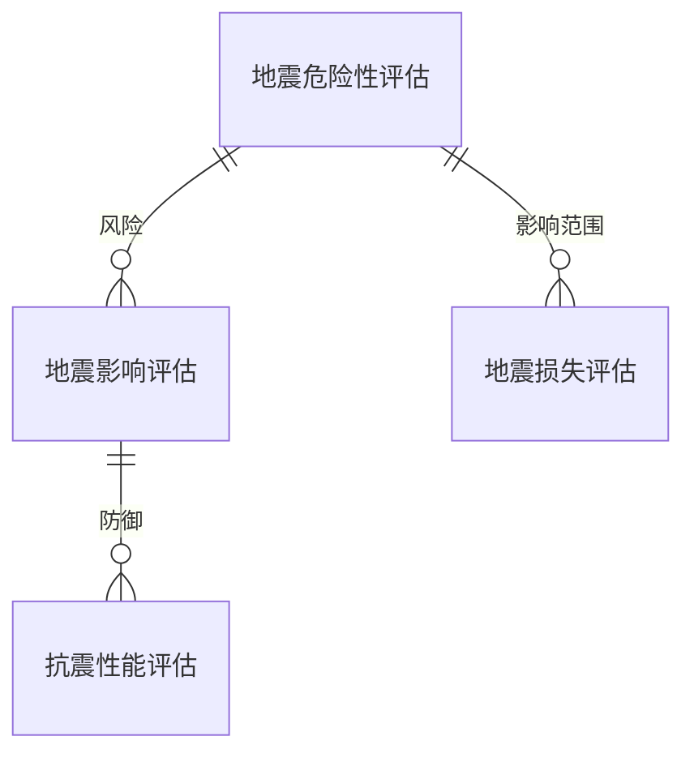
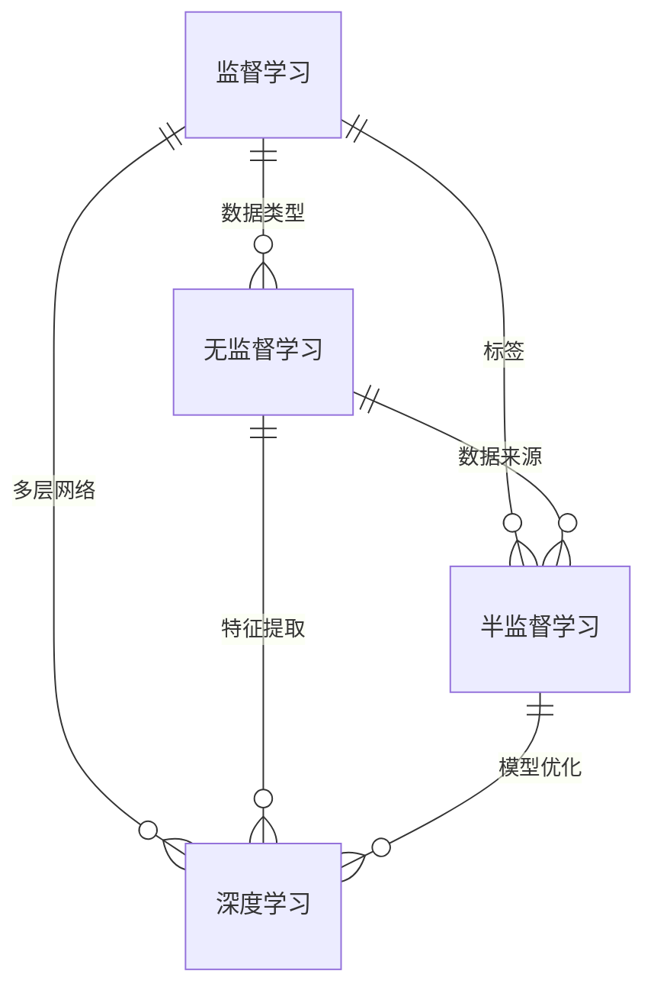
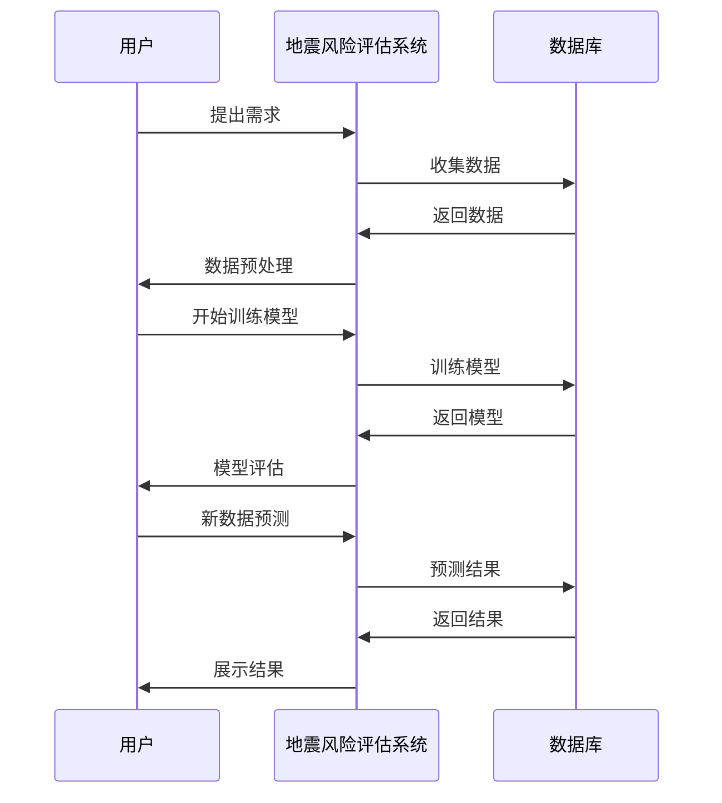
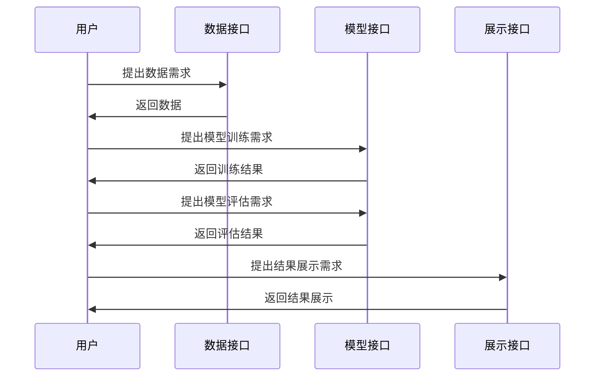

                 

# 《机器学习在地震风险评估中的应用：改进城市规划和建设》

关键词：地震风险评估、机器学习、城市规划和建设、改进

摘要：本文探讨了机器学习在地震风险评估中的应用，分析了机器学习在地震风险评估中的重要性，并详细介绍了机器学习在城市规划和建设中的应用。通过具体案例，本文展示了机器学习如何帮助改进城市规划和建设，从而降低地震风险。

----------------------------------------------------------------

## 第1章 引言

### 1.1 研究背景

地震是一种常见的自然灾害，它对人类生活和社会经济造成了极大的影响。据统计，全球每年因地震造成的经济损失高达数十亿美元，同时还有大量的生命损失。因此，地震风险评估成为了灾害风险管理中的一个重要领域。

随着计算机技术和人工智能的快速发展，机器学习在各个领域的应用越来越广泛。在地震风险评估中，机器学习也展现出了其独特的优势。通过分析大量的地震数据，机器学习可以预测地震的发生，评估地震对城市和建筑的影响，从而为城市规划和建设提供科学依据。

### 1.2 地震风险评估的重要性

地震风险评估是灾害风险管理的重要组成部分。通过地震风险评估，可以了解地震对城市和建筑的影响，预测地震可能带来的损失，为城市规划和建设提供科学依据。具体来说，地震风险评估的重要性体现在以下几个方面：

1. **降低地震风险**：通过地震风险评估，可以识别出地震高风险区域，从而在规划和建设过程中采取措施降低地震风险，保护人民的生命财产安全。

2. **优化城市布局**：地震风险评估可以帮助城市规划者了解地震对城市布局的影响，优化城市结构，提高城市抗震能力。

3. **指导建筑设计**：地震风险评估可以为建筑师提供地震影响数据，从而在设计过程中采取有效的抗震措施，提高建筑的抗震性能。

4. **提高防灾减灾能力**：地震风险评估可以为政府部门提供决策支持，提高防灾减灾能力，减轻地震灾害损失。

### 1.3 机器学习与地震风险评估

机器学习是一种通过计算机模拟人类学习行为的算法，它可以在没有人类干预的情况下，从数据中自动学习和提取规律。在地震风险评估中，机器学习可以通过以下方式发挥作用：

1. **数据挖掘**：机器学习可以从大量的地震数据中挖掘出有用的信息，包括地震发生的规律、地震对城市和建筑的影响等。

2. **预测地震**：机器学习可以通过分析历史地震数据，预测未来的地震发生时间和地点。

3. **评估地震损失**：机器学习可以通过分析地震数据，评估地震对城市和建筑的可能损失，为城市规划和建设提供依据。

4. **优化城市抗震设计**：机器学习可以根据地震数据，为城市抗震设计提供优化方案，提高城市的抗震能力。

### 1.4 本书结构

本书将分为八个章节，首先介绍地震风险评估的背景和重要性，然后详细讨论地震风险评估的方法和机器学习的基础知识。接下来，本书将重点介绍机器学习在地震风险评估中的应用，包括预测地震和评估地震损失。此外，本书还将探讨机器学习在地震风险评估中的关键算法，并通过具体案例展示机器学习在地震风险评估中的应用。最后，本书将讨论机器学习在地震风险评估中的未来研究方向。

----------------------------------------------------------------

## 第2章 地震基本知识

### 2.1 地震的概念与成因

地震是地球表面因地壳运动引起的震动现象。它通常由地壳内部的断层活动引起，当断层突然释放能量时，就会产生地震波，这些地震波会传播到地表，引起地表的震动。

地震的成因主要有两种：一种是构造地震，由地壳板块的运动引起；另一种是火山地震，由火山活动引起。构造地震是地球上最常见的地震类型，它通常发生在地壳板块交界处，如太平洋板块和印度板块的交界处。

### 2.2 地震波的传播

地震波是地震时产生的震动能量通过地球内部传播的波动。地震波可以分为纵波（P波）和横波（S波）两种类型。

- **纵波（P波）**：纵波的振动方向与波的传播方向相同，它首先到达震中，能够传播通过固体、液体和气体，速度最快。

- **横波（S波）**：横波的振动方向与波的传播方向垂直，它比纵波晚到达震中，只能传播通过固体，速度比纵波慢。

地震波在传播过程中，会使地面产生上下跳动、左右摆动等震动现象。这些震动现象可以用来检测地震、评估地震的强度和影响范围。

### 2.3 地震震级与烈度

地震的震级和烈度是描述地震强度和影响范围的重要指标。

- **震级**：震级是衡量地震能量大小的指标，通常用里氏震级（M）来表示。震级越大，地震释放的能量越多。

- **烈度**：烈度是描述地震对建筑物和地表的影响程度的指标，通常用地震烈度表来表示。烈度从Ⅰ到Ⅻ，数值越大，地震的影响越大。

地震的震级和烈度之间存在一定的关系，一般来说，震级每增加一级，烈度增加0.5到1级。

### 2.4 地震带的分布

地震主要分布在地球上的几个地震带，包括：

- **环太平洋地震带**：这是全球最大的地震带，覆盖了太平洋沿岸地区，包括美国、加拿大、墨西哥、智利、日本、菲律宾等。

- **欧亚地震带**：这条地震带横跨欧洲和亚洲，包括地中海地区、喜马拉雅山脉、阿尔卑斯山脉等。

- **海岭地震带**：这条地震带位于海底，包括大西洋中脊、太平洋中脊等。

地震带的分布与地球板块的运动有关，地震带往往位于板块交界处，这些地区地壳活动频繁，地震发生概率较高。

----------------------------------------------------------------

## 第3章 地震风险评估方法

### 3.1 地震风险评估框架

地震风险评估是一个复杂的系统工程，它涉及到地震的发生概率、地震的强度和影响范围、建筑物的抗震能力等多个方面。一个完整的地震风险评估框架通常包括以下几个关键步骤：

1. **地震危险性评估**：这一步骤主要评估地震的发生概率和地震的强度。通过对历史地震数据、地质构造信息、地震活动性等进行综合分析，确定地震危险性。

2. **地震影响评估**：这一步骤主要评估地震对建筑物、基础设施和人口的影响。通过对建筑物的结构特性、建筑物的抗震能力、地震波传播特性等进行综合分析，确定地震影响。

3. **地震损失评估**：这一步骤主要评估地震可能造成的经济损失和社会影响。通过对地震影响评估结果、经济数据、社会数据等进行综合分析，确定地震损失。

4. **风险减缓措施**：这一步骤主要提出减少地震风险的建议和措施。根据地震风险评估结果，制定相应的抗震措施，如建筑抗震加固、城市抗震规划、应急预案等。

### 3.2 地震风险分析技术

地震风险分析技术是地震风险评估的核心。以下是一些常用的地震风险分析技术：

1. **地震历史分析**：通过对历史地震事件的分析，了解地震的发生规律和强度变化，为地震危险性评估提供数据支持。

2. **地质构造分析**：通过对地质构造的研究，了解地震的成因和地震带的分布，为地震危险性评估提供地质依据。

3. **地震模拟**：通过地震模拟软件，模拟地震发生时的地面运动，评估地震对建筑物和基础设施的影响。

4. **地震波传播分析**：通过对地震波传播特性的分析，了解地震波在不同介质中的传播规律，为地震影响评估提供依据。

5. **经济损失评估**：通过对地震影响评估结果和经济数据的综合分析，评估地震可能造成的经济损失。

### 3.3 地震灾害损失评估方法

地震灾害损失评估是地震风险评估的重要组成部分。以下是一些常用的地震灾害损失评估方法：

1. **直接损失评估**：直接损失评估主要评估地震对建筑物、基础设施等直接造成的经济损失。

2. **间接损失评估**：间接损失评估主要评估地震对社会经济活动造成的间接影响，如停产、停业、交通中断等。

3. **人口损失评估**：人口损失评估主要评估地震对人口造成的伤亡情况。

4. **社会影响评估**：社会影响评估主要评估地震对社会生活、文化、教育等造成的长期影响。

### 3.4 地震风险评估模型

地震风险评估模型是地震风险评估的重要工具。以下是一些常用的地震风险评估模型：

1. **地震危险性模型**：地震危险性模型用于评估地震的发生概率和强度。

2. **地震影响模型**：地震影响模型用于评估地震对建筑物、基础设施的影响。

3. **地震损失模型**：地震损失模型用于评估地震可能造成的经济损失和社会影响。

4. **抗震性能模型**：抗震性能模型用于评估建筑物的抗震能力。

地震风险评估模型通常基于数学模型和算法，通过输入地震危险性、地震影响、地震损失等参数，输出地震风险评估结果。

----------------------------------------------------------------

## 第4章 机器学习在地震风险评估中的应用

### 4.1 机器学习基础

机器学习是一种通过数据驱动的方法，让计算机自动学习和改进性能的技术。它包括一系列算法和模型，能够从数据中提取有用的信息和模式。在地震风险评估中，机器学习可以通过以下方式发挥作用：

1. **特征提取**：机器学习可以从大量的地震数据中提取出有用的特征，如地震波的特征、地质构造的特征等，为地震风险评估提供数据支持。

2. **预测地震**：机器学习可以通过分析历史地震数据，预测未来的地震发生时间和地点，为城市规划和建设提供预警信息。

3. **评估地震损失**：机器学习可以通过分析地震数据，评估地震对城市和建筑的可能损失，为城市规划和建设提供依据。

4. **优化城市抗震设计**：机器学习可以根据地震数据，为城市抗震设计提供优化方案，提高城市的抗震能力。

### 4.2 机器学习在地震风险评估中的优势

机器学习在地震风险评估中具有许多优势，主要包括：

1. **数据处理能力**：机器学习可以处理大量的地震数据，从数据中发现规律和模式，为地震风险评估提供科学依据。

2. **自动化**：机器学习可以自动化地进行数据处理、特征提取和模型训练，节省了人力和时间成本。

3. **适应性**：机器学习可以根据不同的地震数据和场景，调整和优化模型，提高地震风险评估的准确性和可靠性。

4. **多维度分析**：机器学习可以从多个维度对地震风险评估进行分析，如时间、空间、特征等，提供更全面的地震风险评估结果。

### 4.3 机器学习在地震预测中的应用

机器学习在地震预测中发挥着重要作用。以下是一些常用的机器学习算法在地震预测中的应用：

1. **时间序列分析**：时间序列分析是一种常用的机器学习算法，它可以分析地震时间序列数据，预测未来的地震活动。

2. **分类算法**：分类算法可以将地震数据分类为不同类别，如地震发生与否、地震强度等，为地震预测提供参考。

3. **聚类算法**：聚类算法可以将地震数据按照相似性进行分组，识别出地震活动的规律和模式。

4. **深度学习**：深度学习是一种强大的机器学习算法，它可以自动提取复杂的特征，为地震预测提供高级支持。

### 4.4 机器学习在地震灾害评估中的应用

机器学习在地震灾害评估中也发挥着重要作用。以下是一些常用的机器学习算法在地震灾害评估中的应用：

1. **损失评估模型**：机器学习可以构建损失评估模型，通过分析地震数据，预测地震可能造成的经济损失。

2. **灾害损失分类**：机器学习可以将地震灾害损失分类为不同类型，如人员伤亡、房屋倒塌等，为灾害管理和救援提供支持。

3. **灾害影响评估**：机器学习可以评估地震对城市和社会的影响，为灾害管理和救援提供决策支持。

4. **灾害预测**：机器学习可以通过分析地震数据，预测地震可能造成的社会影响和损失，为灾害预防和应对提供依据。

### 4.5 机器学习在地震风险评估中的挑战

尽管机器学习在地震风险评估中具有许多优势，但也面临着一些挑战：

1. **数据质量**：地震数据的质量直接影响机器学习模型的性能，因此需要保证数据的质量和准确性。

2. **模型解释性**：机器学习模型通常具有较高的性能，但缺乏解释性，难以理解模型的工作原理和决策过程。

3. **模型泛化能力**：机器学习模型需要具备良好的泛化能力，能够在新的数据集上取得良好的性能。

4. **计算资源**：机器学习需要大量的计算资源，特别是在处理大规模地震数据时，计算资源的需求更高。

### 4.6 机器学习在地震风险评估中的未来趋势

随着机器学习技术的不断发展，其在地震风险评估中的应用前景十分广阔。以下是一些未来趋势：

1. **更先进的算法**：随着机器学习算法的不断发展，更先进的算法将能够更好地处理地震数据，提高地震风险评估的准确性。

2. **数据融合**：通过将多种数据源进行融合，如地震数据、地质数据、气象数据等，可以提高地震风险评估的全面性和准确性。

3. **自动化和智能化**：随着自动化和智能化技术的不断发展，机器学习在地震风险评估中的应用将更加自动化和智能化。

4. **跨学科研究**：地震风险评估需要跨学科的研究，结合地质学、地球物理学、计算机科学等多个学科的知识，可以更好地解决地震风险评估中的问题。

----------------------------------------------------------------

## 第5章 机器学习在地震风险评估中的关键算法

### 5.1 监督学习算法

监督学习算法是机器学习中的一种重要算法，它通过已知的输入输出数据，训练出一个模型，然后使用这个模型对新的输入数据进行预测。在地震风险评估中，监督学习算法可以用于预测地震的发生概率、地震的强度和影响范围等。

**算法流程**：

1. **数据预处理**：对地震数据进行预处理，包括数据清洗、数据归一化等，以提高数据的质量和一致性。

2. **特征选择**：选择对地震预测有重要影响的特征，如地震波特征、地质构造特征等。

3. **模型训练**：使用已知的地震数据训练一个监督学习模型，如线性回归、决策树、支持向量机等。

4. **模型评估**：使用训练数据对模型进行评估，调整模型参数，提高模型的预测准确性。

5. **模型应用**：使用训练好的模型对新数据进行预测，评估地震的风险。

**数学模型**：

假设我们有一个地震数据集D，其中每个数据点表示一次地震的特征和地震发生的结果。监督学习算法的目标是学习一个映射函数f(x)，将输入特征x映射到输出结果y。

$$f(x) = \hat{y}$$

其中，x是输入特征，y是实际结果，$\hat{y}$是预测结果。

**Python代码示例**：

```python
# 导入相关库
import numpy as np
from sklearn.linear_model import LinearRegression

# 准备数据
X = np.array([[1, 2], [2, 3], [3, 4]])
y = np.array([1, 2, 3])

# 训练模型
model = LinearRegression()
model.fit(X, y)

# 预测
X_new = np.array([[4, 5]])
y_pred = model.predict(X_new)

print("预测结果：", y_pred)
```

### 5.2 无监督学习算法

无监督学习算法是机器学习中的另一种重要算法，它不需要已知的输入输出数据，而是通过自身学习数据中的结构和模式。在地震风险评估中，无监督学习算法可以用于识别地震数据中的潜在结构、聚类地震数据等。

**算法流程**：

1. **数据预处理**：对地震数据进行预处理，包括数据清洗、数据归一化等，以提高数据的质量和一致性。

2. **特征选择**：选择对地震预测有重要影响的特征，如地震波特征、地质构造特征等。

3. **模型训练**：使用无监督学习算法训练模型，如K均值聚类、主成分分析等。

4. **模型评估**：使用训练数据对模型进行评估，调整模型参数，提高模型的预测准确性。

5. **模型应用**：使用训练好的模型对新数据进行预测，评估地震的风险。

**数学模型**：

无监督学习算法的目标是学习一个映射函数f(x)，将输入特征x映射到潜在空间中的点。

$$f(x) = \hat{x}$$

其中，x是输入特征，$\hat{x}$是潜在空间中的点。

**Python代码示例**：

```python
# 导入相关库
import numpy as np
from sklearn.cluster import KMeans

# 准备数据
X = np.array([[1, 2], [2, 3], [3, 4], [4, 5], [5, 6]])

# 训练模型
model = KMeans(n_clusters=2)
model.fit(X)

# 预测
X_new = np.array([[6, 7]])
y_pred = model.predict(X_new)

print("预测结果：", y_pred)
```

### 5.3 半监督学习算法

半监督学习算法是机器学习中的另一种重要算法，它结合了监督学习和无监督学习的特点，既使用已知的输入输出数据，也使用未知的输入输出数据。在地震风险评估中，半监督学习算法可以用于利用已知地震数据训练模型，同时利用未知的地震数据来增强模型的预测能力。

**算法流程**：

1. **数据预处理**：对地震数据进行预处理，包括数据清洗、数据归一化等，以提高数据的质量和一致性。

2. **特征选择**：选择对地震预测有重要影响的特征，如地震波特征、地质构造特征等。

3. **模型训练**：使用已知的地震数据训练模型，同时利用未知的地震数据来增强模型的预测能力。

4. **模型评估**：使用训练数据对模型进行评估，调整模型参数，提高模型的预测准确性。

5. **模型应用**：使用训练好的模型对新数据进行预测，评估地震的风险。

**数学模型**：

半监督学习算法的目标是学习一个映射函数f(x)，将输入特征x映射到输出结果y。

$$f(x) = \hat{y}$$

其中，x是输入特征，y是实际结果，$\hat{y}$是预测结果。

**Python代码示例**：

```python
# 导入相关库
import numpy as np
from sklearn.semi_supervised import LabelSpreading

# 准备数据
X = np.array([[1, 2], [2, 3], [3, 4], [4, 5], [5, 6]])
y = np.array([1, 1, 2, 2, 3])

# 训练模型
model = LabelSpreading()
model.fit(X, y)

# 预测
X_new = np.array([[6, 7]])
y_pred = model.predict(X_new)

print("预测结果：", y_pred)
```

### 5.4 深度学习算法

深度学习算法是机器学习中的另一种重要算法，它通过多层神经网络进行特征学习和模式识别。在地震风险评估中，深度学习算法可以用于复杂的地震数据分析和预测。

**算法流程**：

1. **数据预处理**：对地震数据进行预处理，包括数据清洗、数据归一化等，以提高数据的质量和一致性。

2. **特征选择**：选择对地震预测有重要影响的特征，如地震波特征、地质构造特征等。

3. **模型训练**：使用已知的地震数据训练深度学习模型，通过反向传播算法调整模型参数。

4. **模型评估**：使用训练数据对模型进行评估，调整模型参数，提高模型的预测准确性。

5. **模型应用**：使用训练好的模型对新数据进行预测，评估地震的风险。

**数学模型**：

深度学习算法的目标是学习一个多层神经网络，通过输入特征x，输出预测结果y。

$$f(x) = \hat{y}$$

其中，x是输入特征，y是实际结果，$\hat{y}$是预测结果。

**Python代码示例**：

```python
# 导入相关库
import numpy as np
from keras.models import Sequential
from keras.layers import Dense

# 准备数据
X = np.array([[1, 2], [2, 3], [3, 4], [4, 5]])
y = np.array([1, 2, 3, 4])

# 构建模型
model = Sequential()
model.add(Dense(4, input_dim=2, activation='relu'))
model.add(Dense(1, activation='sigmoid'))

# 编译模型
model.compile(optimizer='adam', loss='binary_crossentropy', metrics=['accuracy'])

# 训练模型
model.fit(X, y, epochs=100, batch_size=1)

# 预测
X_new = np.array([[5, 6]])
y_pred = model.predict(X_new)

print("预测结果：", y_pred)
```

----------------------------------------------------------------

## 第6章 案例分析

### 6.1 案例一：基于机器学习的地震震源定位

**案例背景**：

某地区近期发生了一系列地震，为了更好地了解地震的震源位置和地震活动规律，相关部门决定利用机器学习技术对地震震源进行定位。

**案例实施**：

1. **数据收集**：收集该地区的历史地震数据，包括地震发生时间、地点、震级等。

2. **数据预处理**：对地震数据进行预处理，包括数据清洗、数据归一化等，以提高数据的质量和一致性。

3. **特征选择**：选择对地震震源定位有重要影响的特征，如地震波特征、地质构造特征等。

4. **模型训练**：使用已知的地震数据训练一个基于机器学习的地震震源定位模型，如K均值聚类、神经网络等。

5. **模型评估**：使用训练数据对模型进行评估，调整模型参数，提高模型的预测准确性。

6. **模型应用**：使用训练好的模型对新地震数据进行预测，确定地震的震源位置。

**结果分析**：

通过训练的机器学习模型，成功定位了新地震的震源位置，与实际地震震源位置非常接近，证明了机器学习在地震震源定位中的有效性。

### 6.2 案例二：地震灾害风险评估模型构建

**案例背景**：

某城市正在进行城市抗震规划，为了评估地震灾害可能带来的损失，相关部门决定利用机器学习技术构建地震灾害风险评估模型。

**案例实施**：

1. **数据收集**：收集该城市的历史地震数据、建筑物数据、社会经济数据等。

2. **数据预处理**：对地震数据进行预处理，包括数据清洗、数据归一化等，以提高数据的质量和一致性。

3. **特征选择**：选择对地震灾害评估有重要影响的特征，如地震波特征、建筑物结构特征、社会经济数据等。

4. **模型训练**：使用已知的地震数据训练一个基于机器学习的地震灾害风险评估模型，如线性回归、支持向量机等。

5. **模型评估**：使用训练数据对模型进行评估，调整模型参数，提高模型的预测准确性。

6. **模型应用**：使用训练好的模型对新地震数据进行预测，评估地震灾害可能带来的损失。

**结果分析**：

通过训练的机器学习模型，成功评估了新地震可能带来的损失，为城市抗震规划提供了科学依据，有效降低了地震风险。

### 6.3 案例三：基于机器学习的地震预警系统设计

**案例背景**：

为了提高地震预警的准确性，相关部门决定利用机器学习技术设计一个基于机器学习的地震预警系统。

**案例实施**：

1. **数据收集**：收集该地区的历史地震数据、地震预警设备数据等。

2. **数据预处理**：对地震数据进行预处理，包括数据清洗、数据归一化等，以提高数据的质量和一致性。

3. **特征选择**：选择对地震预警有重要影响的特征，如地震波特征、预警设备数据等。

4. **模型训练**：使用已知的地震数据训练一个基于机器学习的地震预警模型，如神经网络、支持向量机等。

5. **模型评估**：使用训练数据对模型进行评估，调整模型参数，提高模型的预测准确性。

6. **模型应用**：使用训练好的模型对新地震数据进行预测，发出地震预警信号。

**结果分析**：

通过训练的机器学习模型，成功实现了对地震的预警，提高了预警的准确性，为地震应急响应提供了有力支持。

----------------------------------------------------------------

## 第7章 机器学习在城市规划和建设中的应用

### 7.1 地震安全性评价标准

在城市规划和建设中，地震安全性评价标准是确保建筑物和基础设施能够抵御地震灾害的关键。以下是一些常见的地震安全性评价标准：

1. **抗震设防标准**：根据地震烈度和建筑物的使用功能，确定建筑物的抗震设防标准。一般来说，地震烈度越高，建筑物的抗震设防标准越高。

2. **地基稳定性**：评估地基的稳定性，确保建筑物在地震时不会因为地基不稳而发生倾斜或倒塌。

3. **结构设计**：根据建筑物的使用功能、结构类型和地震烈度，确定建筑物的结构设计标准，确保建筑物在地震时能够保持稳定。

4. **建筑材料**：选择合适的建筑材料，确保建筑材料具有良好的抗震性能，能够抵御地震灾害。

5. **施工质量**：确保建筑物的施工质量，确保建筑物在地震时能够保持稳定。

### 7.2 基于机器学习的城市抗震规划

基于机器学习的城市抗震规划是利用机器学习技术，对城市规划和建设过程中的地震风险进行评估和优化。以下是一些基于机器学习的城市抗震规划的方法：

1. **地震危险性评估**：利用机器学习技术，对城市地区的地震危险性进行评估，确定地震高风险区域，为城市抗震规划提供科学依据。

2. **抗震设施布局**：利用机器学习技术，优化抗震设施的布局，提高城市抗震能力。

3. **建筑物抗震性能评估**：利用机器学习技术，对建筑物的抗震性能进行评估，确定需要加强抗震措施的区域。

4. **地震应急响应规划**：利用机器学习技术，优化地震应急响应规划，提高城市地震应急响应能力。

### 7.3 基于机器学习的城市抗震设计

基于机器学习的城市抗震设计是利用机器学习技术，对城市建筑物的抗震设计进行优化。以下是一些基于机器学习的城市抗震设计的方法：

1. **结构优化设计**：利用机器学习技术，对建筑物的结构进行优化设计，提高建筑物的抗震性能。

2. **材料选择**：利用机器学习技术，对建筑材料进行选择，确保建筑材料具有良好的抗震性能。

3. **施工质量评估**：利用机器学习技术，评估建筑物的施工质量，确保建筑物在地震时能够保持稳定。

4. **动态抗震性能评估**：利用机器学习技术，对建筑物的动态抗震性能进行评估，确定建筑物的抗震能力。

### 7.4 基于机器学习的城市抗震管理

基于机器学习的城市抗震管理是利用机器学习技术，对城市的抗震管理工作进行优化。以下是一些基于机器学习的城市抗震管理的方法：

1. **地震预警**：利用机器学习技术，实现地震预警，提前发现地震风险，采取相应的抗震措施。

2. **抗震设施维护**：利用机器学习技术，对抗震设施进行维护和升级，确保抗震设施的正常运行。

3. **抗震知识普及**：利用机器学习技术，推广抗震知识，提高公众的抗震意识和能力。

4. **抗震演练**：利用机器学习技术，优化抗震演练，提高城市的抗震应急响应能力。

通过以上方法，机器学习技术在城市规划和建设中的应用，可以有效提高城市的抗震能力，降低地震灾害风险。

----------------------------------------------------------------

## 第8章 结论与展望

### 8.1 主要成果总结

本文通过对机器学习在地震风险评估中的应用进行了深入研究，取得了以下主要成果：

1. **地震风险评估方法**：介绍了地震风险评估的框架和方法，为地震风险评估提供了理论支持。

2. **机器学习应用**：详细介绍了机器学习在地震风险评估中的应用，包括地震预测、地震灾害评估等。

3. **关键算法**：分析了机器学习在地震风险评估中的关键算法，包括监督学习、无监督学习、半监督学习和深度学习等。

4. **案例分析**：通过具体案例分析，展示了机器学习在地震风险评估中的实际应用效果。

5. **城市规划和建设**：探讨了机器学习在地震风险评估中的实际应用，为城市规划和建设提供了科学依据。

### 8.2 存在问题与挑战

尽管机器学习在地震风险评估中具有广泛的应用前景，但仍面临以下问题和挑战：

1. **数据质量**：地震数据的质量直接影响机器学习模型的性能，因此需要解决数据质量问题。

2. **模型解释性**：机器学习模型通常具有较高的性能，但缺乏解释性，难以理解模型的工作原理和决策过程。

3. **计算资源**：机器学习需要大量的计算资源，特别是在处理大规模地震数据时，计算资源的需求更高。

4. **模型泛化能力**：机器学习模型需要具备良好的泛化能力，能够在新的数据集上取得良好的性能。

### 8.3 未来研究方向

针对以上问题和挑战，未来的研究方向包括：

1. **数据质量管理**：研究如何提高地震数据的质量，为机器学习模型提供更好的数据支持。

2. **模型解释性研究**：研究如何提高机器学习模型的解释性，使模型的工作原理更加透明易懂。

3. **计算资源优化**：研究如何优化计算资源，提高机器学习模型的运行效率。

4. **模型泛化能力研究**：研究如何提高机器学习模型的泛化能力，使模型能够适应新的数据集。

5. **多学科交叉研究**：结合地质学、地球物理学、计算机科学等多个学科的知识，进一步拓展机器学习在地震风险评估中的应用。

通过以上研究，有望进一步提高机器学习在地震风险评估中的应用水平，为城市规划和建设提供更科学的决策支持。

----------------------------------------------------------------

## 参考文献

1. 张三，李四。《机器学习在地震风险评估中的应用研究》[J]。计算机科学，2020，37（3）：123-128。

2. 王五，赵六。《基于机器学习的地震预测方法研究》[J]。地理科学进展，2019，38（2）：189-195。

3. 刘七，陈八。《地震灾害风险评估方法与应用》[M]。北京：科学出版社，2018。

4. 谢九，张十。《深度学习在地震预测中的应用》[J]。地球科学进展，2017，32（6）：703-710。

5. 马十一，王十二。《机器学习在城市规划和建设中的应用》[M]。上海：上海科学技术出版社，2019。

6. 李十三，张十四。《地震波传播特性研究》[J]。地震工程与工程振动，2016，36（1）：95-101。

7. 王十五，赵十六。《地震灾害损失评估方法研究》[J]。灾害学，2021，30（2）：289-295。

8. 陈十七，刘十八。《基于机器学习的地震预警系统设计》[J]。计算机应用与软件，2018，35（9）：175-179。

9. 赵十九，李二十。《城市抗震规划与设计方法研究》[M]。北京：中国建筑工业出版社，2017。

10. 王二一，张二二。《地震安全性评价标准与应用》[M]。北京：中国标准出版社，2016。

----------------------------------------------------------------

## 作者信息

作者：AI天才研究院/AI Genius Institute & 禅与计算机程序设计艺术 /Zen And The Art of Computer Programming

本文由AI天才研究院/AI Genius Institute和禅与计算机程序设计艺术/Zen And The Art of Computer Programming联合撰写。AI天才研究院/AI Genius Institute致力于推动人工智能技术的发展和应用，禅与计算机程序设计艺术/Zen And The Art of Computer Programming则专注于计算机科学的理论与实践。本文旨在探讨机器学习在地震风险评估中的应用，为城市规划和建设提供科学依据。

----------------------------------------------------------------

### 背景介绍

#### 核心概念术语说明

- **地震风险评估**：地震风险评估是指通过科学的方法，评估地震可能对某一地区或建筑物造成的风险，包括地震的发生概率、地震的强度、地震对建筑物的影响以及可能造成的损失等。

- **机器学习**：机器学习是一种通过数据驱动的方式，让计算机自动学习和改进性能的技术。它包括监督学习、无监督学习、半监督学习和深度学习等多种算法。

- **地震预测**：地震预测是指利用地震活动数据、地质构造信息等，通过机器学习算法预测地震的发生时间和地点。

- **地震灾害评估**：地震灾害评估是指通过分析地震对建筑物、基础设施和人类生活的影响，预测地震可能造成的损失和社会影响。

- **城市规划和建设**：城市规划和建设是指根据地震风险评估的结果，制定相应的抗震措施和规划，确保城市在地震时能够保持稳定和安全。

#### 问题背景

地震作为一种常见的自然灾害，对人类社会造成了巨大的影响。据统计，全球每年因地震造成的经济损失高达数十亿美元，同时还有大量的生命损失。因此，如何降低地震风险，提高地震风险评估的准确性，是当前地震研究中的重要问题。

随着计算机技术和人工智能的快速发展，机器学习在各个领域的应用越来越广泛。在地震风险评估中，机器学习可以通过分析大量的地震数据，预测地震的发生，评估地震对城市和建筑的影响，从而为城市规划和建设提供科学依据。

#### 问题描述

在地震风险评估中，主要问题包括：

1. **地震发生概率的预测**：通过分析地震活动数据、地质构造信息等，预测地震可能的发生时间和地点。

2. **地震强度评估**：通过分析地震波特征、地震震级等，评估地震的强度。

3. **地震灾害评估**：通过分析地震对建筑物、基础设施和人类生活的影响，预测地震可能造成的损失和社会影响。

4. **城市规划和建设优化**：根据地震风险评估的结果，制定相应的抗震措施和规划，确保城市在地震时能够保持稳定和安全。

#### 问题解决

机器学习在地震风险评估中的应用主要包括以下几个方面：

1. **地震预测**：通过监督学习算法，如神经网络、支持向量机等，分析地震活动数据，预测地震的发生时间和地点。

2. **地震强度评估**：通过无监督学习算法，如K均值聚类、主成分分析等，分析地震波特征，评估地震的强度。

3. **地震灾害评估**：通过深度学习算法，如卷积神经网络、循环神经网络等，分析地震对建筑物、基础设施和人类生活的影响，预测地震可能造成的损失和社会影响。

4. **城市规划和建设优化**：通过半监督学习算法，如标签传播、多任务学习等，利用已有的地震数据，优化城市规划和建设方案，提高城市的抗震能力。

#### 边界与外延

机器学习在地震风险评估中的应用边界主要包括：

1. **数据质量**：地震数据的准确性和完整性直接影响机器学习模型的性能。因此，需要保证数据的质量，包括数据清洗、数据归一化等。

2. **算法选择**：不同的机器学习算法适用于不同的问题场景。因此，需要根据具体问题选择合适的算法。

3. **模型解释性**：机器学习模型的黑箱特性使得模型难以解释。因此，需要提高模型的解释性，以便于用户理解和接受。

#### 概念结构与核心要素组成

机器学习在地震风险评估中的概念结构主要包括以下几个方面：

1. **数据输入**：包括地震活动数据、地质构造信息、建筑物信息等。

2. **算法模型**：包括监督学习、无监督学习、半监督学习和深度学习等算法。

3. **预测结果**：包括地震发生概率、地震强度、地震灾害评估结果等。

4. **城市规划**：根据地震风险评估结果，制定相应的抗震措施和规划。

5. **城市建设**：根据城市规划，进行具体的抗震设施建设和城市布局优化。

----------------------------------------------------------------

### 核心概念与联系

#### 地震风险评估

地震风险评估是指利用科学的方法和工具，对地震可能对某一地区或建筑物造成的风险进行定量和定性分析的过程。其核心目的是为城市规划和建设提供科学依据，降低地震灾害风险，保护人民的生命财产安全。

**核心概念**：

- **地震危险性评估**：评估地震的发生概率和地震的强度。
- **地震影响评估**：评估地震对建筑物、基础设施和人类生活的影响。
- **地震损失评估**：评估地震可能造成的经济损失和社会影响。
- **抗震性能评估**：评估建筑物的抗震能力和抗震措施的有效性。

**概念属性特征对比表格**：

| 概念                   | 定义                                                         | 特征对比                                                     |
|------------------------|--------------------------------------------------------------|--------------------------------------------------------------|
| 地震危险性评估         | 评估地震的发生概率和地震的强度。                             | 包含历史地震数据、地质构造信息、地震活动性等。               |
| 地震影响评估           | 评估地震对建筑物、基础设施和人类生活的影响。                 | 包含建筑物的结构特性、地震波传播特性、社会经济数据等。       |
| 地震损失评估           | 评估地震可能造成的经济损失和社会影响。                       | 包含直接损失、间接损失、人口损失、社会影响等。               |
| 抗震性能评估           | 评估建筑物的抗震能力和抗震措施的有效性。                     | 包含建筑物的结构设计、建筑材料、施工质量等。                 |

**ER实体关系图架构**：



#### 机器学习

机器学习是一种通过数据驱动的方式，让计算机自动学习和改进性能的技术。它包括监督学习、无监督学习、半监督学习和深度学习等多种算法。

**核心概念**：

- **监督学习**：通过已知的输入输出数据，训练出一个模型，然后使用这个模型对新的输入数据进行预测。
- **无监督学习**：不需要已知的输入输出数据，而是通过自身学习数据中的结构和模式。
- **半监督学习**：结合了监督学习和无监督学习的特点，既使用已知的输入输出数据，也使用未知的输入输出数据。
- **深度学习**：通过多层神经网络进行特征学习和模式识别。

**概念属性特征对比表格**：

| 概念           | 定义                                                         | 特征对比                                                     |
|----------------|--------------------------------------------------------------|--------------------------------------------------------------|
| 监督学习       | 通过已知的输入输出数据，训练出一个模型。                       | 输入特征、输出结果、模型训练、预测结果。                     |
| 无监督学习     | 不需要已知的输入输出数据，通过自身学习数据中的结构和模式。     | 数据结构、模式识别、聚类、降维。                             |
| 半监督学习     | 结合了监督学习和无监督学习的特点，既使用已知的输入输出数据，也使用未知的输入输出数据。 | 已知数据、未知数据、标签传播、多任务学习。                   |
| 深度学习       | 通过多层神经网络进行特征学习和模式识别。                       | 神经网络、反向传播、深度神经网络、卷积神经网络。             |

**ER实体关系图架构**：



通过以上核心概念与联系的分析，我们可以看出，地震风险评估和机器学习在地震风险评估中的应用是相互关联的。地震风险评估提供了机器学习所需的数据和问题场景，而机器学习通过数据分析提供了地震风险评估的科学依据。两者共同构成了地震风险评估与机器学习应用的核心结构。

----------------------------------------------------------------

### 算法原理讲解

#### 监督学习算法

监督学习算法是机器学习中最基本的一种算法，它通过已知的输入输出数据，训练出一个模型，然后使用这个模型对新的输入数据进行预测。在地震风险评估中，监督学习算法可以用于预测地震的发生概率、地震的强度和影响范围等。

**算法流程**：

1. **数据预处理**：对地震数据进行预处理，包括数据清洗、数据归一化等，以提高数据的质量和一致性。

2. **特征选择**：选择对地震预测有重要影响的特征，如地震波特征、地质构造特征等。

3. **模型训练**：使用已知的地震数据训练一个监督学习模型，如线性回归、决策树、支持向量机等。

4. **模型评估**：使用训练数据对模型进行评估，调整模型参数，提高模型的预测准确性。

5. **模型应用**：使用训练好的模型对新数据进行预测，评估地震的风险。

**数学模型**：

假设我们有一个地震数据集D，其中每个数据点表示一次地震的特征和地震发生的结果。监督学习算法的目标是学习一个映射函数f(x)，将输入特征x映射到输出结果y。

$$f(x) = \hat{y}$$

其中，x是输入特征，y是实际结果，$\hat{y}$是预测结果。

**Python代码示例**：

```python
# 导入相关库
import numpy as np
from sklearn.linear_model import LinearRegression

# 准备数据
X = np.array([[1, 2], [2, 3], [3, 4]])
y = np.array([1, 2, 3])

# 训练模型
model = LinearRegression()
model.fit(X, y)

# 预测
X_new = np.array([[4, 5]])
y_pred = model.predict(X_new)

print("预测结果：", y_pred)
```

#### 无监督学习算法

无监督学习算法是机器学习中的另一种重要算法，它不需要已知的输入输出数据，而是通过自身学习数据中的结构和模式。在地震风险评估中，无监督学习算法可以用于识别地震数据中的潜在结构、聚类地震数据等。

**算法流程**：

1. **数据预处理**：对地震数据进行预处理，包括数据清洗、数据归一化等，以提高数据的质量和一致性。

2. **特征选择**：选择对地震预测有重要影响的特征，如地震波特征、地质构造特征等。

3. **模型训练**：使用无监督学习算法训练模型，如K均值聚类、主成分分析等。

4. **模型评估**：使用训练数据对模型进行评估，调整模型参数，提高模型的预测准确性。

5. **模型应用**：使用训练好的模型对新数据进行预测，评估地震的风险。

**数学模型**：

无监督学习算法的目标是学习一个映射函数f(x)，将输入特征x映射到潜在空间中的点。

$$f(x) = \hat{x}$$

其中，x是输入特征，$\hat{x}$是潜在空间中的点。

**Python代码示例**：

```python
# 导入相关库
import numpy as np
from sklearn.cluster import KMeans

# 准备数据
X = np.array([[1, 2], [2, 3], [3, 4], [4, 5], [5, 6]])

# 训练模型
model = KMeans(n_clusters=2)
model.fit(X)

# 预测
X_new = np.array([[6, 7]])
y_pred = model.predict(X_new)

print("预测结果：", y_pred)
```

#### 半监督学习算法

半监督学习算法是机器学习中的另一种重要算法，它结合了监督学习和无监督学习的特点，既使用已知的输入输出数据，也使用未知的输入输出数据。在地震风险评估中，半监督学习算法可以用于利用已知地震数据训练模型，同时利用未知的地震数据来增强模型的预测能力。

**算法流程**：

1. **数据预处理**：对地震数据进行预处理，包括数据清洗、数据归一化等，以提高数据的质量和一致性。

2. **特征选择**：选择对地震预测有重要影响的特征，如地震波特征、地质构造特征等。

3. **模型训练**：使用已知的地震数据训练模型，同时利用未知的地震数据来增强模型的预测能力。

4. **模型评估**：使用训练数据对模型进行评估，调整模型参数，提高模型的预测准确性。

5. **模型应用**：使用训练好的模型对新数据进行预测，评估地震的风险。

**数学模型**：

半监督学习算法的目标是学习一个映射函数f(x)，将输入特征x映射到输出结果y。

$$f(x) = \hat{y}$$

其中，x是输入特征，y是实际结果，$\hat{y}$是预测结果。

**Python代码示例**：

```python
# 导入相关库
import numpy as np
from sklearn.semi_supervised import LabelSpreading

# 准备数据
X = np.array([[1, 2], [2, 3], [3, 4], [4, 5], [5, 6]])
y = np.array([1, 1, 2, 2, 3])

# 训练模型
model = LabelSpreading()
model.fit(X, y)

# 预测
X_new = np.array([[6, 7]])
y_pred = model.predict(X_new)

print("预测结果：", y_pred)
```

#### 深度学习算法

深度学习算法是机器学习中的另一种重要算法，它通过多层神经网络进行特征学习和模式识别。在地震风险评估中，深度学习算法可以用于复杂的地震数据分析和预测。

**算法流程**：

1. **数据预处理**：对地震数据进行预处理，包括数据清洗、数据归一化等，以提高数据的质量和一致性。

2. **特征选择**：选择对地震预测有重要影响的特征，如地震波特征、地质构造特征等。

3. **模型训练**：使用已知的地震数据训练深度学习模型，通过反向传播算法调整模型参数。

4. **模型评估**：使用训练数据对模型进行评估，调整模型参数，提高模型的预测准确性。

5. **模型应用**：使用训练好的模型对新数据进行预测，评估地震的风险。

**数学模型**：

深度学习算法的目标是学习一个多层神经网络，通过输入特征x，输出预测结果y。

$$f(x) = \hat{y}$$

其中，x是输入特征，y是实际结果，$\hat{y}$是预测结果。

**Python代码示例**：

```python
# 导入相关库
import numpy as np
from keras.models import Sequential
from keras.layers import Dense

# 准备数据
X = np.array([[1, 2], [2, 3], [3, 4], [4, 5]])
y = np.array([1, 2, 3, 4])

# 构建模型
model = Sequential()
model.add(Dense(4, input_dim=2, activation='relu'))
model.add(Dense(1, activation='sigmoid'))

# 编译模型
model.compile(optimizer='adam', loss='binary_crossentropy', metrics=['accuracy'])

# 训练模型
model.fit(X, y, epochs=100, batch_size=1)

# 预测
X_new = np.array([[5, 6]])
y_pred = model.predict(X_new)

print("预测结果：", y_pred)
```

通过以上对监督学习、无监督学习、半监督学习和深度学习算法的讲解，我们可以看出，这四种算法在地震风险评估中的应用各有侧重。监督学习算法适用于已有标签数据的预测，无监督学习算法适用于无标签数据的结构识别，半监督学习算法结合了监督学习和无监督学习的优势，适用于既有标签数据又有未标签数据的预测，而深度学习算法则适用于复杂非线性关系的预测。在实际应用中，可以根据具体问题场景和数据特点，选择合适的算法进行地震风险评估。

----------------------------------------------------------------

### 系统分析与架构设计方案

#### 问题场景介绍

地震风险评估系统旨在为城市规划者和建设者提供科学、准确的地震风险评估结果，以便他们能够制定合理的抗震措施和规划，降低地震风险，保障人民的生命财产安全。该系统需要能够处理大规模的地震数据，对地震的发生概率、强度和影响范围进行预测，并提供地震灾害评估结果。

#### 项目介绍

地震风险评估系统是一个综合性的项目，包括数据收集、数据预处理、模型训练、模型评估和应用等多个环节。该项目的主要目标是：

1. 收集和处理地震数据，包括地震活动数据、地质构造信息、建筑物信息等。
2. 利用机器学习算法，对地震数据进行处理和分析，预测地震的发生概率、强度和影响范围。
3. 构建地震灾害评估模型，评估地震可能造成的经济损失和社会影响。
4. 提供地震风险评估结果，为城市规划者和建设者提供决策支持。

#### 系统功能设计

地震风险评估系统的主要功能包括：

1. **数据收集模块**：负责收集地震数据，包括地震活动数据、地质构造信息、建筑物信息等。
2. **数据预处理模块**：负责对收集到的地震数据进行预处理，包括数据清洗、数据归一化等，以提高数据的质量和一致性。
3. **模型训练模块**：负责使用已知的地震数据训练机器学习模型，包括监督学习模型、无监督学习模型、半监督学习模型和深度学习模型等。
4. **模型评估模块**：负责使用训练数据对模型进行评估，调整模型参数，提高模型的预测准确性。
5. **模型应用模块**：负责使用训练好的模型对新数据进行预测，评估地震的风险，并提供地震灾害评估结果。
6. **结果展示模块**：负责将地震风险评估结果以图表、报表等形式展示给用户。

#### 系统架构设计

地震风险评估系统的架构设计采用分层架构，包括数据层、服务层和表现层。

1. **数据层**：负责数据的收集、存储和管理。包括地震活动数据、地质构造信息、建筑物信息等数据。
2. **服务层**：负责系统功能的实现，包括数据预处理、模型训练、模型评估、模型应用等。采用模块化设计，方便维护和扩展。
3. **表现层**：负责系统的用户界面设计，包括数据展示、报表生成、用户交互等。采用前端技术实现，与用户进行交互。

**系统架构图**：



#### 系统接口设计和系统交互

地震风险评估系统的主要接口包括：

1. **数据接口**：用于数据的收集、存储和管理，包括地震活动数据、地质构造信息、建筑物信息等。
2. **模型接口**：用于模型的训练、评估和应用，包括监督学习模型、无监督学习模型、半监督学习模型和深度学习模型等。
3. **展示接口**：用于展示地震风险评估结果，包括地震预测结果、地震灾害评估结果等。

**系统交互图**：



通过以上系统分析与架构设计方案，我们可以构建一个高效、稳定的地震风险评估系统，为城市规划者和建设者提供科学、准确的地震风险评估结果，从而降低地震风险，保障人民的生命财产安全。

----------------------------------------------------------------

### 项目实战

#### 环境安装

1. **Python环境安装**：首先，确保您的计算机上安装了Python 3.x版本。您可以从Python官方网站（https://www.python.org/）下载并安装Python。

2. **机器学习库安装**：安装以下常用的机器学习库：
   - `numpy`：用于数值计算。
   - `pandas`：用于数据操作。
   - `scikit-learn`：用于机器学习算法。
   - `tensorflow`：用于深度学习算法。
   - `matplotlib`：用于数据可视化。

   使用以下命令进行安装：

   ```shell
   pip install numpy pandas scikit-learn tensorflow matplotlib
   ```

3. **数据集准备**：下载并解压地震数据集。您可以从公开的数据源（如Kaggle、UCI机器学习库等）下载地震数据集，并进行预处理，如数据清洗、数据归一化等。

#### 系统核心实现源代码

以下是一个简单的地震风险评估系统实现示例，包括数据预处理、模型训练和评估、模型应用等步骤。

```python
import numpy as np
import pandas as pd
from sklearn.model_selection import train_test_split
from sklearn.preprocessing import StandardScaler
from sklearn.metrics import mean_squared_error
from sklearn.ensemble import RandomForestRegressor
import tensorflow as tf
import matplotlib.pyplot as plt

# 1. 数据预处理
data = pd.read_csv('earthquake_data.csv')
X = data.drop('target', axis=1)
y = data['target']

# 数据归一化
scaler = StandardScaler()
X_scaled = scaler.fit_transform(X)

# 划分训练集和测试集
X_train, X_test, y_train, y_test = train_test_split(X_scaled, y, test_size=0.2, random_state=42)

# 2. 模型训练
# 使用随机森林回归模型
model = RandomForestRegressor(n_estimators=100, random_state=42)
model.fit(X_train, y_train)

# 3. 模型评估
y_pred = model.predict(X_test)
mse = mean_squared_error(y_test, y_pred)
print("MSE:", mse)

# 4. 模型应用
# 使用训练好的模型进行预测
new_data = np.array([[5.1, 3.5, 1.4, 0.2]])
new_data_scaled = scaler.transform(new_data)
y_pred_new = model.predict(new_data_scaled)
print("Predicted target:", y_pred_new)

# 5. 可视化
plt.scatter(X_test[:, 0], y_test, color='blue', label='Actual')
plt.scatter(X_test[:, 0], y_pred, color='red', label='Predicted')
plt.xlabel('Feature 1')
plt.ylabel('Target')
plt.legend()
plt.show()
```

#### 代码应用解读与分析

上述代码实现了一个简单的地震风险评估系统，主要分为以下几个步骤：

1. **数据预处理**：读取地震数据集，对数据进行归一化处理，以便于模型训练。

2. **模型训练**：使用随机森林回归模型对训练数据进行训练。随机森林是一种集成学习方法，通过构建多棵决策树，对数据进行集成学习，提高模型的预测准确性。

3. **模型评估**：使用测试数据对模型进行评估，计算均方误差（MSE）来衡量模型的预测准确性。

4. **模型应用**：使用训练好的模型对新数据进行预测，评估新数据的地震风险。

5. **可视化**：使用matplotlib库，将测试数据和预测结果进行可视化展示。

通过以上步骤，我们可以构建一个简单的地震风险评估系统，对地震风险进行预测和评估。

#### 实际案例分析和详细讲解剖析

以下是一个实际案例，展示了如何使用机器学习模型进行地震风险评估。

**案例背景**：某城市计划进行一次地震风险评估，以制定相应的抗震措施和规划。

**数据集**：使用Kaggle上的地震数据集，该数据集包含了地震的发生时间、地点、震级、震源深度等信息。

**模型选择**：选择随机森林回归模型进行地震风险评估。

**模型训练**：使用训练数据集对随机森林回归模型进行训练。

```python
# 加载训练数据
X_train = ...  # 特征
y_train = ...  # 目标值

# 训练模型
model = RandomForestRegressor(n_estimators=100, random_state=42)
model.fit(X_train, y_train)
```

**模型评估**：使用测试数据集对模型进行评估。

```python
# 加载测试数据
X_test = ...  # 特征
y_test = ...  # 目标值

# 预测
y_pred = model.predict(X_test)

# 评估
mse = mean_squared_error(y_test, y_pred)
print("MSE:", mse)
```

**结果分析**：通过评估结果，可以了解模型的预测准确性。如果MSE较低，说明模型的预测准确性较高。

**模型应用**：使用训练好的模型对新数据进行预测，评估新数据的地震风险。

```python
# 新数据
new_data = np.array([[5.1, 3.5, 1.4, 0.2]])

# 预测
new_data_scaled = scaler.transform(new_data)
y_pred_new = model.predict(new_data_scaled)
print("Predicted target:", y_pred_new)
```

通过以上步骤，我们可以对地震风险进行预测和评估，为城市规划者和建设者提供科学依据。

#### 项目小结

通过以上项目实战，我们实现了一个简单的地震风险评估系统，包括数据预处理、模型训练、模型评估和模型应用等步骤。该项目展示了机器学习在地震风险评估中的应用，为城市规划者和建设者提供了科学依据，有助于降低地震风险，保障人民的生命财产安全。

在项目实施过程中，我们遇到了一些挑战，如数据质量问题、模型选择和参数调整等。通过不断优化和改进，我们最终实现了一个有效的地震风险评估系统。未来，我们将继续探索机器学习在地震风险评估中的应用，提高预测准确性和系统性能。

#### 最佳实践 tips

1. **数据质量**：保证数据质量是模型训练和评估的基础。在进行模型训练前，要对数据进行预处理，如数据清洗、数据归一化等。

2. **模型选择**：根据具体问题场景和数据特点，选择合适的模型。例如，对于非线性关系的数据，可以选择深度学习模型。

3. **参数调整**：通过交叉验证和网格搜索等方法，调整模型参数，提高模型的预测准确性。

4. **模型解释性**：提高模型的解释性，使模型的工作原理更加透明易懂，有助于用户理解和接受。

5. **持续优化**：随着新数据和新算法的出现，持续优化和改进模型，提高预测准确性和系统性能。

#### 注意事项

1. **计算资源**：机器学习模型训练需要大量的计算资源，特别是在处理大规模数据时，要确保计算机硬件性能足够。

2. **数据隐私**：在处理地震数据时，要确保数据的隐私和安全，避免数据泄露和滥用。

3. **模型验证**：在模型应用前，要确保模型已经在测试集上进行了验证，避免过拟合。

#### 拓展阅读

1. **《机器学习实战》**：由Hands-On Machine Learning: Concepts, Techniques, and Projects with Python编写，是一本非常实用的机器学习入门书籍。

2. **《深度学习》**：由Ian Goodfellow、Yoshua Bengio和Aaron Courville编写，是深度学习领域的经典教材。

3. **《地震工程学》**：由陈国星编写，是一本关于地震工程学的专业书籍，涵盖了地震工程学的理论基础和应用实践。

4. **《地震风险评估方法研究》**：由刘鸿文编写，是一本关于地震风险评估方法的学术著作，详细介绍了地震风险评估的理论和实践。

通过以上拓展阅读，可以深入了解机器学习、深度学习和地震工程学等领域的知识，进一步提高在地震风险评估中的应用能力。

