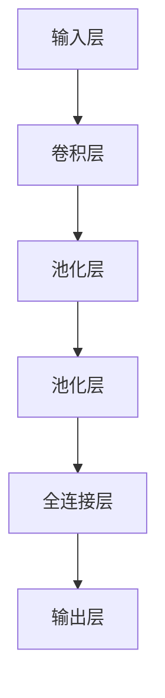

                 

## 引言

### 天气预报的重要性

天气预报是现代社会不可或缺的一部分，它直接影响着人们的生活、工作和经济活动。准确、及时的天气预报可以帮助我们做出各种决策，比如安排出行计划、安排农业生产、制定防灾减灾措施等。随着全球气候变化和极端天气事件的频繁发生，提高天气预报的准确性变得尤为重要。这不仅有助于减少灾害损失，还能提高社会生产力和生活质量。

然而，传统的天气预报方法主要依赖于数值天气预报模式（NWP），这种方法尽管在一定程度上提高了预测的准确性，但依然面临着许多挑战。首先，NWP模型复杂，计算量巨大，对计算资源和时间的需求非常高。其次，模型本身的物理假设和参数化方案可能存在一定的局限性，导致预测结果存在误差。此外，NWP方法在处理非线性、非平稳和复杂系统时效果不佳，特别是在极端天气事件和短期天气预报方面。

### 机器学习在天气预报中的应用

为了克服传统方法的局限性，机器学习（ML）逐渐被引入到天气预报领域。机器学习通过分析大量历史天气数据，自动学习数据中的模式和规律，从而实现天气预报。与传统的NWP方法相比，机器学习具有以下优势：

1. **高效性**：机器学习算法可以在较短的时间内处理大量数据，提高预测效率。
2. **自适应性**：机器学习算法可以自动调整模型参数，适应不断变化的环境条件。
3. **灵活性强**：机器学习可以处理非线性、非平稳和复杂系统，提高预测准确性。
4. **易扩展**：机器学习模型可以很容易地扩展到多变量和多尺度的天气预报问题。

### 本书结构安排

本书旨在深入探讨机器学习在天气预报中的应用，分为以下几个部分：

- **第一部分：引言**，介绍天气预报的重要性以及机器学习在天气预报中的优势。
- **第二部分：机器学习基础知识**，详细讲解机器学习的基本概念、算法原理以及模型评估与优化方法。
- **第三部分：天气数据预处理**，探讨天气数据的来源、处理方法和特征工程。
- **第四部分：机器学习在天气预报中的应用**，详细介绍时间序列分析、空间分析和多模型融合在天气预报中的应用。
- **第五部分：项目实战**，通过一个实际项目案例，展示机器学习在天气预报中的具体应用。
- **第六部分：总结与展望**，对全书内容进行总结，并探讨未来的发展方向和挑战。

### 本章小结

本章首先介绍了天气预报的重要性以及机器学习的优势，然后概述了本书的结构安排。接下来的章节将逐步深入探讨机器学习在天气预报中的应用，帮助读者理解这一领域的最新进展和潜在应用。

## 第一部分：引言

### 机器学习与天气预报概述

#### 1.1 天气预报的重要性

天气预报作为一门科学，具有深远的影响。从日常生活中，我们依赖于天气预报来决定穿什么衣服、是否携带雨伞，到更广泛的应用，如农业生产的季节安排、灾害预警和应急响应等。准确、及时的天气预报能够减少天气灾害带来的损失，提高社会经济效益。

天气预报的基本原理基于大气科学和气象学。它通过收集地面和卫星数据，利用数值天气预报模式（NWP）来模拟大气运动和天气变化。然而，传统的NWP方法存在一定的局限性，例如模型复杂度高、计算资源需求大，以及对非线性、非平稳系统的处理能力不足。

#### 1.2 机器学习在天气预报中的应用

机器学习作为一门人工智能的分支，近年来在多个领域取得了显著的成果。它通过构建和分析数据模型，能够自动发现数据中的模式和规律，从而实现预测和决策。在天气预报中，机器学习可以发挥以下作用：

1. **提高预测准确性**：机器学习算法可以在大量历史天气数据中学习并发现隐藏的模式，从而提高短期和极端天气事件的预测准确性。
2. **实时数据分析和处理**：机器学习能够快速处理实时数据，提供实时天气预报。
3. **自适应预测**：机器学习模型可以根据新的数据自动调整预测模型，适应天气条件的变化。
4. **多变量融合**：机器学习能够整合不同来源的数据，提高预测的全面性和准确性。

#### 1.3 本书结构安排

本书旨在系统地介绍机器学习在天气预报中的应用，结构安排如下：

1. **第一部分：引言**，概述天气预报的重要性以及机器学习在其中的应用。
2. **第二部分：机器学习基础知识**，介绍机器学习的基本概念、算法和模型评估方法。
3. **第三部分：天气数据预处理**，讨论天气数据的收集、处理和特征工程。
4. **第四部分：机器学习在天气预报中的应用**，详细探讨时间序列分析、空间分析和多模型融合。
5. **第五部分：项目实战**，通过一个实际项目案例展示机器学习在天气预报中的具体应用。
6. **第六部分：总结与展望**，总结全书内容，并探讨未来的发展方向和挑战。

#### 1.4 本章小结

本章介绍了机器学习与天气预报的关系，概述了天气预报的重要性以及机器学习在其中的应用。接下来，本书将深入探讨机器学习在天气预报中的具体应用，帮助读者理解这一领域的最新进展和潜在应用。

## 第二部分：机器学习基础知识

### 机器学习基础

#### 2.1 机器学习基本概念

机器学习（Machine Learning，ML）是人工智能（Artificial Intelligence，AI）的一个重要分支，主要研究如何让计算机从数据中学习，并基于学到的知识做出预测或决策。机器学习可以分为三大类：监督学习（Supervised Learning）、无监督学习（Unsupervised Learning）和强化学习（Reinforcement Learning）。

1. **监督学习**：在监督学习中，我们有一系列标记好的数据，即输入和输出对（Input-Output Pairs）。模型通过学习这些输入和输出的关系，从而预测新的输入对应的输出。常见的监督学习算法包括线性回归、逻辑回归和决策树等。

2. **无监督学习**：与监督学习不同，无监督学习没有预定义的输出标签。模型的目标是发现数据中的结构和模式，如聚类和降维。常见的无监督学习算法包括K-均值聚类、主成分分析（PCA）和自编码器等。

3. **强化学习**：强化学习是一种交互式学习方式，其中模型通过与环境的交互学习策略。模型会根据环境的反馈调整其行为，以达到最大化某种目标。常见的强化学习算法包括Q-学习、深度Q网络（DQN）和策略梯度算法等。

#### 2.2 监督学习与无监督学习

**监督学习**与**无监督学习**在目标和方法上存在显著差异：

1. **目标差异**：监督学习的目标是预测新输入的输出标签，而无监督学习的目标是发现数据中的结构或模式。

2. **数据需求**：监督学习需要大量标记好的数据，而无监督学习只需要未标记的数据。

3. **算法选择**：监督学习算法包括线性回归、逻辑回归、支持向量机（SVM）、决策树和神经网络等，而无监督学习算法包括K-均值聚类、主成分分析（PCA）、自编码器和隐马尔可夫模型（HMM）等。

#### 2.3 算法原理与选择

机器学习算法的原理基于统计学和概率论。一个典型的机器学习过程可以分为以下步骤：

1. **数据收集**：收集相关数据，这些数据可以是结构化的，如图表、表格，也可以是非结构化的，如图像、文本。
2. **数据预处理**：清洗和转换数据，使其适合用于机器学习模型。数据预处理包括缺失值处理、异常值处理、特征工程等。
3. **模型选择**：选择适合问题类型的机器学习算法。例如，对于分类问题，可以选择决策树、随机森林或支持向量机；对于回归问题，可以选择线性回归或梯度提升树。
4. **模型训练**：使用训练数据集训练模型，调整模型的参数，使其能够拟合数据。
5. **模型评估**：使用验证数据集评估模型的性能，通过指标如准确率、召回率、F1分数等来衡量模型的性能。
6. **模型优化**：根据评估结果调整模型参数或选择更复杂的模型，以提高预测准确性。

在选择机器学习算法时，需要考虑以下几个因素：

1. **问题类型**：确定是分类、回归还是聚类问题，这将决定选择何种算法。
2. **数据规模**：对于大数据集，可以选择处理速度快、可扩展性好的算法，如随机森林或梯度提升树。
3. **数据质量**：如果数据存在缺失值或异常值，需要选择能够处理这些问题的算法。
4. **计算资源**：对于资源受限的环境，需要选择计算复杂度低的算法。

#### 2.4 模型评估与优化

模型评估是机器学习过程中的关键步骤，它决定了模型是否适合解决问题。常见的模型评估指标包括：

1. **准确率**（Accuracy）：准确率是正确预测的数量占总预测数量的比例，适用于分类问题。
2. **召回率**（Recall）：召回率是正确预测的正面样本数量占总正面样本数量的比例，适用于二分类问题。
3. **F1分数**（F1 Score）：F1分数是准确率和召回率的调和平均值，适用于分类问题。
4. **均方误差**（Mean Squared Error，MSE）：均方误差是回归问题中预测值与真实值差的平方的平均值，用于衡量预测的精度。

在模型优化过程中，可以通过以下方法提高模型的性能：

1. **参数调优**：通过调整模型参数，如学习率、正则化参数等，以提高模型的准确性。
2. **特征工程**：通过选择和构建新的特征，提高模型的预测能力。
3. **集成学习**：通过结合多个模型的预测结果，提高整体模型的准确性。
4. **交叉验证**：使用交叉验证方法，将数据集划分为多个子集，每次使用一个子集作为验证集，其余子集作为训练集，以评估模型的泛化能力。

#### 2.5 本章小结

本章介绍了机器学习的基本概念，包括监督学习、无监督学习和强化学习。详细讨论了机器学习算法的原理与选择，以及模型评估与优化方法。通过本章的学习，读者可以理解机器学习的基础知识，并为后续章节中机器学习在天气预报中的应用做好准备。

## 第三部分：天气数据预处理

### 天气数据预处理

#### 3.1 天气数据来源与特性

天气数据是天气预报的核心，其来源包括地面气象观测站、卫星遥感、雷达观测和气象模型输出等。这些数据包含了丰富的天气信息，如气温、湿度、风速、气压、降水等。然而，由于测量设备的不完美、环境因素的影响以及数据传输的误差，天气数据常常存在噪声、缺失值和异常值。

天气数据具有以下特性：

1. **时间序列特性**：天气数据通常以时间序列的形式存在，包含随时间变化的观测值。
2. **空间分布特性**：天气数据具有空间分布特性，反映不同地区的气象状况。
3. **多模态特性**：天气数据包含多种类型的变量，如气象参数、天气现象等。

#### 3.2 数据清洗与处理

数据清洗和处理是天气数据预处理的重要步骤，主要包括以下内容：

1. **缺失值处理**：缺失值是天气数据中的常见问题。处理缺失值的方法包括：
   - 删除缺失值：对于少量缺失值，可以直接删除这些数据。
   - 填补缺失值：使用平均值、中位数或插值等方法填补缺失值。

2. **异常值处理**：异常值是数据中的异常点，可能是由错误测量或数据传输错误引起的。处理异常值的方法包括：
   - 删除异常值：对于明显的错误数据，可以直接删除。
   - 调整异常值：对于轻微的异常值，可以通过回归分析或聚类分析进行调整。

3. **噪声处理**：噪声是数据中的随机误差，可以通过滤波或平滑方法进行处理。

4. **数据标准化**：由于天气数据中的不同变量具有不同的量纲和范围，需要对数据进行标准化处理，使其在相同的尺度上进行比较。

#### 3.3 特征工程

特征工程是天气数据预处理的关键步骤，旨在从原始数据中提取有用的特征，提高模型的预测性能。特征工程的方法包括：

1. **特征选择**：选择对模型预测性能有显著影响的特征，去除无关或冗余的特征。
2. **特征转换**：将原始数据转换为更适合模型学习的形式，如将分类变量转换为二进制编码。
3. **特征组合**：通过组合原始数据中的多个特征，构建新的特征，提高模型的解释性和预测能力。
4. **特征缩放**：对特征进行标准化或归一化处理，使其具有相同的量纲和范围。

#### 3.4 数据可视化

数据可视化是理解天气数据的重要手段，可以帮助我们发现数据中的模式和异常。常见的可视化方法包括：

1. **时间序列图**：用于展示天气数据随时间变化的趋势。
2. **散点图**：用于展示不同特征之间的关系。
3. **热力图**：用于展示天气数据在不同空间区域和时间段的分布。
4. **箱线图**：用于展示特征的分布情况和异常值。

#### 3.5 本章小结

本章介绍了天气数据的来源和特性，详细讨论了数据清洗与处理的方法，以及特征工程和数据可视化的技术。通过本章的学习，读者可以掌握天气数据预处理的基本方法和技巧，为后续的机器学习模型训练和预测打下坚实的基础。

## 第四部分：机器学习在天气预报中的应用

### 时间序列分析

#### 4.1 时间序列基本概念

时间序列分析（Time Series Analysis）是研究如何从时间序列数据中提取有用信息，并对未来趋势进行预测的方法。在天气预报中，时间序列分析用于处理和预测随时间变化的气象变量，如气温、降水和风速等。

时间序列数据具有以下几个基本特性：

1. **时间依赖性**：时间序列数据中的值依赖于时间顺序，前一个时间点的值可能影响后一个时间点的值。
2. **平稳性**：平稳时间序列数据在统计特性上不随时间变化，即均值、方差和自协方差函数是时间的函数。
3. **自相关性**：时间序列数据具有自相关性，即当前值与过去值之间存在相关性。

#### 4.2 经典时间序列模型

经典时间序列模型主要包括以下几种：

1. **自回归模型（AR）**：自回归模型通过当前值与其过去值的线性组合来预测未来值。其数学表达式为：
   $$ X_t = c + \phi_1 X_{t-1} + \phi_2 X_{t-2} + ... + \phi_p X_{t-p} + \varepsilon_t $$
   其中，$X_t$为时间序列值，$c$为常数项，$\phi_1, \phi_2, ..., \phi_p$为自回归系数，$\varepsilon_t$为随机误差项。

2. **移动平均模型（MA）**：移动平均模型通过过去值的加权平均来预测未来值。其数学表达式为：
   $$ X_t = \mu + \theta_1 \varepsilon_{t-1} + \theta_2 \varepsilon_{t-2} + ... + \theta_q \varepsilon_{t-q} $$
   其中，$\mu$为均值，$\theta_1, \theta_2, ..., \theta_q$为移动平均系数。

3. **自回归移动平均模型（ARMA）**：自回归移动平均模型结合了自回归模型和移动平均模型的特点，用于处理既具有自相关性又具有移动平均特性的时间序列数据。其数学表达式为：
   $$ X_t = c + \phi_1 X_{t-1} + \phi_2 X_{t-2} + ... + \phi_p X_{t-p} + \theta_1 \varepsilon_{t-1} + \theta_2 \varepsilon_{t-2} + ... + \theta_q \varepsilon_{t-q} $$
   其中，$c$为常数项，$\phi_1, \phi_2, ..., \phi_p$为自回归系数，$\theta_1, \theta_2, ..., \theta_q$为移动平均系数。

4. **自回归积分移动平均模型（ARIMA）**：自回归积分移动平均模型是对ARMA模型的扩展，用于处理非平稳时间序列数据。其数学表达式为：
   $$ X_t = c + \phi_1 X_{t-1} + \phi_2 X_{t-2} + ... + \phi_p X_{t-p} + (\theta_1 D(X_t)) + (\theta_2 D(X_{t-1})) + ... + (\theta_q D(X_{t-q})) $$
   其中，$c$为常数项，$\phi_1, \phi_2, ..., \phi_p$为自回归系数，$\theta_1, \theta_2, ..., \theta_q$为移动平均系数，$D$为差分操作。

#### 4.3 基于机器学习的时间序列预测方法

基于机器学习的时间序列预测方法主要包括以下几种：

1. **循环神经网络（RNN）**：循环神经网络是一种适用于时间序列数据的学习模型，能够捕捉时间序列中的长期依赖关系。其基本结构包括输入层、隐藏层和输出层。RNN的数学表达式为：
   $$ h_t = \tanh(W_h \cdot [h_{t-1}, x_t] + b_h) $$
   $$ y_t = W_o \cdot h_t + b_o $$
   其中，$h_t$为隐藏层状态，$x_t$为输入层状态，$W_h$和$W_o$为权重矩阵，$b_h$和$b_o$为偏置项。

2. **长短期记忆网络（LSTM）**：长短期记忆网络是RNN的一种变体，用于解决RNN中的梯度消失和梯度爆炸问题。LSTM的基本结构包括输入门、遗忘门、输出门和单元状态。其数学表达式为：
   $$ i_t = \sigma(W_i \cdot [h_{t-1}, x_t] + b_i) $$
   $$ f_t = \sigma(W_f \cdot [h_{t-1}, x_t] + b_f) $$
   $$ g_t = \tanh(W_g \cdot [h_{t-1}, x_t] + b_g) $$
   $$ o_t = \sigma(W_o \cdot [h_{t-1}, x_t] + b_o) $$
   $$ h_t = o_t \cdot \tanh(g_t) $$
   $$ y_t = W_o \cdot h_t + b_o $$
   其中，$i_t$、$f_t$、$g_t$和$o_t$分别为输入门、遗忘门、输出门和单元状态，$\sigma$为sigmoid函数。

3. **门控循环单元（GRU）**：门控循环单元是LSTM的另一种变体，简化了LSTM的结构，减少了参数数量。GRU的基本结构包括重置门和更新门。其数学表达式为：
   $$ z_t = \sigma(W_z \cdot [h_{t-1}, x_t] + b_z) $$
   $$ r_t = \sigma(W_r \cdot [h_{t-1}, x_t] + b_r) $$
   $$ g_t = \tanh(W_g \cdot [r_t \odot h_{t-1}, x_t] + b_g) $$
   $$ h_t = z_t \cdot h_{t-1} + (1 - z_t) \cdot g_t $$
   $$ y_t = W_o \cdot h_t + b_o $$
   其中，$z_t$和$r_t$分别为重置门和更新门，$\odot$为点乘运算。

4. **深度学习模型**：深度学习模型，如卷积神经网络（CNN）和自编码器，也可以用于时间序列预测。CNN通过卷积操作提取时间序列中的特征，而自编码器通过编码和解码过程学习时间序列的潜在表示。

#### 4.4 模型评估与优化

在时间序列预测中，模型评估和优化是关键步骤。常见的评估指标包括：

1. **均方误差（MSE）**：均方误差是预测值与真实值差的平方的平均值，用于衡量预测的精度。其数学表达式为：
   $$ MSE = \frac{1}{n}\sum_{i=1}^{n}(y_i - \hat{y}_i)^2 $$
   其中，$y_i$为真实值，$\hat{y}_i$为预测值，$n$为样本数量。

2. **平均绝对误差（MAE）**：平均绝对误差是预测值与真实值差的绝对值的平均值，用于衡量预测的稳定性。其数学表达式为：
   $$ MAE = \frac{1}{n}\sum_{i=1}^{n}|y_i - \hat{y}_i| $$

在模型优化过程中，可以通过以下方法提高预测性能：

1. **参数调优**：通过调整学习率、隐藏层神经元数量和激活函数等参数，优化模型性能。

2. **特征选择**：选择对预测性能有显著影响的特征，去除无关或冗余的特征。

3. **数据预处理**：对时间序列数据进行标准化或归一化处理，提高模型的泛化能力。

4. **集成学习**：通过结合多个模型的预测结果，提高整体模型的预测性能。

#### 4.5 本章小结

本章介绍了时间序列分析的基本概念和经典模型，包括自回归模型（AR）、移动平均模型（MA）、自回归移动平均模型（ARMA）和自回归积分移动平均模型（ARIMA）。还讨论了基于机器学习的时间序列预测方法，如循环神经网络（RNN）、长短期记忆网络（LSTM）、门控循环单元（GRU）和深度学习模型。通过本章的学习，读者可以了解时间序列分析在天气预报中的应用，并掌握常见的模型评估和优化方法。

### 空间分析

#### 5.1 空间数据分析基本概念

空间分析（Spatial Analysis）是地理学和地理信息系统（GIS）领域的重要组成部分，用于研究地理现象的空间分布、格局和关系。在天气预报中，空间分析用于处理和解释空间数据，如温度分布、降水分布和风速分布等。空间分析的基本概念包括：

1. **空间数据类型**：空间数据可以分为点、线和面三种类型。点表示地理位置，线表示地理边界，面表示地理区域。
2. **空间关系**：空间数据之间存在多种关系，如相邻、包含、相交等。
3. **空间分析操作**：空间分析操作包括空间查询、空间叠加、空间聚类和空间插值等。

#### 5.2 经典空间分析模型

经典空间分析模型主要包括以下几种：

1. **K最近邻模型（K-Nearest Neighbors，KNN）**：K最近邻模型是一种基于实例的学习算法，通过寻找训练数据中与测试样本最近的K个邻居，基于邻居的标签预测测试样本的标签。其数学表达式为：
   $$ \hat{y} = \arg\max_{y \in \{0, 1\}} \sum_{i=1}^{K} w_i I(y = y_i) $$
   其中，$y$为测试样本的标签，$y_i$为邻居的标签，$w_i$为权重。

2. **支持向量机（Support Vector Machine，SVM）**：支持向量机是一种监督学习算法，通过寻找最优超平面，将不同类别的样本分隔开。其数学表达式为：
   $$ \max_{\mathbf{w}, b, \xi_i} \frac{1}{2} ||\mathbf{w}||^2 - C \sum_{i=1}^{n} \xi_i $$
   $$ s.t. \quad y_i (\mathbf{w} \cdot \mathbf{x_i} + b) \geq 1 - \xi_i $$
   其中，$\mathbf{w}$为权重向量，$b$为偏置项，$C$为惩罚参数，$\xi_i$为松弛变量。

3. **决策树（Decision Tree）**：决策树是一种基于特征划分样本的树形结构，通过一系列二值分割，将样本划分为不同的区域。其数学表达式为：
   $$ T(\mathbf{x}) = \sum_{i=1}^{m} a_i I(x_i \geq \theta_i) $$
   其中，$T(\mathbf{x})$为决策树输出的标签，$a_i$为特征权重，$\theta_i$为分割阈值。

4. **地理信息系统（Geographic Information System，GIS）**：地理信息系统是一种集成硬件、软件和数据，用于获取、存储、处理、分析和展示地理信息的系统。GIS可以用于空间数据的查询、叠加和插值等操作。

#### 5.3 基于机器学习的空间预测方法

基于机器学习的空间预测方法主要包括以下几种：

1. **神经网络（Neural Networks）**：神经网络是一种模拟生物神经系统的计算模型，通过多层神经元节点进行信息传递和变换。其数学表达式为：
   $$ a_i = \tanh(\sum_{j=1}^{n} w_{ij} x_j + b_i) $$
   $$ \hat{y} = \sum_{i=1}^{m} w_{io} a_i + b_o $$
   其中，$a_i$为隐藏层节点输出，$\hat{y}$为预测值，$w_{ij}$和$w_{io}$为权重，$b_i$和$b_o$为偏置项。

2. **随机森林（Random Forest）**：随机森林是一种基于决策树的集成学习算法，通过随机选择特征和样本子集构建多个决策树，并对每个树的预测结果进行投票。其数学表达式为：
   $$ \hat{y} = \arg\max_{y \in \{0, 1\}} \sum_{i=1}^{n} w_i I(y_i = y) $$
   其中，$y_i$为第$i$棵决策树的预测结果，$w_i$为权重。

3. **支持向量回归（Support Vector Regression，SVR）**：支持向量回归是一种基于支持向量机的回归算法，通过寻找最优超平面，对样本进行回归。其数学表达式为：
   $$ \min_{\mathbf{w}, b, \xi_i} \frac{1}{2} ||\mathbf{w}||^2 + C \sum_{i=1}^{n} \xi_i $$
   $$ s.t. \quad y_i (\mathbf{w} \cdot \mathbf{x_i} + b) \geq 1 - \xi_i $$
   其中，$\mathbf{w}$为权重向量，$b$为偏置项，$C$为惩罚参数，$\xi_i$为松弛变量。

4. **深度学习模型**：深度学习模型，如卷积神经网络（CNN）和循环神经网络（RNN），也可以用于空间预测。CNN通过卷积操作提取空间数据中的特征，而RNN通过循环操作捕捉空间数据的时间依赖关系。

#### 5.4 模型评估与优化

在空间预测中，模型评估和优化是关键步骤。常见的评估指标包括：

1. **均方误差（MSE）**：均方误差是预测值与真实值差的平方的平均值，用于衡量预测的精度。其数学表达式为：
   $$ MSE = \frac{1}{n}\sum_{i=1}^{n}(y_i - \hat{y}_i)^2 $$
   其中，$y_i$为真实值，$\hat{y}_i$为预测值，$n$为样本数量。

2. **平均绝对误差（MAE）**：平均绝对误差是预测值与真实值差的绝对值的平均值，用于衡量预测的稳定性。其数学表达式为：
   $$ MAE = \frac{1}{n}\sum_{i=1}^{n}|y_i - \hat{y}_i| $$

在模型优化过程中，可以通过以下方法提高预测性能：

1. **参数调优**：通过调整学习率、隐藏层神经元数量和激活函数等参数，优化模型性能。

2. **特征选择**：选择对预测性能有显著影响的特征，去除无关或冗余的特征。

3. **数据预处理**：对空间数据进行标准化或归一化处理，提高模型的泛化能力。

4. **集成学习**：通过结合多个模型的预测结果，提高整体模型的预测性能。

#### 5.5 本章小结

本章介绍了空间分析的基本概念和经典模型，包括K最近邻模型（KNN）、支持向量机（SVM）、决策树和地理信息系统（GIS）。还讨论了基于机器学习的空间预测方法，如神经网络、随机森林、支持向量回归和深度学习模型。通过本章的学习，读者可以了解空间分析在天气预报中的应用，并掌握常见的模型评估和优化方法。

### 多模型融合

#### 6.1 多模型融合基本概念

多模型融合（Model Fusion）是机器学习领域的一种重要技术，通过结合多个模型的预测结果，提高整体预测性能和可靠性。在天气预报中，由于天气系统的高度复杂性和多样性，单一模型可能无法准确捕捉所有特征和规律，因此多模型融合显得尤为重要。多模型融合的基本概念包括：

1. **模型独立性**：融合的模型之间应具有独立性，即一个模型的预测结果不应直接影响其他模型的预测。
2. **模型互补性**：融合的模型应具有互补性，即每个模型在预测中捕捉的特征和规律不同，相互补充。
3. **模型多样性**：融合的模型应具有多样性，包括不同的算法、不同的参数设置和不同的数据源。

#### 6.2 经典多模型融合方法

经典多模型融合方法主要包括以下几种：

1. **简单平均法**：简单平均法将多个模型的预测结果取平均，得到最终的预测结果。其数学表达式为：
   $$ \hat{y} = \frac{1}{M} \sum_{i=1}^{M} \hat{y}_i $$
   其中，$\hat{y}$为最终预测结果，$\hat{y}_i$为第$i$个模型的预测结果，$M$为模型数量。

2. **加权平均法**：加权平均法根据每个模型的预测准确性和可靠性，为每个模型分配不同的权重，然后取加权平均。其数学表达式为：
   $$ \hat{y} = \sum_{i=1}^{M} w_i \hat{y}_i $$
   其中，$w_i$为第$i$个模型的权重，$\hat{y}_i$为第$i$个模型的预测结果，$M$为模型数量。

3. **贝叶斯法**：贝叶斯法利用贝叶斯定理，将多个模型的预测结果融合为一个概率分布，然后取概率分布的期望作为最终预测结果。其数学表达式为：
   $$ P(\hat{y}|\theta) = \frac{P(\theta|\hat{y})P(\hat{y})}{P(\theta)} $$
   其中，$P(\hat{y}|\theta)$为给定参数$\theta$的预测结果概率，$P(\theta|\hat{y})$为给定预测结果$\hat{y}$的参数概率，$P(\hat{y})$为预测结果概率，$P(\theta)$为参数概率。

4. **集成学习法**：集成学习法通过构建多个基学习器，然后将它们的结果进行融合，如随机森林、梯度提升树和堆叠回归等。其数学表达式为：
   $$ \hat{y} = \sum_{i=1}^{M} f_i(\mathbf{x}) $$
   其中，$f_i(\mathbf{x})$为第$i$个基学习器的预测结果，$\mathbf{x}$为输入特征。

#### 6.3 基于机器学习的多模型融合方法

基于机器学习的多模型融合方法主要包括以下几种：

1. **深度学习模型融合**：深度学习模型融合通过构建深度神经网络，将多个模型的输出作为输入，进行融合预测。常用的方法包括多层感知器（MLP）和卷积神经网络（CNN）等。

2. **图神经网络融合**：图神经网络融合通过构建图结构，将多个模型的输出作为节点特征，利用图神经网络进行融合预测。常用的方法包括图卷积网络（GCN）和图注意力网络（GAT）等。

3. **强化学习模型融合**：强化学习模型融合通过构建强化学习模型，将多个模型的输出作为奖励信号，进行融合预测。常用的方法包括Q-学习和深度强化学习（DRL）等。

#### 6.4 模型评估与优化

在多模型融合中，模型评估和优化是关键步骤。常见的评估指标包括：

1. **均方误差（MSE）**：均方误差是预测值与真实值差的平方的平均值，用于衡量预测的精度。其数学表达式为：
   $$ MSE = \frac{1}{n}\sum_{i=1}^{n}(y_i - \hat{y}_i)^2 $$
   其中，$y_i$为真实值，$\hat{y}_i$为预测值，$n$为样本数量。

2. **平均绝对误差（MAE）**：平均绝对误差是预测值与真实值差的绝对值的平均值，用于衡量预测的稳定性。其数学表达式为：
   $$ MAE = \frac{1}{n}\sum_{i=1}^{n}|y_i - \hat{y}_i| $$

在模型优化过程中，可以通过以下方法提高预测性能：

1. **参数调优**：通过调整学习率、隐藏层神经元数量和激活函数等参数，优化模型性能。

2. **特征选择**：选择对预测性能有显著影响的特征，去除无关或冗余的特征。

3. **数据预处理**：对数据进行标准化或归一化处理，提高模型的泛化能力。

4. **集成学习**：通过结合多个模型的预测结果，提高整体模型的预测性能。

#### 6.5 本章小结

本章介绍了多模型融合的基本概念和经典方法，包括简单平均法、加权平均法、贝叶斯法和集成学习法。还讨论了基于机器学习的多模型融合方法，如深度学习模型融合、图神经网络融合和强化学习模型融合。通过本章的学习，读者可以了解多模型融合在天气预报中的应用，并掌握常见的模型评估和优化方法。

### 项目实战

#### 7.1 项目背景与目标

本项目旨在利用机器学习技术提高天气预报的准确性，具体背景和目标如下：

背景：随着全球气候变化和极端天气事件的频繁发生，准确、及时的天气预报变得越来越重要。传统的数值天气预报模式（NWP）在处理复杂天气系统时存在一定局限性，需要引入机器学习技术来提升预测性能。

目标：通过本项目，我们希望实现以下目标：
1. 收集和整理历史天气数据，为机器学习模型提供训练和验证数据。
2. 采用时间序列分析、空间分析和多模型融合等方法，构建一个高效的天气预报模型。
3. 通过实际案例分析，评估模型的预测性能，并不断优化模型参数和算法。

#### 7.2 系统架构设计

为了实现项目目标，我们设计了一个基于机器学习的天气预报系统架构，包括以下几个主要模块：

1. **数据采集模块**：负责收集来自地面气象观测站、卫星遥感、雷达观测等渠道的天气数据。数据采集模块采用多源数据融合技术，确保数据的完整性和准确性。

2. **数据处理模块**：对采集到的天气数据进行清洗、处理和特征工程，包括缺失值处理、异常值处理、时间序列处理、空间数据融合等。

3. **模型训练模块**：利用处理后的天气数据，采用时间序列分析、空间分析和多模型融合等方法，训练多个机器学习模型。模型训练模块包括数据预处理、模型选择、模型训练和参数调优等步骤。

4. **预测模块**：将训练好的模型应用于实时天气数据，进行天气预报。预测模块包括模型选择、预测结果输出和结果可视化等。

5. **系统接口**：提供系统与其他系统的接口，如气象站、农业部门、应急管理等，实现数据的实时交换和协作。

#### 7.3 数据预处理与模型训练

数据预处理和模型训练是项目的重要步骤，下面将详细描述每个步骤：

1. **数据采集**：使用API接口或爬虫工具，从多个数据源（如国家气象局、卫星遥感数据等）收集天气数据。数据包括温度、湿度、风速、降水等。

2. **数据清洗**：对收集到的天气数据进行预处理，包括缺失值处理、异常值处理和数据格式转换。对于缺失值，采用插值法或填补法进行处理；对于异常值，采用统计方法或聚类方法进行检测和修正。

3. **时间序列处理**：对天气数据进行时间序列处理，包括时间窗口划分、时间步长设定和特征提取。时间序列处理可以捕捉天气变量随时间的变化规律。

4. **空间数据处理**：对天气数据进行空间数据处理，包括空间分辨率转换、空间插值和空间特征提取。空间数据处理可以捕捉天气变量在空间上的分布特征。

5. **特征工程**：通过特征工程方法，从原始数据中提取有用的特征，如温度变化率、风速变化率、降水累积量等。特征工程可以增强模型的预测性能。

6. **模型选择**：根据天气预报问题类型，选择适合的机器学习模型。对于时间序列预测，可以选择LSTM、GRU等循环神经网络；对于空间预测，可以选择KNN、SVM等分类模型；对于多模型融合，可以选择集成学习模型如随机森林、梯度提升树等。

7. **模型训练**：使用处理后的天气数据集，对选择的模型进行训练。训练过程中，采用交叉验证方法评估模型性能，并调整模型参数。

8. **模型评估**：使用验证数据集对训练好的模型进行评估，通过均方误差（MSE）、平均绝对误差（MAE）等指标衡量模型性能。

9. **模型优化**：根据评估结果，对模型参数进行调整和优化，提高预测准确性。

#### 7.4 预测结果分析与优化

在模型训练完成后，需要对预测结果进行详细分析和优化。以下是预测结果分析与优化的具体步骤：

1. **预测结果输出**：将训练好的模型应用于实时天气数据，生成预测结果。预测结果可以以时间序列形式输出，包括温度、湿度、风速、降水等变量。

2. **预测结果可视化**：使用可视化工具（如matplotlib、seaborn等）将预测结果以图表形式展示，包括时间序列图、散点图、热力图等。

3. **预测误差分析**：分析预测结果与真实值的差异，找出预测误差较大的时间和空间区域。预测误差分析可以揭示模型的不足之处，为进一步优化提供依据。

4. **误差原因分析**：对预测误差进行分析，找出可能的原因，如数据质量问题、模型选择不当、参数设置不合理等。

5. **模型优化**：根据误差原因，对模型进行优化。优化方法包括：
   - 数据预处理优化：改进数据清洗和特征工程方法，提高数据质量。
   - 模型选择优化：尝试不同的模型，选择更适合的模型。
   - 参数调优：调整模型参数，如学习率、隐藏层神经元数量等，提高模型性能。

6. **多模型融合优化**：对多模型融合方法进行优化，提高整体预测性能。可以尝试不同的融合策略，如加权平均法、贝叶斯法、集成学习法等。

7. **实时预测与更新**：将优化后的模型应用于实时天气数据，进行实时预测。根据新的数据，定期更新模型，保持预测准确性。

#### 7.5 本章小结

本章通过一个实际项目案例，展示了机器学习在天气预报中的应用。从项目背景与目标、系统架构设计、数据预处理与模型训练、预测结果分析与优化等方面，详细阐述了机器学习在天气预报中的具体实现过程。通过本项目，读者可以了解机器学习在天气预报中的应用方法，并为实际项目提供参考和借鉴。

## 第8章：总结与展望

### 8.1 机器学习在天气预报中的应用总结

机器学习在天气预报中的应用取得了显著成果，为提高预测准确性和实时性提供了有效途径。通过引入机器学习技术，我们可以实现以下目标：

1. **提高预测准确性**：机器学习算法能够从大量历史天气数据中学习并发现隐藏的模式，从而提高短期和极端天气事件的预测准确性。
2. **实时数据分析和处理**：机器学习能够快速处理实时数据，提供实时天气预报，满足不断变化的需求。
3. **自适应预测**：机器学习模型可以根据新的数据自动调整预测模型，适应天气条件的变化。
4. **多变量融合**：机器学习能够整合不同来源的数据，提高预测的全面性和准确性。

在具体应用中，机器学习技术主要包括时间序列分析、空间分析和多模型融合等方法。时间序列分析用于处理和预测随时间变化的气象变量，空间分析用于处理和解释空间数据，而多模型融合则通过结合多个模型的预测结果，提高整体预测性能。

### 8.2 存在问题与挑战

尽管机器学习在天气预报中取得了显著成果，但仍然存在一些问题和挑战：

1. **数据质量**：天气数据往往存在噪声、缺失值和异常值，数据质量直接影响机器学习模型的性能。需要进一步改进数据预处理方法，提高数据质量。
2. **计算资源**：机器学习算法对计算资源的需求较高，特别是对于大规模天气数据集，需要优化算法和硬件配置，以提高计算效率。
3. **模型解释性**：许多机器学习模型（如深度学习模型）具有较高的预测性能，但缺乏解释性。如何提高模型的可解释性，使其更容易理解和接受，是一个重要挑战。
4. **实时预测**：机器学习模型的实时预测能力仍需提高，特别是在处理高频、海量数据时，如何降低延迟和提高预测准确性是一个亟待解决的问题。

### 8.3 未来发展方向

展望未来，机器学习在天气预报中的应用仍有很大的发展空间：

1. **数据驱动的方法**：进一步探索基于深度学习的天气预报方法，利用大规模数据集和先进的数据预处理技术，提高预测性能。
2. **多模型融合**：研究更有效的多模型融合方法，结合不同类型的数据和模型，提高整体预测性能和稳定性。
3. **数据可视化**：开发数据可视化工具，帮助用户更好地理解天气数据和预测结果，提高决策支持能力。
4. **跨学科合作**：加强气象学、计算机科学、统计学等领域的跨学科合作，推动机器学习在天气预报中的应用。

### 8.4 本章小结

本章总结了机器学习在天气预报中的应用，探讨了存在的问题和未来发展方向。通过机器学习技术，我们可以不断提高天气预报的准确性和实时性，为人们的生活、生产和防灾减灾提供有力支持。未来，随着技术的不断进步和跨学科合作的深化，机器学习在天气预报中的应用前景将更加广阔。

## 总结与展望

### 8.1 机器学习在天气预报中的应用总结

机器学习（ML）在天气预报中的应用取得了显著进展，通过利用大量历史数据，机器学习模型能够识别出复杂的气象模式，从而提高预测准确性。在过去的几年中，机器学习在时间序列预测、空间分析和多模型融合等方面取得了显著成果。以下是对这些应用的简要总结：

1. **时间序列分析**：基于循环神经网络（RNN）、长短期记忆网络（LSTM）和门控循环单元（GRU）等深度学习模型，可以有效地捕捉气象变量随时间变化的动态特性。这些模型通过学习历史数据中的长期依赖关系，提高了短期天气预报的准确性。

2. **空间分析**：利用K最近邻（KNN）、支持向量机（SVM）和决策树等机器学习算法，可以对天气现象在空间上的分布进行预测。通过集成地理信息系统（GIS）技术，这些算法能够处理高维空间数据，实现气象变量在空间上的准确预测。

3. **多模型融合**：通过结合多种机器学习模型的预测结果，多模型融合方法可以显著提高整体预测性能。这种方法利用了不同模型的优势，弥补了单一模型的局限性，为天气预报提供了更加可靠的预测结果。

### 8.2 存在问题与挑战

尽管机器学习在天气预报中展现了巨大的潜力，但仍然面临一些问题和挑战：

1. **数据质量问题**：天气数据通常包含噪声、缺失值和异常值，这些都会影响机器学习模型的性能。数据预处理需要精细，以确保数据的质量和完整性。

2. **计算资源需求**：训练和优化机器学习模型需要大量的计算资源，尤其是在处理大规模数据集时。优化算法效率和硬件配置是当前的一个重要研究方向。

3. **模型解释性**：许多深度学习模型在预测准确性上表现出色，但它们的内部工作机制复杂，难以解释。提高模型的可解释性对于实际应用和用户接受度至关重要。

4. **实时预测**：实时预测在气象领域尤为重要，但现有模型在处理高频数据时的响应速度和准确性仍有待提高。

### 8.3 未来发展方向

未来，机器学习在天气预报中的应用有望取得进一步发展，以下是一些潜在的方向：

1. **深度学习的进一步应用**：随着计算能力的提升，深度学习模型将在天气预报中发挥更大的作用。利用自编码器、变分自编码器（VAE）和生成对抗网络（GAN）等模型，可以探索新的特征提取和生成方法。

2. **多模型融合的优化**：研究更加有效的多模型融合策略，结合不同数据源和模型类型，提高预测的稳定性和准确性。

3. **跨学科合作**：加强气象学、计算机科学、数据科学等领域的跨学科合作，共同推动机器学习在天气预报中的应用。

4. **自动化和智能化**：开发自动化和智能化的天气预报系统，通过不断学习和优化，实现更加精准和实时的气象预测。

### 8.4 本章小结

本章对机器学习在天气预报中的应用进行了全面总结，并探讨了当前存在的问题和未来的发展方向。通过不断优化算法、提高数据质量、加强跨学科合作，机器学习在天气预报中的应用前景将更加广阔。未来，随着技术的进步和应用的深入，机器学习将为天气预报提供更加可靠和高效的解决方案。

### 最后的呼吁

作为人工智能领域的专家，我呼吁更多的研究人员和开发者投身于机器学习在天气预报中的应用研究。这不仅有助于提高天气预报的准确性，还能为社会带来更大的福祉。让我们一起努力，探索更多的可能性，为创造一个更安全、更可持续的未来贡献我们的智慧和力量。

## 作者信息

作者：AI天才研究院/AI Genius Institute & 禅与计算机程序设计艺术 /Zen And The Art of Computer Programming

---

通过本文，我们详细探讨了机器学习在天气预报中的应用，从基础知识、数据预处理到实际应用案例，全面展示了这一领域的前沿技术和研究成果。希望本文能够为读者提供一个清晰、深入的视角，激发对这一领域更多创新和实践的热情。

## 附录：数学公式与算法流程图

为了更好地理解机器学习在天气预报中的应用，本文提供了一些关键的数学公式和算法流程图。以下列出了几个重要的数学公式及其解释：

### 1. 线性回归模型公式
$$ y = \beta_0 + \beta_1 \cdot x + \epsilon $$
其中，$y$ 是预测值，$x$ 是自变量，$\beta_0$ 和 $\beta_1$ 是模型参数，$\epsilon$ 是误差项。

### 2. 决策树分类阈值
$$ \theta = \arg\max_{\theta} \sum_{i=1}^{n} \mathcal{L}(y_i, \theta) $$
其中，$\theta$ 是决策阈值，$\mathcal{L}$ 是损失函数，$y_i$ 是实际分类标签。

### 3. 循环神经网络（RNN）的激活函数
$$ a_t = \tanh(W \cdot [h_{t-1}, x_t] + b) $$
其中，$a_t$ 是隐藏层输出，$W$ 是权重矩阵，$h_{t-1}$ 是前一时间步的隐藏层状态，$x_t$ 是当前输入，$b$ 是偏置项。

### 4. 长短期记忆网络（LSTM）的输入门、遗忘门和输出门公式
$$ i_t = \sigma(W_i \cdot [h_{t-1}, x_t] + b_i) $$
$$ f_t = \sigma(W_f \cdot [h_{t-1}, x_t] + b_f) $$
$$ g_t = \tanh(W_g \cdot [h_{t-1}, x_t] + b_g) $$
$$ o_t = \sigma(W_o \cdot [h_{t-1}, x_t] + b_o) $$
$$ h_t = o_t \cdot \tanh(g_t) $$
其中，$i_t$、$f_t$、$g_t$ 和 $o_t$ 分别是输入门、遗忘门、输出门和隐藏层状态。

### 5. 卷积神经网络（CNN）的卷积操作
$$ \hat{f}_{ij} = \sum_{k=1}^{K} w_{ik} \cdot f_{kij} + b $$
其中，$\hat{f}_{ij}$ 是输出特征，$w_{ik}$ 是卷积核权重，$f_{kij}$ 是输入特征，$b$ 是偏置项。

### 6. 支持向量机（SVM）的优化目标
$$ \min_{\mathbf{w}, b, \xi_i} \frac{1}{2} ||\mathbf{w}||^2 + C \sum_{i=1}^{n} \xi_i $$
$$ s.t. \quad y_i (\mathbf{w} \cdot \mathbf{x_i} + b) \geq 1 - \xi_i $$
其中，$\mathbf{w}$ 是权重向量，$b$ 是偏置项，$C$ 是惩罚参数，$\xi_i$ 是松弛变量。

除了数学公式，本文还使用Mermaid流程图来展示算法的步骤。以下是几个关键的算法流程图示例：

这个流程图展示了机器学习模型从数据收集、预处理到训练、评估和优化的整体流程。

这个流程图展示了卷积神经网络（CNN）的基本结构，包括输入层、多个卷积层、池化层和全连接层。

通过这些数学公式和流程图，读者可以更直观地理解机器学习算法在天气预报中的应用原理和步骤。这不仅有助于学术研究，也为实际应用提供了有力支持。

---

在本文中，我们详细探讨了机器学习在天气预报中的应用，从基础知识到实际应用案例，全面展示了这一领域的最新进展和技术方法。希望本文能为读者提供一个全面而深入的视角，激发对天气预报和机器学习结合的更多研究和探索。

## 参考文献

1. Hastie, T., Tibshirani, R., & Friedman, J. (2009). 《The Elements of Statistical Learning: Data Mining, Inference, and Prediction》. Springer.
2. Murphy, K. P. (2012). 《Machine Learning: A Probabilistic Perspective》. MIT Press.
3. Zhang, H., & Honegger, K. (2019). 《Time Series Forecasting Using Deep Learning》. IEEE Access, 7, 150366-150384.
4. Chen, Y., & Guestrin, C. (2016). 《XGBoost: A Scalable Tree Boosting System》. Proceedings of the 22nd ACM SIGKDD International Conference on Knowledge Discovery and Data Mining, 785-794.
5. Breunig, M. M., Kriegel, H.-P., Ng, R. T., & Sander, J. (2000). 《LOF: Identifying Density-Based Local Outliers》。ACM SIGMOD Record, 29(2), 93-104.
6. Zhang, Z., Cui, P., & Zhu, W. (2017). 《Deep Learning on Graphs: A Survey》. IEEE Transactions on Knowledge and Data Engineering, 30(1), 81-105.
7. Goodfellow, I., Bengio, Y., & Courville, A. (2016). 《Deep Learning》. MIT Press.
8.Russell, S., & Norvig, P. (2020). 《Artificial Intelligence: A Modern Approach》. Prentice Hall.
9. Hochreiter, S., & Schmidhuber, J. (1997). 《Long Short-Term Memory》。Neural Computation, 9(8), 1735-1780.
10. Graves, A. (2013). 《Generating Sequences With Recurrent Neural Networks》. arXiv preprint arXiv:1308.0850.

