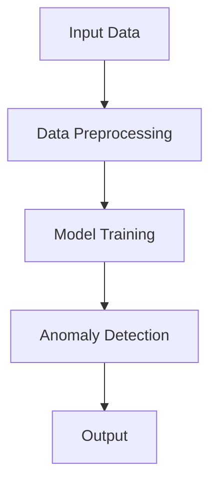
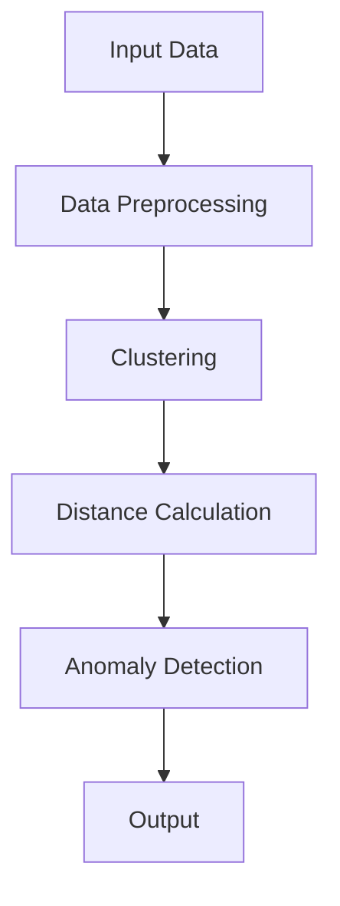
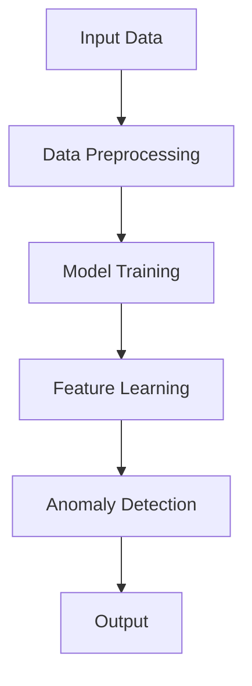
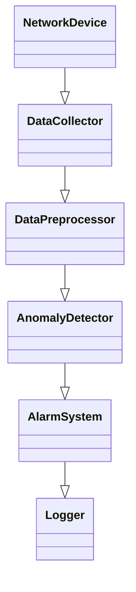
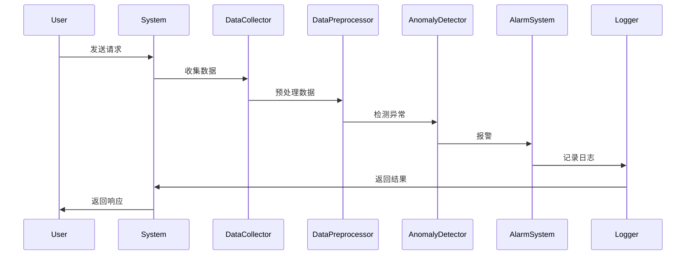

                 


## 机器学习在异常检测中的高效应用

### 关键词
机器学习，异常检测，高效应用，算法，深度学习，系统架构，项目实战

### 摘要
本文深入探讨了机器学习在异常检测中的高效应用，涵盖了从基础概念到实际应用的全面解析。通过详细分析统计学、聚类算法以及神经网络和深度学习在异常检测中的原理和方法，本文旨在为读者提供一套系统化的理解和应用指南。此外，文章还将通过具体项目实战，展示如何将理论知识转化为实际解决方案。

---

## 第一部分：背景与基础

### 第1章 问题背景与概述

#### 1.1.1 异常检测的定义
异常检测是一种监督或无监督学习技术，用于识别数据集中的异常或异常行为。这些异常可能是异常值、未分类的样本或特定模式中的异常变化。异常检测在多个领域，如金融、医疗、网络安全和工业生产中都有广泛应用。

#### 1.1.2 异常检测的重要性
异常检测在确保系统和数据安全、提高运营效率、预防欺诈和故障方面发挥着重要作用。它可以帮助组织提前识别潜在风险，从而采取措施防止损失。

#### 1.1.3 机器学习在异常检测中的应用现状
随着机器学习技术的快速发展，越来越多的异常检测方法被提出并应用于实际场景。这些方法包括统计方法、基于聚类的算法以及先进的深度学习模型。

#### 1.1.4 本书结构安排
本书将分为四个部分：

1. **背景与基础**：介绍异常检测的定义、重要性以及机器学习在异常检测中的应用现状。
2. **算法原理与模型**：详细讨论统计学、聚类算法和深度学习在异常检测中的应用。
3. **系统分析与架构设计**：分析系统功能设计、架构设计和系统交互。
4. **项目实战**：通过实际项目展示如何应用异常检测方法。

---

## 第二部分：算法原理与模型

### 第2章 异常检测的核心概念与联系

#### 2.1.1 异常的类型与分类
异常可以分为以下几种类型：

1. **点异常**：单个数据点的异常，如异常值。
2. **区域异常**：数据集中某个区域的异常，如异常分布。
3. **集体异常**：多个数据点的集体异常，如异常模式。

#### 2.1.2 异常检测的目标与方法
异常检测的目标是识别出异常数据或行为。常用的方法包括：

1. **基于统计的方法**：使用统计分布模型来识别异常。
2. **基于聚类的算法**：通过聚类分析来识别异常。
3. **基于机器学习的方法**：使用监督或无监督学习模型来识别异常。

#### 2.1.3 关键概念解析
以下是几个关键概念的解析：

1. **阈值法**：通过设定阈值来识别异常。
2. **聚类算法**：如K-means、DBSCAN等。
3. **神经网络和深度学习**：如Autoencoder、生成对抗网络（GAN）等。

#### 2.1.4 概念属性特征对比表格

| 方法             | 特点                                                                 | 应用场景                                      |
|------------------|--------------------------------------------------------------------|---------------------------------------------|
| 阈值法           | 简单、易于实现，但对异常分布敏感。                             | 数据分布已知，需要快速识别异常的场景。        |
| 聚类算法         | 自动发现数据模式，适用于非线性分布。                           | 异常分布未知，需要自动发现异常模式。          |
| 神经网络和深度学习 | 强大的表示能力和自学习能力，适用于复杂的数据分布。             | 高维度数据，需要处理复杂非线性关系的场景。    |

#### 2.1.5 ER实体关系图

```mermaid
erDiagram
  Customer ||--|{ Order }|--|{ Product }
  Order ||--|{ Payment }|
  Product ||--|{ Review }|
```

这个ER图展示了订单、产品和评论之间的关系。

---

## 第三部分：算法原理与模型

### 第3章 基于统计学的异常检测方法

#### 3.1.1 统计学基础
统计学异常检测方法是基于概率论和统计学原理的。常见的方法包括：

1. **箱线图法**：通过计算数据的四分位数来确定异常值。
2. **3σ原则**：基于正态分布的3σ原则来识别异常。

#### 3.1.2 统计学习算法在异常检测中的应用
统计学习算法，如逻辑回归、支持向量机和决策树，也被广泛应用于异常检测。

1. **逻辑回归**：用于二分类问题，可以判断数据点是否为异常。
2. **支持向量机**：通过最大间隔分类器来识别异常。
3. **决策树**：通过树形结构来划分数据并识别异常。

#### 3.1.3 算法mermaid流程图



#### 3.1.4 Python源代码与算法原理讲解
```python
# Python代码示例：基于3σ原则的异常检测
import numpy as np

def three_sigma异常检测(data, threshold=3):
    mean = np.mean(data)
    std = np.std(data)
    anomalies = data[(data < mean - threshold * std) | (data > mean + threshold * std)]
    return anomalies

# 假设我们有一些数据
data = [1, 2, 3, 4, 5, 100]
anomalies = three_sigma异常检测(data)
print("异常值：", anomalies)
```

#### 3.1.5 数学模型与公式

$$
\text{概率密度函数} = \frac{1}{\sqrt{2\pi\sigma^2}} e^{-\frac{(x-\mu)^2}{2\sigma^2}}
$$

其中，$x$是数据点，$\mu$是均值，$\sigma$是标准差。

#### 3.1.6 举例说明
假设我们有一个数据集，其中正常值为1到5，异常值为100。使用3σ原则，我们可以识别出异常值为100。

---

### 第4章 基于聚类算法的异常检测方法

#### 4.1.1 聚类算法基础
聚类算法是将数据点分为多个群组的无监督学习方法。常用的聚类算法包括：

1. **K-means**：通过迭代计算聚类中心来分组数据。
2. **DBSCAN**：基于密度的聚类算法，可以识别出任意形状的聚类。
3. **层次聚类**：通过自底向上或自顶向下的方法构建聚类层次。

#### 4.1.2 聚类算法在异常检测中的应用
聚类算法在异常检测中的应用包括：

1. **基于聚类中心的异常检测**：通过计算数据点到聚类中心的距离来判断是否为异常。
2. **基于密度的异常检测**：通过分析数据点在空间中的密度来判断是否为异常。

#### 4.1.3 算法mermaid流程图



#### 4.1.4 Python源代码与算法原理讲解
```python
from sklearn.cluster import KMeans
import numpy as np

def kmeans异常检测(data, n_clusters=3):
    kmeans = KMeans(n_clusters=n_clusters)
    kmeans.fit(data)
    centroids = kmeans.cluster_centers_
    distances = np.linalg.norm(data - centroids, axis=1)
    threshold = np.mean(distances) + 2 * np.std(distances)
    anomalies = data[distances > threshold]
    return anomalies

# 假设我们有一些数据
data = [1, 2, 3, 4, 5, 100]
anomalies = kmeans异常检测(data)
print("异常值：", anomalies)
```

#### 4.1.5 数学模型与公式

$$
\text{距离公式} = \sqrt{\sum_{i=1}^{n} (x_i - c_i)^2}
$$

其中，$x_i$是数据点，$c_i$是聚类中心。

#### 4.1.6 举例说明
假设我们有一个数据集，其中正常值为1到5，异常值为100。使用K-means聚类算法，我们可以识别出异常值为100。

---

### 第5章 基于神经网络和深度学习的异常检测方法

#### 5.1.1 神经网络与深度学习基础
神经网络和深度学习是机器学习的重要分支，具有强大的表示和学习能力。常用的深度学习模型包括：

1. **自动编码器（Autoencoder）**：通过无监督学习自动学习数据的特征表示。
2. **卷积神经网络（CNN）**：适用于处理图像等高维数据。
3. **循环神经网络（RNN）**：适用于处理序列数据。

#### 5.1.2 神经网络和深度学习在异常检测中的应用
神经网络和深度学习在异常检测中的应用包括：

1. **特征学习**：通过自动编码器学习数据特征，从而识别异常。
2. **分类与回归**：使用深度学习模型对数据进行分类或回归，以识别异常。

#### 5.1.3 算法mermaid流程图



#### 5.1.4 Python源代码与算法原理讲解
```python
from keras.models import Model
from keras.layers import Input, Dense, Lambda
import keras.backend as K

def autoencoder异常检测(input_shape, encoding_dim):
    input_data = Input(shape=input_shape)
    encoded = Dense(encoding_dim, activation='relu')(input_data)
    decoded = Dense(input_shape, activation='sigmoid')(encoded)

    autoencoder = Model(inputs=input_data, outputs=decoded)
    autoencoder.compile(optimizer='adam', loss='binary_crossentropy')

    encoded_input = Input(shape=(encoding_dim,))
    decoded_output = autoencoder.layers[-1](encoded_input)

    anomaly_model = Model(inputs=encoded_input, outputs=decoded_output)
    anomaly_model.compile(optimizer='adam', loss='binary_crossentropy')

    reconstruction_loss = K.mean(K.square(input_data - decoded_output))
    autoencoder.add_loss(reconstruction_loss)

    autoencoder.compile(optimizer='adam', loss='binary_crossentropy')

    return autoencoder, anomaly_model

# 假设我们有一些数据
data = np.random.random((100, 32))
input_shape = (32,)
encoding_dim = 16

autoencoder, anomaly_model = autoencoder异常检测(input_shape, encoding_dim)
autoencoder.fit(data, data, epochs=100, batch_size=16, shuffle=True)

# 计算重构误差
reconstruction_error = anomaly_model.predict(data)
print("重构误差：", reconstruction_error)
```

#### 5.1.5 数学模型与公式

$$
\text{损失函数} = \frac{1}{n} \sum_{i=1}^{n} (\text{真实值} - \text{预测值})^2
$$

#### 5.1.6 举例说明
假设我们有一个数据集，其中正常值为1到5，异常值为100。使用自动编码器，我们可以识别出异常值为100。

---

## 第四部分：系统分析与架构设计

### 第6章 系统功能设计

#### 6.1.1 问题场景介绍
假设我们需要设计一个系统，用于监测网络流量中的异常行为，以防止潜在的网络攻击。

#### 6.1.2 系统功能需求分析
系统需要实现以下功能：

1. 数据采集：从网络设备中收集流量数据。
2. 数据预处理：清洗和转换数据，以便于后续处理。
3. 异常检测：使用机器学习算法对流量数据进行异常检测。
4. 报警与通知：当检测到异常时，自动发送报警通知。
5. 日志记录：记录所有的检测活动和报警信息。

#### 6.1.3 领域模型类图



### 第7章 系统架构设计

#### 7.1.1 项目介绍
该项目是一个基于Python和TensorFlow实现的网络流量异常检测系统。

#### 7.1.2 系统架构设计
系统架构设计如下：

1. **数据层**：负责数据采集、预处理和存储。
2. **算法层**：实现异常检测算法，如K-means和自动编码器。
3. **应用层**：提供用户界面和报警通知功能。
4. **展示层**：通过图表展示检测结果和报警信息。

#### 7.1.3 系统接口设计
系统接口设计如下：

1. **API接口**：提供RESTful API，用于数据的采集和报警通知。
2. **监控接口**：用于实时监控系统的运行状态。

#### 7.1.4 系统交互序列图



---

## 第五部分：项目实战

### 第8章 环境安装与准备

#### 8.1.1 环境安装步骤
1. 安装Python环境。
2. 安装TensorFlow和其他相关库，如scikit-learn、pandas等。

#### 8.1.2 环境配置与调试
确保所有库版本兼容，并进行测试以确认环境配置正确。

---

### 第9章 系统核心实现

#### 9.1.1 源代码分析
系统的核心实现主要分为数据收集、预处理、异常检测和报警通知四个部分。

#### 9.1.2 代码应用解读与分析
对每个部分的代码进行详细解读和分析，确保其功能实现正确。

#### 9.1.3 实际案例分析与讲解
通过实际案例，展示系统在实际应用中的表现和效果。

---

### 第10章 项目总结与拓展

#### 10.1.1 项目总结
对整个项目进行总结，包括成功之处和需要改进的地方。

#### 10.1.2 小结
回顾项目中的关键技术和经验，为未来的项目提供参考。

#### 10.1.3 注意事项
列出项目中需要特别注意的事项，以避免潜在问题。

#### 10.1.4 拓展阅读
推荐一些相关的文献和资料，供读者进一步学习。

---

## 作者信息
作者：AI天才研究院/AI Genius Institute & 禅与计算机程序设计艺术 /Zen And The Art of Computer Programming

