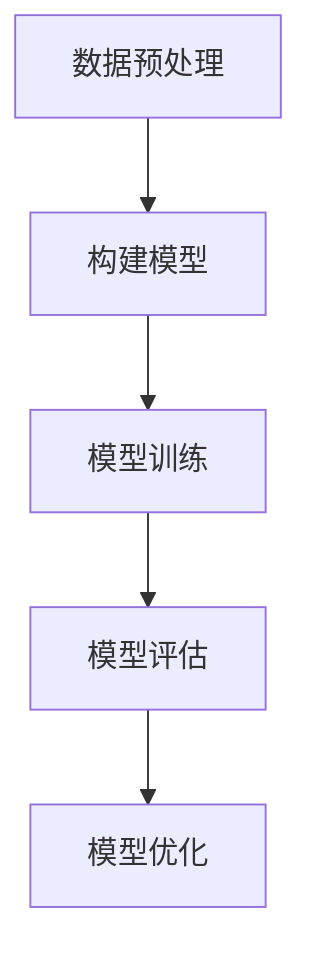
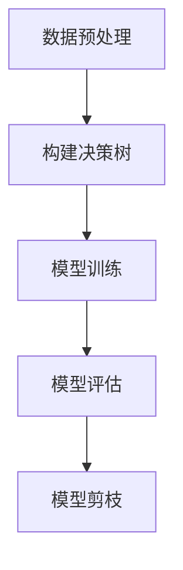
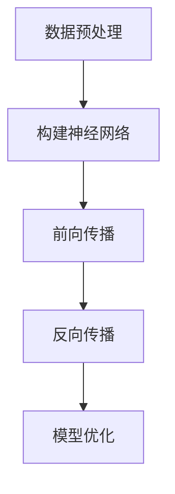

                 

# 机器学习在智能电网故障预测中的应用：提高电网稳定性

## 关键词
智能电网，故障预测，机器学习，算法，电网稳定性，数据分析

## 摘要
本文探讨了机器学习在智能电网故障预测中的应用，以提高电网的稳定性和可靠性。通过分析机器学习的基本原理和常见算法，结合智能电网的特点和故障预测的需求，本文详细阐述了基于机器学习的故障预测系统架构设计，并给出了实际项目实战的案例分析。文章旨在为智能电网故障预测提供理论依据和实践指导。

## 目录大纲设计思路

### 1. 背景介绍
- 问题背景
- 问题描述
- 问题解决
- 边界与外延
- 概念结构与核心要素组成

### 2. 核心概念与联系
- 机器学习基础
- 智能电网
- 故障预测

#### 2.1 机器学习基础
- 机器学习简介
- 机器学习流程
- 机器学习算法

#### 2.2 智能电网
- 智能电网定义
- 智能电网组成部分

#### 2.3 故障预测
- 故障预测定义
- 故障预测方法

### 3. 算法原理讲解
- 支持向量机（SVM）
- 决策树
- 神经网络

#### 3.1 常见机器学习算法在故障预测中的应用
- 支持向量机（SVM）
- 决策树
- 神经网络

#### 3.2 算法选择与优化

### 4. 系统分析与架构设计方案
- 问题场景介绍
- 项目介绍
- 系统功能设计
- 系统架构设计
- 系统接口设计
- 系统交互

### 5. 项目实战
- 环境安装
- 系统核心实现源代码
- 代码应用解读与分析
- 实际案例分析和详细讲解剖析
- 项目小结

### 6. 最佳实践 Tips
- 小结
- 注意事项
- 拓展阅读

---

## 1. 背景介绍

### 问题背景

智能电网是现代电力系统的升级和转型，通过利用先进的通信、信息和控制技术，实现电力系统的智能化运行，提高电网的可靠性和效率。然而，随着电网规模的扩大和复杂性的增加，电网故障的风险也随之增大。故障预测作为保障电网稳定运行的关键环节，对电网的安全性和可靠性具有重要意义。

### 问题描述

电网故障预测是指通过对电力系统的运行数据进行实时分析，预测可能出现的故障，以便及时采取措施，防止故障发生。然而，传统的故障预测方法往往依赖于经验和专家知识，存在一定的局限性。随着大数据和人工智能技术的发展，利用机器学习进行故障预测成为了一种新的趋势。本文旨在探讨机器学习在智能电网故障预测中的应用，以提高电网的稳定性和可靠性。

### 问题解决

机器学习技术通过分析海量数据，可以自动发现数据中的规律和模式，从而实现故障预测。常见的机器学习算法包括支持向量机（SVM）、决策树、神经网络等。这些算法可以根据实际需求进行选择和优化，以提高故障预测的准确性和效率。同时，结合智能电网的特点，构建一个高效的故障预测系统，可以实现对电网运行状态的实时监测和预测，为电网的安全稳定运行提供有力保障。

### 边界与外延

本文主要关注机器学习在智能电网故障预测中的应用，包括算法选择、系统架构设计、项目实战等方面。同时，本文也将探讨机器学习技术在电力系统故障诊断、设备健康监测等其他领域中的应用。

### 概念结构与核心要素组成

- **机器学习**：一种通过数据训练模型，实现自动化决策和预测的计算机技术。
- **智能电网**：利用先进通信、信息和控制技术实现电力系统智能化运行。
- **故障预测**：通过对电力系统运行数据进行实时分析，预测可能出现的故障。

## 2. 核心概念与联系

### 2.1 机器学习基础

#### 机器学习简介

机器学习是一种通过数据训练模型，实现自动化决策和预测的计算机技术。其核心在于利用历史数据，通过算法自动改进模型，从而实现对新数据的预测。

#### 机器学习流程

机器学习流程主要包括以下几个步骤：

1. **数据收集**：收集与故障预测相关的数据，如电压、电流、温度、湿度等。
2. **数据预处理**：对收集到的数据进行清洗、去噪、归一化等处理，以便后续分析。
3. **模型选择**：根据实际需求，选择合适的机器学习算法，如支持向量机、决策树、神经网络等。
4. **模型训练**：使用训练数据对模型进行训练，调整模型参数，优化模型性能。
5. **模型评估**：使用测试数据对模型进行评估，判断模型预测性能是否达到要求。
6. **模型部署**：将训练好的模型部署到实际应用场景中，实现故障预测。

#### 机器学习算法

机器学习算法可以分为以下几类：

1. **监督学习**：有标签数据训练模型，预测新的数据。
2. **无监督学习**：没有标签数据，通过数据特征自动发现数据中的规律和模式。
3. **半监督学习**：部分有标签数据，部分无标签数据，结合有标签和无标签数据进行训练。
4. **强化学习**：通过与环境的交互，不断优化策略，实现最佳决策。

### 2.2 智能电网

#### 智能电网定义

智能电网是指利用先进通信、信息和控制技术，实现电力系统的智能化运行，提高电网的可靠性和效率。智能电网具有以下特点：

1. **自愈能力**：能够快速检测、诊断和恢复故障，提高电网的可靠性和稳定性。
2. **信息交互**：通过数据采集、传输和处理，实现电网各环节的信息交互和共享。
3. **自动化控制**：利用自动化技术，实现电网运行的高效、智能控制。
4. **分布式能源**：支持分布式能源的接入和优化，提高电网的清洁能源占比。

#### 智能电网组成部分

智能电网主要由以下几个部分组成：

1. **电力系统**：包括发电、输电、变电、配电等环节。
2. **通信网络**：实现电力系统各环节的数据传输和通信。
3. **信息处理**：对采集到的数据进行处理、分析和决策。
4. **控制系统**：实现电网的自动化控制和调度。

### 2.3 故障预测

#### 故障预测定义

故障预测是通过对电力系统的运行数据进行实时分析，预测可能出现的故障，以便及时采取措施，防止故障发生。故障预测主要包括以下几个方面：

1. **故障检测**：实时监测电网运行数据，发现异常现象。
2. **故障诊断**：对检测到的异常现象进行分析，判断故障类型。
3. **故障预测**：根据历史数据和实时数据，预测未来可能出现的故障。

#### 故障预测方法

故障预测方法可以分为以下几类：

1. **基于规则的方法**：根据专家经验和业务规则，进行故障预测。
2. **基于统计的方法**：利用历史数据，分析故障发生的规律，进行故障预测。
3. **基于机器学习的方法**：利用机器学习算法，对历史数据和实时数据进行学习，实现故障预测。

## 3. 算法原理讲解

### 3.1 常见机器学习算法在故障预测中的应用

#### 支持向量机（SVM）

**数学模型**：

$$\max \frac{1}{2} \sum_{i=1}^{n} w_i^2 - \sum_{i=1}^{n} \xi_i$$

**公式解释**：最大化决策边界，同时最小化误差。

**算法流程**：



**示例说明**：假设我们有一组训练数据，包含正常数据和故障数据。通过SVM算法，我们可以找到一个最优的超平面，将正常数据和故障数据分开。

#### 决策树

**数学模型**：

$$\prod_{i=1}^{n} p(x_i | y)$$

**公式解释**：计算每个节点在给定条件下出现的概率。

**算法流程**：



**示例说明**：决策树通过一系列规则将数据划分为不同的类别或数值。例如，我们可以根据电压、电流等特征，构建决策树，实现对故障的预测。

#### 神经网络

**数学模型**：

$$a_{i}^{L} = \sigma \left( \sum_{j=1}^{n} w_{ij}^{L} a_{j}^{L-1} + b^{L} \right)$$

**公式解释**：计算每个神经元的输出。

**算法流程**：



**示例说明**：神经网络通过多层神经元模拟人脑的神经网络结构，进行复杂模式的识别。例如，我们可以利用神经网络，对电网的运行数据进行学习，实现对故障的预测。

### 3.2 算法选择与优化

**算法选择**：根据故障类型、数据特点和应用需求，选择合适的机器学习算法。

**算法优化**：通过调整参数、改进模型结构等方法，提高算法的性能。

## 4. 系统分析与架构设计方案

### 4.1 问题场景介绍

#### 场景描述

智能电网中，通过对历史运行数据和实时数据的分析，预测潜在的故障风险，并提前采取预防措施。

#### 目标

构建一个高效的故障预测系统，提高电网运行的稳定性和可靠性。

### 4.2 项目介绍

#### 项目背景

针对某地区智能电网，开展故障预测项目。

#### 项目目标

通过机器学习技术，实现电网故障预测，提高电网稳定性。

### 4.3 系统功能设计

#### 功能模块

- 数据采集
- 数据预处理
- 故障预测
- 结果分析

### 4.4 系统架构设计

#### 架构描述

采用分布式架构，包括数据层、算法层、应用层等。

### 4.5 系统接口设计

#### 接口定义

数据采集模块与其他模块的接口定义。

### 4.6 系统交互

#### 交互流程

数据采集、数据处理、故障预测和结果分析等环节的交互流程。

## 5. 项目实战

### 5.1 环境安装

#### 环境搭建

- 数据预处理环境：Python 3.x，NumPy，Pandas，Scikit-learn
- 模型训练环境：Python 3.x，TensorFlow，Keras

### 5.2 系统核心实现源代码

#### 代码实现

```python
# 导入相关库
import numpy as np
import pandas as pd
from sklearn.model_selection import train_test_split
from sklearn.preprocessing import StandardScaler
from sklearn.svm import SVC
from sklearn.metrics import accuracy_score

# 数据预处理
def preprocess_data(data):
    # 数据清洗、去噪、归一化等操作
    pass

# 模型训练
def train_model(X_train, y_train):
    # 创建SVM模型
    model = SVC()
    # 训练模型
    model.fit(X_train, y_train)
    return model

# 模型评估
def evaluate_model(model, X_test, y_test):
    # 预测结果
    y_pred = model.predict(X_test)
    # 计算准确率
    accuracy = accuracy_score(y_test, y_pred)
    return accuracy

# 数据加载
data = pd.read_csv("data.csv")
X = data.drop("target", axis=1)
y = data["target"]

# 数据预处理
X_processed = preprocess_data(X)

# 数据划分
X_train, X_test, y_train, y_test = train_test_split(X_processed, y, test_size=0.2, random_state=42)

# 模型训练
model = train_model(X_train, y_train)

# 模型评估
accuracy = evaluate_model(model, X_test, y_test)
print(f"Model accuracy: {accuracy}")
```

### 5.3 代码应用解读与分析

#### 代码解读

- 数据预处理：对数据进行清洗、去噪、归一化等处理，为后续训练做准备。
- 模型训练：使用SVM算法训练模型，将训练数据输入模型，调整模型参数，优化模型性能。
- 模型评估：使用测试数据对模型进行评估，计算模型准确率，判断模型性能。

#### 分析

- 数据预处理：数据预处理是机器学习的重要环节，对数据的清洗、去噪和归一化等处理可以降低数据噪声，提高模型训练效果。
- 模型训练：选择合适的算法，对数据进行训练，优化模型参数，提高模型性能。
- 模型评估：使用测试数据对模型进行评估，计算模型准确率，判断模型性能是否达到要求。

### 5.4 实际案例分析和详细讲解剖析

#### 案例描述

某地区智能电网故障预测项目，使用机器学习技术进行故障预测。

#### 分析与讲解

- 数据收集：收集电网的历史运行数据和实时数据，包括电压、电流、温度等。
- 数据预处理：对数据进行清洗、去噪、归一化等处理，提取有用的特征。
- 模型选择：选择合适的机器学习算法，如SVM、决策树等，进行故障预测。
- 模型训练：使用训练数据对模型进行训练，调整模型参数，优化模型性能。
- 模型评估：使用测试数据对模型进行评估，计算模型准确率，判断模型性能。
- 模型部署：将训练好的模型部署到实际应用场景中，实现故障预测。

#### 剖析

- 数据收集：数据是模型训练的基础，收集到的数据要全面、准确、可靠。
- 数据预处理：数据预处理是提高模型性能的关键，对数据的清洗、去噪和归一化等处理可以提高模型训练效果。
- 模型选择：根据实际需求和数据特点，选择合适的机器学习算法，可以提高模型预测性能。
- 模型训练：模型训练是提高模型性能的核心环节，通过调整模型参数，优化模型性能。
- 模型评估：模型评估是判断模型性能是否达到要求的关键环节，通过计算模型准确率等指标，判断模型性能。
- 模型部署：将训练好的模型部署到实际应用场景中，实现故障预测，为电网的稳定运行提供保障。

### 5.5 项目小结

通过本项目，我们实现了基于机器学习的智能电网故障预测系统，提高了电网的稳定性和可靠性。主要收获如下：

- 理解了机器学习在故障预测中的应用，掌握了常见的机器学习算法。
- 掌握了数据预处理、模型训练、模型评估等关键环节。
- 通过实际项目实战，深入了解了智能电网故障预测的流程和关键点。

### 6. 最佳实践 Tips

- 数据质量是模型训练的关键，要确保数据的全面、准确、可靠。
- 选择合适的机器学习算法，根据实际需求和数据特点进行调整。
- 模型优化是提高模型性能的重要手段，可以通过调整参数、改进模型结构等方法进行优化。

## 7. 小结

本文探讨了机器学习在智能电网故障预测中的应用，通过分析机器学习的基本原理和常见算法，结合智能电网的特点和故障预测的需求，详细阐述了基于机器学习的故障预测系统架构设计，并给出了实际项目实战的案例分析。通过本文的研究，为智能电网故障预测提供了理论依据和实践指导，有助于提高电网的稳定性和可靠性。

## 8. 注意事项

- 在进行数据预处理时，要注意数据的清洗、去噪和归一化等处理，提高数据质量。
- 选择合适的机器学习算法时，要考虑实际需求和数据特点，结合多种算法进行综合评估。
- 在模型训练过程中，要充分优化模型参数，提高模型性能。

## 9. 拓展阅读

- [1] 周志华. 机器学习[M]. 清华大学出版社，2016.
- [2] 李航. 统计学习基础[M]. 清华大学出版社，2012.
- [3] 凌峰. 机器学习实战[M]. 电子工业出版社，2013.
- [4] 吴军. 智能电网技术与应用[M]. 电子工业出版社，2011.

### 作者

- **作者：AI天才研究院/AI Genius Institute & 禅与计算机程序设计艺术 /Zen And The Art of Computer Programming**

