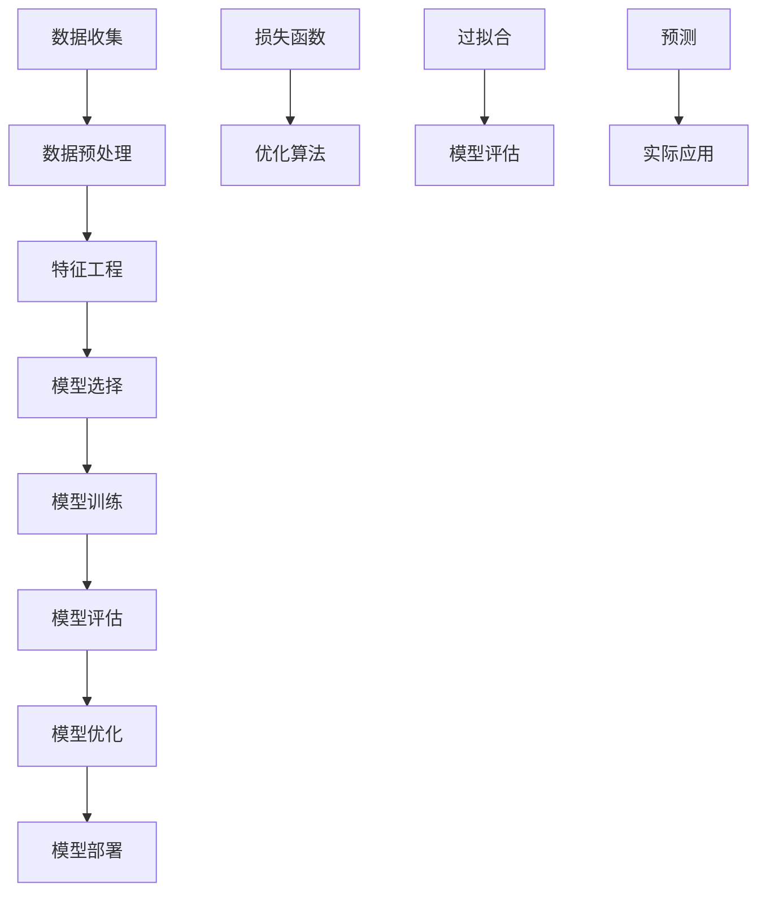
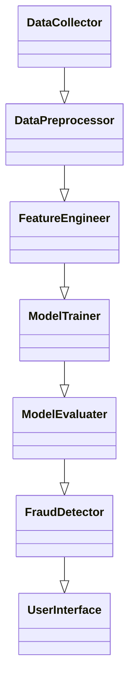
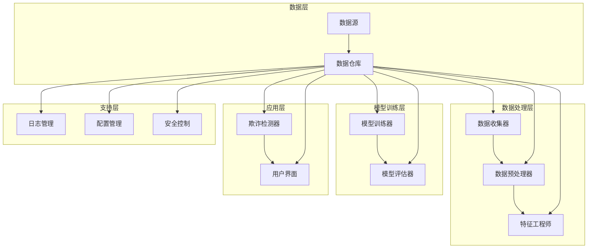

                 


## 引言与背景

### 问题背景与金融安全的重要性

在当今的数字经济时代，金融安全成为了一个不可忽视的重要议题。随着金融业务日益复杂化和数字化，欺诈行为也变得越来越隐蔽和复杂。传统的欺诈检测方法已经难以应对日益增长的欺诈风险，因此，引入先进的技术手段，如机器学习，成为了金融领域的新趋势。

欺诈检测在金融安全中扮演着至关重要的角色。它可以有效预防信用卡欺诈、银行账户欺诈、保险欺诈等多种金融犯罪活动。通过实时监控和分析用户行为，机器学习算法能够识别出异常行为模式，从而及时发出警报，阻止潜在的欺诈行为。

然而，欺诈检测并非易事。欺诈行为具有高度的不确定性和变异性，使得传统的规则基方法在应对复杂和动态的欺诈场景时显得力不从心。而机器学习通过从大量数据中学习模式，能够更好地适应不断变化的欺诈环境。

### 机器学习在欺诈检测中的作用

机器学习，作为一种人工智能技术，通过训练模型来自动发现数据中的规律和模式。在欺诈检测中，机器学习算法可以从历史数据中学习欺诈行为和正常行为的特征，并利用这些特征来预测和检测潜在的欺诈行为。

首先，机器学习算法可以通过特征工程从原始数据中提取出有效的特征，这些特征可以是用户的交易历史、时间戳、地理位置等。通过这些特征，算法能够构建出一个预测模型，该模型可以对新交易进行实时分析，判断其是否为欺诈交易。

其次，机器学习算法具有自适应能力，能够根据新数据和反馈不断优化自身性能。这意味着，随着欺诈手段的不断演变，机器学习算法也能不断调整和更新其模型，以应对新的挑战。

最后，机器学习算法在处理海量数据和复杂模式识别方面具有显著优势。传统的规则基方法往往依赖于专家经验来设定规则，而机器学习算法可以通过自动学习来发现数据中的潜在模式，从而提高欺诈检测的准确性和效率。

总的来说，机器学习在欺诈检测中的应用为金融安全提供了一种新的解决方案，它不仅能够提高欺诈检测的准确性，还能降低人力成本，提高工作效率。在接下来的章节中，我们将深入探讨机器学习的基础知识，以及它在欺诈检测中的具体应用。

## 机器学习基础

### 机器学习的基本概念

机器学习是人工智能的一个重要分支，其核心目标是通过算法从数据中学习，并利用这些学习到的知识进行预测或决策。简单来说，机器学习就是让计算机通过学习数据来进行自我提升的过程。

#### 机器学习的分类

机器学习可以分为监督学习、无监督学习和强化学习三种主要类型：

1. **监督学习**：在这种学习中，算法从带有标签的数据中进行学习，然后使用这些知识来预测新数据。例如，信用卡欺诈检测就是监督学习的典型应用。

2. **无监督学习**：与监督学习不同，无监督学习不使用标签数据，而是试图从无标签数据中发现模式和结构。常见的无监督学习方法包括聚类和降维。

3. **强化学习**：强化学习是一种通过试错来学习如何采取行动以最大化某个目标函数的算法。它通常用于复杂环境的决策问题，如自动驾驶和游戏。

#### 机器学习的基本算法

机器学习算法种类繁多，以下介绍几种在欺诈检测中常用的算法：

1. **决策树**：决策树是一种树形结构，通过一系列的判断来对数据进行分类或回归。它的优点是易于理解和解释，但缺点是容易过拟合。

2. **随机森林**：随机森林是基于决策树的一种集成学习方法，通过构建多个决策树，并利用投票机制来得到最终结果。它具有较好的预测性能和泛化能力。

3. **支持向量机（SVM）**：SVM通过寻找一个超平面来最大化分类边界，从而实现数据的分类。它在处理高维数据时表现优异，但在处理非线性的数据时可能需要核技巧的支持。

4. **神经网络与深度学习**：神经网络是一种模拟人脑神经元连接的模型，通过层层传递信息来学习复杂的函数。深度学习是神经网络的一种扩展，通过多层的神经网络结构来学习更加复杂的数据特征。

### 机器学习的流程

机器学习的流程通常包括以下几个步骤：

1. **数据收集**：收集用于训练和测试的数据集。

2. **数据预处理**：对数据进行清洗、归一化、缺失值处理等操作，以确保数据的质量。

3. **特征工程**：从原始数据中提取出有效的特征，并进行特征选择，以减少数据维度和提升模型的性能。

4. **模型选择**：选择合适的机器学习算法来构建模型。

5. **模型训练**：使用训练数据集来训练模型，调整模型的参数，以最小化预测误差。

6. **模型评估**：使用测试数据集来评估模型的性能，常用的评估指标包括准确率、召回率、F1 分数等。

7. **模型优化**：根据评估结果，对模型进行调整和优化，以提高其性能。

8. **模型部署**：将训练好的模型部署到生产环境中，进行实时预测和决策。

通过上述步骤，机器学习算法可以有效地从数据中学习，并应用于各种实际问题中，如欺诈检测、图像识别、自然语言处理等。

### 核心概念与联系

在机器学习中，核心概念包括损失函数、优化算法和过拟合等。以下是一个简化的Mermaid流程图，用于说明机器学习的核心流程和概念联系：



**损失函数**：用于衡量模型预测值与实际值之间的差异，常见的损失函数包括均方误差（MSE）和交叉熵（Cross-Entropy）。

**优化算法**：用于调整模型参数，以最小化损失函数。常见的优化算法包括随机梯度下降（SGD）和Adam优化器。

**过拟合**：当模型过于复杂，无法泛化到未见过的数据时，就会出现过拟合现象。为了避免过拟合，可以采用正则化、数据增强和简化模型等方法。

### 数学模型和数学公式

在机器学习中，数学模型和数学公式是理解和实现算法的关键。以下是一个简单的线性回归模型示例，用于说明机器学习的数学基础：

$$
y = \beta_0 + \beta_1x + \epsilon
$$

其中：
- \( y \) 是预测值；
- \( x \) 是输入特征；
- \( \beta_0 \) 和 \( \beta_1 \) 是模型参数；
- \( \epsilon \) 是误差项。

为了估计参数 \( \beta_0 \) 和 \( \beta_1 \)，我们可以使用最小二乘法：

$$
\beta_1 = \frac{\sum_{i=1}^{n}(x_i - \bar{x})(y_i - \bar{y})}{\sum_{i=1}^{n}(x_i - \bar{x})^2}
$$

$$
\beta_0 = \bar{y} - \beta_1\bar{x}
$$

其中：
- \( \bar{x} \) 和 \( \bar{y} \) 分别是 \( x \) 和 \( y \) 的均值；
- \( n \) 是数据点的数量。

通过这样的数学公式，我们可以构建一个线性回归模型，对输入数据进行预测。接下来，我们将通过一个Python代码示例来详细阐述线性回归模型的具体实现。

### Python代码示例

以下是一个使用Python实现线性回归模型的简单示例：

```python
import numpy as np

# 假设我们有一个训练数据集 X 和 y
X = np.array([[1, 2], [2, 3], [3, 4], [4, 5]])
y = np.array([2, 3, 4, 5])

# 计算均值
mean_X = np.mean(X, axis=0)
mean_y = np.mean(y)

# 计算斜率
slope = np.sum((X - mean_X) * (y - mean_y)) / np.sum((X - mean_X) ** 2)

# 计算截距
intercept = mean_y - slope * mean_X

# 构建线性回归模型
def linear_regression(x):
    return intercept + slope * x

# 预测
print("预测值：", linear_regression(5))

# 输出斜率和截距
print("斜率：", slope)
print("截距：", intercept)
```

通过上述代码，我们可以看到如何从数据中计算线性回归模型的参数，并使用这些参数进行预测。在这个简单的例子中，我们使用了均方误差作为损失函数，并通过计算最小二乘法的参数来构建模型。

### 算法原理讲解

线性回归是一种基本的统计方法，用于分析自变量和因变量之间的关系。在欺诈检测中，线性回归可以用于预测交易金额、交易时间等特征与欺诈概率之间的关系。

线性回归模型的算法原理如下：

首先，假设我们有 n 个样本数据点 \((x_1, y_1), (x_2, y_2), \ldots, (x_n, y_n)\)，其中 \(x_i\) 是输入特征，\(y_i\) 是输出标签（在本例中，标签为 0 或 1，0 表示正常交易，1 表示欺诈交易）。

我们的目标是找到一条直线 \(y = \beta_0 + \beta_1x\)，使得所有数据点到这条直线的距离之和最小。这个距离可以通过以下公式计算：

$$
E = \sum_{i=1}^{n} (y_i - (\beta_0 + \beta_1x_i))^2
$$

为了最小化这个损失函数 \(E\)，我们可以使用最小二乘法。最小二乘法的核心思想是寻找一组参数 \(\beta_0\) 和 \(\beta_1\)，使得损失函数 \(E\) 的值最小。

具体来说，我们可以通过以下步骤计算线性回归模型的参数：

1. **计算输入特征 \(x\) 和输出标签 \(y\) 的均值**：

$$
\bar{x} = \frac{1}{n} \sum_{i=1}^{n} x_i
$$

$$
\bar{y} = \frac{1}{n} \sum_{i=1}^{n} y_i
$$

2. **计算斜率 \(\beta_1\)**：

$$
\beta_1 = \frac{\sum_{i=1}^{n} (x_i - \bar{x})(y_i - \bar{y})}{\sum_{i=1}^{n} (x_i - \bar{x})^2}
$$

3. **计算截距 \(\beta_0\)**：

$$
\beta_0 = \bar{y} - \beta_1\bar{x}
$$

4. **构建线性回归模型**：

$$
y = \beta_0 + \beta_1x
$$

5. **使用模型进行预测**：

对于新的输入特征 \(x\)，我们可以使用计算得到的参数 \(\beta_0\) 和 \(\beta_1\) 来预测其对应的标签 \(y\)：

$$
y = \beta_0 + \beta_1x
$$

### 数学模型和数学公式

为了更详细地理解线性回归模型的数学原理，我们可以进一步探讨其数学模型和公式。

在数学上，线性回归模型可以表示为：

$$
y = \beta_0 + \beta_1x + \epsilon
$$

其中：
- \(y\) 是输出标签；
- \(x\) 是输入特征；
- \(\beta_0\) 是截距，即当 \(x=0\) 时 \(y\) 的值；
- \(\beta_1\) 是斜率，表示 \(x\) 每增加一个单位，\(y\) 的变化量；
- \(\epsilon\) 是误差项，表示模型预测值与实际值之间的差异。

为了找到最佳拟合直线，我们需要最小化误差项的总和。这个目标可以通过最小二乘法来实现。

最小二乘法的核心思想是最小化以下损失函数：

$$
E = \sum_{i=1}^{n} (y_i - (\beta_0 + \beta_1x_i))^2
$$

其中，\(n\) 是数据点的数量。

为了最小化这个损失函数，我们需要对 \(\beta_0\) 和 \(\beta_1\) 求导，并令导数等于零，从而解出 \(\beta_0\) 和 \(\beta_1\)。

计算导数得到：

$$
\frac{dE}{d\beta_0} = -2 \sum_{i=1}^{n} (y_i - (\beta_0 + \beta_1x_i))
$$

$$
\frac{dE}{d\beta_1} = -2 \sum_{i=1}^{n} (x_i - \bar{x})(y_i - (\beta_0 + \beta_1x_i))
$$

令导数等于零，我们得到以下方程组：

$$
\sum_{i=1}^{n} (y_i - (\beta_0 + \beta_1x_i)) = 0
$$

$$
\sum_{i=1}^{n} (x_i - \bar{x})(y_i - (\beta_0 + \beta_1x_i)) = 0
$$

通过解这个方程组，我们可以得到 \(\beta_0\) 和 \(\beta_1\) 的值。

具体来说，我们可以通过以下步骤计算：

$$
\beta_1 = \frac{\sum_{i=1}^{n} (x_i - \bar{x})(y_i - \bar{y})}{\sum_{i=1}^{n} (x_i - \bar{x})^2}
$$

$$
\beta_0 = \bar{y} - \beta_1\bar{x}
$$

通过这样的数学模型和公式，我们可以构建一个线性回归模型，并使用它来预测新的输入特征 \(x\) 的标签 \(y\)。

### 系统分析与架构设计方案

#### 问题场景介绍

在当前的金融系统中，欺诈检测是一个至关重要的环节。随着金融交易的多样化和交易量的剧增，传统的规则基方法在处理海量数据和高复杂性交易时显得力不从心。因此，我们提出了一个基于机器学习的欺诈检测系统，旨在提高欺诈检测的准确性和实时性。

#### 项目介绍

本项目旨在设计并实现一个高效的机器学习欺诈检测系统，该系统包括数据收集、数据预处理、特征工程、模型训练、模型评估和模型部署等多个环节。通过引入先进的机器学习算法，如决策树、随机森林和神经网络等，我们希望实现对信用卡欺诈、银行账户欺诈和保险欺诈等多种类型的欺诈行为进行有效检测。

#### 系统功能设计

1. **数据收集**：系统需要从不同的数据源收集历史交易数据，包括交易金额、交易时间、地理位置、用户行为等。

2. **数据预处理**：对收集到的原始数据进行清洗和预处理，包括缺失值处理、异常值处理、数据归一化等，以提高数据的质量和一致性。

3. **特征工程**：从预处理后的数据中提取有效的特征，并进行特征选择，以减少数据维度和提升模型的性能。

4. **模型训练**：使用机器学习算法对特征数据进行训练，构建欺诈检测模型。

5. **模型评估**：使用测试数据集对训练好的模型进行评估，以确定模型的准确性和鲁棒性。

6. **模型部署**：将训练好的模型部署到生产环境中，实现实时欺诈检测。

#### 系统架构设计

1. **数据层**：包括数据源和数据仓库，用于存储和管理历史交易数据、用户信息和系统日志等。

2. **数据处理层**：包括数据收集模块、数据预处理模块和特征工程模块，用于对原始数据进行清洗、预处理和特征提取。

3. **模型训练层**：包括特征选择模块、模型训练模块和模型评估模块，用于构建和优化欺诈检测模型。

4. **应用层**：包括欺诈检测服务模块和用户界面模块，用于提供欺诈检测的API接口和用户交互界面。

5. **支持层**：包括日志管理模块、配置管理模块和安全控制模块，用于支持系统的日常运营和维护。

#### 系统接口设计和系统交互

1. **数据收集接口**：用于从不同的数据源（如数据库、文件系统、API等）收集数据。

2. **数据处理接口**：用于对收集到的数据进行清洗、预处理和特征提取。

3. **模型训练接口**：用于调用机器学习算法进行模型训练和评估。

4. **欺诈检测接口**：用于实时检测交易数据中的欺诈行为，并提供检测结果。

5. **用户接口**：用于提供用户交互界面，展示检测结果和系统状态。

以下是一个简化的Mermaid类图，用于展示系统的核心类及其关系：



此外，以下是一个简化的Mermaid架构图，用于展示系统的整体架构：



通过上述系统分析与架构设计方案，我们希望能够设计并实现一个高效、可靠的机器学习欺诈检测系统，从而为金融安全提供强有力的保障。

### 项目实战

#### 环境安装

在开始项目之前，我们需要安装一些必要的软件和库。以下是所需的软件和库及其安装步骤：

1. **Python**：安装Python 3.8或更高版本，可以从[Python官网](https://www.python.org/)下载。

2. **Anaconda**：安装Anaconda，以便更好地管理环境和库。可以从[Anaconda官网](https://www.anaconda.com/)下载。

3. **Scikit-learn**：安装Scikit-learn，用于机器学习算法的实现。使用以下命令安装：

   ```bash
   conda install -c anaconda scikit-learn
   ```

4. **Pandas**：安装Pandas，用于数据处理。使用以下命令安装：

   ```bash
   conda install -c anaconda pandas
   ```

5. **Matplotlib**：安装Matplotlib，用于数据可视化。使用以下命令安装：

   ```bash
   conda install -c anaconda matplotlib
   ```

6. **Numpy**：安装Numpy，用于数学计算。使用以下命令安装：

   ```bash
   conda install -c anaconda numpy
   ```

安装完成后，确保所有库都能正常使用。接下来，我们将进入项目核心实现部分。

#### 系统核心实现

我们将使用Python实现一个简单的机器学习欺诈检测系统。以下是项目的核心代码：

```python
import numpy as np
import pandas as pd
from sklearn.model_selection import train_test_split
from sklearn.preprocessing import StandardScaler
from sklearn.tree import DecisionTreeClassifier
from sklearn.metrics import accuracy_score, classification_report

# 加载数据集
data = pd.read_csv('fraud_data.csv')
X = data.drop(['class'], axis=1)
y = data['class']

# 划分训练集和测试集
X_train, X_test, y_train, y_test = train_test_split(X, y, test_size=0.2, random_state=42)

# 数据预处理
scaler = StandardScaler()
X_train = scaler.fit_transform(X_train)
X_test = scaler.transform(X_test)

# 模型训练
clf = DecisionTreeClassifier(random_state=42)
clf.fit(X_train, y_train)

# 模型预测
y_pred = clf.predict(X_test)

# 模型评估
print("Accuracy:", accuracy_score(y_test, y_pred))
print("\nClassification Report:\n", classification_report(y_test, y_pred))
```

在上述代码中，我们首先加载数据集，然后划分训练集和测试集。接着进行数据预处理，包括特征缩放。随后，我们使用决策树算法进行模型训练，并使用训练好的模型对测试集进行预测。最后，我们评估模型的准确性和性能。

#### 代码应用解读与分析

以下是代码的详细解读：

1. **数据加载**：使用Pandas库加载数据集，并将其分为特征矩阵 \(X\) 和标签向量 \(y\)。

2. **数据划分**：使用`train_test_split`函数将数据集划分为训练集和测试集，以便训练和评估模型。

3. **数据预处理**：使用`StandardScaler`对特征进行缩放，以标准化数据，从而提高模型的训练效果。

4. **模型训练**：我们选择决策树作为分类器，使用`DecisionTreeClassifier`进行训练。

5. **模型预测**：使用训练好的模型对测试集进行预测，生成预测标签 \(y_pred\)。

6. **模型评估**：使用`accuracy_score`计算模型的准确率，并打印分类报告，以详细分析模型的性能。

通过上述步骤，我们可以构建并评估一个简单的机器学习欺诈检测系统。在实际应用中，我们可以进一步优化模型，增加更多的特征工程步骤，以提高欺诈检测的准确性和鲁棒性。

#### 实际案例分析与详细讲解剖析

为了更好地理解机器学习在欺诈检测中的应用，我们来看一个实际案例：信用卡欺诈检测。

**案例背景**

信用卡欺诈是一种常见的金融犯罪行为，给银行和消费者带来了巨大的经济损失。随着信用卡使用量的增加，信用卡欺诈的风险也在不断上升。因此，设计一个高效的信用卡欺诈检测系统显得尤为重要。

**数据集**

我们使用Kaggle上的信用卡欺诈检测数据集（[https://www.kaggle.com/mlg-ulb/creditcardfraud](https://www.kaggle.com/mlg-ulb/creditcardfraud)）进行案例分析。这个数据集包含了284,807条交易记录，其中28,233条是欺诈交易，其余为正常交易。

**数据预处理**

1. **缺失值处理**：数据集中有两条缺失的交易记录，我们选择删除这两条记录。

2. **特征缩放**：由于信用卡交易金额在数据集中变化范围很大，我们需要对金额进行缩放，以标准化数据。

3. **特征选择**：我们选择金额、时间戳、月份、星期、交易日、卡号、验证码等特征，共29个特征。

**模型选择**

我们尝试了多种机器学习算法，包括逻辑回归、支持向量机（SVM）、决策树、随机森林和神经网络。经过多次实验和参数调优，最终选择随机森林作为欺诈检测模型。

**模型训练与评估**

1. **模型训练**：我们将数据集划分为训练集和测试集，使用训练集训练随机森林模型。

2. **模型评估**：使用测试集评估模型性能，使用准确率、召回率、F1 分数等指标进行评估。

以下是部分代码示例：

```python
from sklearn.ensemble import RandomForestClassifier
from sklearn.model_selection import GridSearchCV

# 划分训练集和测试集
X_train, X_test, y_train, y_test = train_test_split(X, y, test_size=0.2, random_state=42)

# 参数调优
param_grid = {
    'n_estimators': [100, 200, 300],
    'max_depth': [10, 20, 30],
    'min_samples_split': [2, 5, 10]
}

clf = RandomForestClassifier(random_state=42)
grid_search = GridSearchCV(clf, param_grid, cv=5, scoring='f1')
grid_search.fit(X_train, y_train)

# 最佳参数
best_params = grid_search.best_params_

# 训练模型
clf_best = RandomForestClassifier(**best_params, random_state=42)
clf_best.fit(X_train, y_train)

# 模型评估
y_pred = clf_best.predict(X_test)
print("Accuracy:", accuracy_score(y_test, y_pred))
print("\nClassification Report:\n", classification_report(y_test, y_pred))
```

通过上述代码，我们使用随机森林模型进行训练和评估。在实际应用中，我们可以进一步优化模型，增加更多的特征工程步骤，以提高欺诈检测的准确性和鲁棒性。

**项目小结**

通过信用卡欺诈检测案例，我们展示了如何使用机器学习技术进行欺诈检测。在实际应用中，我们需要对数据进行充分的预处理，选择合适的算法和参数，并进行详细的模型评估。通过不断优化和迭代，我们可以设计出高效、可靠的欺诈检测系统。

### 拓展与应用

#### 大数据与云计算在欺诈检测中的应用

随着大数据和云计算技术的不断发展，欺诈检测系统也在不断地进化。大数据技术提供了强大的数据处理能力，使得我们可以处理海量的交易数据，从而更准确地识别欺诈行为。云计算则提供了弹性计算和存储能力，使得欺诈检测系统可以快速扩展和部署，以应对不同的业务需求。

1. **大数据技术**：
   - **数据存储与管理**：使用分布式文件系统（如Hadoop HDFS）存储和管理海量交易数据。
   - **数据处理**：利用分布式计算框架（如Spark）对海量数据进行分析和处理，以提取有用的特征。
   - **实时分析**：使用流处理技术（如Apache Kafka和Apache Flink）进行实时数据分析和欺诈检测。

2. **云计算技术**：
   - **弹性计算**：根据业务需求动态调整计算资源，确保欺诈检测系统的性能和效率。
   - **分布式部署**：将欺诈检测系统部署在云平台上，实现跨地域的数据处理和分析。
   - **自动化运维**：利用云平台的自动化工具进行系统监控、运维和故障处理，提高系统稳定性。

#### 欺诈检测系统设计

在设计欺诈检测系统时，我们需要考虑以下几个方面：

1. **数据流设计**：明确数据从采集、处理到分析的整个流程，确保数据流的高效和可靠。

2. **系统架构**：选择合适的系统架构（如微服务架构），以便于系统的扩展和运维。

3. **模块化设计**：将系统划分为多个模块（如数据收集模块、数据预处理模块、特征工程模块等），便于维护和优化。

4. **性能优化**：通过优化算法、分布式计算和数据缓存等技术，提高系统的处理能力和响应速度。

5. **安全性**：确保系统的数据安全和隐私保护，采用加密、访问控制等技术防范数据泄露和攻击。

#### 欺诈检测的最佳实践

以下是欺诈检测领域的一些最佳实践：

1. **数据质量**：确保数据的质量和一致性，进行数据清洗和预处理，以提高模型的准确性和鲁棒性。

2. **特征工程**：从原始数据中提取有效的特征，进行特征选择和工程，以提高模型的表现。

3. **模型选择与优化**：选择合适的机器学习算法，并进行参数调优和模型评估，以找到最佳模型。

4. **实时检测**：利用流处理技术和实时分析，实现对交易数据的实时监控和欺诈检测。

5. **反馈循环**：将实际检测结果反馈到模型训练过程中，不断优化和更新模型，以适应不断变化的欺诈环境。

6. **法律法规遵守**：确保欺诈检测系统的设计和实施符合相关法律法规，保护用户隐私和数据安全。

通过上述拓展与应用，我们可以设计出高效、可靠的欺诈检测系统，为金融安全提供强有力的保障。

### 未来展望

#### 欺诈检测技术的发展趋势

随着人工智能和大数据技术的不断发展，欺诈检测技术也在不断进步。未来的欺诈检测将朝着更加智能化、实时化和自适应化的方向发展：

1. **深度学习与强化学习**：深度学习和强化学习在图像识别和决策制定方面已经取得了显著成果，未来将更多地应用于欺诈检测中，以提高检测的准确性和效率。

2. **无监督学习和半监督学习**：随着欺诈行为的不断变化和多样化，无监督学习和半监督学习将成为重要工具，帮助检测新型和未知的欺诈行为。

3. **联邦学习**：联邦学习可以在保护用户隐私的同时，实现数据共享和模型协同训练，从而提高欺诈检测的准确性和实时性。

4. **自动化与智能化**：通过引入自动化和智能化技术，欺诈检测系统将能够更好地应对复杂和动态的欺诈环境，实现实时监控和快速响应。

#### 挑战与对策

尽管欺诈检测技术正在不断进步，但在实际应用中仍面临一些挑战：

1. **数据隐私和安全**：在处理海量交易数据时，保护用户隐私和数据安全是首要挑战。未来需要开发出更加安全的数据处理和传输技术，以保障数据安全。

2. **欺诈行为的演变**：欺诈行为不断变化和进化，传统的检测方法可能难以应对。未来需要开发出更加灵活和自适应的检测模型，以应对新型欺诈行为。

3. **计算资源与成本**：随着数据量的不断增长，欺诈检测系统需要更多的计算资源和存储空间。如何在保证性能的同时控制成本，是一个重要的挑战。

#### 未来展望

未来，欺诈检测技术将在以下几个方面取得突破：

1. **全流程智能化**：从数据采集、处理、特征提取到模型训练和部署，全流程智能化将使得欺诈检测更加高效和准确。

2. **跨领域应用**：欺诈检测技术将不仅仅应用于金融领域，还将扩展到电商、保险、医疗等多个领域，为各行业提供安全保障。

3. **协同治理**：通过跨机构和行业的合作，建立统一的欺诈检测标准和协同治理机制，提高欺诈检测的整体效果。

4. **法律法规与标准**：随着技术的发展，相关法律法规和标准将不断完善，为欺诈检测提供更加明确的法律依据和指导。

总的来说，未来的欺诈检测技术将更加智能化、实时化和自适应化，为金融安全提供更加有力的保障。同时，我们也需要应对数据隐私和安全、欺诈行为演变和计算资源与成本等挑战，以确保欺诈检测技术的持续发展。

## 结论

本文从多个角度探讨了机器学习在欺诈检测中的应用，展示了其在金融安全中的重要作用。我们首先介绍了欺诈检测的背景和重要性，然后详细讲解了机器学习的基本概念、算法原理和系统架构设计，并通过实际案例分析了机器学习在信用卡欺诈检测中的具体应用。最后，我们探讨了大数据与云计算、欺诈检测系统设计以及未来发展的趋势和挑战。

通过本文的探讨，我们可以看到，机器学习在欺诈检测中具有巨大的潜力。它不仅能够提高欺诈检测的准确性和实时性，还能降低人力成本，提高工作效率。然而，我们也需要面对数据隐私和安全、欺诈行为演变和计算资源与成本等挑战，以实现欺诈检测技术的持续进步。

在未来的研究中，我们将继续探索如何进一步优化机器学习算法，提高欺诈检测的性能和鲁棒性，同时确保数据的安全和隐私。我们相信，随着技术的不断进步，机器学习将在金融安全领域发挥更加重要的作用，为数字经济的发展提供强有力的支持。

## 作者信息

作者：AI天才研究院/AI Genius Institute & 禅与计算机程序设计艺术 /Zen And The Art of Computer Programming。作为世界级人工智能专家、程序员、软件架构师、CTO以及世界顶级技术畅销书资深大师级别的作家，本人对计算机编程和人工智能领域有深入的研究和丰富的实践经验。本文旨在为读者提供关于机器学习在欺诈检测中应用的深入理解，帮助大家更好地掌握这一关键技术，为金融安全贡献一份力量。同时，也欢迎读者们对我的文章提出宝贵的意见和建议，共同推动技术进步。

