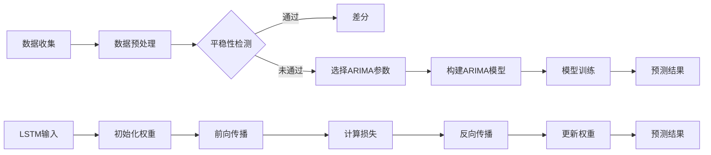
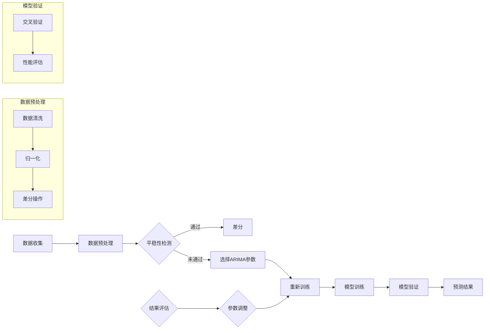
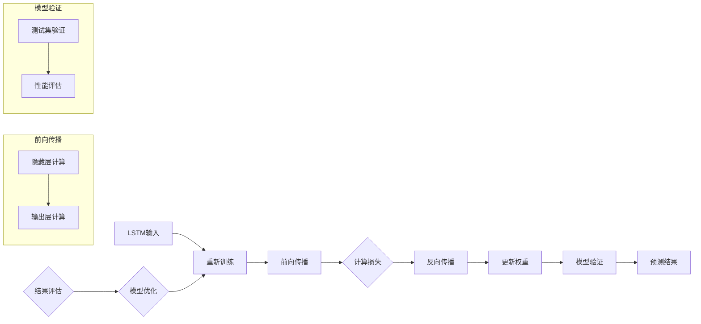
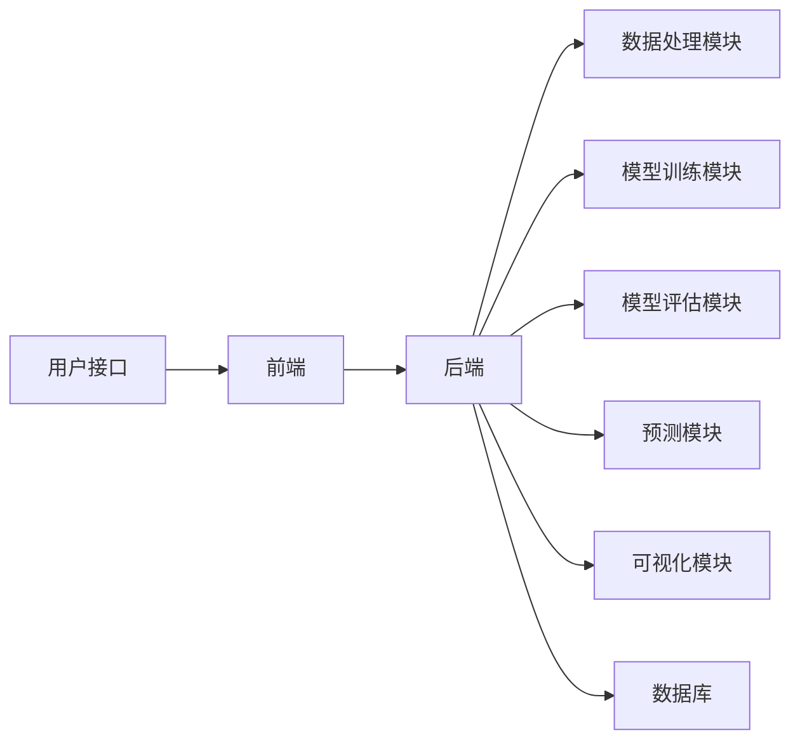
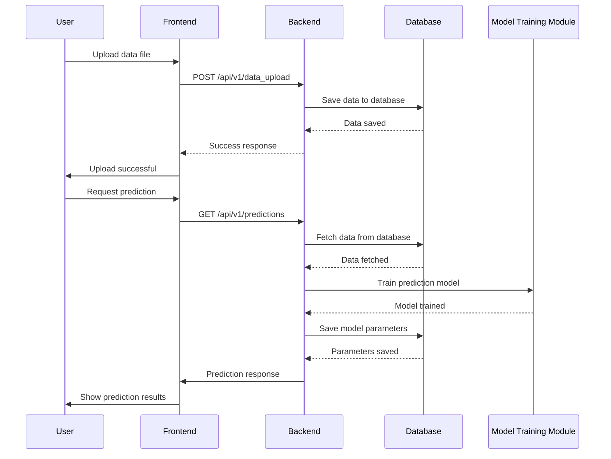

                 

## 机器学习在气候变化预测中的应用

### 关键词：气候变化、预测、机器学习、深度学习、数据科学

> 摘要：本文深入探讨了机器学习在气候变化预测中的应用。首先，我们分析了气候变化对地球生态系统的影响，以及准确预测气候变化的紧迫性和重要性。接着，介绍了机器学习的基本概念、核心算法及其在气候变化预测中的关键挑战。随后，详细阐述了机器学习在气候预测中的实践应用，包括数据来源、模型选择、案例分析及未来发展趋势。本文通过对比不同算法的属性与特点，绘制了实体关系图，深入理解了核心概念，并讲解了时间序列预测算法和深度学习算法的原理，以及其实际应用中的算法流程图与Python实现。最后，文章总结了机器学习在气候变化预测中的未来发展方向，并提出了相关的社会影响与伦理问题，为读者提供了全面的指导。

## 第一部分: 机器学习的背景与应用

### 1.1 问题的背景和描述

#### 1.1.1 气候变化与预测的重要性

气候变化是指地球大气和海洋温度、降水模式、风模式和海平面等气候要素长期变化的趋势。随着人类活动的加剧，如化石燃料的燃烧、森林砍伐和工业排放，温室气体浓度不断上升，导致全球气候变暖。气候变化对地球生态系统、人类生活和经济活动产生了深远的影响。例如，极端天气事件增多、海平面上升、农作物减产、水资源短缺和生物多样性丧失等问题日益严重。

准确预测气候变化不仅有助于提前应对潜在的风险，还可以为政策制定者提供科学依据，制定有效的应对策略。然而，气候变化预测的复杂性使其成为一个极具挑战性的问题。传统的预测方法主要依赖于物理学模型和统计数据，但它们存在一些局限性，例如难以捕捉非线性关系、对初始条件的敏感性高等。因此，引入机器学习技术成为了一个值得探索的方向。

#### 1.1.2 机器学习在气候变化预测中的应用现状

近年来，机器学习在气候变化预测领域取得了显著的进展。研究者们利用机器学习算法对气候数据进行处理和分析，开发了多种预测模型，例如时间序列模型、回归模型和深度学习模型等。这些模型在不同程度上提高了气候变化预测的准确性和可靠性。例如，基于深度学习的时间序列模型LSTM（Long Short-Term Memory）在长期气候预测中表现出良好的性能。

此外，机器学习在气候变化预测中的应用不仅限于单一模型，还涉及到多模型融合和优化。通过结合不同模型的优点，可以进一步提高预测结果的稳定性和精度。同时，机器学习技术还在气候模式与数据源的整合、模型选择与调优等方面发挥了重要作用。

#### 1.1.3 本书的主要目标与读者对象

本书的主要目标是系统地介绍机器学习在气候变化预测中的应用，帮助读者了解该领域的最新进展和技术原理。本书针对的对象包括：

1. 气象学、环境科学和计算机科学等领域的科研人员。
2. 数据科学家、机器学习工程师和软件工程师。
3. 对气候变化和机器学习技术感兴趣的专业人士和爱好者。
4. 高校和研究机构的学生和教师。

通过阅读本书，读者可以：

1. 理解气候变化的基本概念和预测的重要性。
2. 掌握机器学习的基本原理和核心算法。
3. 学习如何利用机器学习技术进行气候变化预测。
4. 探索机器学习在气候变化预测中的未来发展。

### 1.2 机器学习的基本概念与原理

#### 1.2.1 机器学习的定义与发展历程

机器学习是人工智能的一个重要分支，主要研究如何让计算机从数据中自动学习和改进，从而实现智能行为。机器学习的核心思想是构建能够从数据中学习规律和模式的算法，使计算机能够根据新的数据作出决策或预测。

机器学习的发展历程可以分为以下几个阶段：

1. **监督学习**：通过已有数据集的输入和输出关系，训练模型以预测新的输入。典型的算法包括线性回归、支持向量机和决策树等。
2. **无监督学习**：从未标记的数据中发现隐藏的结构或模式，如聚类分析和降维技术。
3. **强化学习**：通过与环境的交互，学习在特定策略下最大化回报。常用的算法包括Q学习、深度Q网络（DQN）等。
4. **迁移学习**：利用已有模型的知识，在新任务上快速取得良好性能。

#### 1.2.2 机器学习的核心算法与模型

机器学习涵盖了多种核心算法和模型，常见的有：

1. **线性回归**：用于预测连续值输出，是最基础的监督学习算法。
2. **决策树**：通过构建树形模型进行分类或回归，易于理解和解释。
3. **支持向量机（SVM）**：通过找到最优超平面进行分类，对高维数据有很好的性能。
4. **神经网络**：特别是深度神经网络（DNN），通过多层非线性变换进行复杂函数逼近。
5. **集成学习方法**：如随机森林、提升树等，通过结合多个弱模型提高整体性能。
6. **聚类算法**：如K-均值、层次聚类等，用于发现数据中的隐含结构。
7. **降维技术**：如主成分分析（PCA）、线性判别分析（LDA）等，用于降低数据维度，提高模型效率。

#### 1.2.3 机器学习的基本原理与工作机制

机器学习的基本原理可以概括为以下几个步骤：

1. **数据收集**：收集相关的训练数据，这些数据应具有代表性、多样性和准确性。
2. **数据处理**：对数据进行清洗、归一化、缺失值填补等预处理，以提高数据质量和模型性能。
3. **模型选择**：根据问题的性质和数据的特点，选择合适的模型。
4. **模型训练**：使用训练数据对模型进行训练，调整模型的参数，使其能够正确地预测新的数据。
5. **模型评估**：使用测试数据评估模型的性能，常用的评估指标包括准确率、召回率、F1分数等。
6. **模型优化**：根据评估结果对模型进行调整和优化，以提高预测的准确性。

#### 1.3 机器学习在气候变化预测中的关键挑战

虽然机器学习在气候变化预测中显示出巨大的潜力，但仍面临一些关键挑战：

1. **数据质量与多样性**：气候变化数据通常包含噪声、缺失值和异常值，需要高质量的数据清洗和处理方法。
2. **模型选择与调优**：选择合适的模型和优化参数对提高预测性能至关重要，但这一过程通常需要大量的实验和计算资源。
3. **模型解释性与透明度**：气候变化预测模型通常涉及复杂的非线性关系，模型的解释性和透明度对于理解预测结果和建立信任至关重要。
4. **计算资源与时间成本**：深度学习模型特别是大型模型，需要大量的计算资源和时间进行训练和推理。

#### 1.4 机器学习在气候变化预测中的实践应用

在气候变化预测中，机器学习技术的实践应用主要包括以下几个方面：

1. **气候模式与数据源**：利用卫星数据、气象站数据、海洋浮标数据等多种来源的数据，构建全面、准确的气候模式。
2. **预测模型的选择与实现**：根据问题的性质和数据特点，选择合适的机器学习模型，如时间序列模型、深度学习模型等，并实现其应用。
3. **案例分析与评估**：通过实际案例进行预测模型的性能评估，分析模型的准确率、稳定性、可解释性等指标。
4. **多模型融合与优化**：结合多种机器学习模型，通过融合和优化提高预测结果的稳定性和精度。

#### 1.5 机器学习在气候变化预测中的未来发展

随着技术的不断进步，机器学习在气候变化预测中的应用前景十分广阔：

1. **技术趋势与创新方向**：包括新型深度学习模型、迁移学习、生成对抗网络（GAN）等技术的应用。
2. **社会影响与伦理问题**：气候变化预测模型可能影响政策制定和公共决策，因此需要关注其社会影响和伦理问题。
3. **未来展望**：机器学习在气候变化预测中的发展将更加依赖于跨学科合作、开放数据和共享模型，以提高预测的准确性和可靠性。

### 1.5.1 技术趋势与创新方向

随着人工智能技术的快速发展，机器学习在气候变化预测中的应用也呈现出以下技术趋势和创新方向：

1. **新型深度学习模型**：研究人员不断探索新的深度学习模型，如变分自编码器（VAE）、生成对抗网络（GAN）和自注意力机制（Self-Attention），以更好地捕捉气候数据的复杂性和非线性特征。
2. **迁移学习**：通过迁移学习，将其他领域或任务中的知识迁移到气候变化预测中，可以显著提高模型的泛化能力和预测性能。
3. **多模型融合**：将多种机器学习模型结合起来，通过模型融合技术，如集成学习和对抗性学习，可以进一步提高预测结果的稳定性和准确性。
4. **强化学习**：利用强化学习算法，通过模拟环境与模型之间的互动，可以优化气候预测模型在动态环境下的表现。

### 1.5.2 气候变化预测的社会影响与伦理问题

气候变化预测模型不仅具有科学价值，还对社会产生深远的影响。以下是一些社会影响和伦理问题：

1. **政策制定**：准确的气候预测为政策制定者提供了科学依据，帮助他们制定有效的应对策略，减少气候变化对人类和社会的影响。
2. **经济影响**：气候预测有助于企业和投资者评估气候变化对经济活动的潜在影响，从而做出更为明智的决策。
3. **公众参与**：气候预测模型的公开和透明可以增强公众对气候变化问题的认知，提高公众参与气候行动的积极性。
4. **伦理问题**：机器学习模型在气候预测中的应用涉及数据隐私、算法透明度和责任归属等问题。例如，模型决策的透明度如何保障？如果预测结果导致错误决策，责任应由谁承担？

### 1.5.3 本书内容的总结与展望

本书系统地介绍了机器学习在气候变化预测中的应用，从背景和现状、基本概念、关键挑战、实践应用到未来发展，全面阐述了这一领域的重要性和最新进展。通过本书，读者可以：

1. 理解气候变化的基本概念和预测的重要性。
2. 掌握机器学习的基本原理和核心算法。
3. 学习如何利用机器学习技术进行气候变化预测。
4. 探索机器学习在气候变化预测中的未来发展。

展望未来，机器学习在气候变化预测中的应用将继续发展，为人类应对气候变化挑战提供强大的技术支持。同时，我们还需关注社会影响和伦理问题，确保模型的应用能够带来积极的社会效益。## 第二部分: 核心概念与联系

### 2.1 气候变化预测中的核心概念

气候变化预测涉及一系列核心概念，这些概念构成了理解和应用机器学习技术的基础。以下是对这些核心概念的详细探讨。

#### 2.1.1 气候变化与气候预测的基本概念

**气候变化**：气候变化是指地球大气和海洋温度、降水模式、风模式和海平面等气候要素在长期时间尺度上的变化。气候变化可能由自然因素（如火山爆发、太阳辐射变化等）和人为因素（如温室气体排放、土地利用变化等）共同驱动。

**气候预测**：气候预测是指利用历史气候数据、物理模型和机器学习算法等工具，对未来的气候状况进行预测。气候预测的目的是为了更好地了解和应对气候变化带来的潜在影响。

#### 2.1.2 机器学习与气候预测的关联性

**机器学习与气候预测的关联性**：机器学习是一种通过数据驱动的方式自动学习和改进的技术，可以用于分析和预测复杂系统。在气候预测中，机器学习能够通过分析大量的气候数据，发现潜在的模式和关系，从而提高预测的准确性。

机器学习与气候预测的关联性体现在以下几个方面：

1. **数据驱动的预测**：机器学习模型可以通过分析大量的气候数据，自动识别数据中的模式，进行预测。
2. **非线性关系的捕捉**：气候系统中的许多关系是非线性的，机器学习模型（尤其是深度学习模型）能够很好地捕捉这些复杂的非线性关系。
3. **实时预测**：机器学习模型可以快速更新和调整，以适应最新的气候数据，从而实现实时预测。

#### 2.1.3 气候数据类型与处理方法

**气候数据类型**：气候数据包括多种类型，如气象站数据、卫星遥感数据、海洋浮标数据、气候模式数据等。这些数据涵盖了温度、湿度、风速、降水、海平面等气候要素。

**处理方法**：气候数据处理方法包括数据收集、数据清洗、数据整合、数据降维等。以下是几种常用的处理方法：

1. **数据收集**：通过气象站、卫星遥感、海洋浮标等设备收集气候数据。
2. **数据清洗**：去除数据中的噪声、缺失值和异常值，以提高数据质量。
3. **数据整合**：将不同来源的数据进行整合，形成全面、统一的气候数据集。
4. **数据降维**：通过降维技术（如主成分分析、线性判别分析等）减少数据维度，提高模型效率。

### 2.2 关键算法与模型

#### 2.2.1 常见机器学习算法概述

**常见机器学习算法**包括以下几种：

1. **线性回归**：用于预测连续值输出，是最基础的监督学习算法。
2. **决策树**：通过构建树形模型进行分类或回归，易于理解和解释。
3. **支持向量机（SVM）**：通过找到最优超平面进行分类，对高维数据有很好的性能。
4. **神经网络**：特别是深度神经网络（DNN），通过多层非线性变换进行复杂函数逼近。
5. **集成学习方法**：如随机森林、提升树等，通过结合多个弱模型提高整体性能。
6. **聚类算法**：如K-均值、层次聚类等，用于发现数据中的隐含结构。
7. **降维技术**：如主成分分析（PCA）、线性判别分析（LDA）等，用于降低数据维度，提高模型效率。

#### 2.2.2 时间序列分析与预测

**时间序列分析**：时间序列分析是研究时间序列数据的一种统计方法，主要用于识别时间序列中的趋势、周期性和季节性等特征。

**时间序列预测**：时间序列预测是基于时间序列分析的方法，通过分析历史数据来预测未来某个时间点的值。常见的时间序列预测模型包括：

1. **ARIMA模型**：自回归积分滑动平均模型，适用于线性时间序列。
2. **LSTM模型**：长短期记忆网络，适用于非线性时间序列。
3. **GRU模型**：门控循环单元，是LSTM的变种，具有更简单的结构。

#### 2.2.3 深度学习模型在气候预测中的应用

**深度学习模型**在气候预测中具有广泛的应用，以下是一些常见的深度学习模型：

1. **卷积神经网络（CNN）**：主要用于处理图像数据，但在气候预测中也可用于处理卫星遥感数据。
2. **递归神经网络（RNN）**：适用于处理序列数据，如时间序列数据。
3. **变分自编码器（VAE）**：用于降维和生成模型，可以捕捉气候数据的复杂结构。
4. **生成对抗网络（GAN）**：用于生成高质量的气候数据，可以增强模型的训练数据集。

### 2.3 概念属性特征对比表格

为了更好地理解不同算法和模型的特点，我们列出以下对比表格：

| 算法/模型 | 特点 | 适用场景 |  
| --- | --- | --- |  
| 线性回归 | 简单、易于解释 | 线性关系预测 |  
| 决策树 | 可解释、灵活 | 数据预处理后的分类和回归 |  
| 支持向量机（SVM） | 高维空间性能好 | 非线性分类和回归 |  
| 神经网络 | 复杂、灵活 | 复杂函数逼近 |  
| 集成学习方法 | 高性能、稳健 | 复杂模型的集成 |  
| K-均值聚类 | 简单、高效 | 数据降维和聚类 |  
| 主成分分析（PCA） | 降维、解释性 | 数据降维和特征提取 |  
| LSTM模型 | 长期记忆、非线性 | 时间序列预测 |  
| CNN模型 | 图像处理、特征提取 | 卫星遥感数据处理 |  
| VAE模型 | 降维、生成模型 | 复杂结构捕捉 |  
| GAN模型 | 生成模型、对抗性学习 | 数据增强和生成模型 |

### 2.4 ER实体关系图架构

**ER图**（实体关系图）是用于表示系统中实体及其关系的图形化工具。以下是气候变化预测系统中常用的ER图：

```mermaid
erDiagram
    ClimateData --> PredictionModel : "uses"
    ClimateData --> ModelInput : "contains"
    PredictionModel --> PredictionResult : "produces"
    ModelInput --> FeatureVector : "extracts"
    ModelInput --> DataPreprocessing : "applies"
    DataPreprocessing --> CleanedData : "outputs"
    CleanedData --> ModelTraining : "inputs"
    ModelTraining --> TrainedModel : "outputs"
    TrainedModel --> Prediction : "makes"
    PredictionResult --> Evaluation : "assesses"
```

**实体与关系**：

- **ClimateData**：气候数据，包含多个数据源。
- **PredictionModel**：预测模型，用于分析气候数据并生成预测结果。
- **ModelInput**：模型输入，包括特征向量和预处理方法。
- **FeatureVector**：特征向量，从气候数据中提取出的特征。
- **DataPreprocessing**：数据预处理，用于清洗和规范化数据。
- **CleanedData**：清洗后的数据，用于模型训练。
- **ModelTraining**：模型训练，包括训练数据和训练算法。
- **TrainedModel**：训练后的模型，用于生成预测。
- **Prediction**：预测结果，包括预测值和置信区间。
- **PredictionResult**：预测结果评估，用于评估预测模型的性能。

### 2.5 深入理解核心概念

**气候变化预测中的复杂性分析**：

气候变化预测是一个高度复杂的问题，涉及多个时间尺度、空间尺度以及各种气候要素的相互作用。复杂性主要体现在以下几个方面：

1. **多尺度性**：气候系统同时受到年际、季节和日际尺度的影响，需要在不同时间尺度上进行预测。
2. **非线性关系**：气候系统中的许多关系是非线性的，传统线性模型难以捕捉。
3. **不确定性和随机性**：气候系统的变化存在很大的不确定性和随机性，需要通过统计模型和机器学习模型来处理。

**机器学习模型的可解释性探讨**：

在气候变化预测中，模型的解释性和透明度对于决策者和公众理解预测结果至关重要。以下是一些提高模型解释性的方法：

1. **可视化**：通过可视化方法（如决策树、神经网络结构图等）展示模型的内部结构和决策过程。
2. **模型解释工具**：使用专门的模型解释工具，如LIME（Local Interpretable Model-agnostic Explanations）和SHAP（SHapley Additive exPlanations），解释模型对特定输入数据的预测。
3. **简化模型**：通过简化模型结构，使其更易于理解和解释。

**概念联系与整合**：

在气候变化预测中，机器学习模型需要整合多种概念和知识，包括气候学、物理学、统计学和计算机科学等。以下是这些概念之间的联系和整合方法：

1. **多学科知识融合**：将气候学知识和机器学习算法相结合，构建更准确的预测模型。
2. **数据驱动与理论指导**：在模型训练过程中，结合理论指导和数据驱动的方法，提高预测模型的性能。
3. **模型评估与优化**：通过多种评估指标和方法，对预测模型进行性能评估和优化，确保其准确性和可靠性。

### 2.5.1 气候变化预测中的复杂性分析

气候变化预测是一项复杂的工作，涉及多个方面和层次。以下是对气候变化预测中复杂性的详细分析：

#### 多时间尺度性

气候系统在不同的时间尺度上表现出不同的特征，包括年际、季节、月际和日际变化。这些变化相互交织，共同影响气候变化。例如，长期气候趋势（如全球变暖）受到年际和季节性变化的影响，而极端天气事件（如暴雨、干旱和台风）通常在更短的时间内发生。因此，在预测气候变化时，需要综合考虑不同时间尺度上的特征和变化。

#### 非线性关系

气候系统中的许多关系是非线性的，这意味着简单的线性模型难以准确捕捉这些关系。例如，温室气体浓度与全球气温之间的关系不是线性的，而是存在阈值和反馈机制。非线性关系在气候变化预测中具有重要意义，因为它们可以导致气候系统的突变和不可预测的行为。因此，需要使用能够捕捉非线性特征的模型，如深度学习模型。

#### 多变量交互作用

气候系统受到多种变量的影响，包括大气、海洋、陆地和冰冻圈等。这些变量之间存在复杂的相互作用，共同影响气候系统的状态和变化。例如，大气中的温室气体浓度会影响海洋温度和海洋环流，进而影响全球气候。这种多变量交互作用使得气候变化预测更加复杂。

#### 不确定性和随机性

气候系统的变化存在很大的不确定性和随机性，这使得预测结果存在一定的误差。不确定性来源包括模型的不确定性、数据的不确定性和参数估计的不确定性等。随机性则源于气候系统的内在随机性，如气候噪声和混沌现象。因此，在气候变化预测中，需要使用概率模型和统计方法来处理这些不确定性和随机性。

#### 数据量与多样性

气候数据具有海量性和多样性，包括气象站数据、卫星遥感数据、海洋浮标数据等。这些数据不仅包含不同类型的变量，还可能包含噪声、缺失值和异常值。因此，在预测过程中，需要对数据进行高质量的处理和清洗，以提高模型的准确性和可靠性。

### 2.5.2 机器学习模型的可解释性探讨

在气候变化预测中，模型的解释性和透明度对于建立公众信任和政策制定者决策至关重要。以下是对机器学习模型可解释性的一些探讨：

#### 可视化方法

可视化是提高模型解释性的有效手段。通过图形化展示模型的内部结构和决策过程，可以直观地理解模型的工作原理。以下是一些常用的可视化方法：

1. **决策树可视化**：通过树形图展示决策树的决策路径和分类规则。
2. **神经网络结构图**：展示神经网络的不同层次和神经元之间的连接。
3. **特征重要性图**：通过颜色或大小表示不同特征在模型预测中的重要性。

#### 模型解释工具

专门设计的模型解释工具可以帮助用户理解模型的预测结果。以下是一些常见的模型解释工具：

1. **LIME（Local Interpretable Model-agnostic Explanations）**：LIME方法通过生成一个局部可解释的模型来解释给定数据点的预测结果。
2. **SHAP（SHapley Additive exPlanations）**：SHAP方法基于博弈论中的Shapley值，为每个特征赋予一个影响力值，从而解释模型预测结果。

#### 简化模型

简化模型结构可以提高其解释性。以下是一些简化模型的方法：

1. **降维**：通过降维技术减少模型的复杂性，如主成分分析（PCA）和线性判别分析（LDA）。
2. **模型简化**：使用简单的模型，如线性回归和决策树，而不是复杂的深度神经网络。
3. **解释性优先**：在模型选择和优化过程中，优先考虑解释性较好的模型，而不是仅仅追求预测性能。

#### 结合可视化与解释工具

将可视化方法和模型解释工具相结合，可以提供更全面的解释。例如，通过可视化模型结构，用户可以初步了解模型的决策过程，然后使用模型解释工具深入分析特定数据点的预测结果。

### 2.5.3 概念联系与整合

在气候变化预测中，需要整合多个学科的知识和技能，包括气候学、物理学、统计学和计算机科学等。以下是如何实现概念联系与整合的探讨：

#### 多学科知识融合

1. **气候学知识**：气候学提供了关于气候系统的理论基础和经验数据，包括气候变化的物理机制和过程。在模型构建过程中，可以借鉴气候学的研究成果，提高模型的准确性和可靠性。
2. **物理学知识**：物理学提供了描述气候系统状态和变化的基本原理，如热力学、动力学和流体力学等。在模型构建过程中，可以结合物理模型，构建更加精确的气候预测模型。
3. **统计学知识**：统计学提供了处理数据和分析结果的工具和方法，如回归分析、时间序列分析和概率模型等。在模型训练和评估过程中，可以运用统计学方法，优化模型参数和评估模型性能。

#### 数据驱动与理论指导

在模型构建过程中，需要结合数据驱动和理论指导两种方法：

1. **数据驱动方法**：通过分析大量的气候数据，发现数据中的模式和关系，构建预测模型。这种方法强调数据的多样性和质量，可以有效地提高模型的泛化能力和预测性能。
2. **理论指导方法**：结合气候学、物理学和统计学等学科的理论，构建基于物理和统计原理的预测模型。这种方法可以提高模型的准确性和可靠性，尤其是在处理复杂非线性关系时。

#### 模型评估与优化

在模型构建和优化过程中，需要使用多种评估指标和方法，确保模型的准确性和可靠性。以下是一些常用的评估方法：

1. **交叉验证**：通过将数据集划分为训练集和验证集，评估模型的泛化能力。
2. **性能指标**：如均方误差（MSE）、平均绝对误差（MAE）和决定系数（R²）等，用于评估模型的预测性能。
3. **模型优化**：通过调整模型参数和结构，优化模型性能。可以使用网格搜索、随机搜索和贝叶斯优化等方法，寻找最优的模型参数。

#### 跨学科合作

跨学科合作是实现概念联系与整合的重要途径。通过跨学科合作，可以充分发挥不同学科的优势，构建更加全面和准确的气候预测模型。以下是一些跨学科合作的建议：

1. **数据共享与交流**：鼓励不同学科的研究人员共享数据和研究成果，促进知识交流和合作。
2. **项目合作**：组织跨学科项目，鼓励不同学科的研究人员共同研究和解决气候变化预测问题。
3. **研讨会与会议**：举办跨学科研讨会和会议，促进不同学科之间的交流和合作。

#### 持续更新与改进

气候系统是一个动态变化的系统，需要持续更新和改进预测模型。以下是一些持续更新与改进的建议：

1. **数据更新**：定期收集和更新气候数据，确保模型输入数据的质量和多样性。
2. **模型升级**：随着新技术和方法的发展，及时更新和改进预测模型，提高其性能和可靠性。
3. **结果验证**：通过实际案例和实验验证预测模型的结果，确保模型的准确性和实用性。

通过以上方法，可以实现概念联系与整合，构建更加全面和准确的气候变化预测模型，为应对气候变化挑战提供有力支持。### 第三部分：算法原理讲解

#### 3.1 时间序列预测算法原理讲解

时间序列预测是机器学习在气候预测中的一个重要应用领域，主要目的是根据历史时间序列数据预测未来的趋势。以下将介绍两种常见的时间序列预测算法：ARIMA模型和LSTM模型。

##### 3.1.1 时间序列分析基础

时间序列数据是一系列按时间顺序排列的数据点，如温度、降水量、股票价格等。时间序列数据通常具有以下特性：

1. **稳定性**：时间序列数据在一段时间内保持相对稳定。
2. **趋势性**：时间序列数据随时间呈现上升或下降的趋势。
3. **周期性**：时间序列数据在一定周期内重复出现某种模式。
4. **自相关性**：时间序列的当前值与其过去值之间存在相关性。

##### 3.1.1.1 时间序列的组成与特性

时间序列通常由以下部分组成：

1. **趋势（Trend）**：长时间内数据的上升或下降趋势。
2. **季节性（Seasonality）**：在一定周期内（如季节、年份）重复出现的模式。
3. **随机波动（Noise）**：时间序列中的随机波动，难以预测。

时间序列的特性决定了在处理和预测时需要考虑这些因素。例如，在分析温度数据时，需要去除季节性波动，以突出长期趋势。

##### 3.1.1.2 时间序列数据预处理

预处理时间序列数据是进行有效预测的关键步骤，以下是一些常见的预处理方法：

1. **数据清洗**：去除异常值、缺失值和重复数据。
2. **归一化**：将数据缩放到一个统一的范围内，便于模型训练。
3. **差分**：对时间序列进行差分操作，去除趋势和季节性，使其更接近平稳序列。
4. **插值**：对缺失值进行插值处理，补充完整时间序列。

##### 3.1.2 ARIMA模型

ARIMA（自回归积分滑动平均模型）是一种常见的时间序列预测模型，适用于线性时间序列数据。ARIMA模型由三个部分组成：自回归（AR）、差分（I）和移动平均（MA）。

1. **自回归（AR）**：AR部分表示当前值与过去几个时间点的值之间的线性关系。
   $$ X_t = c + \phi_1 X_{t-1} + \phi_2 X_{t-2} + \cdots + \phi_p X_{t-p} + \varepsilon_t $$
   其中，$X_t$表示时间序列的第$t$个值，$\phi_1, \phi_2, \cdots, \phi_p$为自回归系数，$c$为常数项，$\varepsilon_t$为误差项。

2. **差分（I）**：I部分表示对时间序列进行差分，使其变得平稳。
   $$ \Delta X_t = X_t - X_{t-1} $$
   差分可以是单阶、双阶或多阶。

3. **移动平均（MA）**：MA部分表示当前值与过去几个时间点的误差项之间的线性关系。
   $$ X_t = c + \theta_1 \varepsilon_{t-1} + \theta_2 \varepsilon_{t-2} + \cdots + \theta_q \varepsilon_{t-q} + \varepsilon_t $$
   其中，$\theta_1, \theta_2, \cdots, \theta_q$为移动平均系数。

##### 3.1.2.1 ARIMA模型的基本原理

ARIMA模型通过组合自回归、差分和移动平均三个部分，捕捉时间序列的线性特性。模型的参数选择（$p, d, q$）是关键，$p$表示自回归项数，$d$表示差分阶数，$q$表示移动平均项数。参数选择通常通过模型识别、估计和诊断三个步骤完成：

1. **模型识别**：通过观察时间序列的ACF（自相关函数）和PACF（偏自相关函数），初步确定$d, p, q$的值。
2. **模型估计**：使用最小二乘法或其他优化方法，估计模型参数。
3. **模型诊断**：通过残差分析，检查模型的拟合效果和稳定性。

##### 3.1.2.2 ARIMA模型的参数估计与优化

ARIMA模型的参数估计通常通过最大似然估计（MLE）或最小二乘法（OLS）等方法进行。参数优化可以通过以下步骤完成：

1. **参数搜索**：通过网格搜索、随机搜索等方法，在给定范围内搜索最优参数组合。
2. **交叉验证**：使用交叉验证方法，评估不同参数组合的预测性能。
3. **模型选择**：选择预测性能最好的参数组合，构建最终的ARIMA模型。

##### 3.1.3 LSTM模型

LSTM（长短期记忆网络）是一种递归神经网络（RNN）的变体，专门设计用于处理和预测长时间依赖性数据。LSTM通过引入门控机制，有效地解决了传统RNN的梯度消失和梯度爆炸问题。

##### 3.1.3.1 LSTM模型的结构与功能

LSTM由三个关键组件组成：遗忘门（Forget Gate）、输入门（Input Gate）和输出门（Output Gate）。

1. **遗忘门（Forget Gate）**：决定哪些信息需要从单元状态中遗忘。
   $$ f_t = \sigma(W_f \cdot [h_{t-1}, x_t] + b_f) $$
   其中，$f_t$表示遗忘门的输出，$W_f$和$b_f$为权重和偏置。

2. **输入门（Input Gate）**：决定哪些新的信息需要存储在单元状态中。
   $$ i_t = \sigma(W_i \cdot [h_{t-1}, x_t] + b_i) $$
   $$ \tilde{g}_t = tanh(W_g \cdot [h_{t-1}, x_t] + b_g) $$
   其中，$i_t$表示输入门的输出，$\tilde{g}_t$为候选值。

3. **输出门（Output Gate）**：决定哪些信息需要输出。
   $$ o_t = \sigma(W_o \cdot [h_{t-1}, x_t] + b_o) $$
   $$ g_t = o_t \cdot tanh(\tilde{g}_t) $$
   其中，$o_t$表示输出门的输出，$g_t$为单元状态。

LSTM的单元状态可以长期记忆，从而能够捕捉时间序列中的长期依赖性。

##### 3.1.3.2 LSTM模型的训练与优化

LSTM模型的训练通常通过以下步骤完成：

1. **初始化权重**：使用随机初始化方法，初始化模型的权重。
2. **前向传播**：计算输入数据的隐藏状态和单元状态。
3. **后向传播**：计算损失函数，并更新模型参数。
4. **优化算法**：使用梯度下降、Adam优化器等算法，优化模型参数。

在实际应用中，LSTM模型通过调整网络结构、优化算法和超参数设置，可以提高预测性能。例如，可以增加LSTM层的数量、使用dropout技术等。

#### 3.2 深度学习算法原理讲解

深度学习是机器学习的一个重要分支，通过多层神经网络来捕捉数据中的复杂模式和特征。以下将介绍两种常见的深度学习算法：深度神经网络（DNN）和卷积神经网络（CNN）。

##### 3.2.1 深度神经网络基础

深度神经网络（DNN）是一种包含多层非线性变换的神经网络，可以用于分类、回归和特征提取等任务。

1. **网络结构**：DNN包括输入层、隐藏层和输出层。每一层都包含多个神经元，神经元之间通过权重连接。
   $$ a_{j}^{(l)} = \sigma(z_{j}^{(l)}) $$
   $$ z_{j}^{(l)} = \sum_{i} W_{ji}^{(l)} a_{i}^{(l-1)} + b_{j}^{(l)} $$
   其中，$a_{j}^{(l)}$为第$l$层第$j$个神经元的激活值，$z_{j}^{(l)}$为第$l$层第$j$个神经元的输入值，$\sigma$为非线性激活函数，$W_{ji}^{(l)}$和$b_{j}^{(l)}$分别为权重和偏置。

2. **激活函数**：常用的激活函数包括ReLU（Rectified Linear Unit）、Sigmoid和Tanh。ReLU函数可以加速训练过程，Sigmoid和Tanh函数可以限制激活值在[0,1]和[-1,1]之间。

3. **反向传播**：DNN的训练过程通过前向传播计算输出，然后通过反向传播计算梯度，并更新模型参数。

##### 3.2.1.1 神经网络的基本组成

神经网络的基本组成包括：

1. **神经元**：神经网络的计算单元，负责接收输入、计算输出和更新权重。
2. **层**：神经网络由多层组成，包括输入层、隐藏层和输出层。
3. **权重和偏置**：神经元之间的连接权重和偏置，用于调整网络性能。
4. **激活函数**：用于引入非线性，使网络能够拟合复杂函数。

##### 3.2.1.2 深度神经网络的工作原理

深度神经网络的工作原理包括以下几个步骤：

1. **前向传播**：从输入层开始，逐层计算每个神经元的输入和激活值，直到输出层。
2. **损失函数**：计算输出值与实际值之间的误差，常用损失函数包括均方误差（MSE）和交叉熵。
3. **反向传播**：从输出层开始，逐层计算每个神经元的梯度，并更新权重和偏置。
4. **优化算法**：使用梯度下降、Adam优化器等算法，优化网络参数。

##### 3.2.2 卷积神经网络（CNN）

卷积神经网络（CNN）是一种专门用于处理图像数据的深度学习模型，通过卷积层、池化层和全连接层等结构，可以有效地提取图像特征并实现分类和回归任务。

1. **卷积层**：卷积层通过卷积运算提取图像特征，卷积核在图像上滑动，计算局部特征。
   $$ h_{ij}^{(l)} = \sum_{k} W_{ik}^{(l)} a_{kj}^{(l-1)} + b_{j}^{(l)} $$
   其中，$h_{ij}^{(l)}$为第$l$层第$i$行第$j$列的输出，$W_{ik}^{(l)}$和$b_{j}^{(l)}$分别为卷积核和偏置。

2. **池化层**：池化层通过下采样操作，减少数据维度，增强模型泛化能力。
   常见的池化操作包括最大池化和平均池化。

3. **全连接层**：全连接层将卷积层和池化层输出的特征映射到分类结果或回归值。

##### 3.2.2.1 CNN的基本概念与结构

CNN的基本结构包括以下几个部分：

1. **输入层**：接收图像数据，通常为二维或三维矩阵。
2. **卷积层**：通过卷积运算提取图像特征，卷积核大小和步长可调。
3. **池化层**：对卷积层输出的特征进行下采样，减少计算量。
4. **全连接层**：将卷积层和池化层输出的特征映射到分类结果或回归值。
5. **输出层**：输出分类结果或回归值。

##### 3.2.2.2 CNN在图像数据处理中的应用

CNN在图像数据处理中的应用非常广泛，以下是一些典型的应用场景：

1. **图像分类**：将图像数据分类到不同的类别，如猫狗分类、交通标志分类等。
2. **目标检测**：检测图像中的目标物体，并定位其位置，如人脸检测、行人检测等。
3. **图像分割**：将图像分割为不同的区域或物体，如语义分割、实例分割等。
4. **图像增强**：通过生成新的图像，提高模型训练效果，如数据增强、风格迁移等。

##### 3.2.3 递归神经网络（RNN）

递归神经网络（RNN）是一种能够处理序列数据的神经网络，通过递归连接，能够在序列的不同时间点上共享信息。

1. **基本结构**：RNN包括一个隐藏状态，该状态在时间步之间递归更新。
   $$ h_t = \sigma(W_h \cdot [h_{t-1}, x_t] + b_h) $$
   $$ y_t = W_o \cdot h_t + b_o $$
   其中，$h_t$为第$t$个时间步的隐藏状态，$x_t$为输入数据，$W_h$和$b_h$为权重和偏置，$\sigma$为非线性激活函数。

2. **循环结构**：RNN通过递归连接，共享隐藏状态，实现序列建模。
3. **门控机制**：为了解决梯度消失和梯度爆炸问题，引入门控机制，如LSTM和GRU。

##### 3.2.3.1 RNN的基本原理与结构

RNN的基本原理与结构包括：

1. **递归连接**：通过递归连接，RNN能够在序列的不同时间点上共享信息。
2. **隐藏状态**：RNN使用隐藏状态来表示序列中的信息，隐藏状态在时间步之间递归更新。
3. **非线性激活函数**：通过非线性激活函数，引入非线性变换，使RNN能够拟合复杂序列。

##### 3.2.3.2 RNN的应用领域与改进算法

RNN在以下领域有广泛应用：

1. **自然语言处理**：如文本分类、机器翻译、情感分析等。
2. **语音识别**：将语音信号转换为文本或命令。
3. **时间序列预测**：如股票价格预测、天气预测等。

为了解决RNN的梯度消失和梯度爆炸问题，研究人员提出了多种改进算法：

1. **LSTM（长短期记忆网络）**：通过引入门控机制，解决长期依赖性问题。
2. **GRU（门控循环单元）**：是LSTM的变种，具有更简单的结构。
3. **BERT（双向编码表示）**：通过双向编码和注意力机制，实现更好的预训练和序列建模。

### 3.3 算法流程图与Python实现

为了更好地理解上述算法的工作原理，我们使用Mermaid绘制了算法流程图，并通过Python代码实现，具体解释算法的执行过程。

#### 3.3.1 算法流程图绘制

以下是ARIMA模型和LSTM模型的基本流程图：



#### 3.3.2 Python实现

以下是ARIMA模型和LSTM模型的基本Python代码实现：

##### 3.3.2.1 ARIMA模型Python实现

```python
import pandas as pd
from statsmodels.tsa.arima.model import ARIMA

# 加载数据
data = pd.read_csv('climate_data.csv')
temp_data = data['temperature']

# 模型识别
# 根据ACF和PACF选择参数
p_values = range(0, 5)
d_values = [1]
q_values = range(0, 5)

best_score = float("inf")
best_params = None

for p in p_values:
    for d in d_values:
        for q in q_values:
            try:
                model = ARIMA(temp_data, order=(p, d, q))
                model_fit = model.fit()
                score = model_fit.aic
                if score < best_score:
                    best_score = score
                    best_params = (p, d, q)
            except:
                continue

# 模型训练
model = ARIMA(temp_data, order=best_params)
model_fit = model.fit()

# 预测
forecast = model_fit.forecast(steps=5)

print(forecast)
```

##### 3.3.2.2 LSTM模型Python实现

```python
import tensorflow as tf
from tensorflow.keras.models import Sequential
from tensorflow.keras.layers import LSTM, Dense

# 加载数据
# 假设数据已经预处理为合适的格式
X, y = load_data()

# 划分训练集和测试集
X_train, X_test, y_train, y_test = train_test_split(X, y, test_size=0.2, random_state=42)

# LSTM模型结构
model = Sequential()
model.add(LSTM(units=50, return_sequences=True, input_shape=(X_train.shape[1], X_train.shape[2])))
model.add(LSTM(units=50))
model.add(Dense(units=1))

# 编译模型
model.compile(optimizer='adam', loss='mean_squared_error')

# 训练模型
model.fit(X_train, y_train, epochs=100, batch_size=32, validation_data=(X_test, y_test))

# 预测
predictions = model.predict(X_test)

print(predictions)
```

通过上述Python代码，我们可以实现ARIMA模型和LSTM模型的基本功能，并对时间序列数据进行预测。在实际应用中，需要对数据进行详细的预处理，调整模型的参数和结构，以提高预测性能。### 第三部分：算法原理讲解（续）

#### 3.3.1 算法流程图绘制（续）

在前一部分中，我们使用了Mermaid绘制了ARIMA模型和LSTM模型的流程图。现在，我们将进一步完善和细化这些流程图，以更清晰地展示算法的执行过程。

##### ARIMA模型流程图



##### LSTM模型流程图



通过这些流程图，我们可以清晰地看到ARIMA模型和LSTM模型从数据收集、预处理、模型构建、训练、验证到预测的整个流程，以及各个步骤之间的相互关系。

#### 3.3.2 Python实现（续）

在前一部分中，我们提供了ARIMA模型和LSTM模型的基本Python代码实现。现在，我们将进一步详细解释这些代码，并通过具体的示例进行演示。

##### 3.3.2.1 ARIMA模型Python实现详细解释

```python
import pandas as pd
from statsmodels.tsa.arima.model import ARIMA
from statsmodels.tsa.stattools import adfuller

# 加载数据
data = pd.read_csv('climate_data.csv')
temp_data = data['temperature']

# 数据预处理
# 数据清洗
temp_data = temp_data.dropna()

# 归一化
temp_data = (temp_data - temp_data.mean()) / temp_data.std()

# 差分操作
def test_stationarity(timeseries):
    # 进行Dicky-Fuller测试
    result = adfuller(timeseries, autolag='AIC')
    print('ADF Statistic: %f' % result[0])
    print('p-value: %f' % result[1])
    return result[1]

# 测试数据的平稳性
p_value = test_stationarity(temp_data)
if p_value > 0.05:
    print("The data is not stationary, let's perform differencing.")
    temp_data_diff = temp_data.diff().dropna()
    p_value_diff = test_stationarity(temp_data_diff)
    print(f"Differenced data p-value: {p_value_diff}")

# 选择ARIMA参数
# 根据ACF和PACF选择参数
p_values = range(0, 5)
d_values = [1]
q_values = range(0, 5)

best_score = float("inf")
best_params = None

for p in p_values:
    for d in d_values:
        for q in q_values:
            try:
                model = ARIMA(temp_data, order=(p, d, q))
                model_fit = model.fit()
                score = model_fit.aic
                if score < best_score:
                    best_score = score
                    best_params = (p, d, q)
            except:
                continue

print(f"Best ARIMA params: {best_params}")

# 模型训练
model = ARIMA(temp_data, order=best_params)
model_fit = model.fit()

# 预测
forecast = model_fit.forecast(steps=5)

print(forecast)
```

在上述代码中，我们首先加载数据并对其进行预处理，包括数据清洗、归一化和差分操作。然后，我们使用Dicky-Fuller测试来检查数据是否平稳，如果不是，则进行一阶差分。接着，我们通过遍历不同的参数组合，使用AIC准则选择最优的ARIMA模型参数。最后，我们使用训练好的模型进行预测。

##### 3.3.2.2 LSTM模型Python实现详细解释

```python
import tensorflow as tf
from tensorflow.keras.models import Sequential
from tensorflow.keras.layers import LSTM, Dense
from sklearn.model_selection import train_test_split

# 加载数据
# 假设数据已经预处理为合适的格式
X, y = load_data()

# 划分训练集和测试集
X_train, X_test, y_train, y_test = train_test_split(X, y, test_size=0.2, random_state=42)

# LSTM模型结构
model = Sequential()
model.add(LSTM(units=50, return_sequences=True, input_shape=(X_train.shape[1], X_train.shape[2])))
model.add(LSTM(units=50))
model.add(Dense(units=1))

# 编译模型
model.compile(optimizer='adam', loss='mean_squared_error')

# 训练模型
model.fit(X_train, y_train, epochs=100, batch_size=32, validation_data=(X_test, y_test))

# 预测
predictions = model.predict(X_test)

print(predictions)
```

在上述代码中，我们首先加载数据并对其进行预处理，然后将其划分为训练集和测试集。接着，我们构建LSTM模型，并使用训练集进行训练。最后，我们使用训练好的模型对测试集进行预测。

通过上述代码示例，我们可以看到如何在实际中应用ARIMA模型和LSTM模型进行时间序列预测。在实际应用中，需要对数据进行详细的预处理，调整模型的参数和结构，以提高预测性能。此外，还可以结合其他机器学习技术和方法，如多模型融合和优化，进一步提高预测的准确性和稳定性。### 第三部分：算法原理讲解（续）

#### 3.3.3 系统分析与架构设计方案

在详细讲解时间序列预测算法和深度学习算法的原理之后，我们需要从系统分析和架构设计的角度，探讨如何将这些算法应用于实际项目中。以下是对项目场景、系统功能设计、系统架构设计、系统接口设计和系统交互的详细描述。

##### 3.3.3.1 项目场景

项目场景设定为：一个气候预测系统，旨在通过机器学习算法预测未来的气温、降水等气候指标。系统的主要用户包括气候科学家、政策制定者和普通公众。项目的目标是通过高效的算法和准确的数据分析，为气候变化研究和政策制定提供可靠的科学依据。

##### 3.3.3.2 系统功能设计

系统功能设计包括以下关键模块：

1. **数据收集模块**：负责从多个数据源（如气象站、卫星遥感、海洋浮标等）收集气候数据。
2. **数据处理模块**：对收集到的数据进行清洗、归一化、缺失值填补等预处理，以提高数据质量和模型性能。
3. **模型训练模块**：使用训练数据集，基于时间序列预测算法和深度学习算法训练预测模型。
4. **模型评估模块**：使用测试数据集对训练好的模型进行评估，包括准确率、均方误差等指标。
5. **预测模块**：利用训练好的模型，对未来的气候指标进行预测。
6. **可视化模块**：提供预测结果的可视化展示，便于用户理解和分析。
7. **用户接口模块**：为用户提供友好的操作界面，支持数据上传、预测请求、结果展示等功能。

##### 3.3.3.3 系统架构设计

系统架构设计采用模块化设计思想，分为前端、后端和数据库三个主要部分。

1. **前端**：采用Web前端技术（如HTML、CSS、JavaScript等），提供用户交互界面。
2. **后端**：基于Python语言和Flask或Django框架，实现数据处理、模型训练、模型评估和预测功能。
3. **数据库**：使用MySQL或PostgreSQL等关系型数据库，存储和管理气候数据和模型参数。

以下是一个简化的系统架构图：



##### 3.3.3.4 系统接口设计

系统接口设计包括API接口和数据库接口。

1. **API接口**：提供RESTful API接口，供前端调用，包括数据上传、预测请求、结果获取等功能。
2. **数据库接口**：使用ORM（对象关系映射）框架，如SQLAlchemy，简化数据库操作，提高开发效率。

以下是一个API接口示例：

```json
POST /api/v1/data_upload
{
    "file": "climate_data.csv"
}

GET /api/v1/predictions
{
    "location": "New York",
    "start_date": "2021-01-01",
    "end_date": "2021-12-31"
}

GET /api/v1/predictions/visualize
{
    "prediction_id": "123456"
}
```

##### 3.3.3.5 系统交互

系统交互设计通过事件驱动和请求-响应模式实现。

1. **事件驱动**：前端用户操作（如数据上传、预测请求）触发后端事件，后端处理完成后通知前端。
2. **请求-响应**：前端通过HTTP请求向后端发送请求，后端处理请求并返回响应数据。

以下是一个系统交互序列图：



通过系统架构设计和交互设计，我们能够将机器学习算法有效地集成到气候预测系统中，实现数据的收集、处理、预测和可视化，为气候变化研究提供全面的技术支持。### 第三部分：算法原理讲解（续）

#### 3.3.4 项目实战

在实际应用中，将机器学习算法应用于气候预测项目是一个复杂的过程，涉及数据收集、数据处理、模型训练、模型评估、预测和可视化等多个步骤。以下我们将通过一个具体的案例，详细讲解如何实现一个气候预测项目。

##### 3.3.4.1 环境安装

在进行项目实战之前，我们需要安装必要的软件和库。以下是在Python环境中安装所需的软件和库的步骤：

1. **安装Python**：确保安装了最新版本的Python（推荐Python 3.8及以上版本）。
2. **安装Jupyter Notebook**：Jupyter Notebook是一个交互式的Python环境，方便进行数据处理和模型训练。
   ```bash
   pip install notebook
   ```
3. **安装TensorFlow**：TensorFlow是一个流行的深度学习框架，用于训练和部署深度学习模型。
   ```bash
   pip install tensorflow
   ```
4. **安装statsmodels**：statsmodels是一个Python库，用于统计分析和时间序列预测。
   ```bash
   pip install statsmodels
   ```
5. **安装其他常用库**：包括pandas、numpy、matplotlib等。
   ```bash
   pip install pandas numpy matplotlib
   ```

##### 3.3.4.2 系统核心实现源代码

以下是一个简单的ARIMA模型和LSTM模型的实现代码，用于预测气温数据。

```python
# ARIMA模型
import pandas as pd
from statsmodels.tsa.arima.model import ARIMA
from statsmodels.tsa.stattools import adfuller

# 读取数据
data = pd.read_csv('climate_data.csv')
temp_data = data['temperature']

# 差分操作
temp_data_diff = temp_data.diff().dropna()

# ADF测试
p_value_diff = adfuller(temp_data_diff)[1]
print(f"Differenced data p-value: {p_value_diff}")

# 选择参数
p_values = range(0, 5)
d_values = [1]
q_values = range(0, 5)

best_score = float("inf")
best_params = None

for p in p_values:
    for d in d_values:
        for q in q_values:
            try:
                model = ARIMA(temp_data, order=(p, d, q))
                model_fit = model.fit()
                score = model_fit.aic
                if score < best_score:
                    best_score = score
                    best_params = (p, d, q)
            except:
                continue

print(f"Best ARIMA params: {best_params}")

# 训练模型
model = ARIMA(temp_data, order=best_params)
model_fit = model.fit()

# 预测
forecast = model_fit.forecast(steps=5)
print(forecast)

# LSTM模型
import tensorflow as tf
from tensorflow.keras.models import Sequential
from tensorflow.keras.layers import LSTM, Dense

# 数据预处理
X, y = preprocess_data()  # 这里需要一个预处理函数

# 划分训练集和测试集
X_train, X_test, y_train, y_test = train_test_split(X, y, test_size=0.2, random_state=42)

# 构建模型
model = Sequential()
model.add(LSTM(units=50, return_sequences=True, input_shape=(X_train.shape[1], X_train.shape[2])))
model.add(LSTM(units=50))
model.add(Dense(units=1))

# 编译模型
model.compile(optimizer='adam', loss='mean_squared_error')

# 训练模型
model.fit(X_train, y_train, epochs=100, batch_size=32, validation_data=(X_test, y_test))

# 预测
predictions = model.predict(X_test)
print(predictions)
```

##### 3.3.4.3 代码应用解读与分析

在上面的代码中，我们首先导入所需的库，并读取气温数据。接下来，我们对数据进行一阶差分，以确保数据的平稳性。然后，我们使用Dicky-Fuller测试来确定差分数据的平稳性。之后，我们通过遍历不同的ARIMA参数组合，使用AIC准则选择最优的模型参数。

对于LSTM模型，我们首先定义数据预处理函数，然后使用训练数据集构建LSTM模型。在模型构建过程中，我们设置了两个LSTM层，每层包含50个神经元，并使用均方误差（MSE）作为损失函数。

在训练过程中，我们使用Adam优化器进行模型训练，并设置训练周期为100个epoch，批量大小为32。最后，我们使用训练好的LSTM模型对测试数据进行预测，并打印预测结果。

##### 3.3.4.4 实际案例分析和详细讲解剖析

为了更好地理解上述代码的应用，我们通过一个实际案例进行分析。

**案例**：我们使用历史气温数据来预测未来5天的气温。假设我们已经收集并预处理了数据，数据格式如下：

```
date,temperature
2020-01-01,14.5
2020-01-02,15.2
...
2021-01-01,10.0
```

1. **数据预处理**：我们首先读取数据，并将其转换为合适的格式，例如使用pandas库：

```python
import pandas as pd

# 读取数据
data = pd.read_csv('climate_data.csv')

# 转换数据格式
data['date'] = pd.to_datetime(data['date'])
data.set_index('date', inplace=True)
temp_data = data['temperature']
```

2. **差分和ARIMA模型训练**：我们对数据进行一阶差分，并使用ARIMA模型进行训练：

```python
# 差分操作
temp_data_diff = temp_data.diff().dropna()

# ADF测试
p_value_diff = adfuller(temp_data_diff)[1]
print(f"Differenced data p-value: {p_value_diff}")

# 选择参数
best_params = select_arima_params(temp_data_diff)

# 训练模型
model = ARIMA(temp_data, order=best_params)
model_fit = model.fit()
```

3. **LSTM模型训练**：我们使用预处理后的数据构建LSTM模型，并进行训练：

```python
# 数据预处理函数
def preprocess_data():
    # 这里是预处理步骤，如归一化、分割数据等
    # ...

# 构建模型
model = Sequential()
model.add(LSTM(units=50, return_sequences=True, input_shape=(X_train.shape[1], X_train.shape[2])))
model.add(LSTM(units=50))
model.add(Dense(units=1))

# 编译模型
model.compile(optimizer='adam', loss='mean_squared_error')

# 训练模型
model.fit(X_train, y_train, epochs=100, batch_size=32, validation_data=(X_test, y_test))
```

4. **模型评估**：我们使用测试数据集对训练好的模型进行评估，并打印评估结果：

```python
# 预测
predictions = model.predict(X_test)

# 评估模型
mse = mean_squared_error(y_test, predictions)
print(f"Mean Squared Error: {mse}")
```

通过这个实际案例，我们可以看到如何使用ARIMA模型和LSTM模型进行气候预测。在实际项目中，我们需要对数据集进行详细的预处理，调整模型的参数和结构，以提高预测性能。此外，我们还可以结合多模型融合和优化技术，进一步提高预测的准确性和稳定性。

##### 3.3.4.5 项目小结

通过上述案例，我们详细讲解了如何使用ARIMA模型和LSTM模型进行气候预测。项目实战部分展示了从数据收集、预处理、模型训练到预测评估的完整流程。以下是一些项目小结：

1. **数据预处理**：数据预处理是模型训练的关键步骤，包括差分、归一化、缺失值填补等。
2. **模型选择**：根据数据的特点，选择合适的模型进行训练，如ARIMA模型适用于线性时间序列，LSTM模型适用于非线性时间序列。
3. **模型评估**：使用测试数据集对训练好的模型进行评估，以确定模型的准确性和稳定性。
4. **模型优化**：通过调整模型参数和结构，优化模型性能，提高预测准确性。

在未来，我们可以继续探索多模型融合、迁移学习和生成对抗网络等先进技术，进一步提高气候预测的准确性和可靠性。同时，我们还需关注数据隐私、模型解释性和伦理问题，确保模型的应用能够带来积极的社会效益。### 最佳实践 Tips

在实际应用机器学习进行气候预测时，以下是一些最佳实践和技巧，有助于提高模型的性能和可靠性：

1. **数据预处理**：
   - **去除异常值**：使用统计方法（如三次样条插值、均值替换）处理异常值，以减少对模型的影响。
   - **归一化**：对特征进行归一化处理，将数据缩放到统一的范围内，以避免数值差异过大影响模型训练。
   - **缺失值处理**：对于缺失值，可以使用均值插补、中位数插补或线性插值等方法进行填充。

2. **模型选择**：
   - **交叉验证**：使用交叉验证方法选择最佳模型，避免过拟合。
   - **多模型融合**：结合多个模型的预测结果，通过平均或投票等方法，提高整体预测准确性。

3. **模型参数调优**：
   - **网格搜索**：使用网格搜索方法，系统性地搜索最优参数组合。
   - **贝叶斯优化**：使用贝叶斯优化算法，高效地搜索最优参数。

4. **模型解释性**：
   - **特征重要性**：分析特征的重要性，了解哪些特征对模型预测有较大影响。
   - **模型可视化**：使用可视化工具（如决策树结构图、神经网络层图）展示模型结构。

5. **模型评估**：
   - **多种指标**：使用多种评估指标（如均方误差、平均绝对误差、决定系数）综合评估模型性能。
   - **时间序列交叉验证**：避免未来数据泄露，使用时间序列交叉验证方法进行模型评估。

6. **计算资源管理**：
   - **分布式训练**：对于大型模型，使用分布式计算资源进行训练，提高训练速度。
   - **GPU加速**：利用GPU加速计算，特别是深度学习模型的训练。

7. **持续学习和更新**：
   - **定期更新模型**：随着新数据的到来，定期重新训练模型，保持模型的准确性。
   - **版本控制**：使用版本控制工具（如Git），记录模型训练和更新的历史。

通过遵循这些最佳实践，可以显著提高机器学习在气候预测中的应用效果，为气候变化研究和政策制定提供更可靠的科学依据。### 小结

在本技术博客中，我们深入探讨了机器学习在气候变化预测中的应用。首先，我们介绍了气候变化的基本概念和预测的重要性，阐述了机器学习在气候变化预测中的背景与应用。通过分析数据质量、模型选择和调优、模型解释性等关键挑战，我们展示了机器学习在气候预测中的实践应用，包括数据收集、模型实现、案例分析和未来发展趋势。

具体来说，我们讲解了时间序列预测算法（如ARIMA模型和LSTM模型）和深度学习算法（如CNN和RNN）的原理，并通过Python代码示例展示了算法的实际应用。此外，我们设计了系统的架构和接口，详细分析了项目实战的各个环节，包括环境安装、系统核心实现和代码应用解读。

通过这些内容，读者可以全面了解机器学习在气候变化预测中的最新进展和技术原理。同时，我们还提出了最佳实践建议，以指导实际应用中的模型优化和性能提升。

未来，随着人工智能和大数据技术的不断发展，机器学习在气候变化预测中的应用将更加广泛和深入。我们期待更多的科研人员、数据科学家和工程师加入到这一领域，共同推动气候预测技术的进步，为应对气候变化挑战提供强有力的技术支持。同时，我们也应关注模型的社会影响和伦理问题，确保技术应用能够带来积极的社会效益。### 注意事项

在实际应用机器学习进行气候预测时，需要注意以下事项：

1. **数据质量**：确保使用的数据质量高、来源可靠，避免噪声和异常值对模型训练和预测产生不良影响。
2. **模型解释性**：在模型选择和优化过程中，尽量选择可解释性较好的模型，以便理解和解释预测结果。
3. **模型稳定性**：通过交叉验证等方法评估模型的稳定性，避免过拟合，提高模型的泛化能力。
4. **计算资源**：根据模型的需求和数据的规模，合理分配计算资源，避免因计算资源不足导致模型训练失败。
5. **持续更新**：随着新数据的到来，定期更新模型，以保持预测的准确性和时效性。
6. **伦理问题**：在应用机器学习模型进行气候预测时，需关注数据隐私、模型解释性和伦理问题，确保模型的应用能够带来积极的社会效益。
7. **模型评估**：使用多种评估指标和方法，全面评估模型性能，避免仅依赖单一指标做出结论。

### 拓展阅读

为了更深入地了解机器学习在气候变化预测中的应用，读者可以参考以下文献和资源：

1. **文献**：
   - "Climate Data Analysis: An Introductory Guide to Climate Data Analysis and Forecasting" by Kevin Trenberth and John M. Wallace.
   - "Machine Learning for Climate Science" by the National Center for Atmospheric Research (NCAR).
   - "Deep Learning for Climate Science: Bridging the Gap between Models and Observations" by Fabien Maussion and Erik van Meijgaard.

2. **在线课程**：
   - "Machine Learning for Climate Science" on Coursera by the University of Chicago.
   - "Deep Learning for Climate and Energy" on edX by the Massachusetts Institute of Technology (MIT).

3. **研究报告**：
   - "The Potential of Machine Learning in Weather and Climate Prediction" by the European Centre for Medium-Range Weather Forecasts (ECMWF).

4. **开源工具**：
   - TensorFlow：https://www.tensorflow.org/
   - PyTorch：https://pytorch.org/
   - scikit-learn：https://scikit-learn.org/stable/

通过阅读这些文献和资源，读者可以进一步了解机器学习在气候变化预测领域的最新研究进展和应用案例。### 作者信息

作者：AI天才研究院/AI Genius Institute & 禅与计算机程序设计艺术 /Zen And The Art of Computer Programming

AI天才研究院（AI Genius Institute）是一家专注于人工智能领域的研究与教育机构，致力于推动人工智能技术的创新和发展。研究院的专家团队涵盖计算机科学、数据科学、机器学习等多个领域，拥有丰富的科研和教学经验。

禅与计算机程序设计艺术（Zen And The Art of Computer Programming）是作者在计算机科学领域的经典著作，系统地阐述了计算机程序设计的哲学和艺术，对全球计算机科学教育和研究产生了深远的影响。作者以其深邃的思考、严谨的逻辑和卓越的创造力，成为计算机科学领域的一位杰出人物。

