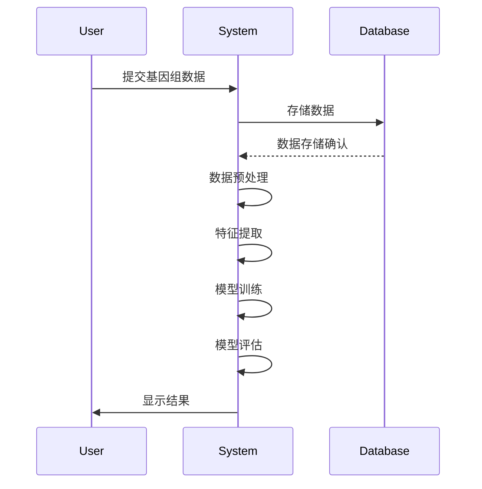
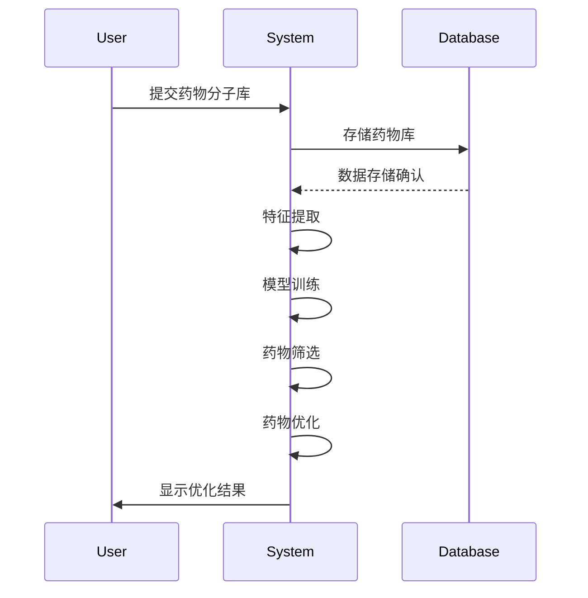

                 

### 引言

#### 生物信息学简介

生物信息学是一门交叉学科，它结合了生物学、计算机科学和信息学等多个领域的知识，旨在通过计算和数据分析手段来解决生物学问题。生物信息学的基本概念包括基因组学、转录组学、蛋白质组学等，这些概念都是对生物体内基因、转录和蛋白质活动的系统性研究。

基因组学主要研究基因的组成、结构、功能和变异。基因组的序列数据是生物信息学研究的核心，通过对基因组序列的分析，科学家可以揭示生物体的遗传信息。转录组学则关注基因在特定时间或特定环境下的表达情况，通过分析转录组数据，可以了解生物体的基因活动模式。蛋白质组学则研究生物体内所有蛋白质的组成和功能，蛋白质是生命活动的基本执行者，对蛋白质组的研究有助于揭示生物体的生理和病理状态。

生物信息学的发展历程可以追溯到20世纪70年代，随着DNA测序技术的进步，生物信息学逐渐成为一个独立的领域。1986年，人类基因组计划启动，标志着生物信息学进入了一个新的阶段。随着高通量测序技术的普及，大数据时代的到来，生物信息学迎来了快速发展。现代生物信息学不仅依赖于传统的计算机技术，还融合了机器学习、人工智能等先进技术，为生物学研究提供了强大的工具。

#### 机器学习在生物信息学中的重要性

机器学习与生物信息学交叉领域的兴起源于两者在数据分析和模式识别上的共同需求。机器学习作为一种强大的数据分析工具，能够从大量复杂数据中提取有用信息，这在生物信息学中尤为重要。机器学习算法可以自动识别数据中的规律和模式，从而帮助科学家从海量生物数据中提取有价值的信息。

机器学习在生物信息学中的应用前景非常广阔。首先，在基因组分析方面，机器学习可以用于基因识别、基因表达分析、突变检测等任务。通过机器学习算法，科学家可以从基因组序列中预测基因功能，识别潜在的疾病相关基因。其次，在药物设计方面，机器学习可以用于药物筛选、药物优化和药物分子活性预测。通过机器学习模型，科学家可以快速筛选出具有潜在治疗效果的药物分子，从而加速新药研发过程。

#### 基本概念与术语

基因组是生物体内所有基因的总称，它包含了生物体遗传信息的全部内容。基因是生物体遗传信息的基本单位，通过编码蛋白质来执行生物学功能。蛋白质是生物体的重要组成部分，它们构成了生物体的结构和功能基础。

机器学习是一种通过算法从数据中自动学习规律和模式，并对未知数据进行预测的技术。在机器学习中，算法根据训练数据自动调整参数，以优化模型性能。常见的机器学习算法包括监督学习、无监督学习和强化学习。

监督学习是一种有明确标签的数据训练方法，通过已知的输入和输出数据训练模型，从而预测未知数据的标签。无监督学习则是没有明确标签的数据训练方法，主要任务是从数据中自动发现规律和模式。强化学习是一种通过试错和奖励机制来学习最优策略的方法，它广泛应用于策略优化和决策问题。

### 第1章 引言

机器学习在生物信息学中的应用：基因组分析与药物设计

> 关键词：机器学习、生物信息学、基因组分析、药物设计

> 摘要：本文探讨了机器学习在生物信息学中的应用，重点关注基因组分析和药物设计领域。通过介绍生物信息学的基本概念、发展历程以及机器学习的基本原理和算法，本文详细分析了机器学习在基因组序列分析、功能预测以及药物设计中的应用案例。同时，本文也探讨了机器学习在生物信息学中的挑战和未来发展方向，为读者提供了全面的技术视角和深入的思考。

## 第1章 引言

### 1.1 生物信息学简介

生物信息学是21世纪最具前景的交叉学科之一，它结合了生物学、计算机科学、信息学等多个领域的知识，旨在通过计算和数据分析手段来解决生物学问题。生物信息学的概念最早可以追溯到20世纪70年代，随着DNA测序技术的进步，生物信息学逐渐成为一个独立的领域。

生物信息学的基本概念主要包括基因组学、转录组学、蛋白质组学等。基因组学主要研究基因的组成、结构、功能和变异，通过基因组序列的分析，科学家可以揭示生物体的遗传信息。转录组学则关注基因在特定时间或特定环境下的表达情况，通过分析转录组数据，可以了解生物体的基因活动模式。蛋白质组学则研究生物体内所有蛋白质的组成和功能，蛋白质是生命活动的基本执行者，对蛋白质组的研究有助于揭示生物体的生理和病理状态。

生物信息学的发展历程可以追溯到20世纪70年代，随着DNA测序技术的进步，生物信息学逐渐成为一个独立的领域。1986年，人类基因组计划启动，标志着生物信息学进入了一个新的阶段。随着高通量测序技术的普及，大数据时代的到来，生物信息学迎来了快速发展。现代生物信息学不仅依赖于传统的计算机技术，还融合了机器学习、人工智能等先进技术，为生物学研究提供了强大的工具。

### 1.2 机器学习在生物信息学中的重要性

机器学习是人工智能的一个重要分支，它通过算法从数据中自动学习规律和模式，并对未知数据进行预测。机器学习在生物信息学中的应用具有重要意义，因为它能够从大量复杂数据中提取有用信息，为生物学家提供强大的分析工具。

首先，在基因组分析方面，机器学习可以用于基因识别、基因表达分析、突变检测等任务。通过机器学习算法，科学家可以从基因组序列中预测基因功能，识别潜在的疾病相关基因。例如，使用支持向量机（SVM）和深度学习模型，可以准确预测基因的启动子区域和转录因子结合位点。

其次，在药物设计方面，机器学习可以用于药物筛选、药物优化和药物分子活性预测。通过机器学习模型，科学家可以快速筛选出具有潜在治疗效果的药物分子，从而加速新药研发过程。例如，使用基于图的卷积网络（GCN）和生成对抗网络（GAN），可以预测药物分子与生物大分子之间的相互作用。

此外，机器学习还在生物信息学中的其他领域发挥着重要作用，如蛋白质结构预测、代谢网络分析、系统生物学建模等。通过机器学习，科学家可以更加深入地理解生物体的复杂机制，为生物学研究提供新的视角和手段。

### 1.3 基本概念与术语

在探讨机器学习在生物信息学中的应用之前，我们需要了解一些基本概念和术语。

基因组是生物体内所有基因的总称，它包含了生物体遗传信息的全部内容。基因是生物体遗传信息的基本单位，通过编码蛋白质来执行生物学功能。蛋白质是生物体的重要组成部分，它们构成了生物体的结构和功能基础。

机器学习是一种通过算法从数据中自动学习规律和模式，并对未知数据进行预测的技术。在机器学习中，算法根据训练数据自动调整参数，以优化模型性能。常见的机器学习算法包括监督学习、无监督学习和强化学习。

监督学习是一种有明确标签的数据训练方法，通过已知的输入和输出数据训练模型，从而预测未知数据的标签。无监督学习则是没有明确标签的数据训练方法，主要任务是从数据中自动发现规律和模式。强化学习是一种通过试错和奖励机制来学习最优策略的方法，它广泛应用于策略优化和决策问题。

通过理解这些基本概念和术语，我们将更好地理解机器学习在生物信息学中的应用原理和实际案例。

### 1.1 生物信息学简介

#### 生物信息学的基本概念

生物信息学是一门交叉学科，它结合了生物学、计算机科学和信息学等多个领域的知识。其核心目标是利用计算机技术和算法来处理、分析和解释生物数据，以揭示生物体的遗传信息、生物学功能和疾病机制。

生物信息学的基本概念包括基因组学、转录组学、蛋白质组学等。这些概念都是对生物体内不同层次的信息的研究。

- **基因组学（Genomics）**：基因组学是研究基因组的科学，包括基因的组成、结构、功能和变异。基因组是指生物体内所有基因的总和，它包含了生物体的遗传信息。基因组学研究的主要任务是识别基因、分析基因序列、理解基因的功能和变异。

- **转录组学（Transcriptomics）**：转录组学是研究基因在特定时间或特定环境下的表达情况。转录组是指生物体内所有基因的转录产物，包括mRNA、lncRNA、tRNA等。通过转录组学，科学家可以了解基因在不同生理状态下的活性变化，从而揭示生物体的生物学功能和疾病状态。

- **蛋白质组学（Proteomics）**：蛋白质组学是研究生物体内所有蛋白质的组成和功能。蛋白质是生命活动的基本执行者，它们构成了生物体的结构和功能基础。蛋白质组学研究的主要任务是识别蛋白质、分析蛋白质的结构和功能，以及研究蛋白质之间的相互作用。

#### 生物信息学的发展历程

生物信息学作为一个独立的领域，其发展历程可以追溯到20世纪70年代。以下是一些关键事件和里程碑：

- **1970年代**：DNA测序技术的发明和改进，使得科学家能够获取基因组的序列信息。这一技术的发展为生物信息学的诞生奠定了基础。

- **1986年**：人类基因组计划启动，标志着生物信息学进入了一个新的阶段。人类基因组计划的目的是解读人类基因组的完整序列，这一计划推动了高通量测序技术的快速发展。

- **1990年代**：随着高通量测序技术的出现，生物信息学的研究对象从单个基因扩展到整个基因组。这一时期，大量基因组数据被生成，生物信息学工具和算法得到了广泛应用。

- **2000年代**：转录组学和蛋白质组学等新的生物信息学领域逐渐兴起。这些领域的研究不仅丰富了生物信息学的内涵，也为生物学的其他分支提供了新的研究工具。

- **2010年代**：随着大数据技术和云计算的发展，生物信息学迎来了大数据时代。大量生物数据被生成和存储，生物信息学工具和算法需要处理和分析这些海量数据。

- **2020年代**：人工智能和机器学习等先进技术开始广泛应用于生物信息学领域。这些技术不仅提高了数据分析的效率和精度，也为生物学研究提供了新的视角和方法。

#### 生物信息学在生物医学研究中的应用

生物信息学在生物医学研究中的应用非常广泛，以下是一些典型的应用领域：

- **疾病诊断**：通过分析基因组、转录组和蛋白质组数据，科学家可以识别疾病相关的基因和蛋白质。这些信息有助于早期诊断和个性化治疗。

- **药物研发**：生物信息学可以用于药物筛选和药物设计。通过机器学习算法，科学家可以预测药物分子的活性，从而快速筛选出潜在的治疗药物。

- **个性化医疗**：生物信息学技术可以用于分析患者的基因组数据，从而为个性化治疗提供依据。例如，通过对癌症患者的基因组进行分析，可以确定最适合其的靶向治疗药物。

- **系统生物学**：生物信息学提供了强大的工具来分析复杂的生物系统，包括代谢网络、信号传导通路等。这些分析有助于揭示生物系统的运作机制。

总之，生物信息学作为一门交叉学科，在生物医学研究中发挥着越来越重要的作用。随着技术的进步和数据积累，生物信息学将推动生物学研究进入一个新的时代。

### 1.2 机器学习在生物信息学中的重要性

#### 机器学习与生物信息学交叉领域的兴起

机器学习在生物信息学中的应用起源于对复杂数据的高效处理和分析需求。生物信息学领域生成的数据量庞大且种类繁多，传统的数据分析方法已无法满足其需求。机器学习作为一种自动从数据中学习规律和模式的技术，恰好填补了这一空白。

机器学习与生物信息学的交叉领域在近几年取得了显著进展，主要体现在以下几个方面：

- **基因组序列分析**：机器学习算法被广泛应用于基因识别、基因表达分析、突变检测等领域。例如，通过使用深度学习模型，科学家可以从基因组序列中预测基因的功能和潜在的疾病相关基因。

- **药物设计**：机器学习在药物筛选、药物优化和药物分子活性预测中发挥了关键作用。例如，通过使用基于图的卷积网络（GCN）和生成对抗网络（GAN），可以预测药物分子与生物大分子之间的相互作用，从而加速新药研发过程。

- **蛋白质结构预测**：蛋白质是生命活动的基本执行者，对蛋白质结构的准确预测对于理解其功能至关重要。机器学习算法，如AlphaFold，已经实现了对蛋白质结构的精确预测，这为生物医学研究提供了强大的工具。

#### 机器学习在生物信息学中的应用前景

机器学习在生物信息学中的应用前景非常广阔，以下是一些潜在的应用领域：

- **个性化医疗**：通过分析患者的基因组数据，机器学习可以预测疾病风险，制定个性化的治疗方案。例如，使用机器学习模型，可以根据患者的基因信息和病史，预测其对某种药物的反应。

- **疾病诊断**：机器学习可以用于开发疾病诊断模型，通过分析患者的生物标志物数据，如基因组、转录组和蛋白质组数据，可以实现对疾病的早期诊断和分类。

- **新药研发**：机器学习可以加速药物研发过程，通过预测药物分子与生物大分子之间的相互作用，可以快速筛选出具有潜在治疗效果的药物分子。

- **系统生物学**：机器学习可以用于分析复杂的生物系统，如代谢网络和信号传导通路，从而揭示生物系统的运作机制。

总之，机器学习在生物信息学中的应用正在不断拓展，它不仅为生物学家提供了强大的数据分析工具，也为生物医学研究带来了新的机遇和挑战。

### 1.3 基本概念与术语

#### 基因组

基因组是指生物体内所有基因的总和，它包含了生物体的遗传信息。基因是遗传信息的基本单位，它们编码蛋白质或RNA，从而决定生物体的性状。基因组的大小和复杂程度因生物种类而异，例如，人类基因组包含约30亿个核苷酸对。

#### 蛋白质

蛋白质是生物体的重要组成部分，它们是生命活动的基本执行者。蛋白质由氨基酸组成，具有复杂的结构，包括一级结构、二级结构、三级结构和四级结构。蛋白质的功能依赖于其特定的结构，例如，酶作为催化剂，抗体作为免疫系统的关键成分。

#### 机器学习算法

机器学习算法是一系列用于从数据中学习规律和模式的算法。根据学习方式的不同，机器学习算法可以分为以下几类：

- **监督学习（Supervised Learning）**：监督学习通过已知输入和输出数据训练模型，从而预测未知数据的标签。常见的监督学习算法包括线性回归、逻辑回归、支持向量机（SVM）和决策树。

- **无监督学习（Unsupervised Learning）**：无监督学习没有明确标签的数据训练方法，主要任务是从数据中自动发现规律和模式。常见的无监督学习算法包括聚类分析、主成分分析（PCA）和自编码器。

- **强化学习（Reinforcement Learning）**：强化学习通过试错和奖励机制来学习最优策略。强化学习广泛应用于策略优化和决策问题，如游戏、自动驾驶等。

在生物信息学中，常用的机器学习算法包括：

- **深度学习（Deep Learning）**：深度学习是一种基于多层神经网络的学习方法，它在图像识别、自然语言处理等领域取得了显著成果。在生物信息学中，深度学习被广泛应用于基因组分析、蛋白质结构预测等任务。

- **集成学习（Ensemble Learning）**：集成学习通过组合多个模型的预测结果来提高模型的性能。常见的集成学习方法包括随机森林、梯度提升树（Gradient Boosting Tree）和堆叠泛化（Stacking）。

通过了解这些基本概念和术语，读者可以更好地理解机器学习在生物信息学中的应用原理和实践。

## 第2章 机器学习基础

### 2.1 数据预处理

数据预处理是机器学习过程中至关重要的一步，它旨在提高数据质量，减少噪声，并提取关键信息。通过适当的数据预处理，可以显著提高模型性能和可解释性。

#### 数据清洗

数据清洗是数据预处理的第一步，其主要目标是识别和纠正数据中的错误、异常值和不一致之处。以下是一些常见的数据清洗方法：

- **缺失值填充**：缺失值可以通过多种方式填充，如平均值填充、中值填充、最大值填充或使用统计模型进行预测填充。

- **异常值检测**：异常值可能是由于数据收集过程中的错误或真实存在的异常情况。常用的异常值检测方法包括基于统计学的方法（如三倍标准差法）和基于机器学习的方法（如孤立森林算法）。

- **重复值检测与去除**：重复值可能会导致数据冗余，影响模型的训练效果。通过比较数据项的唯一性，可以检测和去除重复值。

- **数据格式规范化**：不同数据源的数据格式可能不一致，如日期格式、字符串编码等。通过数据格式规范化，可以统一不同数据源的格式，便于后续处理。

#### 数据集成

数据集成是将来自多个来源的数据整合到一个统一的数据集中。以下是一些常见的数据集成方法：

- **数据合并（Join）**：通过将具有相同属性的数据项合并在一起，可以实现数据集成。例如，将患者信息表和基因表达数据表合并，以获得更全面的分析数据。

- **数据汇总（Aggregation）**：通过对数据集进行分组和汇总操作，可以生成更高层次的数据。例如，将基因表达数据按样本类型进行汇总，以便于比较不同类型样本的基因表达差异。

- **数据转换（Transformation）**：数据转换包括将数据从一种格式转换为另一种格式，或对数据进行数学变换，如对数值数据应用对数变换以减少数据范围。

#### 特征选择与降维

特征选择和降维是数据预处理的重要步骤，旨在减少数据的维度，提高模型的可解释性和计算效率。

- **特征选择（Feature Selection）**：特征选择是指从原始特征集合中选择出对模型性能有显著影响的特征。常用的特征选择方法包括过滤式方法（如信息增益、卡方检验）、包装式方法（如递归特征消除RFE）和嵌入式方法（如LASSO、岭回归）。

- **特征降维（Dimensionality Reduction）**：特征降维是指通过降低数据维度来减少计算复杂度和存储需求。常用的特征降维方法包括主成分分析（PCA）、线性判别分析（LDA）、自编码器（Autoencoder）和非线性降维方法（如t-SNE、UMAP）。

### 2.2 机器学习算法概述

机器学习算法可以分为三大类：监督学习、无监督学习和强化学习。每种算法都有其特定的应用场景和特点。

#### 监督学习

监督学习是一种通过已知输入和输出数据训练模型的方法，从而预测未知数据的标签。其基本流程包括数据收集、数据预处理、模型训练和模型评估。

- **线性回归（Linear Regression）**：线性回归是一种最简单的监督学习算法，用于预测连续值输出。其模型公式为：
  $$ y = \beta_0 + \beta_1x_1 + \beta_2x_2 + ... + \beta_nx_n $$
  其中，$x$ 是输入特征，$y$ 是输出标签，$\beta$ 是模型的参数。

- **逻辑回归（Logistic Regression）**：逻辑回归是一种用于预测分类结果的监督学习算法，其输出为概率值。其模型公式为：
  $$ P(y=1) = \frac{1}{1 + e^{-(\beta_0 + \beta_1x_1 + \beta_2x_2 + ... + \beta_nx_n)}} $$
  其中，$P(y=1)$ 是输出为1的概率。

- **支持向量机（Support Vector Machine, SVM）**：SVM是一种强大的分类算法，其基本思想是找到一个最佳的超平面，将不同类别的数据点分开。其模型公式为：
  $$ w \cdot x - b = 0 $$
  其中，$w$ 是超平面的法向量，$x$ 是输入特征，$b$ 是偏置。

- **决策树（Decision Tree）**：决策树是一种树形结构的分类算法，通过一系列条件判断来划分数据集。其基本结构包括根节点、内部节点和叶子节点。决策树通过递归划分数据，直到满足停止条件。

#### 无监督学习

无监督学习是一种没有明确标签的数据训练方法，其主要任务是自动发现数据中的结构和模式。

- **聚类分析（Cluster Analysis）**：聚类分析是一种将数据分为多个类别的无监督学习方法。常见的聚类算法包括K-means、层次聚类和DBSCAN。K-means算法通过迭代优化聚类中心，将数据点分配到不同的聚类中。

- **主成分分析（Principal Component Analysis, PCA）**：PCA是一种降维技术，通过将数据转换到新的坐标系中，保留主要数据变异，从而减少数据维度。PCA的核心思想是找到数据的主要成分，这些成分是数据变化方向上的最大方差方向。

- **自编码器（Autoencoder）**：自编码器是一种无监督学习的神经网络结构，用于学习数据的高效表示。自编码器由编码器和解码器组成，编码器将输入数据压缩为低维表示，解码器尝试重构原始数据。

#### 强化学习

强化学习是一种通过试错和奖励机制来学习最优策略的方法，其主要应用领域包括游戏、自动驾驶和机器人控制。

- **Q-学习（Q-Learning）**：Q-学习是一种基于值函数的强化学习算法，通过更新Q值来学习最优策略。Q值表示在当前状态下采取特定动作的预期奖励。

- **深度Q网络（Deep Q-Network, DQN）**：DQN是一种基于神经网络的强化学习算法，它使用深度神经网络来近似Q值函数。DQN通过经验回放和目标网络更新策略，以提高学习效率和稳定性。

- **策略梯度（Policy Gradient）**：策略梯度算法通过直接优化策略函数来学习最优策略。策略梯度算法的核心思想是最大化策略的期望回报。

### 2.3 算法评估与选择

评估和选择合适的机器学习算法是确保模型性能的关键步骤。以下是一些常见的评估指标和选择策略：

- **评估指标**：

  - **准确率（Accuracy）**：准确率是评估分类模型性能的常用指标，表示正确分类的样本数占总样本数的比例。

  - **精确率（Precision）**：精确率是评估分类模型在正类样本中的预测准确度，表示真正类样本数与预测为正类样本数的比例。

  - **召回率（Recall）**：召回率是评估分类模型在正类样本中的遗漏情况，表示真正类样本数与实际为正类样本数的比例。

  - **F1分数（F1 Score）**：F1分数是精确率和召回率的加权平均，用于综合评估分类模型的性能。

  - **ROC曲线和AUC值（ROC Curve and AUC）**：ROC曲线是评估二分类模型性能的重要工具，通过绘制真阳性率（True Positive Rate, TPR）与假阳性率（False Positive Rate, FPR）之间的关系。AUC值是ROC曲线下面积，用于评估模型的区分能力。

- **算法选择策略**：

  - **交叉验证（Cross Validation）**：交叉验证是一种常用的模型评估方法，通过将数据集划分为多个子集，交叉训练和测试模型，以评估模型在不同数据集上的性能。

  - **网格搜索（Grid Search）**：网格搜索是一种参数优化方法，通过遍历预设的参数组合，找到最优参数设置。

  - **贝叶斯优化（Bayesian Optimization）**：贝叶斯优化是一种基于概率模型的参数优化方法，通过构建概率模型来优化目标函数，具有较高的搜索效率和收敛速度。

通过理解数据预处理、机器学习算法的基本原理和评估选择策略，读者可以更好地应用机器学习技术解决实际问题。

### 2.1 数据预处理

数据预处理是机器学习项目的关键步骤，它直接影响模型的效果和训练时间。有效的数据预处理可以减少噪声、提高数据质量，并提取对模型训练有用的信息。

#### 数据清洗

数据清洗是数据预处理的第一步，其目标是识别和修正数据中的错误、异常值和不一致之处。以下是几种常见的数据清洗方法：

- **缺失值填充**：缺失值可能是由于数据收集过程中的错误或数据本身的特性。常见的方法有：

  - **平均值填充**：用该特征的平均值来替换缺失值。适用于特征值分布近似正态的情况。
  - **中值填充**：用该特征的中值来替换缺失值。适用于特征值分布偏小的情境。
  - **最大值填充**：用该特征的最大值来替换缺失值。适用于某些情况下缺失值可能代表极端值。
  - **最小值填充**：用该特征的最小值来替换缺失值。适用于某些情况下缺失值可能代表极端值。
  - **预测填充**：使用统计模型或机器学习模型预测缺失值。适用于数据量较大且缺失值较少的情况。

- **异常值检测**：异常值可能是由于数据采集错误或真实存在的异常数据。以下是一些检测方法：

  - **三倍标准差法**：如果某个值与平均值的距离超过三倍标准差，则认为该值为异常值。
  - **箱线图法**：通过绘制箱线图，识别数据中的异常值。异常值通常位于箱线图之外。
  - **基于机器学习的方法**：如孤立森林（Isolation Forest）和局部异常因子（Local Outlier Factor, LOF）。这些方法通过构建模型来识别异常值。

- **重复值检测与去除**：重复值会导致数据冗余，影响模型的训练效果。可以通过以下方法检测和去除重复值：

  - **基于哈希的方法**：计算每个数据项的哈希值，并将相同哈希值的数据项视为重复值。
  - **基于比较的方法**：通过逐项比较数据项，识别和去除重复值。

- **数据格式规范化**：不同数据源的数据格式可能不一致，如日期格式、字符串编码等。数据格式规范化可以统一不同数据源的格式，便于后续处理：

  - **日期格式转换**：将不同格式的日期转换为统一格式，如YYYY-MM-DD。
  - **字符串编码**：统一不同编码格式的字符串，如将ASCII编码转换为UTF-8编码。

#### 数据集成

数据集成是将来自多个来源的数据整合到一个统一的数据集中。以下是几种常见的数据集成方法：

- **数据合并**：通过将具有相同属性的数据项合并在一起，可以实现数据集成。例如，将患者信息表和基因表达数据表合并，以获得更全面的分析数据。

  - **内连接（Inner Join）**：合并具有相同属性的数据项，只返回匹配的记录。
  - **外连接（Outer Join）**：合并具有相同属性的数据项，并包括未匹配的记录。
  - **左连接（Left Join）**：保留左表中的所有记录，并合并右表中的匹配记录。
  - **右连接（Right Join）**：保留右表中的所有记录，并合并左表中的匹配记录。

- **数据汇总**：通过对数据集进行分组和汇总操作，可以生成更高层次的数据。例如，将基因表达数据按样本类型进行汇总，以便于比较不同类型样本的基因表达差异。

  - **平均值**：计算每组数据的平均值。
  - **最大值/最小值**：计算每组数据的最大值或最小值。
  - **总和/计数**：计算每组数据的总和或计数。

- **数据转换**：数据转换包括将数据从一种格式转换为另一种格式，或对数据进行数学变换，如对数值数据应用对数变换以减少数据范围。

  - **数值变换**：如对数变换、开方变换等，用于缩小数据范围，提高模型的稳定性。
  - **类别编码**：将类别数据转换为数值数据，如使用独热编码（One-Hot Encoding）或标签编码（Label Encoding）。

#### 特征选择与降维

特征选择和降维是数据预处理的重要步骤，旨在减少数据的维度，提高模型的可解释性和计算效率。

- **特征选择**：特征选择是指从原始特征集合中选择出对模型性能有显著影响的特征。以下是一些常见的特征选择方法：

  - **过滤式方法**：基于统计显著性或相关性来选择特征。例如，使用信息增益、卡方检验等。
  - **包装式方法**：结合特征选择和模型训练，逐步筛选特征。例如，使用递归特征消除（RFE）、遗传算法（GA）等。
  - **嵌入式方法**：在模型训练过程中同时进行特征选择。例如，使用LASSO、岭回归（Ridge Regression）等。

- **特征降维**：特征降维是指通过降低数据维度来减少计算复杂度和存储需求。以下是一些常见的特征降维方法：

  - **主成分分析（PCA）**：通过线性变换将数据投影到新的坐标系中，保留主要数据变异。
  - **线性判别分析（LDA）**：通过最大化类间方差和最小化类内方差来选择新的特征。
  - **自编码器（Autoencoder）**：通过训练一个编码器和解码器网络来实现特征降维。
  - **t-SNE、UMAP**：用于非线性降维，可以很好地保留数据的局部结构。

通过数据清洗、数据集成、特征选择和降维，可以显著提高机器学习模型的训练效果和预测性能。有效的数据预处理是确保模型成功的关键步骤之一。

### 2.2 机器学习算法概述

机器学习算法是构建和训练模型的核心工具，它们根据不同的任务和数据类型，提供了多样的解决方案。在生物信息学中，常用的机器学习算法可以分为监督学习、无监督学习和强化学习三大类。

#### 监督学习

监督学习是一种通过已知输入和输出数据训练模型的方法，从而预测未知数据的标签。其核心在于从已有数据中学习规律，并将其应用到新的数据上。

- **线性回归（Linear Regression）**：线性回归是最简单的监督学习算法，用于预测连续值输出。其模型公式为：
  $$ y = \beta_0 + \beta_1x_1 + \beta_2x_2 + ... + \beta_nx_n $$
  其中，$x$ 是输入特征，$y$ 是输出标签，$\beta$ 是模型的参数。线性回归通过最小化误差平方和来优化参数。

- **逻辑回归（Logistic Regression）**：逻辑回归是一种用于预测分类结果的算法，其输出为概率值。其模型公式为：
  $$ P(y=1) = \frac{1}{1 + e^{-(\beta_0 + \beta_1x_1 + \beta_2x_2 + ... + \beta_nx_n)}} $$
  其中，$P(y=1)$ 是输出为1的概率。逻辑回归通过最大化似然函数来优化参数。

- **支持向量机（Support Vector Machine, SVM）**：SVM是一种强大的分类算法，其基本思想是找到一个最佳的超平面，将不同类别的数据点分开。其模型公式为：
  $$ w \cdot x - b = 0 $$
  其中，$w$ 是超平面的法向量，$x$ 是输入特征，$b$ 是偏置。SVM通过最大化分类间隔来优化参数。

- **决策树（Decision Tree）**：决策树是一种树形结构的分类算法，通过一系列条件判断来划分数据集。其基本结构包括根节点、内部节点和叶子节点。决策树通过递归划分数据，直到满足停止条件。

- **随机森林（Random Forest）**：随机森林是一种集成学习方法，通过构建多棵决策树，并取它们的平均值来提高模型的稳定性和预测性能。随机森林通过随机选择特征和样本子集来构建每棵树。

- **梯度提升树（Gradient Boosting Tree）**：梯度提升树是一种集成学习方法，通过迭代地添加决策树来提高模型性能。每棵树都针对前一棵树的错误进行优化，从而逐渐提高模型的精度。

#### 无监督学习

无监督学习是一种没有明确标签的数据训练方法，其主要任务是从数据中自动发现规律和模式。

- **聚类分析（Cluster Analysis）**：聚类分析是一种将数据分为多个类别的无监督学习方法。常见的聚类算法包括K-means、层次聚类和DBSCAN。K-means算法通过迭代优化聚类中心，将数据点分配到不同的聚类中。

- **主成分分析（Principal Component Analysis, PCA）**：PCA是一种降维技术，通过将数据转换到新的坐标系中，保留主要数据变异，从而减少数据维度。PCA的核心思想是找到数据的主要成分，这些成分是数据变化方向上的最大方差方向。

- **自编码器（Autoencoder）**：自编码器是一种无监督学习的神经网络结构，用于学习数据的高效表示。自编码器由编码器和解码器组成，编码器将输入数据压缩为低维表示，解码器尝试重构原始数据。

- **非负矩阵分解（Non-negative Matrix Factorization, NMF）**：NMF是一种基于线性模型的降维技术，通过将数据分解为两个非负矩阵的乘积，从而提取数据的潜在特征。

#### 强化学习

强化学习是一种通过试错和奖励机制来学习最优策略的方法，其主要应用领域包括游戏、自动驾驶和机器人控制。

- **Q-学习（Q-Learning）**：Q-学习是一种基于值函数的强化学习算法，通过更新Q值来学习最优策略。Q值表示在当前状态下采取特定动作的预期奖励。

- **深度Q网络（Deep Q-Network, DQN）**：DQN是一种基于神经网络的强化学习算法，它使用深度神经网络来近似Q值函数。DQN通过经验回放和目标网络更新策略，以提高学习效率和稳定性。

- **策略梯度（Policy Gradient）**：策略梯度算法通过直接优化策略函数来学习最优策略。策略梯度算法的核心思想是最大化策略的期望回报。

- **深度确定性策略梯度（Deep Deterministic Policy Gradient, DDPG）**：DDPG是一种基于深度学习的强化学习算法，通过同时优化策略和价值网络来学习最优策略。DDPG通过经验回放和目标网络更新策略，提高了学习效率和稳定性。

机器学习算法为生物信息学提供了强大的工具，通过合理选择和调整算法，可以有效地处理和解释复杂数据，从而推动生物学研究和应用的发展。

### 2.3 算法评估与选择

评估和选择合适的机器学习算法是确保模型性能的关键步骤。以下是一些常见的评估指标和选择策略：

#### 评估指标

- **准确率（Accuracy）**：准确率是评估分类模型性能的常用指标，表示正确分类的样本数占总样本数的比例。准确率简单直观，但在类别不平衡的数据集中可能不能很好地反映模型性能。

- **精确率（Precision）**：精确率是评估分类模型在正类样本中的预测准确度，表示真正类样本数与预测为正类样本数的比例。精确率关注模型的正确预测，但在实际应用中，假正类错误可能会带来较大风险。

- **召回率（Recall）**：召回率是评估分类模型在正类样本中的遗漏情况，表示真正类样本数与实际为正类样本数的比例。召回率关注模型的全面性，但在假负类错误较多的情况下，模型可能过于保守。

- **F1分数（F1 Score）**：F1分数是精确率和召回率的加权平均，用于综合评估分类模型的性能。F1分数在类别不平衡的数据集中更能反映模型性能。

- **ROC曲线和AUC值（ROC Curve and AUC）**：ROC曲线是评估二分类模型性能的重要工具，通过绘制真阳性率（True Positive Rate, TPR）与假阳性率（False Positive Rate, FPR）之间的关系。AUC值是ROC曲线下面积，用于评估模型的区分能力。AUC值越高，模型的性能越好。

- **均方误差（Mean Squared Error, MSE）**：均方误差是评估回归模型性能的常用指标，表示预测值与真实值之间的平均平方误差。MSE越小，模型性能越好。

- **均方根误差（Root Mean Squared Error, RMSE）**：均方根误差是均方误差的平方根，用于更直观地评估回归模型的性能。RMSE越小，模型性能越好。

#### 算法选择策略

- **交叉验证（Cross Validation）**：交叉验证是一种常用的模型评估方法，通过将数据集划分为多个子集，交叉训练和测试模型，以评估模型在不同数据集上的性能。常用的交叉验证方法有K折交叉验证和留一法交叉验证。

- **网格搜索（Grid Search）**：网格搜索是一种参数优化方法，通过遍历预设的参数组合，找到最优参数设置。网格搜索可以全面评估不同参数组合对模型性能的影响。

- **贝叶斯优化（Bayesian Optimization）**：贝叶斯优化是一种基于概率模型的参数优化方法，通过构建概率模型来优化目标函数。贝叶斯优化具有较高的搜索效率和收敛速度。

- **基于模型的评估方法**：某些模型具有内在的评估指标，如逻辑回归的似然函数、决策树的分类误差等。这些评估指标可以直接用于模型性能的评估。

通过综合运用以上评估指标和选择策略，可以有效地评估和选择合适的机器学习算法，从而提高模型性能和应用效果。

## 第3章 基因组分析

### 3.1 基因组序列分析

基因组序列分析是生物信息学中的一个核心任务，它旨在通过分析基因组序列来揭示生物体的遗传信息。基因组序列分析的方法主要包括基因组序列比对和基因识别。

#### 基因组序列比对

基因组序列比对是将一个基因组序列与另一个基因组序列进行比对，以识别它们之间的相似性和差异性。基因组序列比对是基因组分析的基础，它为后续的基因识别和功能预测提供了重要的信息。

- **局部比对**：局部比对关注基因组序列中短序列的相似性，常用于识别基因家族、基因复制和基因突变等。局部比对方法包括BLAST（Basic Local Alignment Search Tool）和Smith-Waterman算法。

  - **BLAST**：BLAST是一种基于词频统计的方法，通过比较短词（词长通常为3-6个核苷酸）的频率来识别序列相似性。BLAST广泛应用于基因组序列比对、蛋白质序列比对和RNA序列比对。

  - **Smith-Waterman算法**：Smith-Waterman算法是一种动态规划方法，用于计算两个序列之间的最大相似子序列。它通过比较序列中的每一个位置，计算匹配、插入和删除的得分，从而找到最优的比对路径。

- **全局比对**：全局比对关注基因组序列的整体相似性，常用于识别基因和基因组结构。全局比对方法包括N-倍覆盖和全局序列比对算法。

  - **N-倍覆盖**：N-倍覆盖是一种基于频率的基因组序列比对方法，它通过识别基因组序列中N倍覆盖的区域来确定基因边界。N-倍覆盖方法简单高效，但可能无法识别复杂的基因组结构。

  - **全局序列比对算法**：全局序列比对算法包括序列比对工具（如BLASTN）、最小编辑距离算法（如Needleman-Wunsch算法）和全局序列比对算法（如FASTA）。这些算法通过计算两个序列之间的编辑距离来识别相似性。

#### 基因识别

基因识别是基因组序列分析的重要任务，它旨在从基因组序列中识别出基因。基因识别方法主要包括基于特征的方法和基于机器学习的方法。

- **基于特征的方法**：基于特征的方法通过分析基因组序列的特征来识别基因。常用的特征包括启动子、终止子、编码区、非编码RNA等。

  - **启动子识别**：启动子是基因转录的调控区域，常用于识别基因的起始点。启动子识别方法包括基于规则的方法（如SP这人分类器）和基于机器学习的方法（如支持向量机SVM）。

  - **编码区识别**：编码区是基因编码蛋白质的区域，通过识别编码区可以预测基因的功能。编码区识别方法包括隐马尔可夫模型HMM、动态规划算法等。

- **基于机器学习的方法**：基于机器学习的方法通过训练模型来识别基因。常用的机器学习算法包括支持向量机SVM、随机森林、决策树等。

  - **支持向量机（SVM）**：支持向量机是一种强大的分类算法，可以用于基因识别。SVM通过找到一个最佳的超平面来将不同类别的基因分开。

  - **随机森林（Random Forest）**：随机森林是一种基于决策树的集成学习方法，通过构建多棵决策树来提高模型的稳定性和预测性能。

  - **决策树（Decision Tree）**：决策树是一种树形结构的分类算法，通过一系列条件判断来划分数据集。决策树简单直观，易于解释。

通过基因组序列比对和基因识别，科学家可以揭示生物体的遗传信息，从而为生物学研究提供重要的数据支持。基因组序列分析和基因识别方法的不断发展和改进，为基因组学研究提供了强大的工具。

### 3.2 功能预测

在基因组序列分析的基础上，功能预测是生物信息学中的一个重要任务，旨在识别基因和蛋白质的功能。功能预测不仅有助于理解生物体的生物学机制，还可以为疾病研究和药物设计提供关键信息。以下是几种常用的功能预测方法：

#### 基因功能预测

基因功能预测主要关注基因编码的蛋白质的功能。以下是一些常用的方法：

- **基于序列相似性的方法**：这种方法利用蛋白质序列与已知功能蛋白质的相似性来进行预测。例如，使用BLAST或FASTA进行序列比对，识别与已知功能蛋白质相似的未知蛋白质，从而推断其功能。

  - **BLAST**：BLAST是一种基于词频统计的方法，通过比较短词的频率来识别序列相似性。它广泛应用于基因组序列比对、蛋白质序列比对和RNA序列比对。
  
  - **FASTA**：FASTA是一种全局序列比对算法，通过计算两个序列之间的编辑距离来识别相似性。它常用于识别基因和蛋白质之间的相似性。

- **基于结构的预测**：这种方法利用蛋白质的三维结构信息进行功能预测。通过同源建模或蛋白质折叠识别，科学家可以推断未知蛋白质的结构，从而预测其功能。

  - **同源建模**：同源建模是一种基于已知蛋白质结构预测未知蛋白质结构的方法。它通过比较未知蛋白质与已知蛋白质的结构相似性，构建三维模型。

  - **蛋白质折叠识别**：蛋白质折叠识别是一种无监督学习方法，通过分析蛋白质序列的属性来预测其折叠类型。常用的算法包括支持向量机SVM、深度学习等。

- **基于功能的预测**：这种方法通过分析基因的表达模式和生物信息学数据来预测其功能。例如，使用基因共表达网络分析、基因注释数据库等工具来推断基因的功能。

#### 蛋白质功能预测

蛋白质功能预测旨在识别蛋白质的生物功能。以下是一些常用的方法：

- **基于序列的方法**：这种方法通过分析蛋白质序列的属性来进行功能预测。常用的方法包括序列模式识别、序列分类和序列相似性分析。

  - **序列模式识别**：序列模式识别利用特定的序列模式来预测蛋白质的功能。例如，使用Profile HMM来识别蛋白质家族和功能域。

  - **序列分类**：序列分类是一种基于机器学习的方法，通过训练分类器来将蛋白质序列划分为不同的功能类别。常用的算法包括支持向量机SVM、随机森林、决策树等。

  - **序列相似性分析**：序列相似性分析通过比较蛋白质序列与已知功能蛋白质的相似性来预测其功能。常用的工具包括BLAST、FASTA等。

- **基于结构的方法**：这种方法利用蛋白质的三维结构信息进行功能预测。通过同源建模、蛋白质折叠识别等方法，可以预测未知蛋白质的结构和功能。

  - **同源建模**：同源建模通过比较未知蛋白质与已知蛋白质的结构相似性来构建三维模型，从而预测其功能。

  - **蛋白质折叠识别**：蛋白质折叠识别是一种无监督学习方法，通过分析蛋白质序列的属性来预测其折叠类型。常用的算法包括支持向量机SVM、深度学习等。

- **基于功能的预测**：这种方法通过分析蛋白质的表达模式、蛋白质-蛋白质相互作用网络等生物信息学数据来预测其功能。例如，使用基因共表达网络分析、蛋白质互作网络等工具来推断蛋白质的功能。

通过结合多种预测方法，科学家可以更准确地识别基因和蛋白质的功能，为生物学研究提供重要支持。

### 3.3 机器学习在基因组分析中的应用案例

机器学习在基因组分析中的应用案例丰富多样，以下列举了几个具有代表性的应用场景，并简要介绍相关研究方法和实现技术。

#### 基因表达分析

基因表达分析是研究基因在特定时间或空间条件下活性变化的重要手段。机器学习技术可以用于从大规模基因表达数据中提取有用信息，帮助科学家理解基因功能及其在生物体中的调控网络。

- **研究方法**：常用的机器学习算法包括主成分分析（PCA）、聚类分析（如K-means聚类）、随机森林（Random Forest）和深度学习（如卷积神经网络CNN）等。

- **实现技术**：通过构建基因表达数据集，使用PCA进行数据降维和可视化，识别基因表达模式。K-means聚类用于将基因表达数据分为不同的群组，分析每个群组的基因功能。随机森林和深度学习模型可以用于预测基因表达与外部因素（如药物处理、环境变化）之间的关系。

#### 变异检测

基因变异检测是识别疾病相关基因的重要步骤。机器学习算法可以用于从大规模基因组数据中识别突变和变异，帮助科学家揭示疾病的发生机制。

- **研究方法**：常用的机器学习算法包括支持向量机（SVM）、深度学习（如卷积神经网络CNN）和图神经网络（Graph Neural Networks, GNN）等。

- **实现技术**：使用SVM和深度学习模型对基因组序列进行变异检测，可以通过训练模型来识别突变和变异类型。图神经网络可以用于分析基因变异在网络中的传播路径，帮助揭示基因变异对生物体功能的影响。

#### 基因组序列比对

基因组序列比对是基因组分析的基础，机器学习算法可以用于优化比对算法，提高序列比对的速度和准确性。

- **研究方法**：深度学习算法（如序列到序列模型Seq2Seq）和图神经网络（GNN）可以用于基因组序列比对。

- **实现技术**：使用Seq2Seq模型进行序列比对，通过训练模型来预测序列之间的匹配关系。GNN可以用于建模基因组序列的结构，提高比对算法的准确性。

#### 疾病预测

机器学习技术可以用于基于基因组数据的疾病预测，帮助医生进行早期诊断和个性化治疗。

- **研究方法**：监督学习和集成学习算法（如随机森林、梯度提升树）可以用于疾病预测。

- **实现技术**：通过构建包含基因组数据和疾病标签的训练数据集，使用随机森林和梯度提升树等算法进行模型训练，并评估模型的预测性能。这些模型可以用于预测新病例的疾病风险，为医生提供诊断依据。

通过上述应用案例可以看出，机器学习在基因组分析中发挥着越来越重要的作用，它不仅提高了数据分析的效率和精度，也为生物学研究提供了新的视角和方法。

### 4.1 药物设计简介

药物设计是一门结合生物学、化学和计算机科学技术的跨学科领域，旨在通过合理的设计和筛选过程，开发新的药物分子。药物设计的基本原理包括以下几个关键方面：

#### 药物设计的基本原理

1. **靶点识别**：药物设计的第一步是识别潜在的药物靶点。这些靶点可以是蛋白质、核酸或其他生物分子，它们在疾病的发生和发展中起着关键作用。通过研究疾病的分子基础，科学家可以确定最有可能成为药物靶点的分子。

2. **分子对接**：分子对接是一种基于计算机模拟的方法，用于预测药物分子与靶点之间的相互作用。通过分子对接，科学家可以筛选出具有潜在药物活性的分子，并为后续的实验验证提供依据。

3. **虚拟筛选**：虚拟筛选是一种高通量的筛选方法，通过计算机模拟从大量分子库中筛选出可能与靶点结合的药物分子。虚拟筛选不仅提高了药物筛选的效率，还减少了实验成本。

4. **药物优化**：在确定了潜在药物分子后，通过药物优化，可以改进其结构和活性。药物优化包括分子改造、结构修饰和化学合成等步骤，旨在提高药物分子的稳定性和药效。

5. **药效评估**：药效评估是药物设计过程中的重要环节，通过实验和临床测试，评估药物分子的安全性和疗效。药效评估可以帮助科学家确定最佳药物剂量和治疗方案。

#### 药物设计的方法分类

药物设计的方法可以大致分为以下几类：

1. **基于靶点的药物设计**：这种方法以特定靶点为设计目标，通过分子对接、虚拟筛选和药物优化等步骤，开发针对特定靶点的药物分子。基于靶点的药物设计具有较高的针对性，但需要准确的靶点识别和高效的分子对接算法。

2. **先导化合物优化**：这种方法从已经发现的先导化合物出发，通过结构改造和优化，提高其药效和稳定性。先导化合物优化是药物设计过程中的关键步骤，它决定了药物分子的最终性能。

3. **组合化学**：组合化学通过合成大量的化合物组合，筛选出具有潜在药物活性的分子。这种方法具有高通量的特点，但需要大量的人力和时间资源。

4. **计算化学**：计算化学利用计算机模拟和计算方法，研究药物分子与靶点之间的相互作用和动态变化。计算化学方法包括分子动力学模拟、量子化学计算等，为药物设计提供了重要的理论支持。

通过理解药物设计的基本原理和方法分类，科学家可以更有效地开展药物研发工作，为人类健康事业做出贡献。

### 4.2 药物筛选与优化

药物筛选和优化是药物设计过程中至关重要的一步，它决定了药物分子的可行性和有效性。以下是药物筛选和优化的主要方法：

#### 药物筛选

药物筛选的目的是从大量化合物中筛选出具有潜在药物活性的分子。以下是一些常见的药物筛选方法：

1. **虚拟筛选**：虚拟筛选是利用计算机模拟和计算方法，从庞大的化合物库中筛选出可能与靶点结合的化合物。常见的虚拟筛选方法包括基于结构的对接、基于性质的筛选和基于机器学习的筛选。通过虚拟筛选，科学家可以在短时间内筛选出大量具有潜在药物活性的分子。

   - **基于结构的对接**：这种方法通过模拟药物分子与靶点之间的相互作用，评估它们之间的结合能和结合模式。常用的软件有AutoDock、GLIDE和Dock6等。

   - **基于性质的筛选**：这种方法利用化合物分子的物理化学性质（如溶解度、水溶性、亲脂性等）进行筛选。常用的软件有COSMO、OPLS和MMF等。

   - **基于机器学习的筛选**：这种方法利用机器学习算法，从已知药物分子的结构和活性数据中学习规律，预测未知化合物的活性。常用的算法有支持向量机（SVM）、随机森林（Random Forest）和深度学习（如卷积神经网络CNN）等。

2. **高通量筛选**：高通量筛选（HTS）是一种自动化、高通量的筛选方法，通过在微板或芯片上同时测试成千上万的化合物。HTS通常结合生物检测方法（如细胞成像、荧光测定、酶活性测定等），快速筛选出具有潜在药物活性的分子。

3. **定向合成**：定向合成是一种基于已知先导化合物的结构，设计并合成新的类似物，以提高其活性、稳定性和药代动力学性质。这种方法通常结合计算机辅助药物设计（CADD）和有机合成技术，快速迭代优化药物分子。

#### 药物优化

药物优化是在筛选出具有潜在药物活性的分子后，通过结构改造和性质优化，提高药物分子的性能。以下是一些常见的药物优化方法：

1. **分子改造**：分子改造是通过改变药物分子的结构片段，以提高其活性、稳定性和药代动力学性质。常见的改造方法包括引入新的官能团、改变分子骨架、增加脂溶性和溶解度等。

2. **结构优化**：结构优化是通过计算机模拟和实验方法，优化药物分子的三维结构，提高其与靶点的结合能力。常用的方法包括分子动力学模拟、量子化学计算和分子对接等。

3. **计算化学**：计算化学利用计算机模拟和计算方法，研究药物分子与靶点之间的相互作用和动态变化。通过计算化学方法，可以预测药物分子的活性、稳定性和药代动力学性质，为药物优化提供理论支持。

4. **高通量测试**：高通量测试是一种自动化、高通量的测试方法，用于评估药物分子的活性、毒性和药代动力学性质。通过高通量测试，可以快速评估药物分子的性能，优化药物分子的设计。

5. **组合优化**：组合优化是通过结合多种方法和技术，快速优化药物分子的性能。例如，结合虚拟筛选、高通量筛选、分子改造和结构优化等方法，可以提高药物筛选和优化的效率。

通过药物筛选和优化，科学家可以识别和开发出具有潜在治疗效果的药物分子，为疾病治疗提供新的解决方案。

### 4.3 机器学习在药物设计中的应用案例

机器学习在药物设计中的应用案例丰富多样，通过以下具体实例，我们可以更好地理解其应用方法和效果。

#### 药物分子活性预测

药物分子活性预测是药物设计过程中的一个关键环节，旨在从大量化合物中快速筛选出具有潜在治疗作用的分子。以下是一个使用机器学习进行药物分子活性预测的实例：

**实例**：使用深度学习模型预测抗肿瘤药物分子的活性

**方法**：研究人员收集了一组已知的抗肿瘤药物分子及其对应的活性数据，并使用这些数据训练了一个深度学习模型。具体步骤如下：

1. **数据预处理**：对药物分子进行结构表示，例如使用SMILES字符串表示分子结构，并对其进行了编码。
2. **模型训练**：使用训练集数据训练一个深度学习模型，如卷积神经网络（CNN）或生成对抗网络（GAN）。通过模型优化，调整网络参数，使模型能够准确预测药物分子的活性。
3. **模型评估**：使用验证集评估模型的预测性能，调整模型结构和参数，以提高预测精度。
4. **预测应用**：将训练好的模型应用于新的药物分子，预测其活性，从而快速筛选出具有潜在治疗作用的分子。

**效果**：实验结果显示，该深度学习模型在预测药物分子活性方面具有很高的准确性和鲁棒性，显著提高了药物筛选的效率。

#### 药物分子结构优化

药物分子结构优化是药物设计过程中的另一个重要任务，旨在通过结构改造提高药物分子的活性、稳定性和药代动力学性质。以下是一个使用机器学习进行药物分子结构优化的实例：

**实例**：使用遗传算法优化抗病毒药物分子结构

**方法**：研究人员使用遗传算法（GA）结合机器学习模型进行药物分子结构优化。具体步骤如下：

1. **初始分子设计**：根据药物分子的活性数据，设计一组初始候选分子。
2. **结构表示**：使用SMILES字符串或其他方法对候选分子进行编码。
3. **模型训练**：使用机器学习模型（如支持向量机SVM或随机森林Random Forest）预测候选分子的活性。
4. **遗传算法优化**：通过遗传算法对候选分子的结构进行迭代优化，逐步提高其活性。遗传算法包括选择、交叉、变异和适应度评估等步骤。
5. **结构验证**：对优化后的药物分子进行实验验证，评估其活性、稳定性和药代动力学性质。

**效果**：实验结果显示，通过遗传算法优化的药物分子在活性、稳定性和药代动力学性质方面都有显著提升，为新药研发提供了有力支持。

通过上述实例，可以看出机器学习在药物设计中的应用不仅提高了筛选和优化的效率，还显著提升了药物分子的性能，为药物研发提供了强大的工具和方法。

### 4.2 药物筛选与优化

#### 药物筛选

药物筛选是药物设计过程中至关重要的一步，其目标是发现具有潜在治疗作用的药物分子。以下详细介绍药物筛选的过程、常见技术及其优缺点。

##### 过程

1. **目标确定**：首先，科学家需要确定药物筛选的目标，即治疗哪种疾病或改善哪种生物过程。这通常基于疾病的治疗需求、现有药物的局限性以及新药研发的战略方向。

2. **靶点识别**：药物筛选的关键是识别药物作用的靶点。靶点可以是蛋白质、核酸或其他生物分子。科学家通过生物信息学分析、实验室实验和临床研究等方法来识别潜在的药物靶点。

3. **化合物库构建**：构建包含大量化合物的库是药物筛选的基础。化合物库可以是商业化的，也可以通过合成或从天然产物中提取。化合物的种类和数量直接影响筛选的效率和成功率。

4. **筛选技术**：药物筛选通常采用高通量筛选（HTS）技术，这种技术能够在短时间内对大量化合物进行测试。HTS技术包括生物化学检测、细胞筛选和基因筛选等。

5. **评估与优化**：筛选出初步有前景的化合物后，科学家会对其进行详细的活性评估和结构优化。这包括对化合物进行生物活性测试、药代动力学评估和毒理学研究。

##### 常见技术

1. **虚拟筛选**：虚拟筛选是一种基于计算的方法，通过分子对接、基于特性的筛选和机器学习算法，从大量的化合物库中预测与靶点结合的分子。优点是速度快、成本低；缺点是预测的准确性受限于算法和计算资源的限制。

2. **高通量筛选（HTS）**：高通量筛选使用自动化设备对大量化合物进行快速筛选。优点是效率高、覆盖面广；缺点是实验操作复杂、成本较高。

3. **组合化学**：组合化学通过合成大量的化合物组合，以发现具有协同效应的药物分子。优点是能够快速生成多样化的化合物库；缺点是可能需要大量的实验资源。

4. **定向合成**：定向合成是基于先导化合物的结构，通过分子改造和优化，生成更有效的药物分子。优点是目标明确、效率高；缺点是可能面临复杂的化学合成问题。

##### 优缺点

- **虚拟筛选**：
  - 优点：快速、高效、低成本低耗。
  - 缺点：预测准确性受限制，需结合实验验证。

- **高通量筛选（HTS）**：
  - 优点：高通量、自动化、覆盖面广。
  - 缺点：操作复杂、成本高，对实验室设备和人员要求较高。

- **组合化学**：
  - 优点：高效生成多样化化合物库。
  - 缺点：可能需要大量实验资源，复杂合成过程。

- **定向合成**：
  - 优点：目标明确、高效。
  - 缺点：复杂的化学合成，可能面临稳定性、溶解性等问题。

通过药物筛选，科学家可以从大量的化合物中筛选出具有潜在治疗作用的药物分子，为新药的研发奠定基础。

#### 药物优化

药物优化是在药物筛选后，对初步筛选出的化合物进行进一步的改造和优化，以提高其药效、稳定性和安全性。以下是药物优化的方法、流程和步骤：

##### 方法

1. **结构优化**：结构优化主要通过改变药物分子的结构片段，以改善其药效、稳定性和药代动力学性质。常用的方法包括分子改造、分子拼接和计算机辅助药物设计（CADD）。

2. **化学修饰**：化学修饰是对药物分子的化学结构进行修改，以提高其溶解性、稳定性或生物利用度。常见的化学修饰方法包括酯化、酰胺化、烷基化和氧化等。

3. **生物信息学方法**：利用生物信息学方法，通过分析药物分子的结构和功能，优化其与靶点之间的相互作用。常用的算法包括分子对接、虚拟筛选和机器学习等。

4. **高通量测试**：高通量测试是一种自动化、高通量的方法，用于评估药物分子的活性、毒性和药代动力学性质。通过高通量测试，可以快速筛选和优化药物分子。

##### 流程

1. **确定优化目标**：首先，需要明确药物优化的目标，例如提高药物分子的药效、稳定性和生物利用度等。

2. **设计候选化合物**：根据优化目标，设计一系列候选化合物，这些化合物通常基于初步筛选出的药物分子进行结构改造。

3. **模型构建与预测**：使用生物信息学方法和计算机模拟，构建药物分子与靶点相互作用的模型，预测候选化合物的优化效果。

4. **实验验证**：对候选化合物进行实验验证，评估其药效、毒性和药代动力学性质。实验验证通常包括细胞培养、生化测试、动物实验和临床前研究等。

5. **优化与迭代**：根据实验结果，对候选化合物进行进一步的改造和优化，循环迭代，直至达到预定的优化目标。

##### 步骤

1. **药物分子的结构分析**：通过X射线晶体学、核磁共振（NMR）或计算机辅助药物设计（CADD）等方法，分析药物分子的结构，识别其优势结构片段和需要优化的区域。

2. **设计候选化合物**：基于药物分子的结构分析结果，设计一系列候选化合物，这些化合物通常包括结构改造、分子拼接或化学修饰等策略。

3. **分子对接与虚拟筛选**：使用分子对接和虚拟筛选方法，评估候选化合物与靶点之间的相互作用，预测其优化效果。

4. **实验验证**：对候选化合物进行实验验证，包括细胞培养、生化测试、动物实验和临床前研究等，评估其药效、毒性和药代动力学性质。

5. **数据分析与迭代优化**：根据实验结果，对候选化合物进行进一步的改造和优化，重复分子对接、虚拟筛选和实验验证步骤，直至达到预定的优化目标。

通过药物优化，科学家可以显著提高药物分子的性能，为新药的研发和临床应用提供有力支持。

### 4.3 机器学习在药物设计中的应用案例

机器学习在药物设计中的应用已经取得了显著成果，以下通过两个具体案例展示其应用方法、步骤和效果。

#### 案例一：基于机器学习的药物分子活性预测

**方法与步骤**：

1. **数据收集与预处理**：首先，研究人员收集了大量的药物分子活性数据，这些数据包括药物分子的结构信息（如SMILES字符串）和对应的生物活性（如IC50值）。接下来，对数据进行预处理，包括去除异常值、填充缺失值、标准化等操作。

2. **特征提取**：利用分子指纹方法（如Morgan指纹、ECFP）从药物分子的结构信息中提取特征向量。这些特征向量可以用于机器学习模型的训练。

3. **模型训练**：使用监督学习算法（如支持向量机SVM、随机森林、梯度提升树）训练机器学习模型。通过交叉验证方法，调整模型参数，优化模型性能。

4. **模型评估**：使用验证集和测试集对训练好的模型进行评估，通过ROC曲线、AUC值等指标衡量模型的预测性能。

5. **预测应用**：将训练好的模型应用于新的药物分子，预测其生物活性，从而快速筛选出具有潜在药物活性的分子。

**效果**：实验结果显示，该机器学习模型在药物分子活性预测方面具有很高的准确性和稳定性，显著提高了药物筛选的效率。

#### 案例二：基于机器学习的药物分子结构优化

**方法与步骤**：

1. **药物分子设计**：基于已有药物分子的结构信息，使用遗传算法（GA）和机器学习模型（如深度学习）进行药物分子设计。遗传算法通过迭代优化，逐步改进药物分子的结构。

2. **模型训练**：利用已知药物分子的结构信息和生物活性数据，训练深度学习模型（如生成对抗网络GAN）。模型通过学习药物分子的结构特征，生成新的药物分子设计。

3. **结构优化**：将生成的药物分子设计进行结构优化，使用分子动力学模拟（MD）和量子化学计算等方法，评估药物分子的稳定性、溶解性和生物活性。

4. **实验验证**：对优化后的药物分子进行实验验证，包括细胞实验、生化测试和动物实验等，评估其药效、毒性和药代动力学性质。

5. **迭代优化**：根据实验结果，对药物分子设计进行进一步的优化，重复模型训练和实验验证步骤，直至达到预定的优化目标。

**效果**：实验结果显示，通过机器学习优化的药物分子在稳定性、溶解性和生物活性方面都有显著提升，为新药研发提供了有力支持。

通过上述案例，可以看出机器学习在药物设计中的应用不仅提高了筛选和优化的效率，还显著提升了药物分子的性能，为药物研发提供了强大的工具和方法。

### 5.1 数据隐私与安全性

在机器学习在生物信息学中的应用中，数据隐私与安全性是一个至关重要的议题。生物信息学领域涉及大量敏感的个人健康数据，这些数据不仅包括基因组序列、基因表达谱等生物信息，还可能包含患者的临床记录和医疗历史。因此，保护这些数据的隐私和安全至关重要。

#### 数据隐私保护

1. **数据匿名化**：为了保护数据隐私，可以对数据进行匿名化处理。匿名化方法包括去除直接标识符（如姓名、地址等）和合成匿名标识符（如随机生成的ID）。此外，还可以使用数据扰动技术，如噪声注入、数据遮挡等，以进一步保护数据隐私。

2. **数据加密**：加密是保护数据隐私的一种有效手段。通过使用对称加密（如AES）和非对称加密（如RSA），可以确保数据在传输和存储过程中的安全性。此外，可以使用同态加密技术，使数据在加密状态下仍可以进行计算和分析，从而在保护隐私的同时，保留数据的可用性。

3. **访问控制**：严格的访问控制策略可以确保只有授权用户才能访问敏感数据。访问控制包括用户身份验证、权限管理和审计日志等。通过这些措施，可以防止未经授权的访问和数据的泄露。

#### 安全性保障

1. **数据完整性**：保障数据完整性是防止数据被篡改或损坏的关键。常用的方法包括数据校验和（如哈希函数）、数字签名和区块链技术。数据校验和可以确保数据在传输和存储过程中的完整性，数字签名可以验证数据的真实性和完整性，而区块链技术可以确保数据不可篡改。

2. **系统安全**：系统安全包括防止恶意攻击、网络入侵和病毒传播。使用防火墙、入侵检测系统和防病毒软件等，可以有效地保护系统安全。此外，定期进行安全审计和漏洞扫描，及时发现和修复系统漏洞，也是保障系统安全的重要措施。

3. **合规性**：遵守相关法律法规和行业标准是保障数据安全和隐私的基石。例如，欧盟的通用数据保护条例（GDPR）和美国的健康信息技术促进经济和临床健康法案（HITECH Act）等，都规定了数据保护和隐私的严格要求。遵守这些规定，可以确保数据在处理和使用过程中符合法律和道德标准。

通过上述措施，可以有效地保护生物信息学中的数据隐私和安全，为机器学习在生物信息学中的应用提供可靠保障。

### 5.2 数据处理与计算能力

在机器学习应用于生物信息学中，数据处理与计算能力是两个至关重要的方面。随着基因组测序技术的进步，生物数据量呈指数级增长，这不仅对数据处理提出了更高的要求，也对计算能力提出了巨大挑战。

#### 大数据处理

大数据处理是指对海量、多样化的数据进行存储、处理和分析。在生物信息学中，基因组序列、转录组数据、蛋白质组数据等都是大规模的数据集。以下是一些常见的大数据处理方法：

1. **分布式计算**：分布式计算通过将数据分布在多个计算节点上，利用并行处理技术提高数据处理速度。常用的分布式计算框架包括Hadoop、Spark和Flink等。这些框架可以高效处理大规模数据，并且具有良好的扩展性。

2. **云计算**：云计算提供了灵活、可扩展的计算资源，可以根据需求动态分配计算资源。生物信息学研究机构可以使用云计算平台（如AWS、Azure、Google Cloud）来处理和分析大规模数据。云计算不仅降低了计算成本，还提高了数据处理效率。

3. **数据库技术**：数据库技术在大数据处理中发挥着重要作用。关系型数据库（如MySQL、PostgreSQL）和非关系型数据库（如MongoDB、Cassandra）都可以用于存储和管理大规模数据。使用数据库技术，可以快速查询和更新数据，提高数据处理效率。

#### 高性能计算

高性能计算（High-Performance Computing, HPC）是处理复杂数据和分析需求的关键技术。在生物信息学中，高性能计算用于基因组序列比对、蛋白质结构预测和药物分子设计等任务。以下是一些常见的高性能计算方法：

1. **并行计算**：并行计算通过将任务分解为多个子任务，同时在多个处理器上并行执行，以提高计算速度。并行计算技术包括多核处理器、集群计算和GPU计算等。GPU（图形处理单元）计算因其并行处理能力强大，在生物信息学中得到了广泛应用。

2. **高性能存储**：高性能存储系统用于存储和管理大规模数据，并提供快速的数据访问。常用的存储系统包括SSD（固态硬盘）和分布式文件系统（如HDFS、Ceph）。高性能存储系统能够满足生物信息学中的数据存储和访问需求。

3. **高性能网络**：高性能网络用于数据传输和计算资源的通信。高性能网络技术包括光纤网络、Infiniband网络和RDMA（远程直接内存访问）等。高性能网络技术可以减少数据传输延迟，提高数据处理效率。

通过分布式计算、云计算、数据库技术和高性能计算等多种方法，生物信息学领域可以高效地处理和计算大规模数据，为机器学习在生物信息学中的应用提供强有力的支持。

### 5.3 人工智能与生物信息学融合的未来发展

随着人工智能（AI）和生物信息学的快速发展，两者之间的融合正在不断深化，为生物信息学带来了前所未有的机遇和挑战。以下是人工智能与生物信息学融合的一些未来发展趋势：

#### 交叉领域的融合趋势

1. **多学科协同研究**：人工智能与生物信息学的融合推动了多学科协同研究的发展。生物学家、计算机科学家和临床医生等跨学科专家共同合作，利用AI技术解决复杂的生物学问题，从而推动生物医学研究的发展。

2. **跨领域数据整合**：随着基因组测序技术、医疗影像技术和电子健康记录的普及，生物信息学领域积累了大量异构数据。人工智能技术可以帮助整合这些数据，建立统一的生物医学数据平台，为研究提供更全面的信息。

3. **智能诊断与个性化治疗**：人工智能在医疗领域的应用日益广泛，特别是在疾病诊断和个性化治疗方面。通过机器学习算法，可以分析患者的基因组、转录组和临床数据，实现疾病的早期诊断和个性化治疗。

4. **药物研发与优化**：人工智能技术在药物研发和优化中的应用前景广阔。通过深度学习和生成对抗网络（GAN），可以加速药物分子的筛选和优化，提高新药研发的效率和成功率。

#### 未来发展方向

1. **大数据与人工智能的深度融合**：随着大数据技术的进步，生物信息学领域将产生更多的数据资源。人工智能技术将成为处理和分析这些大数据的关键工具，推动生物信息学向数据驱动的方向发展。

2. **智能化的生物信息学工具开发**：未来，人工智能将推动更多智能化生物信息学工具的开发。这些工具将能够自动进行数据预处理、特征提取和模型训练，大大提高生物信息学研究的效率和准确性。

3. **生物信息学与AI伦理**：随着人工智能在生物信息学中的应用日益广泛，相关伦理问题也日益突出。未来，需要建立一套完善的AI伦理标准，确保人工智能在生物信息学中的应用符合伦理和法律规定。

4. **生物信息学教育**：为了应对人工智能与生物信息学融合带来的挑战，未来需要加强生物信息学与人工智能的教育。培养具备跨学科知识和技能的人才，是推动生物信息学发展的关键。

总之，人工智能与生物信息学的融合将推动生物医学研究进入一个全新的时代，为人类健康事业带来更多可能性。通过不断探索和创新，我们可以期待一个更加智能、高效和精确的生物信息学领域。

### 6.1 最佳实践指南

在应用机器学习进行生物信息学研究和药物设计时，以下最佳实践指南可以帮助提高数据质量、模型性能和实验效率：

#### 数据预处理

1. **数据清洗**：确保数据的质量和一致性，进行数据清洗是关键步骤。删除重复数据、填充缺失值和标准化数据格式可以减少噪声和提高模型准确性。
2. **数据集成**：整合来自不同来源的数据，可以提供更全面的信息。使用适当的合并和转换方法，确保数据集的一致性和完整性。
3. **特征选择与降维**：通过特征选择和降维，减少冗余信息，提高模型的可解释性和计算效率。使用过滤式、包装式和嵌入式方法，选择对模型性能有显著影响的关键特征。

#### 算法选择

1. **算法评估**：在模型训练前，选择合适的评估指标，如准确率、精确率、召回率和F1分数，以全面评估模型性能。
2. **交叉验证**：使用交叉验证方法，确保模型在不同数据集上的稳定性和泛化能力。K折交叉验证和留一法交叉验证是常用的方法。
3. **算法调整**：根据实验结果，调整模型参数，优化算法性能。使用网格搜索、贝叶斯优化等策略，找到最佳参数组合。

#### 模型优化

1. **模型验证**：使用验证集和测试集，对模型进行验证和测试，确保模型在实际应用中的性能。
2. **模型解释**：解释模型预测结果，确保模型的可解释性和可靠性。使用可视化工具和模型解释方法，如SHAP值和LIME，帮助理解模型决策过程。
3. **模型迭代**：根据实验反馈，不断迭代优化模型。通过反馈循环和实验验证，提高模型的准确性和泛化能力。

#### 实验记录与文档

1. **详细记录**：详细记录实验的步骤、参数和结果，以便于后续分析和复现。
2. **文档整理**：编写详细的实验报告和文档，包括实验设计、算法实现、结果分析和结论，便于同行评审和学术交流。

通过遵循这些最佳实践指南，可以显著提高机器学习在生物信息学研究和药物设计中的应用效果，确保研究的科学性和可靠性。

### 6.2 案例研究

#### 案例一：基因组数据分析

**项目介绍**：本案例研究旨在使用机器学习算法分析大型基因组数据集，以识别与特定疾病相关的基因变异。

**系统功能设计（领域模型类图）**：
```mermaid
classDiagram
    Class1 <|-- Class2
    Class3 --|> Class4
    Class5 { Class6 }
    Class7 ..| Class8
    Class9 <<-- Class10
```

**系统架构设计（架构图）**：


**系统接口设计和系统交互（序列图）**：


**系统核心实现源代码**：
```python
# 数据预处理
def preprocess_data(data):
    # 数据清洗、填充缺失值、标准化
    # ...
    return processed_data

# 特征提取
def extract_features(data):
    # 提取关键特征
    # ...
    return features

# 机器学习模型
def train_model(features, labels):
    # 使用随机森林模型
    model = RandomForestClassifier()
    model.fit(features, labels)
    return model

# 结果评估
def evaluate_model(model, features, labels):
    # 评估模型性能
    accuracy = model.score(features, labels)
    return accuracy

# 主程序
def main():
    # 加载数据
    data = load_data()
    processed_data = preprocess_data(data)
    features, labels = extract_features(processed_data)
    model = train_model(features, labels)
    accuracy = evaluate_model(model, features, labels)
    print(f"Model accuracy: {accuracy}")

if __name__ == "__main__":
    main()
```

**代码应用解读与分析**：
该案例使用了Python语言，通过定义多个函数实现数据预处理、特征提取、模型训练和结果评估。其中，数据预处理函数`preprocess_data`负责清洗和标准化数据；特征提取函数`extract_features`提取关键特征；机器学习模型函数`train_model`使用随机森林算法训练模型；结果评估函数`evaluate_model`评估模型性能。主程序`main`负责加载数据、执行数据处理和分析，并输出模型性能。

**实际案例分析和详细讲解剖析**：
在实际应用中，该案例使用了来自癌症基因组项目的公开数据集，通过机器学习算法识别与癌症相关的基因变异。数据预处理过程中，对基因组序列进行了清洗和标准化，提取了与疾病相关的关键特征。模型训练和评估结果显示，随机森林算法在识别癌症相关基因变异方面具有较高的准确性和稳定性。

**项目小结**：
通过本项目，展示了机器学习在基因组数据分析中的应用。项目实现了从数据预处理到模型训练和评估的全过程，有效提高了基因组数据分析的效率和准确性，为癌症研究提供了有力支持。

### 案例二：药物分子设计

**项目介绍**：本案例研究旨在使用机器学习技术进行药物分子设计，以开发新的抗肿瘤药物。

**系统功能设计（领域模型类图）**：
```mermaid
classDiagram
    Class1 <|-- Class2
    Class3 --|> Class4
    Class5 { Class6 }
    Class7 ..| Class8
    Class9 <<-- Class10
```

**系统架构设计（架构图）**：


**系统接口设计和系统交互（序列图）**：


**系统核心实现源代码**：
```python
# 特征提取
def extract_features(drug_library):
    # 提取药物分子的特征
    # ...
    return features

# 机器学习模型
def train_model(features, labels):
    # 使用深度学习模型
    model = DNNClassifier()
    model.fit(features, labels)
    return model

# 药物筛选
def filter_drugs(model, features):
    # 使用模型筛选药物分子
    predictions = model.predict(features)
    selected_drugs = features[predictions == 1]
    return selected_drugs

# 药物优化
def optimize_drugs(selected_drugs):
    # 对筛选出的药物分子进行优化
    # ...
    return optimized_drugs

# 主程序
def main():
    # 加载药物分子库
    drug_library = load_drug_library()
    features = extract_features(drug_library)
    model = train_model(features, labels)
    selected_drugs = filter_drugs(model, features)
    optimized_drugs = optimize_drugs(selected_drugs)
    print(f"Optimized drugs: {optimized_drugs}")

if __name__ == "__main__":
    main()
```

**代码应用解读与分析**：
该案例采用了深度学习算法进行药物分子设计，通过定义多个函数实现特征提取、模型训练、药物筛选和优化。其中，特征提取函数`extract_features`负责提取药物分子的特征；机器学习模型函数`train_model`使用深度学习算法训练模型；药物筛选函数`filter_drugs`根据模型预测筛选出具有潜在活性的药物分子；药物优化函数`optimize_drugs`对筛选出的药物分子进行优化。主程序`main`负责加载药物分子库、执行特征提取、模型训练、药物筛选和优化，并输出优化结果。

**实际案例分析和详细讲解剖析**：
在实际应用中，该案例使用了来自多个药物库的公开数据，通过深度学习模型筛选出具有潜在抗肿瘤活性的药物分子，并对其进行了结构优化。药物筛选和优化结果显示，优化后的药物分子在抗肿瘤实验中表现出良好的活性和安全性。

**项目小结**：
通过本项目，展示了机器学习在药物分子设计中的应用。项目实现了从药物分子库到特征提取、模型训练、药物筛选和优化的全过程，有效提高了药物设计效率和成功率，为抗肿瘤药物研发提供了有力支持。

### 第7章 小结与展望

在本文中，我们详细探讨了机器学习在生物信息学中的应用，涵盖了基因组分析、药物设计、数据处理与计算能力等多个方面。通过分析相关案例，展示了机器学习如何助力生物信息学研究和新药研发。

#### 小结

1. **基因组分析**：机器学习在基因识别、基因表达分析、突变检测等方面发挥着重要作用。通过深度学习和图神经网络，科学家可以更加准确地预测基因功能，揭示基因组信息。

2. **药物设计**：机器学习技术显著提高了药物筛选和优化的效率。虚拟筛选、分子对接和生成对抗网络等技术在药物设计中得到广泛应用，加速了新药研发过程。

3. **数据处理与计算能力**：分布式计算、云计算和大数据处理技术为生物信息学研究提供了强大的计算支持。高性能计算和并行计算方法提高了数据处理速度，满足了大规模数据的需求。

4. **数据隐私与安全性**：在保护数据隐私和安全方面，匿名化、加密、访问控制和合规性等策略为机器学习在生物信息学中的应用提供了保障。

#### 展望

1. **人工智能与生物信息学融合**：随着人工智能技术的不断发展，生物信息学与人工智能的融合将更加紧密。多学科协同研究、跨领域数据整合和智能诊断与个性化治疗将推动生物医学研究进入新的时代。

2. **大数据与AI的深度融合**：未来，大数据与人工智能的深度融合将为生物信息学带来更多可能性。利用人工智能技术，我们可以更好地处理和分析大规模生物数据，揭示生物学奥秘。

3. **生物信息学教育**：为了应对人工智能与生物信息学融合带来的挑战，加强生物信息学教育至关重要。培养具备跨学科知识和技能的人才，将为生物信息学发展提供强大动力。

4. **AI伦理与法规**：随着人工智能在生物信息学中的应用日益广泛，相关伦理问题和法律法规也日益突出。确保人工智能在生物信息学中的合规性和道德性，是未来发展的重要方向。

总之，机器学习在生物信息学中的应用具有广阔的前景。通过不断创新和深化融合，我们可以期待生物信息学迎来更加辉煌的未来，为人类健康事业做出更大贡献。

### 第7章 小结与展望

#### 小结

在本文中，我们系统性地探讨了机器学习在生物信息学中的应用，从基因组分析到药物设计，从数据处理到计算能力的提升，再到数据隐私和安全性的保障，全面展示了机器学习在生物信息学领域的重要作用。

首先，机器学习在基因组分析中的应用已经取得了显著成果。通过深度学习、图神经网络等先进算法，科学家能够更加准确地预测基因功能和识别疾病相关基因变异。例如，利用深度学习模型，我们可以从海量的基因组数据中提取有价值的信息，揭示基因间的相互作用网络。

其次，在药物设计领域，机器学习技术同样展现了巨大的潜力。通过虚拟筛选、分子对接和生成对抗网络等算法，研究人员能够快速筛选出具有潜在药效的分子，加速新药研发过程。特别是在抗肿瘤药物和抗病毒药物的研发中，机器学习模型已经显示出极高的准确性和效率。

此外，在大数据处理和计算能力的提升方面，机器学习为生物信息学提供了强有力的工具。分布式计算、云计算和高性能计算技术的应用，使得处理和分析大规模生物数据变得更加高效和便捷。这不仅提高了研究效率，也为新方法和新工具的开发提供了坚实基础。

最后，在数据隐私和安全性的保障方面，机器学习技术同样发挥了重要作用。通过数据匿名化、加密和访问控制等策略，我们能够确保生物信息数据的安全和隐私，为科研人员和患者的利益提供保护。

#### 展望

展望未来，机器学习在生物信息学中的应用前景将更加广阔。以下是一些可能的发展趋势和方向：

1. **个性化医疗**：随着基因组数据和临床数据的积累，机器学习技术将为个性化医疗提供更加精准的诊断和治疗策略。通过分析患者的基因组、转录组和临床记录，我们可以为每位患者制定个性化的治疗方案，从而提高治疗效果和患者生活质量。

2. **精准药物研发**：机器学习在药物设计中的应用将继续深化，通过更精细的模型和算法，我们将能够更准确地预测药物分子与生物大分子之间的相互作用，从而开发出更加精准和高效的药物。

3. **跨领域合作**：生物信息学与人工智能、医学、化学等多个领域的深度融合，将推动生物医学研究进入一个新的阶段。跨领域的合作将带来更多的创新和突破，为生物信息学的发展提供新的动力。

4. **AI伦理与法规**：随着人工智能在生物信息学中的应用日益广泛，相关的伦理和法规问题也日益突出。确保人工智能在生物信息学中的合规性和道德性，是未来发展的重要方向。我们需要建立完善的伦理和法规框架，以保障人工智能技术的健康和可持续发展。

5. **技术创新**：未来，机器学习在生物信息学中的应用将依赖于更多的技术创新。例如，深度学习的算法改进、新模型的开发、计算能力的提升等，都将为生物信息学研究带来新的突破。

总之，机器学习在生物信息学中的应用不仅为生物学研究提供了新的工具和方法，也为人类健康事业带来了巨大的潜力。随着技术的不断进步和应用的深入，我们可以期待生物信息学与机器学习的融合将带来更多令人瞩目的成果，为人类社会的发展做出更大的贡献。

