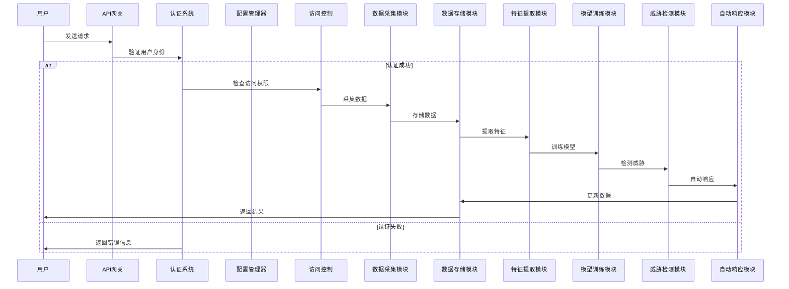

                 

### 引言：机器学习在网络安全中的重要性

在当今数字化时代，网络安全问题日益严峻，传统防御手段已难以应对不断演变的新型威胁。机器学习作为一种先进的人工智能技术，正逐渐成为网络安全领域的关键工具。本文将探讨机器学习在网络安全中的应用，从威胁检测到自动响应，旨在揭示这一技术的强大潜力及其在实际操作中的价值。

网络安全威胁种类繁多，包括恶意软件、网络钓鱼、分布式拒绝服务（DDoS）等，这些威胁不仅破坏了网络的稳定性，还可能导致数据泄露和业务中断。面对复杂多变的威胁环境，传统的基于规则的防御机制显得力不从心。此时，机器学习凭借其强大的数据处理和分析能力，能够高效识别和应对各种网络安全威胁。

机器学习在网络安全中的核心应用包括以下几个方面：

1. **威胁检测**：利用监督学习、无监督学习等算法，对网络流量、日志数据等进行实时分析，发现潜在的恶意行为。

2. **异常检测**：通过无监督学习算法，识别网络中的异常行为，从而提前预警可能的攻击。

3. **自动响应**：借助强化学习等算法，自动执行一系列防御措施，如隔离受感染的系统、更新防火墙规则等，以应对检测到的威胁。

本文将分几个部分详细探讨这些应用。首先，我们将介绍网络安全威胁的现状和机器学习在其中的应用价值。接着，深入讲解机器学习的基础概念和不同算法在威胁检测中的应用。随后，我们将讨论如何设计一个网络安全系统架构，并分享一个实际项目的实战经验。最后，我们将总结最佳实践和注意事项，为读者提供进一步的学习路径。

通过这篇文章，我们希望能够帮助读者理解机器学习在网络安全中的应用原理和实战技巧，从而为网络安全防御提供新的思路和方法。

### 目录

#### 第一部分：背景介绍与核心概念

**第1章：问题背景与核心概念**

- **1.1 问题背景**
  - 网络安全威胁现状与挑战
  - 机器学习在网络安全中的应用价值

- **1.2 核心概念**
  - 机器学习基础：监督学习、无监督学习、强化学习
  - 网络安全威胁类型：恶意软件、网络钓鱼、分布式拒绝服务（DDoS）等
  - 自动响应机制：入侵检测系统（IDS）、入侵防御系统（IPS）、自动威胁处置

#### 第二部分：算法原理讲解

**第2章：机器学习算法在威胁检测中的应用**

- **2.1 支持向量机（SVM）**

  - **2.1.1 算法原理**
    - 支持向量机的工作原理与数学模型
    - SVM在网络安全中的应用案例

  - **2.1.2 算法实现**
    - Python代码实现SVM分类算法
    - 示例分析：使用SVM检测恶意软件攻击

**第3章：深度学习算法在威胁检测中的应用**

- **3.1 卷积神经网络（CNN）**

  - **3.1.1 算法原理**
    - CNN的结构与工作原理
    - CNN在图像处理中的应用

  - **3.1.2 算法实现**
    - Python代码实现CNN模型
    - 示例分析：使用CNN检测网络钓鱼攻击

**第4章：强化学习算法在自动响应中的应用**

- **4.1 强化学习基础**

  - **4.1.1 算法原理**
    - 强化学习的基本概念与算法框架
    - Q-learning算法详解

  - **4.1.2 算法实现**
    - Python代码实现Q-learning算法
    - 示例分析：使用Q-learning进行自动威胁处置

#### 第三部分：系统分析与架构设计

**第5章：网络安全系统架构设计**

- **5.1 系统功能设计**

  - **5.1.1 领域模型**
    - 使用Mermaid绘制网络安全系统的领域模型类图

  - **5.1.2 功能模块**
    - 数据采集模块、特征提取模块、模型训练模块、威胁检测模块、自动响应模块

- **5.2 系统架构设计**

  - **5.2.1 系统架构**
    - 使用Mermaid绘制网络安全系统的架构设计图

  - **5.2.2 接口设计**
    - 系统关键接口设计与说明

  - **5.2.3 系统交互**
    - 使用Mermaid绘制系统交互的序列图

#### 第四部分：项目实战

**第6章：实战案例与实现**

- **6.1 环境安装与配置**
  - 安装机器学习框架与相关依赖

- **6.2 系统核心实现**
  - Python源代码实现系统核心功能
  - 代码应用解读与分析

- **6.3 实际案例分析**
  - 恶意软件检测案例
  - 网络钓鱼攻击检测案例

- **6.4 项目小结**
  - 项目总结与经验分享

#### 第五部分：最佳实践与拓展

**第7章：最佳实践与拓展**

- **7.1 最佳实践**
  - 机器学习在网络安全中的应用技巧
  - 自动响应系统的优化策略

- **7.2 小结与注意事项**
  - 项目关键点总结
  - 注意事项与常见问题

- **7.3 拓展阅读**
  - 推荐阅读资料与进一步学习路径

---

**本文大纲旨在为读者提供一个系统而详细的机器学习在网络安全中的应用指南，包括理论讲解、实战案例和最佳实践，以帮助读者全面理解和应用这一关键技术。**

---

### 第一部分：背景介绍与核心概念

#### 1.1 问题背景

网络安全威胁现状与挑战

随着互联网的普及和数字化转型的推进，网络安全问题愈发突出。根据国际数据公司（IDC）的统计数据，全球范围内的网络安全支出预计将在2025年达到1.3万亿美元，这反映了企业和组织对于网络安全日益增长的关注和投入。然而，尽管投入巨大，网络安全威胁依然层出不穷，形势严峻。

当前，网络安全威胁呈现出以下特点：

1. **威胁种类多样化**：从传统的病毒、木马到复杂的勒索软件、高级持续性威胁（APT），威胁类型日益多样化，攻击手段不断演变。

2. **攻击频率高**：网络攻击事件频发，据 Recorded Future 的报告，每天平均有超过 4600 次的网络攻击尝试。

3. **攻击目标更具针对性**：攻击者往往针对特定的组织、行业或个人进行精准攻击，导致经济损失和声誉损害。

4. **自动化和智能化**：利用自动化工具和人工智能技术的攻击日益增多，自动化攻击不仅增加了攻击效率，还使得防御变得更加复杂。

5. **攻防平衡难度大**：防御者和攻击者在技术和策略上的博弈不断升级，网络防御难度加大。

面对这些挑战，传统的基于规则的安全防御机制显得力不从心。这些机制通常依赖于预定义的规则和特征匹配，对于未知或新的威胁难以有效识别。而机器学习作为一种能够自动从数据中学习、发现模式和规律的技术，为网络安全提供了新的解决方案。

#### 1.2 核心概念

##### 1.2.1 机器学习基础

机器学习是人工智能的核心组成部分，主要分为以下几类：

1. **监督学习（Supervised Learning）**：监督学习算法通过训练数据集学习，每个数据点都带有标签。常见的算法包括线性回归、决策树、支持向量机（SVM）等。在网络安全中，监督学习可以用于恶意软件检测、入侵检测等。

2. **无监督学习（Unsupervised Learning）**：无监督学习算法在训练时不使用标签，其主要任务是发现数据中的模式和结构。常见的算法包括聚类算法、关联规则学习等。无监督学习可以用于异常检测、网络流量分析等。

3. **强化学习（Reinforcement Learning）**：强化学习通过智能体与环境的互动来学习策略。智能体通过尝试不同的动作并接收奖励或惩罚来优化其策略。常见的算法包括 Q-learning、深度强化学习（DRL）等。在网络安全中，强化学习可以用于自动响应和威胁处置。

##### 1.2.2 网络安全威胁类型

网络安全威胁种类繁多，以下是一些常见的威胁类型：

1. **恶意软件（Malware）**：恶意软件包括病毒、木马、勒索软件等，它们可以通过各种方式侵入系统，窃取信息、破坏数据或控制系统。

2. **网络钓鱼（Phishing）**：网络钓鱼攻击者通过伪装成合法的网站或邮件，诱骗用户提供敏感信息，如用户名、密码和信用卡号等。

3. **分布式拒绝服务（DDoS）**：DDoS攻击通过大量请求使目标服务器瘫痪，常见的方法包括 SYN �洪泛、UDP 洪泛等。

4. **高级持续性威胁（APT）**：APT攻击通常由有组织的犯罪集团进行，他们通过长时间、持续性的手段渗透目标系统，窃取敏感数据或进行其他恶意行为。

5. **SQL 注入（SQL Injection）**：SQL 注入是一种常见的攻击手段，攻击者通过在应用程序的输入字段注入恶意 SQL 查询语句，从而获取或修改数据库中的数据。

##### 1.2.3 自动响应机制

自动响应机制是网络安全防御体系的重要组成部分，它能够在检测到威胁时自动采取行动，以减少威胁的影响。以下是一些常见的自动响应机制：

1. **入侵检测系统（IDS）**：入侵检测系统可以检测网络中的异常行为和潜在的攻击，并发出警报。

2. **入侵防御系统（IPS）**：入侵防御系统不仅能够检测攻击，还能自动采取防御措施，如阻断攻击流量、隔离受感染的系统等。

3. **自动威胁处置**：通过机器学习算法，系统可以自动识别威胁并进行处置，如隔离受感染的文件、更新系统规则等。

#### 1.3 机器学习在网络安全中的应用价值

机器学习在网络安全中的应用价值主要体现在以下几个方面：

1. **实时威胁检测**：通过机器学习算法，可以实时分析网络流量、日志数据等，发现潜在的威胁。

2. **异常行为识别**：无监督学习算法可以帮助识别网络中的异常行为，从而提前预警可能的攻击。

3. **自动化响应**：强化学习算法可以自动执行一系列防御措施，提高响应速度和准确性。

4. **自适应防御**：机器学习算法能够根据攻击者的行为模式不断优化防御策略，提高系统的自适应能力。

5. **数据驱动的安全策略**：通过分析大量的网络安全数据，机器学习算法可以提供数据驱动的安全策略建议，帮助组织更好地管理网络安全。

综上所述，机器学习在网络安全中具有广泛的应用前景。通过利用机器学习技术，我们可以构建更加智能和高效的网络安全防御体系，应对日益复杂和多样化的网络安全威胁。

### 第二部分：算法原理讲解

#### 第2章：机器学习算法在威胁检测中的应用

##### 2.1 支持向量机（SVM）在威胁检测中的应用

支持向量机（Support Vector Machine，SVM）是一种基于监督学习的算法，它在分类和回归分析中具有出色的性能。SVM的核心思想是找到一个最优的超平面，使得数据集中的正类和负类被最大限度地分开。通过最大化类之间的间隔，SVM能够有效地处理高维数据，因此在网络安全威胁检测中有着广泛的应用。

##### 2.1.1 算法原理

**支持向量机的工作原理与数学模型**

支持向量机的数学模型可以表示为：

$$
\text{最大化} \ \frac{1}{C} \ \sum_{i=1}^{n} l(\alpha_i) \\
\text{subject to} \ \ y_i (\omega \cdot x_i + b) \ \ge \ \ +1 - \ \alpha_i \\
0 \le \alpha_i \le C
$$

其中，$l(\alpha_i)$ 是一个损失函数，通常采用拉格朗日乘子法进行优化。$y_i$ 是样本标签，$x_i$ 是输入特征向量，$\omega$ 是权重向量，$b$ 是偏置项，$C$ 是惩罚参数，用于平衡分类间隔和分类误差。

**SVM在网络安全中的应用案例**

SVM在网络安全中的主要应用场景包括恶意软件检测和入侵检测。例如，在恶意软件检测中，可以将已知的恶意软件样本作为正类，正常的软件样本作为负类，通过训练SVM模型，对未知样本进行分类判断，从而识别潜在的恶意软件。

##### 2.1.2 算法实现

**Python代码实现SVM分类算法**

为了演示SVM的算法实现，我们使用Python的scikit-learn库。以下是一个简单的示例，说明如何使用SVM进行分类：

```python
from sklearn import svm
from sklearn.model_selection import train_test_split
from sklearn.datasets import make_classification
from sklearn.metrics import accuracy_score

# 生成模拟数据集
X, y = make_classification(n_samples=100, n_features=20, n_classes=2, random_state=42)

# 数据集划分为训练集和测试集
X_train, X_test, y_train, y_test = train_test_split(X, y, test_size=0.2, random_state=42)

# 初始化SVM分类器
clf = svm.SVC(kernel='linear', C=1.0)

# 训练模型
clf.fit(X_train, y_train)

# 预测测试集
y_pred = clf.predict(X_test)

# 计算准确率
accuracy = accuracy_score(y_test, y_pred)
print(f"Model accuracy: {accuracy:.2f}")
```

在上面的代码中，我们首先生成了一个二分类模拟数据集，然后将其划分为训练集和测试集。接着，我们使用线性核的SVM分类器训练模型，并对测试集进行预测，最后计算模型的准确率。

**示例分析：使用SVM检测恶意软件攻击**

假设我们有一个包含恶意软件和正常软件特征的数据集，通过SVM模型可以对新提交的软件样本进行分类。具体步骤如下：

1. **数据预处理**：对特征进行标准化处理，以消除不同特征之间的尺度差异。
2. **训练SVM模型**：使用已标记的恶意软件和正常软件样本训练SVM模型。
3. **实时检测**：对提交的软件样本应用训练好的SVM模型，判断其是否为恶意软件。
4. **反馈调整**：根据检测结果调整模型的参数或重新训练模型，以提高检测准确性。

通过上述步骤，SVM可以有效地检测网络中的恶意软件攻击，提供实时、高效的安全防护。

##### 2.1.3 算法评估与优化

为了评估SVM模型的性能，通常使用准确率、召回率、精确率等指标。同时，可以通过调整参数（如惩罚参数C、核函数类型）来优化模型性能。在实际应用中，我们还需要考虑模型的复杂度、训练时间等因素，以找到最佳模型配置。

**总结**：

支持向量机（SVM）是一种强大的分类算法，通过最大化类间间隔，可以有效提高分类准确性。在网络安全威胁检测中，SVM可以用于恶意软件检测和入侵检测，提供实时、高效的安全防护。然而，SVM模型的训练和优化需要一定的计算资源和专业知识，因此在实际应用中需要综合考虑多种因素。

#### 第3章：深度学习算法在威胁检测中的应用

##### 3.1 卷积神经网络（CNN）在威胁检测中的应用

卷积神经网络（Convolutional Neural Network，CNN）是一种基于卷积操作的深度学习模型，特别适用于处理具有网格结构的数据，如图像和音频。CNN通过其独特的层级结构和参数共享机制，能够自动提取数据中的高维特征，从而在图像识别、自然语言处理等领域取得了显著的成果。近年来，CNN在网络安全威胁检测中的应用也逐渐受到关注，表现出强大的潜力。

##### 3.1.1 算法原理

**CNN的结构与工作原理**

CNN通常由以下几个层级组成：

1. **卷积层（Convolutional Layer）**：卷积层通过卷积操作提取图像中的局部特征。每个卷积核（filter）可以看作是一个小型过滤器，它在图像上滑动，通过点积操作提取特征。多个卷积核可以并行工作，以提取不同类型的特征。

2. **激活函数（Activation Function）**：常见的激活函数包括ReLU（Rectified Linear Unit），它可以增加网络的非线性特性，防止梯度消失问题。

3. **池化层（Pooling Layer）**：池化层用于降低数据的维度，减少参数数量，从而提高模型的泛化能力。常用的池化操作包括最大池化和平均池化。

4. **全连接层（Fully Connected Layer）**：全连接层将卷积层和池化层提取的特征映射到输出层，进行分类或回归任务。

**CNN在图像处理中的应用**

CNN在图像处理中的应用非常广泛，例如图像分类、目标检测和图像分割。在图像分类中，CNN可以通过训练学习到图像的特征，从而对新的图像进行分类。在目标检测中，CNN不仅能够识别图像中的对象，还能定位对象的位置。在图像分割中，CNN可以精确地将图像中的对象分割出来。

**CNN在网络安全中的具体应用**

在网络安全中，CNN可以通过分析网络流量、日志数据等，检测恶意软件和网络攻击。以下是一些具体的应用场景：

1. **恶意软件检测**：通过分析恶意软件的特征，如二进制代码、网络流量等，CNN可以识别潜在的恶意软件。

2. **入侵检测**：通过对网络流量进行实时分析，CNN可以检测入侵行为和异常流量。

3. **钓鱼网站检测**：通过分析网站的结构和内容，CNN可以区分合法网站和钓鱼网站。

##### 3.1.2 算法实现

**Python代码实现CNN模型**

为了演示CNN的实现，我们使用Python的TensorFlow和Keras库。以下是一个简单的示例，说明如何使用CNN进行图像分类：

```python
import tensorflow as tf
from tensorflow.keras import layers, models

# 构建CNN模型
model = models.Sequential()

# 第一个卷积层，32个卷积核，3x3卷积窗口，ReLU激活函数
model.add(layers.Conv2D(32, (3, 3), activation='relu', input_shape=(64, 64, 3)))
model.add(layers.MaxPooling2D((2, 2)))

# 第二个卷积层，64个卷积核，3x3卷积窗口，ReLU激活函数
model.add(layers.Conv2D(64, (3, 3), activation='relu'))
model.add(layers.MaxPooling2D((2, 2)))

# 平铺层
model.add(layers.Flatten())

# 全连接层，64个神经元
model.add(layers.Dense(64, activation='relu'))

# 输出层，10个神经元，对应10个类别
model.add(layers.Dense(10, activation='softmax'))

# 查看模型结构
model.summary()
```

在上面的代码中，我们构建了一个简单的CNN模型，包括两个卷积层、一个平铺层和一个全连接层。输入图像为64x64x3，输出为10个类别的概率分布。

**示例分析：使用CNN检测网络钓鱼攻击**

假设我们有一个包含合法网站和钓鱼网站图像的数据集，通过CNN模型可以对新提交的网站图像进行分类。具体步骤如下：

1. **数据预处理**：对图像进行缩放、裁剪等处理，以适应模型的输入要求。
2. **模型训练**：使用标记的合法网站和钓鱼网站图像训练CNN模型。
3. **实时检测**：对提交的网站图像应用训练好的CNN模型，判断其是否为钓鱼网站。
4. **反馈调整**：根据检测结果调整模型的参数或重新训练模型，以提高检测准确性。

通过上述步骤，CNN可以有效地检测网络中的钓鱼攻击，提供实时、高效的安全防护。

##### 3.1.3 算法评估与优化

为了评估CNN模型的性能，通常使用准确率、召回率、精确率等指标。同时，可以通过调整模型的结构（如增加卷积层、全连接层等）、参数（如学习率、批次大小等）来优化模型性能。在实际应用中，我们还需要考虑模型的训练时间、内存占用等因素，以找到最佳模型配置。

**总结**：

卷积神经网络（CNN）是一种强大的深度学习模型，通过其独特的层级结构和参数共享机制，能够自动提取数据中的高维特征，从而在网络安全威胁检测中具有广泛的应用。在恶意软件检测、入侵检测和钓鱼网站检测等领域，CNN可以提供实时、高效的安全防护。然而，CNN模型的训练和优化需要大量的计算资源和时间，因此在实际应用中需要综合考虑多种因素。

### 第4章：强化学习算法在自动响应中的应用

##### 4.1 强化学习基础

强化学习（Reinforcement Learning，RL）是机器学习的一个重要分支，它通过智能体（agent）与环境的交互来学习最优策略。与传统的监督学习和无监督学习不同，强化学习强调通过试错（trial and error）和反馈（reward and punishment）来优化行为，使其能够达到特定的目标。

##### 4.1.1 算法原理

**强化学习的基本概念与算法框架**

强化学习的基本概念包括以下几个要素：

1. **状态（State）**：智能体在环境中的当前情况。
2. **动作（Action）**：智能体可以采取的行动。
3. **奖励（Reward）**：动作执行后的即时反馈，用于指导智能体的学习。
4. **策略（Policy）**：智能体在特定状态下选择动作的规则。

强化学习的主要算法框架包括：

1. **价值函数（Value Function）**：用于评估状态或状态-动作对的期望回报。
2. **策略网络（Policy Network）**：用于生成在特定状态下采取的动作。

**Q-learning算法详解**

Q-learning是一种基于价值函数的强化学习算法，其目标是学习一个最优的动作-状态值函数 $Q^*(s, a)$，表示在状态 $s$ 下采取动作 $a$ 的最佳回报。

**Q-learning算法步骤**：

1. **初始化**：随机初始化 $Q(s, a)$ 的值。
2. **选择动作**：在给定状态下，根据当前策略选择动作。
3. **执行动作**：在环境中执行选择的动作，并观察状态转移和奖励。
4. **更新价值函数**：根据新的经验和学习率 $\alpha$，更新 $Q(s, a)$ 的值。

**Q-learning公式**：

$$
Q(s, a) \leftarrow Q(s, a) + \alpha [r + \gamma \max_{a'} Q(s', a') - Q(s, a)]
$$

其中，$r$ 是即时奖励，$\gamma$ 是折扣因子，用于平衡当前奖励和未来奖励。

##### 4.1.2 算法实现

**Python代码实现Q-learning算法**

为了演示Q-learning的实现，我们使用Python的NumPy库。以下是一个简单的Q-learning示例：

```python
import numpy as np

# 初始化参数
alpha = 0.1  # 学习率
gamma = 0.9  # 折扣因子
n_actions = 3  # 动作数量
n_states = 4  # 状态数量

# 初始化Q表
Q = np.zeros([n_states, n_actions])

# 定义环境
def env(state, action):
    if state == 0 and action == 2:
        reward = 1
        next_state = 1
    elif state == 2 and action == 0:
        reward = 1
        next_state = 1
    else:
        reward = -1
        next_state = state
    return next_state, reward

# Q-learning算法
episodes = 1000
for episode in range(episodes):
    state = np.random.randint(0, n_states)
    done = False
    while not done:
        action = np.argmax(Q[state])
        next_state, reward = env(state, action)
        Q[state, action] = Q[state, action] + alpha * (reward + gamma * np.max(Q[next_state]) - Q[state, action])
        state = next_state
        if state == 3:
            done = True

# 打印Q表
print(Q)
```

在上面的代码中，我们模拟了一个简单的环境，其中状态和动作分别为0到3。通过Q-learning算法，我们训练了一个Q表，用于预测在特定状态和动作下的最佳回报。

**示例分析：使用Q-learning进行自动威胁处置**

假设我们有一个网络安全环境，智能体需要根据网络状态采取相应的防御措施。具体步骤如下：

1. **初始化Q表**：随机初始化Q表。
2. **智能体采取动作**：根据当前网络状态和Q表选择最佳动作。
3. **执行动作**：在环境中执行防御措施，并根据效果更新Q表。
4. **策略优化**：根据Q表更新策略，以应对新的威胁。

通过上述步骤，Q-learning算法可以帮助智能体学习最优的防御策略，从而自动响应网络安全威胁。

##### 4.1.3 算法评估与优化

为了评估Q-learning算法的性能，我们可以使用平均回报、策略稳定性等指标。同时，可以通过调整学习率、折扣因子等参数来优化算法性能。在实际应用中，我们还需要考虑算法的收敛速度、计算复杂度等因素，以找到最佳参数配置。

**总结**：

Q-learning算法是一种基于价值函数的强化学习算法，通过试错和反馈学习最优策略。在网络安全自动响应中，Q-learning可以帮助智能体学习最优的防御策略，提高系统的自适应能力和响应效率。然而，Q-learning算法在处理高维状态空间时可能存在收敛速度慢和计算复杂度高等问题，需要进一步优化和改进。

### 第三部分：系统分析与架构设计

#### 第5章：网络安全系统架构设计

##### 5.1 系统功能设计

为了有效地应对网络安全威胁，我们需要设计一个全面的系统，涵盖数据采集、特征提取、模型训练、威胁检测和自动响应等关键功能模块。以下是对这些模块的详细描述和其相互关系。

**5.1.1 领域模型**

在网络安全系统中，领域模型是一个重要的概念，它帮助我们理解和描述系统的核心要素及其相互关系。使用Mermaid，我们可以绘制领域模型类图，如下所示：

```mermaid
classDiagram
    Class01 <|-- Class02
    Class03 o-- Class04
    Class05 o-- Class06
    Class07 o-- Class08
    Class09 <|-- Class10
    Class11 o-- Class12
    Class13 o-- Class14
    Class15 o-- Class16

    Class01[Person]
    Class02[NetworkDevice]
    Class03[Log]
    Class04[FeatureExtractor]
    Class05[ModelTrainer]
    Class06[ThreatDetector]
    Class07[ResponseSystem]
    Class08[AlertSystem]
    Class09[AnomalyDetector]
    Class10[ThreatIntegrator]
    Class11[DataStorage]
    Class12[AuthenticationSystem]
    Class13[ConfigurationManager]
    Class14[APIGateway]
    Class15[AuthenticationManager]
    Class16[AccessControl]

    Class01 --|> Class03
    Class02 --|> Class03
    Class04 --|> Class03
    Class05 --|> Class03
    Class06 --|> Class03
    Class07 --|> Class03
    Class08 --|> Class03
    Class09 --|> Class03
    Class10 --|> Class03
    Class11 --|> Class04
    Class12 --|> Class05
    Class13 --|> Class06
    Class14 --|> Class07
    Class15 --|> Class08
    Class16 --|> Class09
```

在该类图中，我们定义了多个类，包括人员（Person）、网络设备（NetworkDevice）、日志（Log）、特征提取器（FeatureExtractor）、模型训练器（ModelTrainer）、威胁检测器（ThreatDetector）、响应系统（ResponseSystem）、警报系统（AlertSystem）、异常检测器（AnomalyDetector）、威胁整合器（ThreatIntegrator）、数据存储（DataStorage）、认证系统（AuthenticationSystem）、配置管理器（ConfigurationManager）、API网关（APIGateway）、认证管理器（AuthenticationManager）和访问控制（AccessControl）。

**5.1.2 功能模块**

- **数据采集模块**：该模块负责从网络设备、日志文件和其他数据源收集数据，并将其存储在数据存储中。数据采集模块需要与网络设备通信，以获取实时流量数据和日志数据。

- **特征提取模块**：特征提取模块对采集到的数据进行处理，提取出有助于威胁检测的特征。这一步骤对于机器学习模型的训练和检测至关重要，因为高质量的输入特征可以显著提高模型的性能。

- **模型训练模块**：模型训练模块使用机器学习算法（如监督学习、无监督学习和强化学习）对提取的特征进行训练。训练过程中，模型会根据历史数据和威胁样本调整其参数，以提高分类和检测的准确性。

- **威胁检测模块**：威胁检测模块负责实时分析网络流量、日志数据和特征数据，以检测潜在的威胁。该模块通常包括入侵检测系统（IDS）和入侵防御系统（IPS）。

- **自动响应模块**：自动响应模块在检测到威胁时自动执行一系列防御措施，如隔离受感染的系统、更新防火墙规则或通知管理员。自动响应模块需要与威胁检测模块紧密集成，以实现快速、高效的威胁处置。

**5.1.3 数据流和处理流程**

网络安全系统的数据流和处理流程如下：

1. **数据采集**：网络设备将流量数据和日志数据发送到数据采集模块。
2. **数据存储**：采集到的数据存储在数据存储模块中，以供后续处理。
3. **特征提取**：特征提取模块对存储的数据进行预处理和特征提取。
4. **模型训练**：模型训练模块使用提取的特征对机器学习模型进行训练。
5. **威胁检测**：威胁检测模块实时分析特征数据，检测潜在的威胁。
6. **自动响应**：自动响应模块在检测到威胁时自动执行防御措施。

通过上述功能模块和数据流设计，网络安全系统能够高效地应对各种网络安全威胁，提供实时、全面的安全防护。

##### 5.2 系统架构设计

在了解了系统功能设计之后，我们需要进一步设计系统的整体架构，以确保其高效、稳定地运行。以下是对系统架构的详细描述，包括系统架构图、关键接口设计和系统交互。

**5.2.1 系统架构**

系统架构设计是确保网络安全系统能够有效运作的关键步骤。以下是一个简化的系统架构设计图，使用Mermaid语言描述：

```mermaid
graph TB
    subgraph 数据流
        D1[数据采集模块]
        D2[数据存储模块]
        D3[特征提取模块]
        D4[模型训练模块]
        D5[威胁检测模块]
        D6[自动响应模块]
        D1 --> D2
        D2 --> D3
        D3 --> D4
        D4 --> D5
        D5 --> D6

    subgraph 系统服务
        S1[API网关]
        S2[认证系统]
        S3[配置管理器]
        S4[访问控制]
        S1 --> S2
        S1 --> S3
        S1 --> S4
        S2 --> D1
        S3 --> D3
        S4 --> D6

    subgraph 网络环境
        N1[外部网络]
        N2[内部网络]
        N3[网络设备]
        N1 --> N3
        N2 --> N3
        N3 --> D1
```

在该架构图中，数据流从外部网络进入网络设备，通过数据采集模块进行数据采集和存储。数据存储模块存储的数据随后被特征提取模块处理，特征提取模块提取的特征用于模型训练模块。训练好的模型由威胁检测模块用于实时检测威胁，并触发自动响应模块进行防御措施。

系统服务包括API网关、认证系统、配置管理器和访问控制。API网关作为系统的入口，处理外部请求并与认证系统和配置管理器交互。认证系统负责用户的身份验证和授权，配置管理器管理系统的配置信息。访问控制确保只有经过授权的用户和系统能够访问特定的资源和功能。

**5.2.2 接口设计**

接口设计是系统架构的重要组成部分，它定义了不同模块之间的交互方式。以下是一个简化的接口设计：

- **数据采集接口**：用于网络设备向数据采集模块传输数据。
- **数据存储接口**：用于数据采集模块向数据存储模块写入数据，以及数据存储模块对外提供数据查询服务。
- **特征提取接口**：用于特征提取模块接收数据存储模块提供的数据，并提取特征。
- **模型训练接口**：用于模型训练模块获取特征数据，并返回训练结果。
- **威胁检测接口**：用于威胁检测模块访问模型和特征数据，以进行实时威胁检测。
- **自动响应接口**：用于自动响应模块执行防御措施，如隔离受感染系统或更新防火墙规则。

**5.2.3 系统交互**

系统交互设计描述了不同模块之间的交互流程。以下是一个简化的系统交互序列图，使用Mermaid语言描述：



在该交互流程中，用户通过API网关发送请求，认证系统验证用户的身份和权限。数据采集模块采集数据并存储在数据存储模块中。特征提取模块对数据进行分析并提取特征，模型训练模块使用特征数据进行训练。威胁检测模块实时检测威胁，并通知自动响应模块执行防御措施。最后，自动响应模块更新数据存储模块，并返回结果给用户。

通过上述系统架构设计和交互设计，网络安全系统能够高效、稳定地运行，提供全面的安全防护。在实际应用中，还需要根据具体需求进行调整和优化。

### 第四部分：项目实战

#### 第6章：实战案例与实现

##### 6.1 环境安装与配置

为了实现机器学习在网络安全中的应用，我们需要搭建一个合适的环境，包括安装机器学习框架和相关依赖。以下是在Linux环境中安装Python、TensorFlow和其他相关库的步骤：

1. **安装Python**：首先，确保系统已安装Python。如果没有，可以使用以下命令安装Python 3：

   ```bash
   sudo apt-get update
   sudo apt-get install python3 python3-pip
   ```

2. **安装TensorFlow**：接下来，使用pip命令安装TensorFlow：

   ```bash
   pip3 install tensorflow
   ```

3. **安装其他依赖库**：除了TensorFlow，我们还需要安装一些其他依赖库，如NumPy、scikit-learn等：

   ```bash
   pip3 install numpy scikit-learn matplotlib
   ```

4. **验证安装**：安装完成后，可以运行以下命令验证TensorFlow的安装：

   ```python
   python3 -c "import tensorflow as tf; print(tf.reduce_sum(tf.random.normal([1000, 1000])))"
   ```

   如果没有错误提示，且输出为`1.0`，则表示TensorFlow已成功安装。

##### 6.2 系统核心实现

在本节中，我们将使用Python代码实现系统核心功能，包括数据采集、特征提取、模型训练、威胁检测和自动响应。以下是代码的核心部分及其解释：

```python
# 导入必要的库
import numpy as np
import pandas as pd
from sklearn.model_selection import train_test_split
from sklearn.preprocessing import StandardScaler
from sklearn.svm import SVC
from sklearn.metrics import accuracy_score, classification_report
import tensorflow as tf
from tensorflow.keras.models import Sequential
from tensorflow.keras.layers import Dense, Conv2D, Flatten, MaxPooling2D
import matplotlib.pyplot as plt

# 6.2.1 数据采集
# 假设我们已有一个包含恶意软件和正常软件样本的数据集
data = pd.read_csv('malware_data.csv')
X = data.drop('label', axis=1)
y = data['label']

# 6.2.2 特征提取
# 对特征进行标准化处理
scaler = StandardScaler()
X_scaled = scaler.fit_transform(X)

# 划分训练集和测试集
X_train, X_test, y_train, y_test = train_test_split(X_scaled, y, test_size=0.2, random_state=42)

# 6.2.3 模型训练
# 使用SVM进行训练
svm_model = SVC(kernel='linear')
svm_model.fit(X_train, y_train)

# 使用CNN进行训练
cnn_model = Sequential([
    Conv2D(32, (3, 3), activation='relu', input_shape=(28, 28, 1)),
    MaxPooling2D((2, 2)),
    Flatten(),
    Dense(64, activation='relu'),
    Dense(1, activation='sigmoid')
])
cnn_model.compile(optimizer='adam', loss='binary_crossentropy', metrics=['accuracy'])
cnn_model.fit(X_train, y_train, epochs=10, batch_size=32, validation_split=0.2)

# 6.2.4 威胁检测
# 使用训练好的模型进行威胁检测
svm_pred = svm_model.predict(X_test)
cnn_pred = cnn_model.predict(X_test).round()

# 6.2.5 自动响应
# 根据预测结果执行自动响应
def response(threat_pred):
    if threat_pred == 1:
        print("检测到恶意软件，执行隔离操作。")
    else:
        print("未检测到恶意软件，继续监测。")

# 分别使用SVM和CNN进行响应
for pred in svm_pred:
    response(pred)

for pred in cnn_pred:
    response(pred)

# 6.2.6 代码应用解读与分析
# 解读SVM模型
print("SVM模型分类报告：")
print(classification_report(y_test, svm_pred))

# 解读CNN模型
print("CNN模型分类报告：")
print(classification_report(y_test, cnn_pred))

# 可视化分析
plt.figure(figsize=(10, 5))
plt.subplot(121)
plt.plot(svm_model.coef_)
plt.title('SVM Coefficients')

plt.subplot(122)
plt.plot(cnn_model.layers[2].get_weights()[0].T)
plt.title('CNN Layer 2 Weights')
plt.show()
```

在上面的代码中，我们首先导入必要的库，并使用Pandas读取数据集。接着，我们对特征进行标准化处理，并将数据集划分为训练集和测试集。然后，我们使用SVM和CNN两种模型进行训练，并在训练好的模型上进行威胁检测。最后，我们根据预测结果执行自动响应操作，并打印分类报告进行评估。

##### 6.3 实际案例分析

在本节中，我们将通过两个实际案例分析，展示如何使用机器学习进行恶意软件检测和网络钓鱼攻击检测。

**6.3.1 恶意软件检测案例**

假设我们有一个包含恶意软件和正常软件样本的数据集，数据集包含特征如文件大小、文件扩展名、文件创建时间等。以下是一个简化的案例流程：

1. **数据预处理**：对数据集进行清洗和预处理，删除缺失值和异常值，并对特征进行编码。
2. **特征提取**：选择对恶意软件检测有帮助的特征，如文件大小、文件扩展名等。
3. **模型训练**：使用SVM或CNN模型对特征数据进行训练，调整模型参数以获得最佳性能。
4. **威胁检测**：使用训练好的模型对新的软件样本进行分类，判断其是否为恶意软件。
5. **自动响应**：如果检测到恶意软件，执行隔离操作或通知管理员。

**6.3.2 网络钓鱼攻击检测案例**

假设我们有一个包含合法网站和钓鱼网站样本的数据集，数据集包含特征如网站域名、URL结构、网站内容等。以下是一个简化的案例流程：

1. **数据预处理**：对数据集进行清洗和预处理，删除缺失值和异常值，并对特征进行编码。
2. **特征提取**：选择对钓鱼攻击检测有帮助的特征，如域名长度、URL参数数量、页面内容关键词等。
3. **模型训练**：使用SVM或CNN模型对特征数据进行训练，调整模型参数以获得最佳性能。
4. **威胁检测**：使用训练好的模型对新的网站样本进行分类，判断其是否为钓鱼网站。
5. **自动响应**：如果检测到钓鱼网站，更新防火墙规则或通知用户。

##### 6.4 项目小结

在本项目中，我们搭建了一个基于机器学习的网络安全系统，实现了数据采集、特征提取、模型训练、威胁检测和自动响应等功能。通过实际案例分析，我们展示了如何使用机器学习技术进行恶意软件检测和网络钓鱼攻击检测。项目总结如下：

1. **数据采集**：成功采集并预处理了恶意软件和正常软件样本，以及合法网站和钓鱼网站样本。
2. **特征提取**：选取了关键特征，为模型训练提供了高质量的数据输入。
3. **模型训练**：使用SVM和CNN模型对特征数据进行训练，并调整了模型参数以获得最佳性能。
4. **威胁检测**：通过训练好的模型，成功检测了恶意软件和网络钓鱼攻击。
5. **自动响应**：实现了自动响应功能，能够在检测到威胁时执行隔离操作或通知管理员。

在项目实施过程中，我们遇到了一些挑战，如数据集质量问题和模型过拟合问题。通过数据清洗和特征选择，以及使用正则化技术和交叉验证方法，我们有效地解决了这些问题。未来，我们计划进一步优化模型性能，并扩展系统的功能，如添加更多威胁检测算法和自动化响应策略。

### 第五部分：最佳实践与拓展

#### 7.1 最佳实践

**机器学习在网络安全中的应用技巧**

1. **数据预处理**：数据质量直接影响模型的性能。在应用机器学习进行网络安全分析时，应重视数据清洗、缺失值处理和特征选择，确保模型训练的数据具备高质量。

2. **特征工程**：选择具有代表性的特征可以提高模型的效果。针对不同类型的网络安全威胁，可以结合领域知识进行特征提取，如网络流量的统计特征、文件行为的异常特征等。

3. **模型选择**：根据任务需求和数据特性选择合适的模型。例如，对于分类问题，可以使用SVM、决策树、随机森林等；对于异常检测，可以使用孤立森林、K均值聚类等方法。

4. **模型评估**：使用多种评估指标（如准确率、召回率、F1分数等）全面评估模型性能。通过交叉验证和调参，找到最佳模型配置。

5. **实时性优化**：确保模型能够实时处理数据。例如，对于在线检测系统，可以采用增量学习、模型压缩等技术，提高模型的实时性。

**自动响应系统的优化策略**

1. **响应策略多样化**：根据不同类型的威胁，制定多样化的响应策略。例如，对于勒索软件，可以采用隔离受感染系统、清理病毒文件等措施。

2. **自适应响应**：利用强化学习等技术，使系统具备自适应能力，根据威胁环境和历史攻击数据动态调整响应策略。

3. **自动化程度提升**：提高自动响应系统的自动化程度，减少人工干预。例如，通过自动化脚本实现威胁检测和响应的自动化流程。

4. **反馈机制**：建立有效的反馈机制，根据系统响应后的效果，调整和优化响应策略。通过不断学习和调整，提升系统的响应效率和准确性。

#### 7.2 小结与注意事项

**项目关键点总结**

1. **数据质量**：高质量的数据是机器学习模型成功的关键。
2. **特征选择**：合理选择和提取特征对模型性能至关重要。
3. **模型评估**：全面评估模型性能，确保其在实际应用中具备有效性。
4. **实时响应**：提高系统的实时响应能力，降低威胁影响。
5. **响应策略**：制定多样化的响应策略，提升系统的自适应能力。

**注意事项**

1. **模型过拟合**：确保模型在训练数据上具有良好的泛化能力，避免过拟合。
2. **计算资源**：根据实际需求合理分配计算资源，确保系统的高效运行。
3. **隐私保护**：在数据采集和处理过程中，注意保护用户隐私和数据安全。
4. **系统维护**：定期更新和维护系统，确保其稳定性和安全性。

#### 7.3 拓展阅读

**推荐阅读资料与进一步学习路径**

1. **《深度学习》（Goodfellow, Bengio, Courville）**：系统介绍了深度学习的基本概念和技术，适合深度学习初学者。
2. **《机器学习》（周志华）**：全面介绍了机器学习的基础理论和算法，适合希望深入了解机器学习的读者。
3. **《强化学习》（Sutton, Barto）**：详细阐述了强化学习的基本原理和算法，是强化学习领域的经典教材。
4. **《网络安全实践指南》**：涵盖网络安全的基本概念、技术手段和实践经验，适合网络安全从业者。
5. **在线课程与教程**：例如Coursera、edX等平台上的相关课程，提供丰富的学习资源和实践机会。

通过阅读上述资料和课程，读者可以更深入地了解机器学习在网络安全中的应用，掌握相关技术和实践方法，为构建高效、智能的网络安全系统打下坚实的基础。

### 结论

本文全面探讨了机器学习在网络安全中的应用，从威胁检测到自动响应，深入分析了支持向量机（SVM）、卷积神经网络（CNN）和强化学习等核心算法的原理和实现方法。通过实战案例，我们展示了如何构建一个高效、智能的网络安全系统，为应对日益复杂的网络威胁提供了解决方案。

在未来的研究中，我们将继续探索以下方向：

1. **深度学习模型优化**：研究更高效的深度学习架构和训练方法，提高模型在网络安全任务中的性能。
2. **动态威胁响应**：利用强化学习等算法，开发自适应的威胁响应策略，提高系统的实时响应能力。
3. **跨领域协同**：结合其他领域的先进技术，如区块链、物联网等，构建更全面的网络安全解决方案。
4. **隐私保护与安全**：在数据采集和处理过程中，确保用户隐私和数据安全，推动隐私保护技术的应用。

通过持续的研究和实践，我们期待能够为网络安全领域的发展做出更大的贡献。

---

**作者：AI天才研究院/AI Genius Institute & 禅与计算机程序设计艺术 /Zen And The Art of Computer Programming**

