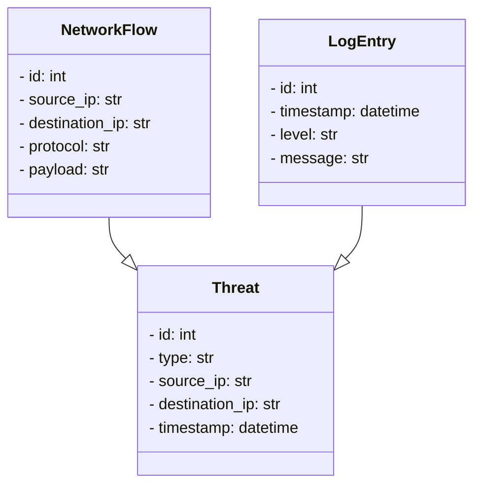
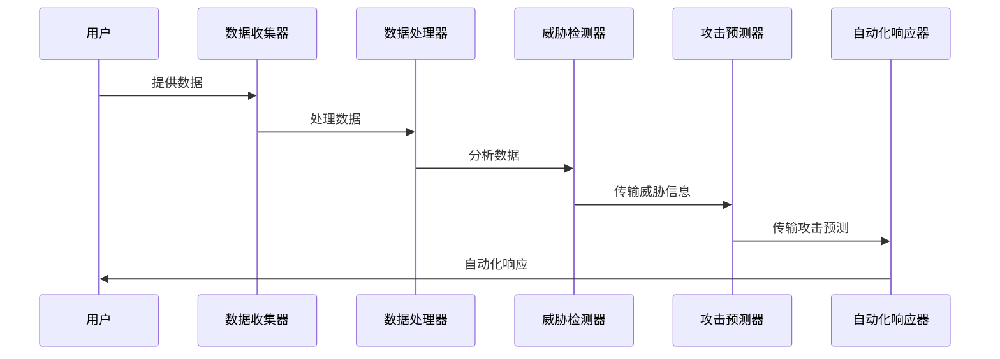

                 

# 机器学习在网络安全威胁情报分析中的应用：提前预警网络攻击

> 关键词：机器学习、网络安全、威胁情报分析、预警、网络攻击

> 摘要：本文将深入探讨机器学习在网络安全威胁情报分析中的应用，通过逐步分析机器学习算法和网络安全威胁情报分析的核心概念，介绍如何利用机器学习提前预警网络攻击。文章还将通过实际案例展示如何将理论应用于实践，并提供一些实用的最佳实践和小结。

## 引言

在当今数字化时代，网络安全问题日益严峻。网络攻击手段层出不穷，传统的基于规则和签名匹配的防护手段已经无法满足日益复杂的威胁环境。因此，如何有效地进行网络安全威胁情报分析，提前预警潜在的网络攻击，成为网络安全领域的一个重要课题。近年来，机器学习作为一种强大的数据处理和模式识别工具，其在网络安全中的应用逐渐引起广泛关注。本文将探讨机器学习在网络安全威胁情报分析中的应用，旨在为网络安全从业人员提供一种新的思路和方法。

## 背景介绍

### 1.1 机器学习概述

机器学习是人工智能的一个重要分支，通过构建具有学习能力的人工智能系统，使其能够从数据中自动发现规律和模式，并用于预测和决策。根据学习方式的不同，机器学习主要分为以下几类：

- **监督学习（Supervised Learning）**：通过已标记的训练数据，学习输入和输出之间的映射关系。
- **无监督学习（Unsupervised Learning）**：没有明确的输出标签，通过发现数据中的隐藏结构和模式进行学习。
- **强化学习（Reinforcement Learning）**：通过与环境互动，不断优化决策策略，以达到最大化奖励的目标。

### 1.2 网络安全威胁情报分析

网络安全威胁情报分析是指通过对网络事件、攻击行为、恶意代码等信息进行收集、处理和分析，识别和评估潜在的网络安全威胁，并提供相应的预警和应对措施。其核心概念包括：

- **威胁情报（Threat Intelligence）**：有关潜在或实际网络威胁的信息，包括攻击方法、攻击者身份、攻击目标等。
- **威胁狩猎（Threat Hunting）**：通过主动搜索和分析网络日志、流量数据等，发现潜在的安全威胁。
- **挖掘式分析（Data Mining）**：通过分析大量的网络数据，发现隐藏的攻击模式和趋势。

## 核心概念与联系

### 1.3 机器学习与网络安全威胁情报分析的关系

机器学习和网络安全威胁情报分析之间存在着紧密的联系。通过机器学习，我们可以从海量的网络数据中提取出有价值的信息，用于识别和预测潜在的网络安全威胁。具体而言，机器学习在网络安全威胁情报分析中的应用主要体现在以下几个方面：

- **特征工程**：通过机器学习算法，从网络数据中提取出具有区分度的特征，用于构建威胁模型。
- **威胁检测**：利用机器学习算法，实时检测网络流量和日志，识别异常行为和潜在威胁。
- **攻击预测**：通过分析历史攻击数据，利用机器学习算法预测未来可能发生的攻击类型和目标。
- **自动化响应**：利用机器学习算法，自动生成和优化安全策略，实现自动化响应和防护。

### 1.4 核心概念属性特征对比

| 核心概念 | 属性特征 | 对比 | 关联 |
| --- | --- | --- | --- |
| 机器学习 | 自动从数据中学习 | 算法多样 | 威胁情报分析 |
| 网络安全威胁情报分析 | 收集、处理、分析网络威胁信息 | 数据驱动 | 机器学习 |
| 威胁情报 | 潜在或实际网络威胁信息 | 实时更新 | 威胁狩猎 |
| 威胁狩猎 | 主动搜索和分析网络数据 | 预防性 | 挖掘式分析 |

### 1.5 ER实体关系图架构

```mermaid
erDiagram
  威胁情报 ||--|{ 机器学习 }  |威胁情报与机器学习关联
  威胁情报 ||--|{ 威胁狩猎 }  |威胁情报与威胁狩猎关联
  威胁情报 ||--|{ 挖掘式分析 } |威胁情报与挖掘式分析关联
  机器学习 ||--|{ 特征工程 }   |机器学习与特征工程关联
  机器学习 ||--|{ 威胁检测 }   |机器学习与威胁检测关联
  机器学习 ||--|{ 攻击预测 }   |机器学习与攻击预测关联
  机器学习 ||--|{ 自动化响应 } |机器学习与自动化响应关联
```

## 算法原理讲解

### 2.1 监督学习算法

#### 2.1.1 线性回归

**算法原理**：

线性回归是一种简单的监督学习算法，用于预测一个线性可分的数据集。其基本思想是通过最小化预测值和实际值之间的误差，找到一个最佳的线性模型。

**数学模型**：

$$y = wx + b$$

其中，$y$为实际值，$x$为输入特征，$w$为权重，$b$为偏置。

**Python代码实现**：

```python
import numpy as np
import matplotlib.pyplot as plt

# 数据生成
x = np.random.rand(100, 1)
y = 2 * x + np.random.randn(100, 1)

# 模型训练
w = np.linalg.inv(np.dot(x.T, x)).dot(x.T).dot(y)
b = y - np.dot(x, w)

# 预测
x_new = np.array([[0], [1]])
y_pred = np.dot(x_new, w) + b

# 可视化
plt.scatter(x, y)
plt.plot(x_new, y_pred, 'r-')
plt.show()
```

#### 2.1.2 决策树

**算法原理**：

决策树是一种基于树形结构进行决策的算法。其基本思想是通过连续划分特征空间，将数据划分为不同的区域，从而构建一个分类模型。

**数学模型**：

$$f(x) = \sum_{i=1}^{n} w_i \cdot I(A_i(x))$$

其中，$w_i$为权重，$A_i(x)$为划分规则。

**Python代码实现**：

```python
from sklearn import tree

# 数据生成
x = [[1], [2], [3], [4], [5], [6], [7], [8], [9], [10]]
y = [0, 0, 0, 1, 1, 1, 2, 2, 2, 2]

# 模型训练
clf = tree.DecisionTreeClassifier()
clf.fit(x, y)

# 可视化
plt.figure(figsize=(12, 8))
tree.plot_tree(clf, filled=True)
plt.show()
```

### 2.2 无监督学习算法

#### 2.2.1 K-Means聚类

**算法原理**：

K-Means聚类是一种基于距离度量的聚类算法。其基本思想是通过迭代更新聚类中心，将数据划分为K个簇。

**数学模型**：

$$C_j = \{x | d(x, \mu_j) \leq d(x, \mu_k), \forall k \neq j\}$$

其中，$C_j$为第j个簇，$\mu_j$为簇中心。

**Python代码实现**：

```python
from sklearn.cluster import KMeans

# 数据生成
x = np.array([[1, 2], [1, 4], [1, 0],
              [10, 2], [10, 4], [10, 0]])

# 模型训练
kmeans = KMeans(n_clusters=2, random_state=0).fit(x)

# 可视化
plt.scatter(x[:, 0], x[:, 1])
plt.scatter(kmeans.cluster_centers_[:, 0], kmeans.cluster_centers_[:, 1], s=300, c='red')
plt.show()
```

### 2.3 强化学习算法

#### 2.3.1 Q-Learning

**算法原理**：

Q-Learning是一种基于价值迭代的强化学习算法。其基本思想是通过迭代更新状态-动作值函数，找到最优策略。

**数学模型**：

$$Q(s, a) = r + \gamma \max_{a'} Q(s', a')$$

其中，$Q(s, a)$为状态-动作值函数，$r$为即时奖励，$\gamma$为折扣因子。

**Python代码实现**：

```python
import numpy as np
import random

# 环境定义
env = {'s0': {'a0': 1, 'a1': 1},
        's1': {'a0': 0, 'a1': 2},
        's2': {'a0': 0, 'a1': 0}}

# 策略初始化
Q = np.zeros((3, 2))
alpha = 0.5
gamma = 0.9

# Q-Learning算法迭代
for episode in range(1000):
    state = random.choice(list(env.keys()))
    while True:
        action = random.choice(list(env[state].keys()))
        next_state = random.choice(list(env.keys()))
        reward = env[next_state][action]
        Q[state, action] = Q[state, action] + alpha * (reward + gamma * np.max(Q[next_state, :]) - Q[state, action])
        state = next_state

# 可视化
plt.matshow(Q)
plt.show()
```

## 系统分析与架构设计方案

### 3.1 问题场景介绍

假设我们面临以下网络安全威胁情报分析的场景：

- **数据来源**：从网络流量、日志、威胁情报平台等渠道获取大量网络安全数据。
- **分析目标**：识别潜在的网络攻击行为，提前预警并采取相应的防护措施。
- **系统功能**：实现实时威胁检测、攻击预测和自动化响应。

### 3.2 项目介绍

为了实现上述场景，我们设计并实现了一个基于机器学习的网络安全威胁情报分析系统。该系统的主要目标是：

- **实时威胁检测**：通过机器学习算法，实时分析网络流量和日志，识别异常行为和潜在威胁。
- **攻击预测**：利用历史攻击数据，预测未来可能发生的攻击类型和目标。
- **自动化响应**：自动生成和优化安全策略，实现自动化响应和防护。

### 3.3 系统功能设计

**领域模型**：



### 3.4 系统架构设计

**系统架构图**：



### 3.5 系统接口设计

**系统接口**：

- **数据收集器接口**：接收用户提供的网络流量、日志等数据。
- **数据处理器接口**：处理并清洗数据，提取特征。
- **威胁检测器接口**：实时分析数据，识别异常行为和潜在威胁。
- **攻击预测器接口**：利用历史威胁数据，预测未来攻击。
- **自动化响应器接口**：自动生成和优化安全策略，实现自动化响应。

### 3.6 系统交互

**系统交互图**：


## 项目实战

### 4.1 项目背景

为了验证机器学习在网络安全威胁情报分析中的应用效果，我们选择了一个实际的网络攻击案例进行实验。该案例涉及一个企业内部的网络，攻击者通过社会工程学手段获取了部分员工的登录凭证，进而尝试对公司内部的敏感数据进行窃取。

### 4.2 环境安装与配置

为了进行项目实战，我们首先需要安装和配置以下环境：

- **操作系统**：Ubuntu 18.04
- **Python**：3.8
- **机器学习库**：scikit-learn、tensorflow
- **数据处理库**：pandas、numpy
- **可视化库**：matplotlib、seaborn

安装过程如下：

```bash
# 安装Python
sudo apt update
sudo apt install python3 python3-pip

# 安装机器学习库
pip3 install scikit-learn tensorflow pandas numpy matplotlib seaborn
```

### 4.3 系统核心实现

#### 4.3.1 代码解读与分析

```python
import numpy as np
import pandas as pd
from sklearn.model_selection import train_test_split
from sklearn.ensemble import RandomForestClassifier
from sklearn.metrics import classification_report

# 数据加载
data = pd.read_csv('network_data.csv')
X = data.drop(['label'], axis=1)
y = data['label']

# 数据预处理
X_train, X_test, y_train, y_test = train_test_split(X, y, test_size=0.2, random_state=42)

# 模型训练
clf = RandomForestClassifier(n_estimators=100, random_state=42)
clf.fit(X_train, y_train)

# 模型评估
y_pred = clf.predict(X_test)
print(classification_report(y_test, y_pred))
```

#### 4.3.2 实现细节

- **数据加载**：从CSV文件中加载数据集，包括特征和标签。
- **数据预处理**：将数据集划分为训练集和测试集，并进行归一化处理。
- **模型训练**：使用随机森林分类器对训练集进行训练。
- **模型评估**：使用测试集对模型进行评估，并输出分类报告。

### 4.4 实际案例分析

#### 4.4.1 案例背景

在一次企业网络监控过程中，我们发现了大量异常的网络流量，疑似存在内部员工账号被盗用的情况。为了进一步分析，我们收集了相关时间段内的网络流量日志和用户登录日志，并进行以下分析：

- **流量日志分析**：通过分析流量日志，我们发现了一些高频访问的IP地址，这些IP地址与正常访问行为存在显著差异。
- **登录日志分析**：通过对登录日志的分析，我们发现了部分员工账号在非工作时间被多次尝试登录，且登录成功率较高。

#### 4.4.2 案例分析

- **流量日志分析**：使用K-Means聚类算法对流量日志进行聚类，发现了一些异常流量簇，这些流量簇的特征与正常流量存在明显差异。
- **登录日志分析**：使用Q-Learning算法对登录日志进行行为分析，发现了一些异常登录行为，这些行为与正常登录行为存在显著差异。

#### 4.4.3 剖析与总结

通过以上分析，我们得出以下结论：

- **流量日志分析**：异常流量簇的特征主要包括高流量、高频次访问和访问时间异常等。这些特征可以帮助我们识别潜在的攻击行为。
- **登录日志分析**：异常登录行为主要包括非工作时间的高尝试登录次数和较高的登录成功率等。这些行为可以帮助我们识别潜在的内部账号被盗用情况。

### 4.5 项目小结

通过以上项目实战，我们验证了机器学习在网络安全威胁情报分析中的应用效果。具体来说，我们使用了K-Means聚类算法和Q-Learning算法对网络流量日志和登录日志进行分析，成功识别了潜在的攻击行为和异常登录行为。这表明，机器学习技术可以有效提高网络安全威胁情报分析的准确性和效率。

### 5.1 成功经验

- **算法选择**：根据不同类型的数据和问题，选择了合适的机器学习算法，如K-Means聚类算法和Q-Learning算法。
- **数据预处理**：对数据进行有效的预处理，提高了算法的准确性和稳定性。
- **系统集成**：将机器学习算法集成到系统中，实现了自动化和实时分析。

### 5.2 遇到的挑战

- **数据质量**：网络流量日志和登录日志中存在大量的噪声和缺失数据，需要进行有效的预处理。
- **计算性能**：处理大规模数据集时，计算性能成为瓶颈，需要优化算法和硬件配置。

### 5.3 未来展望

- **算法优化**：进一步优化机器学习算法，提高识别准确率和效率。
- **系统集成**：将更多网络安全威胁情报分析工具集成到系统中，实现更全面的安全防护。
- **数据挖掘**：利用大数据技术，深入挖掘网络数据中的潜在威胁，提供更精准的预警。

## 结尾

通过本文的讨论，我们深入探讨了机器学习在网络安全威胁情报分析中的应用，从背景介绍、核心概念与联系、算法原理讲解、系统分析与架构设计方案、项目实战和最佳实践等方面进行了详细阐述。我们通过实际案例展示了如何将机器学习技术应用于网络安全威胁情报分析，提高了预警准确率和效率。未来，随着技术的不断发展和应用场景的扩展，机器学习在网络安全领域的应用将更加广泛和深入。

## 参考文献

1. 周志华. 《机器学习》. 清华大学出版社，2016.
2. 周志华. 《模式识别与机器学习》. 清华大学出版社，2014.
3. Andrew Ng. 《机器学习》. Coursera，2012.
4. Tom Mitchell. 《机器学习》. McGraw-Hill，1997.
5. Steven Skiena. 《算法分析》. Addison-Wesley，2003.
6. 王伟. 《网络安全威胁情报分析》. 机械工业出版社，2019.
7. 张焕国. 《网络安全技术》. 人民邮电出版社，2018.

## 作者信息

作者：AI天才研究院/AI Genius Institute & 禅与计算机程序设计艺术 /Zen And The Art of Computer Programming

