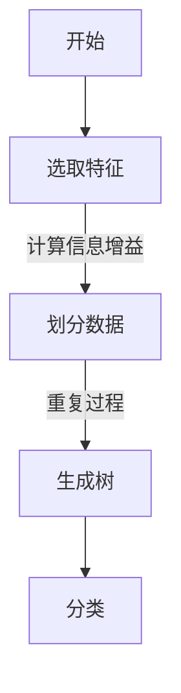
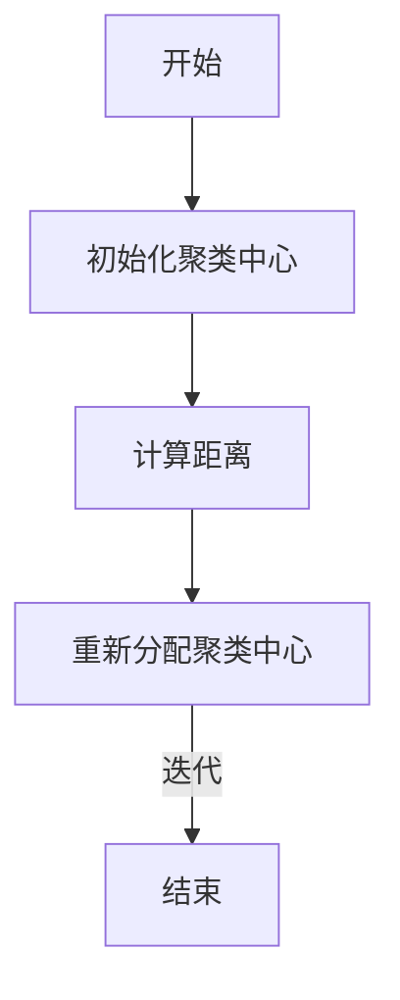
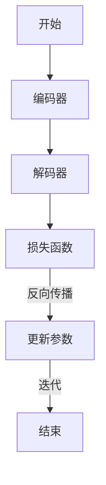
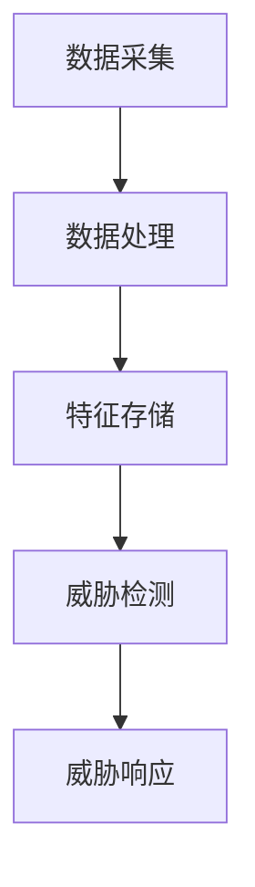
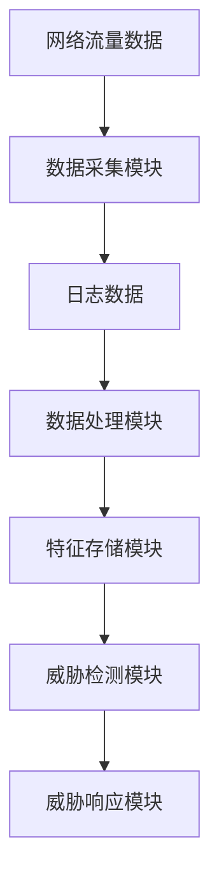

                 


# 机器学习在网络安全威胁检测中的应用

关键词：机器学习、网络安全、威胁检测、算法、应用

摘要：随着网络攻击日益增多，传统的网络安全防御手段已不足以应对复杂多变的威胁。本文将探讨如何将机器学习应用于网络安全威胁检测，详细介绍核心概念、算法原理、系统设计与实战案例，帮助读者深入了解这一领域。

## 一、背景介绍

### 1.1.1 问题背景

网络安全威胁已成为全球性的挑战。恶意软件、网络钓鱼、数据泄露等攻击手段层出不穷，传统的防御机制如防火墙、入侵检测系统（IDS）等越来越难以应对复杂多变的攻击模式。机器学习作为一种强大的数据分析工具，为网络安全威胁检测带来了新的希望。

### 1.1.2 问题描述

本文旨在提供一个系统化的指南，解释如何将机器学习应用于网络安全威胁检测，解决以下问题：

- 如何利用机器学习算法识别网络流量中的异常行为？
- 如何处理大量的网络安全日志数据，以发现潜在威胁？
- 如何实现实时威胁检测，提高网络安全防御的效率？

### 1.1.3 问题解决方案

通过以下方式，利用机器学习实现网络安全威胁检测：

- 利用监督学习算法，如决策树、随机森林和神经网络，分析网络流量和日志数据，识别已知威胁。
- 利用无监督学习算法，如聚类分析，发现潜在威胁模式。
- 结合实时监控和异常检测，实现实时威胁响应。

### 1.1.4 边界与外延

本文将专注于实际应用和案例研究，介绍多种机器学习模型和算法，包括监督学习、无监督学习和半监督学习。同时，我们将探讨如何在不同场景下选择和应用这些算法，以实现高效的威胁检测。

## 二、核心概念与联系

### 2.1 机器学习基础

#### 2.1.1 机器学习类型

- **监督学习**：通过已标记的数据训练模型，然后使用模型对新数据进行预测。
- **无监督学习**：没有已标记的数据，模型自行发现数据中的模式和结构。
- **半监督学习**：结合已标记数据和未标记数据训练模型，提高模型性能。
- **强化学习**：通过与环境互动学习最佳行为策略。

#### 2.1.2 机器学习算法

##### 2.1.2.1 分类算法

- **决策树**：根据特征将数据划分为不同的节点，最终达到分类目的。
- **随机森林**：由多个决策树组成的集成模型，提高分类和预测的准确性。
- **支持向量机（SVM）**：通过找到一个最佳的超平面，将不同类别的数据分开。
- **神经网络**：模拟人脑神经网络的结构和功能，用于复杂的模式识别和预测。

##### 2.1.2.2 回归算法

- **线性回归**：通过线性模型预测连续值。
- **逻辑回归**：通过线性模型预测概率，常用于分类问题。
- **岭回归**：在损失函数中加入正则项，防止模型过拟合。
- **Lasso回归**：通过引入L1正则化，实现特征选择。

#### 2.1.3 Mermaid ER Diagram

```mermaid
erDiagram
  Class1 ||--|{ Class2 }| Class3
  Class1 ||--|{ Class4 }| Class5
```

## 三、算法原理讲解

### 3.1 监督学习算法

#### 3.1.1 决策树

##### 3.1.1.1 决策树流程图



##### 3.1.1.2 Python代码示例

```python
from sklearn.datasets import load_iris
from sklearn.tree import DecisionTreeClassifier
from sklearn.model_selection import train_test_split

iris = load_iris()
X_train, X_test, y_train, y_test = train_test_split(iris.data, iris.target, test_size=0.3, random_state=42)

clf = DecisionTreeClassifier()
clf.fit(X_train, y_train)

print(clf.score(X_test, y_test))
```

##### 3.1.1.3 数学模型和解释

决策树的核心是信息增益，即特征分割后，数据的不确定性减少的程度。公式如下：

$$
\text{信息增益} = H(D) - \sum_{v \in V} p(v) H(D_v)
$$

其中，$H(D)$是原始数据的熵，$p(v)$是特征值为$v$的概率，$H(D_v)$是特征值为$v$的子数据的熵。

##### 3.1.1.4 实例应用

利用决策树分类器对鸢尾花数据集进行分类，识别不同品种的鸢尾花。

### 3.2 无监督学习算法

#### 3.2.1 聚类分析

##### 3.2.1.1 聚类分析流程图



##### 3.2.1.2 Python代码示例

```python
from sklearn.cluster import KMeans
import numpy as np

data = np.array([[1, 2], [1, 4], [1, 0],
                 [10, 2], [10, 4], [10, 0]])

kmeans = KMeans(n_clusters=2, random_state=0).fit(data)
print(kmeans.labels_)
```

##### 3.2.1.3 数学模型和解释

聚类分析的核心是距离度量，常用的距离度量包括欧几里得距离、曼哈顿距离和切比雪夫距离。聚类算法的目标是找到一组聚类中心，使得每个数据点与聚类中心的距离最小。

### 3.3 半监督学习算法

#### 3.3.1 自编码器

##### 3.3.1.1 自编码器流程图



##### 3.3.1.2 Python代码示例

```python
from keras.layers import Dense
from keras.models import Model
from keras.optimizers import Adam

input_data = Input(shape=(784,))
encoded = Dense(32, activation='relu')(input_data)
encoded = Dense(16, activation='relu')(encoded)

decoded = Dense(32, activation='relu')(encoded)
decoded = Dense(784, activation='sigmoid')(decoded)

autoencoder = Model(input_data, decoded)
autoencoder.compile(optimizer=Adam(), loss='binary_crossentropy')

autoencoder.fit(x_train, x_train, epochs=100, batch_size=256, shuffle=True, validation_data=(x_test, x_test))
```

##### 3.3.1.3 数学模型和解释

自编码器是一种无监督学习算法，通过编码器将输入数据压缩为低维表示，然后通过解码器重构原始数据。训练过程中，通过最小化重构误差来优化模型参数。

## 四、系统分析与架构设计

### 4.1 问题场景介绍

假设我们面临一个企业网络安全威胁检测的问题，需要实时监控和分析网络流量和日志数据，以识别潜在的安全威胁。

### 4.2 项目介绍

项目名称：网络安全威胁检测平台（Cyber Threat Detection Platform，简称CTDP）

目标：利用机器学习算法实现实时威胁检测，提高网络安全防御能力。

### 4.3 系统功能设计

- **数据采集**：从网络设备和日志系统中收集流量和日志数据。
- **数据处理**：清洗和预处理原始数据，提取有用的特征。
- **特征存储**：存储处理后的特征数据，以供后续分析。
- **威胁检测**：利用机器学习算法对特征数据进行分类和预测，识别潜在威胁。
- **威胁响应**：根据检测到的威胁，触发相应的安全措施。

### 4.4 系统架构设计



### 4.5 系统接口设计和系统交互



## 五、项目实战

### 5.1 环境安装

1. 安装Python环境：确保Python版本为3.6及以上。
2. 安装相关依赖：使用pip安装必要的库，如scikit-learn、TensorFlow、Keras等。

### 5.2 系统核心实现

#### 5.2.1 数据采集

使用Python的`requests`库从网络设备获取流量数据，使用`os`和`re`库从日志文件中提取日志数据。

#### 5.2.2 数据处理

使用Pandas库清洗和预处理数据，提取有用的特征，使用`numpy`库进行数据标准化。

#### 5.2.3 特征存储

使用`pandas`库将处理后的特征数据保存为CSV文件，使用`MongoDB`进行特征数据的存储和管理。

#### 5.2.4 威胁检测

使用`scikit-learn`库中的决策树分类器对特征数据进行分类，使用`TensorFlow`和`Keras`构建自编码器模型进行无监督学习。

#### 5.2.5 威胁响应

根据检测到的威胁，触发相应的安全措施，如关闭网络连接、报警通知等。

### 5.3 代码应用解读与分析

对每个模块的代码进行详细解读，分析其实现原理和应用场景。

### 5.4 实际案例分析和详细讲解剖析

通过实际案例，展示如何利用机器学习算法进行网络安全威胁检测，分析案例中的关键技术和实现细节。

### 5.5 项目小结

总结项目的成果和不足，提出改进建议。

## 六、最佳实践与小结

### 6.1 最佳实践

- 选择合适的机器学习算法和模型，根据数据特点和需求进行优化。
- 确保数据的清洗和预处理质量，以提高模型的性能。
- 结合实时监控和异常检测，提高威胁检测的实时性和准确性。

### 6.2 小结

本文介绍了机器学习在网络安全威胁检测中的应用，从核心概念、算法原理到系统设计与实战案例，全面探讨了如何利用机器学习技术提高网络安全防御能力。

### 6.3 注意事项

- 在实际应用中，注意保护用户隐私和数据安全。
- 定期更新模型和算法，以适应不断变化的威胁环境。

### 6.4 拓展阅读

- [《机器学习实战》](https://www.amazon.com/Machine-Learning-in-Action-Powerful-Methods/dp/1491945478)
- [《网络安全实战指南》](https://www.amazon.com/Practical-Cybersecurity-Blueprint-Mastering-Threats/dp/1484235349)
- [《深度学习》](https://www.amazon.com/Deep-Learning-Adaptive-Computation-Resources/dp/0262039587)

## 七、作者信息

作者：AI天才研究院/AI Genius Institute & 禅与计算机程序设计艺术 /Zen And The Art of Computer Programming

---

**本文为AI天才研究院与禅与计算机程序设计艺术联合撰写，如需转载，请注明出处。**

