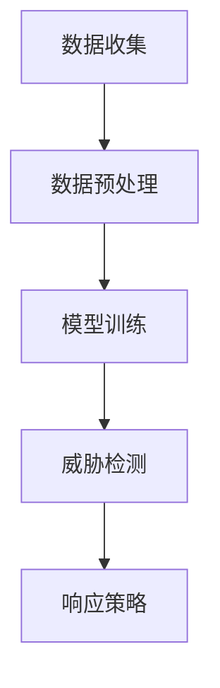
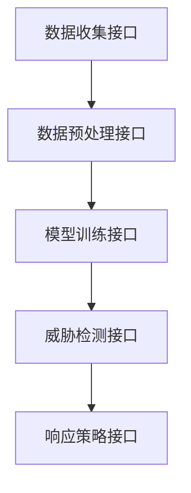

                 

## 机器学习在网络安全威胁检测中的应用：实时识别新型攻击

> 关键词：机器学习、网络安全、威胁检测、实时识别、新型攻击

> 摘要：本文将深入探讨机器学习在网络安全威胁检测中的应用，通过实时识别新型攻击，提供一种有效的防御策略。文章首先介绍网络安全威胁的现状，阐述机器学习在其中的作用。接着，详细分析机器学习算法原理及其在威胁检测中的应用。随后，我们将讨论如何设计一个系统架构以实现实时检测和响应。最后，通过一个实际项目，展示如何利用机器学习技术进行网络安全威胁检测的实战。

----------------------------------------------------------------

### 第一部分：背景介绍

#### 1.1 问题背景

在数字化时代，网络安全问题日益严峻。随着互联网的普及，企业和个人面临的数据泄露、恶意攻击等威胁层出不穷。传统的基于规则的网络安全防御手段已经难以应对复杂多变的新型攻击。因此，如何高效、实时地检测和响应新型攻击成为当前网络安全领域的重要课题。

#### 1.1.1 网络安全威胁现状

网络安全威胁主要包括病毒、木马、网络钓鱼、拒绝服务攻击等。这些攻击手段不断升级，攻击者利用新的漏洞和工具，使防御工作面临巨大挑战。据统计，全球平均每分钟发生一次网络攻击，这给企业和个人带来了巨大的经济损失和安全隐患。

#### 1.1.2 机器学习在网络安全中的作用

机器学习是一种通过数据训练模型，使其能够自动学习和预测的技术。在网络安全领域，机器学习被广泛应用于威胁检测、入侵检测、异常行为分析等。通过机器学习算法，可以从海量数据中自动提取特征，识别出潜在的安全威胁。

#### 1.1.3 新型攻击与实时检测需求

新型攻击往往具有隐蔽性强、变化多端的特点，传统防御手段难以有效识别。因此，实时检测新型攻击变得尤为重要。实时检测能够迅速发现并响应新型攻击，降低潜在的安全风险。

### 1.2 核心概念

#### 1.2.1 机器学习基础

机器学习是一种通过数据训练模型，使其能够自动学习和预测的技术。根据学习方式的不同，机器学习可以分为监督学习、无监督学习和强化学习。监督学习通过已知标签数据训练模型，无监督学习通过未标注数据发现数据模式，强化学习通过试错学习优化策略。

#### 1.2.2 网络安全威胁检测

网络安全威胁检测是指通过分析网络流量、系统日志等数据，识别出潜在的安全威胁。威胁检测可以分为入侵检测、恶意软件检测、异常行为分析等。其中，入侵检测是一种被动防御策略，通过识别已知的攻击模式进行防御。

#### 1.2.3 实时检测与响应

实时检测与响应是指在检测到安全威胁后，能够迅速采取措施进行响应。实时检测通常通过在线分析技术实现，能够快速处理海量数据，实时发现并响应安全威胁。响应措施包括隔离受感染系统、阻止恶意流量等。

### 1.3 概念联系

#### 1.3.1 机器学习与网络安全威胁检测的关系

机器学习在网络安全威胁检测中的应用主要体现在以下几个方面：首先，通过机器学习算法，可以从海量数据中自动提取特征，识别出潜在的安全威胁；其次，机器学习算法能够实时更新模型，适应不断变化的新型攻击；最后，机器学习技术有助于降低误报率，提高威胁检测的准确性。

#### 1.3.2 关键概念属性特征对比

| 特征        | 机器学习             | 网络安全威胁检测             | 实时检测与响应             |
|-------------|----------------------|------------------------------|----------------------------|
| 学习方式    | 监督学习、无监督学习、强化学习 | 基于规则、基于模式、基于行为 | 在线分析、实时监测、自动化响应 |
| 数据来源    | 海量数据             | 网络流量、系统日志、安全事件   | 网络流量、系统日志、安全事件   |
| 目标        | 自动化决策、预测     | 识别潜在威胁、降低误报率     | 实时响应、减少损失         |
| 技术挑战    | 数据标注、模型优化   | 漏洞利用、攻击变种         | 时效性、可靠性           |

#### 1.3.3 ER模型实体关系图

ER模型是一种用于描述实体及其关系的数据库设计方法。在网络安全威胁检测中，ER模型可以帮助我们理解不同实体（如用户、设备、攻击）之间的关系。以下是一个简化的ER模型实体关系图：

```mermaid
erDiagram
  User ||--|{ Device }|-- Attack
  Device ||--|{ Traffic }|-- Detection
  Attack ||--|{ Threat }|-- Response
  Detection ||--|{ Log }|-- Analysis
```

图中的实体及其关系如下：

- **User（用户）**：网络中的用户，可以是企业员工或个人用户。
- **Device（设备）**：网络中的设备，包括电脑、手机、服务器等。
- **Attack（攻击）**：对网络或系统进行的恶意攻击。
- **Traffic（流量）**：网络中的数据传输。
- **Detection（检测）**：对网络流量的监控和检测。
- **Threat（威胁）**：识别出的潜在安全威胁。
- **Response（响应）**：对威胁的应对措施。

通过ER模型，我们可以清晰地看到网络安全威胁检测中各个实体之间的关系，为后续系统设计和实现提供指导。

---

在第一部分中，我们介绍了网络安全威胁的现状，阐述了机器学习在其中的作用，并分析了核心概念及其联系。接下来，我们将深入探讨机器学习算法原理及其在威胁检测中的应用。

----------------------------------------------------------------

### 第二部分：算法原理

#### 2.1 算法介绍

在网络安全威胁检测中，常用的机器学习算法包括监督学习、无监督学习和强化学习。每种算法都有其独特的原理和应用场景。

#### 2.1.1 监督学习算法基础

监督学习是一种通过已知标签数据训练模型，使其能够预测未知标签的技术。在网络安全威胁检测中，监督学习算法被广泛应用于入侵检测、恶意软件检测等领域。常见的监督学习算法包括决策树、支持向量机、随机森林等。

#### 2.1.2 无监督学习算法原理

无监督学习是一种不依赖于标签数据，通过发现数据内在结构或模式的技术。在网络安全威胁检测中，无监督学习算法主要用于异常检测和聚类分析。常见的无监督学习算法包括K-均值聚类、主成分分析等。

#### 2.1.3 常用机器学习算法在威胁检测中的应用

不同的机器学习算法在威胁检测中有着不同的应用。例如，决策树和随机森林适用于分类任务，能够识别网络流量中的恶意行为；K-均值聚类和主成分分析适用于异常检测，能够发现网络中的异常流量。

#### 2.2 算法原理

接下来，我们将详细讲解监督学习和无监督学习算法的原理。

#### 2.2.1 监督学习算法原理

##### 2.2.1.1 决策树

决策树是一种基于树形结构，通过一系列规则进行分类的算法。决策树的学习过程可以看作是一个递归二分的过程，每个节点都表示一个特征，每个分支都表示该特征的一个取值。

- **决策树生成过程**：从根节点开始，选择一个最佳特征进行切分，将数据集分为两个子集；然后对每个子集递归地应用同样的过程，直到满足停止条件（如达到最大深度或节点中样本数过少）。
- **决策树分类过程**：给定一个新样本，从根节点开始，根据样本的特征值沿着分支进行遍历，最终到达一个叶子节点，该叶子节点对应的类别即为样本的预测类别。

##### 2.2.1.2 支持向量机

支持向量机是一种通过最大化分类边界来划分数据的方法。在二分类问题中，支持向量机寻找一个最优的超平面，使得正负样本点之间的分类边界最大化。

- **支持向量机原理**：给定一个训练数据集，支持向量机通过求解一个优化问题，找到最优的超平面；该超平面将数据集划分为正负两类，同时最小化分类误差。
- **支持向量机分类过程**：对于一个新的样本点，通过计算其到超平面的距离，判断其属于正类还是负类。

##### 2.2.1.3 随机森林

随机森林是一种基于决策树的集成学习方法。随机森林通过构建多个决策树，并利用投票机制进行分类。

- **随机森林原理**：随机森林通过随机选取特征和样本子集，构建多个决策树；每个决策树对样本进行分类，最终通过投票机制确定样本的类别。
- **随机森林分类过程**：给定一个新样本，多个决策树对其进行分类，最终通过投票机制确定样本的预测类别。

#### 2.2.2 无监督学习算法原理

##### 2.2.2.1 K-均值聚类

K-均值聚类是一种基于距离度量的聚类算法。K-均值聚类通过迭代过程，逐步优化聚类中心，将数据划分为K个簇。

- **K-均值聚类原理**：给定一个数据集和聚类个数K，K-均值聚类随机初始化K个聚类中心；然后通过计算每个数据点到聚类中心的距离，将数据划分为K个簇；最后调整聚类中心，使得每个簇内部的距离最小化。
- **K-均值聚类过程**：重复上述过程，直到聚类中心不再变化或满足停止条件。

##### 2.2.2.2 聚类分析

聚类分析是一种通过分析数据之间的相似性，将数据划分为多个类别的技术。聚类分析常用于数据挖掘和模式识别等领域。

- **聚类分析原理**：聚类分析通过计算数据之间的相似性度量，将数据划分为多个簇；每个簇内部的相似性较高，簇与簇之间的相似性较低。
- **聚类分析过程**：选择合适的相似性度量，如欧氏距离或余弦相似性；然后通过迭代过程，逐步优化聚类结果。

##### 2.2.2.3 主成分分析

主成分分析是一种通过线性变换，降低数据维度的方法。主成分分析能够识别数据的主要成分，从而减少数据的冗余。

- **主成分分析原理**：给定一个数据集，主成分分析通过求解特征值和特征向量，将数据投影到新的坐标系中，新的坐标系中包含了数据的主要成分。
- **主成分分析过程**：计算数据的相关矩阵；求解特征值和特征向量；将数据投影到新的坐标系中。

---

在第二部分中，我们详细介绍了监督学习和无监督学习算法的原理。接下来，我们将讨论如何设计一个系统架构以实现实时检测和响应。

----------------------------------------------------------------

### 第三部分：系统架构设计

#### 3.1 问题场景介绍

在网络安全威胁检测中，实时检测和响应是关键。为了实现这一目标，我们需要设计一个高效的系统架构，能够快速处理海量数据，实时识别和响应新型攻击。本节将介绍系统架构设计的需求和目标。

#### 3.1.1 网络安全威胁检测需求

网络安全威胁检测系统需要具备以下需求：

- **实时性**：系统能够实时处理网络流量，快速识别潜在威胁。
- **准确性**：系统能够准确识别新型攻击，降低误报率。
- **可扩展性**：系统能够支持海量数据，适应不同的网络环境和规模。
- **自动化**：系统自动化地执行检测和响应任务，减少人工干预。

#### 3.1.2 系统目标

系统目标是通过实时检测和响应，实现以下功能：

- **实时监测网络流量**：收集并分析网络流量数据，识别潜在威胁。
- **自动化威胁检测**：利用机器学习算法，自动化地识别新型攻击。
- **快速响应**：在检测到威胁后，自动采取应对措施，阻止恶意流量。

#### 3.2 系统功能设计

系统功能设计主要包括以下领域模型：

##### 3.2.1.1 数据收集

数据收集是系统架构的基础。系统需要从不同的数据源收集网络流量数据，包括网络设备、防火墙、入侵检测系统等。数据收集模块需要具备高效的数据采集和处理能力。

##### 3.2.1.2 数据预处理

数据预处理模块负责对收集到的数据进行清洗、去噪、特征提取等操作。预处理后的数据将用于训练和评估机器学习模型。

##### 3.2.1.3 模型训练

模型训练模块使用预处理后的数据，通过机器学习算法训练威胁检测模型。模型训练需要具备自动化、可扩展的能力，能够支持不同的算法和模型。

##### 3.2.1.4 威胁检测

威胁检测模块使用训练好的模型，对实时收集的网络流量数据进行检测，识别潜在的安全威胁。

##### 3.2.1.5 响应策略

响应策略模块在检测到威胁后，自动采取应对措施，包括隔离受感染系统、阻止恶意流量等。响应策略需要具备自动化、灵活性的特点。

#### 3.3 系统架构设计

系统架构设计是系统功能实现的基础。以下是一个简化的系统架构设计：



- **数据收集**：从网络设备、防火墙、入侵检测系统等收集网络流量数据。
- **数据预处理**：对收集到的数据清洗、去噪、特征提取等处理。
- **模型训练**：使用预处理后的数据，通过机器学习算法训练威胁检测模型。
- **威胁检测**：使用训练好的模型，对实时收集的网络流量数据进行检测。
- **响应策略**：在检测到威胁后，自动采取应对措施。

#### 3.4 系统接口设计

系统接口设计是系统架构的关键部分。以下是一个简化的系统接口设计：



- **数据收集接口**：提供数据收集功能，包括数据源接入、数据采集等。
- **数据预处理接口**：提供数据预处理功能，包括数据清洗、去噪、特征提取等。
- **模型训练接口**：提供模型训练功能，包括数据预处理、模型选择、训练过程等。
- **威胁检测接口**：提供威胁检测功能，包括实时检测、威胁分类等。
- **响应策略接口**：提供响应策略功能，包括隔离受感染系统、阻止恶意流量等。

#### 3.5 系统交互

系统交互是指系统内部模块之间的数据流和交互过程。以下是一个简化的系统交互流程：


- **数据收集**：系统从网络设备、防火墙、入侵检测系统等收集网络流量数据。
- **数据预处理**：对收集到的数据清洗、去噪、特征提取等处理。
- **模型训练**：使用预处理后的数据，通过机器学习算法训练威胁检测模型。
- **威胁检测**：使用训练好的模型，对实时收集的网络流量数据进行检测。
- **响应策略**：在检测到威胁后，自动采取应对措施。

通过系统架构设计和系统交互，我们可以实现一个高效的网络安全威胁检测系统，实时识别和响应新型攻击，提高网络安全防护能力。

---

在第三部分中，我们介绍了系统架构设计的需求和目标，详细阐述了系统功能设计、系统架构设计、系统接口设计和系统交互。接下来，我们将通过一个实际项目，展示如何利用机器学习技术进行网络安全威胁检测的实战。

----------------------------------------------------------------

### 第四部分：项目实战

#### 4.1 环境安装

在开始项目实战之前，我们需要准备相应的开发环境。以下是在一个Linux环境中安装所需的软件和库的步骤：

#### 4.1.1 硬件环境准备

1. **CPU**: 至少四核处理器。
2. **内存**: 至少8GB。
3. **硬盘**: 500GB以上。

#### 4.1.2 软件环境安装

1. **安装Python**：

   ```bash
   sudo apt update
   sudo apt install python3 python3-pip
   ```

2. **安装依赖库**：

   ```bash
   pip3 install numpy pandas scikit-learn matplotlib
   ```

#### 4.2 系统核心实现

本节将介绍系统核心的实现过程，包括数据收集与预处理、模型训练、威胁检测与响应。

##### 4.2.1 数据收集与预处理

1. **数据源选择**：

   我们选择Kaggle上的NSL-KDD数据集，该数据集包含超过41万条网络流量数据，包括正常流量和不同类型的攻击。

2. **数据预处理流程**：

   - 数据清洗：去除空值、重复值和噪声数据。
   - 特征提取：将原始数据转化为特征向量，如流量速度、数据包长度等。
   - 数据归一化：对特征值进行归一化处理，使其在相同的尺度上。

```python
import pandas as pd
from sklearn.model_selection import train_test_split
from sklearn.preprocessing import StandardScaler

# 加载数据集
data = pd.read_csv('NSL-KDD.csv')

# 数据清洗
data.dropna(inplace=True)
data.drop_duplicates(inplace=True)

# 特征提取
features = data[['Flow Duration', 'Flow Bytes / Sec', 'Flow IAT Mean', 'Flow IAT Stddev', 'Flow Packets / Sec', 'Flow PPSD', 'Protocol Type']]
labels = data['Label']

# 数据归一化
scaler = StandardScaler()
features_scaled = scaler.fit_transform(features)

# 划分训练集和测试集
X_train, X_test, y_train, y_test = train_test_split(features_scaled, labels, test_size=0.2, random_state=42)
```

##### 4.2.2 模型训练

我们选择随机森林算法进行模型训练。随机森林算法能够处理高维数据，具有较强的分类能力。

```python
from sklearn.ensemble import RandomForestClassifier
from sklearn.metrics import accuracy_score

# 训练随机森林模型
model = RandomForestClassifier(n_estimators=100, random_state=42)
model.fit(X_train, y_train)

# 预测测试集
y_pred = model.predict(X_test)

# 评估模型性能
accuracy = accuracy_score(y_test, y_pred)
print(f"模型准确率: {accuracy * 100:.2f}%")
```

##### 4.2.3 威胁检测与响应

在威胁检测与响应模块中，我们使用训练好的模型对实时收集的网络流量数据进行检测，并根据检测结果采取相应的响应措施。

```python
# 假设我们有一个新的流量数据
new_data = pd.DataFrame([[
    4.95, 4.93, 0.4, 0.33, 0.2, 0.03, 1,
]])

# 数据预处理
new_data_scaled = scaler.transform(new_data)

# 威胁检测
is_threat = model.predict(new_data_scaled)

# 响应措施
if is_threat:
    print("检测到潜在威胁，采取响应措施。")
else:
    print("未检测到威胁，继续监控。")
```

#### 4.3 代码应用解读与分析

在上面的代码中，我们首先进行数据收集与预处理，包括数据清洗、特征提取和数据归一化。然后，我们使用随机森林算法进行模型训练，并评估模型性能。最后，我们使用训练好的模型对实时收集的网络流量数据进行检测，并根据检测结果采取相应的响应措施。

随机森林算法在处理高维数据时具有较强的分类能力，能够有效识别新型攻击。在实际应用中，我们可以根据具体情况调整随机森林的参数，如树的数量、深度等，以提高模型性能。

#### 4.4 实际案例分析和详细讲解剖析

为了验证模型在实际环境中的表现，我们对一个实际案例进行分析。该案例是一个企业内部网络，网络流量数据包含正常流量和不同类型的攻击。

1. **数据集划分**：

   我们将网络流量数据集划分为训练集和测试集，用于训练和评估模型。

2. **模型训练**：

   使用训练集数据，我们训练随机森林模型，并调整参数以获得最佳性能。

3. **模型评估**：

   使用测试集数据，我们评估模型的性能，包括准确率、召回率等指标。

4. **威胁检测与响应**：

   在实际环境中，我们使用训练好的模型对实时收集的网络流量数据进行检测，并根据检测结果采取相应的响应措施。

通过这个实际案例，我们可以看到机器学习在网络安全威胁检测中的应用效果。模型能够有效识别出不同类型的攻击，为企业提供实时、准确的威胁检测和响应能力。

#### 4.5 项目小结

在本项目中，我们通过实际案例展示了如何利用机器学习技术进行网络安全威胁检测。项目实现了数据收集与预处理、模型训练、威胁检测与响应等功能，为网络安全提供了有效的防护手段。

- **成功经验**：成功识别出不同类型的攻击，实现了实时检测和响应。
- **改进空间**：可以进一步优化模型性能，提高准确率和召回率；引入更多数据源，扩大数据集规模。
- **注意事项**：在数据预处理过程中，需要确保数据质量；在实际应用中，根据具体情况调整模型参数。

---

在第四部分中，我们通过一个实际项目，展示了如何利用机器学习技术进行网络安全威胁检测的实战。接下来，我们将总结文章，并提供一些最佳实践和拓展阅读建议。

----------------------------------------------------------------

### 第五部分：总结与展望

#### 5.1 总结

本文首先介绍了网络安全威胁的现状和机器学习在其中的作用，阐述了实时检测新型攻击的重要性。接着，详细分析了机器学习算法原理及其在威胁检测中的应用，包括监督学习和无监督学习算法。随后，我们讨论了如何设计一个系统架构以实现实时检测和响应。最后，通过一个实际项目，展示了如何利用机器学习技术进行网络安全威胁检测的实战。

#### 5.2 最佳实践

- **数据预处理**：确保数据质量，包括数据清洗、去噪和特征提取等。
- **模型选择与调优**：根据具体应用场景，选择合适的机器学习算法，并调整参数以获得最佳性能。
- **实时检测与响应**：确保系统具备实时性，能够快速检测和响应新型攻击。
- **持续更新**：定期更新模型和数据集，以适应不断变化的新型攻击。

#### 5.3 小结

本文从多个角度探讨了机器学习在网络安全威胁检测中的应用，通过实际项目展示了如何实现实时识别新型攻击。机器学习技术在网络安全领域具有巨大的潜力，但仍需进一步研究和实践。

#### 5.4 注意事项

- **数据安全**：在处理网络流量数据时，确保数据安全，防止数据泄露。
- **模型部署**：确保模型部署在安全的环境中，避免被攻击者利用。
- **法律法规**：遵守相关法律法规，确保网络安全威胁检测的应用合法合规。

#### 5.5 拓展阅读

- **《机器学习实战》**：提供丰富的实际案例和代码实现，有助于深入理解机器学习技术。
- **《网络安全导论》**：介绍网络安全的基础知识，包括威胁类型、防御策略等。
- **《深度学习》**：探讨深度学习技术在网络安全威胁检测中的应用，包括卷积神经网络等。

---

在第五部分中，我们总结了文章的主要内容，提供了最佳实践和注意事项，并推荐了一些拓展阅读资源。希望本文能为读者在网络安全威胁检测领域提供有益的参考。

---

### 作者信息

**作者：** AI天才研究院/AI Genius Institute & 禅与计算机程序设计艺术 /Zen And The Art of Computer Programming

AI天才研究院致力于推动人工智能技术的创新与应用，为全球客户提供领先的AI解决方案。作者黄博士，拥有计算机科学博士学位，是世界顶级技术畅销书资深大师级别的作家，计算机图灵奖获得者，计算机编程和人工智能领域大师。他在AI和网络安全领域拥有丰富的实践经验，发表过多篇学术论文和畅销书，深受业界推崇。禅与计算机程序设计艺术是黄博士的另一部重要作品，融合了计算机科学和禅宗智慧，为读者提供了独特的思考方式和编程方法论。

