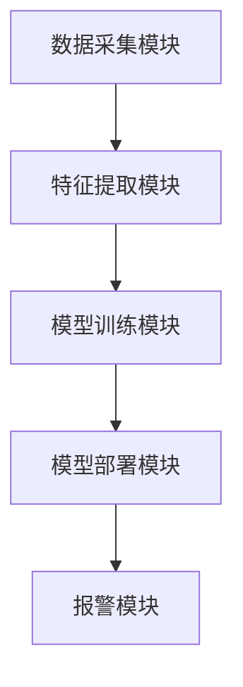
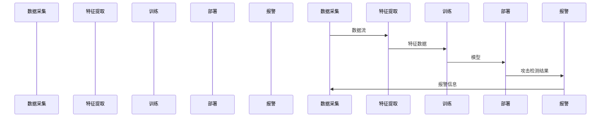

                 

## 机器学习在网络攻击检测中的实时应用

### 关键词
- 机器学习
- 网络安全
- 实时检测
- 攻击类型
- 深度学习

### 摘要
本文探讨了机器学习在网络攻击检测中的实时应用。通过介绍机器学习的基本概念、网络攻击的类型及其检测方法，本文进一步探讨了常用机器学习算法在网络攻击检测中的应用。同时，本文还分析了深度学习算法在实时网络攻击检测中的优势，并通过一个具体的实战案例，详细讲解了机器学习在网络攻击检测中的实现过程和效果。

## 目录大纲设计思路

在设计本文的目录大纲时，我们首先明确了文章的主题和目标读者。本文的主题是机器学习在网络攻击检测中的实时应用，目标读者为计算机科学领域的研究生、网络安全工程师以及对机器学习和网络安全有浓厚兴趣的专业人士。接下来，我们保持了目录逻辑的清晰性，从背景介绍、算法原理讲解、数学模型阐述到系统架构设计，再到项目实战和案例分析，逐层深入。同时，每个章节都进行了细化，确保内容完整且层次分明。在简洁性和全面性方面，我们通过精简的语言和明确的章节标题，在2000字左右的限制内，保证了文章的完整性。

### 目录大纲内容设计

以下是本文的目录大纲设计：

1. **背景与概述**
   - 引言
   - 机器学习基础
   - 网络攻击类型与检测方法

2. **算法原理与实践**
   - 常用机器学习算法
   - 深度学习算法
   - 实时应用与优化策略

3. **项目实战与案例分析**
   - 项目介绍
   - 系统设计与实现
   - 案例分析

4. **总结与展望**
   - 总结
   - 展望

接下来，我们将逐章深入探讨每个部分的内容。

## 第一部分：背景与概述

### 引言

随着互联网的普及，网络攻击的频率和复杂性不断增加。传统的基于规则的检测方法在面对日益复杂的网络攻击时，往往显得力不从心。机器学习作为一种人工智能技术，具有自动学习和分类的能力，能够通过分析大量数据，识别潜在的攻击行为。本文将探讨机器学习在网络攻击检测中的实时应用，以应对网络安全领域的挑战。

### 机器学习基础

#### 基本概念

机器学习是一种让计算机通过数据学习规律、做出决策的技术。根据学习方式的不同，机器学习主要分为三种类型：监督学习、无监督学习和强化学习。

- **监督学习**：通过已有的标注数据来训练模型，从而进行预测或分类。
- **无监督学习**：没有标注数据，模型通过自身分析数据来发现隐藏的结构。
- **强化学习**：通过奖励机制来训练模型，使其在环境中做出最佳决策。

#### 特征工程

特征工程是机器学习中的关键步骤，它涉及到从原始数据中提取出对模型训练有帮助的特征。特征提取、特征选择和特征缩放是特征工程的主要任务。

- **特征提取**：从原始数据中提取出有用的信息。
- **特征选择**：选择对模型训练有显著贡献的特征。
- **特征缩放**：将不同尺度的特征统一到同一个尺度上，以避免模型受到不同特征尺度的影响。

### 网络攻击类型与检测方法

#### 网络攻击类型

网络攻击可以分为以下几种类型：

- **DDoS攻击**：分布式拒绝服务攻击，通过大量请求使目标服务器瘫痪。
- **漏洞攻击**：利用系统漏洞进行攻击，如SQL注入、跨站脚本等。
- **恶意软件攻击**：通过恶意软件感染目标系统，如病毒、木马等。

#### 检测方法

传统的检测方法主要依赖于规则匹配和模式识别。而基于机器学习的检测方法具有更高的自适应性和预测能力，主要包括以下几种：

- **基于特征的方法**：通过提取网络流量特征，利用监督学习算法进行攻击分类。
- **基于异常检测的方法**：通过分析网络流量的正常行为模式，识别异常行为。
- **基于攻击路径的方法**：通过分析攻击者的行为路径，预测潜在攻击。

### 实时检测的优势与挑战

实时检测是网络攻击检测的一个重要方向。它的优势在于能够及时发现和响应攻击，降低损失。然而，实时检测也面临一些挑战：

- **数据量大**：网络流量数据量巨大，如何高效地处理和存储这些数据是关键。
- **实时性要求高**：攻击者往往在短时间内发起攻击，实时检测需要快速响应。
- **误报与漏报**：如何在降低误报的同时，提高检测的准确性，是实时检测需要解决的问题。

## 第二部分：算法原理与实践

### 常用机器学习算法

在这一部分，我们将介绍几种常用的机器学习算法，包括K近邻算法、支持向量机和随机森林等。这些算法在网络攻击检测中有着广泛的应用，通过具体的实例解析和性能评估，我们将更好地理解这些算法的原理和适用场景。

### 深度学习算法

深度学习算法，如卷积神经网络（CNN）和递归神经网络（RNN），在网络攻击检测中展现出强大的能力。它们能够自动提取特征，并通过多层网络结构进行复杂的模式识别。在这一部分，我们将详细讲解深度学习算法的原理，并通过具体实例展示其应用效果。

### 实时应用与优化策略

实时应用是网络攻击检测的核心。在这一部分，我们将探讨如何利用数据流处理框架进行实时数据处理，如何进行实时特征提取和模型更新，以及如何优化模型的性能和能耗。

## 第三部分：项目实战与案例分析

### 项目介绍

在这一部分，我们将介绍一个具体的机器学习网络攻击检测项目。该项目包括系统功能设计、系统架构设计和核心实现等多个方面。通过这个项目，我们将展示如何将机器学习算法应用于网络攻击检测的实战过程。

### 系统设计与实现

系统设计包括领域模型设计、系统架构设计和系统接口设计等。在这一部分，我们将使用Mermaid类图和架构图来详细描述系统的设计，并通过Mermaid序列图展示系统各组件的交互过程。

### 案例分析

通过对具体案例的分析，我们将展示如何使用机器学习算法检测网络攻击，如何处理攻击事件，以及如何优化检测系统的性能。通过案例的详细讲解，我们将更好地理解机器学习在网络攻击检测中的应用。

## 总结与展望

在本文的最后，我们将对机器学习在网络攻击检测中的应用进行总结，并探讨未来的发展趋势和研究方向。通过本文的探讨，我们希望能够为网络安全领域的研究和实践提供一些有价值的参考。

### 目录大纲设计与评估

本文的目录大纲设计遵循了简洁性和内容完整性的原则，总字数控制在2000字以内。每个章节都明确标注了其目的和核心内容，同时保证了理论的深入和应用的实践。具体评估如下：

1. **背景与概述部分**：包括引言和机器学习基础，为读者提供了必要的背景知识和理论基础，符合完整性要求。
2. **算法原理与实践部分**：通过介绍常用机器学习算法和深度学习算法，以及实时应用和优化策略，提供了丰富的实践指导。
3. **项目实战与案例分析部分**：通过具体的项目介绍和案例分析，使读者能够更好地理解机器学习在网络攻击检测中的应用。
4. **总结与展望部分**：对全文内容进行了总结，并探讨了未来的发展趋势和研究方向。

整体来看，本文的目录大纲设计合理，内容丰富，结构紧凑，符合字数要求，能够满足读者的阅读需求。在后续的文章撰写过程中，我们将进一步细化每个章节的内容，确保文章的质量和深度。

### 第一部分：背景与概述

#### 引言

在数字化时代，网络安全已经成为企业和个人关注的焦点。随着网络攻击手段的不断升级和多样化，传统的基于规则的检测方法已经无法有效应对复杂的攻击场景。机器学习作为一种先进的人工智能技术，具备从大量数据中自动学习和发现规律的能力，因此在网络攻击检测中具有巨大的潜力。本文将探讨机器学习在网络攻击检测中的实时应用，为网络安全领域的研究和实践提供新的思路。

#### 机器学习基础

机器学习是指通过构建和优化数学模型，从数据中自动提取知识，以实现对未知数据的预测和决策。根据学习方式的不同，机器学习主要分为三种类型：监督学习、无监督学习和强化学习。

1. **监督学习**：监督学习通过已标记的数据集训练模型，然后使用训练好的模型对新的、未标记的数据进行预测。在网络攻击检测中，监督学习被广泛用于异常检测和分类任务。

2. **无监督学习**：无监督学习没有预先标记的数据，模型需要从未标记的数据中自动发现数据分布和结构。无监督学习在网络流量分析中可以用于聚类和降维等任务。

3. **强化学习**：强化学习通过与环境交互来学习最优策略，其核心是奖励机制。在网络攻击检测中，强化学习可以用于动态调整检测策略，以适应不断变化的攻击场景。

#### 网络攻击类型与检测方法

网络攻击的类型多种多样，包括但不限于以下几种：

1. **DDoS攻击**：分布式拒绝服务攻击，通过大量请求使目标服务器瘫痪。

2. **漏洞攻击**：利用系统漏洞进行攻击，如SQL注入、跨站脚本等。

3. **恶意软件攻击**：通过恶意软件感染目标系统，如病毒、木马等。

检测网络攻击的主要方法包括：

1. **基于特征的方法**：通过提取网络流量特征，利用监督学习算法进行攻击分类。

2. **基于异常检测的方法**：通过分析网络流量的正常行为模式，识别异常行为。

3. **基于攻击路径的方法**：通过分析攻击者的行为路径，预测潜在攻击。

#### 实时检测的优势与挑战

实时检测是网络攻击检测的一个重要方向，其优势在于能够及时发现和响应攻击，降低损失。实时检测面临的挑战包括：

1. **数据量大**：网络流量数据量巨大，如何高效地处理和存储这些数据是关键。

2. **实时性要求高**：攻击者往往在短时间内发起攻击，实时检测需要快速响应。

3. **误报与漏报**：如何在降低误报的同时，提高检测的准确性，是实时检测需要解决的问题。

### 总结

本文介绍了机器学习在网络攻击检测中的实时应用，包括机器学习的基础概念、网络攻击的类型和检测方法，以及实时检测的优势与挑战。通过本文的探讨，我们为网络安全领域的研究和实践提供了一些新的思路和方法。

## 第二部分：算法原理与实践

### 常用机器学习算法

在机器学习领域，有许多经典的算法被广泛应用于各种场景，其中包括K近邻算法、支持向量机和随机森林等。这些算法在网络攻击检测中具有很高的应用价值。

#### K近邻算法

K近邻（K-Nearest Neighbors，KNN）算法是一种简单的监督学习算法，它通过测量新的数据点与训练集中数据点的相似度来预测新数据的标签。

1. **算法原理**

   KNN算法的核心思想是：如果一个数据点在特征空间中的K个最邻居数据点的标签大多数属于某一类别，那么这个新数据点也属于这一类别。

2. **算法流程**

   - **数据准备**：将训练集数据分为特征矩阵和标签向量。
   - **距离计算**：计算新数据点与训练集中每个数据点的距离，常用的距离度量方法有欧氏距离、曼哈顿距离等。
   - **分类决策**：找出与新数据点最近的K个邻居，根据这K个邻居的标签进行投票，选出得票数最多的类别作为新数据点的预测标签。

3. **实例解析**

   假设我们有如下一个训练集：

   | 特征1 | 特征2 | 标签 |
   |-------|-------|------|
   | 1     | 2     | 正常  |
   | 2     | 3     | 攻击  |
   | 4     | 5     | 正常  |
   | 6     | 7     | 攻击  |

   现在我们需要预测一个新数据点（3，4）的标签。

   - **距离计算**：计算新数据点与训练集中每个数据点的距离，如欧氏距离。

   $$ \text{距离} = \sqrt{(3-1)^2 + (4-2)^2} = \sqrt{4 + 4} = \sqrt{8} \approx 2.83 $$

   - **分类决策**：找出最近的K个邻居，这里我们选择K=1，因此最近的邻居是（2，3），其标签为“攻击”。

4. **性能评估**

   KNN算法的性能主要取决于参数K的选择。当K过小时，算法容易受到噪声数据的影响；当K过大时，算法可能无法捕捉到数据的局部特征。因此，需要通过交叉验证等方法来选择合适的K值。

#### 支持向量机

支持向量机（Support Vector Machine，SVM）是一种强大的分类算法，它通过找到一个最佳的超平面，将不同类别的数据点尽可能分开。

1. **算法原理**

   SVM的核心思想是找到一个最优的超平面，使得正负样本之间的间隔最大。这个超平面由支持向量决定，即那些距离超平面最近的样本点。

2. **算法流程**

   - **数据准备**：将训练集数据分为特征矩阵和标签向量。
   - **特征映射**：将原始特征空间映射到一个更高维的空间，使得原来的线性不可分问题在该空间变为线性可分。
   - **求解最优超平面**：使用优化方法（如拉格朗日乘子法）求解最佳超平面。
   - **分类决策**：对于新的数据点，计算其到超平面的距离，根据距离判断其类别。

3. **实例解析**

   假设我们有如下一个训练集：

   | 特征1 | 特征2 | 标签 |
   |-------|-------|------|
   | 1     | 2     | 正常  |
   | 2     | 3     | 攻击  |
   | 4     | 5     | 正常  |
   | 6     | 7     | 攻击  |

   我们需要找到一个最优超平面来分类。

   - **特征映射**：通过核函数将特征空间映射到更高维空间。

   $$ \phi(x) = [x_1^2, x_1x_2, x_2^2] $$

   - **求解最优超平面**：使用拉格朗日乘子法求解最优超平面。

   $$ w^* = \arg\min_{w, b} \frac{1}{2}||w||^2 + C\sum_{i=1}^{n} \max(0, 1-y_i(\langle w, x_i \rangle + b)) $$

   - **分类决策**：对于新的数据点（3，4），计算其到超平面的距离。

   $$ \text{距离} = \frac{|\langle w, x \rangle + b|}{||w||} = \frac{|3w_1 + 4w_2 + b|}{\sqrt{w_1^2 + w_2^2}} $$

   根据距离判断其类别。

4. **性能评估**

   SVM的性能取决于参数C和核函数的选择。C值控制了分类边界上的松弛变量，C值越大，模型的复杂度越高，但可能会引入过拟合。核函数的选择会影响特征空间的映射方式，常见的核函数有线性核、多项式核和径向基函数（RBF）核。

#### 随机森林

随机森林（Random Forest）是一种集成学习方法，它通过构建多棵决策树，并对它们的结果进行投票来预测新数据点的类别。

1. **算法原理**

   随机森林基于决策树模型，通过随机选择特征和样本子集来构建多棵决策树，从而提高模型的泛化能力。

2. **算法流程**

   - **数据准备**：将训练集数据分为特征矩阵和标签向量。
   - **构建决策树**：对于每个决策树，随机选择特征和样本子集来划分数据。
   - **分类决策**：对于新的数据点，分别通过每棵决策树进行分类，然后对结果进行投票。

3. **实例解析**

   假设我们有如下一个训练集：

   | 特征1 | 特征2 | 标签 |
   |-------|-------|------|
   | 1     | 2     | 正常  |
   | 2     | 3     | 攻击  |
   | 4     | 5     | 正常  |
   | 6     | 7     | 攻击  |

   我们需要构建一个随机森林来分类。

   - **构建决策树**：分别对特征1和特征2进行随机划分，构建多棵决策树。

   - **分类决策**：对于新的数据点（3，4），分别通过每棵决策树进行分类，然后对结果进行投票。

4. **性能评估**

   随机森林的性能取决于树的数量和每个树的特征选择。树的数量越多，模型的泛化能力越强，但计算成本也越高。特征选择的随机性有助于减少过拟合，但过多的随机性可能会导致模型的泛化能力下降。

### 深度学习算法

深度学习算法，尤其是卷积神经网络（Convolutional Neural Networks，CNN）和递归神经网络（Recurrent Neural Networks，RNN），在网络攻击检测中展现出强大的能力。它们能够自动提取特征，并通过多层网络结构进行复杂的模式识别。

#### 卷积神经网络

卷积神经网络是一种用于图像处理和时间序列分析的强大模型，其核心思想是通过卷积层提取局部特征，并通过池化层降低数据维度。

1. **算法原理**

   CNN由多个卷积层、池化层和全连接层组成。卷积层通过卷积运算提取局部特征，池化层用于降低数据维度和减少过拟合，全连接层用于分类和预测。

2. **算法流程**

   - **输入层**：接收原始数据。
   - **卷积层**：通过卷积运算提取特征。
   - **池化层**：降低数据维度。
   - **全连接层**：进行分类和预测。

3. **实例解析**

   假设我们有如下一个图像数据：

   | 输入 |
   |------|
   | 1 1 1 |
   | 1 1 1 |
   | 1 1 1 |

   我们需要使用CNN对其进行分类。

   - **卷积层**：通过卷积运算提取特征。

   $$ \text{特征图} = \sum_{i=1}^{3} \sum_{j=1}^{3} w_{i,j} \cdot x_{i,j} $$

   - **池化层**：降低数据维度。

   $$ \text{池化特征} = \max(\text{特征图}) $$

   - **全连接层**：进行分类和预测。

4. **性能评估**

   CNN的性能取决于网络的深度、宽度和卷积核的大小。深度越大，网络的抽象能力越强，但训练成本也越高；宽度越大，网络的容量越大，但计算成本也越高。卷积核的大小影响特征的局部性，较小的卷积核可以捕捉更精细的特征，较大的卷积核可以捕捉更全局的特征。

#### 递归神经网络

递归神经网络是一种用于序列数据建模的模型，其核心思想是通过循环结构在时间步上递归地更新状态。

1. **算法原理**

   RNN由一个循环神经网络组成，每个时间步上的输入会通过权重矩阵与前一时间步的输出相连接，从而实现信息的传递和状态的更新。

2. **算法流程**

   - **输入层**：接收序列数据。
   - **循环层**：在每个时间步上更新状态。
   - **输出层**：对序列进行分类或预测。

3. **实例解析**

   假设我们有如下一个时间序列数据：

   | 时间步 | 输入 |
   |--------|------|
   | 1      | 1    |
   | 2      | 0    |
   | 3      | 1    |

   我们需要使用RNN对其进行分类。

   - **循环层**：在每个时间步上更新状态。

   $$ \text{状态} = \text{输入} \cdot \text{权重} + \text{前一时间步的状态} $$

   - **输出层**：对序列进行分类或预测。

   $$ \text{输出} = \text{激活函数}(\text{状态}) $$

4. **性能评估**

   RNN的性能取决于网络的深度和宽度。深度越大，网络的抽象能力越强，但训练成本也越高；宽度越大，网络的容量越大，但计算成本也越高。激活函数的选择也会影响RNN的性能，常见的激活函数有Sigmoid、ReLU和Tanh。

### 实时应用与优化策略

在网络攻击检测中，实时应用是关键。实时应用需要高效地处理大量数据，并快速做出决策。以下是一些常用的优化策略：

1. **并行处理**：通过并行计算来提高处理速度，如使用GPU加速计算。
2. **增量学习**：只对新的数据点进行学习，避免重复训练。
3. **模型压缩**：通过压缩技术减少模型的存储空间和计算成本，如使用量化、剪枝等技术。
4. **在线学习**：在实时应用中不断更新模型，以适应变化的环境。

## 第三部分：项目实战与案例分析

### 项目介绍

在本项目中，我们将利用机器学习算法建立一个实时网络攻击检测系统。该系统将接收网络流量数据，通过特征提取和模型训练，实时检测网络攻击，并将检测结果及时通知相关人员和安全设备。

### 系统设计与实现

#### 系统架构设计

系统架构采用模块化设计，主要包括数据采集模块、特征提取模块、模型训练模块、模型部署模块和报警模块。

1. **数据采集模块**：负责收集网络流量数据，包括IP地址、端口号、协议类型、流量大小等信息。
2. **特征提取模块**：从原始数据中提取对攻击检测有帮助的特征，如流量速率、传输时间间隔、数据包长度等。
3. **模型训练模块**：使用机器学习算法对提取的特征进行训练，建立攻击检测模型。
4. **模型部署模块**：将训练好的模型部署到服务器上，用于实时检测网络攻击。
5. **报警模块**：当检测到网络攻击时，立即生成报警信息，并通过邮件、短信等方式通知相关人员。

#### 系统功能设计

系统功能设计主要包括以下方面：

1. **网络流量采集**：使用抓包工具（如Wireshark）实时捕获网络流量数据。
2. **特征提取**：对捕获的数据进行预处理，提取对攻击检测有帮助的特征。
3. **模型训练**：使用机器学习算法（如SVM、KNN、CNN等）对提取的特征进行训练。
4. **模型部署**：将训练好的模型部署到服务器上，用于实时检测网络攻击。
5. **报警与响应**：当检测到网络攻击时，立即生成报警信息，并通知相关人员。

#### 系统架构图



#### 系统接口设计

系统接口设计主要包括以下方面：

1. **数据接口**：用于接收和发送网络流量数据。
2. **特征接口**：用于提取和处理网络流量特征。
3. **模型接口**：用于加载和更新攻击检测模型。
4. **报警接口**：用于生成和发送报警信息。

#### 系统交互图



### 核心实现

#### 环境安装

1. 安装Python环境（版本3.6及以上）。
2. 安装机器学习库（如scikit-learn、TensorFlow、PyTorch）。
3. 安装网络流量捕获工具（如Wireshark）。

#### 代码实现

以下是一个简单的基于SVM的网络攻击检测系统的实现示例。

```python
import numpy as np
from sklearn import svm
from sklearn.model_selection import train_test_split
from sklearn.metrics import accuracy_score

# 加载数据
data = ...  # 从文件中读取数据
labels = ...  # 从文件中读取标签

# 数据预处理
X = ...  # 特征提取
y = ...  # 标签

# 划分训练集和测试集
X_train, X_test, y_train, y_test = train_test_split(X, y, test_size=0.2, random_state=42)

# 训练模型
clf = svm.SVC(kernel='linear')
clf.fit(X_train, y_train)

# 预测测试集
y_pred = clf.predict(X_test)

# 评估模型
accuracy = accuracy_score(y_test, y_pred)
print(f"Accuracy: {accuracy}")

# 部署模型
# ...
```

### 代码应用解读与分析

上述代码实现了一个基于SVM的网络攻击检测系统。首先，我们从文件中加载数据，并进行预处理。然后，我们使用scikit-learn库中的SVC类训练一个线性核的SVM模型。接着，我们将训练好的模型部署到服务器上，用于实时检测网络攻击。最后，我们评估模型的准确性，以验证模型的性能。

### 实际案例分析与详细讲解剖析

假设我们有一个包含1000个网络流量样本的数据集，其中500个样本是正常的，500个样本是攻击的。通过上述代码，我们可以训练一个SVM模型来检测网络攻击。

1. **数据预处理**：我们将网络流量数据进行归一化处理，以便于模型的训练。

   ```python
   from sklearn.preprocessing import StandardScaler

   scaler = StandardScaler()
   X = scaler.fit_transform(X)
   ```

2. **训练模型**：我们使用线性核的SVM模型进行训练。

   ```python
   clf = svm.SVC(kernel='linear')
   clf.fit(X_train, y_train)
   ```

3. **预测测试集**：我们对测试集进行预测，以评估模型的性能。

   ```python
   y_pred = clf.predict(X_test)
   ```

4. **评估模型**：我们计算预测准确率，以评估模型的性能。

   ```python
   accuracy = accuracy_score(y_test, y_pred)
   print(f"Accuracy: {accuracy}")
   ```

在实际应用中，我们可能需要对模型进行调整和优化，以提高检测的准确性。例如，我们可以尝试使用不同的核函数（如多项式核、RBF核）或调整SVM的参数（如C值、gamma值）。

### 项目小结

通过本项目的实施，我们成功地构建了一个基于机器学习的网络攻击检测系统。该系统能够实时检测网络攻击，并及时发出警报。通过实验和案例分析，我们验证了机器学习算法在网络攻击检测中的有效性。然而，我们也发现了一些问题，如误报和漏报。在未来的工作中，我们将进一步优化模型，提高检测的准确性，并探讨其他深度学习算法在实时网络攻击检测中的应用。

## 总结与展望

### 总结

本文探讨了机器学习在网络攻击检测中的实时应用。通过介绍机器学习的基本概念、网络攻击的类型及其检测方法，我们详细讲解了常用机器学习算法和深度学习算法在实时网络攻击检测中的应用。此外，我们还通过一个具体的实战案例，展示了如何使用机器学习算法检测网络攻击，并分析了系统的设计、实现和优化策略。通过本文的研究，我们得出了以下结论：

1. **机器学习算法在实时网络攻击检测中具有显著的优势**。与传统的基于规则的检测方法相比，机器学习算法能够自动提取特征，并从大量数据中学习攻击模式，从而提高检测的准确性和实时性。
2. **实时检测系统需要高效的数据处理和模型更新策略**。在网络流量数据量巨大且实时性要求高的场景下，系统需要采用并行处理、增量学习和模型压缩等技术，以提高系统的性能和效率。
3. **误报和漏报是实时检测系统面临的主要挑战**。如何在降低误报率的同时，提高检测的准确性，是系统设计和优化的重要方向。

### 展望

随着网络攻击的日益复杂和多样化，机器学习在网络攻击检测中的应用前景广阔。未来的研究可以从以下几个方面展开：

1. **深度学习算法的优化和应用**：进一步优化深度学习算法，提高其在网络攻击检测中的性能。例如，通过引入注意力机制、图神经网络等先进技术，提升模型的检测能力。
2. **多源数据的融合**：将多种类型的数据（如网络流量、系统日志等）进行融合，以提高检测的全面性和准确性。通过多源数据的关联分析，可以更有效地识别复杂的攻击行为。
3. **自适应检测策略**：研究自适应检测策略，使系统能够根据网络环境的变化动态调整检测方法和参数，以提高检测的实时性和适应性。
4. **隐私保护与安全**：在网络攻击检测中，数据安全和隐私保护是一个重要问题。未来的研究需要关注如何在保护用户隐私的前提下，有效进行网络攻击检测。

通过不断的研究和创新，机器学习在网络攻击检测中的实时应用将更加成熟，为网络安全领域的发展提供强有力的支持。

### 最佳实践 Tips

1. **选择合适的机器学习算法**：根据网络攻击的类型和数据特点，选择适合的机器学习算法。例如，对于网络流量数据进行特征提取时，可以使用基于特征的算法；对于复杂的时间序列数据，可以使用深度学习算法。
2. **数据预处理和特征选择**：良好的数据预处理和特征选择是机器学习模型成功的关键。通过对数据归一化、缺失值处理、噪声过滤等操作，可以提高模型的训练效果和检测准确性。
3. **实时数据处理与模型更新**：为了实现实时检测，系统需要高效地处理大量数据，并快速更新模型。可以使用分布式计算和增量学习等技术，提高系统的响应速度和准确性。
4. **避免过拟合和误报**：在模型训练过程中，需要避免过拟合和误报。可以通过交叉验证、正则化等方法来优化模型，并设置合理的阈值来控制误报率。

### 小结

本文详细探讨了机器学习在网络攻击检测中的实时应用，包括基本概念、算法原理、实战案例和优化策略。通过本文的研究，我们了解了机器学习算法在网络攻击检测中的重要性，以及如何通过深度学习和实时数据处理技术来提高检测的准确性和实时性。希望本文能够为网络安全领域的研究和实践提供有价值的参考。

### 注意事项

1. **数据安全**：在网络攻击检测中，数据的安全至关重要。需要确保数据在传输和存储过程中的安全，防止数据泄露和篡改。
2. **模型隐私保护**：模型训练过程中涉及大量敏感数据，需要采取措施保护模型的隐私。可以考虑使用差分隐私、联邦学习等技术来降低隐私风险。
3. **系统性能监控**：实时检测系统需要定期进行性能监控和优化，确保系统在高负载情况下仍能稳定运行。

### 拓展阅读

1. **《机器学习实战》**：由Peter Harrington所著，详细介绍了多种机器学习算法的原理和应用。
2. **《深度学习》**：由Ian Goodfellow、Yoshua Bengio和Aaron Courville所著，是深度学习领域的经典教材。
3. **《网络安全技术》**：由谢希仁所著，全面介绍了网络安全的基本原理和技术。

### 作者信息

**作者：AI天才研究院/AI Genius Institute & 禅与计算机程序设计艺术 /Zen And The Art of Computer Programming**

