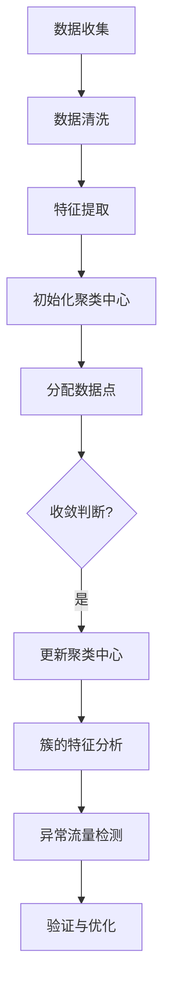
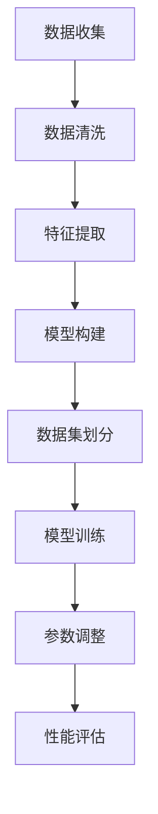
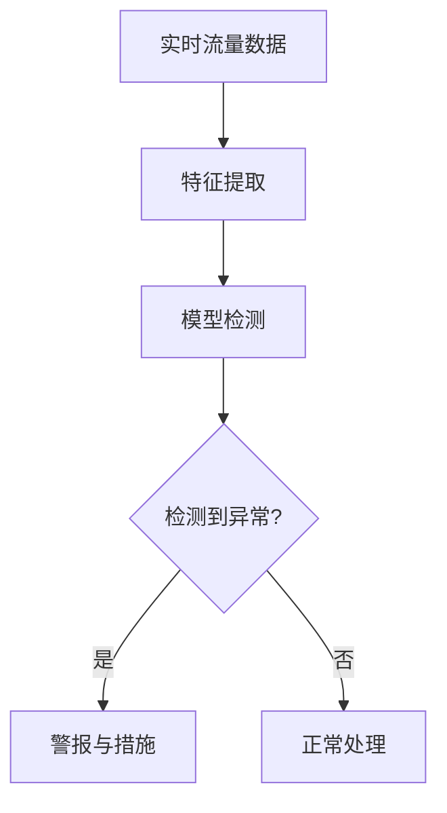

                 

### 引言

#### 问题背景

随着互联网的飞速发展和信息技术的日益普及，网络安全问题也变得越来越复杂和严重。网络攻击、数据泄露、恶意软件等威胁不断升级，给个人、企业和国家带来了巨大的损失。在这种背景下，如何提高网络安全水平，成为了一个亟待解决的问题。网络流量分析作为网络安全的重要组成部分，通过分析网络流量数据，可以帮助识别潜在的威胁，防止网络攻击和恶意行为的发生。

#### 机器学习与网络安全的结合

机器学习是一种通过算法从数据中学习规律，并用于预测或决策的技术。它已经在各个领域得到了广泛应用，包括医疗、金融、交通等。近年来，机器学习技术在网络安全领域也展现出了巨大的潜力。通过将机器学习应用于网络流量分析，可以更有效地检测和防御网络攻击，提高网络的安全性。

本书《机器学习在网络流量分析中的应用：提高网络安全》旨在探讨机器学习技术在网络流量分析中的应用，帮助读者了解这一领域的前沿技术和实际案例。本书的目标是：

1. **介绍机器学习和网络流量分析的基本概念**：帮助读者建立对机器学习和网络流量分析的基本了解，包括相关的术语、方法和原理。
2. **展示机器学习在网络流量分析中的具体应用**：通过实际案例，展示机器学习在流量异常检测、流量分类和流量预测等方面的应用，并分析其效果和挑战。
3. **探讨网络安全与机器学习的最佳实践**：总结当前网络安全领域中的成功经验，提供最佳实践建议，以帮助读者在实际项目中应用机器学习技术。

#### 书籍概述

本书分为三个主要部分：

1. **背景与核心概念**：介绍机器学习、网络流量分析和网络安全的基本概念，并探讨它们之间的联系。
2. **网络流量分析的基本原理**：详细讨论网络流量分析的基本原理，包括网络流量的组成、特征提取和异常检测技术。
3. **机器学习技术在网络流量分析中的应用**：介绍机器学习在流量异常检测、流量分类和流量预测中的应用，并通过实际案例进行详细分析。

本书面向的读者对象是从事网络安全工作的专业人士、计算机科学和人工智能领域的科研人员，以及对网络安全和机器学习感兴趣的广大读者。通过阅读本书，读者可以深入了解机器学习在网络流量分析中的应用，掌握相关的技术和方法，提高网络安全的水平。

接下来，我们将首先介绍机器学习和网络流量分析的基本概念，为后续的内容奠定基础。

### 背景与核心概念

#### 机器学习的基本概念

机器学习（Machine Learning，ML）是一门研究如何让计算机从数据中学习规律，并基于这些规律进行预测或决策的学科。它主要包括以下几个核心概念：

1. **定义**：机器学习是一种使计算机系统能够通过数据学习，从而进行特定任务的方法。这些任务包括图像识别、语音识别、自然语言处理、推荐系统等。

2. **主要类型**：机器学习可以分为以下几类：
   - **监督学习**：在监督学习（Supervised Learning）中，模型从带有标签的数据中进行学习。例如，通过输入图像和相应的标签（如猫或狗），模型学会识别图像中的对象。
   - **无监督学习**：无监督学习（Unsupervised Learning）不使用标签数据，而是从未标记的数据中寻找隐藏的模式或结构。例如，聚类分析就是一种无监督学习。
   - **强化学习**：强化学习（Reinforcement Learning）是一种通过试错方法进行学习的机器学习方法。模型通过与环境的互动，学习最大化某种奖励。

3. **发展历程**：机器学习的发展历程可以分为几个阶段：
   - **早期阶段**：20世纪50年代至60年代，机器学习研究开始萌芽，主要包括简单的规则系统。
   - **鼎盛时期**：20世纪80年代，基于决策树和神经网络的算法得到广泛应用。
   - **复兴期**：21世纪初，随着计算能力和数据量的增加，机器学习迎来了新的发展，深度学习（Deep Learning）成为一个重要方向。
   - **当前阶段**：当前，机器学习在各个领域都有广泛应用，并继续在算法、模型和数据方面不断进步。

#### 网络流量分析的定义与分类

网络流量分析（Network Traffic Analysis，NTA）是一种通过分析网络流量数据，以识别和监控网络安全事件和异常行为的技术。它主要包括以下几个核心概念：

1. **定义**：网络流量分析是指对通过网络设备传输的数据包进行分析，以提取有价值的信息，如数据包的源和目标地址、协议类型、数据量等。

2. **目标**：网络流量分析的主要目标是：
   - **监测和识别异常行为**：通过检测网络流量中的异常模式，发现潜在的攻击和入侵行为。
   - **优化网络性能**：通过分析网络流量，优化网络配置，提高网络传输效率和稳定性。
   - **支持合规性和审计**：帮助组织满足相关的法律法规要求，并对网络活动进行审计。

3. **主要类型**：网络流量分析可以分为以下几类：
   - **流量监控**：流量监控是对网络流量的实时监测和记录，以收集和分析网络行为。
   - **流量分类**：流量分类是根据流量特征对网络流量进行分类，以便进行更有效的管理和分析。
   - **异常检测**：异常检测是识别网络流量中的异常行为或异常模式，以预防潜在的攻击或故障。
   - **流量预测**：流量预测是根据历史流量数据预测未来的流量模式，以支持网络规划和管理。

#### 网络安全的基本概念

网络安全（Cybersecurity）是指保护网络系统、数据和资源免受未经授权的访问、使用、披露、破坏、修改或干扰的一门学科。它主要包括以下几个核心概念：

1. **定义**：网络安全是指通过各种技术和管理手段，确保网络系统的完整性、保密性和可用性。

2. **关键要素**：网络安全的几个关键要素包括：
   - **保密性**：确保信息不被未授权的个体或实体访问。
   - **完整性**：确保信息在传输和存储过程中不被篡改。
   - **可用性**：确保网络系统和资源在需要时可以正常使用。

3. **主要威胁**：网络安全面临的主要威胁包括：
   - **网络攻击**：包括拒绝服务攻击（DDoS）、分布式拒绝服务攻击（DDoS）、钓鱼攻击等。
   - **恶意软件**：包括病毒、蠕虫、木马等，这些恶意软件可以破坏系统、窃取数据或监控用户行为。
   - **数据泄露**：未经授权访问或泄露敏感数据，可能导致信息被滥用或窃取。

#### 机器学习与网络安全的关联

机器学习与网络安全有着紧密的联系。一方面，机器学习技术可以用于增强网络安全，例如通过以下方式：

1. **异常检测**：利用机器学习算法，可以从大量的网络流量数据中识别异常行为，从而及时检测和防范网络攻击。
2. **入侵检测**：通过分析网络流量，机器学习可以识别出潜在的入侵行为，从而实现对网络入侵的有效防御。
3. **恶意软件检测**：机器学习算法可以用于检测和分类恶意软件，从而防止恶意软件的传播和破坏。

另一方面，网络安全的需求也推动了机器学习技术的发展。随着网络攻击手段的不断升级，传统的基于规则的网络安全系统已经难以应对复杂的安全威胁，而机器学习技术可以提供更智能、更高效的解决方案。

总的来说，机器学习在网络流量分析中的应用，不仅有助于提高网络安全水平，也为网络安全领域带来了新的研究和发展方向。

### 核心概念与联系

#### 机器学习中的核心概念

1. **特征提取**：特征提取是机器学习中的关键步骤，旨在从原始数据中提取出能够代表数据特征的属性。特征提取的质量直接影响机器学习模型的性能。常用的特征提取方法包括：
   - **统计特征**：如均值、方差、最大值、最小值等。
   - **频率特征**：如数据出现频率、占比等。
   - **变换特征**：如主成分分析（PCA）、特征缩放等。

2. **模型选择**：模型选择是指根据问题的需求和数据的特征，选择合适的机器学习模型。常见的机器学习模型包括：
   - **监督学习模型**：如线性回归、支持向量机（SVM）、决策树、随机森林等。
   - **无监督学习模型**：如K-均值聚类、主成分分析（PCA）等。
   - **深度学习模型**：如卷积神经网络（CNN）、循环神经网络（RNN）、生成对抗网络（GAN）等。

3. **模型评估**：模型评估是对训练好的模型进行性能测试，以确定其准确度、鲁棒性和泛化能力。常用的评估指标包括：
   - **准确性**：预测正确的样本数占总样本数的比例。
   - **召回率**：预测为正类的实际正类样本数与实际正类样本数的比例。
   - **精确度**：预测为正类的实际正类样本数与预测为正类样本数的比例。
   - **F1值**：准确率和召回率的调和平均值。

4. **模型调优**：模型调优是通过调整模型参数，优化模型性能的过程。常用的调优方法包括：
   - **网格搜索**：在给定的参数范围内，逐一尝试所有可能的参数组合，找到最优参数。
   - **贝叶斯优化**：基于历史数据，利用贝叶斯统计模型优化参数选择。
   - **随机搜索**：在参数范围内随机选择参数组合，通过迭代逐步优化模型。

#### 网络流量分析中的核心概念

1. **流量特征**：流量特征是指用于描述网络流量特性的属性，包括：
   - **基本特征**：如数据包的源IP地址、目标IP地址、源端口号、目标端口号等。
   - **统计特征**：如数据包传输时间、传输速率、数据包大小等。
   - **高级特征**：如会话时长、数据包到达时间间隔、流量模式等。

2. **异常检测**：异常检测是识别网络流量中的异常模式或行为，以发现潜在的攻击或故障。常见的异常检测方法包括：
   - **统计方法**：如基于标准差的异常检测、基于密度的异常检测等。
   - **机器学习方法**：如K-均值聚类、孤立森林等。
   - **深度学习方法**：如卷积神经网络（CNN）、循环神经网络（RNN）等。

3. **聚类分析**：聚类分析是将数据分组为多个类或簇，以揭示数据中的结构和模式。常见的聚类算法包括：
   - **K-均值聚类**：通过迭代算法将数据划分为K个簇，并优化簇的中心。
   - **层次聚类**：通过自底向上或自顶向下的方式构建聚类层次结构。
   - **基于密度的聚类**：基于数据点的邻密度来划分簇。

4. **预测分析**：预测分析是根据历史流量数据预测未来的流量模式。常见的预测方法包括：
   - **时间序列分析**：如自回归移动平均（ARMA）模型、自回归积分移动平均（ARIMA）模型等。
   - **机器学习模型**：如线性回归、随机森林等。

#### 机器学习与网络流量分析的关联

1. **机器学习在网络安全中的应用**：机器学习技术在网络安全中的应用包括：
   - **异常检测**：通过分析网络流量，识别异常行为和潜在攻击。
   - **入侵检测**：识别和防御网络入侵行为。
   - **恶意软件检测**：检测和分类恶意软件，防止恶意软件传播。

2. **网络流量分析中的机器学习技术**：网络流量分析中常用的机器学习技术包括：
   - **流量特征提取**：使用机器学习方法提取网络流量的关键特征。
   - **流量分类**：使用分类算法将网络流量划分为不同的类别。
   - **流量预测**：使用预测模型预测未来的流量模式。

3. **机器学习与网络流量分析的未来趋势**：随着大数据和人工智能技术的发展，机器学习在网络流量分析中的应用将越来越广泛，未来趋势包括：
   - **深度学习在流量分析中的应用**：深度学习技术如卷积神经网络（CNN）、循环神经网络（RNN）等将在流量分析中得到更广泛的应用。
   - **实时流量分析**：随着实时数据流技术的发展，实时流量分析将更加精准和高效。
   - **自动化网络安全**：通过机器学习技术，实现自动化检测和防御，提高网络安全的自动化水平。

总的来说，机器学习与网络流量分析的结合为提高网络安全提供了强大的工具和方法，未来将继续在网络安全领域发挥重要作用。

### 网络流量分析的基本原理

网络流量分析作为网络安全的重要组成部分，通过对网络流量数据的分析和监控，可以帮助识别潜在的威胁和异常行为，从而提高网络的安全性。本节将详细讨论网络流量分析的基本原理，包括网络流量的组成、特征提取以及异常检测技术。

#### 网络流量的组成

网络流量是指通过网络传输的数据流，它由一个或多个数据包组成。每个数据包都包含了发送方的源地址、接收方的目标地址、传输的协议类型、数据长度等信息。网络流量可以进一步细分为以下几类：

1. **IP流量**：基于IP协议的数据传输流量，是最常见的网络流量类型。
2. **TCP流量**：基于TCP协议的数据传输流量，具有可靠性和流量控制的特点。
3. **UDP流量**：基于UDP协议的数据传输流量，具有传输速度快、效率高的特点。
4. **应用层流量**：基于特定应用协议的数据传输流量，如HTTP、HTTPS、FTP等。

#### 网络流量的特征提取

特征提取是将原始网络流量数据转换为适合机器学习模型处理的特征向量。特征提取的质量直接影响机器学习模型的性能。常用的特征提取方法包括：

1. **统计特征**：通过计算数据包的统计属性，如数据包的到达时间、传输速率、数据包大小等，提取出基本的流量特征。
2. **频率特征**：通过计算数据包在一段时间内的频率分布，提取出流量模式特征。
3. **高级特征**：通过数据包的协议层次结构，提取更复杂的特征，如传输层的TCP标志位、应用层的HTTP请求类型等。

#### 异常检测技术

异常检测是网络流量分析中的重要任务，旨在识别网络流量中的异常行为或异常模式。异常检测技术可以分为以下几类：

1. **统计方法**：
   - **基于阈值的检测**：通过设定一个阈值，当流量特征超过阈值时，认为出现了异常。
   - **基于概率分布的检测**：通过计算流量特征的统计分布，当流量特征分布偏离正常分布时，认为出现了异常。
   
2. **机器学习方法**：
   - **聚类算法**：如K-均值聚类、层次聚类等，通过将流量数据分组，识别出异常簇。
   - **分类算法**：如支持向量机（SVM）、随机森林等，通过训练分类模型，将正常流量和异常流量进行分类。
   - **深度学习方法**：如卷积神经网络（CNN）、循环神经网络（RNN）等，通过学习流量数据的特征表示，识别出异常流量。

#### 常见的异常检测方法

1. **基于阈值的异常检测**：
   - **简单阈值方法**：设定一个固定阈值，当流量特征超过阈值时，认为出现了异常。
   - **滑动窗口阈值方法**：在一段时间内，设定一个动态阈值，当流量特征超过阈值时，认为出现了异常。

2. **基于概率分布的异常检测**：
   - **正态分布方法**：假设流量特征服从正态分布，当流量特征偏离正态分布时，认为出现了异常。
   - **高斯混合模型（GMM）**：将流量数据建模为多个高斯分布的混合，当流量特征分布偏离GMM时，认为出现了异常。

3. **基于聚类算法的异常检测**：
   - **K-均值聚类**：将流量数据分为K个簇，当数据点与其所在簇的中心距离超过一定阈值时，认为出现了异常。
   - **层次聚类**：通过自底向上或自顶向下的方式，构建聚类层次结构，当数据点在聚类层次结构中的位置异常时，认为出现了异常。

4. **基于分类算法的异常检测**：
   - **支持向量机（SVM）**：通过训练SVM模型，将正常流量和异常流量进行分类，当流量被分类为异常时，认为出现了异常。
   - **随机森林**：通过训练随机森林模型，将正常流量和异常流量进行分类，当流量被分类为异常时，认为出现了异常。

#### 异常检测的挑战

虽然异常检测技术在网络流量分析中具有重要作用，但在实际应用中仍然面临一些挑战：

1. **数据噪声**：网络流量数据通常包含大量噪声，如数据包的随机丢失、网络干扰等，这些噪声可能影响异常检测的准确性。

2. **数据不平衡**：在网络流量数据中，正常流量和异常流量通常是不平衡的，异常流量的样本数量较少，这可能导致异常检测模型的性能下降。

3. **动态变化**：网络流量特征会随着时间和网络环境的变化而变化，这要求异常检测模型具有较好的鲁棒性和适应性。

4. **隐私保护**：网络流量数据中包含大量的个人隐私信息，如用户身份、通信内容等，如何在保护隐私的前提下进行异常检测是一个重要的挑战。

总的来说，网络流量分析的基本原理是通过提取网络流量的特征和运用异常检测技术，识别网络流量中的异常行为和潜在威胁。然而，在实际应用中，异常检测面临着数据噪声、数据不平衡、动态变化和隐私保护等挑战，需要进一步研究和优化。

### 机器学习在流量异常检测中的应用

流量异常检测是网络安全中的一个重要领域，旨在通过识别和分析网络流量中的异常模式来预防潜在的攻击。机器学习技术在流量异常检测中得到了广泛应用，其优势在于能够从大量数据中自动发现模式和规律，从而提高检测的准确性和效率。以下将介绍几种常见的机器学习方法及其在流量异常检测中的应用。

#### 聚类分析方法

聚类分析是一种无监督学习方法，通过将数据分组为多个簇，以揭示数据中的结构和模式。以下是一些常用的聚类算法及其在流量异常检测中的应用：

1. **K-均值聚类（K-Means）**：
   - **算法原理**：K-均值聚类通过迭代算法将数据划分为K个簇，每个数据点属于最近的簇中心。
   - **应用**：在流量异常检测中，可以通过K-均值聚类将网络流量分为多个簇，然后分析每个簇的特征，识别出异常流量。

2. **层次聚类（Hierarchical Clustering）**：
   - **算法原理**：层次聚类通过自底向上或自顶向下的方式构建聚类层次结构，每个簇都可以继续分裂成更小的簇。
   - **应用**：层次聚类可以用于分析网络流量的层次结构，识别出不同类型的流量模式，从而发现潜在的异常流量。

3. **基于密度的聚类（Density-Based Clustering）**：
   - **算法原理**：基于密度的聚类通过邻域密度来划分簇，可以处理数据分布不均匀的情况。
   - **应用**：在流量异常检测中，基于密度的聚类可以识别出高密度区域，从而发现异常流量。

#### 统计模型

统计模型是一种基于概率统计的方法，通过计算流量特征的统计属性来识别异常。以下是一些常用的统计模型及其在流量异常检测中的应用：

1. **概率分布模型**：
   - **算法原理**：概率分布模型通过计算流量特征的概率分布，识别出分布异常的流量。
   - **应用**：例如，假设流量特征服从正态分布，当流量特征分布偏离正态分布时，认为出现了异常。

2. **统计阈值模型**：
   - **算法原理**：统计阈值模型通过设定一个阈值，当流量特征超过阈值时，认为出现了异常。
   - **应用**：例如，在流量速率特征上设定一个阈值，当流量速率超过阈值时，认为出现了异常。

#### 深度学习方法

深度学习方法是一种基于多层神经网络的方法，通过学习数据的特征表示来识别异常。以下是一些常用的深度学习方法及其在流量异常检测中的应用：

1. **卷积神经网络（CNN）**：
   - **算法原理**：卷积神经网络通过卷积操作提取空间特征，适用于处理图像和序列数据。
   - **应用**：在流量异常检测中，可以通过CNN提取网络流量的时空特征，从而识别出异常流量。

2. **循环神经网络（RNN）**：
   - **算法原理**：循环神经网络通过记忆机制处理序列数据，适用于处理时间序列数据。
   - **应用**：在流量异常检测中，可以通过RNN处理网络流量的时间序列特征，从而识别出异常流量。

3. **长短期记忆网络（LSTM）**：
   - **算法原理**：长短期记忆网络是RNN的一种变体，通过门控机制解决长期依赖问题。
   - **应用**：在流量异常检测中，可以通过LSTM处理网络流量的时间序列特征，从而识别出异常流量。

#### 实际案例

以下是一个基于K-均值聚类的流量异常检测的实际案例：

1. **案例背景**：
   - 假设我们有一个包含大量网络流量的数据集，其中包含了正常流量和恶意流量。
   - 目标是利用K-均值聚类方法将网络流量分为正常流量和恶意流量，从而实现异常检测。

2. **数据预处理**：
   - 对原始流量数据进行清洗和预处理，提取出关键的流量特征。
   - 对特征进行归一化处理，以消除不同特征之间的量纲影响。

3. **聚类过程**：
   - 选择适当的聚类算法（如K-均值聚类）和参数（如聚类个数K）。
   - 通过迭代计算，将流量数据分为正常流量和恶意流量两个簇。

4. **结果分析**：
   - 对聚类结果进行分析，识别出异常流量。
   - 可以通过计算簇内数据点的平均距离或簇中心之间的距离来评估聚类的效果。

通过以上步骤，我们可以实现一个基本的流量异常检测系统。在实际应用中，还需要对系统进行进一步的优化和改进，以提高检测的准确性和鲁棒性。

总之，机器学习技术在流量异常检测中具有广泛的应用前景。通过结合不同的算法和技术，可以构建出高效的流量异常检测系统，从而提高网络的安全性。

### 机器学习在流量分类中的应用

流量分类是网络流量分析中的重要任务，旨在将网络流量划分为不同的类别，以便进行更有效的管理和分析。机器学习技术在流量分类中发挥着关键作用，通过学习大量的流量数据，机器学习模型能够自动识别流量特征，并将流量准确地分类到相应的类别中。以下将介绍几种常见的机器学习算法及其在流量分类中的应用。

#### 支持向量机（SVM）

支持向量机（Support Vector Machine，SVM）是一种常用的监督学习算法，它通过最大化分类边界之间的距离，将数据点分类到不同的类别中。以下是SVM在流量分类中的应用：

1. **算法原理**：
   - **线性SVM**：适用于线性可分的数据集，通过寻找一个超平面来分隔不同类别的数据。
   - **非线性SVM**：适用于非线性可分的数据集，通过使用核函数将数据映射到高维空间，从而实现分类。

2. **应用**：
   - 在流量分类中，SVM可以用于将流量分类到不同的应用类别，如Web流量、邮件流量、视频流量等。
   - 通过训练SVM模型，可以对流量数据进行分类，从而帮助网络管理员进行流量管理和优化。

#### 决策树

决策树（Decision Tree）是一种基于树形结构进行决策的算法，它通过一系列的判断条件，将数据点逐步分类到不同的类别中。以下是决策树在流量分类中的应用：

1. **算法原理**：
   - 决策树通过递归划分数据集，每个节点代表一个特征，每个分支代表一个特征值。
   - 通过计算每个特征的信息增益或增益率，选择最佳的特征进行划分。

2. **应用**：
   - 决策树可以用于将流量分类到不同的应用类别，如Web流量、邮件流量、视频流量等。
   - 由于决策树的解释性较强，它可以帮助网络管理员直观地理解分类过程和结果。

#### 集成学习方法

集成学习方法（Ensemble Learning）通过结合多个基础模型的预测结果来提高整体预测性能。以下是一些常见的集成学习方法及其在流量分类中的应用：

1. **随机森林（Random Forest）**：
   - **算法原理**：随机森林通过构建多个决策树，并采用随机的方式集成这些树的结果。
   - **应用**：随机森林可以用于分类和回归任务，它通过集成多个决策树，可以提高分类的准确性和稳定性。

2. **梯度提升树（Gradient Boosting Tree）**：
   - **算法原理**：梯度提升树通过迭代优化损失函数，每次迭代对前一次模型的预测结果进行修正。
   - **应用**：梯度提升树可以用于处理高维数据和稀疏数据，它通过迭代优化，可以显著提高分类的准确率。

3. **堆叠（Stacking）**：
   - **算法原理**：堆叠方法通过构建多个基础模型，并将它们的预测结果作为输入，训练一个最终的模型。
   - **应用**：堆叠方法可以结合多个模型的优势，提高分类的准确性和泛化能力。

#### 实际案例

以下是一个基于随机森林算法的流量分类的实际案例：

1. **案例背景**：
   - 假设我们有一个包含大量网络流量的数据集，其中包含了不同类别的流量，如Web流量、邮件流量、视频流量等。
   - 目标是利用随机森林算法将网络流量分类到不同的类别中。

2. **数据预处理**：
   - 对原始流量数据进行清洗和预处理，提取出关键的流量特征。
   - 对特征进行归一化处理，以消除不同特征之间的量纲影响。

3. **模型训练**：
   - 使用随机森林算法对流量数据进行训练，构建分类模型。
   - 调整模型参数，如决策树数量、最大深度等，以优化模型性能。

4. **模型评估**：
   - 使用测试集对训练好的模型进行评估，计算分类准确率、召回率等指标。
   - 根据评估结果，对模型进行进一步调优。

5. **应用**：
   - 将训练好的模型部署到生产环境中，对实时流量进行分类。
   - 根据分类结果，进行流量管理和优化。

通过以上步骤，我们可以实现一个基于机器学习的流量分类系统。在实际应用中，还需要对系统进行进一步的优化和改进，以提高分类的准确性和鲁棒性。

总之，机器学习技术在流量分类中具有广泛的应用前景。通过结合不同的算法和技术，可以构建出高效的流量分类系统，从而提高网络管理和分析的水平。

### 机器学习在流量预测中的应用

流量预测是网络流量分析中的一项重要任务，旨在根据历史流量数据预测未来的流量模式，为网络规划和管理提供依据。机器学习技术在流量预测中具有显著优势，能够从复杂的数据中提取有用信息，提高预测的准确性和效率。以下将讨论流量预测的主要方法及其应用。

#### 时间序列分析

时间序列分析是一种常用的流量预测方法，它通过分析时间序列数据中的趋势、季节性和周期性来预测未来的流量模式。以下是一些常见的时间序列分析方法：

1. **自回归模型（AR）**：
   - **算法原理**：自回归模型通过当前时刻的流量值与前几个时刻的流量值之间的关系来预测未来流量。
   - **应用**：自回归模型可以用于短期流量预测，适用于数据变化较为平稳的情况。

2. **自回归移动平均模型（ARMA）**：
   - **算法原理**：自回归移动平均模型结合了自回归模型和移动平均模型的特点，通过同时考虑当前时刻的流量值和过去几个时刻的流量值的平均数来预测未来流量。
   - **应用**：自回归移动平均模型适用于具有稳定波动性的流量数据，可以用于中期流量预测。

3. **自回归积分移动平均模型（ARIMA）**：
   - **算法原理**：自回归积分移动平均模型是对自回归模型和移动平均模型的进一步扩展，通过差分操作消除非平稳性，然后结合自回归和移动平均模型进行预测。
   - **应用**：自回归积分移动平均模型适用于具有趋势性和季节性的流量数据，可以用于长期流量预测。

#### 预测模型的评估

在流量预测中，评估预测模型的性能是确保预测准确性的关键。以下是一些常用的评估指标：

1. **均方误差（MSE）**：
   - **算法原理**：均方误差是预测值与实际值之间差的平方的平均值。
   - **应用**：均方误差可以衡量预测值与实际值之间的偏差程度，适用于评估预测模型的准确度。

2. **均方根误差（RMSE）**：
   - **算法原理**：均方根误差是均方误差的平方根。
   - **应用**：均方根误差可以更加直观地反映预测值与实际值之间的差异，常用于评估预测模型的性能。

3. **平均绝对误差（MAE）**：
   - **算法原理**：平均绝对误差是预测值与实际值之间差的绝对值的平均值。
   - **应用**：平均绝对误差可以衡量预测值与实际值之间的偏差，适用于评估预测模型的稳定性。

#### 预测模型的选择

选择合适的预测模型是流量预测成功的关键。以下是一些常见的预测模型及其特点：

1. **线性回归模型**：
   - **算法原理**：线性回归模型通过线性关系预测未来流量。
   - **应用**：线性回归模型适用于数据变化趋势较为平稳的情况，可以用于短期流量预测。

2. **随机森林模型**：
   - **算法原理**：随机森林模型通过构建多个决策树并集成预测结果。
   - **应用**：随机森林模型适用于处理高维数据和复杂非线性关系，可以用于中期和长期流量预测。

3. **深度学习模型**：
   - **算法原理**：深度学习模型通过多层神经网络学习数据的复杂特征。
   - **应用**：深度学习模型适用于处理大量高维数据，可以用于长期和复杂的流量预测。

#### 实际案例

以下是一个基于自回归移动平均模型（ARMA）的流量预测的实际案例：

1. **案例背景**：
   - 假设我们有一个包含24小时流量记录的数据集，需要预测未来24小时的流量。
   - 目标是利用ARMA模型预测流量峰值和低谷，以便进行网络资源调度和优化。

2. **数据预处理**：
   - 对原始流量数据进行清洗和预处理，提取出24小时的时间序列数据。
   - 对时间序列数据进行平稳性检验，必要时进行差分操作以消除非平稳性。

3. **模型训练**：
   - 使用时间序列数据训练ARMA模型，确定最佳的参数（p, q）组合。
   - 通过模型拟合，获取流量预测值。

4. **模型评估**：
   - 使用测试集对训练好的模型进行评估，计算均方误差（MSE）和均方根误差（RMSE）等指标。
   - 根据评估结果，调整模型参数以优化预测性能。

5. **应用**：
   - 将训练好的模型部署到生产环境中，实时预测流量，并用于网络资源调度和优化。

通过以上步骤，我们可以实现一个基于机器学习的流量预测系统。在实际应用中，需要对系统进行不断的调优和改进，以提高预测的准确性和可靠性。

总之，机器学习技术在流量预测中具有广泛的应用前景。通过结合不同的算法和技术，可以构建出高效的流量预测系统，为网络管理和优化提供有力的支持。

### 案例一：基于K-means算法的流量聚类分析

本案例将探讨如何使用K-means算法进行网络流量聚类分析，以识别网络中的异常流量模式。K-means是一种典型的聚类算法，通过将数据点分配到K个簇中，以达到数据分组的目的。

#### 案例背景

某大型企业网络每天产生大量的网络流量数据，包括内部员工流量、外部客户流量等。为了确保网络安全性，企业希望通过聚类分析将不同类型的流量区分开，以便监控和优化网络资源。

#### 数据预处理

1. **数据收集**：
   - 收集企业网络过去一周的流量数据，包含数据包的源IP地址、目标IP地址、端口号、传输速率、数据包大小等信息。

2. **数据清洗**：
   - 去除重复和无效的数据包。
   - 去除明显的噪声数据，如由于网络故障导致的异常数据包。

3. **特征提取**：
   - 提取关键流量特征，如数据包的源IP地址、目标IP地址、端口号、传输速率、数据包大小等。
   - 对特征进行归一化处理，以消除不同特征之间的量纲影响。

#### 聚类过程

1. **选择聚类算法**：
   - 选择K-means聚类算法进行流量聚类。

2. **确定簇数K**：
   - 使用肘部法则（Elbow Method）确定最佳的簇数K。通过计算不同K值时的误差平方和，找到误差最小值对应的K值。

3. **初始化聚类中心**：
   - 随机选择K个初始聚类中心。

4. **迭代聚类**：
   - 将每个数据点分配到最近的聚类中心。
   - 更新每个聚类中心的位置，使其成为对应簇数据点的平均值。

5. **收敛判断**：
   - 当聚类中心的位置变化小于预设阈值或达到最大迭代次数时，认为聚类过程已收敛。

#### 结果分析

1. **簇的特征分析**：
   - 对每个簇的流量特征进行统计分析，如平均传输速率、数据包大小等。
   - 分析每个簇中数据点的分布情况，识别出可能的异常流量。

2. **异常流量检测**：
   - 根据簇的特征，识别出异常流量模式。例如，如果一个簇的流量特征明显偏离其他簇，则可能包含异常流量。
   - 对这些异常流量进行进一步分析，确定其是否为潜在的网络攻击。

3. **验证与优化**：
   - 使用测试集验证聚类结果，评估聚类算法的性能。
   - 根据验证结果，调整聚类参数，如簇数K、迭代次数等，以优化聚类效果。

通过以上步骤，我们可以使用K-means算法对企业网络流量进行聚类分析，识别出异常流量模式，从而提高网络安全性。以下是一个简化的K-means算法的mermaid流程图：

总之，K-means算法在网络流量聚类分析中具有重要作用。通过合理的数据预处理和聚类参数选择，可以有效地识别网络中的异常流量，为网络管理和安全提供有力支持。

### 案例二：深度学习在流量异常检测中的应用

随着网络流量的日益增长，传统的基于规则的方法在检测复杂和隐蔽的网络攻击时显得力不从心。深度学习作为一种强大的机器学习技术，因其能够自动从数据中提取特征并构建复杂的模型，逐渐成为流量异常检测领域的研究热点。以下将介绍如何使用深度学习技术进行流量异常检测。

#### 案例背景

某互联网公司希望提升其网络的安全性，尤其是针对不断增多的分布式拒绝服务（DDoS）攻击。公司拥有大量的网络流量数据，包括正常流量和不同类型的攻击流量。通过深度学习技术，公司希望能够自动化地检测和分类这些流量，从而及时应对潜在的攻击。

#### 数据预处理

1. **数据收集**：
   - 收集过去一个月的流量数据，包括源IP、目标IP、端口、协议类型、流量速率、数据包大小等。

2. **数据清洗**：
   - 去除无效和重复的数据包。
   - 对异常数据进行标记，如数据包大小远超正常范围。

3. **特征提取**：
   - 提取流量特征，如统计特征（平均流量速率、流量峰值等）和高级特征（数据包到达时间间隔、传输层TCP标志等）。
   - 对特征进行归一化处理，以消除不同特征之间的量纲影响。

#### 模型构建

1. **选择模型**：
   - 选择卷积神经网络（CNN）进行流量特征提取和分类，因为CNN擅长处理图像和序列数据，可以有效地提取流量特征。

2. **数据集划分**：
   - 将数据集划分为训练集、验证集和测试集，分别用于模型训练、参数调整和性能评估。

3. **模型结构**：
   - 设计一个包含多个卷积层和池化层的CNN模型，以逐层提取流量特征。
   - 在模型的最后添加全连接层进行分类，输出每个类别的概率。

以下是一个简化的深度学习模型的mermaid流程图：

#### 模型训练与优化

1. **模型训练**：
   - 使用训练集对CNN模型进行训练，通过反向传播算法更新模型参数。
   - 在训练过程中，使用交叉熵损失函数衡量模型预测的准确度。

2. **参数调整**：
   - 通过验证集评估模型的性能，调整模型参数，如学习率、批量大小等，以优化模型性能。
   - 使用网格搜索和贝叶斯优化等调参方法，找到最佳的模型参数。

3. **性能评估**：
   - 使用测试集对训练好的模型进行评估，计算准确率、召回率、F1值等指标。
   - 分析模型的误分类情况，识别出可能导致误分类的特征，对模型进行调整。

#### 实际应用

1. **实时流量检测**：
   - 将训练好的模型部署到生产环境中，对实时流量进行检测和分类。
   - 当检测到异常流量时，及时发出警报，并采取相应的安全措施。

2. **动态调整**：
   - 随着网络环境和攻击模式的变化，定期更新模型，以保持其检测的准确性和鲁棒性。

以下是一个简化的实时流量检测流程：

通过以上步骤，我们可以构建一个基于深度学习的流量异常检测系统，提高网络的安全性。在实际应用中，需要不断优化模型，以应对不断变化的网络威胁。

总之，深度学习技术在流量异常检测中的应用，为网络安全提供了新的解决方案。通过合理的模型设计和参数调整，可以实现对复杂网络攻击的有效检测，从而提升网络的整体安全性。

### 网络安全与机器学习的最佳实践

在将机器学习技术应用于网络流量分析时，为确保其有效性和安全性，以下是一些最佳实践：

#### 数据隐私保护

1. **匿名化处理**：在数据收集和预处理阶段，对敏感信息进行匿名化处理，以保护用户隐私。
2. **数据加密**：对传输和存储的数据进行加密，防止数据泄露。

#### 模型解释性

1. **可视化分析**：利用可视化工具，如决策树、混淆矩阵等，分析模型的决策过程，提高模型的可解释性。
2. **模型压缩**：通过模型压缩技术，如剪枝、量化等，减少模型的复杂性，提高模型的透明度。

#### 模型更新与优化

1. **持续训练**：定期使用新的流量数据进行模型训练，以适应网络环境的变化。
2. **动态调整参数**：根据实际性能评估结果，动态调整模型参数，以提高预测准确率。

#### 安全性增强

1. **多模型融合**：结合多个机器学习模型，利用各自的优点，提高检测的准确性和鲁棒性。
2. **对抗训练**：通过对抗训练，增强模型对恶意样本的抵抗力。

#### 合规性要求

1. **符合法律法规**：确保机器学习应用符合相关的法律法规，如GDPR、CCPA等。
2. **透明度与审计**：确保模型的训练和应用过程透明，便于审计和合规性检查。

通过遵循这些最佳实践，可以有效提升机器学习技术在网络流量分析中的应用效果，提高网络的安全性和可靠性。

### 小结

本文从多个角度探讨了机器学习在网络流量分析中的应用，以提高网络安全水平。首先，介绍了机器学习和网络流量分析的基本概念，探讨了它们之间的联系。接着，详细介绍了网络流量分析的基本原理，包括流量特征提取、异常检测技术等。然后，重点介绍了机器学习在流量异常检测、流量分类和流量预测中的应用，通过实际案例展示了机器学习的有效性。最后，总结了网络安全与机器学习的最佳实践，强调了数据隐私保护、模型解释性、模型更新与优化、安全性增强和合规性要求的重要性。通过本文的探讨，我们不仅可以了解到机器学习在网络流量分析中的具体应用，还能认识到其在提升网络安全方面的巨大潜力。未来，随着技术的不断进步，机器学习将继续在网络安全领域发挥关键作用。

### 注意事项

在应用机器学习技术进行网络流量分析时，需要注意以下几个关键点：

1. **数据质量**：确保数据集的完整性和准确性，避免噪声和错误数据对模型性能的影响。
2. **模型解释性**：在选择机器学习模型时，应考虑模型的解释性，以便理解和验证模型的决策过程。
3. **安全性与隐私**：在数据处理和模型训练过程中，必须严格保护用户隐私，遵守相关的法律法规。
4. **模型泛化能力**：确保模型具有良好的泛化能力，能够在不同的网络环境中保持稳定的表现。

通过关注这些注意事项，可以进一步提升机器学习技术在网络流量分析中的效果和可靠性。

### 拓展阅读

对于希望深入了解机器学习在网络流量分析中应用的读者，以下是一些推荐的拓展阅读资源：

1. **书籍**：
   - 《机器学习：实战》（Peter Harrington）：详细介绍了机器学习的基础知识和应用案例。
   - 《深度学习》（Ian Goodfellow, Yoshua Bengio, Aaron Courville）：深度学习的权威教材，涵盖了深度学习的基础和最新进展。

2. **论文**：
   - "Network Anomaly Detection using Machine Learning Techniques"（2018）：综述了机器学习技术在网络流量异常检测中的应用。
   - "A Survey on Deep Learning for Network Traffic Analysis"（2020）：探讨了深度学习在网络流量分析中的最新研究进展。

3. **在线课程**：
   - "机器学习专项课程"（吴恩达，Coursera）：提供了系统化的机器学习知识，适合初学者和进阶者。
   - "深度学习专项课程"（吴恩达，Coursera）：深度学习领域的权威课程，适合对深度学习感兴趣的读者。

通过这些资源，读者可以进一步深化对机器学习和网络流量分析的理解，探索前沿技术和研究动态。

