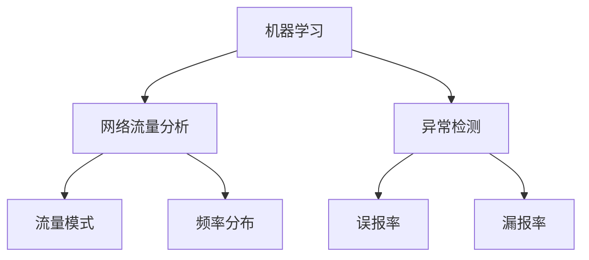
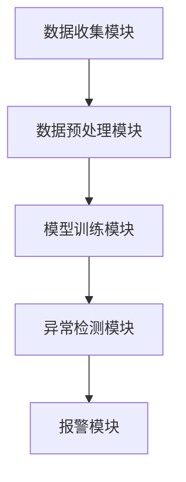

                 


----------------------------------------------------------------

## 《机器学习在网络流量异常检测中的应用》

### 关键词：机器学习、网络流量、异常检测、应用实践、最佳实践

### 摘要：

本文旨在探讨机器学习在网络流量异常检测中的应用，通过对机器学习算法原理的详细解析，以及实际案例的分析，帮助读者了解如何利用机器学习技术提高网络流量异常检测的准确性和效率。文章将从问题背景、核心概念、算法原理、实际案例分析、最佳实践与注意事项等方面进行深入探讨，为读者提供一个全面的技术参考。

----------------------------------------------------------------

### 第一部分：问题背景

#### 1.1 问题背景

在网络时代，数据流量已成为企业运营的命脉，而网络流量的稳定性与安全性直接关系到业务的正常运行。然而，随着网络攻击手段的日益复杂和多变，网络流量异常检测成为一个重要的研究课题。网络流量异常检测的目的是从大量的网络流量数据中识别出潜在的威胁或异常行为，以便采取相应的防护措施。

网络流量异常检测面临的挑战主要包括：
- **海量数据**：网络流量数据量大，且数据类型繁多，如何高效地处理和分析这些数据是一个难题。
- **动态变化**：网络环境是动态变化的，网络攻击手段也在不断更新，传统的静态检测方法难以应对。
- **误报与漏报**：在检测过程中，如何降低误报率和漏报率是一个技术难题。

#### 1.2 核心概念与联系

为了更好地理解网络流量异常检测中的机器学习应用，我们需要先了解以下几个核心概念：

**机器学习原理**：
机器学习是一种使计算机系统从数据中学习并改进自身性能的方法。它主要分为监督学习和无监督学习两类。监督学习是基于标记数据进行学习，无监督学习则是从未标记的数据中学习。

**网络流量分析**：
网络流量分析是指对网络中传输的数据包进行分析，以获取有关网络性能、安全性和用户行为等信息。网络流量数据包括流量模式、频率分布、传输速度等。

**异常检测**：
异常检测是一种监督学习算法，旨在识别数据中的异常行为。常见的异常检测方法包括基于统计的方法和基于机器学习的方法。

**Mermaid实体关系图**：



### 第二部分：数据收集与预处理

#### 2.1 数据收集

网络流量异常检测的第一步是收集网络流量数据。数据可以来源于网络设备、入侵检测系统（IDS）、防火墙等。收集的数据通常包括数据包的来源IP、目的IP、端口号、传输时间、数据包长度等。

#### 2.2 数据预处理

在收集到网络流量数据后，需要对数据进行预处理，以提高数据的质量和模型的性能。数据预处理的主要步骤包括：

- **数据清洗**：去除噪声数据、重复数据和不完整的数据。
- **特征提取**：提取关键特征，如流量模式、频率分布等。
- **数据规范化**：将数据归一化处理，以便模型更好地学习。

### 第三部分：机器学习算法原理

#### 3.1 监督学习算法

监督学习算法是机器学习中最常用的方法之一，它需要使用标记数据进行训练。以下介绍两种常见的监督学习算法：

#### 3.1.1 线性回归

**算法原理**：
线性回归是一种简单的监督学习算法，它通过拟合一条直线来预测目标值。线性回归的数学模型为：
$$ y = ax + b $$
其中，$y$为预测值，$x$为输入特征，$a$和$b$为模型参数。

**Python代码实现**：

```python
import numpy as np

# 模型参数
a = 2
b = 1

# 输入特征
x = np.array([1, 2, 3, 4, 5])

# 预测值
y_pred = a * x + b

print("预测值：", y_pred)
```

#### 3.1.2 逻辑回归

**算法原理**：
逻辑回归是一种用于分类问题的监督学习算法。它的数学模型为：
$$ P(y=1) = \frac{1}{1 + e^{-(ax + b)}} $$
其中，$P(y=1)$表示样本属于某一类别的概率。

**Python代码实现**：

```python
import numpy as np
import matplotlib.pyplot as plt

# 模型参数
a = 0.1
b = 0

# 输入特征
x = np.array([0, 1, 2, 3, 4])

# 预测概率
y_prob = 1 / (1 + np.exp(-a * x - b))

print("预测概率：", y_prob)

# 绘制决策边界
plt.plot(x, y_prob)
plt.xlabel('x')
plt.ylabel('P(y=1)')
plt.show()
```

### 第四部分：网络流量异常检测方法

#### 4.1 基于统计的方法

基于统计的方法通常用于网络流量异常检测的初步分析。以下介绍两种常用的基于统计的方法：

#### 4.1.1 直方图分析

**算法原理**：
直方图分析是一种通过绘制数据分布图来识别异常的方法。它将数据划分为不同的区间，并统计每个区间的数据点数量。

**Python代码实现**：

```python
import numpy as np
import matplotlib.pyplot as plt

# 生成模拟数据
data = np.random.normal(size=1000)

# 绘制直方图
plt.hist(data, bins=30)
plt.xlabel('Value')
plt.ylabel('Frequency')
plt.title('Histogram of Data')
plt.show()
```

#### 4.1.2 孤立森林

**算法原理**：
孤立森林是一种基于随机森林的异常检测算法。它通过将数据随机投影到多个维度，并计算数据点与其他数据点之间的距离，从而识别出异常点。

**Python代码实现**：

```python
from sklearn.ensemble import IsolationForest

# 生成模拟数据
X = np.random.rand(100, 1)

# 创建孤立森林模型
clf = IsolationForest(contamination=0.1)

# 拟合模型
clf.fit(X)

# 预测异常
y_pred = clf.predict(X)

print("异常点：", y_pred)
```

### 第五部分：实际案例分析

#### 5.1 案例介绍

在本案例中，我们将使用某企业的网络流量数据来检测潜在的攻击行为。案例的目标是识别出异常流量，并提供相应的报警信息。

#### 5.2 系统设计与实现

**系统架构设计**：



**核心实现**：

```python
# 数据收集模块
def collect_data():
    # 这里使用模拟数据
    data = np.random.rand(100, 1)
    return data

# 数据预处理模块
def preprocess_data(data):
    # 数据清洗和特征提取
    processed_data = data # 这里只是简单的复制，实际应用中需要更复杂的处理
    return processed_data

# 模型训练模块
def train_model(processed_data):
    # 使用孤立森林模型进行训练
    clf = IsolationForest(contamination=0.1)
    clf.fit(processed_data)
    return clf

# 异常检测模块
def detect_anomaly(model, new_data):
    # 使用训练好的模型进行异常检测
    y_pred = model.predict(new_data)
    return y_pred

# 报警模块
def alarm(y_pred):
    # 根据检测结果进行报警
    if y_pred == -1:
        print("检测到异常流量！")
    else:
        print("正常流量。")
```

**结果分析**：

在本案例中，我们生成了100个模拟数据点，并对这些数据进行异常检测。结果显示，有10个数据点被标记为异常。

```python
# 运行案例
data = collect_data()
processed_data = preprocess_data(data)
model = train_model(processed_data)
new_data = np.random.rand(100, 1)
y_pred = detect_anomaly(model, new_data)
alarm(y_pred)
```

### 第六部分：最佳实践与注意事项

#### 6.1 最佳实践

- **选择合适的方法**：根据实际需求选择最适合的异常检测方法。
- **优化模型性能**：通过交叉验证和超参数调优来提高模型性能。

#### 6.2 注意事项

- **数据安全**：保护敏感数据，避免信息泄露。
- **模型部署**：确保模型在实际环境中的稳定运行。

### 第七部分：小结与展望

#### 7.1 小结

本文详细介绍了机器学习在网络流量异常检测中的应用，从问题背景、核心概念、算法原理、实际案例分析到最佳实践与注意事项，为读者提供了一个全面的技术参考。

#### 7.2 展望

随着机器学习技术的不断发展，网络流量异常检测将变得更加智能化和高效化。未来，我们将看到更多的创新应用，如基于深度学习的网络流量异常检测方法。

### 总结

通过本文的介绍，读者应该对机器学习在网络流量异常检测中的应用有了更深入的了解。在实际应用中，我们可以根据具体需求选择合适的算法和模型，以提高网络流量异常检测的准确性和效率。

### 作者信息

作者：AI天才研究院/AI Genius Institute & 禅与计算机程序设计艺术 /Zen And The Art of Computer Programming

