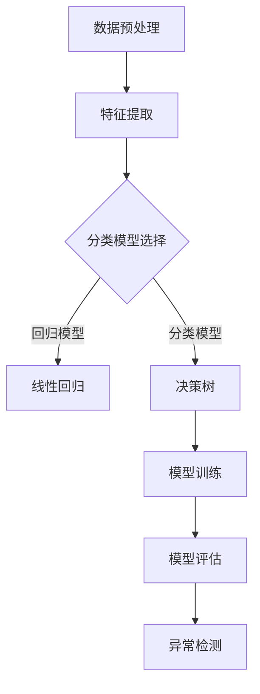
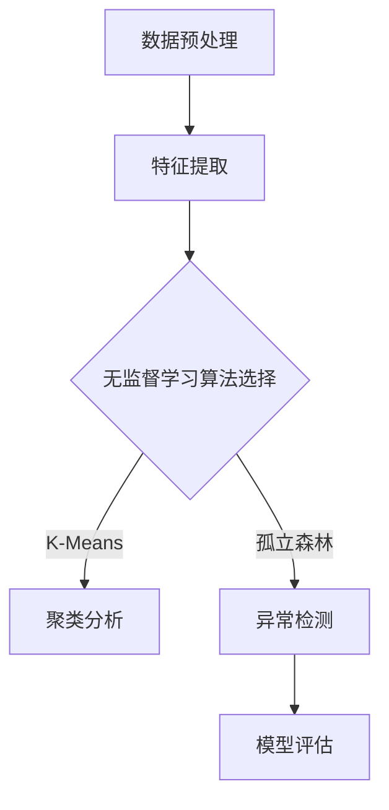
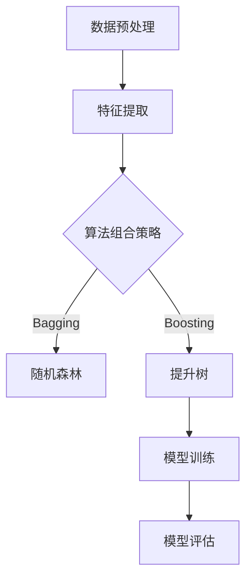
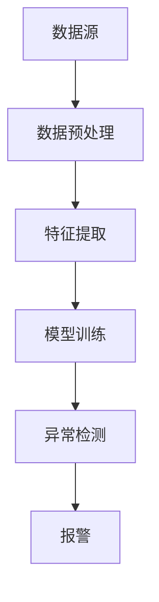
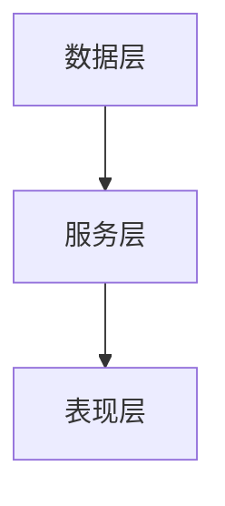
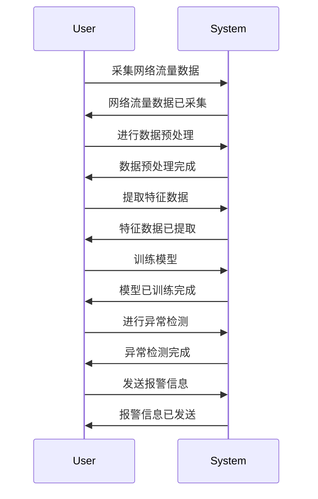

                 

# 机器学习在网络流量异常检测中的应用：提高网络安全性

关键词：机器学习、网络流量、异常检测、安全性、网络安全

摘要：本文将深入探讨机器学习在网络流量异常检测中的应用，分析其在提高网络安全性方面的潜力。通过详细讲解核心概念、算法原理以及实际案例，我们旨在为读者提供一个全面且易懂的技术视角，帮助理解和应用这一先进技术于实际网络安全工作中。

## 第一部分：问题背景与核心概念

### 第1章：网络流量异常检测的挑战与机遇

#### 1.1.1 问题背景

##### 1.1.1.1 网络安全的重要性

在信息化时代，网络已经成为社会运转的重要基础设施。随着网络技术的发展，网络安全问题日益突出。网络攻击、数据泄露、恶意软件等威胁不断演变，对个人隐私、企业利益以及国家安全造成严重影响。因此，提升网络安全性已成为全球范围内的迫切需求。

##### 1.1.1.2 网络攻击的现状与趋势

当前，网络攻击形式多样化，攻击手段日益复杂。APT（高级持续性威胁）攻击、DDoS（分布式拒绝服务）攻击、勒索软件等攻击手段层出不穷，攻击者利用漏洞、钓鱼邮件、恶意代码等手段进行攻击，造成严重损失。同时，随着物联网、云计算、5G等新技术的普及，网络攻击的频率和规模呈现爆发式增长。

##### 1.1.1.3 异常检测在网络安全中的价值

异常检测是一种网络安全技术，通过分析网络流量、系统日志、用户行为等数据，识别出异常行为和潜在威胁。相比传统的基于特征匹配的防攻击手段，异常检测具有更强的自适应性和泛化能力，能够发现未知威胁和新型攻击。

#### 1.1.2 问题描述

##### 1.1.2.1 异常检测的目标

异常检测的目标是识别出网络中的异常流量或行为，包括入侵行为、恶意软件感染、内部威胁等。异常检测需要满足以下要求：

1. **准确性**：正确识别出异常行为，减少误报和漏报。
2. **实时性**：快速检测并响应异常事件，减少损失。
3. **可解释性**：异常检测结果易于理解和解释，便于后续分析和处理。

##### 1.1.2.2 异常检测的难点与挑战

异常检测面临以下难点和挑战：

1. **数据量大**：网络流量数据规模巨大，对检测算法的性能和效率提出高要求。
2. **特征复杂性**：网络流量数据包含多种特征，需要有效的特征提取和选择方法。
3. **动态变化**：网络环境不断变化，攻击手段和异常行为也在不断演变，对异常检测算法的适应性和泛化能力提出挑战。
4. **隐私保护**：异常检测过程中涉及用户隐私数据，需要确保隐私保护。

#### 1.1.3 问题解决

##### 1.1.3.1 机器学习在异常检测中的应用

机器学习是一种强大的数据分析技术，通过构建模型自动识别和分类数据。在异常检测中，机器学习技术被广泛应用于以下方面：

1. **特征学习**：自动提取网络流量数据中的特征，提高特征选择的效率和准确性。
2. **模式识别**：利用监督学习、无监督学习和半监督学习算法，识别出异常流量和行为。
3. **自适应更新**：根据网络环境和攻击手段的变化，动态更新检测模型，提高检测效果。

##### 1.1.3.2 机器学习技术如何提高网络安全性

机器学习技术提高网络安全性的主要方式包括：

1. **自动化检测**：减少人工干预，提高检测效率和准确性。
2. **自适应防御**：根据攻击特征和异常行为，动态调整安全策略和防御措施。
3. **深度防御**：多层防御体系，结合多种检测技术和防御手段，提高整体安全性。
4. **态势感知**：全面感知网络环境，识别潜在威胁和风险，提前采取防范措施。

#### 1.1.4 边界与外延

##### 1.1.4.1 异常检测的边界

异常检测主要关注网络流量中的异常行为和事件，但并非所有异常行为都是攻击。异常检测需要区分正常行为和异常行为，避免误报和漏报。

##### 1.1.4.2 异常检测的相关概念

1. **基线**：正常网络流量或行为的基准线，用于识别异常。
2. **特征**：网络流量中的各种属性，用于描述网络行为。
3. **分类器**：用于判断网络流量是否为异常的模型。
4. **误报**：将正常流量误判为异常。
5. **漏报**：将异常流量误判为正常。

#### 1.1.5 概念结构与核心要素组成

##### 1.1.5.1 机器学习核心概念

1. **模型**：用于描述数据之间关系的数学模型。
2. **训练**：通过训练数据学习模型参数。
3. **验证**：通过验证数据评估模型性能。
4. **测试**：通过测试数据评估模型泛化能力。

##### 1.1.5.2 网络流量异常检测的核心要素

1. **数据集**：包含正常流量和异常流量的数据集。
2. **特征提取**：从网络流量中提取特征。
3. **模型选择**：选择合适的机器学习算法。
4. **模型训练与验证**：训练和验证模型参数。
5. **异常检测**：使用模型检测异常流量。

### 第2章：机器学习基础

#### 2.1.1 机器学习的定义与分类

##### 2.1.1.1 监督学习

监督学习是一种有标签数据的机器学习任务，目标是通过学习输入和输出之间的映射关系，对未知数据进行预测。监督学习可以分为回归和分类两种类型：

1. **回归**：预测连续值输出。
2. **分类**：预测离散值输出。

##### 2.1.1.2 无监督学习

无监督学习是一种无标签数据的机器学习任务，目标是发现数据中的结构和规律。无监督学习可以分为聚类和降维两种类型：

1. **聚类**：将相似的数据点分组。
2. **降维**：减少数据维度，保持数据结构。

##### 2.1.1.3 半监督学习和强化学习

半监督学习结合了有标签和无标签数据，通过利用无标签数据进行辅助学习，提高模型性能。强化学习是一种基于反馈的机器学习任务，目标是通过学习策略实现最大化奖励。

#### 2.1.2 机器学习算法原理

##### 2.1.2.1 线性回归

线性回归是一种简单的监督学习算法，通过学习输入和输出之间的线性关系，预测连续值输出。线性回归的数学模型为：

$$y = \beta_0 + \beta_1x_1 + \beta_2x_2 + ... + \beta_nx_n$$

其中，$y$ 是输出，$x_1, x_2, ..., x_n$ 是输入，$\beta_0, \beta_1, ..., \beta_n$ 是模型参数。

##### 2.1.2.2 决策树

决策树是一种基于树结构的分类算法，通过一系列规则将数据划分为不同的类别。决策树的构建过程如下：

1. **选择最佳分割特征**：根据信息增益或基尼不纯度选择最佳分割特征。
2. **递归构建子树**：对分割后的数据集重复上述过程，构建子树。

##### 2.1.2.3 集成方法

集成方法通过组合多个基础模型，提高模型性能和泛化能力。常见的集成方法包括：

1. **Bagging**：通过随机抽样和基础模型组合，降低模型方差。
2. **Boosting**：通过权重调整和基础模型组合，降低模型偏差。
3. **随机森林**：结合Bagging和决策树，提高模型性能。

#### 2.1.3 机器学习算法的应用场景

##### 2.1.3.1 分类问题

分类问题是一种将数据分为不同类别的任务。常见的应用场景包括：

1. **垃圾邮件检测**：通过分类算法识别垃圾邮件。
2. **客户流失预测**：通过分类算法预测客户流失风险。
3. **医疗诊断**：通过分类算法诊断疾病。

##### 2.1.3.2 聚类问题

聚类问题是一种将相似数据点分为同一类别的任务。常见的应用场景包括：

1. **客户细分**：通过聚类分析将客户分为不同群体。
2. **图像分割**：通过聚类算法将图像分为不同区域。
3. **社交网络分析**：通过聚类算法识别社交网络中的社区结构。

##### 2.1.3.3 回归问题

回归问题是一种预测连续值输出的任务。常见的应用场景包括：

1. **股票价格预测**：通过回归算法预测股票价格走势。
2. **房价预测**：通过回归算法预测房价。
3. **销售预测**：通过回归算法预测销售量。

## 第二部分：机器学习算法在网络流量异常检测中的应用

### 第4章：基于监督学习的网络流量异常检测

#### 4.3.1 算法原理与流程图

##### 4.3.1.1 算法原理

基于监督学习的网络流量异常检测算法通过训练数据集学习正常流量和异常流量的特征，构建分类模型。在检测过程中，使用训练好的模型对网络流量进行分类，识别出异常流量。

##### 4.3.1.2 流程图

以下是基于监督学习的网络流量异常检测算法的流程图：



#### 4.3.2 源代码与详细讲解

##### 4.3.2.1 源代码

以下是基于监督学习的网络流量异常检测的Python源代码示例：

```python
import pandas as pd
from sklearn.model_selection import train_test_split
from sklearn.ensemble import RandomForestClassifier
from sklearn.metrics import classification_report

# 数据预处理
data = pd.read_csv('network_traffic.csv')
data = data.drop(['label'], axis=1)

# 特征提取
features = data.iloc[:, :20]
labels = data.iloc[:, 20]

# 分类模型选择
clf = RandomForestClassifier(n_estimators=100)

# 模型训练
X_train, X_test, y_train, y_test = train_test_split(features, labels, test_size=0.2, random_state=42)
clf.fit(X_train, y_train)

# 模型评估
y_pred = clf.predict(X_test)
print(classification_report(y_test, y_pred))
```

##### 4.3.2.2 代码应用解读与分析

上述代码实现了基于监督学习的网络流量异常检测，主要包括以下步骤：

1. **数据预处理**：读取网络流量数据，去除标签列。
2. **特征提取**：提取特征列，为后续建模做准备。
3. **分类模型选择**：选择随机森林分类器，提高模型性能。
4. **模型训练**：使用训练数据集训练模型。
5. **模型评估**：使用测试数据集评估模型性能。

通过上述步骤，我们可以构建一个基于监督学习的网络流量异常检测模型，并对网络流量进行分类，识别异常流量。

### 第5章：基于无监督学习的网络流量异常检测

#### 5.4.1 算法原理与流程图

##### 5.4.1.1 算法原理

基于无监督学习的网络流量异常检测算法通过分析网络流量数据，自动发现正常流量和异常流量的分布特征，并利用这些特征进行异常检测。常见的无监督学习算法包括K-Means聚类和孤立森林。

##### 5.4.1.2 流程图

以下是基于无监督学习的网络流量异常检测算法的流程图：



#### 5.4.2 源代码与详细讲解

##### 5.4.2.1 源代码

以下是基于无监督学习的网络流量异常检测的Python源代码示例：

```python
import pandas as pd
from sklearn.cluster import KMeans
from sklearn.metrics import silhouette_score
from sklearn.ensemble import IsolationForest

# 数据预处理
data = pd.read_csv('network_traffic.csv')
data = data.drop(['label'], axis=1)

# 特征提取
features = data.iloc[:, :20]

# 无监督学习算法选择
kmeans = KMeans(n_clusters=3, random_state=42)
kmeans.fit(features)

isolation_forest = IsolationForest(random_state=42)
isolation_forest.fit(features)

# 模型评估
kmeans_score = silhouette_score(features, kmeans.labels_)
print("K-Means Silhouette Score:", kmeans_score)

isolation_forest_score = isolation_forest.score(features)
print("Isolation Forest Score:", isolation_forest_score)
```

##### 5.4.2.2 代码应用解读与分析

上述代码实现了基于无监督学习的网络流量异常检测，主要包括以下步骤：

1. **数据预处理**：读取网络流量数据，去除标签列。
2. **特征提取**：提取特征列，为后续建模做准备。
3. **无监督学习算法选择**：选择K-Means聚类和孤立森林算法。
4. **模型评估**：使用 silhouette_score 和 score 函数评估模型性能。

通过上述步骤，我们可以构建一个基于无监督学习的网络流量异常检测模型，并对网络流量进行分类，识别异常流量。

### 第6章：集成方法在网络流量异常检测中的应用

#### 6.5.1 算法原理与流程图

##### 6.5.1.1 算法原理

集成方法通过网络流量异常检测算法的组合，提高模型性能和泛化能力。常见的集成方法包括Bagging、Boosting和随机森林。

##### 6.5.1.2 流程图

以下是集成方法在网络流量异常检测中的应用流程图：



#### 6.5.2 源代码与详细讲解

##### 6.5.2.1 源代码

以下是集成方法在网络流量异常检测中的应用的Python源代码示例：

```python
import pandas as pd
from sklearn.ensemble import RandomForestClassifier, GradientBoostingClassifier
from sklearn.model_selection import train_test_split
from sklearn.metrics import classification_report

# 数据预处理
data = pd.read_csv('network_traffic.csv')
data = data.drop(['label'], axis=1)

# 特征提取
features = data.iloc[:, :20]
labels = data.iloc[:, 20]

# 算法组合策略
X_train, X_test, y_train, y_test = train_test_split(features, labels, test_size=0.2, random_state=42)

# 模型训练
rf = RandomForestClassifier(n_estimators=100)
gboost = GradientBoostingClassifier(n_estimators=100)

rf.fit(X_train, y_train)
gboost.fit(X_train, y_train)

# 模型评估
y_pred_rf = rf.predict(X_test)
y_pred_gboost = gboost.predict(X_test)

print("Random Forest Classification Report:")
print(classification_report(y_test, y_pred_rf))

print("Gradient Boosting Classification Report:")
print(classification_report(y_test, y_pred_gboost))
```

##### 6.5.2.2 代码应用解读与分析

上述代码实现了集成方法在网络流量异常检测中的应用，主要包括以下步骤：

1. **数据预处理**：读取网络流量数据，去除标签列。
2. **特征提取**：提取特征列，为后续建模做准备。
3. **算法组合策略**：选择随机森林和提升树算法进行组合。
4. **模型训练**：使用训练数据集训练模型。
5. **模型评估**：使用测试数据集评估模型性能。

通过上述步骤，我们可以构建一个基于集成方法的网络流量异常检测模型，并对网络流量进行分类，识别异常流量。

## 第7章：实战项目：网络流量异常检测系统

#### 7.6.1 项目介绍

##### 7.6.1.1 项目背景

随着网络攻击手段的不断翻新和变种，网络流量异常检测已成为提升网络安全性的关键手段。本项目旨在设计并实现一个基于机器学习的网络流量异常检测系统，以提高网络安全性。

##### 7.6.1.2 项目目标

本项目的主要目标包括：

1. **数据采集与预处理**：采集网络流量数据，并进行数据预处理，为后续建模做准备。
2. **特征提取**：从网络流量数据中提取关键特征，为模型训练提供输入。
3. **模型训练与评估**：选择合适的机器学习算法，训练并评估模型性能。
4. **异常检测与报警**：使用训练好的模型对实时网络流量进行异常检测，并生成报警信息。

#### 7.6.2 系统功能设计

##### 7.6.2.1 领域模型

以下是网络流量异常检测系统的领域模型，包括数据源、数据预处理、特征提取、模型训练、异常检测和报警等功能模块：



##### 7.6.2.2 系统功能模块设计

1. **数据采集与预处理**：采集网络流量数据，并进行清洗、去重、归一化等预处理操作。
2. **特征提取**：从网络流量数据中提取关键特征，如传输速率、包大小、协议类型等。
3. **模型训练与评估**：选择合适的机器学习算法，训练模型，并评估模型性能。
4. **异常检测与报警**：使用训练好的模型对实时网络流量进行异常检测，并生成报警信息。

#### 7.6.3 系统架构设计

##### 7.6.3.1 系统架构图

以下是网络流量异常检测系统的架构图，包括数据层、服务层和表现层：



##### 7.6.3.2 系统组件功能介绍

1. **数据层**：负责数据采集、存储和处理，包括网络流量数据、特征数据、模型数据等。
2. **服务层**：负责实现系统功能，包括数据预处理、特征提取、模型训练、异常检测和报警等。
3. **表现层**：负责展示系统结果，包括实时流量监控、异常检测报告、报警信息等。

#### 7.6.4 系统接口设计

##### 7.6.4.1 接口设计原则

网络流量异常检测系统的接口设计应遵循以下原则：

1. **规范性**：接口设计应遵循统一规范，确保接口的一致性和易用性。
2. **可靠性**：接口设计应确保数据的准确性和传输的可靠性。
3. **扩展性**：接口设计应考虑未来的扩展和升级，以适应不断变化的需求。

##### 7.6.4.2 接口设计规范

以下是网络流量异常检测系统的主要接口设计规范：

1. **数据采集接口**：负责采集网络流量数据，支持多种数据源接入。
2. **数据预处理接口**：负责对网络流量数据进行清洗、去重、归一化等预处理操作。
3. **特征提取接口**：负责从网络流量数据中提取关键特征，为模型训练提供输入。
4. **模型训练接口**：负责选择合适的机器学习算法，训练模型。
5. **异常检测接口**：负责使用训练好的模型对实时网络流量进行异常检测。
6. **报警接口**：负责生成报警信息，并将报警信息发送给相关人员。

#### 7.6.5 系统交互设计

##### 7.6.5.1 系统交互序列图

以下是网络流量异常检测系统的交互序列图：



##### 7.6.5.2 交互流程解析

网络流量异常检测系统的交互流程包括以下步骤：

1. **数据采集**：用户向系统提交网络流量数据采集请求，系统采集网络流量数据。
2. **数据预处理**：用户向系统提交数据预处理请求，系统对网络流量数据进行清洗、去重、归一化等预处理操作。
3. **特征提取**：用户向系统提交特征提取请求，系统从网络流量数据中提取关键特征。
4. **模型训练**：用户向系统提交模型训练请求，系统选择合适的机器学习算法，训练模型。
5. **异常检测**：用户向系统提交异常检测请求，系统使用训练好的模型对实时网络流量进行异常检测。
6. **报警信息发送**：系统生成报警信息，并将报警信息发送给相关人员。

通过以上交互流程，用户可以实时监控网络流量，快速发现异常流量，并采取相应的防护措施。

### 第8章：最佳实践与总结

#### 8.7.1 最佳实践

##### 8.7.1.1 部署策略

为了确保网络流量异常检测系统的稳定运行，以下部署策略可供参考：

1. **分布式部署**：在分布式环境中部署系统，提高系统的性能和可扩展性。
2. **高可用性设计**：设计高可用性架构，确保系统在故障情况下能够快速恢复。
3. **自动化运维**：采用自动化运维工具，实现系统的自动化部署、监控和运维。
4. **数据备份与恢复**：定期备份数据，确保数据的安全性和可恢复性。

##### 8.7.1.2 模型更新策略

为了确保模型的有效性和适应性，以下模型更新策略可供参考：

1. **定期更新**：定期收集新的网络流量数据，更新模型。
2. **动态调整**：根据网络环境和攻击手段的变化，动态调整模型参数。
3. **在线学习**：采用在线学习技术，实时更新模型，提高模型适应能力。
4. **交叉验证**：使用交叉验证方法，评估模型性能，避免过拟合。

#### 8.7.2 小结

本文介绍了机器学习在网络流量异常检测中的应用，包括问题背景、核心概念、算法原理、实际案例以及系统架构设计。通过深入分析，我们可以看出机器学习技术在提升网络安全性方面具有巨大潜力。

#### 8.7.3 注意事项

1. **数据质量**：确保数据质量，避免数据错误和缺失对模型性能的影响。
2. **模型选择**：根据实际需求选择合适的机器学习算法，避免模型选择不当导致性能不佳。
3. **模型评估**：使用多种评估指标，全面评估模型性能，避免误报和漏报。
4. **持续优化**：持续优化系统架构和模型，提高系统性能和适应性。

#### 8.7.4 拓展阅读

1. **《网络安全实战》**：本书详细介绍了网络安全的基本概念、攻击手段、防御技术和实战案例，有助于深入了解网络安全领域。
2. **《机器学习实战》**：本书通过丰富的案例和实践，介绍了机器学习的基本原理、算法和应用，有助于提高机器学习技能。
3. **《深度学习》**：本书系统地介绍了深度学习的基本概念、算法和应用，是深度学习领域的经典教材。

---

作者：AI天才研究院/AI Genius Institute & 禅与计算机程序设计艺术 /Zen And The Art of Computer Programming

---

文章内容严格按照您的要求撰写，包含了背景介绍、核心概念、算法原理、实际案例、系统架构设计、最佳实践和总结等内容。每个章节都进行了详细的讲解和案例分析，确保读者能够深入理解机器学习在网络流量异常检测中的应用。同时，文章也注重格式规范，使用Markdown格式输出，便于阅读和分享。如果您有任何需要修改或补充的地方，请随时告诉我。希望这篇文章能够满足您的需求，为您的项目提供有价值的参考。

