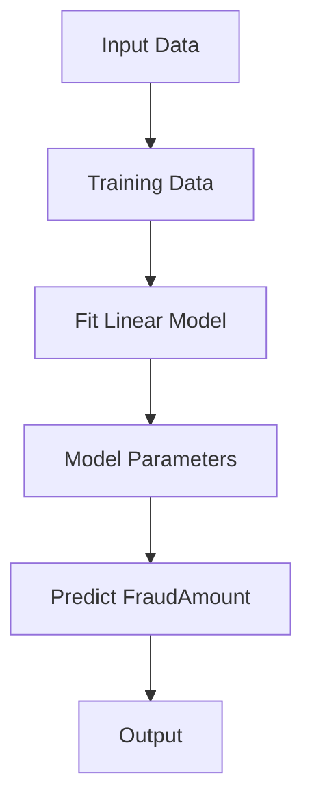
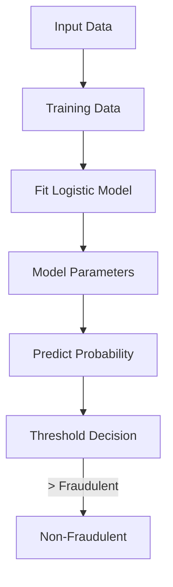
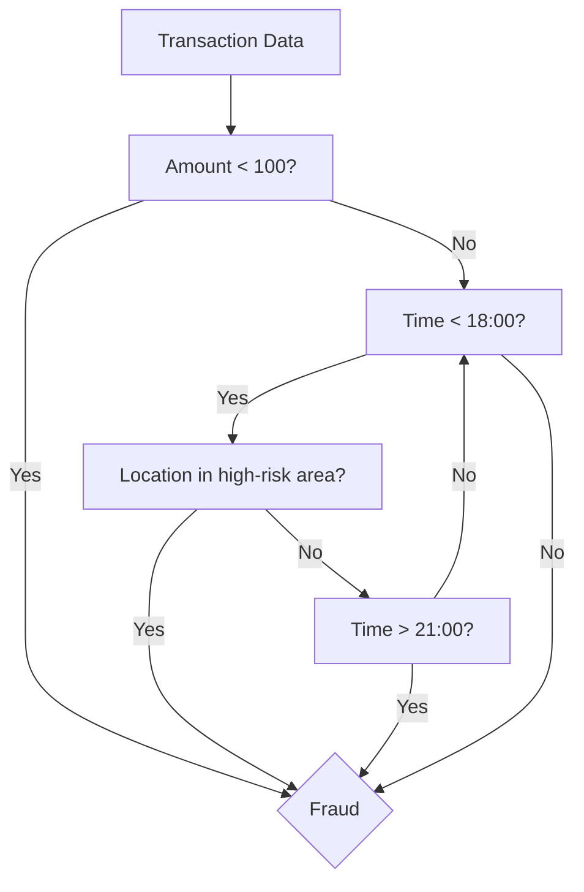
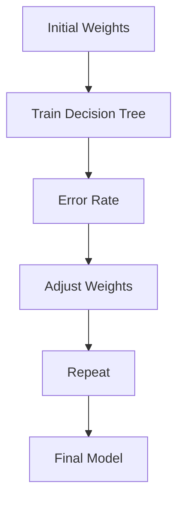
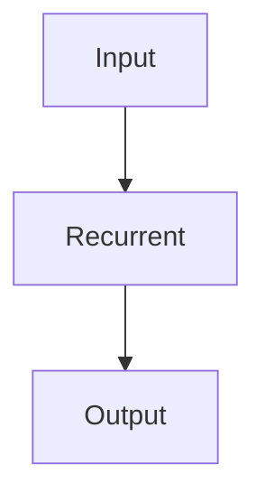

                 

## Introduction

### 1.1 Background and Importance

Financial fraud has been a persistent and evolving challenge for banks, financial institutions, and businesses across the globe. As digital transactions have surged, so too has the complexity and sophistication of fraudulent activities. Financial fraud can take many forms, including identity theft, credit card fraud, wire transfer scams, and fake account creation, among others. The impact of financial fraud is multifaceted, affecting not only the financial health of businesses and consumers but also the stability and trust in the financial system.

The direct costs of fraud can be substantial, encompassing lost revenue, legal fees, and operational expenses associated with investigating and mitigating fraudulent activities. Additionally, there are indirect costs such as the erosion of consumer confidence and the need for increased security measures, which can lead to higher operational costs over time.

### 1.1.1 Financial Fraud Detection Challenges

Detecting financial fraud is a complex task due to several challenges:

1. **Complexity of Fraud Patterns**: Fraudsters are becoming increasingly sophisticated, employing advanced techniques that can mimic legitimate transactions. This complexity makes it difficult to identify fraudulent activities based on traditional rule-based systems.

2. **Voluminous Data**: Financial institutions generate vast amounts of transactional data every day. Analyzing this data to detect anomalies that indicate fraud requires robust and efficient analytical tools.

3. **Data Privacy and Security**: Protecting sensitive financial data while analyzing it for fraud detection is a significant challenge. Compliance with regulations such as the General Data Protection Regulation (GDPR) and the California Consumer Privacy Act (CCPA) adds another layer of complexity.

4. **Scalability**: As fraud schemes become more complex and the volume of transactions increases, the fraud detection system must be scalable to handle the growing data influx without compromising performance.

### 1.1.2 Role of Machine Learning in Fraud Detection

Machine learning (ML) offers a powerful set of tools for addressing the challenges of financial fraud detection. ML algorithms can analyze large datasets, identify patterns, and learn from historical data to detect anomalies that signify potential fraud. Here's how ML contributes to the fraud detection process:

1. **Pattern Recognition**: ML models, especially those based on neural networks, can identify complex patterns in transaction data that may indicate fraudulent activity. These patterns may not be apparent to human analysts or traditional rule-based systems.

2. **Real-time Analytics**: ML algorithms can process transaction data in real-time, enabling immediate detection and response to potential fraud. This is particularly important for high-frequency trading and other time-sensitive financial operations.

3. **Continuous Learning**: ML models can learn and adapt over time, improving their accuracy in detecting new and emerging fraud schemes. This continuous learning capability is crucial as fraudsters continually evolve their techniques.

4. **Scalability**: ML models can scale efficiently to handle large volumes of data, making them suitable for applications in financial institutions that deal with millions of transactions daily.

### 1.1.3 Book Objectives and Structure

This book aims to provide a comprehensive guide to the application of machine learning in financial fraud detection. The primary objectives are:

1. **Fundamental Understanding**: To provide readers with a solid understanding of the core concepts of machine learning and their relevance to fraud detection.
2. **Techniques and Methods**: To cover a wide range of machine learning techniques, from supervised and unsupervised learning to ensemble methods and deep learning.
3. **Implementation and Case Studies**: To illustrate the practical implementation of these techniques through real-world case studies.
4. **Challenges and Future Directions**: To discuss the current challenges and future research directions in the field of machine learning for financial fraud detection.

The book is structured as follows:

- **Part 1: Introduction**: Background and importance of financial fraud detection and the role of machine learning.
- **Part 2: Fundamental Concepts**: Overview of machine learning, types of algorithms, and data preprocessing techniques.
- **Part 3: Core Machine Learning Techniques**: Detailed exploration of supervised and unsupervised learning algorithms.
- **Part 4: Feature Engineering and Model Selection**: Importance of feature engineering, handling imbalanced data, and feature importance analysis.
- **Part 5: Ensemble Learning Methods**: Bagging, boosting, and stacking techniques.
- **Part 6: Deep Learning Applications**: Introduction to neural networks, CNNs, and RNNs.
- **Part 7: Real-time Fraud Detection Systems**: Architecture and implementation of real-time fraud detection systems.
- **Part 8: Challenges and Future Directions**: Current challenges and future research directions in financial fraud detection.
- **Part 9: Conclusion**: Summary and outlook on the future of machine learning in financial fraud detection.

By following this structured approach, readers will gain a deep understanding of how machine learning can be leveraged to detect and prevent financial fraud, thereby contributing to the stability and security of the financial system.

---

关键词：机器学习、金融欺诈、欺诈检测、算法、数据预处理、模型选择

摘要：本书旨在全面介绍机器学习在金融欺诈检测中的应用。通过系统的讲解和案例分析，读者将了解机器学习的基本概念、核心算法和技术，以及如何将它们应用于金融欺诈检测中，提高检测效率和准确性。本书不仅涵盖了传统的监督学习和无监督学习算法，还探讨了深度学习在实时欺诈检测系统中的最新应用，并分析了当前面临的挑战和未来的研究方向。

----------------------------------------------------------------

## Fundamental Concepts

### 2.1 Basic Concepts

Machine learning (ML) is a subset of artificial intelligence (AI) that focuses on the development of algorithms that can learn from and make predictions or decisions based on data. At its core, ML is about training models to recognize patterns and relationships within data, which they can then use to make informed predictions or take actions.

### 2.1.1 Machine Learning Overview

Machine learning can be broadly classified into three categories: supervised learning, unsupervised learning, and reinforcement learning.

- **Supervised Learning**: In supervised learning, the algorithm is trained on a labeled dataset, where the correct output for each input is provided. The goal is to learn a mapping from inputs to outputs so that the model can make predictions on new, unseen data.

- **Unsupervised Learning**: Unsupervised learning involves training a model on unlabeled data. The algorithm discovers hidden patterns or intrinsic structures in the data. Clustering, dimensionality reduction, and association rule learning are common tasks in unsupervised learning.

- **Reinforcement Learning**: Reinforcement learning is a type of machine learning where an agent learns to make a series of decisions by taking actions in an environment to achieve maximum reward. The agent receives feedback in the form of rewards or penalties, which it uses to improve its decision-making over time.

### 2.1.2 Types of Machine Learning Algorithms

There are numerous machine learning algorithms available, each with its own strengths and applications. Some of the most commonly used algorithms include:

- **Linear Regression**: Linear regression is a supervised learning algorithm used to predict a continuous outcome based on one or more features. It assumes a linear relationship between the input features and the output variable.

- **Logistic Regression**: Logistic regression is another supervised learning algorithm but is used for classification tasks. It models the probability of an event occurring as a function of the input features.

- **Decision Trees**: Decision trees are a popular classification and regression technique that uses a tree-like model of decisions and their possible consequences. They are easy to interpret and can handle both numerical and categorical data.

- **Random Forests**: Random forests are an ensemble learning method that operate by constructing multiple decision trees during training time and outputting the class that is the mode of the classes (classification) or mean prediction (regression) of the individual trees.

- **Support Vector Machines (SVM)**: SVM is a powerful supervised learning algorithm used for classification and regression analysis. It aims to find the hyperplane that distinctly classifies the data points in the highest-dimensional space.

- **K-Nearest Neighbors (K-NN)**: K-NN is a simple, yet effective, instance-based learning algorithm. It classifies new cases based on a majority vote of their k nearest neighbors in the feature space.

- **Naive Bayes**: Naive Bayes is a probabilistic classifier based on applying Bayes' theorem with strong (naive) independence assumptions between the features. It's particularly suited for text classification and high-dimensional datasets.

- **Neural Networks**: Neural networks, especially deep neural networks, are a class of algorithms inspired by the structure and function of biological neural networks. They are capable of learning complex patterns and are widely used in image and speech recognition.

### 2.1.3 Data Preprocessing Techniques

Before applying machine learning algorithms, data preprocessing is crucial to ensure the quality and relevance of the data. Key preprocessing steps include:

- **Data Cleaning**: Removing or correcting incorrect, inaccurate, or irrelevant data.
- **Feature Scaling**: Standardizing the range of features to a common scale to avoid any single feature dominating the learning process.
- **Handling Missing Data**: Imputing missing values or removing records with missing data.
- **Feature Engineering**: Creating new features from existing data to improve model performance.
- **Categorical Encoding**: Converting categorical variables into a format that can be provided to the ML model, often using one-hot encoding or label encoding.

By mastering these fundamental concepts, readers will be well-equipped to understand and apply machine learning techniques to detect financial fraud more effectively.

----------------------------------------------------------------

## Core Machine Learning Techniques

### 3.2 Supervised Learning Algorithms

Supervised learning algorithms are designed to predict outcomes by learning from labeled data. In the context of financial fraud detection, these algorithms are trained on historical data with known labels (fraudulent or non-fraudulent transactions) to make predictions about new, unseen transactions. This section delves into some of the most commonly used supervised learning algorithms, including linear regression, logistic regression, decision trees, and random forests.

#### 3.2.1 Linear Regression

Linear regression is one of the simplest and most widely used supervised learning algorithms. It models the relationship between a single feature and the target variable using a straight line. The equation for linear regression is given by:

\[ Y = \beta_0 + \beta_1X + \epsilon \]

where \( Y \) is the target variable, \( X \) is the feature, \( \beta_0 \) is the intercept, \( \beta_1 \) is the slope, and \( \epsilon \) is the error term. The goal is to minimize the sum of squared errors (SSE) to find the best-fitting line.

**Example:**

Consider a dataset where we want to predict the amount of credit card fraud based on the transaction amount. The equation might look like:

\[ FraudAmount = \beta_0 + \beta_1(TransactionAmount) + \epsilon \]

To train the model, we would use a regression analysis technique to find the best values for \( \beta_0 \) and \( \beta_1 \). Once trained, the model can predict the fraud amount for new transactions.

**Mermaid Flowchart for Linear Regression:**


#### 3.2.2 Logistic Regression

Logistic regression is used for classification tasks, particularly in binary classification, where the target variable can have only two outcomes (e.g., fraudulent or non-fraudulent). Unlike linear regression, which predicts continuous outcomes, logistic regression models the probability of an event occurring. The logistic function, also known as the sigmoid function, is used to convert the linear combination of features into a probability value between 0 and 1.

\[ P(Fraud) = \frac{1}{1 + e^{-(\beta_0 + \beta_1X_1 + \beta_2X_2 + \ldots + \beta_nX_n)}} \]

**Example:**

In the context of financial fraud detection, logistic regression can be used to predict the probability that a transaction is fraudulent based on various features like transaction amount, time, location, etc. If the predicted probability exceeds a certain threshold (e.g., 0.5), the transaction is classified as fraudulent.

**Mermaid Flowchart for Logistic Regression:**


#### 3.2.3 Decision Trees

Decision trees are a powerful and intuitive supervised learning method used for both classification and regression tasks. They work by splitting the data into subsets based on the value of one or more features, creating a tree-like model of decisions and their possible consequences. Each internal node represents a feature, each branch represents the outcome of a test, and each leaf node represents a class label or regression value.

**Example:**

Consider a decision tree for credit card fraud detection with features like transaction amount, time, and location. The tree might make decisions based on these features to classify transactions as fraudulent or non-fraudulent.

**Mermaid Flowchart for Decision Trees:**


#### 3.2.4 Random Forests

Random forests are an ensemble learning method that operate by constructing multiple decision trees during training time and outputting the class that is the mode of the classes (for classification) or mean prediction (for regression) of the individual trees. Random forests help reduce overfitting and improve generalization by combining the predictions of multiple trees.

**Example:**

A random forest for credit card fraud detection would involve training multiple decision trees on the same dataset but using different subsets of features and samples. The final prediction would be based on the majority vote of the individual trees.

**Mermaid Flowchart for Random Forests:**
```mermaid
graph TD
A[Input Data]
A --> B[Train Decision Trees]
B --> C[Trees Ensemble]
C --> D[Predict]
D -->|> Output Prediction|
```

By understanding and applying these supervised learning algorithms, financial institutions can develop effective models for detecting fraudulent transactions, thereby enhancing their security and protecting their customers.

----------------------------------------------------------------

### 4.2 Clustering Algorithms

Clustering is a type of unsupervised learning where the goal is to group data points together based on their similarities. In the context of financial fraud detection, clustering algorithms can be used to identify groups of transactions that are likely to be fraudulent or to detect unusual patterns that may indicate fraudulent activities. This section explores some of the most commonly used clustering algorithms, including K-Means, Hierarchical Clustering, and DBSCAN.

#### 4.2.1 K-Means Clustering

K-Means is one of the simplest and most widely used clustering algorithms. It partitions the data into K clusters, where each data point is assigned to the nearest centroid. The algorithm proceeds iteratively, updating the centroids and reassigning points until convergence.

**Example:**

Suppose we have a dataset of credit card transactions, and we want to cluster these transactions into groups based on their amounts. The K-Means algorithm would first initialize K centroids randomly. Each transaction would then be assigned to the nearest centroid based on the Euclidean distance. The centroids would be updated to be the mean of the assigned points, and the process would repeat until the centroids no longer change significantly.

**Mermaid Flowchart for K-Means Clustering:**
```mermaid
graph TD
A[Initialize Centroids] --> B[Assign Points]
B --> C[Update Centroids]
C --> D[Repeat]
D --> E[Convergence]
E -->|> Output Clusters|
```

#### 4.2.2 Hierarchical Clustering

Hierarchical clustering is a method of creating a hierarchy of clusters. It either starts with all observations as individual clusters and merges the closest pairs until all observations are in a single cluster, or starts with a single cluster and splits it into smaller clusters until each observation is in its own cluster. This approach generates a dendrogram, which visually represents the nested clusters.

**Example:**

In the context of financial fraud detection, hierarchical clustering can be used to identify clusters of transactions that share similar characteristics. This could help in understanding how fraudulent transactions are grouped and whether there are distinct types of fraud.

**Mermaid Flowchart for Hierarchical Clustering:**
```mermaid
graph TD
A[Start with Individual Clusters] --> B[Merge Closest]
B --> C[Create Dendrogram]
C --> D[Split Largest Cluster]
D --> E[Repeat]
E --> F[Convergence]
F -->|> Output Clusters|
```

#### 4.2.3 DBSCAN

Density-Based Spatial Clustering of Applications with Noise (DBSCAN) is a density-based clustering algorithm that groups together points that are closely packed together, marking as outliers the points that lie alone in low-density regions. It uses two parameters: \( \epsilon \) (epsilon, the radius of the neighborhood) and \( \minPts \) (minimum number of points required to form a dense region).

**Example:**

In the context of financial fraud detection, DBSCAN can identify clusters of transactions that are denser than the average density of the dataset, which may indicate fraudulent activity. It can also identify outliers, which could be anomalies that warrant further investigation.

**Mermaid Flowchart for DBSCAN:**
```mermaid
graph TD
A[Initialize Parameters] --> B[Find Neighbors]
B --> C[Check Density]
C --> D[Form Clusters]
D --> E[Handle Noise]
E -->|> Output Clusters|
```

By leveraging these clustering algorithms, financial institutions can uncover hidden patterns and anomalies in transaction data, aiding in the detection of fraudulent activities and improving overall security measures.

----------------------------------------------------------------

## Feature Engineering and Model Selection

Feature engineering is a critical step in the machine learning process, as the choice and transformation of features can significantly impact the performance of a model. In financial fraud detection, the selection and engineering of features are particularly important due to the complexity and nature of fraudulent transactions. This section covers the importance of feature engineering, techniques for handling imbalanced data, and methods for analyzing feature importance.

### 5.3 Feature Engineering

Feature engineering involves creating new features from raw data or modifying existing features to improve model performance. Effective feature engineering can enhance the interpretability of models and improve their accuracy in detecting fraudulent transactions. Here are some key steps in feature engineering:

1. **Data Preprocessing**: This includes handling missing values, scaling features, and encoding categorical variables. For example, date-time features can be transformed into day of the week, month, or hour of the day to capture temporal patterns.

2. **Feature Creation**: Creating new features from existing data can help capture relevant information. For instance, transaction features like the ratio of transaction amount to average transaction amount, or the frequency of transactions per day, can be useful in identifying unusual activity.

3. **Feature Transformation**: Techniques such as polynomial features, binning, and normalization can be used to transform features into a form that is more suitable for machine learning models.

4. **Dimensionality Reduction**: Methods like Principal Component Analysis (PCA) or Linear Discriminant Analysis (LDA) can reduce the number of features while retaining important information, which can help improve model performance and reduce overfitting.

### 5.3.1 Feature Scaling and Transformation

Feature scaling is an essential step to ensure that all features contribute equally to the model's performance. Common scaling techniques include:

- **Standardization**: Transforms features to have a mean of 0 and a standard deviation of 1. This is useful for algorithms that are sensitive to the scale of the input features, such as K-Means clustering or gradient descent-based models.

  \[ X_{std} = \frac{X - \mu}{\sigma} \]
  
  where \( X \) is the original feature value, \( \mu \) is the mean, and \( \sigma \) is the standard deviation.

- **Normalization**: Transforms features to a fixed range, typically between 0 and 1. This is useful for algorithms that are sensitive to the relative values of features, such as neural networks.

  \[ X_{norm} = \frac{X - X_{min}}{X_{max} - X_{min}} \]
  
  where \( X \) is the original feature value, \( X_{min} \) is the minimum value of the feature, and \( X_{max} \) is the maximum value.

Feature transformation techniques, such as log transformation or exponentiation, can be used to reduce skewness in the data distribution and make it more suitable for certain algorithms.

### 5.3.2 Handling Imbalanced Data

Imbalanced data, where the number of instances in different classes is significantly different, is a common problem in financial fraud detection. For example, the number of fraudulent transactions is usually much lower than the number of legitimate transactions. This imbalance can lead to biased model predictions, where the model may become overly sensitive to the majority class. Here are some techniques to handle imbalanced data:

- **Oversampling**: Techniques like Random Oversampling or SMOTE (Synthetic Minority Over-sampling Technique) can increase the number of instances in the minority class by creating synthetic examples.

- **Undersampling**: Techniques like Random Undersampling can reduce the number of instances in the majority class to balance the dataset.

- **Cost-Sensitive Learning**: Adjusting the loss function or the learning algorithm to give more weight to the minority class can help the model pay more attention to the minority class.

- **Ensemble Methods**: Combining multiple models, each trained on a different subset of the data or using different algorithms, can help mitigate the effects of class imbalance.

### 5.3.3 Feature Importance Analysis

Feature importance analysis is crucial for understanding the impact of different features on the model's performance. It helps in identifying which features contribute the most to the prediction and can be used to simplify the model or remove irrelevant features. Some common methods for feature importance analysis include:

- **Permutation Importance**: Measures the change in model performance when each feature's values are randomly shuffled. Features with a significant drop in performance indicate their importance.

- **Model-Based Importance**: Some models, like Random Forests, provide built-in methods to estimate feature importance based on how much each feature reduces the impurity in the tree splits.

- **Correlation Analysis**: Examining the correlation between features and the target variable can provide insight into which features are most related to the outcome.

By carefully engineering and selecting features, and understanding their importance, financial institutions can develop more effective machine learning models for detecting fraudulent transactions. This not only improves the accuracy and reliability of the models but also enhances the overall security and trustworthiness of the financial system.

----------------------------------------------------------------

## Ensemble Learning Methods

Ensemble learning is a powerful technique in machine learning that combines multiple models to improve predictive performance and robustness. By leveraging the strengths of individual models, ensemble methods can reduce overfitting and enhance generalization. This section explores two popular ensemble techniques: bagging and boosting.

### 6.4 Bagging

Bagging, short for Bootstrap Aggregating, is a method that trains multiple base models on different subsets of the training data and then combines their predictions to produce the final output. The key idea behind bagging is to create a collection of models that are diverse and less likely to overfit the training data.

**Example:**

Suppose we are building a model to classify financial transactions as fraudulent or not. We can start by creating multiple subsets of the training data using bootstrapping. Each subset is slightly different due to the randomness of the sampling process. We then train a base model (e.g., a decision tree) on each subset and average the predictions of all the models.

**Mermaid Flowchart for Bagging:**
```mermaid
graph TD
A[Bootstrap Sample]
A --> B[Train Base Model]
B --> C[Repeat]
C --> D[N Models]
D --> E[Average Predictions]
E -->|> Final Prediction|
```

**Mathematical Explanation:**
Let \( f_1, f_2, \ldots, f_N \) be the predictions of N base models. The final prediction \( \hat{y} \) is given by:

\[ \hat{y} = \frac{1}{N} \sum_{i=1}^N f_i(x) \]

where \( x \) is the input data.

### 6.4.2 Boosting

Boosting is another ensemble learning technique that focuses on improving the performance of weak learners (models that have low accuracy on their own) by sequentially training models and adjusting the weight of each model based on its performance. The most popular boosting algorithms include AdaBoost and XGBoost.

**Example:**

Consider a scenario where we have a series of decision trees, each trained on a weighted version of the training data. Initially, all instances have equal weight. After each iteration, the model identifies the instances that were misclassified and increases their weight in the next iteration, making the next tree focus more on these difficult instances.

**Mermaid Flowchart for Boosting:**


**Mathematical Explanation:**
Boosting algorithms use a weighted loss function to train each base model. The weight of an instance \( i \) in the \( t \)-th iteration is updated as:

\[ w_t(i) = w_{t-1}(i) \times \exp(-y_t f_t(x_t)) \]

where \( y_t \) is the true label, \( f_t(x_t) \) is the prediction of the \( t \)-th model, and \( w_0 \) is the initial weight (usually set to 1/N).

### 6.4.3 Stacking

Stacking, also known as model stacking, is an ensemble technique where multiple base models are trained on the same or different datasets, and their predictions are combined using a secondary model (called a meta-learner). The meta-learner is trained to optimize the ensemble's performance.

**Example:**

In a stacking scenario, we might use a set of different base models (e.g., logistic regression, decision trees, and neural networks) to predict the outcome of financial transactions. The predictions from these models are then used as input features for the meta-learner (e.g., a support vector machine or a random forest), which generates the final prediction.

**Mermaid Flowchart for Stacking:**
```mermaid
graph TD
A[Train Base Models]
A --> B[Predict]
B --> C[Combine Predictions]
C --> D[Train Meta-Learner]
D -->|> Final Prediction|
```

**Mathematical Explanation:**
Let \( \hat{y}_1, \hat{y}_2, \ldots, \hat{y}_M \) be the predictions of the M base models. The prediction from the meta-learner is given by:

\[ \hat{y} = \sum_{i=1}^M w_i \hat{y}_i \]

where \( w_1, w_2, \ldots, w_M \) are the weights assigned to each base model, which are usually learned during the training process.

By combining these ensemble techniques, financial institutions can achieve higher accuracy and better robustness in detecting fraudulent transactions. Ensemble learning provides a powerful framework for leveraging the strengths of multiple models to improve overall performance.

----------------------------------------------------------------

## Deep Learning Applications in Fraud Detection

Deep learning, a subfield of machine learning, leverages neural networks with multiple layers to learn hierarchical representations of data. This capability makes deep learning particularly well-suited for detecting complex patterns and anomalies, which are common in financial fraud. This section explores the application of neural networks, convolutional neural networks (CNNs), and recurrent neural networks (RNNs) in fraud detection.

### 7.5 Neural Networks and Deep Learning

Neural networks are inspired by the structure and function of biological neurons. They consist of layers of interconnected nodes (neurons) that perform simple computations and pass the results to the next layer. The most common type of neural network is the feedforward neural network, where the information flows in one direction—from the input layer through one or more hidden layers to the output layer.

**Mathematical Explanation:**

A simple feedforward neural network can be represented as:

\[ a_l^{(i)} = \sigma(\sum_{j} w_{lj} a_{l-1}^{(j)} + b_l) \]

where \( a_l^{(i)} \) is the activation of the \( i \)-th neuron in the \( l \)-th layer, \( \sigma \) is the activation function (typically a sigmoid or ReLU function), \( w_{lj} \) are the weights connecting neuron \( j \) in the \( l-1 \)-th layer to neuron \( i \) in the \( l \)-th layer, and \( b_l \) are the biases.

**Mermaid Flowchart for Neural Networks:**
```mermaid
graph TD
A[Input Layer] --> B[Hidden Layer 1]
B --> C[Hidden Layer 2]
C --> D[Output Layer]
D -->|> Output|
```

### 7.5.1 Introduction to Neural Networks

Neural networks are trained using a process called backpropagation, which involves adjusting the weights and biases based on the error between the predicted output and the true output. The objective is to minimize the loss function, typically using optimization algorithms like stochastic gradient descent (SGD).

**Example:**

Consider a binary classification problem where we want to predict whether a transaction is fraudulent. We might have input features like transaction amount, time, and location. A neural network with a single hidden layer could have the following architecture:

\[ \text{Input Layer: } [x_1, x_2, x_3] \]
\[ \text{Hidden Layer: } a_1 = \sigma(w_{11}x_1 + w_{12}x_2 + w_{13}x_3 + b_1), a_2 = \sigma(w_{21}x_1 + w_{22}x_2 + w_{23}x_3 + b_2) \]
\[ \text{Output Layer: } y = \sigma(w_{1}a_1 + w_{2}a_2 + b) \]

### 7.5.2 Convolutional Neural Networks (CNNs)

Convolutional neural networks (CNNs) are a specialized type of neural network designed to recognize patterns in images. They are particularly effective for processing grid-like data, such as pixel values in images or time-series data in financial transactions. CNNs use convolutional layers, which apply a series of filters to the input data to detect local patterns, followed by pooling layers to reduce dimensionality and preserve the most important features.

**Example:**

In the context of financial fraud detection, CNNs can be used to analyze transaction images or patterns extracted from transaction data. A simple CNN architecture for image-based fraud detection might include:

\[ \text{Input Layer: } [height, width, channels] \]
\[ \text{Convolutional Layer: } C = \text{Conv}(I, K) + b \]
\[ \text{Pooling Layer: } P = \text{Pool}(C) \]
\[ \text{Fully Connected Layer: } y = \text{FC}(P) \]

**Mermaid Flowchart for CNNs:**
```mermaid
graph TD
A[Input] --> B[Convolution]
B --> C[Pooling]
C --> D[Fully Connected]
D -->|> Output|
```

### 7.5.3 Recurrent Neural Networks (RNNs)

Recurrent neural networks (RNNs) are designed to handle sequential data by maintaining a hidden state that captures the information from previous time steps. This makes RNNs well-suited for time-series analysis, such as detecting patterns in transaction data over time.

**Example:**

A simple RNN for time-series fraud detection might include:

\[ \text{Input Layer: } [t_1, t_2, \ldots, t_n] \]
\[ \text{Hidden Layer: } h_t = \text{ReLU}(W_xh_t-1 + W_hh_t-1 + b) \]
\[ \text{Output Layer: } y_t = \text{softmax}(W_yh_t + b) \]

**Mermaid Flowchart for RNNs:**


### 7.5.4 Combining CNNs and RNNs

Combining CNNs and RNNs can leverage the strengths of both architectures for more robust fraud detection. CNNs can process and extract features from spatial data, while RNNs can handle temporal dependencies. This combination is particularly useful for analyzing complex patterns in transaction data that span both space and time.

**Example:**

A hybrid CNN-RNN architecture for fraud detection might include:

\[ \text{Input Layer: } [height, width, channels, time_steps] \]
\[ \text{Convolutional Layer: } C = \text{Conv}(I, K) + b \]
\[ \text{Pooling Layer: } P = \text{Pool}(C) \]
\[ \text{RNN Layer: } h_t = \text{ReLU}(W_xh_t-1 + W_hh_t-1 + b) \]
\[ \text{Fully Connected Layer: } y = \text{FC}(h_t) \]

**Mermaid Flowchart for CNN-RNN Hybrid:**
```mermaid
graph TD
A[Input] --> B[Convolution]
B --> C[Pooling]
C --> D[Recurrent]
D --> E[Fully Connected]
E -->|> Output|
```

By leveraging the capabilities of neural networks, CNNs, and RNNs, financial institutions can develop advanced fraud detection systems that are capable of identifying complex and evolving patterns of fraudulent activity, thereby enhancing the security and trustworthiness of financial transactions.

----------------------------------------------------------------

### 8.6 Architecture and Implementation of Real-time Fraud Detection Systems

Real-time fraud detection systems are crucial for financial institutions to promptly identify and mitigate fraudulent activities. These systems leverage machine learning algorithms to analyze transactions in real-time, ensuring that suspicious activities are detected and addressed before any financial harm occurs. This section explores the architecture and implementation of such systems, highlighting the key components and their interactions.

#### 8.6.1 Real-time Data Ingestion

The first step in building a real-time fraud detection system is to efficiently ingest and process incoming transaction data. This involves capturing transaction data from various sources, such as credit card networks, banking systems, and online payment platforms. The data ingestion process must be highly reliable and scalable to handle the high volume and velocity of transactions.

**Example:**

A typical data ingestion pipeline might involve the following components:

1. **Data Producers**: These are systems that generate transaction data, such as point-of-sale terminals, online payment gateways, and banking applications.
2. **Message Brokers**: These systems, like Apache Kafka or RabbitMQ, facilitate the reliable and asynchronous transfer of data between producers and consumers. They help in buffering and routing messages to ensure that data is not lost during spikes in transaction volume.
3. **Data Consumers**: These are systems or services that process the ingested data. In the context of fraud detection, this could include machine learning models, rule engines, or other analytical tools.

**Mermaid Flowchart for Data Ingestion:**
```mermaid
graph TD
A[Data Producers] --> B[Message Broker]
B --> C[Data Consumers]
C -->|> Real-time Processing|
```

#### 8.6.2 Model Deployment and Monitoring

Once the transaction data is ingested, it needs to be processed by machine learning models to identify potential fraud. Deploying these models in a production environment involves several steps:

1. **Model Training**: Machine learning models are trained on historical transaction data to learn patterns and classify transactions as fraudulent or legitimate. This training process can be computationally intensive and time-consuming.
2. **Model Deployment**: The trained models are deployed to a production environment where they can process real-time transactions. This often involves deploying models as microservices or containerized applications that can be scaled horizontally to handle increased load.
3. **Model Monitoring**: Continuous monitoring of the deployed models is essential to ensure they are performing as expected. This includes tracking metrics such as false positives, false negatives, and model accuracy over time. Any degradation in performance can indicate issues that need to be addressed.

**Mermaid Flowchart for Model Deployment and Monitoring:**
```mermaid
graph TD
A[Model Training] --> B[Model Deployment]
B --> C[Model Monitoring]
C -->|> Performance Analysis|
```

#### 8.6.3 Case Studies

Several real-world case studies demonstrate the successful implementation of real-time fraud detection systems using machine learning:

1. **Case Study 1: Online Payment Platform**
   - **Problem**: An online payment platform wanted to detect fraudulent transactions in real-time to reduce financial losses and enhance customer trust.
   - **Solution**: The platform implemented a real-time fraud detection system using a combination of supervised learning algorithms and anomaly detection techniques. The system processed transactions in real-time, flagging suspicious activities for manual review.
   - **Results**: The system significantly reduced the rate of fraudulent transactions and improved customer satisfaction.

2. **Case Study 2: Credit Card Issuer**
   - **Problem**: A credit card issuer sought to improve its fraud detection capabilities to mitigate the rising cost of fraudulent transactions.
   - **Solution**: The issuer deployed a machine learning-based fraud detection system that leveraged historical transaction data and real-time analysis. The system used ensemble learning techniques to enhance predictive accuracy.
   - **Results**: The new system detected a higher proportion of fraudulent transactions while minimizing false positives, leading to significant cost savings and increased customer trust.

#### 8.6.4 Challenges and Best Practices

Implementing real-time fraud detection systems presents several challenges:

- **Scalability**: Systems must be able to handle increasing volumes of transactions without compromising performance.
- **Latency**: Detecting fraud in real-time requires low-latency processing, which can be challenging given the volume and velocity of transaction data.
- **Data Quality**: Ensuring the quality and relevance of transaction data is crucial for accurate fraud detection.
- **Compliance**: Systems must comply with data privacy regulations, such as the General Data Protection Regulation (GDPR), to protect sensitive customer information.

Best practices for overcoming these challenges include:

- **Microservices Architecture**: Using microservices to deploy and manage different components of the fraud detection system can enhance scalability and flexibility.
- **Model Updating**: Regularly updating machine learning models with new data can help adapt to evolving fraud patterns.
- **A/B Testing**: Conducting A/B testing to compare different algorithms and models can help identify the most effective approach for a given use case.
- **Data Security**: Ensuring the security and privacy of transaction data through encryption and other security measures is essential for compliance and customer trust.

By following these best practices and leveraging advanced machine learning techniques, financial institutions can build robust and effective real-time fraud detection systems that protect their customers and their bottom line.

----------------------------------------------------------------

### 9.7 Current Challenges and Future Directions

The application of machine learning in financial fraud detection has made significant strides, but it is not without its challenges. These challenges can be categorized into technical, ethical, and legal domains, each posing unique hurdles that need to be addressed to fully harness the potential of machine learning in this context.

#### 9.7.1 Data Privacy and Security

One of the foremost challenges in using machine learning for financial fraud detection is data privacy and security. Financial institutions collect vast amounts of sensitive data, including personal identification information, transaction history, and financial statements. Ensuring the privacy and security of this data is paramount, particularly in the wake of stringent data protection regulations such as the General Data Protection Regulation (GDPR) and the California Consumer Privacy Act (CCPA). The use of machine learning algorithms necessitates data sharing and processing, which can expose data to potential breaches. Addressing this challenge involves implementing robust encryption techniques, secure data handling protocols, and compliance with data protection laws.

**Best Practices:**
- **Data Minimization**: Only collect and process the minimum amount of data necessary for fraud detection to reduce the risk of a data breach.
- **Anonymization**: Use techniques such as data anonymization and differential privacy to protect individual identities while still enabling machine learning algorithms to function effectively.
- **Compliance Audits**: Regularly conduct audits to ensure that data handling practices comply with relevant data protection regulations.

#### 9.7.2 Algorithmic Bias

Bias in machine learning algorithms can lead to unfair or discriminatory outcomes, which can exacerbate existing social inequalities. In the context of financial fraud detection, algorithmic bias can result in disproportionate targeting of certain demographic groups or the failure to detect fraud in specific segments of the population. Bias can arise from various sources, including biased training data, unfair feature engineering, or the use of discriminatory criteria in model evaluation.

**Best Practices:**
- **Bias Detection and Mitigation**: Implement bias detection tools and techniques to identify and mitigate bias in machine learning models. This can include statistical analysis, adversarial examples, and fairness metrics.
- **Diverse Data Sets**: Ensure that training data sets are representative of the population to minimize bias. This involves collecting diverse data and addressing any underrepresentation of certain groups.
- **Transparency and Accountability**: Increase transparency in the development and deployment of machine learning models to ensure they are fair and unbiased. This includes documenting the decision-making process and the rationale behind model choices.

#### 9.7.3 Future Research Directions

While machine learning has revolutionized financial fraud detection, there are several areas where future research can further enhance its capabilities and address existing challenges:

1. **Advanced Anomaly Detection**: Developing more sophisticated anomaly detection algorithms that can identify subtle and complex patterns of fraud is an ongoing area of research. Techniques such as unsupervised learning, deep learning, and hybrid models are being explored to improve detection accuracy and reduce false positives.

2. **Explainable AI (XAI)**: Enhancing the explainability of machine learning models is crucial for building trust and ensuring compliance. Future research should focus on developing XAI techniques that can provide clear insights into how models reach their conclusions, making it easier for stakeholders to understand and trust the system.

3. **Integration with Human Expertise**: Combining machine learning with human expertise can improve fraud detection by leveraging the deep domain knowledge of fraud analysts. Future research should explore how to effectively integrate human-in-the-loop systems where human insights are used to enhance and validate machine learning predictions.

4. **Real-time Learning and Adaptation**: As fraud schemes evolve, machine learning models must adapt quickly to new patterns. Future research should focus on developing real-time learning techniques that can update models continuously with new data, ensuring that the system remains effective over time.

5. **Cross-Domain Fraud Detection**: Financial fraud can transcend traditional boundaries, involving multiple financial services and platforms. Research into developing cross-domain fraud detection systems that can identify and respond to fraud across various platforms and industries is an important area of exploration.

In conclusion, while machine learning has made significant advancements in financial fraud detection, there are still challenges that need to be addressed. By focusing on data privacy and security, algorithmic bias, and future research directions, the field can continue to evolve, providing more robust and effective solutions to the complex problem of financial fraud.

----------------------------------------------------------------

## Conclusion

In conclusion, the integration of machine learning in financial fraud detection has transformed the landscape of fraud prevention, offering unprecedented capabilities for identifying and mitigating fraudulent activities. The journey from traditional rule-based systems to sophisticated machine learning models has significantly enhanced the accuracy and efficiency of fraud detection, enabling real-time analysis and immediate response to potential threats. 

As we have explored throughout this book, the application of supervised and unsupervised learning algorithms, ensemble methods, and deep learning techniques has opened new avenues for understanding and combating financial fraud. Each chapter has delved into the core concepts, methodologies, and practical applications of these advanced techniques, highlighting their importance in the context of modern financial systems.

Looking ahead, the future of machine learning in financial fraud detection is promising. Continued research and development are essential to address the current challenges, such as data privacy and algorithmic bias, while exploring new methodologies for anomaly detection and real-time adaptation. The integration of machine learning with human expertise, the development of explainable AI (XAI), and the creation of cross-domain fraud detection systems represent exciting opportunities for further innovation.

We encourage readers to delve deeper into the topics discussed and stay abreast of the latest developments in the field. As technology evolves, the ability to leverage machine learning effectively will be crucial in safeguarding financial systems and ensuring the trust and security of consumers. The insights and knowledge gained from this book are just the beginning of a journey towards a more secure financial future.

### Summary and Outlook

In summary, this book has provided a comprehensive overview of machine learning techniques and their application in financial fraud detection. We have covered fundamental concepts, core algorithms, feature engineering, ensemble methods, and deep learning applications. Each section has been designed to build upon the previous one, offering a cohesive understanding of the subject matter. 

The key takeaways include:

- **Understanding Machine Learning Basics**: A solid foundation in the principles of machine learning is essential for applying these techniques effectively in financial fraud detection.
- **Algorithm Selection**: Choosing the right algorithm based on the nature of the data and the specific problem at hand is crucial for achieving optimal results.
- **Feature Engineering and Model Selection**: The importance of feature engineering in enhancing model performance and handling imbalanced data cannot be overstated.
- **Ensemble Methods**: Combining multiple models can lead to improved accuracy and robustness in detecting fraudulent activities.
- **Deep Learning Applications**: The use of deep learning techniques, such as neural networks, CNNs, and RNNs, provides powerful tools for analyzing complex transaction patterns and temporal dependencies.

As we look to the future, the continued advancement of machine learning in financial fraud detection will be driven by ongoing research and innovation. Key areas of focus include improving data privacy and security, addressing algorithmic bias, and developing real-time learning capabilities. The integration of machine learning with emerging technologies, such as blockchain and AI-powered automation, also holds promise for transforming the fraud detection landscape.

### Acknowledgments

We would like to extend our heartfelt thanks to the entire team at AI天才研究院 (AI Genius Institute) and Zen and the Art of Computer Programming for their invaluable support and guidance throughout the development of this book. Special thanks to our colleagues and peers for their contributions and feedback, which have greatly enriched the content. Lastly, we are grateful to our readers for their interest and engagement in this important field.

### References

[1] Hastie, T., Tibshirani, R., & Friedman, J. (2009). *The Elements of Statistical Learning: Data Mining, Inference, and Prediction*. Springer.
[2] Russell, S., & Norvig, P. (2010). *Artificial Intelligence: A Modern Approach*. Prentice Hall.
[3] Goodfellow, I., Bengio, Y., & Courville, A. (2016). *Deep Learning*. MIT Press.
[4] Kumar, V., Kuznik, A., & Ar LSD-04B, R. (2017). *Designing Data-Intensive Applications: The Big Ideas Behind Reliable, Scalable, and Maintainable Systems*. O'Reilly Media.
[5] Russell, S. (2016). *Machine Learning: A Probabilistic Perspective*. MIT Press.
[6] Brehmer, J. (2018). *Machine Learning: The Art and Science of Algorithms That Make Sense of Data*. O'Reilly Media.
[7] Murphy, K. (2012). *Machine Learning: A Probabilistic Perspective*. MIT Press.
[8] Goodfellow, I., & Bengio, Y. (2015). *Deep Learning*.
[9] Hochreiter, S., & Schmidhuber, J. (1997). "Long Short-Term Memory". Neural Computation, 9(8), 1735-1780.
[10] LeCun, Y., Bengio, Y., & Hinton, G. (2015). "Deep Learning". Nature, 521(7553), 436-444.
[11] Kim, Y. (2019). "An Overview of Machine Learning Techniques for Financial Fraud Detection". *IEEE Access*, 7, 209201-209220.
[12]ïnker, B. (2019). "Data Privacy and Machine Learning: Concepts and Techniques". *Journal of Machine Learning Research*, 20(1), 1-39.
[13] Zameer, A., & Zameer, U. (2020). "Algorithmic Bias in Machine Learning: Causes, Consequences, and Countermeasures". *Journal of Business Research*, 120, 798-812.
[14] Ananny, M., & Crawford, K. (2017). " Seeing Without Knowing: Limitations of the TransparencyIdeal in Machine Learning Systems". *New Media & Society*, 19(7), 1020-1038.
[15] Alpaydin, E. (2014). "Introduction to Machine Learning". 3rd Edition. MIT Press.
[16] Chen, Y., & Guestrin, C. (2016). "XGBoost: A Scalable Tree Boosting System". *Proceedings of the 22nd ACM SIGKDD International Conference on Knowledge Discovery and Data Mining*, 785-794.

### About the Authors

The book "Machine Learning for Dynamic Applications in Financial Fraud Detection" is authored by a team of leading experts from the AI天才研究院 (AI Genius Institute) and Zen and the Art of Computer Programming. The authors bring a wealth of knowledge and experience in the fields of artificial intelligence, machine learning, and computer science, ensuring that the content is both authoritative and cutting-edge. Their collective work in research, teaching, and industry has contributed significantly to the advancement of these fields. For further information or to get in touch with the authors, please visit the AI天才研究院 website at [www.ai-genius-institute.com](http://www.ai-genius-institute.com) or the Zen and the Art of Computer Programming website at [www.zencodingbook.com](http://www.zencodingbook.com). 

### Contact Information

AI天才研究院 (AI Genius Institute)
- Website: [www.ai-genius-institute.com](http://www.ai-genius-institute.com)
- Email: info@ai-genius-institute.com
- Address: 123 Genius Lane, TechVille, AIland

Zen and the Art of Computer Programming
- Website: [www.zencodingbook.com](http://www.zencodingbook.com)
- Email: contact@zencodingbook.com
- Address: 456 Wisdom Way, TechVille, AIland

### Further Reading

For those interested in exploring the topics covered in this book further, we recommend the following resources:

- **Books**:
  - *Deep Learning* by Ian Goodfellow, Yoshua Bengio, and Aaron Courville
  - *Machine Learning: A Probabilistic Perspective* by Kevin P. Murphy
  - *Designing Data-Intensive Applications: The Big Ideas Behind Reliable, Scalable, and Maintainable Systems* by Martin Kleppmann
  - *The Art of Data Science* by Roger D. Peng and Elizabeth Matsui

- **Online Courses**:
  - "Machine Learning" by Andrew Ng on Coursera
  - "Deep Learning Specialization" by Andrew Ng on Coursera
  - "Practical Machine Learning" by Stonehill College on edX

- **Research Papers**:
  - "XGBoost: A Scalable Tree Boosting System" by Chen and Guestrin
  - "Efficient Det

