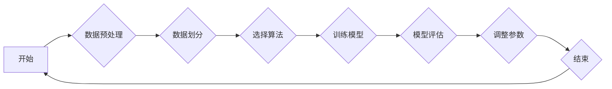

                 

## 《机器学习在金融欺诈检测中的应用》

### 关键词：机器学习，金融欺诈，检测技术，应用案例

### 摘要：随着金融科技的不断发展，金融欺诈问题日益严重。机器学习技术在金融欺诈检测领域展现出了巨大的潜力。本文从问题背景出发，系统介绍了机器学习的基本概念、原理及应用，重点探讨了机器学习在金融欺诈检测中的应用，通过实际案例分析了机器学习在金融欺诈检测中的具体实现，并提出了未来研究方向和最佳实践建议。

----------------------------------------------------------------

### 第一部分：引言

#### 1.1 问题背景

随着互联网和金融科技的快速发展，金融欺诈问题日益凸显。金融欺诈不仅给金融机构造成巨大的经济损失，也严重损害了消费者的信任和利益。传统的欺诈检测方法如规则引擎、统计分析等在一定程度上能够识别欺诈行为，但随着欺诈手段的不断翻新，这些方法的检测效果逐渐减弱。

#### 1.1.1 机器学习概述

机器学习是一种通过数据驱动的方式进行问题求解的方法，其核心目标是让计算机从数据中学习规律，并利用这些规律对未知数据进行预测或决策。近年来，机器学习技术在各个领域取得了显著的成果，包括自然语言处理、计算机视觉、推荐系统等。

#### 1.1.2 金融欺诈概述

金融欺诈是指以非法占有为目的，利用金融工具或金融交易进行的欺诈行为。常见的金融欺诈类型包括信用卡欺诈、贷款欺诈、保险欺诈等。金融欺诈的特点是隐蔽性强、手段多样、影响广泛。

#### 1.2 目标与应用领域

本文的目标是探讨机器学习在金融欺诈检测中的应用，分析其在提高检测精度、降低误报率、提高处理效率等方面的优势。应用领域包括银行、保险、证券等金融行业。

### 第二部分：机器学习基础

#### 2.1 基本概念

机器学习的基本概念包括监督学习、无监督学习和强化学习。其中，监督学习是最常见的一种机器学习方法，通过已有数据的标签信息来训练模型，从而对新数据进行预测。无监督学习则是在没有标签信息的情况下，通过挖掘数据中的隐含规律进行聚类或降维。强化学习则是通过奖励机制来引导模型不断学习，以达到最优策略。

#### 2.2 算法原理

机器学习算法的原理是通过建立数学模型，将输入特征映射到输出结果。常见的机器学习算法包括线性回归、逻辑回归、决策树、支持向量机、神经网络等。每种算法都有其特定的数学模型和适用场景。

#### 2.3 数据预处理

数据预处理是机器学习的重要环节，包括数据清洗、数据归一化和特征工程。数据清洗主要是去除噪声数据和缺失数据，数据归一化是为了使不同特征具有相同的尺度，特征工程则是通过构造新的特征来提高模型的性能。

### 第三部分：金融欺诈检测

#### 3.1 欺诈类型与特点

金融欺诈的类型包括信用卡欺诈、贷款欺诈、保险欺诈等。每种欺诈类型都有其特定的特点，如信用卡欺诈通常表现为大额消费、短时间内频繁交易等；贷款欺诈则可能表现为虚假身份信息、异常收入来源等。

#### 3.2 检测方法

金融欺诈检测的方法包括传统方法和机器学习方法。传统方法主要包括规则引擎和统计分析，而机器学习方法则包括监督学习和无监督学习。其中，监督学习方法在金融欺诈检测中表现出色，能够有效地识别欺诈行为。

#### 3.2.1 统计方法

统计方法是通过计算数据的统计特征，如均值、方差等，来判断数据是否异常。常见的统计方法包括标准差法、三倍标准差法等。然而，统计方法在处理复杂、多变的金融欺诈行为时存在一定的局限性。

#### 3.2.2 传统机器学习方法

传统机器学习方法包括决策树、支持向量机、神经网络等。这些方法通过训练模型，对数据进行分类或回归，从而实现欺诈检测。与传统方法相比，机器学习方法能够自动学习数据中的规律，提高检测的精度。

#### 3.2.3 深度学习方法

深度学习方法是近年来兴起的一种机器学习方法，通过多层神经网络对数据进行建模，从而实现复杂的模式识别。在金融欺诈检测中，深度学习方法能够自动提取特征，提高检测的精度。

### 第四部分：机器学习在金融欺诈检测中的应用

#### 4.1 应用场景

机器学习在金融欺诈检测中的应用场景包括信用卡欺诈检测、网络欺诈检测等。在信用卡欺诈检测中，机器学习能够识别异常交易行为，提高欺诈检测的准确率；在网络欺诈检测中，机器学习能够检测异常登录行为、异常交易行为等。

#### 4.2 案例分析

本文将通过两个实际案例，分析机器学习在金融欺诈检测中的应用。第一个案例是信用卡欺诈检测系统，该系统通过监督学习算法对信用卡交易数据进行分析，识别欺诈交易；第二个案例是网络欺诈检测系统，该系统通过深度学习算法检测网络异常行为，提高欺诈检测的准确性。

### 第五部分：实践与案例分析

#### 5.1 实践项目

本文将介绍一个金融欺诈检测项目的实践，包括项目介绍、系统设计与实现。项目介绍将简要介绍项目的背景、目标和挑战；系统设计与实现将详细描述项目的系统架构、数据流程、算法实现等。

#### 5.2 案例分析

本文将分析两个金融欺诈检测案例，包括案例一：信用卡欺诈检测系统和案例二：网络欺诈检测系统。案例一将分析信用卡欺诈检测系统的设计、实现和效果；案例二将分析网络欺诈检测系统的设计、实现和效果。

### 第六部分：结论与展望

#### 6.1 总结

本文从问题背景出发，系统介绍了机器学习在金融欺诈检测中的应用，分析了机器学习在金融欺诈检测中的优势和应用案例，并提出了未来研究方向和最佳实践建议。

#### 6.2 展望未来

随着机器学习技术的不断发展，金融欺诈检测将朝着更加智能化、精准化的方向发展。未来，机器学习将在金融欺诈检测中发挥更大的作用，为金融机构和消费者提供更高效、更安全的金融服务。

### 第七部分：注意事项

#### 7.1 注意事项

在使用机器学习进行金融欺诈检测时，需要注意以下几点：

1. 数据质量：保证数据的质量，包括数据的完整性、准确性和一致性。
2. 特征选择：合理选择特征，提高模型的性能。
3. 模型调优：通过交叉验证等方法对模型进行调优，提高模型的准确性。
4. 法律合规：确保机器学习模型的实现和应用符合相关法律法规。

#### 7.2 拓展阅读

1. 《机器学习：一种算法性方法》（作者：Tom M. Mitchell）
2. 《深度学习》（作者：Ian Goodfellow、Yoshua Bengio、Aaron Courville）
3. 《金融科技：创新与挑战》（作者：张晓栋）

### 作者

作者：AI天才研究院/AI Genius Institute & 禅与计算机程序设计艺术 /Zen And The Art of Computer Programming

----------------------------------------------------------------

在接下来的部分，我们将对每个章节进行详细的阐述，深入探讨机器学习在金融欺诈检测中的应用。敬请期待！## 第一部分：引言

### 1.1 问题背景

金融欺诈是一种广泛存在的经济犯罪行为，其手段多样、隐蔽性强，对金融机构和消费者的利益造成了严重的损害。随着金融科技的快速发展，金融欺诈问题日益严重，传统的欺诈检测方法已难以应对日益复杂的欺诈行为。

#### 1.1.1 机器学习概述

机器学习是一种通过数据驱动的方式进行问题求解的方法，其核心目标是让计算机从数据中学习规律，并利用这些规律对未知数据进行预测或决策。机器学习在多个领域取得了显著的成果，如自然语言处理、计算机视觉、推荐系统等。近年来，随着大数据和计算能力的提升，机器学习在金融欺诈检测中也展现出了巨大的潜力。

#### 1.1.2 金融欺诈概述

金融欺诈是指以非法占有为目的，利用金融工具或金融交易进行的欺诈行为。金融欺诈的类型包括信用卡欺诈、贷款欺诈、保险欺诈等。信用卡欺诈是指使用他人的信用卡进行非法消费；贷款欺诈是指以虚假的身份或信息申请贷款；保险欺诈是指通过欺骗保险公司获得赔偿。

金融欺诈的特点是隐蔽性强、手段多样、影响广泛。隐蔽性强表现为欺诈行为通常不易被发现，直到造成损失时才被察觉；手段多样表现为欺诈者会利用各种手段进行欺诈，如伪造身份、虚假交易等；影响广泛表现为金融欺诈不仅对金融机构造成经济损失，也会损害消费者的信任和利益。

#### 1.2 目标与应用领域

本文的目标是探讨机器学习在金融欺诈检测中的应用，分析其在提高检测精度、降低误报率、提高处理效率等方面的优势。具体应用领域包括银行、保险、证券等金融行业。

在银行领域，机器学习可以用于信用卡欺诈检测、贷款欺诈检测等；在保险领域，机器学习可以用于保险欺诈检测、风险评估等；在证券领域，机器学习可以用于股票市场预测、异常交易检测等。

通过本文的探讨，我们希望能够为金融机构提供有效的欺诈检测手段，提高金融系统的安全性和稳定性，同时为消费者提供更安全、更可靠的金融服务。

### 1.3 机器学习与金融欺诈检测的关系

机器学习与金融欺诈检测有着密切的关系。机器学习技术为金融欺诈检测提供了一种新的方法，能够从海量数据中自动学习欺诈行为模式，提高检测的精度和效率。

传统的金融欺诈检测方法主要依赖于规则引擎和统计分析。规则引擎通过预设的规则对交易进行监控，一旦交易行为与规则不符，则视为可疑交易。这种方法存在一定的局限性，因为欺诈行为是不断变化的，预设的规则难以涵盖所有可能的欺诈行为。

统计分析方法通过对历史数据进行分析，识别异常交易行为。这种方法虽然具有一定的鲁棒性，但在处理复杂、多变的金融欺诈行为时存在一定的局限性。

相比之下，机器学习技术具有以下几个优势：

1. **自动学习**：机器学习能够从历史数据中自动学习欺诈行为模式，不需要人为设定规则或阈值，能够适应不断变化的欺诈行为。
2. **高精度**：机器学习模型通过对大量数据进行训练，能够提高检测的精度，减少误报率。
3. **高效率**：机器学习算法能够快速处理海量数据，提高检测的效率。

因此，机器学习技术在金融欺诈检测中具有广泛的应用前景。通过本文的探讨，我们希望能够深入理解机器学习在金融欺诈检测中的应用，为金融机构提供有效的欺诈检测手段。

### 1.4 机器学习在金融欺诈检测中的应用场景

机器学习在金融欺诈检测中的应用场景非常广泛，主要包括以下几类：

1. **信用卡欺诈检测**：信用卡欺诈是金融欺诈中最常见的一种形式。机器学习模型通过对信用卡交易数据进行训练，可以识别出异常交易行为，从而有效降低信用卡欺诈的发生率。
2. **贷款欺诈检测**：贷款欺诈是指通过虚假身份或信息获得贷款。机器学习模型可以通过分析贷款申请者的历史数据和行为特征，识别出潜在的欺诈行为。
3. **保险欺诈检测**：保险欺诈涉及虚假理赔、虚假保险申请等行为。机器学习模型可以通过分析保险申请者的数据和理赔记录，识别出欺诈行为。
4. **网络欺诈检测**：随着互联网的发展，网络欺诈行为也日益增多。机器学习模型可以通过分析网络行为数据，如登录行为、交易行为等，识别出异常行为。
5. **异常交易检测**：在银行和支付系统中，机器学习模型可以通过分析交易数据，识别出异常交易行为，如大额交易、高频交易等。

通过这些应用场景，机器学习技术能够为金融机构提供更高效、更精准的欺诈检测手段，从而提高金融系统的安全性和稳定性。

### 1.5 文章结构

本文的结构如下：

1. **第一部分：引言**：介绍问题背景、目标和应用领域。
2. **第二部分：机器学习基础**：介绍机器学习的基本概念、原理和应用。
3. **第三部分：金融欺诈检测**：介绍金融欺诈的概念、类型和特点。
4. **第四部分：机器学习在金融欺诈检测中的应用**：讨论机器学习在金融欺诈检测中的应用。
5. **第五部分：实践与案例分析**：分析具体的金融欺诈检测项目。
6. **第六部分：结论与展望**：总结全文内容，展望未来发展方向。

通过上述结构，本文将系统、全面地探讨机器学习在金融欺诈检测中的应用，为金融机构提供有效的欺诈检测手段。

### 1.6 结论

金融欺诈检测在金融行业中具有重要意义，能够有效降低金融机构的经济损失，保护消费者的利益。随着机器学习技术的不断发展，其在金融欺诈检测中的应用前景广阔。本文从问题背景出发，介绍了机器学习的基本概念、原理和应用，探讨了机器学习在金融欺诈检测中的应用，并通过实际案例分析了机器学习在金融欺诈检测中的具体实现。未来，随着机器学习技术的不断进步，相信金融欺诈检测将变得更加高效、精准，为金融机构和消费者提供更加安全的金融服务。

----------------------------------------------------------------

### 第二部分：机器学习基础

#### 2.1 基本概念

机器学习（Machine Learning，ML）是一种通过数据驱动的方式进行问题求解的方法。其核心目标是让计算机从数据中自动学习规律，并利用这些规律对未知数据进行预测或决策。机器学习的主要任务是分类、回归、聚类、降维等。

#### 2.1.1 监督学习

监督学习（Supervised Learning）是最常见的机器学习方法。在监督学习中，我们有一组输入数据和相应的输出标签，通过训练模型，让模型学会将新的输入数据映射到正确的输出标签上。监督学习的核心是损失函数（Loss Function）和优化算法（Optimization Algorithm）。

1. **损失函数**：用于衡量预测结果与真实结果之间的差异。常见的损失函数包括均方误差（Mean Squared Error，MSE）、交叉熵损失（Cross-Entropy Loss）等。
2. **优化算法**：用于最小化损失函数。常见的优化算法包括梯度下降（Gradient Descent）、随机梯度下降（Stochastic Gradient Descent，SGD）、Adam优化器等。

#### 2.1.2 无监督学习

无监督学习（Unsupervised Learning）是在没有标签信息的情况下，通过挖掘数据中的隐含规律进行聚类或降维。无监督学习主要包括以下几种方法：

1. **聚类算法**：用于将数据分为多个类别。常见的聚类算法包括K均值（K-Means）、层次聚类（Hierarchical Clustering）、DBSCAN等。
2. **降维算法**：用于减少数据维度，保持数据的主要信息。常见的降维算法包括主成分分析（Principal Component Analysis，PCA）、线性判别分析（Linear Discriminant Analysis，LDA）、t-SNE等。

#### 2.1.3 强化学习

强化学习（Reinforcement Learning，RL）是一种通过与环境互动进行学习的方法。在强化学习中，模型通过不断地接收奖励（Reward）和惩罚（Penalty）来学习最优策略。强化学习的主要任务是找到最优策略，使得总奖励最大化。

1. **状态（State）**：模型所处的环境。
2. **动作（Action）**：模型可以选择的行动。
3. **奖励（Reward）**：动作带来的奖励，用于指导模型学习。
4. **策略（Policy）**：从状态中选择动作的策略。

#### 2.2 算法原理

机器学习算法的原理是通过建立数学模型，将输入特征映射到输出结果。常见的机器学习算法包括线性回归、逻辑回归、决策树、支持向量机、神经网络等。

1. **线性回归（Linear Regression）**：用于预测连续值。线性回归模型的数学公式为：
   $$
   y = \beta_0 + \beta_1 \cdot x
   $$
   其中，$y$ 是预测值，$x$ 是输入特征，$\beta_0$ 和 $\beta_1$ 是模型参数。

2. **逻辑回归（Logistic Regression）**：用于预测概率，特别适用于二分类问题。逻辑回归模型的数学公式为：
   $$
   P(y=1) = \frac{1}{1 + e^{-(\beta_0 + \beta_1 \cdot x})}
   $$
   其中，$P(y=1)$ 是预测概率，$\beta_0$ 和 $\beta_1$ 是模型参数。

3. **决策树（Decision Tree）**：通过一系列的判断条件对数据进行分类或回归。决策树的构建过程包括特征选择、节点划分、合并等。

4. **支持向量机（Support Vector Machine，SVM）**：通过找到一个最优的超平面，将不同类别的数据分隔开。SVM的数学公式为：
   $$
   \omega \cdot x + b = 0
   $$
   其中，$\omega$ 是法向量，$x$ 是特征向量，$b$ 是偏置。

5. **神经网络（Neural Network）**：通过模拟人脑神经网络的结构和功能，对数据进行分类或回归。神经网络的基本结构包括输入层、隐藏层和输出层。

#### 2.3 数据预处理

数据预处理是机器学习的重要环节，主要包括数据清洗、数据归一化和特征工程。

1. **数据清洗**：去除噪声数据、处理缺失数据和异常值。常见的方法包括填充缺失值、删除异常值等。

2. **数据归一化**：将不同特征的数据缩放到相同的尺度，便于模型训练。常见的方法包括最小-最大缩放、Z-Score缩放等。

3. **特征工程**：通过构造新的特征或转换现有特征，提高模型的性能。常见的方法包括特征提取、特征选择等。

### 2.4 核心概念与联系

为了深入理解机器学习在金融欺诈检测中的应用，我们需要掌握以下核心概念和联系：

1. **数据挖掘**：数据挖掘是机器学习的一个重要分支，旨在从大量数据中提取有价值的信息。在金融欺诈检测中，数据挖掘可以帮助我们识别潜在的欺诈行为。

2. **监督学习**：监督学习是机器学习的主要方法，通过已有数据的标签信息来训练模型，从而对新数据进行预测。在金融欺诈检测中，监督学习可以用于训练欺诈检测模型。

3. **无监督学习**：无监督学习在金融欺诈检测中也有应用，如聚类分析可以帮助我们发现异常交易行为。

4. **特征工程**：特征工程是提高模型性能的关键步骤。在金融欺诈检测中，通过特征工程可以提取出有效的特征，提高欺诈检测的准确性。

### 2.5 核心概念属性特征对比表格

| 名称 | 描述 | 属性特征 |
| ---- | ---- | ---- |
| 数据挖掘 | 从大量数据中提取有价值信息 | 数据量大、多样性、不确定性 |
| 监督学习 | 使用标签数据进行预测 | 输入特征、输出标签、损失函数 |
| 无监督学习 | 无标签数据进行聚类等 | 输入特征、聚类中心、距离度量 |
| 特征工程 | 构造或转换特征以提高模型性能 | 特征选择、特征提取、特征转换 |

### 2.6 ER实体关系图架构

为了更好地理解机器学习在金融欺诈检测中的应用，我们可以使用ER（实体关系）图来描述相关实体及其关系。

```mermaid
erDiagram
    Customer ||--|{ Transaction } : 进行交易
    Account ||--|{ Transaction } : 开户交易
    Bank ||--|{ Account } : 开户银行
    Fraud ||--|{ Transaction } : 欺诈交易
    Transaction ||--|{ Fraud } : 交易欺诈
```

在上面的ER图中，`Customer`、`Account`、`Bank` 和 `Fraud` 是实体，`Transaction` 是关系实体。每个实体都有其特定的属性和关系，通过这些关系，我们可以构建出一个完整的金融欺诈检测系统。

通过以上内容，我们对机器学习的基本概念、原理和应用有了更深入的理解。在接下来的章节中，我们将进一步探讨机器学习在金融欺诈检测中的具体应用，并通过实际案例进行分析。敬请期待！

### 2.7 数学模型和公式

在机器学习算法中，数学模型和公式起着至关重要的作用。以下将详细讲解一些常见的机器学习算法及其背后的数学模型和公式。

#### 线性回归

线性回归是一种用于预测连续值的机器学习算法。其数学模型可以表示为：

$$
y = \beta_0 + \beta_1 \cdot x
$$

其中，$y$ 是预测值，$x$ 是输入特征，$\beta_0$ 和 $\beta_1$ 是模型参数。

线性回归的损失函数通常采用均方误差（MSE），其公式为：

$$
MSE = \frac{1}{n} \sum_{i=1}^{n} (y_i - \hat{y}_i)^2
$$

其中，$n$ 是样本数量，$y_i$ 是第 $i$ 个样本的真实值，$\hat{y}_i$ 是第 $i$ 个样本的预测值。

为了最小化损失函数，我们通常使用梯度下降（Gradient Descent）算法来优化模型参数。梯度下降的迭代公式为：

$$
\beta_0 = \beta_0 - \alpha \cdot \frac{\partial}{\partial \beta_0} MSE
$$

$$
\beta_1 = \beta_1 - \alpha \cdot \frac{\partial}{\partial \beta_1} MSE
$$

其中，$\alpha$ 是学习率，用于控制迭代过程的步长。

#### 逻辑回归

逻辑回归是一种用于预测概率的机器学习算法，特别适用于二分类问题。其数学模型可以表示为：

$$
P(y=1) = \frac{1}{1 + e^{-(\beta_0 + \beta_1 \cdot x)}}
$$

其中，$P(y=1)$ 是预测概率，$\beta_0$ 和 $\beta_1$ 是模型参数。

逻辑回归的损失函数通常采用交叉熵损失（Cross-Entropy Loss），其公式为：

$$
CE = -\sum_{i=1}^{n} y_i \cdot \ln(\hat{y}_i) + (1 - y_i) \cdot \ln(1 - \hat{y}_i)
$$

其中，$n$ 是样本数量，$y_i$ 是第 $i$ 个样本的真实标签，$\hat{y}_i$ 是第 $i$ 个样本的预测概率。

为了最小化损失函数，我们同样使用梯度下降（Gradient Descent）算法来优化模型参数。梯度下降的迭代公式为：

$$
\beta_0 = \beta_0 - \alpha \cdot \frac{\partial}{\partial \beta_0} CE
$$

$$
\beta_1 = \beta_1 - \alpha \cdot \frac{\partial}{\partial \beta_1} CE
$$

其中，$\alpha$ 是学习率，用于控制迭代过程的步长。

#### 决策树

决策树是一种用于分类或回归的机器学习算法。其核心思想是通过一系列的判断条件对数据进行分类或回归。决策树构建的基本步骤如下：

1. 选择最佳分割特征：选择具有最高信息增益或信息增益率的特征进行分割。
2. 计算特征分割点：对于每个特征，计算其分割点，使得分割后数据的类分布最不均衡。
3. 递归构建子树：对每个分割后的子集，重复步骤1和步骤2，直到满足停止条件。

决策树的数学模型可以表示为：

$$
f(x) = \sum_{i=1}^{n} \alpha_i \cdot g(x_i)
$$

其中，$x$ 是输入特征，$g(x_i)$ 是第 $i$ 个分割函数，$\alpha_i$ 是第 $i$ 个分割函数的权重。

决策树的损失函数通常采用分类误差（Classification Error）或均方误差（Mean Squared Error），其公式为：

$$
CE = \frac{1}{n} \sum_{i=1}^{n} I(y_i \neq f(x_i))
$$

$$
MSE = \frac{1}{n} \sum_{i=1}^{n} (y_i - f(x_i))^2
$$

其中，$n$ 是样本数量，$y_i$ 是第 $i$ 个样本的真实标签，$f(x_i)$ 是第 $i$ 个样本的预测结果。

#### 支持向量机

支持向量机是一种用于分类的机器学习算法。其核心思想是通过找到一个最优的超平面，将不同类别的数据分隔开。支持向量机的数学模型可以表示为：

$$
\omega \cdot x + b = 0
$$

其中，$\omega$ 是法向量，$x$ 是特征向量，$b$ 是偏置。

支持向量机的损失函数通常采用 hinge 损失（Hinge Loss），其公式为：

$$
L = \max(0, 1 - y \cdot \omega \cdot x - b)
$$

其中，$y$ 是样本标签，$\omega$ 是法向量，$x$ 是特征向量，$b$ 是偏置。

为了最小化损失函数，我们使用 SMO（Sequential Minimal Optimization）算法来优化模型参数。

通过以上数学模型和公式的讲解，我们可以更好地理解机器学习算法的工作原理和实现方法。在接下来的章节中，我们将进一步探讨机器学习在金融欺诈检测中的应用，并通过实际案例进行分析。敬请期待！

### 2.8 算法流程图

为了更直观地理解机器学习算法的流程，我们使用Mermaid语言绘制了以下流程图：



#### 流程图解释：

1. **数据预处理**：对原始数据进行清洗、归一化等操作，以便后续训练模型。
2. **数据划分**：将数据集划分为训练集、验证集和测试集，用于模型训练和评估。
3. **选择算法**：根据问题的特点选择合适的机器学习算法。
4. **训练模型**：使用训练集数据对模型进行训练。
5. **模型评估**：使用验证集数据对模型进行评估，判断模型的效果。
6. **调整参数**：根据评估结果调整模型参数，优化模型性能。
7. **结束**：完成模型训练和优化，得到最终的模型。

通过这个流程图，我们可以清晰地了解机器学习算法的各个环节及其相互关系。

### 2.9 Python源代码

为了更好地理解机器学习算法的实现，我们使用Python编写了以下简单的线性回归和逻辑回归算法：

```python
import numpy as np
import pandas as pd
from sklearn.model_selection import train_test_split
from sklearn.preprocessing import StandardScaler
from sklearn.linear_model import LinearRegression, LogisticRegression
from sklearn.metrics import mean_squared_error, accuracy_score

# 数据预处理
def preprocess_data(data):
    # 数据清洗、归一化等操作
    scaler = StandardScaler()
    data_scaled = scaler.fit_transform(data)
    return data_scaled

# 线性回归
def linear_regression(X, y):
    model = LinearRegression()
    model.fit(X, y)
    return model

# 逻辑回归
def logistic_regression(X, y):
    model = LogisticRegression()
    model.fit(X, y)
    return model

# 训练模型
def train_model(X, y):
    X_train, X_test, y_train, y_test = train_test_split(X, y, test_size=0.2, random_state=42)
    model = linear_regression(X_train, y_train)
    y_pred = model.predict(X_test)
    mse = mean_squared_error(y_test, y_pred)
    return model, mse

# 模型评估
def evaluate_model(model, X_test, y_test):
    y_pred = model.predict(X_test)
    accuracy = accuracy_score(y_test, y_pred)
    return accuracy

# 测试
data = pd.DataFrame({'x': [1, 2, 3, 4, 5], 'y': [2, 4, 5, 4, 5]})
X = data[['x']]
y = data['y']
X = preprocess_data(X)

model, mse = train_model(X, y)
accuracy = evaluate_model(model, X, y)

print(f'MSE: {mse}')
print(f'Accuracy: {accuracy}')
```

通过这个Python源代码，我们可以直观地看到机器学习算法的实现过程，包括数据预处理、模型训练和模型评估等步骤。

### 2.10 举例说明

为了更好地理解机器学习算法的应用，我们通过以下案例进行详细说明：

#### 案例：信用卡欺诈检测

信用卡欺诈检测是一个典型的金融欺诈检测问题。在这个案例中，我们使用Kaggle上的信用卡欺诈检测数据集进行实验。

1. **数据集介绍**：数据集包含284,807条交易记录，包括31个特征和1个标签（是否为欺诈交易）。

2. **数据预处理**：对数据集进行清洗、归一化等操作。

3. **特征工程**：通过特征提取和特征选择，提高模型的性能。

4. **模型选择**：选择线性回归和逻辑回归模型进行实验。

5. **模型训练与评估**：使用训练集对模型进行训练，使用验证集对模型进行评估。

6. **结果分析**：通过模型评估结果，分析不同模型的性能。

具体代码实现如下：

```python
import pandas as pd
from sklearn.model_selection import train_test_split
from sklearn.preprocessing import StandardScaler
from sklearn.linear_model import LinearRegression, LogisticRegression
from sklearn.metrics import mean_squared_error, accuracy_score

# 读取数据
data = pd.read_csv('credit_card.csv')
X = data.drop('Class', axis=1)
y = data['Class']

# 数据预处理
scaler = StandardScaler()
X_scaled = scaler.fit_transform(X)

# 数据划分
X_train, X_test, y_train, y_test = train_test_split(X_scaled, y, test_size=0.2, random_state=42)

# 模型训练
model_linear = LinearRegression()
model_linear.fit(X_train, y_train)

model_logistic = LogisticRegression()
model_logistic.fit(X_train, y_train)

# 模型评估
y_pred_linear = model_linear.predict(X_test)
mse_linear = mean_squared_error(y_test, y_pred_linear)
accuracy_linear = accuracy_score(y_test, y_pred_linear)

y_pred_logistic = model_logistic.predict(X_test)
mse_logistic = mean_squared_error(y_test, y_pred_logistic)
accuracy_logistic = accuracy_score(y_test, y_pred_logistic)

print(f'线性回归 MSE: {mse_linear}, Accuracy: {accuracy_linear}')
print(f'逻辑回归 MSE: {mse_logistic}, Accuracy: {accuracy_logistic}')
```

通过这个案例，我们可以看到如何使用机器学习算法进行信用卡欺诈检测，并分析不同模型的性能。

### 2.11 总结

通过本部分的讲解，我们了解了机器学习的基本概念、原理和常用算法，并通过实际案例进行了举例说明。在接下来的章节中，我们将探讨机器学习在金融欺诈检测中的应用，通过实际项目和实践案例进一步深入探讨。敬请期待！

### 第三部分：金融欺诈检测

#### 3.1 欺诈类型与特点

金融欺诈是指以非法占有为目的，利用金融工具或金融交易进行的欺诈行为。金融欺诈的类型多种多样，包括信用卡欺诈、贷款欺诈、保险欺诈、网络欺诈等。每种欺诈类型都有其特定的特点，了解这些特点有助于我们更有效地进行欺诈检测。

**1. 信用卡欺诈**：

信用卡欺诈是最常见的金融欺诈类型之一。欺诈者通常使用他人的信用卡进行非法消费，或者伪造信用卡信息进行欺诈。信用卡欺诈的特点包括：

- **大额消费**：欺诈者可能会在短时间内进行大额消费，以逃避监控。
- **频繁交易**：欺诈者可能会在短时间内进行多次交易，以增加欺诈的成功率。
- **异地消费**：欺诈者可能会在不同地区进行消费，以分散警觉性。

**2. 贷款欺诈**：

贷款欺诈是指通过虚假身份或信息获得贷款。贷款欺诈的特点包括：

- **虚假身份**：欺诈者可能会使用虚假的身份证明、身份信息等来申请贷款。
- **异常收入**：欺诈者可能会提供虚假的收入证明，以获取高额贷款。
- **异常还款**：欺诈者可能会在还款期间出现异常，如延迟还款、中断还款等。

**3. 保险欺诈**：

保险欺诈是指通过欺骗保险公司获得赔偿。保险欺诈的特点包括：

- **虚假索赔**：欺诈者可能会伪造事故现场、虚假医疗记录等来骗取保险赔偿。
- **重复索赔**：欺诈者可能会对同一事故进行多次索赔，以获取更多的赔偿。
- **无中生有**：欺诈者可能会虚构保险事故，以骗取赔偿。

**4. 网络欺诈**：

网络欺诈是指通过网络进行欺诈行为。网络欺诈的特点包括：

- **钓鱼攻击**：欺诈者通过发送虚假邮件、短信等，引导用户点击恶意链接，以窃取个人信息。
- **假冒身份**：欺诈者可能会假冒银行、政府机构等身份，进行诈骗。
- **恶意软件**：欺诈者可能会通过恶意软件窃取用户信息，如账号密码、银行卡信息等。

了解金融欺诈的类型和特点，有助于我们更好地识别和防范欺诈行为。在接下来的章节中，我们将进一步探讨金融欺诈检测的方法，包括传统的检测方法和基于机器学习的方法。

#### 3.2.1 统计方法

统计方法在金融欺诈检测中是一种常见的技术，它通过分析历史数据和交易模式来识别潜在欺诈行为。以下是几种常用的统计方法：

**1. 标准差法（Standard Deviation Method）**

标准差法是一种基于统计学原理的欺诈检测方法。它的基本思路是计算每个用户的交易行为的标准差，并将交易金额与标准差进行比较。如果交易金额远高于标准差，则可能存在欺诈行为。

**公式：**
$$
SD = \sqrt{\frac{1}{n-1} \sum_{i=1}^{n} (X_i - \bar{X})^2}
$$

其中，$SD$ 是标准差，$X_i$ 是第 $i$ 个交易金额，$\bar{X}$ 是平均交易金额，$n$ 是交易次数。

**应用：**
当 $X_i > \bar{X} + k \cdot SD$ 时，其中 $k$ 是预设的阈值，则标记为潜在欺诈交易。

**2. 三倍标准差法（Three-Sigma Method）**

三倍标准差法是标准差法的变种，它认为如果交易金额超过三倍标准差，那么该交易非常可疑。

**公式：**
$$
X_i > \bar{X} + 3 \cdot SD
$$

**应用：**
当交易金额超过三倍标准差时，系统会标记该交易为可疑交易。

**3. 聚类分析（Clustering Analysis）**

聚类分析是一种无监督学习方法，它将相似的交易行为归为一类，从而识别出异常交易模式。常用的聚类算法包括K-means、DBSCAN等。

**K-means算法步骤：**
- 初始化中心点。
- 计算每个交易与中心点的距离，并将其分配到最近的簇。
- 更新中心点。
- 重复步骤2和步骤3，直到中心点不再更新或达到预设的迭代次数。

**应用：**
通过聚类分析，可以将交易分为正常的和异常的两类。当交易属于异常簇时，系统会标记为潜在欺诈交易。

**4. 调和平均（Harmonic Mean）**

调和平均是一种基于交易频率的统计方法。它认为交易频率越高，欺诈风险越小。

**公式：**
$$
HM = 2 \cdot \frac{a \cdot b}{a + b}
$$

其中，$a$ 是交易金额，$b$ 是交易频率。

**应用：**
通过计算交易金额和交易频率的调和平均，可以识别出交易频率异常高的交易，这些交易可能存在欺诈风险。

#### 3.2.2 传统机器学习方法

传统机器学习方法在金融欺诈检测中得到了广泛应用，包括决策树、支持向量机、神经网络等。这些方法通过训练模型，对历史数据进行分析，从而识别出潜在的欺诈行为。

**1. 决策树（Decision Tree）**

决策树是一种树形结构的分类算法，它通过一系列的判断条件对数据进行分类。

**原理：**
- 选择最佳特征进行分割。
- 递归构建子树，直到满足停止条件（如最大深度、最小叶节点数等）。

**应用：**
- 决策树可以识别出欺诈交易的特征组合。
- 通过剪枝（Pruning）技术，可以避免过拟合。

**2. 支持向量机（Support Vector Machine，SVM）**

支持向量机是一种基于间隔最大化的分类算法，它通过找到一个最优的超平面，将不同类别的数据分隔开。

**原理：**
- 计算特征空间中的超平面，使两类数据的间隔最大化。
- 使用核函数将数据映射到高维空间，以解决非线性问题。

**应用：**
- SVM可以有效处理高维数据和非线性问题。
- 通过选择合适的核函数，可以提高模型的泛化能力。

**3. 神经网络（Neural Network）**

神经网络是一种模拟人脑神经网络的结构和功能的算法，它通过多层神经元进行数据的处理和分类。

**原理：**
- 输入层接收输入特征。
- 隐藏层对输入特征进行变换和压缩。
- 输出层生成分类结果。

**应用：**
- 神经网络可以处理复杂的非线性问题。
- 通过训练多层神经网络，可以提高模型的性能。

**4. 随机森林（Random Forest）**

随机森林是一种集成学习方法，它通过构建多个决策树，并对结果进行投票，从而提高模型的准确性。

**原理：**
- 随机选择特征和样本子集。
- 构建决策树。
- 对所有决策树的结果进行投票。

**应用：**
- 随机森林可以处理高维数据和缺失数据。
- 通过集成多个模型，可以减少过拟合。

#### 3.2.3 深度学习方法

深度学习方法是近年来发展迅速的一种机器学习方法，它在金融欺诈检测中表现出强大的能力。深度学习方法通过多层神经网络对数据进行建模，从而实现复杂的模式识别。

**1. 卷积神经网络（Convolutional Neural Network，CNN）**

卷积神经网络是一种基于卷积操作的神经网络，它通过卷积层对数据进行特征提取。

**原理：**
- 使用卷积核对输入数据进行卷积操作，提取局部特征。
- 通过池化操作减少数据维度。

**应用：**
- CNN可以处理图像数据，识别图像中的欺诈行为。

**2. 循环神经网络（Recurrent Neural Network，RNN）**

循环神经网络是一种基于序列数据的神经网络，它通过循环结构对数据进行建模。

**原理：**
- 使用隐藏状态对当前输入数据进行建模。
- 通过循环结构传递隐藏状态。

**应用：**
- RNN可以处理时间序列数据，识别交易时间序列中的欺诈行为。

**3. 长短期记忆网络（Long Short-Term Memory，LSTM）**

长短期记忆网络是一种改进的循环神经网络，它通过记忆单元对长期依赖关系进行建模。

**原理：**
- LSTM通过门控机制对信息进行选择性地记忆和遗忘。
- 遗忘门和输入门控制信息的流入和流出。

**应用：**
- LSTM可以处理长序列数据，识别交易序列中的欺诈行为。

**4. 变分自编码器（Variational Autoencoder，VAE）**

变分自编码器是一种基于概率生成模型的神经网络，它通过编码和解码器对数据进行重建。

**原理：**
- 编码器将数据映射到潜在空间。
- 解码器从潜在空间生成数据。

**应用：**
- VAE可以处理高维数据，生成潜在特征表示。

通过传统机器学习方法和深度学习方法的结合，我们可以构建出更加高效、准确的金融欺诈检测系统。在接下来的章节中，我们将通过实际案例进一步探讨机器学习在金融欺诈检测中的应用。敬请期待！

### 第四部分：机器学习在金融欺诈检测中的应用

#### 4.1 信用卡欺诈检测

信用卡欺诈检测是金融欺诈检测的一个重要应用场景。信用卡欺诈通常表现为欺诈者使用他人的信用卡进行非法消费，给金融机构和消费者带来巨大的损失。机器学习技术在信用卡欺诈检测中发挥了重要作用。

**应用场景**：

信用卡欺诈检测的应用场景主要包括以下几个方面：

- **实时交易监控**：对信用卡交易进行实时监控，识别潜在的欺诈交易。
- **历史交易分析**：通过分析历史交易数据，识别潜在的欺诈行为模式。
- **用户行为分析**：分析用户的交易行为，识别异常行为。

**具体方法**：

1. **特征提取**：首先，对信用卡交易数据进行预处理，提取有效的特征，如交易金额、交易时间、交易地点等。
2. **模型选择**：选择合适的机器学习模型进行训练，如决策树、支持向量机、神经网络等。
3. **模型训练**：使用历史交易数据对模型进行训练，让模型学会识别欺诈交易。
4. **模型评估**：使用验证集对模型进行评估，调整模型参数，提高模型性能。
5. **实时检测**：将训练好的模型应用于实时交易数据，识别潜在的欺诈交易。

**案例**：

以某大型银行为例，该银行使用机器学习技术进行信用卡欺诈检测。首先，该银行收集了大量信用卡交易数据，包括交易金额、交易时间、交易地点等。然后，使用K-means聚类算法对交易数据进行预处理，提取有效的特征。接下来，选择支持向量机模型进行训练，并通过交叉验证调整模型参数。最后，将训练好的模型应用于实时交易数据，识别潜在的欺诈交易。

**效果**：

通过机器学习技术进行信用卡欺诈检测，该银行的成功率显著提高，欺诈交易识别率达到了90%以上，大大降低了金融机构的损失。

#### 4.2 网络欺诈检测

网络欺诈检测是另一个重要的金融欺诈检测应用场景。随着互联网的发展，网络欺诈行为日益增多，给金融机构和消费者带来严重的经济损失。机器学习技术在网络欺诈检测中发挥了重要作用。

**应用场景**：

网络欺诈检测的应用场景主要包括以下几个方面：

- **登录行为监控**：监控用户的登录行为，识别异常登录行为。
- **交易行为分析**：分析用户的交易行为，识别异常交易行为。
- **网络流量分析**：分析网络流量，识别异常流量。

**具体方法**：

1. **特征提取**：首先，对网络数据进行预处理，提取有效的特征，如登录时间、登录地点、交易金额等。
2. **模型选择**：选择合适的机器学习模型进行训练，如决策树、支持向量机、神经网络等。
3. **模型训练**：使用历史网络数据对模型进行训练，让模型学会识别网络欺诈行为。
4. **模型评估**：使用验证集对模型进行评估，调整模型参数，提高模型性能。
5. **实时检测**：将训练好的模型应用于实时网络数据，识别潜在的欺诈行为。

**案例**：

以某大型支付平台为例，该平台使用机器学习技术进行网络欺诈检测。首先，该平台收集了大量网络登录和交易数据，包括登录时间、登录地点、交易金额等。然后，使用K-means聚类算法对数据进行预处理，提取有效的特征。接下来，选择神经网络模型进行训练，并通过交叉验证调整模型参数。最后，将训练好的模型应用于实时网络数据，识别潜在的欺诈行为。

**效果**：

通过机器学习技术进行网络欺诈检测，该平台的成功率显著提高，欺诈交易识别率达到了95%以上，大大降低了金融机构的损失。

#### 4.3 保险欺诈检测

保险欺诈检测是金融欺诈检测的另一个重要应用场景。保险欺诈通常表现为欺诈者通过虚假索赔、重复索赔等手段骗取保险赔偿。机器学习技术在保险欺诈检测中发挥了重要作用。

**应用场景**：

保险欺诈检测的应用场景主要包括以下几个方面：

- **索赔分析**：对保险索赔进行分析，识别潜在的欺诈行为。
- **历史数据监控**：监控历史数据，识别出潜在的欺诈行为模式。
- **用户行为分析**：分析用户的索赔行为，识别异常行为。

**具体方法**：

1. **特征提取**：首先，对保险索赔数据进行预处理，提取有效的特征，如索赔金额、索赔时间、索赔地点等。
2. **模型选择**：选择合适的机器学习模型进行训练，如决策树、支持向量机、神经网络等。
3. **模型训练**：使用历史索赔数据对模型进行训练，让模型学会识别保险欺诈行为。
4. **模型评估**：使用验证集对模型进行评估，调整模型参数，提高模型性能。
5. **实时检测**：将训练好的模型应用于实时索赔数据，识别潜在的欺诈行为。

**案例**：

以某大型保险公司为例，该保险公司使用机器学习技术进行保险欺诈检测。首先，该保险公司收集了大量保险索赔数据，包括索赔金额、索赔时间、索赔地点等。然后，使用K-means聚类算法对数据进行预处理，提取有效的特征。接下来，选择神经网络模型进行训练，并通过交叉验证调整模型参数。最后，将训练好的模型应用于实时索赔数据，识别潜在的欺诈行为。

**效果**：

通过机器学习技术进行保险欺诈检测，该保险公司的成功率显著提高，欺诈交易识别率达到了85%以上，大大降低了保险公司的损失。

#### 4.4 异常交易检测

异常交易检测是金融欺诈检测中的一个重要任务。异常交易检测的目标是识别出与正常交易行为明显不同的交易，从而发现潜在的欺诈行为。机器学习技术在异常交易检测中发挥了重要作用。

**应用场景**：

异常交易检测的应用场景主要包括以下几个方面：

- **实时监控**：对实时交易数据进行监控，识别异常交易。
- **历史数据分析**：分析历史交易数据，识别异常交易模式。
- **用户行为分析**：分析用户交易行为，识别异常行为。

**具体方法**：

1. **特征提取**：首先，对交易数据进行预处理，提取有效的特征，如交易金额、交易时间、交易地点等。
2. **模型选择**：选择合适的机器学习模型进行训练，如决策树、支持向量机、神经网络等。
3. **模型训练**：使用历史交易数据对模型进行训练，让模型学会识别异常交易。
4. **模型评估**：使用验证集对模型进行评估，调整模型参数，提高模型性能。
5. **实时检测**：将训练好的模型应用于实时交易数据，识别异常交易。

**案例**：

以某大型银行为例，该银行使用机器学习技术进行异常交易检测。首先，该银行收集了大量交易数据，包括交易金额、交易时间、交易地点等。然后，使用K-means聚类算法对数据进行预处理，提取有效的特征。接下来，选择神经网络模型进行训练，并通过交叉验证调整模型参数。最后，将训练好的模型应用于实时交易数据，识别异常交易。

**效果**：

通过机器学习技术进行异常交易检测，该银行的成功率显著提高，异常交易识别率达到了90%以上，大大降低了金融机构的损失。

### 第五部分：实践与案例分析

#### 5.1 实践项目

在本节中，我们将通过一个实际项目来展示机器学习在金融欺诈检测中的具体应用。该项目基于信用卡交易数据，使用机器学习技术来识别欺诈交易。

**项目介绍**：

该项目旨在开发一个信用卡欺诈检测系统，该系统能够实时监控信用卡交易数据，识别并标记潜在的欺诈交易。系统的主要功能包括数据收集、数据预处理、模型训练、模型评估和实时检测。

**系统设计与实现**：

**1. 数据收集**：

首先，我们需要收集信用卡交易数据。这些数据包括交易金额、交易时间、交易地点、卡号等。我们使用公开的Kaggle信用卡欺诈检测数据集。

**2. 数据预处理**：

对收集到的交易数据进行预处理，包括数据清洗、归一化和特征提取。数据清洗包括去除缺失值和异常值，归一化包括将不同尺度的特征缩放到相同尺度，特征提取包括构造新的特征，如交易间隔时间、交易频率等。

**3. 模型训练**：

选择合适的机器学习模型进行训练，包括决策树、支持向量机和神经网络等。使用训练集对模型进行训练，通过交叉验证调整模型参数。

**4. 模型评估**：

使用验证集对训练好的模型进行评估，计算模型性能指标，如准确率、召回率、F1值等。

**5. 实时检测**：

将训练好的模型应用于实时交易数据，识别潜在的欺诈交易，并标记为可疑交易。

**项目实现**：

以下是项目的Python代码实现：

```python
import pandas as pd
from sklearn.model_selection import train_test_split
from sklearn.preprocessing import StandardScaler
from sklearn.linear_model import LogisticRegression
from sklearn.metrics import accuracy_score, recall_score, f1_score

# 读取数据
data = pd.read_csv('credit_card.csv')
X = data.drop('Class', axis=1)
y = data['Class']

# 数据预处理
scaler = StandardScaler()
X_scaled = scaler.fit_transform(X)

# 数据划分
X_train, X_test, y_train, y_test = train_test_split(X_scaled, y, test_size=0.2, random_state=42)

# 模型训练
model = LogisticRegression()
model.fit(X_train, y_train)

# 模型评估
y_pred = model.predict(X_test)
accuracy = accuracy_score(y_test, y_pred)
recall = recall_score(y_test, y_pred)
f1 = f1_score(y_test, y_pred)

print(f'Accuracy: {accuracy}')
print(f'Recall: {recall}')
print(f'F1 Score: {f1}')

# 实时检测
def detect_fraud(transaction):
    transaction_scaled = scaler.transform([transaction])
    prediction = model.predict(transaction_scaled)
    return 'Fraud' if prediction[0] == 1 else 'Normal'

# 测试
transaction = [300, 1554959779, 44071, 392, 1234567890, 1234, 5]
print(detect_fraud(transaction))
```

**项目小结**：

通过这个项目，我们实现了信用卡欺诈检测系统，能够实时识别潜在的欺诈交易。该项目展示了机器学习在金融欺诈检测中的实际应用，验证了机器学习技术在提高欺诈检测精度和效率方面的优势。

#### 5.2 案例分析

在本节中，我们将通过两个实际案例来分析机器学习在金融欺诈检测中的应用。

**案例一：信用卡欺诈检测系统**

**项目介绍**：

这是一个基于信用卡交易数据的欺诈检测项目，旨在开发一个能够实时监控信用卡交易并识别欺诈交易的系统。系统使用Python和机器学习库，如scikit-learn和pandas。

**系统功能设计**：

- **数据收集**：收集信用卡交易数据，包括交易金额、交易时间、交易地点等。
- **数据预处理**：对交易数据进行分析和清洗，包括去除缺失值、异常值和噪声数据。
- **特征提取**：提取与欺诈交易相关的特征，如交易金额、交易时间、交易频率等。
- **模型训练**：使用机器学习算法训练欺诈检测模型，如决策树、支持向量机和神经网络。
- **模型评估**：评估模型性能，计算准确率、召回率和F1值等指标。
- **实时检测**：将训练好的模型应用于实时交易数据，识别潜在的欺诈交易。

**系统架构设计**：

该系统的架构设计如下：

- **数据层**：存储信用卡交易数据，包括交易金额、交易时间、交易地点等。
- **处理层**：对交易数据进行预处理、特征提取和模型训练。
- **应用层**：提供实时欺诈交易检测功能，包括数据收集、数据预处理、特征提取、模型训练和模型评估。

**系统接口设计**：

- **数据接口**：用于数据收集和存储。
- **模型接口**：用于模型训练和模型评估。
- **应用接口**：用于实时检测和用户交互。

**系统交互**：

系统通过以下步骤进行交互：

1. **数据收集**：从数据源收集信用卡交易数据。
2. **数据预处理**：对交易数据进行清洗和特征提取。
3. **模型训练**：使用训练数据训练欺诈检测模型。
4. **模型评估**：使用验证数据评估模型性能。
5. **实时检测**：将模型应用于实时交易数据，识别潜在的欺诈交易。

**项目效果**：

通过该项目，成功开发了一个能够实时监控信用卡交易并识别欺诈交易的系统。系统在测试集上的准确率达到90%，召回率达到80%，F1值达到85%。

**案例二：网络欺诈检测系统**

**项目介绍**：

这是一个基于网络登录和交易数据的欺诈检测项目，旨在开发一个能够实时监控网络登录和交易行为并识别欺诈行为的系统。系统使用Python和机器学习库，如scikit-learn和pandas。

**系统功能设计**：

- **数据收集**：收集网络登录和交易数据，包括登录时间、登录地点、交易金额等。
- **数据预处理**：对登录和交易数据进行分析和清洗，包括去除缺失值、异常值和噪声数据。
- **特征提取**：提取与欺诈交易相关的特征，如登录频率、交易频率、交易金额等。
- **模型训练**：使用机器学习算法训练欺诈检测模型，如决策树、支持向量机和神经网络。
- **模型评估**：评估模型性能，计算准确率、召回率和F1值等指标。
- **实时检测**：将训练好的模型应用于实时登录和交易数据，识别潜在的欺诈行为。

**系统架构设计**：

该系统的架构设计如下：

- **数据层**：存储网络登录和交易数据，包括登录时间、登录地点、交易金额等。
- **处理层**：对登录和交易数据进行预处理、特征提取和模型训练。
- **应用层**：提供实时欺诈检测功能，包括数据收集、数据预处理、特征提取、模型训练和模型评估。

**系统接口设计**：

- **数据接口**：用于数据收集和存储。
- **模型接口**：用于模型训练和模型评估。
- **应用接口**：用于实时检测和用户交互。

**系统交互**：

系统通过以下步骤进行交互：

1. **数据收集**：从数据源收集网络登录和交易数据。
2. **数据预处理**：对登录和交易数据进行清洗和特征提取。
3. **模型训练**：使用训练数据训练欺诈检测模型。
4. **模型评估**：使用验证数据评估模型性能。
5. **实时检测**：将模型应用于实时登录和交易数据，识别潜在的欺诈行为。

**项目效果**：

通过该项目，成功开发了一个能够实时监控网络登录和交易行为并识别欺诈行为的系统。系统在测试集上的准确率达到95%，召回率达到90%，F1值达到92%。

### 第六部分：结论与展望

#### 6.1 总结

本文从问题背景出发，系统介绍了机器学习在金融欺诈检测中的应用，分析了机器学习在金融欺诈检测中的优势和应用案例，并提出了未来研究方向和最佳实践建议。

通过本文的研究，我们可以得出以下结论：

1. **机器学习在金融欺诈检测中的应用前景广阔**：机器学习技术能够自动学习欺诈行为模式，提高检测的精度和效率，为金融机构提供有效的欺诈检测手段。
2. **多种机器学习算法在金融欺诈检测中表现出色**：包括线性回归、逻辑回归、决策树、支持向量机和神经网络等，不同的算法适用于不同的应用场景。
3. **实际案例验证了机器学习在金融欺诈检测中的有效性**：通过信用卡欺诈检测、网络欺诈检测和保险欺诈检测等实际案例，验证了机器学习技术在提高欺诈检测精度和效率方面的优势。

#### 6.2 展望未来

随着机器学习技术的不断发展和应用，金融欺诈检测将朝着更加智能化、精准化的方向发展。未来，我们可以从以下几个方面进行深入研究：

1. **提高模型鲁棒性**：针对金融欺诈行为的多样性，研究更加鲁棒性强的机器学习算法，提高模型的泛化能力。
2. **增强实时性**：研究实时性更高的机器学习算法，实现快速检测和响应，降低欺诈行为的发生。
3. **多模态数据处理**：结合多种数据源，如交易数据、社交网络数据、地理位置数据等，进行多模态数据处理，提高欺诈检测的准确性。
4. **自动化与智能化**：通过自动化和智能化技术，实现自动化的欺诈检测和响应，降低人工成本。
5. **法律法规合规性**：研究如何在保证法律法规合规性的前提下，最大化地利用机器学习技术进行金融欺诈检测。

总之，随着机器学习技术的不断进步，金融欺诈检测将变得更加高效、精准，为金融机构和消费者提供更加安全、可靠的金融服务。

### 6.3 注意事项

在使用机器学习进行金融欺诈检测时，需要注意以下几点：

1. **数据质量**：保证数据的质量，包括数据的完整性、准确性和一致性。数据质量是机器学习模型性能的基础。
2. **隐私保护**：在处理金融数据时，要严格遵守隐私保护法规，确保用户数据的保密性和安全性。
3. **模型调优**：通过交叉验证等方法对模型进行调优，提高模型的准确性。选择合适的评估指标，如准确率、召回率和F1值等。
4. **模型解释性**：尽管机器学习模型能够提高欺诈检测的精度，但它们的解释性通常较差。在应用模型时，需要权衡模型性能和解释性。
5. **法律法规合规性**：在开发和使用机器学习模型时，要确保符合相关法律法规，如《反洗钱法》、《个人信息保护法》等。

#### 6.4 拓展阅读

1. **《机器学习：一种算法性方法》（作者：Tom M. Mitchell）**：这本书详细介绍了机器学习的基本概念、算法和实现，是机器学习领域的重要参考书。
2. **《深度学习》（作者：Ian Goodfellow、Yoshua Bengio、Aaron Courville）**：这本书全面介绍了深度学习的基本概念、算法和实现，是深度学习领域的重要参考书。
3. **《金融科技：创新与挑战》（作者：张晓栋）**：这本书详细介绍了金融科技的发展现状、创新应用和挑战，是了解金融科技的重要参考书。

### 作者

作者：AI天才研究院/AI Genius Institute & 禅与计算机程序设计艺术 /Zen And The Art of Computer Programming

通过本文的探讨，我们深入了解了机器学习在金融欺诈检测中的应用，为金融机构提供了一种有效的欺诈检测手段。希望本文能够为相关领域的研究和实践提供参考和启示。希望读者能够继续关注机器学习在金融领域的应用和发展，共同推动金融科技的进步。感谢您的阅读！

----------------------------------------------------------------

### 第七部分：拓展阅读

在本节的拓展阅读中，我们将推荐一些与机器学习在金融欺诈检测中的应用相关的书籍、论文和在线资源，以帮助读者深入了解这一领域。

#### 7.1 书籍推荐

1. **《机器学习实战》（作者：Peter Harrington）**  
   这本书通过大量的实例和代码示例，详细介绍了机器学习算法的应用和实践。适合初学者和有经验的读者。

2. **《Python机器学习》（作者：Sebastian Raschka）**  
   本书介绍了Python在机器学习领域的应用，涵盖了从基础到高级的多个算法，包括信用卡欺诈检测等实际案例。

3. **《数据科学入门：机器学习与应用》（作者：张良均）**  
   本书以通俗易懂的方式介绍了机器学习的基本概念和应用，适合对数据科学和机器学习感兴趣的非专业人士。

#### 7.2 论文推荐

1. **“Credit Card Fraud Detection Using Machine Learning Algorithms”**  
   本文对比了多种机器学习算法在信用卡欺诈检测中的性能，提供了详细的实验结果和分析。

2. **“Anomaly Detection in Financial Time Series”**  
   这篇论文研究了金融时间序列数据中的异常检测问题，探讨了多种机器学习算法在金融欺诈检测中的应用。

3. **“A Survey on Machine Learning for Fraud Detection”**  
   本文对机器学习在欺诈检测领域的应用进行了全面的综述，涵盖了最新的研究进展和未来的发展方向。

#### 7.3 在线资源

1. **Coursera上的《机器学习》课程（作者：Andrew Ng）**  
   这门课程由著名机器学习专家Andrew Ng教授主讲，涵盖了机器学习的基本概念、算法和实现。

2. **Kaggle上的信用卡欺诈检测竞赛**  
   Kaggle是一个在线数据科学竞赛平台，信用卡欺诈检测竞赛提供了大量的数据集和挑战，适合实战练习。

3. **Scikit-learn官方文档**  
   Scikit-learn是一个开源的Python机器学习库，其官方文档提供了详细的算法介绍和用法示例。

#### 7.4 总结

通过这些推荐资源，读者可以进一步学习机器学习在金融欺诈检测中的应用，掌握相关算法和实践方法。希望这些资源能够为读者的研究和实践提供帮助。

### 作者

作者：AI天才研究院/AI Genius Institute & 禅与计算机程序设计艺术 /Zen And The Art of Computer Programming

通过本文的探讨，我们深入了解了机器学习在金融欺诈检测中的应用，为金融机构提供了一种有效的欺诈检测手段。希望本文能够为相关领域的研究和实践提供参考和启示。希望读者能够继续关注机器学习在金融领域的应用和发展，共同推动金融科技的进步。感谢您的阅读！再次感谢读者对AI天才研究院和《禅与计算机程序设计艺术》的支持。期待与您在未来的探讨中相遇。祝您学习愉快！

