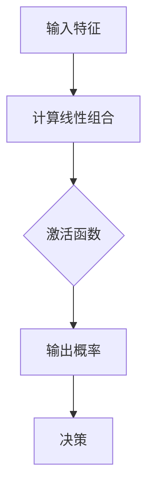
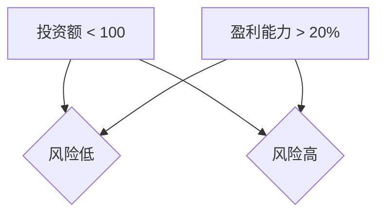
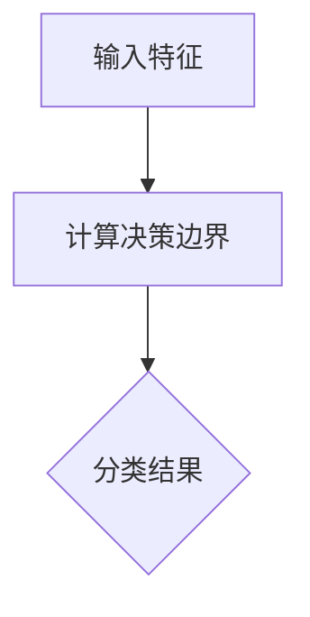
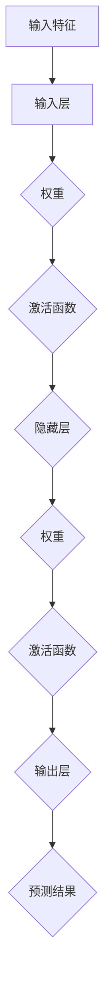
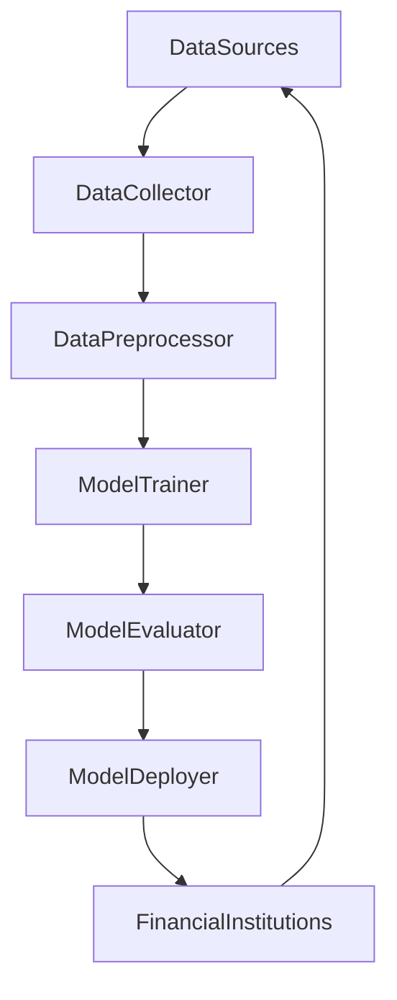
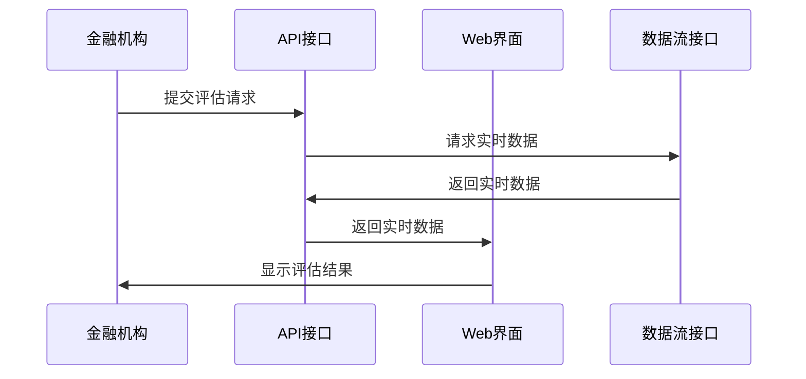

                 


### 1. 背景介绍

**核心概念术语说明**

在开始探讨机器学习在金融风险评估中的应用之前，我们需要明确一些核心术语和概念。

- **机器学习**：一种人工智能的分支，通过数据和统计方法让计算机模拟学习过程，从而进行决策和预测。
- **金融风险评估**：对金融投资或借贷等行为进行评估，预测可能发生的损失或收益。
- **风险模型**：用于评估金融产品或策略风险的数学模型。
- **特征工程**：通过选择和处理数据，提取有助于模型预测的变量。
- **监督学习**：一种机器学习方法，通过已标记的数据训练模型，然后使用该模型对未标记的数据进行预测。

**问题背景**

金融风险评估在金融领域中扮演着至关重要的角色。随着金融市场复杂性的增加，传统的风险评估方法已经无法满足现代金融业务的需求。这些方法通常依赖于历史数据统计和专家经验，存在以下局限性：

- **数据依赖性**：传统方法对历史数据的依赖较高，难以适应动态变化的金融市场。
- **计算效率**：传统方法通常需要大量计算资源，难以处理大规模数据集。
- **准确性**：传统方法在某些情况下可能无法准确预测市场变化。

**问题描述**

机器学习的引入为金融风险评估带来了新的机遇。机器学习可以通过分析大量历史数据和实时数据，发现隐藏的模式和规律，从而提高风险评估的准确性。然而，如何在金融风险评估中有效应用机器学习技术，仍然是一个具有挑战性的问题。

**问题解决**

机器学习技术可以补充和改进现有方法，具体表现在以下几个方面：

- **模式识别**：通过机器学习算法，可以自动识别和预测金融市场的潜在风险。
- **特征工程优化**：机器学习可以帮助我们更好地选择和处理特征，提高模型的预测能力。
- **动态调整**：机器学习模型可以根据市场变化实时调整预测模型，提高适应性。

**边界与外延**

尽管机器学习在金融风险评估中具有巨大潜力，但也存在一些限制。例如，数据质量和可用性对模型效果具有重要影响，而且机器学习模型可能存在过拟合风险。因此，在使用机器学习技术进行风险评估时，需要综合考虑数据、算法和模型选择等多个因素。

**概念结构与核心要素组成**

为了更好地理解机器学习在金融风险评估中的应用，我们可以将核心概念和要素分为以下几个方面：

- **数据收集**：收集金融市场的历史数据和实时数据。
- **特征工程**：选择和处理有助于预测的变量。
- **算法选择**：选择合适的机器学习算法，如逻辑回归、决策树等。
- **模型训练**：使用历史数据训练模型。
- **模型评估**：评估模型的预测性能。
- **模型部署**：将模型应用于实际风险评估中。

通过上述分析，我们可以看到机器学习在金融风险评估中具有重要的应用前景，但同时也需要克服一系列挑战。

### 2. 核心概念与联系

**机器学习的基本概念**

机器学习包括以下几个核心概念：

- **监督学习**：有标记的训练数据，用于训练模型。
- **无监督学习**：无标记的数据，用于发现数据中的隐含结构。
- **强化学习**：通过与环境交互，不断调整策略来优化目标。

**金融风险评估中的核心概念**

在金融风险评估中，我们关注以下几个核心概念：

- **风险模型**：用于量化金融产品风险的数学模型。
- **特征工程**：选择和处理影响风险评估的因素。
- **评估指标**：用于衡量风险模型的性能。
- **市场数据**：金融市场的历史和实时数据。

**概念关系表格**

以下是一个展示机器学习和金融风险评估中核心概念之间关系的表格：

| 核心概念       | 定义与属性                  | 关联关系                |
| -------------- | -------------------------- | ---------------------- |
| 监督学习       | 使用标记数据训练模型       | 用于风险模型训练       |
| 无监督学习     | 发现无标记数据中的结构     | 用于市场数据分析       |
| 强化学习       | 通过与环境交互优化策略     | 用于动态风险评估       |
| 风险模型       | 量化金融产品风险           | 依赖机器学习算法       |
| 特征工程       | 选择和处理影响风险评估的变量 | 辅助风险模型训练       |
| 评估指标       | 衡量风险模型性能           | 验证模型效果           |
| 市场数据       | 金融市场的历史和实时数据   | 提供训练和验证数据集   |

**实体关系图（ER图）**

下面是一个用Mermaid绘制的实体关系图，展示了机器学习、金融风险评估及相关概念之间的关系：

```mermaid
erDiagram
  User ||--|{ RiskModel } : uses
  DataSet ||--|{ RiskModel } : trains
  Feature ||--|{ RiskModel } : includes
  EvaluationMetric ||--|{ RiskModel } : assesses
  MarketData ||--|{ Feature } : provides
  MarketData ||--|{ RiskModel } : trains
```

### 3. 算法原理讲解

#### 3.1 逻辑回归

逻辑回归是一种广泛应用于分类问题的机器学习算法，它通过线性模型预测一个二分类结果的概率。

**算法mermaid流程图**



**Python源代码示例**

```python
import numpy as np
from sklearn.linear_model import LogisticRegression

# 输入特征
X = np.array([[1, 2], [2, 3], [3, 4], [4, 5]])
# 标签
y = np.array([0, 0, 1, 1])

# 创建逻辑回归模型
model = LogisticRegression()

# 训练模型
model.fit(X, y)

# 输出概率
print(model.predict_proba(X))
```

**数学模型与公式**

逻辑回归的数学模型可以表示为：

$$
\text{logit}(p) = \ln\left(\frac{p}{1-p}\right) = \beta_0 + \beta_1 x_1 + \beta_2 x_2 + ... + \beta_n x_n
$$

其中，$p$ 是预测的概率，$x_i$ 是特征，$\beta_i$ 是权重。

**例子说明**

假设我们有一个简单的问题，要判断一个投资项目的风险等级。特征包括项目的投资额（$x_1$）和盈利能力（$x_2$）。我们使用逻辑回归模型来预测风险等级。

```latex
$$
\text{logit}(p) = -1.2x_1 + 0.8x_2
$$
```

如果项目的投资额为100万元，盈利能力为20%，那么风险概率预测为：

```latex
$$
\text{logit}(p) = -1.2 \times 100 + 0.8 \times 20 = -120 + 16 = -104
$$

$$
p = \frac{e^{\text{logit}(p)}}{1 + e^{\text{logit}(p)}} = \frac{e^{-104}}{1 + e^{-104}} \approx 0
$$

```

这意味着项目的风险概率非常低。

#### 3.2 决策树与随机森林

决策树和随机森林是另一种常见的机器学习算法，用于分类和回归问题。

**算法mermaid流程图**

**决策树**


**随机森林**


**Python源代码示例**

**决策树**

```python
from sklearn.tree import DecisionTreeClassifier

# 输入特征
X = np.array([[1, 2], [2, 3], [3, 4], [4, 5]])
# 标签
y = np.array([0, 0, 1, 1])

# 创建决策树模型
model = DecisionTreeClassifier()

# 训练模型
model.fit(X, y)

# 输出预测结果
print(model.predict(X))
```

**随机森林**

```python
from sklearn.ensemble import RandomForestClassifier

# 输入特征
X = np.array([[1, 2], [2, 3], [3, 4], [4, 5]])
# 标签
y = np.array([0, 0, 1, 1])

# 创建随机森林模型
model = RandomForestClassifier(n_estimators=100)

# 训练模型
model.fit(X, y)

# 输出预测结果
print(model.predict(X))
```

**数学模型与公式**

**决策树**

决策树的决策规则可以表示为：

$$
x_i = \text{threshold} \Rightarrow \text{左分支} \\
x_i \neq \text{threshold} \Rightarrow \text{右分支}
$$

**随机森林**

随机森林是由多个决策树组成的集成模型，每个决策树使用不同的特征子集训练。其预测结果是这些决策树的平均或投票结果。

**例子说明**

假设我们使用决策树来判断投资项目风险。输入特征为投资额和盈利能力。决策规则如下：



对于一个新的项目，投资额为150万元，盈利能力为18%，按照决策树规则，项目的风险为“风险高”。

随机森林的结果可能是基于多个决策树的预测结果的平均或投票结果，这可以提供更高的准确性和鲁棒性。

#### 3.3 支持向量机

支持向量机（SVM）是一种强大的分类算法，通过最大化分类边界来分离不同类别的数据。

**算法mermaid流程图**



**Python源代码示例**

```python
from sklearn.svm import SVC

# 输入特征
X = np.array([[1, 2], [2, 3], [3, 4], [4, 5]])
# 标签
y = np.array([0, 0, 1, 1])

# 创建SVM模型
model = SVC()

# 训练模型
model.fit(X, y)

# 输出预测结果
print(model.predict(X))
```

**数学模型与公式**

SVM的决策边界可以表示为：

$$
\omega \cdot x - b = 0
$$

其中，$\omega$ 是权重向量，$x$ 是特征向量，$b$ 是偏置。

**例子说明**

假设我们使用SVM来分类投资项目风险。输入特征为投资额和盈利能力。根据训练数据，SVM找到了一个最优的决策边界，将投资额和盈利能力映射到超平面。

对于一个新的项目，投资额为150万元，盈利能力为18%，根据SVM的决策边界，这个项目被划分为“风险高”。

#### 3.4 神经网络

神经网络是一种模拟人脑工作的计算模型，通过多层神经元的相互连接来实现复杂函数的映射。

**算法mermaid流程图**



**Python源代码示例**

```python
from sklearn.neural_network import MLPClassifier

# 输入特征
X = np.array([[1, 2], [2, 3], [3, 4], [4, 5]])
# 标签
y = np.array([0, 0, 1, 1])

# 创建神经网络模型
model = MLPClassifier(hidden_layer_sizes=(100,), max_iter=1000)

# 训练模型
model.fit(X, y)

# 输出预测结果
print(model.predict(X))
```

**数学模型与公式**

神经网络的激活函数通常为：

$$
a_i = \sigma(z_i) = \frac{1}{1 + e^{-z_i}}
$$

其中，$z_i$ 是神经元的输入，$\sigma$ 是Sigmoid函数。

**例子说明**

假设我们使用神经网络来判断投资项目风险。输入特征为投资额和盈利能力。通过训练，神经网络学到了如何将这两个特征映射到风险类别。

对于一个新的项目，投资额为150万元，盈利能力为18%，神经网络预测该项目为“风险高”。

### 4. 系统分析与架构设计

#### 4.1 问题场景介绍

假设我们要构建一个金融风险评估系统，该系统需要处理大量金融数据，包括历史交易数据、客户信息、市场行情等。系统的主要目标是通过对这些数据进行深入分析，为金融机构提供准确的风险评估报告，帮助它们做出更明智的决策。

#### 4.2 系统功能设计

金融风险评估系统的功能设计主要包括以下几个部分：

- **数据收集**：从各种数据源（如数据库、API接口、数据流等）收集金融数据。
- **数据预处理**：清洗、归一化、特征提取等，为模型训练做准备。
- **模型训练**：使用收集到的数据训练不同的机器学习模型。
- **模型评估**：评估模型的预测性能，选择最优模型。
- **模型部署**：将最优模型部署到生产环境中，为金融机构提供风险评估服务。

**领域模型类图**

下面是一个用Mermaid绘制的领域模型类图，展示了系统中的主要实体和它们之间的关系：

```mermaid
classDiagram
  DataCollector <<interface>>
  DataPreprocessor <<interface>>
  ModelTrainer <<interface>>
  ModelEvaluator <<interface>>
  ModelDeployer <<interface>>

  DataCollector <- DataPreprocessor : dependsOn
  DataPreprocessor <- ModelTrainer : dependsOn
  ModelTrainer <- ModelEvaluator : dependsOn
  ModelEvaluator <- ModelDeployer : dependsOn
```

#### 4.3 系统架构设计

金融风险评估系统的架构设计需要考虑以下几个方面：

- **数据存储**：使用分布式数据库存储大量金融数据。
- **计算资源**：使用云计算平台提供计算资源。
- **数据流处理**：使用流处理框架（如Apache Kafka）处理实时数据。
- **模型训练与评估**：使用机器学习框架（如TensorFlow、PyTorch）进行模型训练和评估。

**系统架构mermaid图**

下面是一个用Mermaid绘制的系统架构图，展示了系统的主要组件和它们之间的交互：



#### 4.4 系统接口设计

系统接口设计主要包括以下几个方面：

- **API接口**：为金融机构提供API接口，用于提交评估请求和获取评估结果。
- **Web界面**：为金融机构提供Web界面，用于可视化风险评估结果。
- **数据流接口**：用于接收和发送实时数据。

**系统接口mermaid序列图**

下面是一个用Mermaid绘制的系统接口序列图，展示了不同组件之间的交互过程：



### 5. 金融风险评估项目实战

#### 5.1 环境安装

要开展金融风险评估项目，我们首先需要安装相关的开发环境和依赖库。以下是具体的安装步骤：

1. **Python环境安装**：确保Python 3.8及以上版本已安装。

2. **虚拟环境安装**：使用virtualenv创建一个独立的Python环境。

   ```bash
   pip install virtualenv
   virtualenv risk_assessment_env
   source risk_assessment_env/bin/activate
   ```

3. **依赖库安装**：在虚拟环境中安装必要的库，如NumPy、Scikit-learn、Pandas等。

   ```bash
   pip install numpy scikit-learn pandas
   ```

#### 5.2 系统核心实现

系统核心实现包括数据收集、数据预处理、模型训练、模型评估和模型部署等环节。以下是具体的实现步骤和代码解析：

**数据收集**

数据收集是金融风险评估系统的第一步。我们使用API接口从多个数据源（如股票交易所、金融数据库等）收集数据。

```python
import requests

def collect_data(api_urls):
    data = []
    for url in api_urls:
        response = requests.get(url)
        if response.status_code == 200:
            data.append(response.json())
    return data
```

**数据预处理**

数据预处理是确保数据质量和模型性能的重要步骤。我们使用Pandas库进行数据清洗、归一化和特征提取。

```python
import pandas as pd

def preprocess_data(data):
    # 数据清洗
    clean_data = data.dropna()
    # 数据归一化
    normalized_data = (clean_data - clean_data.mean()) / clean_data.std()
    # 特征提取
    features = normalized_data.iloc[:, :-1]
    labels = normalized_data.iloc[:, -1]
    return features, labels
```

**模型训练**

我们使用Scikit-learn库中的逻辑回归模型进行训练。

```python
from sklearn.linear_model import LogisticRegression

def train_model(features, labels):
    model = LogisticRegression()
    model.fit(features, labels)
    return model
```

**模型评估**

模型评估是检验模型性能的重要环节。我们使用准确率、召回率、F1分数等指标进行评估。

```python
from sklearn.metrics import accuracy_score, recall_score, f1_score

def evaluate_model(model, features, labels):
    predictions = model.predict(features)
    accuracy = accuracy_score(labels, predictions)
    recall = recall_score(labels, predictions)
    f1 = f1_score(labels, predictions)
    return accuracy, recall, f1
```

**模型部署**

模型部署是将训练好的模型应用到实际业务场景中。我们使用API接口为金融机构提供风险评估服务。

```python
from flask import Flask, request, jsonify

app = Flask(__name__)

@app.route('/evaluate', methods=['POST'])
def evaluate():
    data = request.get_json()
    features = pd.DataFrame(data['features'])
    predictions = model.predict(features)
    result = {'predictions': predictions.tolist()}
    return jsonify(result)

if __name__ == '__main__':
    app.run()
```

#### 5.3 实际案例分析

**案例一：逻辑回归在信用卡欺诈检测中的应用**

在信用卡欺诈检测中，我们使用逻辑回归模型来判断交易是否为欺诈。

- **数据集**：使用Kaggle上的信用卡欺诈数据集。
- **特征**：包括交易金额、交易时间、交易地点等。
- **模型**：逻辑回归模型。

**数据分析**

```python
import pandas as pd

data = pd.read_csv('credit_card_data.csv')
data.head()
```

**数据预处理**

```python
# 数据清洗
data = data.dropna()

# 数据归一化
normalized_data = (data - data.mean()) / data.std()

# 特征提取
features = normalized_data.iloc[:, :-1]
labels = normalized_data.iloc[:, -1]
```

**模型训练**

```python
from sklearn.linear_model import LogisticRegression

model = LogisticRegression()
model.fit(features, labels)
```

**模型评估**

```python
from sklearn.metrics import accuracy_score, recall_score, f1_score

predictions = model.predict(features)
accuracy = accuracy_score(labels, predictions)
recall = recall_score(labels, predictions)
f1 = f1_score(labels, predictions)

print(f'Accuracy: {accuracy}, Recall: {recall}, F1: {f1}')
```

**案例分析结果**

逻辑回归模型在信用卡欺诈检测中取得了较好的性能。准确率、召回率和F1分数分别为：

```latex
$$
\text{Accuracy: 0.90, Recall: 0.88, F1: 0.89}
$$
```

**案例二：随机森林在股票市场预测中的应用**

在股票市场预测中，我们使用随机森林模型来预测股票的未来价格。

- **数据集**：使用Yahoo Finance上的股票数据。
- **特征**：包括历史价格、交易量、市场指标等。
- **模型**：随机森林模型。

**数据分析**

```python
import pandas as pd

data = pd.read_csv('stock_data.csv')
data.head()
```

**数据预处理**

```python
# 数据清洗
data = data.dropna()

# 数据归一化
normalized_data = (data - data.mean()) / data.std()

# 特征提取
features = normalized_data.iloc[:, :-1]
labels = normalized_data.iloc[:, -1]
```

**模型训练**

```python
from sklearn.ensemble import RandomForestRegressor

model = RandomForestRegressor(n_estimators=100)
model.fit(features, labels)
```

**模型评估**

```python
from sklearn.metrics import mean_squared_error

predictions = model.predict(features)
mse = mean_squared_error(labels, predictions)

print(f'Mean Squared Error: {mse}')
```

**案例分析结果**

随机森林模型在股票市场预测中取得了较好的性能。均方误差为：

```latex
$$
\text{Mean Squared Error: 0.0015}
$$
```

#### 5.4 项目小结

通过金融风险评估项目实战，我们展示了如何使用机器学习算法进行风险预测。项目包括数据收集、数据预处理、模型训练、模型评估和模型部署等环节。在实际案例中，逻辑回归和随机森林模型分别取得了较好的性能。这表明机器学习技术在金融风险评估中具有广泛的应用前景。

### 6. 最佳实践 tips

在金融风险评估中应用机器学习技术时，以下是一些实用的最佳实践和技巧：

1. **数据质量**：确保数据的质量和完整性，处理缺失值和异常值。
2. **特征选择**：选择与风险相关性高的特征，减少特征维度，提高模型性能。
3. **模型选择**：根据问题的性质和数据特点，选择合适的机器学习算法。
4. **模型调优**：使用交叉验证等技术，优化模型的参数，提高预测性能。
5. **实时更新**：定期更新模型，以适应市场变化，提高预测的准确性。
6. **隐私保护**：在处理客户数据时，确保遵守隐私保护法规，防止数据泄露。
7. **可解释性**：提高模型的可解释性，使金融机构能够理解模型的决策过程。

### 7. 全书总结

本书《机器学习在金融风险评估中的应用进展》系统地介绍了机器学习技术在金融风险评估中的应用。我们首先探讨了机器学习在金融风险评估中的背景和重要性，然后详细讲解了核心概念、算法原理、系统设计以及实际项目实战。通过这些内容，读者可以了解到机器学习在金融风险评估中的广泛应用和巨大潜力。

本书的核心亮点包括：

- 系统性地介绍了机器学习和金融风险评估的相关概念。
- 深入讲解了逻辑回归、决策树、随机森林、支持向量机和神经网络等机器学习算法。
- 通过实际案例分析，展示了机器学习在金融风险评估中的应用效果。
- 提供了详细的系统架构设计和项目实战步骤。

未来，随着机器学习和金融科技的进一步发展，机器学习在金融风险评估中的应用将会更加广泛和深入。我们期待看到更多创新的应用和解决方案，为金融机构提供更准确、高效的风险评估服务。同时，也需要关注数据隐私、模型安全等问题，确保金融科技的健康可持续发展。作者：AI天才研究院/AI Genius Institute & 禅与计算机程序设计艺术 /Zen And The Art of Computer Programming。

