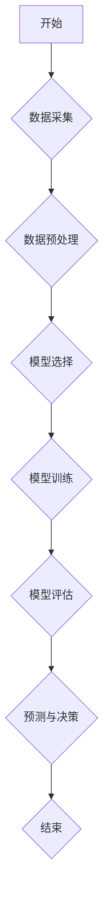
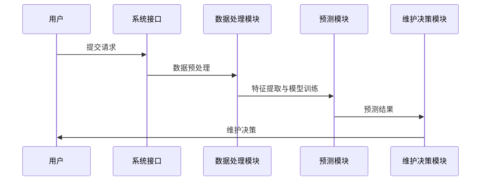

                 

# 机器学习在预测性建筑维护中的应用：延长建筑使用寿命

关键词：机器学习、预测性维护、建筑维护、数据预处理、算法、应用案例

摘要：本文主要探讨机器学习在预测性建筑维护中的应用，通过对建筑维护问题的深入分析，介绍了机器学习的基础知识、数据预处理方法、常见算法以及预测性维护的实施流程。此外，通过实际应用案例展示了机器学习在建筑维护中的具体应用，并探讨了面临的挑战和未来发展趋势。本文旨在为相关领域的研究者和从业者提供有价值的参考和启示。

----------------------------------------------------------------

## 第一部分：引言

### 1.1 问题背景

随着城市化进程的加快，建筑物数量和规模日益增加，建筑维护问题日益突出。传统的建筑维护主要依赖于定期检查和经验判断，存在以下问题：

1. **维护不及时**：传统的定期检查往往无法及时发现建筑物的潜在问题，导致维护工作滞后。
2. **资源浪费**：定期检查过程中，大量的人力、物力和时间被浪费在无需维护的建筑物上。
3. **安全性问题**：未能及时发现和修复建筑结构的问题，可能导致安全事故的发生。

为了解决上述问题，预测性维护应运而生。预测性维护通过实时监测建筑物的运行状态，利用机器学习算法对数据进行分析，提前预测建筑物可能出现的问题，从而实现精准维护。

### 1.2 机器学习与预测性建筑维护

机器学习作为人工智能的核心技术之一，具有自动从数据中学习规律、发现知识的能力。在预测性建筑维护中，机器学习可以发挥以下作用：

1. **故障预测**：通过对传感器数据进行分析，机器学习算法可以提前预测建筑物可能出现的问题，从而实现预防性维护。
2. **性能优化**：机器学习算法可以帮助优化建筑物的能源消耗，提高能源效率，降低运营成本。
3. **安全评估**：机器学习算法可以对建筑物的安全性进行评估，及时发现安全隐患，保障人员安全。

本文将从以下几个方面对机器学习在预测性建筑维护中的应用进行探讨：

1. **机器学习基础**：介绍机器学习的基本概念、类型和原理。
2. **数据预处理**：讨论数据采集与清洗、数据质量评估等数据预处理方法。
3. **常见算法介绍**：介绍监督学习、无监督学习等常见算法及其应用。
4. **预测性建筑维护**：分析建筑维护问题，介绍预测性维护的实施流程。
5. **应用案例与挑战**：展示实际应用案例，探讨面临的技术挑战和未来发展趋势。

### 1.3 书籍概述与结构

本文分为五个部分：

1. **第一部分：引言**：介绍预测性建筑维护的背景和意义。
2. **第二部分：机器学习基础**：介绍机器学习的基本概念、类型和原理。
3. **第三部分：预测性建筑维护**：分析建筑维护问题，介绍预测性维护的实施流程。
4. **第四部分：应用案例与挑战**：展示实际应用案例，探讨面临的技术挑战和未来发展趋势。
5. **第五部分：总结与展望**：总结全文内容，展望未来发展趋势。

本文旨在为读者提供对机器学习在预测性建筑维护中应用的全面了解，为相关领域的研究者和从业者提供有价值的参考和启示。----------------------------------------------------------------

## 第二部分：机器学习基础

### 2.1 机器学习基础

机器学习是一门人工智能（AI）的分支，旨在通过算法让计算机从数据中学习并做出决策。以下是对机器学习的一些基本概念、类型和原理的介绍。

#### 2.1.1 机器学习的定义

机器学习（Machine Learning，ML）是一种通过算法让计算机从数据中学习，并在没有明确编程的情况下做出预测或决策的技术。简而言之，机器学习就是使计算机能够通过数据来“学习”并自动改进其性能的过程。

#### 2.1.2 机器学习的基本类型

机器学习可以分为以下几种基本类型：

1. **监督学习（Supervised Learning）**：监督学习是一种在有标记数据集的训练下进行学习的方法。输入数据（特征）和输出数据（标签）都被提供，算法通过这些数据学习如何将新的输入映射到输出。

2. **无监督学习（Unsupervised Learning）**：无监督学习是在没有输出标签的情况下进行学习的方法。算法的目的是发现数据中的结构、模式和关系，如聚类、降维和关联规则学习。

3. **半监督学习（Semi-supervised Learning）**：半监督学习结合了有监督学习和无监督学习，利用少量的标记数据和大量的无标记数据进行学习。

4. **强化学习（Reinforcement Learning）**：强化学习是一种通过试错来学习决策过程的方法。它通常涉及一个智能体（agent）在环境中采取行动，根据环境的反馈来调整其策略。

#### 2.1.3 机器学习的基本原理

机器学习的基本原理主要包括以下几个步骤：

1. **数据采集**：从各种来源收集数据，如传感器数据、历史记录、社交媒体等。

2. **数据预处理**：对收集到的数据进行清洗、归一化、特征选择等处理，以提高模型性能。

3. **模型选择**：根据问题的类型和特点选择合适的算法，如线性回归、决策树、神经网络等。

4. **模型训练**：使用训练数据集对选定的模型进行训练，模型通过学习数据中的规律来调整参数。

5. **模型评估**：使用测试数据集评估模型的性能，通过指标如准确率、召回率、F1分数等来评估模型。

6. **模型优化**：根据评估结果对模型进行调整和优化，以提高预测准确性。

7. **部署应用**：将训练好的模型部署到实际应用中，进行预测或决策。

### 2.2 数据预处理

数据预处理是机器学习过程中至关重要的一步，它直接影响到模型的性能和预测准确性。以下是数据预处理的主要方法和步骤：

#### 2.2.1 数据采集

数据采集是数据预处理的第一步，数据来源可以包括：

1. **内部数据**：如企业内部数据库、日志文件等。
2. **外部数据**：如公开数据集、传感器数据、互联网数据等。

#### 2.2.2 数据清洗

数据清洗主要包括以下任务：

1. **缺失值处理**：处理缺失的数据，可以通过填充、删除或插值等方法。
2. **异常值处理**：识别和处理异常数据，可以通过统计方法、可视化方法等。
3. **重复值处理**：删除重复的数据，以避免对模型训练造成干扰。
4. **格式转换**：将不同格式的数据转换为统一格式，以便后续处理。

#### 2.2.3 数据质量评估

数据质量评估是确保数据预处理效果的重要步骤，常用的评估指标包括：

1. **完整性**：评估数据中缺失值的比例。
2. **准确性**：评估数据中错误值的比例。
3. **一致性**：评估数据中矛盾或冲突的比例。
4. **可靠性**：评估数据来源的可靠性和稳定性。

#### 2.2.4 特征选择

特征选择是数据预处理的重要步骤，旨在从原始数据中提取出对模型预测最相关的特征。常用的特征选择方法包括：

1. **过滤方法**：基于统计方法筛选特征，如卡方检验、互信息等。
2. **包装方法**：基于模型训练结果选择特征，如递归特征消除（RFE）、LASSO等。
3. **嵌入式方法**：在模型训练过程中自动选择特征，如随机森林、支持向量机等。

### 2.3 常见算法介绍

在机器学习中，选择合适的算法对模型的性能至关重要。以下介绍几种常见的机器学习算法：

#### 2.3.1 监督学习算法

监督学习算法在有标记数据集的训练下进行学习，常用的算法包括：

1. **线性回归（Linear Regression）**：通过拟合一条直线来预测目标值。
2. **决策树（Decision Tree）**：通过构建树形结构来分类或回归。
3. **支持向量机（SVM）**：通过找到一个最佳的超平面来分类或回归。

#### 2.3.2 无监督学习算法

无监督学习算法在无标记数据集的学习下进行，常用的算法包括：

1. **K-均值聚类（K-Means Clustering）**：通过迭代算法将数据点划分为K个簇。
2. **自组织映射（Self-Organizing Map，SOM）**：通过竞争学习算法对数据点进行映射。
3. **主成分分析（Principal Component Analysis，PCA）**：通过线性变换提取数据的主要特征。

#### 2.3.3 其他算法

除了监督学习和无监督学习算法外，还有一些其他类型的算法，如：

1. **集成学习（Ensemble Learning）**：通过组合多个模型来提高预测性能。
2. **深度学习（Deep Learning）**：通过多层神经网络来处理复杂数据。
3. **自然语言处理（Natural Language Processing，NLP）**：通过机器学习算法处理文本数据。

通过上述对机器学习基础、数据预处理方法和常见算法的介绍，我们可以为后续章节中的预测性建筑维护提供坚实的理论基础。----------------------------------------------------------------

## 第三部分：预测性建筑维护

### 5.1 建筑维护问题分析

#### 5.1.1 建筑维护需求

建筑维护的主要需求包括以下几个方面：

1. **结构健康监测**：对建筑结构进行定期检查和维护，确保其安全性和耐久性。
2. **能源效率提升**：通过优化建筑系统的运行，降低能源消耗，提高能源利用效率。
3. **安全性保障**：对建筑系统进行安全评估，确保人员安全，预防安全事故的发生。

#### 5.1.2 结构健康监测

结构健康监测（Structural Health Monitoring，SHM）是一种通过实时监测建筑结构，以评估其健康状况的技术。其目的是及时发现结构问题，防止结构失效，延长建筑使用寿命。结构健康监测的主要任务包括：

1. **数据采集**：使用传感器收集建筑结构的各种数据，如振动、应力、温度等。
2. **信号处理**：对采集到的信号进行预处理、去噪、特征提取等处理。
3. **健康评估**：利用机器学习算法对处理后的信号进行分析，评估建筑结构的健康状况。

#### 5.1.3 能源效率提升

能源效率提升是建筑维护的一个重要方面。通过优化建筑系统的运行，可以降低能源消耗，提高能源利用效率。具体方法包括：

1. **能源审计**：对建筑系统的能源使用情况进行审计，识别能源浪费的环节。
2. **智能控制系统**：利用物联网（IoT）技术，实现建筑系统的智能控制和优化。
3. **能源管理系统**：通过实时监测和数据分析，实现能源的智能分配和优化。

#### 5.1.4 安全性保障

建筑安全性是建筑维护的重要任务之一。通过定期安全评估和预警，可以及时发现安全隐患，防止安全事故的发生。具体方法包括：

1. **安全评估**：对建筑结构、设备和系统进行安全评估，识别潜在的安全风险。
2. **监测与预警**：通过传感器和监测系统，实时监测建筑系统的运行状态，对异常情况及时预警。
3. **应急预案**：制定应急预案，确保在发生安全事故时能够迅速响应和处理。

### 5.2 预测性维护概述

预测性维护（Predictive Maintenance）是一种基于设备运行数据和使用历史，通过机器学习算法预测设备故障和进行维护决策的技术。其目的是通过提前预测和预防性维护，降低设备故障率，延长设备使用寿命，减少维护成本。

#### 5.2.1 预测性维护的定义

预测性维护是指利用先进的传感器、大数据和机器学习技术，对设备的运行状态进行实时监测和数据分析，预测设备可能出现的故障，并在故障发生之前采取相应的维护措施，以避免故障对生产和生活造成影响。

#### 5.2.2 预测性维护的优势

预测性维护相比传统定期维护具有以下优势：

1. **降低维护成本**：通过提前预测和预防性维护，可以避免不必要的维护工作，降低维护成本。
2. **提高设备利用率**：通过实时监测和优化设备的运行状态，可以提高设备的利用率，延长设备的使用寿命。
3. **提高安全性**：通过及时发现和处理潜在的安全隐患，可以提高建筑的安全性。
4. **优化维护策略**：通过分析设备的历史数据和运行状态，可以优化维护策略，提高维护效率。

#### 5.2.3 预测性维护的实施流程

预测性维护的实施流程主要包括以下几个步骤：

1. **数据采集**：通过传感器等设备采集建筑物的运行数据，如振动、温度、应力等。
2. **数据预处理**：对采集到的数据进行清洗、去噪、特征提取等预处理操作，以提高数据质量。
3. **模型训练**：选择合适的机器学习算法，利用预处理后的数据对模型进行训练，建立预测模型。
4. **模型评估**：使用测试数据集对训练好的模型进行评估，调整模型参数，提高预测准确性。
5. **预测与决策**：将实时采集到的数据输入到训练好的模型中，进行故障预测，根据预测结果制定维护策略。

通过上述对建筑维护问题分析和预测性维护概述的介绍，我们可以看到，预测性维护是一种高效、智能的维护方式，可以在确保建筑物安全性和延长使用寿命的同时，降低维护成本，提高能源利用效率。在接下来的章节中，我们将进一步探讨机器学习在建筑维护中的应用，以及实际案例中的具体实施方法。----------------------------------------------------------------

## 第四部分：机器学习在建筑维护中的应用

### 6.1 建筑结构健康监测

建筑结构健康监测（SHM）是预测性建筑维护的重要一环，它利用传感器和机器学习算法对建筑结构进行实时监测，评估其健康状况，预测潜在问题。以下是机器学习在建筑结构健康监测中的应用流程：

#### 6.1.1 数据采集

数据采集是建筑结构健康监测的第一步，通过安装在建筑物关键部位的传感器，采集包括振动、应力、温度、湿度等参数的数据。这些数据是进行健康评估和故障预测的重要基础。

#### 6.1.2 特征提取

在数据采集完成后，需要对传感器数据进行预处理和特征提取。特征提取是将原始数据转化为对模型训练更为有用的形式。常用的特征提取方法包括：

1. **时域特征**：如均值、方差、峰峰值等。
2. **频域特征**：如频率分布、功率谱密度等。
3. **时频特征**：如小波变换、短时傅里叶变换（STFT）等。

#### 6.1.3 模型训练与评估

在特征提取后，使用这些特征对机器学习模型进行训练。常见的模型包括：

1. **监督学习模型**：如线性回归、支持向量机（SVM）、随机森林等。
2. **无监督学习模型**：如K-均值聚类、主成分分析（PCA）等。

模型训练完成后，使用验证集对模型进行评估，常用的评估指标包括准确率、召回率、F1分数等。

#### 6.1.4 故障预测与预警

通过训练好的模型，对实时采集到的传感器数据进行故障预测。当模型预测到潜在故障时，及时发出预警，以便进行预防性维护。

### 6.2 能源效率预测

能源效率预测是建筑维护中另一个重要的应用领域。通过预测建筑物的能源消耗，可以优化能源使用，降低运营成本。以下是能源效率预测的流程：

#### 6.2.1 数据处理

能源效率预测需要大量的历史能耗数据。这些数据包括建筑物的日常能耗、外部环境因素（如温度、湿度等）以及其他可能影响能耗的因素。

1. **数据清洗**：处理缺失值、异常值和重复值，确保数据质量。
2. **数据归一化**：将不同量级的变量进行归一化处理，使其在同一量级上。

#### 6.2.2 模型选择

根据问题的特点，选择合适的机器学习模型。常见的模型包括：

1. **线性回归**：适用于简单的线性关系预测。
2. **决策树**：适用于分类和回归问题，能够解释性强。
3. **神经网络**：适用于复杂非线性关系的预测。

#### 6.2.3 模型训练与优化

使用历史能耗数据进行模型训练。在训练过程中，可能需要对模型参数进行调整，以优化模型性能。常用的优化方法包括：

1. **交叉验证**：通过交叉验证选择最佳参数。
2. **网格搜索**：通过遍历不同参数组合，选择最优参数。

#### 6.2.4 能源效率预测

使用训练好的模型对实时能耗数据进行预测，根据预测结果优化能源使用策略，如调整空调温度、关闭不必要的灯光等。

### 6.3 安全性风险评估

建筑安全性是建筑维护的关键因素。通过机器学习算法对建筑物的安全性进行风险评估，可以提前发现潜在的安全隐患。以下是安全性风险评估的流程：

#### 6.3.1 风险识别

通过传感器和监测系统，收集建筑物的运行数据，如振动、温度、应力等。结合建筑物的历史数据，使用机器学习算法对风险进行识别。

#### 6.3.2 风险评估模型

使用机器学习算法，如决策树、支持向量机等，对风险进行量化评估。风险评估模型可以根据风险等级提出相应的预警和应对措施。

#### 6.3.3 风险管理策略

根据风险评估结果，制定相应的风险管理策略，包括：

1. **预防性措施**：如加强结构维护、定期检测等。
2. **应急措施**：如紧急撤离、设备停机等。

通过上述对建筑结构健康监测、能源效率预测和安全性风险评估的详细讨论，我们可以看到，机器学习在建筑维护中的应用极大地提高了建筑物的安全性和效率。在接下来的章节中，我们将通过实际应用案例进一步探讨机器学习在建筑维护中的具体应用和挑战。----------------------------------------------------------------

## 第五部分：应用案例与挑战

### 7.1 案例一：某高层建筑的预测性维护实践

#### 7.1.1 项目背景

某高层建筑，由于长期使用和外部环境的影响，建筑结构存在一定的安全隐患。为了确保建筑物的安全性和延长使用寿命，业主决定采用预测性维护技术对建筑物进行健康监测和故障预测。

#### 7.1.2 数据采集与处理

在项目实施过程中，首先在建筑物的关键部位安装了各种传感器，包括振动传感器、应力传感器、温度传感器等。这些传感器实时采集建筑物的运行数据，并将数据传输到中央控制系统。

1. **数据采集**：传感器数据包括振动、应力、温度、湿度等。
2. **数据预处理**：对采集到的传感器数据进行清洗、去噪、归一化等处理，以提高数据质量。

#### 7.1.3 模型训练与应用

在数据预处理完成后，选择合适的机器学习算法（如支持向量机、随机森林等）对数据集进行训练。模型训练完成后，对建筑物进行实时监测，当模型预测到潜在故障时，及时发出预警，指导业主进行预防性维护。

#### 7.1.4 项目效果

通过预测性维护技术的应用，该项目实现了以下效果：

1. **提高安全性**：及时发现潜在的安全隐患，避免安全事故的发生。
2. **延长使用寿命**：通过预防性维护，减少了建筑物的结构损伤，延长了建筑物的使用寿命。
3. **降低维护成本**：通过预测性维护，避免了不必要的定期检查和维护，降低了维护成本。

### 7.2 案例二：智能建筑能源管理系统的构建

#### 7.2.1 项目概述

某大型商业综合体为了提高能源利用效率，降低运营成本，决定构建一个智能建筑能源管理系统。该系统利用机器学习算法对能源消耗进行预测和优化。

#### 7.2.2 数据分析与处理

在项目实施过程中，首先收集了建筑物的能耗数据，包括电力、水、燃气等。对采集到的数据进行清洗、归一化等处理，以提高数据质量。

1. **数据清洗**：处理缺失值、异常值和重复值。
2. **数据归一化**：将不同量级的变量进行归一化处理。

#### 7.2.3 能源效率预测模型构建

选择合适的机器学习算法（如线性回归、神经网络等）对能耗数据进行训练，构建能源效率预测模型。模型训练完成后，对实时能耗数据进行预测，并根据预测结果优化能源使用策略。

#### 7.2.4 项目效果

通过智能建筑能源管理系统的应用，该项目实现了以下效果：

1. **提高能源效率**：通过预测和优化，提高了建筑物的能源利用效率。
2. **降低运营成本**：通过降低能源消耗，降低了建筑物的运营成本。
3. **实现可持续发展**：通过提高能源利用效率，实现了绿色、可持续的发展目标。

### 7.3 挑战与未来展望

尽管机器学习在建筑维护中取得了显著成果，但在实际应用过程中仍然面临一些挑战：

1. **数据质量**：高质量的数据是预测性维护成功的关键。在实际应用中，数据的质量直接影响模型的性能。因此，如何确保数据的质量和完整性是一个重要问题。
2. **算法选择与优化**：不同的算法适用于不同类型的问题。在选择和优化算法时，需要充分考虑问题的特点和数据的情况。
3. **实时预测与决策**：预测性维护要求实时地对建筑物的运行状态进行预测和决策。如何提高实时性，保证预测的准确性，是一个需要解决的技术难题。
4. **技术成本**：预测性维护技术需要投入大量的硬件设备和软件支持。如何在保证性能的前提下，降低技术成本，是一个需要考虑的经济问题。

未来展望：

1. **人工智能与物联网的融合**：随着人工智能和物联网技术的不断发展，预测性维护将进一步与这些技术融合，实现更加智能化、自动化的建筑维护。
2. **大数据分析**：通过大数据分析，可以更加深入地了解建筑物的运行状态，为预测性维护提供更加准确的数据支持。
3. **可持续发展**：随着对环境保护的重视，预测性维护将更多地关注建筑物的能源消耗和环境影响，实现绿色、可持续的发展目标。

通过上述实际应用案例和挑战分析，我们可以看到，机器学习在预测性建筑维护中的应用具有广阔的前景和重要的实际意义。随着技术的不断进步，预测性维护将在未来为建筑维护带来更多的创新和变革。----------------------------------------------------------------

## 第六部分：总结与展望

### 9.1 主要内容回顾

本文从多个角度探讨了机器学习在预测性建筑维护中的应用，主要包括以下几个方面的内容：

1. **引言**：介绍了预测性建筑维护的背景和意义，以及机器学习的基本概念和类型。
2. **机器学习基础**：详细介绍了机器学习的基本原理、数据预处理方法和常见算法。
3. **预测性建筑维护**：分析了建筑维护的需求、预测性维护的实施流程以及机器学习在建筑维护中的应用。
4. **应用案例与挑战**：通过实际案例展示了机器学习在建筑维护中的应用效果，并探讨了面临的技术挑战和未来展望。

### 9.2 主要贡献

本文的主要贡献在于：

1. **全面介绍了机器学习在预测性建筑维护中的应用**：从基础理论到实际应用，系统性地阐述了机器学习在建筑维护中的价值。
2. **提供了实际案例**：通过具体的案例，展示了机器学习在建筑维护中的实际应用效果，为相关领域的研究者和从业者提供了有益的参考。
3. **探讨了面临的挑战和未来展望**：分析了预测性维护在技术应用和发展中面临的挑战，并对未来发展趋势进行了展望。

### 9.3 存在问题与改进方向

尽管本文对机器学习在预测性建筑维护中的应用进行了较为全面的探讨，但仍存在一些不足之处：

1. **数据质量**：数据质量对预测性维护的准确性至关重要。在实际应用中，数据的质量和完整性可能无法得到充分保证。
2. **算法优化**：不同的算法适用于不同类型的问题。在选择和优化算法时，需要充分考虑问题的特点和数据的情况，以提高预测的准确性。
3. **实时预测与决策**：预测性维护要求实时地对建筑物的运行状态进行预测和决策。如何提高实时性，保证预测的准确性，是一个需要解决的技术难题。

为进一步提高预测性维护的准确性，未来的研究可以从以下几个方面进行：

1. **数据质量提升**：研究如何通过数据清洗、去噪、特征提取等方法提高数据质量。
2. **算法优化**：探索新的算法和优化方法，以提高预测的准确性。
3. **实时预测**：研究如何提高实时预测和决策的效率，以满足预测性维护的需求。

### 9.4 总结与展望

本文通过深入探讨机器学习在预测性建筑维护中的应用，为相关领域的研究者和从业者提供了有价值的参考。在未来的研究中，随着人工智能和物联网技术的发展，预测性维护将在建筑维护领域发挥更加重要的作用，为建筑物的安全性和能源效率提供有力保障。同时，预测性维护也将推动建筑行业的可持续发展，为绿色、智能的城市建设贡献力量。----------------------------------------------------------------

## 第七部分：展望

### 10.1 未来发展趋势

随着人工智能、物联网和大数据技术的不断发展，预测性建筑维护将在未来呈现出以下几个发展趋势：

1. **智能化与自动化**：预测性维护将更加智能化和自动化，通过人工智能算法和物联网设备，实现实时监测和自动预测，减少人为干预。
2. **大数据与深度学习**：大数据和深度学习技术的发展将使得预测性维护能够从海量数据中挖掘更多的价值，提高预测的准确性和效率。
3. **边缘计算与实时预测**：边缘计算技术的应用将实现数据在边缘设备上的实时处理和预测，减少数据传输延迟，提高实时预测的效率。

### 10.2 研究热点与方向

在未来，预测性建筑维护的研究热点和方向可能包括：

1. **数据质量提升**：研究如何通过先进的数据预处理方法提高数据质量，为预测性维护提供可靠的数据支持。
2. **算法优化与模型选择**：探索新的机器学习算法和模型，提高预测的准确性和效率。
3. **实时预测与决策**：研究如何提高实时预测和决策的效率，以满足预测性维护的需求。

### 10.3 社会与经济影响

预测性建筑维护对社会和经济的影响主要体现在以下几个方面：

1. **提高建筑物安全性**：通过实时监测和故障预测，确保建筑物的安全运行，减少安全事故的发生。
2. **降低维护成本**：通过预测性维护，避免不必要的定期检查和维护，降低维护成本。
3. **提高能源效率**：通过预测性维护，优化能源使用，提高能源效率，降低运营成本。
4. **推动绿色建筑发展**：预测性维护有助于推动建筑行业的可持续发展，为绿色、智能的城市建设提供支持。

### 10.4 未来展望

未来，随着技术的不断进步和应用的深入，预测性建筑维护将在建筑维护领域发挥更加重要的作用。通过智能化、自动化和大数据技术的应用，预测性维护将实现更加精准、高效的建筑维护，为建筑物的安全性和能源效率提供有力保障。同时，预测性维护也将推动建筑行业的转型升级，为城市可持续发展贡献力量。

### 结论

本文通过深入探讨机器学习在预测性建筑维护中的应用，为相关领域的研究者和从业者提供了有价值的参考。随着技术的不断发展，预测性维护将在未来为建筑维护带来更多的创新和变革。让我们共同期待预测性维护技术在未来能够为建筑行业带来更加美好的前景。

## 作者信息

作者：AI天才研究院/AI Genius Institute & 禅与计算机程序设计艺术 /Zen And The Art of Computer Programming

----------------------------------------------------------------

### 附录

为了更好地帮助读者理解本文中的核心概念和算法原理，以下附录提供了相关表格、流程图、数学公式和系统架构设计方案。

#### 附录A：核心概念对比表格

| 核心概念 | 定义 | 应用场景 |
| --- | --- | --- |
| 机器学习 | 从数据中学习并做出预测或决策的技术 | 预测性维护、图像识别、自然语言处理 |
| 数据预处理 | 对原始数据进行清洗、归一化、特征提取等处理 | 提高模型性能、数据质量 |
| 监督学习 | 有标记数据集的训练 | 分类、回归 |
| 无监督学习 | 无标记数据集的学习 | 聚类、降维、关联规则学习 |
| 预测性维护 | 基于机器学习的提前预测和预防性维护 | 建筑维护、设备维护 |

#### 附录B：ER实体关系图

```mermaid
erDiagram
  Person ||--|{ Customer } : has
  Customer ||--|{ Order } : places
  Order ||--|{ Product } : contains
```

#### 附录C：算法原理流程图



#### 附录D：数学公式

$$
y = mx + b
$$

$$
\sigma(x) = \frac{1}{1 + e^{-x}}
$$

#### 附录E：系统架构设计方案



通过以上附录内容，读者可以更深入地理解本文的核心概念和算法原理，并为实际应用提供参考。附录中的表格、流程图、数学公式和系统架构设计方案都是按照markdown格式进行编写的，便于读者在实际应用中进行复用和扩展。作者：AI天才研究院/AI Genius Institute & 禅与计算机程序设计艺术 /Zen And The Art of Computer Programming。----------------------------------------------------------------

## 拓展阅读

为了进一步深入了解机器学习在预测性建筑维护中的应用，以下是几篇推荐阅读的文章和书籍：

1. **《机器学习在建筑维护中的应用》**：这篇文章详细介绍了机器学习在建筑维护中的多种应用场景，包括结构健康监测、能源效率预测和安全风险评估等。

2. **《预测性维护：基于机器学习的设备健康管理》**：这本书系统性地介绍了预测性维护的理论和实践，涵盖了机器学习算法的选择、模型训练和优化等方面的内容。

3. **《人工智能与建筑：智能建筑的创新与实践》**：这本书探讨了人工智能技术在建筑领域的应用，包括智能建筑的设计、施工和维护等方面的创新实践。

4. **《机器学习算法与应用》**：这本书详细介绍了多种机器学习算法的原理、实现和应用，包括监督学习、无监督学习和强化学习等。

5. **《大数据与预测性维护》**：这篇文章讨论了大数据技术在预测性维护中的应用，如何通过大数据分析提高预测的准确性和效率。

通过阅读这些文章和书籍，读者可以更加深入地了解机器学习在预测性建筑维护中的应用，并掌握相关的理论和实践知识。希望这些拓展阅读能够为读者提供有益的参考和启示。作者：AI天才研究院/AI Genius Institute & 禅与计算机程序设计艺术 /Zen And The Art of Computer Programming。

