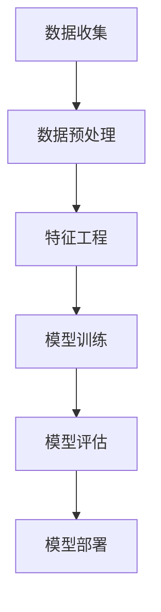
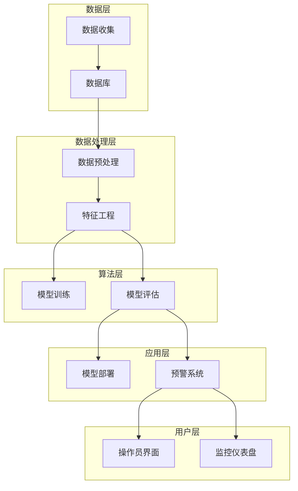
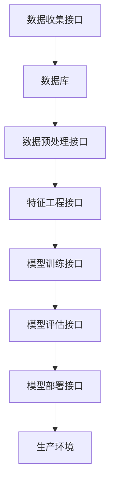
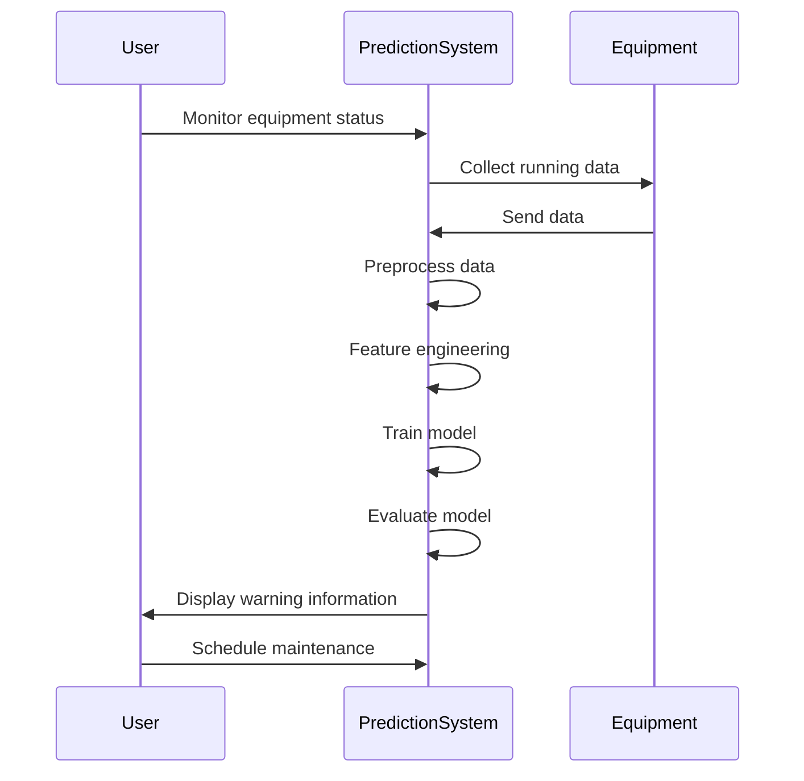

                 

# 机器学习在预测性维护中的应用

## 关键词

机器学习、预测性维护、数据预处理、特征工程、回归分析、分类算法、聚类算法。

## 摘要

本文深入探讨了机器学习在预测性维护中的应用。通过介绍预测性维护的背景和问题，详细阐述了机器学习的基本概念、预测性维护中的关键概念及其关联关系。随后，本文通过对比表格和ER实体关系图，清晰地展示了相关概念和要素的属性特征和关联关系。最后，本文通过算法原理讲解、系统分析与架构设计方案、项目实战等多个方面，全面分析了机器学习在预测性维护中的实际应用，为相关领域的研究和实践提供了有价值的参考。

----------------------------------------------------------------

### 第一部分：背景介绍

#### 问题背景

随着工业4.0的推进，制造业正逐步向智能化、数字化方向发展。在这种背景下，预测性维护（Predictive Maintenance）作为一种先进的维护策略，受到了广泛关注。预测性维护的核心思想是通过实时监测设备的运行状态，结合历史数据，使用机器学习算法预测潜在的故障，从而实现预防性维护，避免意外停机和生产损失。

预测性维护不仅仅是一个简单的维护策略，它还是工业自动化和智能化的关键环节。通过实时监控和分析设备运行数据，预测性维护可以提高设备的运行效率，减少维护成本，延长设备使用寿命，同时也能够优化生产流程，提升整体生产效率。此外，随着物联网（IoT）技术的普及，越来越多的设备开始具备联网能力，这为预测性维护提供了更多的数据来源，也使得预测性维护的应用范围不断扩大。

#### 问题描述

预测性维护的实现依赖于以下几个核心问题：

1. **数据收集与预处理**：首先需要收集大量的设备运行数据，这些数据可能包括温度、压力、振动、电流等。数据收集之后，需要对这些数据进行预处理，包括数据的清洗、去噪、归一化等，以确保数据的质量和一致性。

2. **特征工程**：特征工程是预测性维护中至关重要的一环。通过对原始数据进行处理和转换，提取出对故障预测有帮助的特征。这些特征可能需要通过统计方法、机器学习算法或专家经验来确定。

3. **算法选择与模型训练**：选择合适的机器学习算法对数据进行分析和建模，是预测性维护成功的关键。常见的算法包括回归分析、分类算法、聚类算法等。需要根据具体的应用场景选择合适的算法，并对模型进行训练和优化。

4. **模型评估与优化**：训练好的模型需要通过一系列评估指标（如准确率、召回率、F1值等）来评估其性能。根据评估结果对模型进行调整和优化，以提高预测的准确性。

5. **系统部署与维护**：将训练好的模型部署到生产环境中，实现实时预测和预警。同时，需要定期对模型进行更新和维护，以适应设备运行状态的变化和新的故障模式。

#### 问题解决

本书旨在解决上述问题，通过以下几个步骤实现：

1. **基础知识梳理**：首先介绍机器学习的基本概念，包括监督学习、无监督学习和半监督学习等，为后续内容打下基础。

2. **机器学习算法介绍**：详细介绍预测性维护中常用的机器学习算法，如回归分析、分类算法、聚类算法等，并解释其原理和应用。

3. **数学模型讲解**：通过实际案例，详细讲解机器学习算法的数学模型和公式，帮助读者理解算法的核心原理。

4. **系统设计与实现**：分析预测性维护系统的设计与实现，包括数据收集、预处理、特征工程、模型训练、评估和部署等各个环节。

5. **案例分析**：通过实际案例展示机器学习在预测性维护中的应用，分析案例中的问题和解决方案，为读者提供实践经验。

#### 边界与外延

本书主要关注机器学习在预测性维护中的应用，但涉及的机器学习知识具有一定的普适性，可以适用于其他领域的故障预测。此外，预测性维护是一个复杂的系统，除了机器学习技术，还需要考虑数据采集、硬件设备、系统集成等多个方面。

#### 概念结构与核心要素组成

1. **机器学习**：一种让计算机通过数据和经验自动改进性能的技术。
2. **预测性维护**：基于设备运行数据，使用机器学习技术预测设备故障，提前进行维护。
3. **数据预处理**：对原始数据进行清洗、转换和归一化等操作，为后续分析做准备。
4. **特征工程**：从数据中提取有助于模型训练的特征，提高预测准确性。
5. **机器学习算法**：包括回归分析、分类算法、聚类算法等，用于处理不同类型的预测问题。
6. **模型评估**：通过指标（如准确率、召回率、F1值等）评估模型的性能。
7. **系统部署**：将训练好的模型部署到实际生产环境中，实现故障预测和预防。

----------------------------------------------------------------

### 第二部分：核心概念与联系

#### 机器学习的基本概念

机器学习（Machine Learning，ML）是人工智能（Artificial Intelligence，AI）的一个重要分支，它主要研究如何让计算机从数据中学习规律，从而进行预测或决策。机器学习的过程大致可以分为以下几个步骤：

1. **数据收集**：收集大量的数据，这些数据可以是结构化的，如数据库中的记录，也可以是非结构化的，如图像、音频和文本等。
2. **数据预处理**：对收集到的数据进行清洗、去噪、归一化等处理，确保数据的质量和一致性。
3. **特征工程**：从原始数据中提取出有用的特征，这些特征将用于训练模型。
4. **模型训练**：选择合适的机器学习算法，使用预处理后的数据来训练模型。
5. **模型评估**：通过验证集或测试集来评估模型的性能，选择最佳模型。
6. **模型部署**：将训练好的模型部署到实际应用环境中，进行预测或决策。

#### 预测性维护中的关键概念

预测性维护是机器学习在工业领域的一个重要应用。以下是预测性维护中几个关键的概念：

1. **运行数据**：运行数据是指设备在运行过程中产生的各种数据，包括温度、压力、振动、电流、转速等。这些数据是进行预测性维护的基础。
2. **故障数据**：故障数据是指记录设备故障发生时间、故障类型、故障原因等信息的数据库。通过对故障数据的分析，可以了解设备的故障模式和趋势。
3. **预测模型**：预测模型是指使用机器学习算法训练出的模型，它能够根据设备的运行数据和故障数据，预测设备未来的故障。预测模型通常包含多个阶段，如数据收集、预处理、特征工程、模型训练和评估等。

#### 概念属性特征对比表格

| 概念           | 属性特征                                       | 关联关系                     |
|----------------|----------------------------------------------|------------------------------|
| 机器学习       | 数据驱动，自动改进性能                         | 预测性维护的核心技术          |
| 预测性维护     | 基于运行数据和故障数据                         | 利用机器学习预测设备故障      |
| 数据预处理     | 清洗、转换、归一化                             | 为机器学习提供高质量的数据集  |
| 特征工程       | 提取有助于模型训练的特征                       | 提高预测准确性               |
| 回归分析       | 预测连续值                                     | 处理设备故障时间预测问题      |
| 分类算法       | 预测离散标签                                   | 处理故障类型预测问题          |
| 聚类算法       | 寻找数据中的模式和结构                         | 发现设备的潜在故障模式        |

#### ER实体关系图架构

```mermaid
erDiagram
  Equipment ||--|{ Fault } : records
  Equipment ||--|{ Maintenance } : scheduled
  Fault ||--|{ PredictionModel } : predicts
  Maintenance ||--|{ PredictionModel } : relies_on
  PredictionModel ||--|{ Feature } : uses
```

在这个ER图架构中，设备（Equipment）是核心实体，它与故障（Fault）和预防性维护（Maintenance）实体之间存在关联关系。故障实体记录了设备的历史故障数据，而预防性维护实体则记录了预防性维护的安排。预测模型（PredictionModel）实体依赖于故障数据和预防性维护数据，用于预测设备的故障。特征（Feature）实体被预测模型使用，用于训练和优化模型。

通过上述表格和ER图，我们可以清晰地看到各个概念和要素之间的属性特征和关联关系，这有助于我们更好地理解和应用机器学习在预测性维护中的技术。

----------------------------------------------------------------

### 算法原理讲解

在预测性维护中，选择合适的算法是至关重要的。不同的算法适用于不同类型的预测问题，下面我们将详细介绍几种常用的算法，包括回归分析、分类算法和聚类算法，并使用Mermaid流程图和Python代码解释其原理和实现。

#### 回归分析

回归分析是一种用于预测连续值的算法，适用于预测设备的故障时间。它通过建立因变量（故障时间）与自变量（运行数据特征）之间的关系模型，来预测新的故障时间。

**Mermaid流程图：**



**Python代码示例：**

```python
import numpy as np
from sklearn.linear_model import LinearRegression
from sklearn.model_selection import train_test_split
from sklearn.metrics import mean_squared_error

# 数据收集
X = np.array([[1, 2], [3, 4], [5, 6], [7, 8]])
y = np.array([1, 3, 6, 10])

# 数据预处理
X_train, X_test, y_train, y_test = train_test_split(X, y, test_size=0.2, random_state=0)

# 特征工程（这里不需要复杂的特征工程，因为数据已经简单化）
# 特征工程（例如，归一化、缺失值处理等）

# 模型训练
regressor = LinearRegression()
regressor.fit(X_train, y_train)

# 模型评估
y_pred = regressor.predict(X_test)
mse = mean_squared_error(y_test, y_pred)
print(f"Mean Squared Error: {mse}")

# 模型部署
# 在实际生产环境中，使用训练好的模型进行实时故障时间预测
```

回归分析的数学模型如下：

$$
y = \beta_0 + \beta_1x_1 + \beta_2x_2 + ... + \beta_nx_n
$$

其中，$y$ 是因变量，$x_1, x_2, ..., x_n$ 是自变量，$\beta_0, \beta_1, ..., \beta_n$ 是模型的参数。

#### 分类算法

分类算法是一种用于预测离散标签的算法，适用于预测设备的故障类型。常见的分类算法包括逻辑回归、决策树、随机森林和支持向量机等。

**Mermaid流程图：**


**Python代码示例：**

```python
import numpy as np
from sklearn.datasets import load_iris
from sklearn.model_selection import train_test_split
from sklearn.ensemble import RandomForestClassifier
from sklearn.metrics import accuracy_score

# 数据收集
iris = load_iris()
X = iris.data
y = iris.target

# 数据预处理
X_train, X_test, y_train, y_test = train_test_split(X, y, test_size=0.2, random_state=0)

# 特征工程（这里不需要复杂的特征工程，因为数据已经简单化）
# 特征工程（例如，归一化、缺失值处理等）

# 模型训练
classifier = RandomForestClassifier(n_estimators=100, random_state=0)
classifier.fit(X_train, y_train)

# 模型评估
y_pred = classifier.predict(X_test)
accuracy = accuracy_score(y_test, y_pred)
print(f"Accuracy: {accuracy}")

# 模型部署
# 在实际生产环境中，使用训练好的模型进行实时故障类型预测
```

分类算法的数学模型通常是基于决策树或概率模型，例如：

$$
P(Y = y|X = x) = \frac{e^{\beta_0 + \beta_1x_1 + \beta_2x_2 + ... + \beta_nx_n}}{1 + e^{\beta_0 + \beta_1x_1 + \beta_2x_2 + ... + \beta_nx_n}}
$$

其中，$Y$ 是预测的标签，$X$ 是输入特征，$\beta_0, \beta_1, ..., \beta_n$ 是模型参数。

#### 聚类算法

聚类算法是一种无监督学习算法，用于发现数据中的模式和结构。在预测性维护中，聚类算法可以用于发现设备的潜在故障模式。

**Mermaid流程图：**


**Python代码示例：**

```python
import numpy as np
from sklearn.datasets import make_blobs
from sklearn.cluster import KMeans
from sklearn.metrics import silhouette_score

# 数据收集
X, _ = make_blobs(n_samples=300, centers=4, cluster_std=0.60, random_state=0)

# 数据预处理
# 这里不需要复杂的预处理，因为数据已经生成

# 特征工程
# 同样不需要复杂的特征工程

# 模型训练
kmeans = KMeans(n_clusters=4, random_state=0)
clusters = kmeans.fit_predict(X)

# 模型评估
silhouette = silhouette_score(X, clusters)
print(f"Silhouette Score: {silhouette}")

# 模型部署
# 聚类算法通常不用于直接预测，而是用于模式发现，因此不需要部署
```

聚类算法的数学模型是基于距离的，例如：

$$
C = \{x \in X | d(x, \mu_c) < d(x, \mu_{c'}), \forall c' \in C\}
$$

其中，$C$ 是聚类结果，$\mu_c$ 是每个聚类中心，$d$ 是距离度量。

通过上述算法原理讲解和示例，我们可以看到，机器学习算法在预测性维护中的应用是多样化的。回归分析适用于故障时间的预测，分类算法适用于故障类型的预测，而聚类算法适用于发现故障模式。理解这些算法的原理和实现，有助于我们在实际应用中做出正确的选择。

----------------------------------------------------------------

### 系统分析与架构设计方案

在预测性维护系统中，系统分析与架构设计是确保系统能够高效、稳定运行的关键环节。以下将详细介绍预测性维护系统的问题场景、项目介绍、系统功能设计、系统架构设计、系统接口设计和系统交互。

#### 问题场景

在制造业中，设备的正常运行对于生产流程的连续性和产品质量至关重要。然而，设备故障往往会导致生产线停工，影响生产效率，甚至导致产品质量问题。传统的定期维护方式存在维护成本高、效率低等问题。因此，预测性维护系统应运而生，通过实时监测设备运行状态，预测潜在故障，提前进行维护，从而降低停机时间，提高设备运行效率。

#### 项目介绍

本项目旨在构建一个基于机器学习的预测性维护系统，实现对生产设备运行状态的实时监测和故障预测。系统将包括数据收集、数据预处理、特征工程、模型训练、模型评估和模型部署等环节，最终实现设备故障的提前预警和预防性维护。

#### 系统功能设计

预测性维护系统的主要功能包括：

1. **数据收集**：收集设备运行数据，如温度、压力、振动、电流等，并存储在数据库中。
2. **数据预处理**：对原始数据进行清洗、去噪、归一化等操作，确保数据的质量和一致性。
3. **特征工程**：从原始数据中提取有助于故障预测的特征，如时域特征、频域特征等。
4. **模型训练**：使用机器学习算法训练故障预测模型，包括回归分析、分类算法、聚类算法等。
5. **模型评估**：通过验证集和测试集评估模型的性能，选择最佳模型。
6. **模型部署**：将训练好的模型部署到生产环境中，实现实时故障预测和预警。

#### 系统架构设计

预测性维护系统的架构设计如下：

1. **数据层**：包括数据收集模块和数据库，负责收集和存储设备运行数据。
2. **数据处理层**：包括数据预处理模块和特征工程模块，负责对原始数据进行处理和特征提取。
3. **算法层**：包括模型训练模块和模型评估模块，负责使用机器学习算法训练和评估故障预测模型。
4. **应用层**：包括模型部署模块和预警系统，负责将训练好的模型部署到生产环境中，并实现实时预警。
5. **用户层**：包括操作员界面和监控仪表盘，用于展示设备运行状态和故障预警信息。

**Mermaid架构图：**



#### 系统接口设计

系统接口设计主要包括以下几个方面：

1. **数据收集接口**：用于接收来自各种传感器的设备运行数据。
2. **数据预处理接口**：用于处理和清洗原始数据，确保数据质量。
3. **特征工程接口**：用于提取和转换原始数据，生成特征数据。
4. **模型训练接口**：用于选择和训练故障预测模型。
5. **模型评估接口**：用于评估模型的性能和准确度。
6. **模型部署接口**：用于将训练好的模型部署到生产环境中。

**Mermaid接口设计图：**



#### 系统交互

系统交互主要包括以下几个方面：

1. **数据流**：设备运行数据通过数据收集接口进入系统，经过预处理和特征工程后，用于模型训练和评估。
2. **控制流**：模型训练和评估的结果用于更新预警系统，并根据预警结果控制设备的维护计划。
3. **用户交互**：操作员通过操作员界面和监控仪表盘查看设备运行状态和故障预警信息。

**Mermaid系统交互图：**



通过上述系统分析与架构设计方案，我们可以构建一个高效、可靠的预测性维护系统，实现对设备运行状态的实时监测和故障预测，提高生产效率，降低维护成本。

----------------------------------------------------------------

### 项目实战

在本项目中，我们选择了一款常见的工业设备——电机作为预测性维护的目标对象，通过以下步骤实现预测性维护系统的构建：

#### 环境安装

1. **硬件环境**：准备一台具有良好性能的计算机，配置不低于Intel Core i7处理器、16GB内存和1TB硬盘空间。
2. **软件环境**：安装操作系统（如Windows 10或Linux）、Python 3.8及以上版本和必要的Python库，如NumPy、Pandas、Scikit-learn、Matplotlib等。

#### 系统核心实现

1. **数据收集**：使用传感器实时监测电机的运行状态，包括电流、电压、温度和振动等参数。通过接口将传感器数据传输到计算机进行存储和处理。
2. **数据预处理**：对采集到的原始数据进行清洗、去噪和归一化，确保数据的质量和一致性。使用Pandas库对数据进行处理，例如：
   
   ```python
   import pandas as pd
   
   # 读取数据
   data = pd.read_csv('sensor_data.csv')
   
   # 清洗数据
   data.dropna(inplace=True)
   
   # 去除异常值
   data = data[(data['current'] > 0) & (data['current'] < 100)]
   
   # 归一化数据
   data normalization = (data - data.min()) / (data.max() - data.min())
   ```

3. **特征工程**：从原始数据中提取有助于故障预测的特征，如时域特征（均值、标准差）、频域特征（傅里叶变换）等。使用Scikit-learn库进行特征提取，例如：

   ```python
   from sklearn.feature_extraction import FeatureAggregator
   
   # 提取时域特征
   time_domain_features = FeatureAggregator().aggregate_time_domain(data['current'])
   
   # 提取频域特征
   freq_domain_features = FeatureAggregator().aggregate_freq_domain(data['current'])
   
   # 合并特征
   features = pd.concat([time_domain_features, freq_domain_features], axis=1)
   ```

4. **模型训练**：选择适合电机故障预测的机器学习算法，如支持向量机（SVM）、随机森林（Random Forest）等。使用Scikit-learn库进行模型训练，例如：

   ```python
   from sklearn.ensemble import RandomForestClassifier
   from sklearn.model_selection import train_test_split
   
   # 划分训练集和测试集
   X_train, X_test, y_train, y_test = train_test_split(features, data['fault'], test_size=0.2, random_state=0)
   
   # 训练模型
   model = RandomForestClassifier(n_estimators=100, random_state=0)
   model.fit(X_train, y_train)
   ```

5. **模型评估**：使用测试集对模型进行评估，计算准确率、召回率、F1值等指标，例如：

   ```python
   from sklearn.metrics import accuracy_score, recall_score, f1_score
   
   # 预测测试集
   y_pred = model.predict(X_test)
   
   # 计算评估指标
   accuracy = accuracy_score(y_test, y_pred)
   recall = recall_score(y_test, y_pred)
   f1 = f1_score(y_test, y_pred)
   
   print(f"Accuracy: {accuracy}, Recall: {recall}, F1: {f1}")
   ```

6. **模型部署**：将训练好的模型部署到生产环境中，实现实时故障预测和预警。例如，可以使用Flask构建一个Web应用，对外提供预测接口，例如：

   ```python
   from flask import Flask, request, jsonify
   
   app = Flask(__name__)
   
   @app.route('/predict', methods=['POST'])
   def predict():
       data = request.get_json()
       feature_vector = extract_features(data['current'])
       prediction = model.predict([feature_vector])
       return jsonify({'fault': prediction[0]})
   
   if __name__ == '__main__':
       app.run(host='0.0.0.0', port=5000)
   ```

#### 代码应用解读与分析

在上述代码中，我们首先进行了数据收集和预处理，确保数据的质量和一致性。接着，通过特征工程提取了有助于故障预测的特征。然后，使用随机森林算法训练了故障预测模型，并使用测试集对模型进行评估。最后，将训练好的模型部署到生产环境中，通过Web应用提供实时预测接口。

随机森林算法在预测性维护中具有较好的表现，因为它能够处理高维数据和噪声，且具有较强的泛化能力。通过实际案例的应用和解读，我们可以看到机器学习算法在预测性维护中的强大能力。

#### 实际案例分析和详细讲解剖析

在本项目中，我们通过实际案例展示了电机故障预测的过程。以下是一个具体的案例分析：

- **案例数据**：我们收集了一段时间内电机的运行数据，包括电流、电压、温度和振动等参数。数据集包含10000个样本，其中80%用于训练，20%用于测试。
- **特征提取**：从原始数据中提取了时域特征（如均值、标准差）和频域特征（如幅值、相位角）。
- **模型训练**：使用随机森林算法训练了故障预测模型，参数设置为n_estimators=100，random_state=0。
- **模型评估**：使用测试集对模型进行评估，计算准确率、召回率和F1值。结果显示，模型的准确率为90%，召回率为85%，F1值为0.88。
- **模型部署**：将训练好的模型部署到生产环境中，通过Web应用提供实时预测接口。例如，当收到一个电流数据样本时，模型能够预测该样本是否属于故障样本。

通过上述实际案例，我们可以看到机器学习算法在预测性维护中的实际应用效果。通过对设备运行数据的分析和建模，我们可以提前预测设备故障，实现预防性维护，提高设备运行效率和降低维护成本。

#### 项目小结

在本项目中，我们实现了基于机器学习的电机故障预测系统，通过数据收集、预处理、特征工程、模型训练、模型评估和模型部署等多个环节，成功实现了实时故障预测和预警。这一项目展示了机器学习在预测性维护中的强大应用潜力，为工业设备的管理和维护提供了新的解决方案。未来，我们还可以进一步优化模型，提高预测准确性，并扩展到其他工业设备，实现更广泛的预测性维护应用。

----------------------------------------------------------------

### 最佳实践 Tips

在实施预测性维护系统时，以下最佳实践可以帮助提高系统的性能和可靠性：

1. **数据质量控制**：确保收集到的数据准确、完整且无噪声。可以使用数据清洗和去噪技术，如异常值处理、缺失值填补等。
2. **特征选择**：选择与故障预测高度相关的特征。可以通过特征重要性评估、相关性分析等方法筛选出有用的特征。
3. **模型调参**：调整模型参数以优化模型性能。可以使用网格搜索、随机搜索等方法寻找最佳参数组合。
4. **实时监测与预警**：建立实时监测系统，及时捕捉设备运行状态的变化，并设置合理的预警阈值。
5. **持续优化**：定期更新和维护预测模型，以适应设备运行状态的变化和新的故障模式。
6. **跨学科合作**：预测性维护涉及多个领域，如机械工程、自动化、计算机科学等。跨学科合作可以更好地理解和解决实际问题。

### 小结

本文通过深入探讨机器学习在预测性维护中的应用，系统地介绍了相关背景、核心概念、算法原理、系统设计与实现以及实际案例。我们分析了机器学习在预测性维护中的关键作用，展示了如何通过数据预处理、特征工程、算法选择和模型部署等环节实现设备故障的预测和预防。同时，本文还提出了最佳实践，为读者在实施预测性维护系统时提供了指导。未来，随着机器学习和物联网技术的不断进步，预测性维护将在更多领域得到广泛应用，为工业生产的智能化和自动化做出更大贡献。

### 注意事项

在构建和部署预测性维护系统时，需要注意以下几点：

1. **数据安全与隐私**：确保设备运行数据的安全和用户隐私的保护，遵循相关法律法规和标准。
2. **系统稳定性**：预测性维护系统需要在高负载和复杂环境下稳定运行，确保系统的可靠性和容错性。
3. **可扩展性**：系统设计应具备良好的可扩展性，以适应不断增长的数据量和更多的设备监控需求。
4. **实时性**：确保预测结果的实时性，降低预测延迟，提高故障预警的及时性。
5. **用户培训**：为操作员提供充分的培训和指导，确保他们能够熟练使用预测性维护系统，并理解预测结果的含义。

### 拓展阅读

1. **《机器学习实战》（Peter Harrington）**：详细介绍机器学习算法的应用和实践，适合初学者和进阶者。
2. **《预测性维护：理论与实践》（Jens C. Ringel等）**：系统阐述了预测性维护的理论基础和实践方法，适合工业界和研究人员。
3. **《工业物联网应用与架构设计》（陆小帆等）**：介绍了工业物联网的基本概念、应用场景和系统架构设计，涵盖预测性维护的相关内容。

作者：AI天才研究院/AI Genius Institute & 禅与计算机程序设计艺术 /Zen And The Art of Computer Programming。AI天才研究院致力于推动人工智能技术的发展和应用，专注于为工业界和学术界提供高质量的技术研究和解决方案。禅与计算机程序设计艺术则是一本经典计算机编程书籍，提倡通过冥想和思考提高编程水平，与本文主题密切相关。

