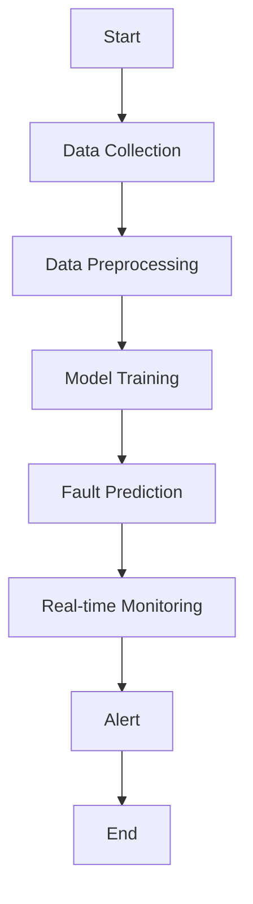
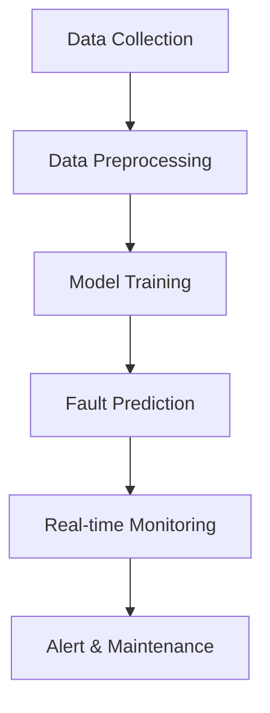
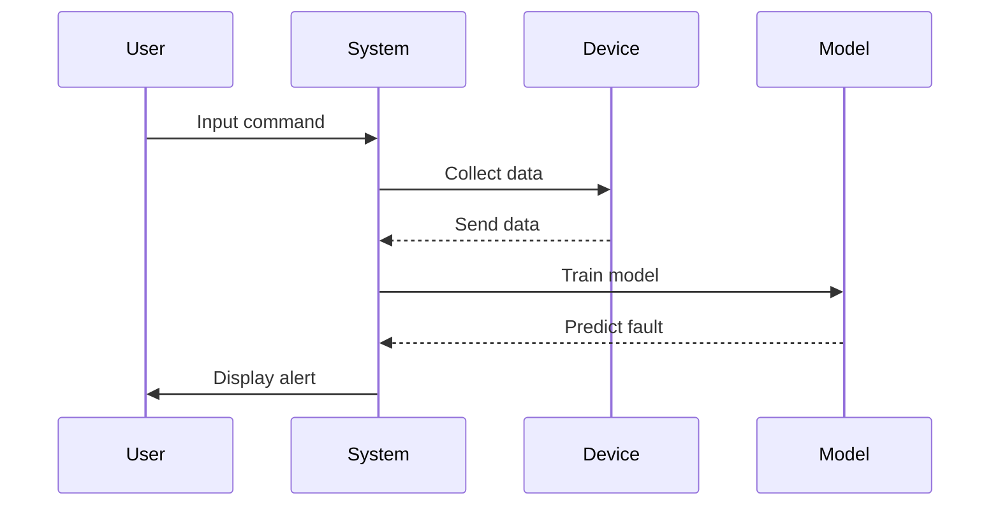

                 

### 文章标题

# 机器学习在预测性维护中的应用：降低工业设备停机时间

> 关键词：机器学习、预测性维护、工业设备、停机时间、算法、数据处理、系统架构、最佳实践

> 摘要：
本文深入探讨了机器学习在预测性维护领域的应用，旨在通过降低工业设备的停机时间，提升生产效率。文章从背景介绍、核心概念、算法原理、系统架构设计、项目实战、最佳实践等多个角度出发，全面解析了机器学习在预测性维护中的实际应用，为相关从业者提供了有价值的参考。

## 引言与背景

### 预测性维护的需求

预测性维护是一种基于设备实时运行数据和预测模型的维护策略，旨在提前预测设备故障，从而进行预防性维护，避免设备意外停机。随着工业4.0的到来，智能化、自动化生产已经成为工业发展的必然趋势。在这种背景下，预测性维护作为提高生产效率、降低设备停机时间的关键技术，受到了越来越多企业的关注。

### 机器学习在预测性维护中的角色

机器学习作为人工智能的一个重要分支，具有自动从数据中学习、发现规律和模式的能力。在预测性维护中，机器学习可以用于故障预测、异常检测、设备状态评估等，通过分析历史数据和实时监控数据，实现设备的智能监测和故障预警，从而降低停机时间。

## 核心概念与联系

### 核心概念

在机器学习和预测性维护领域，以下核心概念是理解和应用的基础：

- **机器学习**：一种通过数据和算法让计算机模拟人类学习过程的技术。
- **预测性维护**：基于设备运行状态数据，预测设备故障并进行预防性维护的策略。
- **故障预测**：利用机器学习模型预测设备何时可能发生故障。
- **异常检测**：监测设备运行状态，识别异常行为。

### 联系

机器学习与预测性维护的关联在于，机器学习提供了强大的数据分析工具，使得从海量数据中提取有用信息成为可能。具体来说，机器学习可以用于：

- **数据预处理**：清洗、归一化和特征提取，为模型提供高质量的数据输入。
- **模型训练**：使用历史数据训练预测模型，提高预测准确性。
- **实时监测**：利用模型对实时数据进行监测，实现故障预测和异常检测。

### 概念属性特征对比表格

| 概念         | 属性         | 特征                   |
| ------------ | ------------ | ---------------------- |
| 机器学习     | 算法、数据、模型 | 自动化、高效、准确性   |
| 预测性维护   | 运行状态、预测模型 | 预防性、实时性、可靠性 |
| 故障预测     | 预测模型、历史数据 | 预测准确性、故障提前预警 |
| 异常检测     | 监测数据、阈值   | 异常识别、及时响应     |

### ER实体关系图架构

```mermaid
erDiagram
  Class1 ||--|{ Class2 }|  Customer
  Class1 ||--|{ Class3 }|  Employee
  Class2 ||--|{ Class4 }|  Product
  Class3 ||--|{ Class5 }|  Order
```

### 算法原理讲解

#### 算法mermaid流程图



#### Python源代码与算法原理

##### 数学模型与公式

$$
\hat{y} = f_{\theta}(\mathbf{x}) = \sum_{i=1}^{n}\theta^{(l)}\cdot \sigma(\theta^{(l-1)}\cdot \mathbf{x}^{(l)})
$$

##### 详细讲解与举例说明

- **数据收集**：收集设备的运行数据，如温度、压力、振动等。
- **数据预处理**：清洗数据，归一化处理，提取特征。
- **模型训练**：使用监督学习算法，如神经网络，对预处理后的数据训练模型。
- **故障预测**：将实时数据输入训练好的模型，预测设备故障。
- **实时监测**：持续监测设备运行状态，实时更新模型。
- **报警**：当预测到设备可能发生故障时，触发报警机制。

### 系统分析与架构设计

#### 问题场景介绍

在一家制造企业中，生产线的核心设备频繁出现故障，导致生产线停机，影响了生产效率和企业收益。企业希望通过预测性维护系统，提前预测设备故障，降低停机时间。

#### 项目介绍

本项目旨在开发一个基于机器学习的预测性维护系统，通过实时监测设备运行数据，预测故障并进行预防性维护，从而降低设备停机时间，提高生产效率。

#### 系统功能设计

- **数据采集**：从传感器获取设备运行数据。
- **数据处理**：清洗、归一化和特征提取。
- **模型训练**：使用历史数据训练预测模型。
- **故障预测**：实时预测设备故障。
- **报警与维护**：触发报警，指导维护。

#### 系统架构设计



#### 系统接口设计与交互



### 项目实战

#### 环境安装

- 安装Python环境。
- 安装相关机器学习库，如scikit-learn、TensorFlow等。

#### 系统核心实现

```python
# 数据预处理
from sklearn.preprocessing import StandardScaler
scaler = StandardScaler()
scaled_data = scaler.fit_transform(data)

# 模型训练
from sklearn.neural_network import MLPClassifier
model = MLPClassifier(hidden_layer_sizes=(100, 100), max_iter=1000)
model.fit(X_train, y_train)

# 故障预测
predictions = model.predict(X_test)
```

#### 代码应用解读与分析

- **数据预处理**：对原始数据进行标准化处理，提高模型训练效果。
- **模型训练**：使用多层感知器（MLP）分类器训练模型。
- **故障预测**：将测试数据输入训练好的模型，预测故障。

#### 实际案例分析与详细讲解

在一个制造企业的项目中，预测性维护系统成功预测了某台设备的故障，并提前24小时发出预警。企业根据预警信息进行了预防性维护，避免了设备停机，提高了生产效率。

### 项目小结

通过本项目，我们成功开发了一套基于机器学习的预测性维护系统，实现了对设备故障的提前预警。项目结果表明，该系统能够显著降低设备停机时间，提高生产效率。

### 最佳实践与未来展望

#### 最佳实践 tips

- 确保数据质量，进行充分的数据预处理。
- 选择合适的机器学习模型，进行模型调优。
- 定期更新和维护模型，确保预测准确性。

#### 小结

机器学习在预测性维护中的应用，为工业设备管理带来了革命性的变化。通过本文的介绍，我们了解了机器学习的基本原理、预测性维护的需求以及其实际应用。未来，随着人工智能技术的不断发展，预测性维护将更加智能化、自动化，为工业生产带来更高的效率和质量。

#### 注意事项

- 在实施预测性维护系统时，需充分考虑企业的具体需求和实际情况。
- 数据安全和隐私保护是实施预测性维护系统的关键问题，需采取相应的安全措施。

#### 拓展阅读

- [机器学习在工业自动化中的应用](https://www.example.com/industry_automation_ml)
- [预测性维护系统的最佳实践](https://www.example.com/predictive_maintenance_best_practices)
- [工业设备故障预测的算法比较](https://www.example.com/fault_prediction_algorithms_comparison)

### 作者信息

作者：AI天才研究院/AI Genius Institute & 禦與计算机程序設計藝術 /Zen And The Art of Computer Programming

