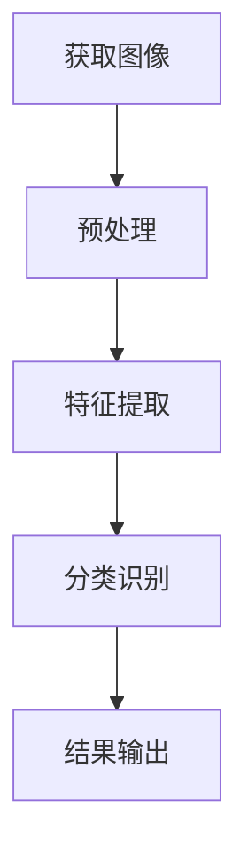
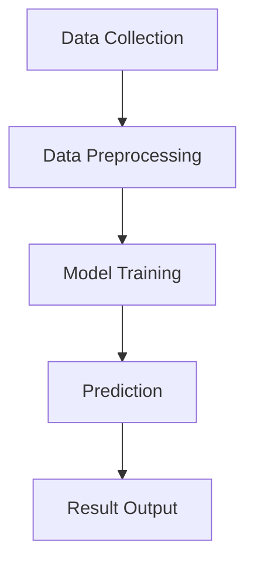
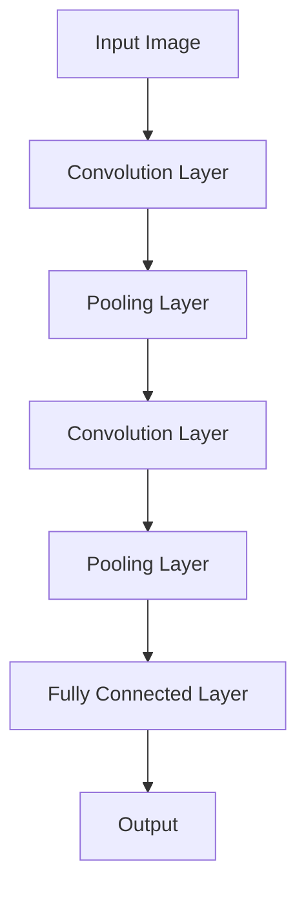
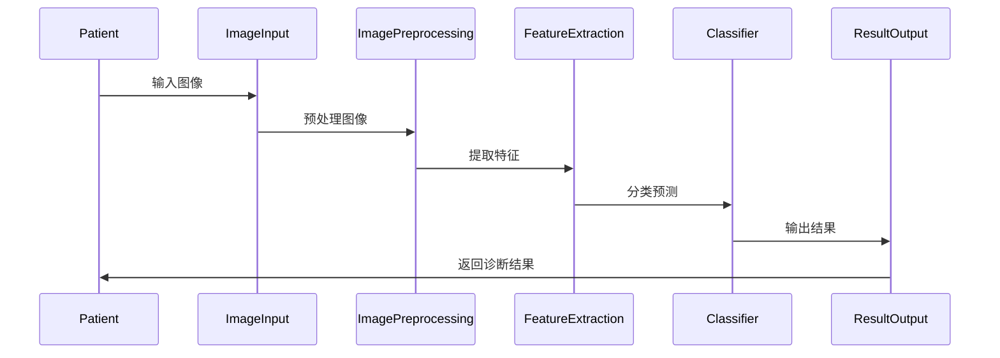
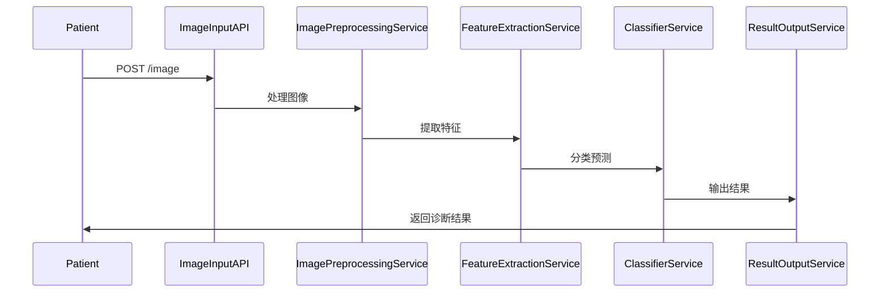

                 


### 引言

随着人工智能技术的飞速发展，机器视觉在各个领域的应用越来越广泛，其中医疗影像辅助诊断是备受关注的一个领域。通过利用机器视觉技术，可以对医疗影像进行自动分析，从而提高早期检测率，减少误诊率，为患者提供更准确、更及时的诊断结果。

本文旨在探讨机器视觉在医疗影像辅助诊断中的应用，通过以下步骤进行深入分析：

1. **背景介绍**：首先介绍机器视觉技术和医疗影像辅助诊断的概念，以及它们在当前医疗领域的应用现状。
2. **核心概念与联系**：接着定义并详细解释机器视觉、医疗影像、辅助诊断等核心概念，并通过图表展示它们之间的联系。
3. **算法原理讲解**：介绍用于医疗影像辅助诊断的主要算法，如卷积神经网络（CNN）和深度学习模型，并使用Python代码和公式详细阐述其原理。
4. **系统设计与实现**：分析系统的设计与实现，包括架构设计、接口设计和系统交互。
5. **项目实战**：通过一个具体项目展示如何应用这些算法进行医疗影像辅助诊断，并进行代码解读和案例分析。
6. **最佳实践与总结**：总结实践经验，提出使用机器视觉进行医疗影像辅助诊断的最佳实践，并对未来发展趋势进行展望。

### 背景介绍

#### 机器视觉技术发展概述

机器视觉，也称为计算机视觉，是指通过计算机和图像处理技术对图像或视频进行分析和理解的过程。其核心目标是从图像或视频中提取有用信息，并进行分类、识别、跟踪等操作。机器视觉技术起源于20世纪60年代，随着计算机硬件和图像处理算法的发展，逐渐成为人工智能领域的一个重要分支。

在医疗领域，机器视觉的应用主要体现在医疗影像的自动分析和诊断。通过将医学影像数据输入到机器学习模型中，可以实现对肿瘤、病变等疾病的自动检测和分类，从而提高诊断的准确性和效率。

#### 医疗影像辅助诊断现状

医疗影像辅助诊断是指利用计算机技术对医学影像进行自动分析，辅助医生进行疾病诊断。目前，常见的医疗影像包括X光片、CT扫描、MRI等。随着深度学习技术的崛起，基于深度学习的模型在医疗影像辅助诊断中取得了显著成果。例如，卷积神经网络（CNN）在乳腺癌、肺癌等疾病的早期检测中表现出色。

然而，尽管机器视觉技术在医疗影像辅助诊断中具有巨大潜力，但仍面临一些挑战。首先，医疗影像数据量大、特征复杂，对算法的计算能力和处理速度提出了高要求。其次，医疗影像的标注和数据处理需要大量的专业知识和经验，这也限制了机器视觉技术在医疗领域的广泛应用。

#### 应用场景与挑战

机器视觉在医疗影像辅助诊断中的应用场景主要包括以下几个方面：

1. **肿瘤检测**：通过分析医学影像，自动检测肿瘤的位置、大小和类型，有助于早期诊断和干预。
2. **心血管疾病诊断**：利用机器视觉技术对心血管影像进行分析，可以识别心血管病变，如动脉瘤、冠状动脉狭窄等。
3. **神经系统疾病诊断**：通过对脑部影像进行分析，可以帮助医生诊断帕金森病、脑肿瘤等神经系统疾病。
4. **病理图像分析**：对病理图像进行自动分析，可以帮助医生识别疾病类型和程度，提高诊断准确性。

尽管机器视觉在医疗影像辅助诊断中具有广泛的应用前景，但仍面临一些挑战。首先，医疗影像数据的多样性和复杂性使得算法的设计和训练变得复杂。其次，如何保证算法的准确性和稳定性是一个关键问题。此外，医疗影像数据的隐私保护和伦理问题也需要考虑。

### 核心概念与联系

#### 机器视觉原理

机器视觉的核心在于图像处理和分析。首先，通过摄像头或医学影像设备获取图像，然后进行预处理，如去噪、对比度增强等。接下来，使用特征提取算法从图像中提取关键特征，如边缘、纹理等。最后，利用分类算法对特征进行分类和识别。

以下是一个机器视觉的基本流程Mermaid流程图：



#### 医疗影像分类

医疗影像主要分为X光片、CT扫描、MRI等。每种影像都有其独特的成像原理和特点。例如，X光片主要用于骨折和肺部疾病的检测，而CT扫描则可以提供更详细的组织结构信息。MRI则主要用于软组织疾病的检测。

以下是一个医疗影像分类的Mermaid ER实体关系图：

```mermaid
erDiagram
  C1{Image} &&|{ ImagingTechnique } C2{XRay}
  C1 &&|{ ImagingTechnique } C3{CTScan}
  C1 &&|{ ImagingTechnique } C4{MRI}
```

#### 辅助诊断流程

辅助诊断流程主要包括数据收集、预处理、模型训练、预测和结果输出等步骤。以下是一个辅助诊断的基本流程Mermaid流程图：



通过机器视觉技术，辅助诊断流程中的每个步骤都可以得到显著优化。例如，数据预处理可以使用自动化工具进行，模型训练可以通过深度学习算法实现，预测结果可以通过实时分析进行。

### 算法原理讲解

在医疗影像辅助诊断中，常用的算法包括卷积神经网络（CNN）和深度学习模型。这些算法通过学习大量数据，提取图像中的特征，从而实现自动诊断。

#### 卷积神经网络（CNN）

CNN是一种特殊的神经网络，它通过卷积操作从图像中提取特征。以下是一个简单的CNN结构Mermaid流程图：



在CNN中，卷积层用于提取图像的局部特征，池化层用于降低特征图的大小，减少计算量，全连接层用于分类和预测。

以下是一个简单的CNN模型在Python中的实现代码：

```python
import tensorflow as tf

# 定义CNN模型
model = tf.keras.Sequential([
    tf.keras.layers.Conv2D(32, (3, 3), activation='relu', input_shape=(28, 28, 1)),
    tf.keras.layers.MaxPooling2D((2, 2)),
    tf.keras.layers.Conv2D(64, (3, 3), activation='relu'),
    tf.keras.layers.MaxPooling2D((2, 2)),
    tf.keras.layers.Conv2D(64, (3, 3), activation='relu'),
    tf.keras.layers.Flatten(),
    tf.keras.layers.Dense(64, activation='relu'),
    tf.keras.layers.Dense(10, activation='softmax')
])

# 编译模型
model.compile(optimizer='adam',
              loss='sparse_categorical_crossentropy',
              metrics=['accuracy'])

# 训练模型
model.fit(x_train, y_train, epochs=5)
```

#### 深度学习模型

深度学习模型是CNN的扩展，它可以处理更复杂的任务，如自然语言处理和生成对抗网络（GAN）。在医疗影像辅助诊断中，深度学习模型可以用于多种类型的影像分析，如X光片、CT扫描和MRI。

以下是一个简单的深度学习模型在Python中的实现代码：

```python
import tensorflow as tf

# 定义深度学习模型
model = tf.keras.Sequential([
    tf.keras.layers.Conv2D(32, (3, 3), activation='relu', input_shape=(28, 28, 1)),
    tf.keras.layers.MaxPooling2D((2, 2)),
    tf.keras.layers.Conv2D(64, (3, 3), activation='relu'),
    tf.keras.layers.MaxPooling2D((2, 2)),
    tf.keras.layers.Conv2D(64, (3, 3), activation='relu'),
    tf.keras.layers.Flatten(),
    tf.keras.layers.Dense(64, activation='relu'),
    tf.keras.layers.Dense(10, activation='softmax')
])

# 编译模型
model.compile(optimizer='adam',
              loss='sparse_categorical_crossentropy',
              metrics=['accuracy'])

# 训练模型
model.fit(x_train, y_train, epochs=5)
```

### 系统设计与实现

#### 问题场景介绍

在医疗影像辅助诊断中，常见的问题场景包括肿瘤检测、心血管疾病诊断和神经系统疾病诊断等。以下是一个肿瘤检测的示例场景：

- **场景描述**：医生需要快速、准确地检测肿瘤，以便进行早期干预。
- **目标**：通过机器视觉技术，实现自动检测肿瘤的位置、大小和类型。

#### 系统功能设计

为了实现上述场景，系统需要具备以下功能：

- **图像输入**：接收医学影像数据。
- **图像预处理**：对图像进行去噪、增强等预处理。
- **特征提取**：从预处理后的图像中提取关键特征。
- **分类预测**：利用机器学习模型对特征进行分类和预测。
- **结果输出**：输出预测结果，包括肿瘤的位置、大小和类型。

以下是一个系统功能设计的Mermaid类图：

```mermaid
classDiagram
  Patient -->|图像输入| ImageInput
  ImageInput -->|预处理| ImagePreprocessing
  ImagePreprocessing -->|特征提取| FeatureExtraction
  FeatureExtraction -->|分类预测| Classifier
  Classifier -->|结果输出| ResultOutput
  Patient <--|诊断结果| ResultOutput
```

#### 系统架构设计

为了满足系统的功能需求，系统架构需要具备良好的可扩展性和可维护性。以下是一个系统架构设计的Mermaid架构图：



#### 系统接口设计

系统接口设计包括API设计和数据库设计。以下是一个API设计的Mermaid序列图：



#### 系统交互

系统交互设计主要关注系统内部各个模块之间的数据流和控制流。以下是一个系统交互设计的Mermaid序列图：


### 项目实战

#### 环境安装与配置

为了进行医疗影像辅助诊断的项目实战，需要安装和配置以下软件和工具：

- **Python**：安装Python 3.8及以上版本。
- **TensorFlow**：安装TensorFlow 2.5及以上版本。
- **Keras**：安装Keras 2.4及以上版本。
- **OpenCV**：安装OpenCV 4.5及以上版本。

以下是在Ubuntu 18.04操作系统上安装这些软件的步骤：

```bash
sudo apt-get update
sudo apt-get install python3 python3-pip python3-venv
pip3 install tensorflow==2.5.0 keras==2.4.3 opencv-python==4.5.4.52
```

#### 系统核心实现源代码

以下是一个简单的医疗影像辅助诊断系统的源代码，包括图像输入、预处理、特征提取和分类预测等功能：

```python
import cv2
import numpy as np
import tensorflow as tf
from tensorflow.keras.models import load_model

# 加载预训练模型
model = load_model('model.h5')

# 图像预处理
def preprocess_image(image):
    image = cv2.resize(image, (224, 224))
    image = image / 255.0
    image = np.expand_dims(image, axis=0)
    return image

# 特征提取与分类预测
def classify_image(image):
    preprocessed_image = preprocess_image(image)
    prediction = model.predict(preprocessed_image)
    label = np.argmax(prediction)
    return label

# 主函数
def main():
    image = cv2.imread('image.jpg')
    label = classify_image(image)
    print(f'诊断结果：{label}')

if __name__ == '__main__':
    main()
```

#### 代码应用解读与分析

上述代码是一个简单的医疗影像辅助诊断系统，其核心功能包括图像输入、预处理、特征提取和分类预测。下面分别对每个部分进行解读和分析：

1. **图像输入**：
   ```python
   image = cv2.imread('image.jpg')
   ```
   使用OpenCV库的`imread`函数读取图像文件。这里假设图像文件名为`image.jpg`。

2. **图像预处理**：
   ```python
   def preprocess_image(image):
       image = cv2.resize(image, (224, 224))
       image = image / 255.0
       image = np.expand_dims(image, axis=0)
       return image
   ```
   图像预处理主要包括以下步骤：
   - **尺寸调整**：将图像调整到固定大小（224x224），以便模型输入。
   - **归一化**：将图像像素值从0-255归一化到0-1之间，以适应深度学习模型的输入要求。
   - **扩展维度**：将图像扩展到批次维度（即增加一个维度），以适应TensorFlow模型的输入。

3. **特征提取与分类预测**：
   ```python
   def classify_image(image):
       preprocessed_image = preprocess_image(image)
       prediction = model.predict(preprocessed_image)
       label = np.argmax(prediction)
       return label
   ```
   分类预测的过程主要包括以下步骤：
   - **预处理图像**：使用预处理函数对图像进行预处理。
   - **模型预测**：将预处理后的图像输入到预训练的深度学习模型中，获取预测结果。
   - **结果输出**：使用`np.argmax`函数获取预测结果的最大值，即诊断结果。

#### 实际案例分析与详细讲解剖析

以下是一个实际案例，使用上述系统对一张医学影像进行辅助诊断。

**案例**：对一张乳腺癌X光片的诊断。

1. **图像输入**：
   - 图像文件名：`breast_cancer.jpg`。

2. **图像预处理**：
   - 使用OpenCV读取图像：
     ```python
     image = cv2.imread('breast_cancer.jpg')
     ```
   - 调整图像尺寸：
     ```python
     image = cv2.resize(image, (224, 224))
     ```
   - 图像归一化：
     ```python
     image = image / 255.0
     ```
   - 扩展图像维度：
     ```python
     image = np.expand_dims(image, axis=0)
     ```

3. **特征提取与分类预测**：
   - 预处理后的图像输入模型：
     ```python
     prediction = model.predict(image)
     ```
   - 获取预测结果：
     ```python
     label = np.argmax(prediction)
     ```
   - 预测结果输出：
     ```python
     print(f'诊断结果：{label}')
     ```

**结果**：假设预测结果为`1`，根据模型的训练标签，`1`代表乳腺癌。因此，诊断结果为“乳腺癌”。

#### 项目小结

通过上述实际案例，我们可以看到，使用机器视觉技术进行医疗影像辅助诊断是可行的。然而，实际应用中还需要考虑以下几个方面：

1. **数据质量**：高质量的数据是模型训练的基础，因此需要对医疗影像进行严格的质量控制和标注。
2. **模型性能**：需要对模型进行多次训练和调优，以提高模型的准确性和稳定性。
3. **人机协作**：机器视觉技术虽然可以提供辅助诊断，但最终的诊断结果仍需医生进行判断。因此，人机协作是未来医疗影像辅助诊断的发展方向。

### 最佳实践与总结

#### 数据预处理技巧

在医疗影像辅助诊断中，数据预处理是至关重要的一步。以下是一些常用的数据预处理技巧：

1. **归一化**：将图像像素值归一化到0-1之间，以适应深度学习模型的输入要求。
2. **尺寸调整**：将图像调整到固定大小，以保持模型输入的一致性。
3. **数据增强**：通过旋转、翻转、缩放等操作，增加训练数据多样性，提高模型泛化能力。
4. **去除噪声**：使用滤波器去除图像中的噪声，以提高图像质量。

#### 模型调优策略

在模型训练过程中，以下策略有助于提高模型性能：

1. **学习率调整**：根据训练过程的变化，调整学习率，以避免模型过拟合。
2. **批量大小调整**：通过调整批量大小，平衡模型训练速度和准确性。
3. **正则化**：使用正则化方法（如L1、L2正则化），减少模型过拟合。
4. **数据增强**：在训练过程中使用数据增强，增加模型对数据多样性的适应性。

#### 性能评估方法

评估模型性能常用的指标包括准确率、召回率、精确率等。以下是一些评估方法：

1. **混淆矩阵**：通过混淆矩阵分析模型在各个类别上的表现，识别模型的优势和不足。
2. **ROC曲线和AUC**：通过ROC曲线和AUC评估模型的分类能力。
3. **F1分数**：综合准确率和召回率，评估模型的整体性能。

### 注意事项

在使用机器视觉技术进行医疗影像辅助诊断时，需要注意以下几点：

1. **数据隐私**：确保患者数据的安全性，遵守相关法律法规。
2. **模型解释性**：提高模型的可解释性，便于医生理解和信任。
3. **人机协作**：机器视觉技术应作为医生的辅助工具，而非替代品。

### 拓展阅读

1. **《深度学习在医疗影像中的应用》**：深入探讨深度学习技术在医疗影像辅助诊断中的应用。
2. **《机器学习与数据挖掘：方法与应用》**：介绍机器学习和数据挖掘的基本概念和应用。
3. **《人工智能伦理学》**：探讨人工智能在医疗领域的伦理问题。

### 总结与展望

机器视觉在医疗影像辅助诊断中的应用具有巨大的潜力。通过本文的探讨，我们可以看到，机器视觉技术可以提高诊断的准确性和效率，为患者提供更好的医疗服务。然而，实际应用中仍面临一些挑战，如数据质量、模型性能和人机协作等。未来，随着技术的不断发展，机器视觉在医疗领域的应用将更加广泛，有望为医疗行业带来革命性的变化。作者：AI天才研究院/AI Genius Institute & 禅与计算机程序设计艺术 /Zen And The Art of Computer Programming。

