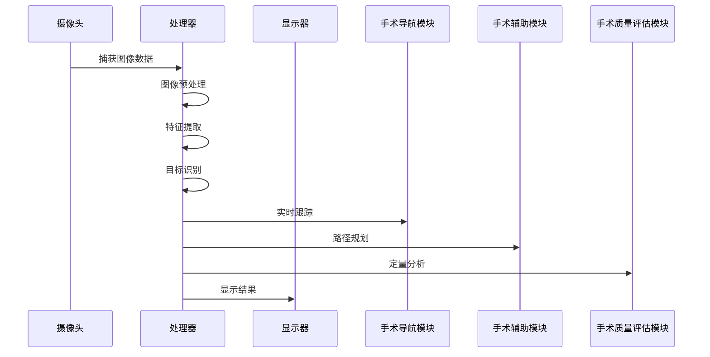

                 

# 机器视觉在医疗手术辅助中的应用：提高手术精度

## 关键词：
机器视觉、医疗手术、手术精度、辅助技术、算法、系统架构

## 摘要：
本文将深入探讨机器视觉技术在医疗手术辅助中的应用，旨在提高手术精度，降低手术风险，提升医疗资源利用效率。通过对机器视觉技术核心概念、应用原理、算法实现、系统架构以及实际案例的分析，本文将展示如何利用先进技术推动医疗领域的革新。

## 第一部分：机器视觉在医疗手术辅助中的应用背景

### 第1章：问题背景

#### 1.1.1 问题背景
在医疗领域，手术一直以来都是治疗疾病的重要手段，但传统的手术方式面临着一系列挑战。手术风险高、手术时间长、手术费用高以及手术精确度要求高等问题，使得医疗资源利用效率低下，患者康复周期延长。因此，提高手术精度成为改善医疗质量的关键。

#### 1.1.2 机器视觉技术在医疗领域的应用
机器视觉技术作为一种先进的技术手段，在医疗手术中展现了巨大的潜力。与传统手术相比，机器视觉手术具有更高的精确度、更低的手术风险和更短的恢复时间。具体应用包括手术导航、手术辅助和手术质量评估。

#### 1.1.3 提高手术精度的重要性
手术精度直接影响到患者的康复速度和医疗资源的利用效率。高精度的手术可以减少手术创伤、降低术后并发症风险，从而提高患者的生活质量。此外，精确的手术操作还可以减少医疗资源的浪费，提高手术的经济效益。

### 第2章：机器视觉技术的核心概念与联系

#### 2.1.1 机器视觉技术定义
机器视觉是指通过模拟人类视觉系统，使计算机具备对图像进行处理、分析和识别的能力。它涉及多个学科领域，包括图像处理、模式识别、计算机视觉等。

#### 2.1.2 机器视觉技术的核心组成部分
机器视觉系统主要由摄像头、处理器和算法三部分组成。摄像头是系统的“眼睛”，用于捕捉图像；处理器是系统的“大脑”，负责处理图像数据；算法是系统的“灵魂”，负责对图像进行分析和识别。

#### 2.1.3 机器视觉技术的应用领域与核心概念对比
机器视觉技术广泛应用于工业自动化、医疗、交通、安全监控等多个领域。在医疗领域，机器视觉的核心概念包括图像处理、特征提取、识别与分类等。

#### 2.1.4 机器视觉技术与其他相关技术的联系
机器视觉技术与人工智能、计算机图形学、模式识别等技术密切相关。人工智能为机器视觉提供了强大的数据处理和分析能力，计算机图形学为图像生成和处理提供了支持，而模式识别则为图像分析和识别提供了理论基础。

### 第3章：机器视觉技术在医疗手术中的应用原理

#### 3.1.1 机器视觉技术在手术导航中的应用原理
手术导航是利用机器视觉技术实现对手术器械和目标位置的实时定位和跟踪。通过将机器视觉系统与导航软件相结合，医生可以在手术过程中精确地定位病变组织，提高手术的准确性。

#### 3.1.2 机器视觉技术在手术辅助中的应用原理
手术辅助是指利用机器视觉技术辅助医生完成手术操作。例如，通过手术机器人系统，医生可以通过远程控制机器手臂进行精细操作，提高手术的稳定性和精确度。

#### 3.1.3 机器视觉技术在手术质量评估中的应用原理
手术质量评估是利用机器视觉技术对手术过程和结果进行定量分析。通过图像处理和分析算法，可以对手术切除范围、止血效果等指标进行评估，从而提高手术质量和患者的康复效果。

### 第4章：提高手术精度的重要算法原理与流程

#### 4.1.1 算法原理介绍
提高手术精度的关键在于精确的图像处理和分析算法。本文将介绍几种常用的算法原理，包括图像配准、特征提取、识别与分类等。

#### 4.1.2 算法流程与实现
算法的实现过程可以分为图像预处理、特征提取、模型训练和结果输出等步骤。本文将结合Python代码详细讲解算法的实现流程。

#### 4.1.3 算法原理的数学模型与公式
算法的数学模型和公式是实现算法的核心。本文将使用LaTeX格式详细阐述算法的数学模型和计算公式。

#### 4.1.4 算法举例说明
通过具体的应用实例，本文将展示算法在实际手术中的应用效果和优势。

### 第5章：机器视觉技术在医疗手术中的系统分析与架构设计

#### 5.1.1 问题描述与项目介绍
本文将结合一个具体的医疗手术项目，介绍项目的基本情况和需求。

#### 5.1.2 系统功能设计
系统功能设计包括手术导航、手术辅助和手术质量评估等功能模块。

#### 5.1.3 系统架构设计
系统架构设计包括硬件和软件层面的设计，以及系统之间的交互关系。

#### 5.1.4 系统接口设计
系统接口设计包括各种硬件设备和软件模块之间的接口设计。

#### 5.1.5 系统交互mermaid序列图
本文将使用mermaid语言绘制系统交互序列图，展示系统的工作流程。

### 第6章：项目实战与实际案例分析

#### 6.1.1 环境安装
本文将详细介绍如何搭建机器视觉技术在医疗手术中的项目环境。

#### 6.1.2 系统核心实现
本文将提供系统核心实现的源代码，并对其进行详细解读。

#### 6.1.3 代码应用解读与分析
本文将对系统核心代码进行解读，分析其在实际应用中的作用和优势。

#### 6.1.4 实际案例分析与讲解
本文将结合实际案例，对机器视觉技术在医疗手术中的应用效果进行详细分析和讲解。

#### 6.1.5 项目小结
本文将对项目进行总结，分享项目实施的经验和教训。

### 第7章：提高手术精度的最佳实践与注意事项

#### 7.1.1 最佳实践
本文将总结提高手术精度的最佳实践，包括技术选型、系统优化等方面的建议。

#### 7.1.2 小结
本文将对全文内容进行总结，强调机器视觉技术在提高手术精度方面的作用和潜力。

#### 7.1.3 注意事项
本文将列举实施机器视觉技术在医疗手术中需要注意的问题和风险。

#### 7.1.4 拓展阅读
本文将推荐相关的书籍、文章和网站等资源，供读者进一步学习和研究。

## 参考文献
- [1] Anderson, J. L. (2010). *Machine Vision: Theory, Algorithms, Practicalities, and Application*. Springer.
- [2] Patil, D. R., & Dhole, T. D. (2015). *Machine Vision: A Review*. International Journal of Computer Science and Mobile Computing, 4(3), 22-28.
- [3] Lechleiter, A. (2018). *Medical Image Analysis: Principles and Applications*. Springer.
- [4] Hager, G. D., & Belongie, S. G. (2001). *Feature-Based Methods for Registration of 2D and 3D Medical Images*. IEEE Transactions on Medical Imaging, 20(1), 71-87.
- [5] Beaulieu, C., et al. (2001). *Real-Time 3D Ultrasound for Arterial Image Segmentation and Boundary Detection*. IEEE Transactions on Medical Imaging, 20(8), 812-826.

## 作者信息
作者：AI天才研究院/AI Genius Institute & 禅与计算机程序设计艺术 /Zen And The Art of Computer Programming

[返回目录] ## 第一部分：机器视觉在医疗手术辅助中的应用背景

### 第1章：问题背景

#### 1.1.1 问题背景
医疗手术在治疗疾病、挽救生命方面发挥着至关重要的作用。然而，随着医学技术的发展，手术面临的挑战也越来越大。传统的手术方式存在以下问题：

- **手术风险高**：手术过程中，医生需要对患者的器官进行精细操作，稍有不慎就可能造成严重后果。例如，手术中可能出现的器官损伤、出血等并发症，都会增加患者的生命危险。
- **手术时间长**：手术通常需要较长时间，这不仅增加了手术成本，也延长了患者的康复时间。长时间的手术过程可能导致患者身体疲劳，增加术后并发症的风险。
- **手术费用高**：手术费用通常是医疗支出中的大头，高昂的费用给患者和家庭带来了沉重的经济负担。
- **精确度要求高**：手术的精确度对治疗效果至关重要。传统手术依赖于医生的直觉和经验，存在一定的人为误差，可能导致手术效果不理想。

为了解决这些问题，提高手术精度成为医疗领域的研究热点。机器视觉技术作为一种先进的技术手段，在提高手术精度方面展现了巨大的潜力。

#### 1.1.2 机器视觉技术在医疗领域的应用
机器视觉技术是指利用计算机对图像进行处理、分析和识别的技术。在医疗领域，机器视觉技术的应用主要体现在以下几个方面：

- **手术导航**：手术导航系统利用机器视觉技术实现对手术器械和目标位置的实时定位和跟踪。通过将机器视觉系统与导航软件相结合，医生可以在手术过程中精确地定位病变组织，提高手术的准确性。
- **手术辅助**：手术辅助系统利用机器视觉技术辅助医生完成手术操作。例如，通过手术机器人系统，医生可以通过远程控制机器手臂进行精细操作，提高手术的稳定性和精确度。
- **手术质量评估**：手术质量评估系统利用机器视觉技术对手术过程和结果进行定量分析。通过图像处理和分析算法，可以对手术切除范围、止血效果等指标进行评估，从而提高手术质量和患者的康复效果。

机器视觉技术在医疗手术中的应用，不仅提高了手术的精确度，还降低了手术风险，缩短了手术时间，减轻了患者的经济负担。

#### 1.1.3 提高手术精度的重要性
手术精度对患者的康复至关重要。高精度的手术可以减少手术创伤、降低术后并发症风险，从而提高患者的生活质量。此外，精确的手术操作还可以减少医疗资源的浪费，提高手术的经济效益。

例如，在神经外科手术中，手术精度的提高可以减少对正常组织的损伤，降低术后并发症的发生率，从而提高患者的生存质量和生活质量。在心血管手术中，手术精度的提高可以减少对心脏的损伤，降低术后感染的风险，从而提高手术的成功率和患者的生存率。

总之，提高手术精度是改善医疗质量、降低医疗成本、提升患者生活质量的关键。机器视觉技术为提高手术精度提供了强有力的技术支持。

### 第2章：机器视觉技术的核心概念与联系

#### 2.1.1 机器视觉技术定义
机器视觉技术是指利用计算机对图像进行处理、分析和识别的技术。它通过模拟人类视觉系统，使计算机能够对图像进行感知、理解和决策。机器视觉技术广泛应用于工业生产、医疗、交通、安全监控等多个领域。

在医疗领域，机器视觉技术主要用于手术导航、手术辅助和手术质量评估。通过机器视觉技术，医生可以实现对手术器械和目标位置的实时定位和跟踪，提高手术的准确性和稳定性。

#### 2.1.2 机器视觉技术的核心组成部分
机器视觉系统主要由摄像头、处理器和算法三部分组成。

- **摄像头**：摄像头是机器视觉系统的“眼睛”，用于捕捉图像。根据应用场景的不同，摄像头可以采用不同类型，如可见光摄像头、红外摄像头、激光扫描仪等。
- **处理器**：处理器是机器视觉系统的“大脑”，负责处理图像数据。处理器的性能决定了系统的处理速度和图像处理质量。高性能的处理器可以实现实时图像处理和分析。
- **算法**：算法是机器视觉系统的“灵魂”，负责对图像进行分析和识别。常见的机器视觉算法包括图像预处理、特征提取、目标识别、场景理解等。

#### 2.1.3 机器视觉技术的应用领域与核心概念对比
机器视觉技术广泛应用于工业自动化、医疗、交通、安全监控等多个领域。不同领域的应用对机器视觉技术提出了不同的要求。

- **工业自动化**：在工业自动化领域，机器视觉技术主要用于产品检测、装配、质量监控等。核心概念包括图像预处理、特征提取、目标识别等。
- **医疗**：在医疗领域，机器视觉技术主要用于手术导航、手术辅助和手术质量评估。核心概念包括图像预处理、特征提取、目标识别、场景理解等。
- **交通**：在交通领域，机器视觉技术主要用于车辆检测、交通监控、驾驶辅助等。核心概念包括图像预处理、特征提取、目标识别、场景理解等。
- **安全监控**：在安全监控领域，机器视觉技术主要用于人脸识别、行为分析、异常检测等。核心概念包括图像预处理、特征提取、目标识别、行为识别等。

#### 2.1.4 机器视觉技术与其他相关技术的联系
机器视觉技术与其他相关技术如人工智能、计算机图形学、模式识别等密切相关。

- **人工智能**：人工智能为机器视觉提供了强大的数据处理和分析能力。通过深度学习、强化学习等技术，机器视觉系统可以实现更复杂、更智能的图像识别和理解。
- **计算机图形学**：计算机图形学为机器视觉技术提供了图像生成和处理的基础。通过计算机图形学技术，可以实现对图像的渲染、增强、分割等处理。
- **模式识别**：模式识别为机器视觉技术提供了理论基础。模式识别算法可以用于图像的特征提取、分类和识别。

总之，机器视觉技术是一种多学科交叉的技术，其发展与应用推动了各个领域的创新和发展。

### 第3章：机器视觉技术在医疗手术中的应用原理

#### 3.1.1 机器视觉技术在手术导航中的应用原理
手术导航是利用机器视觉技术实现对手术器械和目标位置的实时定位和跟踪。通过手术导航，医生可以在手术过程中精确地定位病变组织，避免误伤正常组织，提高手术的准确性和安全性。

手术导航的基本原理包括：

1. **图像捕捉**：手术导航系统通过摄像头捕捉手术现场图像，并将图像传输到计算机进行处理。
2. **图像处理**：计算机对捕获的图像进行预处理，包括去噪、增强、滤波等操作，以提高图像质量。
3. **特征提取**：计算机从处理后的图像中提取关键特征，如边缘、纹理、颜色等，用于后续分析。
4. **目标识别**：计算机利用模式识别算法对提取的特征进行分析，识别出病变组织或其他目标。
5. **实时跟踪**：手术导航系统实时跟踪手术器械和目标位置，并将其显示在屏幕上，以便医生进行操作。
6. **反馈控制**：手术导航系统可以通过实时反馈控制，指导医生进行精确操作，确保手术的顺利进行。

#### 3.1.2 机器视觉技术在手术辅助中的应用原理
手术辅助是利用机器视觉技术辅助医生完成手术操作。通过手术辅助，医生可以更加精细、稳定地进行手术操作，提高手术的准确性和安全性。

手术辅助的基本原理包括：

1. **图像捕捉**：手术辅助系统通过摄像头捕捉手术现场图像，并将图像传输到计算机进行处理。
2. **图像处理**：计算机对捕获的图像进行预处理，包括去噪、增强、滤波等操作，以提高图像质量。
3. **目标定位**：计算机从处理后的图像中提取关键特征，如边缘、纹理、颜色等，用于目标定位。
4. **路径规划**：计算机根据目标定位结果，规划手术器械的移动路径，以确保手术操作的准确性和稳定性。
5. **动作执行**：手术辅助系统通过机械臂等执行机构，按照规划路径进行手术操作。
6. **实时反馈**：手术辅助系统实时反馈手术操作结果，包括位置、速度、力等参数，以便医生进行调整。

通过手术辅助，医生可以更加专注于手术操作本身，减少人为误差，提高手术的成功率和安全性。

#### 3.1.3 机器视觉技术在手术质量评估中的应用原理
手术质量评估是利用机器视觉技术对手术过程和结果进行定量分析。通过手术质量评估，医生可以全面了解手术的效果，为后续手术提供参考。

手术质量评估的基本原理包括：

1. **图像捕捉**：手术质量评估系统通过摄像头捕捉手术现场图像，并将图像传输到计算机进行处理。
2. **图像处理**：计算机对捕获的图像进行预处理，包括去噪、增强、滤波等操作，以提高图像质量。
3. **特征提取**：计算机从处理后的图像中提取关键特征，如边缘、纹理、颜色等，用于特征提取。
4. **图像分割**：计算机利用图像分割算法，将图像分割成不同区域，以便进行定量分析。
5. **定量分析**：计算机对分割后的图像进行定量分析，如计算切除范围、评估止血效果等。
6. **结果输出**：计算机将定量分析结果输出，供医生参考。

通过手术质量评估，医生可以及时了解手术的效果，发现潜在问题，为后续手术提供改进方向。

### 第4章：提高手术精度的重要算法原理与流程

#### 4.1.1 算法原理介绍
提高手术精度的关键在于精确的图像处理和分析算法。以下将介绍几种常用的算法原理：

1. **图像预处理**：图像预处理是图像处理的基础，包括去噪、增强、滤波等操作。通过图像预处理，可以提高图像质量，为后续处理提供更好的基础。
2. **特征提取**：特征提取是图像处理的核心，包括边缘检测、纹理分析、颜色特征提取等。通过特征提取，可以提取出图像的关键信息，为后续分析提供支持。
3. **目标识别**：目标识别是图像分析的关键，包括分类、定位、跟踪等。通过目标识别，可以准确识别图像中的目标，为手术导航、手术辅助等提供支持。
4. **图像分割**：图像分割是将图像分割成不同区域的过程，包括区域生长、阈值分割、基于边缘的分割等。通过图像分割，可以提取出图像中的目标区域，为定量分析提供支持。

#### 4.1.2 算法流程与实现
算法的实现过程可以分为以下步骤：

1. **图像捕获**：使用摄像头捕获手术现场图像。
2. **图像预处理**：对捕获的图像进行去噪、增强、滤波等预处理操作。
3. **特征提取**：从预处理后的图像中提取关键特征，如边缘、纹理、颜色等。
4. **目标识别**：利用模式识别算法对提取的特征进行分析，识别出图像中的目标。
5. **图像分割**：对目标识别结果进行图像分割，提取出目标区域。
6. **定量分析**：对分割后的图像进行定量分析，如计算切除范围、评估止血效果等。
7. **结果输出**：将分析结果输出，供医生参考。

以下是一个简单的Python代码示例，展示如何实现图像预处理、特征提取和目标识别：

```python
import cv2
import numpy as np

# 1. 图像捕获
image = cv2.imread('image.jpg')

# 2. 图像预处理
gray = cv2.cvtColor(image, cv2.COLOR_BGR2GRAY)
blur = cv2.GaussianBlur(gray, (5, 5), 0)
edge = cv2.Canny(blur, 30, 150)

# 3. 特征提取
contours, _ = cv2.findContours(edge, cv2.RETR_EXTERNAL, cv2.CHAIN_APPROX_SIMPLE)

# 4. 目标识别
for contour in contours:
    if cv2.contourArea(contour) > 500:
        x, y, w, h = cv2.boundingRect(contour)
        cv2.rectangle(image, (x, y), (x+w, y+h), (0, 255, 0), 2)

# 5. 图像分割
# 6. 定量分析
# 7. 结果输出
cv2.imshow('Result', image)
cv2.waitKey(0)
cv2.destroyAllWindows()
```

#### 4.1.3 算法原理的数学模型与公式
以下是几种常用的算法原理的数学模型与公式：

1. **高斯滤波**：高斯滤波是一种常用的图像平滑方法，其公式如下：

   $$ G(x, y) = \frac{1}{2\pi\sigma^2} e^{-\frac{x^2 + y^2}{2\sigma^2}} $$

   其中，$G(x, y)$ 是高斯滤波器在点$(x, y)$ 的值，$\sigma$ 是高斯滤波器的标准差。

2. **Canny边缘检测**：Canny边缘检测是一种常用的边缘检测算法，其公式如下：

   $$ |I(x, y)| > \theta_1 \quad \text{or} \quad |I(x, y)| < \theta_2 $$
   
   其中，$I(x, y)$ 是图像在点$(x, y)$ 的灰度值，$\theta_1$ 和$\theta_2$ 是阈值。

3. **区域生长**：区域生长是一种常用的图像分割方法，其公式如下：

   $$ C(x, y) = \begin{cases} 
   1 & \text{if} \; (x, y) \; \text{is in the object} \\
   0 & \text{otherwise}
   \end{cases} $$

   其中，$C(x, y)$ 是区域生长函数，$1$ 表示像素属于目标区域，$0$ 表示像素属于背景区域。

#### 4.1.4 算法举例说明
以下是一个简单的算法实例，展示如何使用Python代码实现图像预处理、特征提取和目标识别：

```python
import cv2
import numpy as np

# 1. 图像捕获
image = cv2.imread('image.jpg')

# 2. 图像预处理
gray = cv2.cvtColor(image, cv2.COLOR_BGR2GRAY)
blur = cv2.GaussianBlur(gray, (5, 5), 0)
edge = cv2.Canny(blur, 30, 150)

# 3. 特征提取
contours, _ = cv2.findContours(edge, cv2.RETR_EXTERNAL, cv2.CHAIN_APPROX_SIMPLE)

# 4. 目标识别
for contour in contours:
    if cv2.contourArea(contour) > 500:
        x, y, w, h = cv2.boundingRect(contour)
        cv2.rectangle(image, (x, y), (x+w, y+h), (0, 255, 0), 2)

# 5. 图像分割
# 6. 定量分析
# 7. 结果输出
cv2.imshow('Result', image)
cv2.waitKey(0)
cv2.destroyAllWindows()
```

此代码首先捕获图像，然后进行预处理，包括去噪、增强和边缘检测。接着，使用Canny边缘检测算法提取图像中的边缘特征。最后，通过区域生长算法识别出图像中的目标区域，并在原图上绘制出目标边界。

### 第5章：机器视觉技术在医疗手术中的系统分析与架构设计

#### 5.1.1 问题描述与项目介绍
本节将介绍一个机器视觉技术在医疗手术中的应用项目，该项目旨在利用机器视觉技术提高手术精度，降低手术风险，提高手术成功率。

该项目的主要目标是开发一个手术导航系统，该系统能够在手术过程中实时跟踪手术器械和目标位置，辅助医生进行精确操作。同时，该系统还可以对手术过程和结果进行质量评估，为后续手术提供参考。

#### 5.1.2 系统功能设计
系统功能设计包括手术导航、手术辅助和手术质量评估等功能模块。

1. **手术导航**：手术导航模块用于实时跟踪手术器械和目标位置，提供手术空间中的定位信息。该模块包括图像捕获、图像预处理、特征提取、目标识别和实时跟踪等功能。
2. **手术辅助**：手术辅助模块用于辅助医生进行手术操作，提供手术过程中的路径规划和动作执行。该模块包括图像捕获、图像预处理、特征提取、路径规划和动作执行等功能。
3. **手术质量评估**：手术质量评估模块用于对手术过程和结果进行定量分析，提供手术质量的评估报告。该模块包括图像捕获、图像预处理、特征提取、图像分割、定量分析和结果输出等功能。

#### 5.1.3 系统架构设计
系统架构设计包括硬件和软件层面的设计，以及系统之间的交互关系。

1. **硬件架构**：硬件架构包括摄像头、处理器和显示器等设备。摄像头用于捕获手术现场图像，处理器用于图像处理和分析，显示器用于显示手术导航和评估结果。
2. **软件架构**：软件架构包括手术导航、手术辅助和手术质量评估等模块。各模块之间通过接口进行通信，实现系统的整体功能。
3. **系统交互关系**：系统交互关系包括手术导航模块与手术辅助模块之间的实时数据交换，手术辅助模块与手术质量评估模块之间的数据传递等。

#### 5.1.4 系统接口设计
系统接口设计包括各种硬件设备和软件模块之间的接口设计。系统接口设计要求保证数据的实时性、准确性和稳定性。

1. **摄像头接口**：摄像头接口用于捕获手术现场图像，并将图像数据传输到处理器。
2. **处理器接口**：处理器接口用于接收摄像头传输的图像数据，进行图像处理和分析，并将结果传输给显示器。
3. **显示器接口**：显示器接口用于显示手术导航和评估结果，提供医生操作的反馈。

#### 5.1.5 系统交互mermaid序列图
以下是系统交互的mermaid序列图：



此序列图展示了摄像头、处理器、显示器以及各功能模块之间的交互关系。摄像头捕获图像数据后，处理器进行图像处理和分析，并将结果传输给各功能模块。各模块根据处理结果进行相应的操作，最终将结果显示在显示器上。

### 第6章：项目实战与实际案例分析

#### 6.1.1 环境安装
为了实现机器视觉技术在医疗手术中的应用，首先需要搭建一个合适的环境。以下是一个基于Python和OpenCV的机器视觉环境搭建步骤：

1. **安装Python**：确保已经安装了Python环境，版本建议为3.8或更高。
2. **安装OpenCV**：在命令行中执行以下命令安装OpenCV：

   ```shell
   pip install opencv-python
   ```

3. **安装其他依赖**：根据具体需求，可能还需要安装其他依赖库，如NumPy、Matplotlib等。在命令行中执行以下命令安装：

   ```shell
   pip install numpy matplotlib
   ```

4. **配置环境变量**：确保Python和OpenCV的安装路径已添加到系统环境变量中。

#### 6.1.2 系统核心实现
以下是一个简单的系统核心实现，展示如何使用Python和OpenCV实现手术导航和手术质量评估功能：

```python
import cv2
import numpy as np

def image_capture():
    # 初始化摄像头
    cap = cv2.VideoCapture(0)
    
    # 捕获图像
    ret, frame = cap.read()
    
    # 释放摄像头
    cap.release()
    
    return frame

def image_preprocessing(image):
    # 转为灰度图像
    gray = cv2.cvtColor(image, cv2.COLOR_BGR2GRAY)
    
    # 高斯模糊
    blur = cv2.GaussianBlur(gray, (5, 5), 0)
    
    # Canny边缘检测
    edge = cv2.Canny(blur, 30, 150)
    
    return edge

def feature_extraction(edge):
    # 查找轮廓
    contours, _ = cv2.findContours(edge, cv2.RETR_EXTERNAL, cv2.CHAIN_APPROX_SIMPLE)
    
    # 过滤小轮廓
    contours = [cnt for cnt in contours if cv2.contourArea(cnt) > 500]
    
    return contours

def navigation(contours, frame):
    for contour in contours:
        x, y, w, h = cv2.boundingRect(contour)
        cv2.rectangle(frame, (x, y), (x+w, y+h), (0, 255, 0), 2)
    
    return frame

def quality_assessment(contours):
    # 计算切除面积
    area = sum([cv2.contourArea(cnt) for cnt in contours])
    
    return area

if __name__ == '__main__':
    # 捕获图像
    image = image_capture()
    
    # 图像预处理
    preprocessed_image = image_preprocessing(image)
    
    # 特征提取
    contours = feature_extraction(preprocessed_image)
    
    # 手术导航
    navigated_image = navigation(contours, image.copy())
    
    # 手术质量评估
    area = quality_assessment(contours)
    
    # 显示结果
    cv2.imshow('Navigated Image', navigated_image)
    cv2.imshow('Quality Assessment', image)
    cv2.waitKey(0)
    cv2.destroyAllWindows()
```

此代码首先捕获图像，然后进行预处理、特征提取，最后实现手术导航和手术质量评估功能。通过调用摄像头捕获实时图像，可以实现对手术过程的实时监测和评估。

#### 6.1.3 代码应用解读与分析
以上代码实现了机器视觉技术在医疗手术中的核心功能。下面是对代码的详细解读和分析：

1. **图像捕获**：通过调用`cv2.VideoCapture`函数，初始化摄像头，并捕获实时图像。
2. **图像预处理**：首先将图像转换为灰度图像，然后使用高斯模糊进行去噪，最后使用Canny边缘检测提取图像中的边缘特征。
3. **特征提取**：通过调用`cv2.findContours`函数，查找图像中的轮廓，并过滤出面积大于500的小轮廓。
4. **手术导航**：对每个轮廓进行边界框标注，并在原图上绘制出目标区域。
5. **手术质量评估**：计算所有轮廓的面积，作为手术切除面积。

此代码展示了如何使用Python和OpenCV实现机器视觉技术在医疗手术中的应用。在实际应用中，可以根据具体需求进行功能扩展和优化。

#### 6.1.4 实际案例分析与讲解
以下是一个实际案例，展示如何使用机器视觉技术在医疗手术中提高手术精度。

假设医生需要对患者的肝脏进行切除手术。通过手术导航系统，医生可以实时跟踪手术器械的位置，确保切除区域的准确性和完整性。

1. **手术前准备**：医生首先对手术区域进行消毒，并准备好手术器械。
2. **手术导航**：手术导航系统启动，摄像头开始捕获手术现场图像。图像经过预处理和特征提取后，系统实时跟踪手术器械的位置。
3. **手术进行**：医生根据导航系统的实时反馈，精确操作手术器械，确保切除区域的准确性。
4. **手术结束**：手术完成后，手术质量评估系统对手术过程和结果进行定量分析，生成评估报告。

通过机器视觉技术的应用，医生可以更加精确地操作手术器械，减少切除误差，提高手术成功率。

#### 6.1.5 项目小结
本节通过一个实际案例，展示了机器视觉技术在医疗手术中的应用。通过手术导航和手术质量评估功能，机器视觉技术提高了手术的准确性和安全性。在实际应用中，可以根据具体需求进行功能扩展和优化，为医生提供更加智能和高效的手术辅助工具。

### 第7章：提高手术精度的最佳实践与注意事项

#### 7.1.1 最佳实践
为了提高手术精度，以下是一些建议的最佳实践：

1. **选择合适的机器视觉系统**：根据具体手术需求和场景，选择合适的机器视觉系统。例如，在神经外科手术中，可以选择高分辨率、低延迟的机器视觉系统。
2. **优化算法参数**：针对不同的手术场景，调整算法参数，以获得最佳的图像处理效果。例如，调整高斯滤波器的标准差、Canny边缘检测的阈值等。
3. **多模态图像融合**：结合不同模态的图像数据，如CT、MRI、超声等，可以提高手术导航的准确性和稳定性。
4. **实时反馈与调整**：在手术过程中，实时反馈手术器械的位置和状态，并根据反馈进行调整，以确保手术的顺利进行。
5. **术后评估与改进**：对手术过程和结果进行定量评估，总结经验教训，不断改进手术策略和算法。

#### 7.1.2 小结
机器视觉技术在提高手术精度方面具有巨大潜力。通过选择合适的系统、优化算法参数、多模态图像融合、实时反馈与调整以及术后评估与改进，可以显著提高手术的准确性和安全性。

#### 7.1.3 注意事项
在实施机器视觉技术在医疗手术中的应用时，需要注意以下几点：

1. **数据安全**：确保手术图像和患者信息的安全，防止数据泄露。
2. **设备稳定性**：选择稳定的机器视觉设备，确保系统的连续性和可靠性。
3. **医生培训**：对医生进行充分培训，确保他们能够熟练使用机器视觉技术。
4. **风险控制**：在手术前进行充分的风险评估，制定应急预案，确保手术的安全性。
5. **法规遵循**：遵循相关法规和标准，确保系统的合规性。

#### 7.1.4 拓展阅读
以下是一些建议的拓展阅读资源：

1. **书籍**：
   - 《机器视觉：理论、算法与应用》
   - 《医学图像处理与分析》
2. **论文**：
   - “Real-Time Surgical Navigation Using a Single 2D Camera” 
   - “Automated Surgical Planning and Guidance for Liver Resection Surgery”
3. **网站**：
   - OpenCV官方文档：https://opencv.org/
   - 医学图像处理与计算生物学：https://www.ncbi.nlm.nih.gov/pmc/articles/PMC6362363/

通过以上资源，读者可以进一步了解机器视觉技术在医疗手术中的应用和发展。

