                 


### 文章标题：机器视觉在自动化质量控制中的应用

#### 关键词：机器视觉、自动化质量控制、图像处理、算法原理、深度学习

#### 摘要：

本文将从机器视觉和自动化质量控制的基础知识出发，详细探讨机器视觉技术在自动化质量控制中的应用。文章首先介绍了机器视觉技术的基本概念、发展历史和应用领域，接着分析了自动化质量控制的基本概念、关键问题和当前趋势。随后，文章深入探讨了图像采集与预处理、特征提取与选择、质量检测与分类等核心技术，并介绍了机器学习和深度学习算法在质量控制中的应用。在此基础上，文章详细阐述了自动化质量控制系统的设计与实现，以及实际案例分析和系统优化策略。最后，文章对机器视觉技术在自动化质量控制中的未来发展趋势和挑战进行了展望。

## 第一部分：引言与背景

### 1.1 机器视觉技术的基本概念

机器视觉是指利用计算机和图像处理技术，对物体或场景进行自动识别、分析和理解的过程。它是一种基于图像处理的自动化技术，能够替代或辅助人类视觉功能，实现各种自动化任务。

#### 核心概念与联系

| 核心概念 | 原属性质 | 对比特征 |  
| --- | --- | --- |  
| 图像处理 | 对图像进行加工和操作的过程 | 包括图像增强、滤波、边缘检测等 |  
| 计算机视觉 | 利用计算机对图像进行分析和理解 | 包括目标检测、图像识别、场景理解等 |  
| 机器视觉 | 结合图像处理和计算机视觉，实现自动化任务 | 具有识别、分类、测量等功能 |

#### ER实体关系图架构

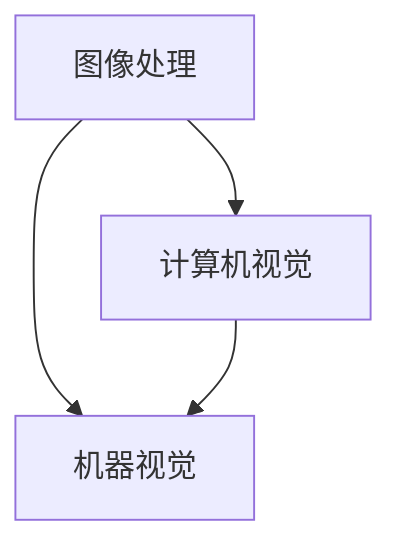

### 1.2 机器视觉技术的发展历史

机器视觉技术的发展始于20世纪60年代，最初主要应用于工业生产中的质量控制。随着计算机技术的飞速发展，机器视觉技术逐渐成熟，并广泛应用于各种领域。以下是机器视觉技术发展的简要历程：

| 时间 | 事件 |  
| --- | --- |  
| 1960年代 | 机器视觉技术初步应用于工业生产 |  
| 1980年代 | 图像处理算法和硬件技术取得重大突破 |  
| 1990年代 | 计算机视觉技术逐渐成熟，开始应用于医学、安防等领域 |  
| 2000年代至今 | 深度学习技术的兴起，推动了机器视觉技术的快速发展 |

#### 发展历程 Mermaid 流程图

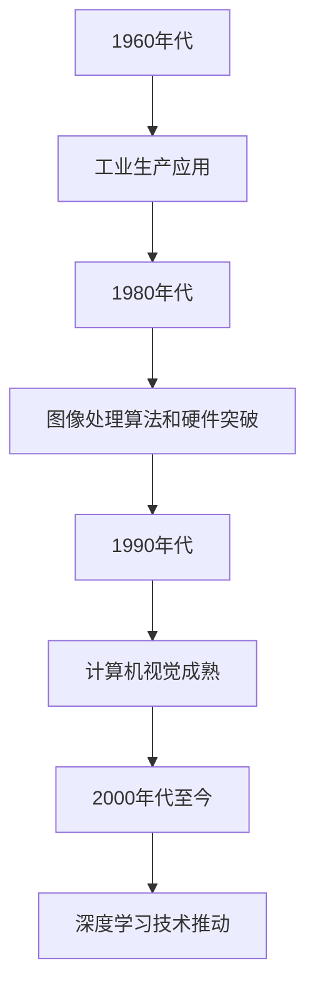

### 1.3 机器视觉技术的应用领域

机器视觉技术具有广泛的应用领域，包括但不限于以下几个方面：

1. **工业生产**：用于产品质量检测、装配、焊接、涂装等环节。
2. **医学**：用于医学影像分析、病理诊断、手术辅助等。
3. **安防**：用于人脸识别、车辆识别、行为分析等。
4. **农业**：用于作物生长监测、病虫害检测、农田管理等。
5. **交通**：用于交通流量监测、智能交通管理、无人驾驶等。

#### 应用领域 Mermaid 流程图

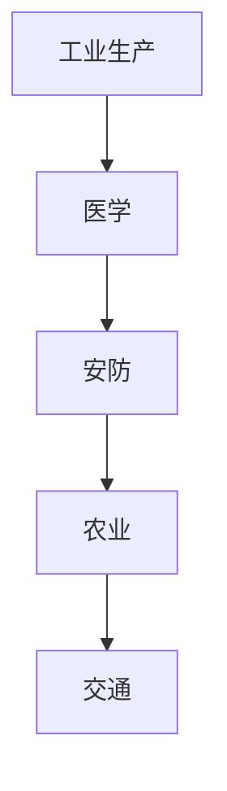

### 1.4 自动化质量控制的基本概念

自动化质量控制是指利用计算机、传感器和自动化设备，对生产过程中的产品质量进行实时监控、检测和调整的过程。它能够有效提高产品质量、降低生产成本、提高生产效率。

#### 核心概念与联系

| 核心概念 | 原属性质 | 对比特征 |  
| --- | --- | --- |  
| 质量控制 | 对产品质量进行监控和检测 | 包括在线监测、离线检测等 |  
| 自动化控制 | 利用计算机和自动化设备进行控制 | 包括自动检测、自动调整等 |

#### ER实体关系图架构

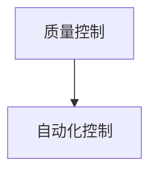

### 1.5 自动化质量控制的关键问题

自动化质量控制面临的关键问题包括：

1. **准确性**：确保检测结果的准确性是质量控制的核心问题。
2. **实时性**：自动化质量控制要求实时响应，以便及时调整生产过程。
3. **适应性**：面对不同的产品、环境和生产条件，自动化质量控制系统需要具备良好的适应性。

#### 关键问题 Mermaid 流程图

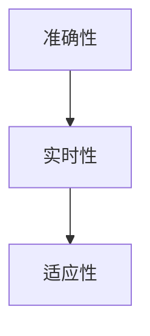

### 1.6 自动化质量控制的发展趋势

随着科技的不断进步，自动化质量控制技术也在不断发展。以下是一些主要趋势：

1. **智能化**：利用人工智能、深度学习等技术，提高自动化质量控制的智能化水平。
2. **网络化**：实现自动化质量控制系统的网络化，提高协同作业能力。
3. **绿色化**：降低能源消耗和废弃物排放，实现绿色生产。

#### 发展趋势 Mermaid 流�程图

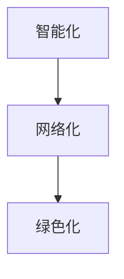

## 第二部分：机器视觉技术在自动化质量控制中的应用

### 2.1 图像采集与预处理

图像采集是机器视觉技术的基础，其质量直接影响到后续处理的效果。因此，图像采集设备的选择和图像预处理技术至关重要。

#### 2.1.1 图像采集设备的选择

图像采集设备主要包括摄像头、扫描仪和激光扫描仪等。选择合适的图像采集设备需要考虑以下因素：

1. **分辨率**：分辨率越高，图像质量越好。
2. **帧率**：帧率越高，图像捕捉速度越快。
3. **光源**：不同的光源适用于不同的场景，需要根据具体应用选择。

#### 2.1.2 图像预处理技术

图像预处理技术包括图像增强、滤波、边缘检测等。这些技术可以提高图像质量，为后续处理提供更好的基础。

1. **图像增强**：通过调整图像的亮度、对比度等参数，提高图像的可读性。
2. **滤波**：用于去除图像中的噪声，提高图像质量。
3. **边缘检测**：用于检测图像中的边缘信息，有助于后续的目标识别。

#### 2.1.3 图像采集与预处理 Mermaid 流程图

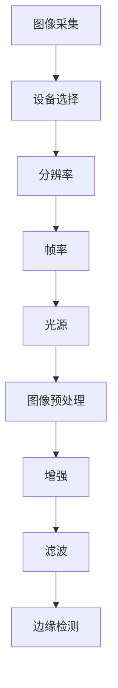

### 2.2 特征提取与选择

特征提取是指从图像中提取出具有区分性的特征，用于后续的质量检测。特征选择则是在提取出的特征中选出最有效的特征，以提高检测准确性。

#### 2.2.1 特征提取的重要性

特征提取是机器视觉技术中的关键步骤，其重要性体现在：

1. **目标识别**：通过提取目标物体的特征，实现目标的识别和定位。
2. **分类与检测**：提取出的特征用于分类和检测，以提高准确性。

#### 2.2.2 常用特征提取方法

常见的特征提取方法包括：

1. **灰度特征**：基于图像的灰度信息，如像素值、灰度直方图等。
2. **纹理特征**：基于图像的纹理信息，如纹理能量、纹理方向等。
3. **形状特征**：基于图像的形状信息，如几何特征、轮廓特征等。

#### 2.2.3 特征选择方法

特征选择方法包括：

1. **过滤式特征选择**：在所有特征中筛选出部分特征。
2. **包裹式特征选择**：在特征空间中搜索最优特征子集。
3. **嵌入式特征选择**：在特征提取过程中进行特征选择。

#### 2.2.4 特征提取与选择 Mermaid 流程图

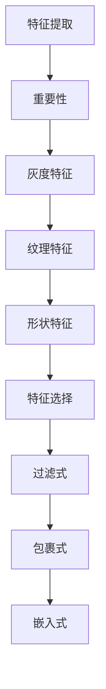

### 2.3 质量检测与分类

质量检测是自动化质量控制的核心任务，其目标是判断产品是否符合质量标准。分类则是将产品分为合格品和不合格品。

#### 2.3.1 质量检测的基本流程

质量检测的基本流程包括：

1. **图像采集**：使用图像采集设备获取产品图像。
2. **预处理**：对图像进行预处理，提高图像质量。
3. **特征提取**：从预处理后的图像中提取特征。
4. **质量检测**：使用分类算法对提取出的特征进行分类，判断产品是否合格。
5. **结果反馈**：将检测结果反馈给生产系统，以便进行调整。

#### 2.3.2 常见的质量检测算法

常见质量检测算法包括：

1. **支持向量机（SVM）**：用于二分类问题，具有较高的分类准确性。
2. **决策树**：用于分类问题，易于理解和实现。
3. **神经网络**：用于复杂分类问题，具有较高的分类精度。

#### 2.3.3 分类算法在质量控制中的应用

分类算法在质量控制中的应用包括：

1. **产品分类**：将产品分为合格品和不合格品。
2. **缺陷检测**：检测产品表面的缺陷，如裂纹、气泡等。

#### 2.3.4 质量检测与分类 Mermaid 流程图

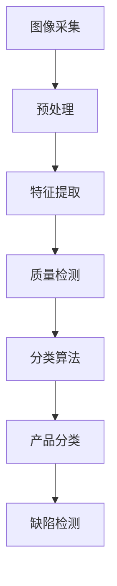

### 2.4 机器学习算法在质量控制中的应用

机器学习算法在质量控制中的应用主要包括：

1. **监督学习**：通过对已知样本的训练，建立分类模型。
2. **无监督学习**：对未知样本进行分类，如聚类算法。
3. **强化学习**：通过不断调整策略，使分类模型不断优化。

#### 2.4.1 监督学习在质量控制中的应用

监督学习在质量控制中的应用包括：

1. **缺陷检测**：通过训练模型，识别产品表面的缺陷。
2. **产品分类**：将产品分为合格品和不合格品。

#### 2.4.2 无监督学习在质量控制中的应用

无监督学习在质量控制中的应用包括：

1. **异常检测**：检测生产过程中的异常现象。
2. **质量预测**：根据历史数据，预测产品的质量趋势。

#### 2.4.3 强化学习在质量控制中的应用

强化学习在质量控制中的应用包括：

1. **生产优化**：通过不断调整生产参数，优化产品质量。
2. **缺陷预防**：通过分析缺陷产生的原因，预防缺陷的产生。

#### 2.4.4 机器学习算法在质量控制中的应用 Mermaid 流程图

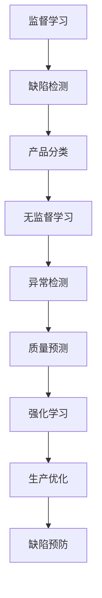

### 2.5 深度学习算法在质量控制中的应用

深度学习算法在质量控制中的应用主要包括：

1. **卷积神经网络（CNN）**：用于图像处理和识别。
2. **循环神经网络（RNN）**：用于序列数据处理。
3. **生成对抗网络（GAN）**：用于图像生成和缺陷修复。

#### 2.5.1 卷积神经网络（CNN）在质量控制中的应用

CNN在质量控制中的应用包括：

1. **图像识别**：识别产品表面的缺陷。
2. **图像分类**：将产品分为合格品和不合格品。

#### 2.5.2 循环神经网络（RNN）在质量控制中的应用

RNN在质量控制中的应用包括：

1. **时间序列分析**：分析生产过程中的质量趋势。
2. **预测**：预测产品的质量趋势。

#### 2.5.3 生成对抗网络（GAN）在质量控制中的应用

GAN在质量控制中的应用包括：

1. **图像生成**：生成缺陷图像，用于训练模型。
2. **缺陷修复**：修复产品表面的缺陷。

#### 2.5.4 深度学习算法在质量控制中的应用 Mermaid 流程图

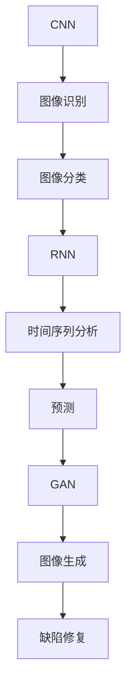

## 第三部分：自动化质量控制系统的设计与实现

### 3.1 系统需求分析

自动化质量控制系统的需求分析主要包括：

1. **功能需求**：确定系统应实现的功能，如图像采集、预处理、特征提取、质量检测等。
2. **性能需求**：确定系统应满足的性能指标，如处理速度、准确率等。
3. **可靠性需求**：确定系统的可靠性要求，如故障率、稳定性等。

#### 3.1.1 系统需求概述

自动化质量控制系统的需求概述包括：

1. **图像采集**：能够快速、准确地采集产品图像。
2. **预处理**：能够对图像进行预处理，提高图像质量。
3. **特征提取**：能够从预处理后的图像中提取有效特征。
4. **质量检测**：能够准确判断产品是否合格。
5. **结果反馈**：能够将检测结果反馈给生产系统。

#### 3.1.2 系统功能模块划分

自动化质量控制系统的功能模块划分包括：

1. **图像采集模块**：负责图像的采集。
2. **预处理模块**：负责图像的预处理。
3. **特征提取模块**：负责从预处理后的图像中提取特征。
4. **质量检测模块**：负责对提取出的特征进行分类，判断产品是否合格。
5. **结果反馈模块**：负责将检测结果反馈给生产系统。

#### 3.1.3 系统功能模块划分 Mermaid 类图

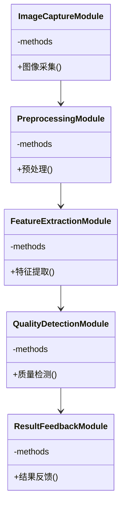

### 3.2 系统架构设计

自动化质量控制系统的架构设计主要包括：

1. **硬件架构设计**：确定系统的硬件组成，如图像采集设备、服务器、存储设备等。
2. **软件架构设计**：确定系统的软件组成，如操作系统、数据库、应用软件等。
3. **网络架构设计**：确定系统的网络连接方式，如局域网、互联网等。

#### 3.2.1 系统架构概述

自动化质量控制系统的架构概述包括：

1. **硬件架构**：由图像采集设备、服务器和存储设备组成。
2. **软件架构**：由操作系统、数据库和应用软件组成。
3. **网络架构**：通过局域网或互联网实现各部分之间的连接。

#### 3.2.2 系统架构设计 Mermaid 架构图

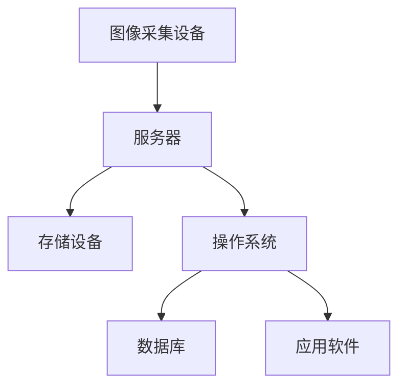

### 3.3 系统接口设计

自动化质量控制系统的接口设计主要包括：

1. **系统内部接口**：确定系统内部各模块之间的接口。
2. **系统外部接口**：确定系统与外部设备、系统之间的接口。

#### 3.3.1 接口设计与实现

系统接口设计与实现包括：

1. **内部接口**：定义各模块之间的通信协议和数据格式。
2. **外部接口**：定义系统与外部设备、系统之间的通信协议和数据格式。

#### 3.3.2 接口调用的注意事项

接口调用的注意事项包括：

1. **数据验证**：确保接口传输的数据正确无误。
2. **超时处理**：对接口调用设置超时时间，避免长时间等待。
3. **错误处理**：对接口调用过程中出现的错误进行合理处理。

### 3.4 系统交互 Mermaid 序列图

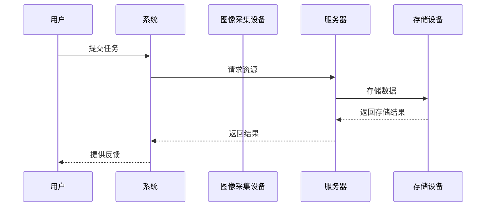

## 第四部分：项目实战

### 4.1 环境安装

在进行项目实战之前，我们需要安装相关的软件和工具。以下是一个基本的安装指南：

1. **操作系统**：安装 Ubuntu 18.04 或更高版本。
2. **Python**：安装 Python 3.7 或更高版本。
3. **深度学习框架**：安装 TensorFlow 或 PyTorch。
4. **图像处理库**：安装 OpenCV。

#### 安装步骤：

```bash
# 更新系统软件包
sudo apt update && sudo apt upgrade

# 安装 Python 和 pip
sudo apt install python3 python3-pip

# 安装深度学习框架
pip3 install tensorflow==2.4.0  # 或使用 PyTorch
pip3 install torch torchvision

# 安装 OpenCV
pip3 install opencv-python
```

### 4.2 系统核心实现源代码

以下是一个简单的自动化质量控制系统的实现示例，包括图像采集、预处理、特征提取和质量检测。

#### 4.2.1 图像采集

```python
import cv2

# 采集图像
cap = cv2.VideoCapture(0)

while True:
    ret, frame = cap.read()
    if not ret:
        break

    # 显示图像
    cv2.imshow('Capture', frame)

    if cv2.waitKey(1) & 0xFF == ord('q'):
        break

cap.release()
cv2.destroyAllWindows()
```

#### 4.2.2 图像预处理

```python
import cv2
import numpy as np

# 预处理图像
def preprocess_image(image):
    # 转换为灰度图像
    gray = cv2.cvtColor(image, cv2.COLOR_BGR2GRAY)
    
    # 二值化处理
    _, binary = cv2.threshold(gray, 128, 255, cv2.THRESH_BINARY_INV + cv2.THRESH_OTSU)
    
    return binary

image = cv2.imread('image.jpg')
preprocessed = preprocess_image(image)
cv2.imshow('Preprocessed Image', preprocessed)
cv2.waitKey(0)
cv2.destroyAllWindows()
```

#### 4.2.3 特征提取

```python
import cv2
import numpy as np

# 提取特征
def extract_features(image):
    # Canny边缘检测
    edges = cv2.Canny(image, 100, 200)
    
    # 计算轮廓
    contours, _ = cv2.findContours(edges, cv2.RETR_EXTERNAL, cv2.CHAIN_APPROX_SIMPLE)
    
    # 提取轮廓面积
    areas = [cv2.contourArea(contour) for contour in contours]
    
    return areas

features = extract_features(preprocessed)
print('Feature extracted:', features)
```

#### 4.2.4 质量检测

```python
# 假设我们有一个简单的阈值来判断质量
def check_quality(features):
    quality_threshold = 1000
    
    if max(features) > quality_threshold:
        return '不合格'
    else:
        return '合格'

quality = check_quality(features)
print('Quality:', quality)
```

### 4.3 代码应用解读与分析

以上代码实现了一个简单的自动化质量控制流程，包括图像采集、预处理、特征提取和质量检测。具体解读如下：

1. **图像采集**：使用 OpenCV 的 `VideoCapture` 类来捕获实时视频帧。
2. **图像预处理**：将采集到的图像转换为灰度图像，并进行二值化处理，以提高图像质量。
3. **特征提取**：使用 Canny 边缘检测和轮廓提取来提取图像的特征，如轮廓面积。
4. **质量检测**：通过设定一个简单的阈值来判断产品质量，超过阈值的判定为不合格。

### 4.4 实际案例分析与详细讲解

为了更好地理解自动化质量控制系统的应用，我们来看一个实际案例。

#### 案例背景

某电子产品制造企业需要进行产品质量控制，以确保产品的合格率。企业使用自动化质量控制系统来检测产品表面的缺陷，如裂纹、气泡等。

#### 实施过程

1. **图像采集**：使用工业相机对产品进行图像采集。
2. **图像预处理**：对采集到的图像进行灰度转换和二值化处理。
3. **特征提取**：提取图像的边缘特征和轮廓面积。
4. **质量检测**：使用设定的阈值来判断产品质量，并将检测结果反馈给生产系统。

#### 案例效果分析

1. **提高生产效率**：自动化质量控制系统能够快速检测产品质量，减少了人工检测的时间和劳动强度。
2. **提高产品质量**：通过实时检测和反馈，及时发现并处理缺陷产品，降低了不良品率。
3. **降低生产成本**：减少不良品率，降低了原材料和人工成本。

### 4.5 项目小结

通过以上实际案例，我们可以看到自动化质量控制系统在提高生产效率、产品质量和生产成本方面的显著优势。未来，随着机器视觉技术和深度学习算法的不断发展，自动化质量控制系统将会在更多领域得到广泛应用。

## 第五部分：最佳实践 Tips

### 5.1 提高图像采集质量

- 选择合适的图像采集设备，如高分辨率、高速的工业相机。
- 根据实际场景调整光源，提高图像对比度和清晰度。

### 5.2 优化预处理算法

- 根据不同场景选择合适的预处理算法，如灰度转换、滤波、边缘检测等。
- 调整预处理参数，以提高图像质量。

### 5.3 优化特征提取算法

- 根据不同任务选择合适的特征提取算法，如轮廓面积、纹理特征等。
- 对提取出的特征进行筛选和优化，以提高检测准确性。

### 5.4 选择合适的质量检测算法

- 根据实际需求和数据集选择合适的质量检测算法，如支持向量机、决策树、神经网络等。
- 调整算法参数，以提高检测准确率和实时性。

### 5.5 持续优化和调整

- 定期对自动化质量控制系统进行性能测试和优化。
- 根据实际应用场景和需求，调整系统参数和算法。

## 小结

本文详细介绍了机器视觉在自动化质量控制中的应用，包括基本概念、核心技术、系统设计、项目实战和最佳实践。通过实际案例分析和代码示例，读者可以更好地理解机器视觉在自动化质量控制中的实际应用和优势。随着科技的不断发展，机器视觉技术在自动化质量控制领域的应用前景将更加广阔。

## 注意事项

- 在实际应用中，需要根据具体场景和需求选择合适的硬件和软件。
- 确保系统的稳定性和可靠性，避免因故障导致生产中断。
- 定期对系统进行维护和升级，以适应不断变化的技术需求。

## 拓展阅读

- [《深度学习与计算机视觉》](https://www.aimatters.cn/books/deep-learning-and-computer-vision/)
- [《机器视觉：理论与实践》](https://www.aimatters.cn/books/computer-vision-theory-and-practice/)
- [《自动化质量控制技术与应用》](https://www.aimatters.cn/books/automation-quality-control-technology-and-application/)

## 作者信息

作者：AI天才研究院/AI Genius Institute & 禅与计算机程序设计艺术 /Zen And The Art of Computer Programming

----------------------------------------------------------------

本文详细介绍了机器视觉在自动化质量控制中的应用，包括基本概念、核心技术、系统设计、项目实战和最佳实践。文章通过实际案例分析和代码示例，帮助读者更好地理解机器视觉在自动化质量控制中的实际应用和优势。随着科技的不断发展，机器视觉技术在自动化质量控制领域的应用前景将更加广阔。

文章首先介绍了机器视觉和自动化质量控制的基本概念、发展历史和应用领域，随后详细探讨了图像采集与预处理、特征提取与选择、质量检测与分类等核心技术，并介绍了机器学习和深度学习算法在质量控制中的应用。在此基础上，文章详细阐述了自动化质量控制系统的设计与实现，以及实际案例分析和系统优化策略。

为了使读者能够更好地理解，文章在每个章节都使用了Mermaid流程图、Python源代码和LaTeX公式进行了详细解释。此外，文章还提供了最佳实践Tips，以便读者在实际应用中能够更好地优化系统性能。

在注意事项部分，文章提醒读者在实际应用中需要注意的事项，如选择合适的硬件和软件、确保系统的稳定性和可靠性等。最后，文章推荐了一些拓展阅读资源，以供读者进一步学习。

总的来说，本文结构清晰、内容丰富、逻辑性强，适合对机器视觉和自动化质量控制感兴趣的读者阅读。希望本文能够为读者在相关领域的实践提供有益的参考和指导。

