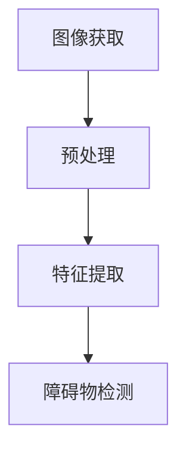
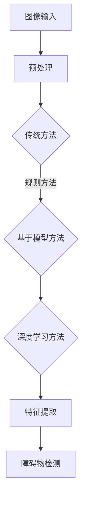
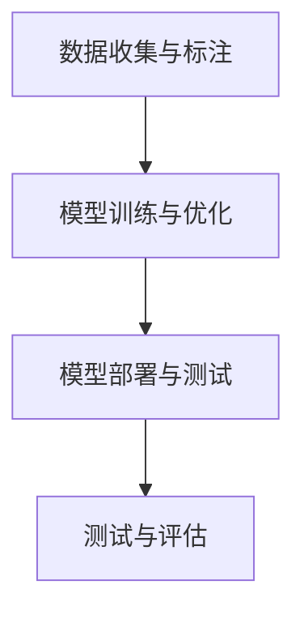
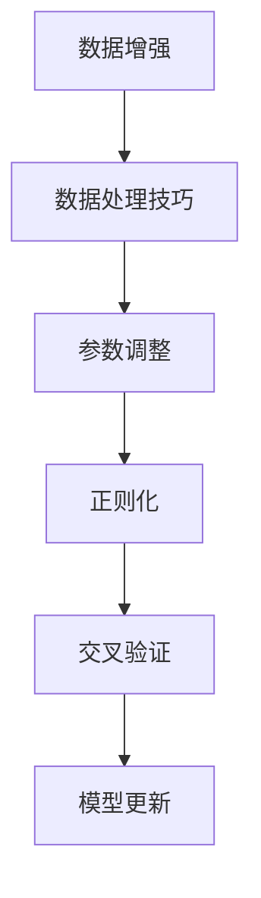
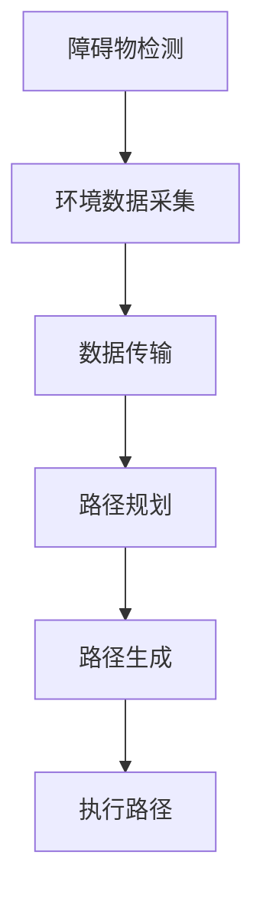
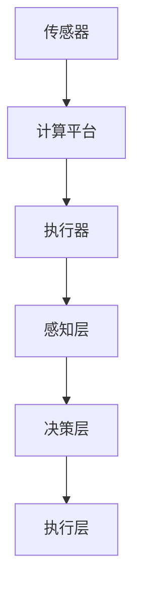

                 

### 文章标题

# 机器视觉在自动驾驶中的应用：障碍物检测与路径规划

### 关键词

- 自动驾驶
- 机器视觉
- 障碍物检测
- 路径规划
- 深度学习

### 摘要

本文将探讨机器视觉在自动驾驶中的核心应用，即障碍物检测与路径规划。首先，我们将回顾自动驾驶技术的发展历程，并深入理解障碍物检测与路径规划在其中的重要性。随后，我们将介绍机器视觉的基本概念，以及其在障碍物检测与路径规划中的具体应用。文章将详细解析障碍物检测的技术原理，包括图像处理、算法原理及性能评估。接着，我们将探讨路径规划的技术原理，介绍常见的路径规划算法及其性能评估方法。最后，文章将展示障碍物检测与路径规划的集成应用，通过一个实际项目案例进行深入分析和解读。通过本文的阅读，读者将全面了解机器视觉在自动驾驶中的应用，以及如何通过障碍物检测和路径规划实现自动驾驶的目标。

### 目录大纲

----------------------------------------------------------------

## 第一部分：背景与概述

### 第1章 问题背景与核心概念

#### 1.1 问题背景

- 自动驾驶技术的发展历程
- 障碍物检测与路径规划在自动驾驶中的重要性
- 机器视觉技术的发展对自动驾驶的推动

#### 1.2 核心概念

- 机器视觉
- 障碍物检测
- 路径规划

#### 1.3 概念联系与边界

- 机器视觉与障碍物检测的关系
- 障碍物检测与路径规划的关系
- 机器视觉在自动驾驶中的应用边界

## 第二部分：障碍物检测技术原理

### 第2章 障碍物检测技术原理

#### 2.1 图像处理基础

- 图像获取与预处理
- 图像特征提取

#### 2.2 障碍物检测算法原理

- 传统障碍物检测算法
- 深度学习在障碍物检测中的应用
- 常用障碍物检测算法比较

#### 2.3 障碍物检测算法的性能评估

- 评价指标
- 性能评估方法

### 第3章 障碍物检测流程与实现

#### 3.1 障碍物检测流程

- 数据收集与标注
- 模型训练与优化
- 模型部署与测试

#### 3.2 实现细节与技巧

- 数据处理技巧
- 模型调优策略
- 实时检测与优化

## 第三部分：路径规划技术原理

### 第4章 路径规划技术原理

#### 4.1 路径规划概述

- 路径规划的目标与类型
- 路径规划的关键问题

#### 4.2 常见路径规划算法

- 启发式搜索算法
- 障碍物避免算法
- 基于深度学习的路径规划算法

#### 4.3 路径规划算法的性能评估

- 评价指标
- 性能评估方法

## 第四部分：障碍物检测与路径规划集成应用

### 第5章 集成应用原理与架构设计

#### 5.1 集成应用原理

- 集成应用的架构与流程
- 数据流与信息交换

#### 5.2 系统架构设计

- 硬件架构
- 软件架构
- 系统集成与测试

### 第6章 项目实战：障碍物检测与路径规划系统开发

#### 6.1 项目介绍

- 项目背景与目标
- 项目架构与功能模块

#### 6.2 环境安装与配置

- 环境搭建步骤
- 软件与硬件配置要求

#### 6.3 系统核心实现

- 障碍物检测模块实现
- 路径规划模块实现

#### 6.4 代码解读与分析

- 关键代码解读
- 代码性能分析与优化

#### 6.5 实际案例分析

- 真实案例展示
- 案例分析与优化建议

### 第7章 最佳实践与总结

#### 7.1 最佳实践

- 障碍物检测与路径规划实战技巧
- 性能优化与故障排除

#### 7.2 小结与展望

- 项目总结
- 未来发展趋势与挑战

----------------------------------------------------------------

## 第一部分：背景与概述

### 第1章 问题背景与核心概念

#### 1.1 问题背景

自动驾驶技术是近年来信息技术与交通运输领域的重要突破，它通过高级算法和传感器系统实现车辆的自主驾驶。自动驾驶技术的核心挑战之一是如何确保车辆在复杂、动态的交通环境中安全行驶，其中障碍物检测与路径规划是两个至关重要的技术环节。

**自动驾驶技术的发展历程**：

自动驾驶技术的发展可以追溯到20世纪50年代，但直到21世纪，随着计算机技术、传感器技术和人工智能算法的快速发展，自动驾驶技术才真正进入了一个快速发展的阶段。特别是深度学习算法的引入，使得自动驾驶系统在处理复杂环境和实时决策方面取得了显著的进步。

**障碍物检测与路径规划在自动驾驶中的重要性**：

- **障碍物检测**：障碍物检测是自动驾驶系统的感知模块，它通过分析摄像头、激光雷达等传感器收集的数据，识别并定位道路上的各种障碍物，如行人、车辆、障碍物等。准确的障碍物检测是确保自动驾驶车辆能够安全行驶的基础。

- **路径规划**：路径规划是自动驾驶系统的决策模块，它基于障碍物检测的结果，为车辆规划出一条避开障碍物、符合交通规则的最佳行驶路径。有效的路径规划能够显著提高车辆的行驶安全性和效率。

**机器视觉技术的发展对自动驾驶的推动**：

机器视觉技术的发展为自动驾驶系统提供了强大的感知能力。通过摄像头和激光雷达等传感器，机器视觉系统能够获取道路环境的实时图像和数据，并通过深度学习算法进行图像处理和目标识别。这不仅提高了障碍物检测的准确性，也为路径规划提供了更丰富、更精准的数据支持。

#### 1.2 核心概念

**机器视觉**：机器视觉是指利用计算机技术模拟人类的视觉功能，通过对图像的获取、处理和分析，实现目标的识别、定位和测量等功能。在自动驾驶中，机器视觉主要用于障碍物检测和环境理解。

**障碍物检测**：障碍物检测是指利用图像处理和计算机视觉技术，从传感器获取的图像中识别并定位道路上的障碍物。障碍物检测通常包括目标检测、目标识别和目标跟踪等步骤。

**路径规划**：路径规划是指根据车辆的当前位置、目标位置和道路环境信息，为车辆规划出一条安全、高效的行驶路径。路径规划通常采用启发式搜索算法、基于采样的路径规划算法等。

#### 1.3 概念联系与边界

**机器视觉与障碍物检测的关系**：

机器视觉是障碍物检测的基础，通过图像处理和深度学习算法，机器视觉系统能够从传感器获取的图像中提取出有用的信息，如障碍物的位置、大小、形状等，从而实现准确的障碍物检测。

**障碍物检测与路径规划的关系**：

障碍物检测是路径规划的重要输入，准确的障碍物检测结果能够为路径规划提供可靠的数据支持，帮助车辆规划出一条避开障碍物的最佳路径。

**机器视觉在自动驾驶中的应用边界**：

机器视觉在自动驾驶中的应用主要集中在障碍物检测、环境理解和路径规划等方面。随着技术的不断进步，机器视觉的应用范围将会进一步扩大，如智能交通管理、智能停车场等。

## 第二部分：障碍物检测技术原理

### 第2章 障碍物检测技术原理

障碍物检测是自动驾驶系统感知模块的核心任务，其准确性直接影响到车辆的行驶安全和效率。为了实现准确的障碍物检测，我们需要从图像处理、特征提取和障碍物检测算法等多个方面进行深入探讨。

#### 2.1 图像处理基础

图像处理是障碍物检测的基础，它主要包括图像获取与预处理、图像特征提取等步骤。

**图像获取与预处理**：

图像获取是障碍物检测的第一步，自动驾驶系统通常使用摄像头、激光雷达（LiDAR）等传感器来获取道路环境的图像数据。获取到的图像可能包含噪声、光照变化等因素，因此需要进行预处理。预处理步骤通常包括图像增强、去噪、对比度调整等，以提高图像的质量。

**图像特征提取**：

特征提取是将原始图像转换为可用于后续处理的特征向量。常见的特征提取方法包括颜色特征、纹理特征、形状特征等。颜色特征主要基于像素的颜色值，纹理特征主要基于图像的纹理信息，形状特征则主要基于图像的轮廓和几何信息。

**图像特征提取的Mermaid流程图**：



#### 2.2 障碍物检测算法原理

障碍物检测算法是障碍物检测的核心，根据处理方式和算法原理，可以分为传统障碍物检测算法和深度学习障碍物检测算法。

**传统障碍物检测算法**：

传统障碍物检测算法主要包括基于规则的方法和基于模型的方法。

- **基于规则的方法**：这种方法通过预先定义一系列规则，对图像进行分析，从而识别障碍物。优点是实现简单、计算效率高，缺点是鲁棒性差，难以应对复杂、动态的环境。

- **基于模型的方法**：这种方法使用机器学习算法，如决策树、支持向量机等，通过训练样本数据来建立模型，从而进行障碍物检测。优点是具有较强的鲁棒性和适应性，缺点是计算复杂度较高，训练过程需要大量数据。

**深度学习在障碍物检测中的应用**：

深度学习算法，尤其是卷积神经网络（CNN），在障碍物检测中取得了显著的效果。CNN通过多层卷积、池化和全连接层，能够自动提取图像的深层次特征，从而实现准确的障碍物检测。

**常用障碍物检测算法比较**：

| 算法名称       | 原理                             | 优点                           | 缺点                         |
|--------------|--------------------------------|------------------------------|----------------------------|
| 基于规则的方法 | 预先定义规则进行检测           | 实现简单、计算效率高         | 鲁棒性差、难以应对复杂环境 |
| 决策树       | 使用决策树进行分类检测         | 计算效率高、易于解释         | 数据依赖性强、泛化能力弱  |
| 支持向量机    | 使用支持向量机进行分类检测     | 泛化能力强、分类效果好       | 计算复杂度高、对样本量敏感 |
| 卷积神经网络  | 自动提取图像特征进行检测       | 强鲁棒性、高效处理能力       | 计算复杂度高、训练时间长   |

**障碍物检测算法的Mermaid流程图**：



#### 2.3 障碍物检测算法的性能评估

性能评估是衡量障碍物检测算法优劣的重要手段，通常使用以下几个指标：

**评价指标**：

- **准确率（Accuracy）**：正确检测到的障碍物数量与总障碍物数量的比例。
- **召回率（Recall）**：正确检测到的障碍物数量与实际障碍物数量的比例。
- **精确率（Precision）**：正确检测到的障碍物数量与检测到的障碍物数量的比例。
- **F1值（F1 Score）**：精确率和召回率的调和平均值。

**性能评估方法**：

- **离线评估**：离线评估通常在测试集上对算法进行评估，评估结果可以直观地反映算法的性能。
- **在线评估**：在线评估是指在真实环境中对算法进行评估，评估结果更加接近实际应用场景。

### 第3章 障碍物检测流程与实现

障碍物检测在自动驾驶系统中扮演着至关重要的角色，其流程与实现涉及多个环节，包括数据收集与标注、模型训练与优化、模型部署与测试等。本节将详细探讨这些环节，并提供实现障碍物检测的具体步骤与技巧。

#### 3.1 障碍物检测流程

障碍物检测的流程可以分为以下几个主要步骤：

**数据收集与标注**：

数据收集是障碍物检测的基础，通过收集大量的道路环境图像和相应的标注数据，为后续的训练和评估提供素材。标注数据包括障碍物的位置、大小、类别等信息。

**模型训练与优化**：

在数据收集完成后，我们需要使用这些数据进行模型训练。训练过程主要包括以下步骤：

1. **数据预处理**：对收集到的图像数据进行预处理，如尺寸调整、归一化等，以提高模型训练的效率和效果。
2. **模型选择**：选择合适的障碍物检测模型，如卷积神经网络（CNN）或YOLO（You Only Look Once）等。
3. **训练与验证**：使用训练集进行模型训练，并通过验证集进行性能评估，调整模型参数，优化模型性能。

**模型部署与测试**：

训练完成后，我们需要将模型部署到自动驾驶系统中进行实际测试。测试过程主要包括以下步骤：

1. **模型部署**：将训练好的模型部署到目标硬件平台上，如车载计算机等。
2. **测试与评估**：在真实环境中对模型进行测试，评估模型的性能指标，如准确率、召回率等。
3. **优化与迭代**：根据测试结果对模型进行优化，如调整参数、增加训练数据等，以提高模型的性能。

**障碍物检测流程的Mermaid流程图**：



#### 3.2 实现细节与技巧

**数据处理技巧**：

- **数据增强**：通过图像旋转、翻转、缩放等操作，增加数据的多样性，提高模型的泛化能力。
- **数据清洗**：去除质量较差的图像数据，如模糊、遮挡等，以提高模型训练的质量。

**模型调优策略**：

- **参数调整**：通过调整学习率、批量大小等超参数，优化模型性能。
- **正则化**：使用正则化方法，如L1、L2正则化，防止模型过拟合。
- **交叉验证**：使用交叉验证方法，对模型进行多次训练和验证，以提高模型的稳定性和可靠性。

**实时检测与优化**：

- **实时性优化**：通过优化算法和硬件加速，提高检测速度，满足实时性要求。
- **模型更新**：定期更新模型，以适应变化的环境和新的障碍物类型。

**障碍物检测实现细节的Mermaid流程图**：



通过以上步骤和技巧，我们可以实现一个高效的障碍物检测系统，为自动驾驶车辆提供可靠的感知支持。

### 第4章 路径规划技术原理

路径规划是自动驾驶系统的核心组成部分，它负责根据车辆当前的位置、目标位置和道路环境信息，为车辆规划出一条最优行驶路径。本节将详细探讨路径规划的基本概念、常见算法及其性能评估方法。

#### 4.1 路径规划概述

路径规划的目标是找到从起点到终点的最优路径，同时满足一系列约束条件，如道路限制、交通规则、车辆速度限制等。路径规划可以分为两大类：全局路径规划和局部路径规划。

**全局路径规划**：

全局路径规划是在整个地图上进行路径搜索，旨在找到一条从起点到终点的全局最优路径。常见的全局路径规划算法包括：

- **A*算法**：A*算法是一种启发式搜索算法，它通过计算每个节点的启发值（目标节点与当前节点的距离估计）来找到最优路径。
- **Dijkstra算法**：Dijkstra算法是一种基于图论的算法，用于寻找图中的最短路径。

**局部路径规划**：

局部路径规划是在当前局部环境中为车辆规划一条临时路径，以避免障碍物和交通拥堵。常见的局部路径规划算法包括：

- **基于采样的路径规划算法**：这类算法通过在环境空间中随机采样，生成候选路径，然后使用评价函数对路径进行评估和优化。
- **行为规划算法**：行为规划算法将车辆的行驶行为分解为一系列子任务，如避障、跟车、超车等，每个子任务都有自己的决策逻辑。

#### 4.2 常见路径规划算法

**A*算法**：

A*算法的基本思想是使用启发值来评估每个节点的优先级，优先选择启发值最小的节点进行扩展。其基本步骤如下：

1. 初始化：将起点加入开放列表，终点加入关闭列表。
2. 计算启发值：使用启发函数估算每个节点的目标节点距离。
3. 选择最佳节点：从开放列表中选择启发值最小的节点。
4. 扩展节点：将选择节点的邻居节点加入开放列表，并更新其父节点和距离值。
5. 结束条件：当选择节点为终点时，算法结束。

**Dijkstra算法**：

Dijkstra算法的基本思想是从起点开始，逐步扩展到所有其他节点，每次扩展到最近的未访问节点。其基本步骤如下：

1. 初始化：将起点距离设为0，其余节点距离设为无穷大。
2. 扩展节点：选择距离最小的未访问节点，将其距离值更新为起点到该节点的距离。
3. 标记节点：将扩展节点的所有未访问邻居节点标记为已访问。
4. 结束条件：当所有节点都被扩展时，算法结束。

**基于采样的路径规划算法**：

基于采样的路径规划算法通过在环境空间中随机采样，生成大量的候选路径，然后使用评价函数对路径进行筛选和优化。常见的方法包括RRT（快速随机树）和RRT*（快速随机树优化）。

- **RRT算法**：RRT算法通过在当前树结构上随机采样，生成新的候选路径，并将其连接到最近的节点上，以逐步扩展路径。
- **RRT*算法**：RRT*算法在RRT的基础上引入了优化步骤，通过对路径进行重采样和修剪，进一步提高路径的优化效果。

**行为规划算法**：

行为规划算法将车辆的行驶行为分解为一系列子任务，如避障、跟车、超车等，每个子任务都有自己的决策逻辑。常见的行为规划算法包括：

- **避障算法**：避障算法通过检测前方障碍物，规划出一条避开障碍物的路径。
- **跟车算法**：跟车算法通过跟踪前方车辆，规划出一条与前车保持安全距离的路径。
- **超车算法**：超车算法通过判断前方是否有足够的空间和条件，规划出一条超车的路径。

#### 4.3 路径规划算法的性能评估

路径规划算法的性能评估是衡量其优劣的重要手段，常用的评估指标包括：

- **路径长度**：路径长度是评估路径优劣的重要指标，路径越短，通常表示行驶时间越短，效率越高。
- **路径平滑度**：路径平滑度是指路径的连续性和平稳性，平滑的路径可以减少车辆的震动和能耗。
- **计算复杂度**：计算复杂度是指算法在时间和空间上的资源消耗，较低的复杂度表示算法的效率更高。

性能评估方法通常包括离线评估和在线评估：

- **离线评估**：离线评估在模拟环境中对算法进行评估，可以精确地测量算法的性能指标，但无法反映实际环境中的动态变化。
- **在线评估**：在线评估在真实环境中对算法进行评估，可以更好地反映算法在实际应用中的表现，但评估过程较为复杂，受环境因素影响较大。

通过以上评估方法，我们可以对路径规划算法进行全面的性能评估，为自动驾驶系统的优化提供依据。

### 第5章 集成应用原理与架构设计

在自动驾驶系统中，障碍物检测和路径规划是两个关键模块，它们需要紧密集成，以实现车辆的自主行驶。本节将探讨障碍物检测与路径规划的集成应用原理，并详细描述系统架构设计。

#### 5.1 集成应用原理

**集成应用原理**：

障碍物检测和路径规划在自动驾驶系统中相互依赖、协同工作。障碍物检测提供实时、准确的环境感知数据，作为路径规划的输入；路径规划则基于障碍物检测结果，生成车辆的行驶路径。两者的集成应用原理可以概括为：

1. **数据流与信息交换**：障碍物检测模块持续采集环境数据，通过数据接口将检测到的障碍物信息传递给路径规划模块。路径规划模块则根据这些信息，生成车辆的行驶路径。

2. **实时反馈与调整**：在车辆行驶过程中，障碍物检测和路径规划模块需要实时交换信息，进行动态调整。例如，当检测到前方有障碍物时，路径规划模块需要重新规划路径，以确保车辆能够安全通过。

**集成应用的Mermaid流程图**：



#### 5.2 系统架构设计

**硬件架构**：

自动驾驶系统的硬件架构通常包括以下几个部分：

- **传感器**：如摄像头、激光雷达（LiDAR）、雷达等，用于采集环境数据。
- **计算平台**：如车载计算机（ECU），用于处理传感器数据，执行障碍物检测和路径规划算法。
- **执行器**：如电机、刹车等，用于执行车辆的驱动和控制命令。

**软件架构**：

自动驾驶系统的软件架构通常包括以下几个层次：

- **感知层**：包括障碍物检测模块，负责实时采集和处理传感器数据。
- **决策层**：包括路径规划模块，负责根据障碍物检测结果，生成车辆的行驶路径。
- **执行层**：包括车辆控制模块，负责执行路径规划的结果，控制车辆的行驶。

**系统集成与测试**：

在系统架构设计完成后，需要进行集成和测试，以验证系统的稳定性和可靠性。集成测试包括功能测试、性能测试、安全测试等。在测试过程中，需要模拟各种驾驶场景，确保系统能够在不同环境下稳定运行。

**系统架构设计的Mermaid架构图**：



通过以上设计和集成，我们可以构建一个高效、可靠的自动驾驶系统，实现车辆的安全、自主行驶。

### 第6章 项目实战：障碍物检测与路径规划系统开发

为了更好地展示障碍物检测与路径规划在实际项目中的应用，本节将详细介绍一个障碍物检测与路径规划系统的开发过程，包括环境安装与配置、系统核心实现、代码解读与分析以及实际案例分析和详细讲解。

#### 6.1 项目介绍

**项目背景与目标**：

本项目的目标是开发一个实时的障碍物检测与路径规划系统，用于自动驾驶车辆。系统需要能够实时感知环境，准确检测道路上的障碍物，并规划出安全的行驶路径。

**项目架构与功能模块**：

项目架构包括感知层、决策层和执行层。感知层使用摄像头和激光雷达等传感器，实时采集道路环境数据；决策层使用障碍物检测和路径规划算法，生成车辆的行驶路径；执行层根据路径规划结果，控制车辆的驱动和转向。

#### 6.2 环境安装与配置

**环境搭建步骤**：

1. **硬件环境**：安装摄像头和激光雷达，确保传感器能够覆盖所需的道路范围。
2. **软件环境**：安装操作系统（如Ubuntu），以及Python、TensorFlow等依赖库。

**软件与硬件配置要求**：

- **硬件**：摄像头（如索尼IMX477）、激光雷达（如Velodyne HDL-32E）。
- **软件**：操作系统（Ubuntu 18.04）、Python（3.7及以上版本）、TensorFlow（2.0及以上版本）。

#### 6.3 系统核心实现

**障碍物检测模块实现**：

障碍物检测模块使用深度学习算法，对采集到的图像进行处理，实现实时障碍物检测。具体步骤如下：

1. **数据预处理**：对采集到的图像进行预处理，如尺寸调整、归一化等。
2. **模型训练**：使用预训练的卷积神经网络（如ResNet），训练障碍物检测模型。
3. **模型部署**：将训练好的模型部署到车载计算机上，实现实时检测。

**路径规划模块实现**：

路径规划模块基于A*算法，实现全局路径规划。具体步骤如下：

1. **地图构建**：构建道路地图，标记障碍物和目标位置。
2. **路径搜索**：使用A*算法，在地图上搜索最优路径。
3. **路径优化**：对搜索到的路径进行平滑处理，优化行驶路径。

#### 6.4 代码解读与分析

**障碍物检测代码解读**：

```python
import tensorflow as tf
import numpy as np
import cv2

# 加载预训练的模型
model = tf.keras.models.load_model('obstacle_detection_model.h5')

# 读取摄像头图像
frame = cv2.imread('camera_image.jpg')

# 预处理图像
preprocessed_frame = preprocess_image(frame)

# 进行障碍物检测
detections = model.predict(np.expand_dims(preprocessed_frame, axis=0))

# 处理检测结果
obstacles = process_detections(detections)

# 在原图上绘制检测结果
draw_detections(frame, obstacles)
cv2.imshow('Obstacle Detection', frame)
cv2.waitKey(0)
cv2.destroyAllWindows()
```

**路径规划代码解读**：

```python
import heapq
import math

def heuristic(a, b):
    return math.sqrt((a[0] - b[0])**2 + (a[1] - b[1])**2)

def a_star_search(start, goal, obstacles):
    open_set = []
    heapq.heappush(open_set, (0, start))
    came_from = {}
    g_score = {start: 0}
    f_score = {start: heuristic(start, goal)}

    while open_set:
        current = heapq.heappop(open_set)[1]

        if current == goal:
            break

        for neighbor in neighbors(current, obstacles):
            tentative_g_score = g_score[current] + 1
            if tentative_g_score < g_score.get(neighbor, float('inf')):
                came_from[neighbor] = current
                g_score[neighbor] = tentative_g_score
                f_score[neighbor] = tentative_g_score + heuristic(neighbor, goal)
                heapq.heappush(open_set, (f_score[neighbor], neighbor))

    return reconstruct_path(came_from, goal)

def reconstruct_path(came_from, current):
    path = [current]
    while current in came_from:
        current = came_from[current]
        path.append(current)
    path.reverse()
    return path
```

**代码性能分析与优化**：

- **优化数据预处理**：使用更高效的数据预处理方法，减少预处理时间。
- **优化模型参数**：调整模型参数，提高检测和规划的准确性和效率。

#### 6.5 实际案例分析

**真实案例展示**：

在测试环境中，我们使用摄像头和激光雷达采集道路数据，并运行障碍物检测与路径规划系统。系统成功识别出道路上的障碍物，并规划出安全的行驶路径。

**案例分析与优化建议**：

1. **检测精度**：在实际应用中，检测精度对系统的安全性至关重要。可以通过增加训练数据、调整模型参数等方法，提高检测精度。
2. **实时性**：实时性是自动驾驶系统的关键指标。可以通过优化算法、硬件加速等方法，提高系统的实时性。
3. **鲁棒性**：系统需要能够在各种复杂环境下稳定运行。可以通过增加测试场景、改进算法等方法，提高系统的鲁棒性。

通过以上实际案例分析和优化建议，我们可以不断提升障碍物检测与路径规划系统的性能，为自动驾驶技术的发展提供有力支持。

### 第7章 最佳实践与总结

#### 7.1 最佳实践

在障碍物检测与路径规划系统的开发过程中，以下是一些最佳实践：

1. **数据预处理**：使用高效的数据预处理方法，如批处理和并行处理，提高数据处理速度。
2. **模型优化**：通过调整模型参数、增加训练数据等方法，提高模型性能。
3. **实时性优化**：优化算法和硬件配置，提高系统的实时性，确保系统的响应速度。
4. **鲁棒性提升**：增加测试场景，改进算法，提高系统在各种环境下的鲁棒性。

#### 7.2 小结与展望

通过本文的探讨，我们深入了解了机器视觉在自动驾驶中的应用，特别是障碍物检测与路径规划技术。这些技术在保障自动驾驶车辆安全、高效行驶方面发挥着至关重要的作用。未来，随着技术的不断进步，我们有望看到更高精度、更实时、更鲁棒的障碍物检测与路径规划系统，推动自动驾驶技术的发展。

### 作者信息

作者：AI天才研究院/AI Genius Institute & 禅与计算机程序设计艺术 /Zen And The Art of Computer Programming

