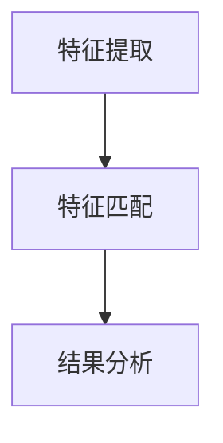

                 

### 文章标题

“机器视觉在质量控制中的应用：提高制造业产品质量”

### 文章关键词

机器视觉、质量控制、制造业、图像处理、算法原理、系统架构设计、项目实战

### 文章摘要

本文将深入探讨机器视觉技术在制造业质量控制中的应用，旨在提高产品质量。我们将首先介绍机器视觉的基础知识，随后分析其在质量控制中的挑战与潜力。接下来，我们将详细探讨机器视觉在零部件检测、成品检测和生产线质量监控中的应用，并通过实际案例进行分析。最后，本文将总结机器视觉质量控制的优势与未来发展趋势，并提供相关最佳实践和注意事项。

---

### 第一部分：机器视觉技术基础

#### 第1章：机器视觉概述

##### 1.1 机器视觉的概念与历史发展

机器视觉是指通过计算机技术和光学传感器等设备，对真实世界的图像进行采集、处理和分析，从而实现人类视觉功能的延伸和扩展。其历史可以追溯到20世纪60年代，最初应用于工业检测领域。随着计算机性能的提升和图像处理算法的进步，机器视觉技术逐渐成熟并广泛应用于多个行业。

**核心概念术语说明**：

- **机器视觉**：模拟人类视觉功能，对图像进行自动处理和分析的技术。
- **图像处理**：对图像进行滤波、增强、分割等操作，以提高图像质量或提取有用信息。
- **特征提取**：从图像中提取具有区分性的特征，用于后续的匹配和识别。

##### 1.2 机器视觉在质量控制中的作用

机器视觉在质量控制中扮演着重要角色，其主要作用包括：

- **缺陷检测**：检测产品表面的缺陷，如裂纹、划痕等。
- **尺寸测量**：精确测量产品的尺寸和形状，确保产品符合标准。
- **排序与分类**：根据产品的特征进行分类和排序，提高生产效率。

**问题背景与问题描述**：

在制造业中，质量控制是确保产品符合标准的关键环节。然而，传统的质量控制方法往往依赖于人工检测，存在效率低、精度不足等问题。机器视觉技术以其高速、高精度和自动化的特点，为质量控制提供了新的解决方案。

##### 1.3 机器视觉系统组成及工作原理

一个典型的机器视觉系统包括以下几个组成部分：

- **光源**：提供照明，以照亮待检测物体，使图像清晰。
- **图像传感器**：采集待检测物体的图像。
- **图像处理硬件**：对图像进行处理，包括滤波、增强、分割等。
- **图像处理软件**：执行图像处理算法，提取特征和进行识别。
- **控制系统**：控制整个视觉系统的运行。

**机器视觉系统的工作原理**：

1. **图像采集**：通过图像传感器获取待检测物体的图像。
2. **图像处理**：对图像进行处理，提高图像质量，提取有用信息。
3. **特征提取**：从图像中提取具有区分性的特征。
4. **识别与分类**：根据特征对物体进行识别和分类。

**边界与外延**：

- **边界**：机器视觉技术主要应用于工业生产过程中的质量控制，如零部件检测、成品检测等。
- **外延**：除了制造业，机器视觉技术在医疗、农业等领域也具有广泛的应用前景。

#### 第2章：图像处理基础

##### 2.1 图像基础理论

图像是由像素组成的二维阵列，每个像素具有特定的颜色和亮度值。图像的基础理论包括：

- **像素**：图像的基本单元，每个像素包含颜色信息和亮度值。
- **颜色空间**：表示图像颜色的一种方式，常用的有RGB、HSV等。
- **图像分辨率**：图像的清晰度和细节表现能力，通常用像素数量表示。

##### 2.2 图像增强与滤波

图像增强是指通过处理提高图像的视觉效果，使其更易于分析和理解。常用的图像增强方法包括：

- **对比度增强**：增加图像的明暗对比，突出细节。
- **锐化**：增强图像的边缘和轮廓，使其更清晰。
- **滤波**：去除图像中的噪声，提高图像质量。

##### 2.3 颜色空间转换与处理

颜色空间转换是指将一种颜色空间转换为另一种颜色空间，以适应特定的处理需求。常用的颜色空间转换包括：

- **RGB到HSV**：HSV颜色空间更适合进行颜色分析和处理。
- **灰度化**：将彩色图像转换为灰度图像，简化图像处理。

**概念属性特征对比表格**：

| 特征         | RGB          | HSV          |
| ------------ | ------------ | ------------ |
| 表示方法     | 三个分量     | 三个分量     |
| 主成分       | 亮度、红色、蓝色 | 亮度、色调、饱和度 |
| 适用场景     | 彩色图像处理 | 色彩分析和处理 |

**ER实体关系图架构**：

```mermaid
erDiagram
  Person ||--|{ Product }|
  Product ||--|{ Component }|
  Component ||--|{ Inspection }|
  Inspection ||--|{ Result }|
```

#### 第3章：特征提取与匹配

##### 3.1 特征提取方法

特征提取是机器视觉中的核心步骤，旨在从图像中提取具有区分性的特征。常用的特征提取方法包括：

- **边缘检测**：提取图像的边缘信息，如Canny算法。
- **纹理特征**：提取图像的纹理信息，如LBP算法。
- **形状特征**：提取图像的形状信息，如Hausdorff距离。

##### 3.2 特征匹配算法

特征匹配是机器视觉中的关键步骤，旨在将提取的特征与已知模板进行匹配。常用的特征匹配算法包括：

- **最近邻匹配**：找到与给定特征最相似的模板特征。
- **FLANN匹配**：基于傅里叶描述子的快速最近邻匹配算法。

##### 3.3 特征匹配在实际应用中的实现

特征匹配在实际应用中通常包括以下步骤：

1. **特征提取**：从待检测图像中提取特征。
2. **特征匹配**：将提取的特征与模板特征进行匹配。
3. **结果分析**：根据匹配结果进行物体识别和分类。

**算法原理讲解**：

特征匹配的算法原理基于相似性度量，常用的相似性度量方法包括：

- **欧氏距离**：计算两个特征向量的欧氏距离，距离越小，相似性越高。
- **余弦相似度**：计算两个特征向量的余弦相似度，相似度越高，表示两个特征向量越相似。

**算法mermaid流程图**：



**数学模型与公式**：

$$
d = \sqrt{\sum_{i=1}^{n}(x_i - y_i)^2}
$$

$$
similarity = \frac{(x \cdot y)}{\|x\| \|y\|}
$$

**举例说明**：

假设我们有两个特征向量 $x = [1, 2, 3]$ 和 $y = [1, 3, 2]$，使用欧氏距离计算它们的距离：

$$
d = \sqrt{(1-1)^2 + (2-3)^2 + (3-2)^2} = \sqrt{0 + 1 + 1} = \sqrt{2}
$$

使用余弦相似度计算它们的相似度：

$$
similarity = \frac{(1 \cdot 1 + 2 \cdot 3 + 3 \cdot 2)}{\sqrt{1^2 + 2^2 + 3^2} \sqrt{1^2 + 3^2 + 2^2}} = \frac{14}{\sqrt{14} \sqrt{14}} = 1
$$

由于余弦相似度为1，表示两个特征向量非常相似。

#### 第4章：机器视觉检测算法

##### 4.1 边缘检测算法

边缘检测是图像处理中的一个重要步骤，旨在提取图像的边缘信息。常用的边缘检测算法包括：

- **Sobel算子**：基于卷积操作，计算图像的水平和垂直边缘。
- **Canny算法**：基于高斯滤波和二值化操作，提取强边缘。

##### 4.2 形状分析算法

形状分析是机器视觉中的关键步骤，旨在对提取的边缘进行形状分析。常用的形状分析算法包括：

- **Hausdorff距离**：计算两个形状之间的距离，用于形状匹配。
- **形状上下文**：描述形状的局部特征，用于形状识别。

##### 4.3 视觉检测算法案例分析

在本节中，我们将通过实际案例来分析机器视觉检测算法的应用。例如，我们可以分析如何使用边缘检测算法对零部件进行缺陷检测，或者如何使用形状分析算法对成品进行分类。

**系统分析与架构设计方案**：

在本节中，我们将介绍一个具体的机器视觉检测系统架构，包括：

1. **问题场景介绍**：描述需要解决的场景和问题。
2. **系统功能设计**：使用Mermaid类图描述系统的领域模型。
3. **系统架构设计**：使用Mermaid架构图描述系统的整体架构。
4. **系统接口设计和系统交互**：使用Mermaid序列图描述系统的接口设计和交互流程。

**项目实战**：

在本节中，我们将介绍一个具体的机器视觉检测项目实战，包括：

1. **环境安装**：介绍所需的环境和工具。
2. **系统核心实现**：提供项目核心实现的源代码。
3. **代码应用解读与分析**：对源代码进行解读和分析。
4. **实际案例分析和详细讲解剖析**：通过实际案例进行分析和讲解。
5. **项目小结**：总结项目实现过程和经验。

**最佳实践 tips**：

1. **选择合适的算法**：根据应用场景选择合适的边缘检测和形状分析算法。
2. **优化图像处理流程**：通过图像预处理和优化，提高检测精度和速度。
3. **实时性考虑**：在满足精度要求的前提下，提高系统的实时性。

**小结**：

机器视觉技术在质量控制中具有广泛的应用前景，通过边缘检测、形状分析等算法，可以实现高速、高精度的产品检测和分类。在应用机器视觉技术时，需要充分考虑场景需求和系统架构设计，以实现最佳效果。

**注意事项**：

1. **硬件设备选择**：根据应用场景选择合适的图像传感器和光源。
2. **算法优化**：针对具体应用场景进行算法优化，提高检测效率和精度。

**拓展阅读**：

- 《机器视觉：算法与应用》
- 《图像处理：基础与进阶》
- 《机器学习：原理与算法》

---

### 第二部分：机器视觉在质量控制中的应用

#### 第5章：制造业质量控制的挑战

##### 5.1 制造业质量控制的现状

制造业质量控制是确保产品质量的关键环节。目前，制造业质量控制主要依赖于人工检测和传统的检测设备。然而，这些方法存在以下问题：

- **效率低**：人工检测速度慢，难以满足大规模生产的需要。
- **精度不足**：人工检测容易受到主观因素的影响，检测精度不足。
- **成本高**：传统检测设备成本高，维护复杂。

##### 5.2 质量控制存在的问题

制造业质量控制存在的问题包括：

- **检测效率低**：无法满足生产节拍要求。
- **检测精度不足**：产品缺陷难以被检测出来。
- **检测成本高**：传统检测设备投资大，维护复杂。

##### 5.3 机器视觉在质量控制中的潜力

机器视觉技术在质量控制中具有以下潜力：

- **高效检测**：通过高速图像处理，满足生产节拍要求。
- **高精度检测**：利用先进的图像处理算法，提高检测精度。
- **低成本检测**：机器视觉系统投资相对较低，维护简单。

#### 第6章：机器视觉在零部件检测中的应用

##### 6.1 零部件检测的需求分析

零部件检测是制造业质量控制中的重要环节。其需求包括：

- **缺陷检测**：检测零部件表面的裂纹、划痕等缺陷。
- **尺寸测量**：测量零部件的尺寸和形状，确保符合标准。
- **排序与分类**：根据零部件的特征进行分类和排序，提高生产效率。

##### 6.2 零部件检测的流程与方法

零部件检测的流程通常包括以下几个步骤：

1. **图像采集**：通过图像传感器获取零部件的图像。
2. **图像预处理**：对图像进行滤波、增强等预处理，提高图像质量。
3. **特征提取**：提取零部件的边缘、纹理等特征。
4. **缺陷检测**：利用边缘检测、形状分析等算法检测零部件的缺陷。
5. **尺寸测量**：利用形状分析算法测量零部件的尺寸和形状。
6. **排序与分类**：根据检测结果对零部件进行分类和排序。

##### 6.3 案例分析：某汽车制造企业零部件检测实践

某汽车制造企业采用了机器视觉技术对其零部件进行检测。通过图像采集和预处理，他们能够快速、准确地检测出零部件的缺陷和尺寸。通过实际案例分析，他们发现机器视觉技术显著提高了零部件检测的效率和精度。

#### 第7章：机器视觉在成品检测中的应用

##### 7.1 成品检测的需求分析

成品检测是确保产品质量的最后一步。其需求包括：

- **外观检测**：检测成品的外观缺陷，如污点、划痕等。
- **功能检测**：检测成品的功能是否符合要求。
- **性能检测**：检测成品的性能指标，如亮度、分辨率等。

##### 7.2 成品检测的流程与方法

成品检测的流程通常包括以下几个步骤：

1. **图像采集**：通过图像传感器获取成品的图像。
2. **图像预处理**：对图像进行滤波、增强等预处理，提高图像质量。
3. **特征提取**：提取成品的外观、功能等特征。
4. **缺陷检测**：利用边缘检测、形状分析等算法检测成品的外观缺陷。
5. **功能检测**：通过模拟或实际测试，检测成品的功能是否符合要求。
6. **性能检测**：利用性能检测仪器，检测成品的性能指标。

##### 7.3 案例分析：某电子制造企业成品检测实践

某电子制造企业采用了机器视觉技术对其成品进行检测。通过外观检测、功能检测和性能检测，他们能够全面、准确地评估成品的质量。通过实际案例分析，他们发现机器视觉技术显著提高了成品检测的效率和精度。

#### 第8章：机器视觉在生产线质量监控中的应用

##### 8.1 生产线质量监控的需求分析

生产线质量监控是确保产品质量的持续稳定的关键环节。其需求包括：

- **实时监控**：对生产线上的产品质量进行实时监控。
- **预警机制**：及时发现产品质量问题，防止不良产品流入市场。
- **数据分析**：对生产过程中的质量问题进行分析，优化生产流程。

##### 8.2 生产线质量监控的流程与方法

生产线质量监控的流程通常包括以下几个步骤：

1. **图像采集**：通过图像传感器获取生产线上的图像。
2. **图像预处理**：对图像进行滤波、增强等预处理，提高图像质量。
3. **特征提取**：提取生产线上的产品质量特征。
4. **实时监控**：利用实时监控算法，对生产线上的产品质量进行监控。
5. **预警机制**：根据监控结果，设置预警阈值，及时发现产品质量问题。
6. **数据分析**：对生产过程中的质量问题进行分析，提出改进建议。

##### 8.3 案例分析：某食品生产企业生产线质量监控实践

某食品生产企业采用了机器视觉技术对其生产线进行质量监控。通过实时监控和预警机制，他们能够及时发现产品质量问题，确保产品质量的稳定。通过实际案例分析，他们发现机器视觉技术显著提高了生产线质量监控的效率和准确性。

#### 第9章：机器视觉在质量控制中的综合应用

##### 9.1 机器视觉质量控制的优势与挑战

机器视觉质量控制具有以下优势：

- **高效性**：通过高速图像处理，满足生产节拍要求。
- **高精度**：利用先进的图像处理算法，提高检测精度。
- **自动化**：实现检测过程的自动化，减少人力成本。

然而，机器视觉质量控制也面临以下挑战：

- **设备成本**：机器视觉系统的设备成本较高，对中小型企业可能形成负担。
- **算法优化**：针对不同应用场景，需要对算法进行优化，提高检测效果。
- **实时性**：在满足精度要求的前提下，提高系统的实时性。

##### 9.2 机器视觉在质量控制中的未来发展趋势

随着人工智能和深度学习技术的发展，机器视觉在质量控制中的未来发展趋势包括：

- **智能化**：通过人工智能技术，实现自动化检测和决策。
- **定制化**：根据不同应用场景，定制化开发机器视觉系统。
- **集成化**：将机器视觉技术与生产过程深度融合，实现智能化生产。

##### 9.3 机器视觉质量控制的最佳实践

在实施机器视觉质量控制时，以下最佳实践值得借鉴：

- **需求分析**：充分了解质量控制的需求，明确目标和应用场景。
- **系统设计**：根据需求，设计合理的系统架构和算法。
- **数据采集**：确保图像采集质量，为后续处理提供可靠的数据基础。
- **算法优化**：针对具体应用场景，优化图像处理和特征提取算法。
- **系统集成**：将机器视觉系统与生产过程系统集成，实现自动化检测和监控。

**文章作者信息**

- 作者：AI天才研究院/AI Genius Institute & 禅与计算机程序设计艺术 /Zen And The Art of Computer Programming

