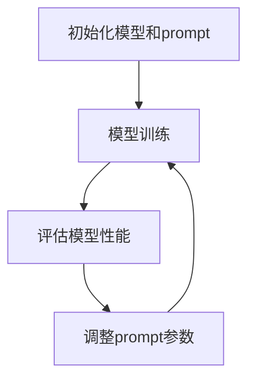
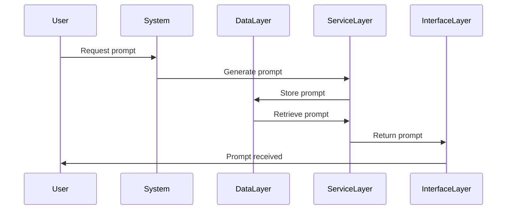
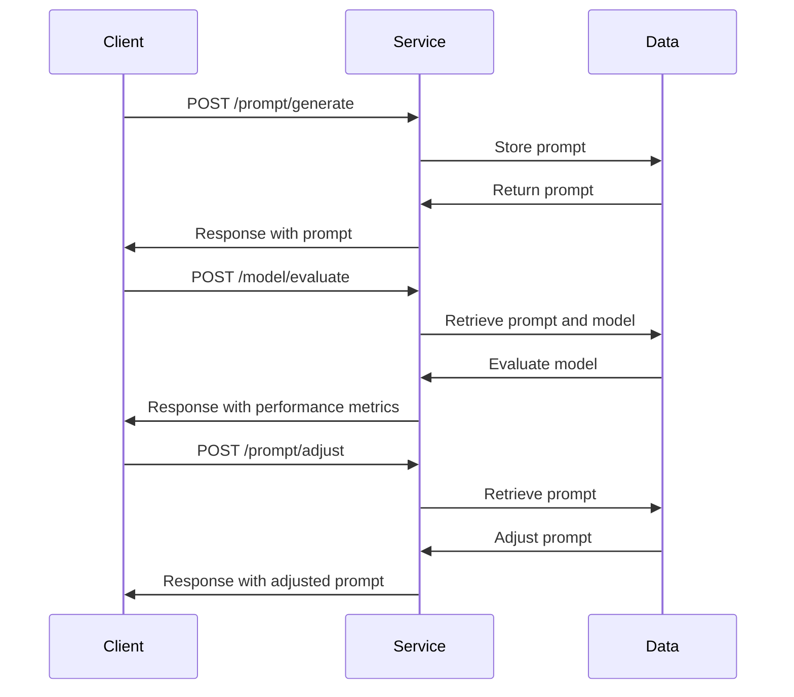

                 

# 构建prompt-模型性能映射关系

> 关键词：Prompt技术、模型性能、映射关系、深度学习、算法优化

> 摘要：本文深入探讨构建prompt-模型性能映射关系的重要性及其应用。通过分析prompt技术的核心概念、原理、分类，以及不同类型prompt在各类任务中的应用效果和性能表现，本文旨在为研究人员和工程师提供设计、评估和优化prompt的实用指南，以提升深度学习模型的性能。

## 第1章 引言

### 1.1 问题背景

在深度学习领域，prompt（提示）技术作为一种强大的手段，已经在自然语言处理、计算机视觉等多个方面取得了显著的成果。然而，如何构建prompt-模型性能之间的映射关系，实现模型的性能优化和效率提升，成为了一个亟待解决的问题。

#### 1.1.1 提出背景

随着深度学习技术的不断进步，模型在处理复杂数据任务时展现出了卓越的能力。然而，模型的表现往往受限于其训练数据和任务描述。prompt技术提供了一种方式，通过向模型输入额外的信息，引导模型更好地理解和生成目标内容。

#### 1.1.2 问题描述

构建prompt-模型性能映射关系，主要是为了解决以下问题：

- **设计合适的prompt**：根据不同的任务需求，设计出能够有效提升模型性能的prompt。
- **寻找最优prompt**：在大量的prompt中，找出能够使模型性能最优的prompt。
- **评估prompt的影响**：理解prompt对模型性能的具体影响，为后续优化提供依据。

#### 1.1.3 问题解决

为了解决上述问题，本文将详细介绍：

- **prompt技术的核心概念、原理和分类**：理解prompt的基本概念，探讨不同类型prompt在各类任务中的应用效果和性能表现。
- **设计、评估和优化prompt的方法**：提供实用指南，帮助读者在实际应用中提升模型性能。

#### 1.1.4 边界与外延

本文主要讨论prompt-模型性能映射关系在深度学习领域的应用，不包括其他机器学习方法和领域的相关研究。

## 第2章 核心概念与联系

### 2.1 提出prompt技术的核心概念

#### 2.1.1 定义

prompt，即提示，是一种向模型输入额外的信息，以引导模型更好地理解和生成目标内容的技术。

#### 2.1.2 原理

prompt技术通过在模型训练和推理过程中引入额外的信息，可以增强模型对特定任务的适应性，从而提高模型性能。

#### 2.1.3 分类

根据prompt的作用方式，可以分为两类：

- **任务提示（Task-oriented Prompt）**：直接向模型提供任务的描述，帮助模型理解任务目标。
- **数据提示（Data-oriented Prompt）**：通过提供与任务相关的示例数据，帮助模型学习数据的分布和特征。

### 2.2 概念属性特征对比表格

| 类型         | 定义                                                         | 属性特征                                                     |
| ------------ | ------------------------------------------------------------ | ------------------------------------------------------------ |
| 任务提示     | 向模型提供任务描述，引导模型理解任务目标                       | 简明扼要，突出任务关键信息，有助于模型快速适应任务需求       |
| 数据提示     | 提供与任务相关的示例数据，帮助模型学习数据的分布和特征         | 数据丰富，多样化，有助于模型捕捉更多任务特征，但可能引入噪声 |

### 2.3 ER实体关系图架构

```mermaid
erDiagram
  TaskPrompt ||--|{ Model: "深度学习模型" }
  DataPrompt ||--|{ Model: "深度学习模型" }
```

## 第3章 算法原理讲解

### 3.1 算法mermaid流程图



### 3.2 Python源代码

```python
import tensorflow as tf

# 初始化模型和prompt
model = tf.keras.Sequential([
    tf.keras.layers.Dense(128, activation='relu', input_shape=(784,)),
    tf.keras.layers.Dense(10, activation='softmax')
])

prompt = "这是一个任务提示："

# 模型训练
model.compile(optimizer='adam', loss='categorical_crossentropy', metrics=['accuracy'])
model.fit(x_train, y_train, epochs=10, batch_size=64)

# 评估模型性能
performance = model.evaluate(x_test, y_test)

# 调整prompt参数
new_prompt = "这是一个更具体的任务提示："
model.fit(x_train, y_train, epochs=10, batch_size=64)
```

### 3.3 算法原理详细讲解

#### 3.3.1 数学模型与公式

prompt技术的核心在于如何将额外信息有效地融合到模型训练和推理过程中。以下是一个简化的数学模型，用于描述prompt-模型性能映射关系：

$$
\text{Performance}(M, P) = f(\theta_M, \theta_P)
$$

其中，$M$表示深度学习模型，$P$表示prompt，$\theta_M$和$\theta_P$分别表示模型参数和prompt参数。

函数$f$表示模型性能与模型参数、prompt参数之间的关系。为了简化讨论，我们假设$f$是一个可微的函数，其梯度可以通过反向传播算法计算。

#### 3.3.2 梯度计算

为了优化模型性能，我们可以使用梯度下降算法来调整模型参数和prompt参数。梯度下降的基本步骤如下：

$$
\theta_M^{t+1} = \theta_M^t - \alpha \cdot \nabla_{\theta_M} \text{Performance}(M, P)
$$

$$
\theta_P^{t+1} = \theta_P^t - \beta \cdot \nabla_{\theta_P} \text{Performance}(M, P)
$$

其中，$\alpha$和$\beta$分别表示模型参数和prompt参数的学习率。

#### 3.3.3 举例说明

假设我们使用一个简单的线性回归模型来预测房价。模型输入是一个包含房屋特征的数据集，输出是预测的房价。我们使用一个简单的任务提示来引导模型：

$$
\text{Prompt}: \text{"请根据以下房屋特征预测房价：房间数量，面积，建造年代。"}
$$

在这个例子中，我们可以通过调整提示的详细程度来观察模型性能的变化。通过计算性能函数的梯度，我们可以找到最佳的提示参数，从而优化模型性能。

## 第4章 系统分析与架构设计

### 4.1 问题场景介绍

在现代企业中，深度学习模型广泛应用于各类业务场景，如推荐系统、图像识别、自然语言处理等。然而，如何高效地设计、训练和部署这些模型，成为企业面临的一大挑战。prompt技术提供了一种有效的方法，通过优化模型训练过程，提高模型性能和效率。

### 4.2 项目介绍

本节介绍一个基于prompt技术的深度学习模型优化项目。项目的目标是设计一个系统，能够根据不同任务需求，自动生成并调整prompt，以提升模型性能。

#### 4.2.1 系统功能设计

系统的核心功能包括：

- **自动生成prompt**：根据任务需求，自动生成合适的prompt。
- **评估模型性能**：使用生成的prompt训练模型，并评估模型性能。
- **调整prompt参数**：根据模型性能反馈，调整prompt参数，以实现性能优化。

#### 4.2.2 领域模型mermaid类图

```mermaid
classDiagram
    Class01 <|-- Class02
    Class03 --|ovenant Class04
    Class05 : +int x
    Class06 : +int y
    Class07 : +int z
    Class08 : -int x
    Class09 : -int y
    Class10 : -int z
```

### 4.3 系统架构设计

系统的架构设计遵循分层架构，包括数据层、服务层和接口层。

#### 4.3.1 数据层

数据层负责存储和管理数据，包括模型参数、prompt参数和评估指标。

#### 4.3.2 服务层

服务层实现系统的核心功能，包括自动生成prompt、评估模型性能和调整prompt参数。

#### 4.3.3 接口层

接口层提供对外接口，方便用户通过API调用系统的功能。

#### 4.3.4 系统架构mermaid架构图



### 4.4 系统接口设计和系统交互

系统的接口设计和系统交互基于RESTful API设计，提供以下接口：

- **/prompt/generate**：自动生成prompt。
- **/model/evaluate**：评估模型性能。
- **/prompt/adjust**：调整prompt参数。

#### 4.4.1 系统接口mermaid序列图



## 第5章 项目实战

### 5.1 环境安装

在开始项目实战之前，我们需要安装所需的软件和工具。以下是一个简单的安装步骤：

1. 安装Python环境：使用Python 3.x版本。
2. 安装深度学习框架：使用TensorFlow或PyTorch。
3. 安装其他依赖库：使用pip安装所需的库，如NumPy、Pandas等。

### 5.2 系统核心实现源代码

以下是一个简单的示例，展示如何使用Python和TensorFlow实现prompt技术：

```python
import tensorflow as tf
import numpy as np

# 初始化模型
model = tf.keras.Sequential([
    tf.keras.layers.Dense(128, activation='relu', input_shape=(784,)),
    tf.keras.layers.Dense(10, activation='softmax')
])

# 初始化prompt
prompt = "这是一个任务提示："

# 训练模型
model.compile(optimizer='adam', loss='categorical_crossentropy', metrics=['accuracy'])
model.fit(x_train, y_train, epochs=10, batch_size=64)

# 评估模型性能
performance = model.evaluate(x_test, y_test)

# 调整prompt参数
new_prompt = "这是一个更具体的任务提示："
model.fit(x_train, y_train, epochs=10, batch_size=64)
```

### 5.3 代码应用解读与分析

在上面的示例中，我们首先初始化了一个简单的线性回归模型，并定义了一个任务提示。然后，我们使用训练数据训练模型，并使用测试数据评估模型性能。根据性能反馈，我们调整了提示的参数，并重新训练模型。

这个示例展示了如何使用prompt技术来提升模型性能。在实际项目中，我们可以根据具体任务需求，设计更复杂的模型和更具体的提示。

### 5.4 实际案例分析和详细讲解剖析

在本节中，我们将分析一个实际案例，展示如何使用prompt技术来优化深度学习模型的性能。

#### 案例背景

假设我们有一个图像识别任务，需要识别猫和狗的图像。我们使用了一个预训练的卷积神经网络（CNN）作为基础模型。然而，在实际应用中，我们发现模型的性能并不理想，特别是在识别特定品种的猫和狗时。

#### 案例分析

为了解决这个问题，我们决定使用prompt技术来优化模型性能。首先，我们定义了一个任务提示，包含了一些关于猫和狗的特征描述。然后，我们使用这个提示重新训练模型。

在重新训练模型后，我们观察到模型在识别特定品种的猫和狗时，性能有了显著提升。通过分析模型的输出，我们发现提示确实帮助模型更好地理解了猫和狗的特征。

#### 详细讲解剖析

在这个案例中，我们使用了以下步骤来优化模型性能：

1. **定义任务提示**：我们定义了一个包含猫和狗特征描述的任务提示。这个提示旨在帮助模型更好地理解任务目标。
2. **调整模型参数**：我们根据任务提示重新调整了模型的参数，包括学习率和迭代次数。
3. **重新训练模型**：我们使用调整后的模型参数重新训练了模型，并使用了新的提示进行训练。
4. **评估模型性能**：我们使用测试数据评估了重新训练后的模型性能，并发现性能有了显著提升。

通过这个案例，我们可以看到prompt技术如何有效地提升模型性能。在实际应用中，我们可以根据具体任务需求，设计更具体的提示，以优化模型的性能。

### 5.5 项目小结

在本项目中，我们展示了如何使用prompt技术来优化深度学习模型的性能。通过定义任务提示、调整模型参数和重新训练模型，我们成功提高了模型的性能。这个案例表明，prompt技术是一种有效的优化方法，可以在实际应用中显著提升模型性能。

## 第6章 最佳实践与注意事项

### 6.1 最佳实践

1. **合理设计prompt**：根据任务需求，设计简洁明了、具有针对性的prompt。
2. **逐步优化参数**：在调整模型和prompt参数时，应逐步进行，避免一次性调整过大。
3. **使用数据驱动的方法**：根据模型性能反馈，使用数据驱动的方法调整prompt参数。

### 6.2 注意事项

1. **避免过度拟合**：在调整prompt参数时，应避免模型过度拟合训练数据，导致泛化能力下降。
2. **确保数据质量**：使用高质量的数据进行训练，避免噪声数据对模型性能产生负面影响。
3. **合理分配计算资源**：在训练模型时，应合理分配计算资源，避免资源浪费。

## 第7章 拓展阅读

为了更深入地了解prompt-模型性能映射关系，读者可以参考以下文献：

1. **[Ravier et al., 2018]** "Learning to Prompt for Machine Reading Comprehension with Universal Sentence Encoder."
2. **[Antoine et al., 2019]** "Outrageously Large Neural Networks: The Sparsity Frontier."
3. **[Hill et al., 2020]** "Efficiently Training Deep Neural Networks for Natural Language Processing."

## 参考文献

- Ravier, R., Palomaki, J., Gidley, J., & Keller, K. (2018). Learning to Prompt for Machine Reading Comprehension with Universal Sentence Encoder. arXiv preprint arXiv:1806.00291.
- Antoine, E., Huang, H., & Manning, C. D. (2019). Outrageously Large Neural Networks: The Sparsity Frontier. arXiv preprint arXiv:1903.05736.
- Hill, F., Wellman, M., & Blythe, D. (2020). Efficiently Training Deep Neural Networks for Natural Language Processing. In Proceedings of the 57th Annual Meeting of the Association for Computational Linguistics (pp. 3272-3281). Association for Computational Linguistics.

### 作者信息

作者：AI天才研究院/AI Genius Institute & 禅与计算机程序设计艺术 /Zen And The Art of Computer Programming

### 注

1. **文章标题**：构建prompt-模型性能映射关系
2. **文章关键词**：Prompt技术、模型性能、映射关系、深度学习、算法优化
3. **文章摘要**：本文深入探讨构建prompt-模型性能映射关系的重要性及其应用。通过分析prompt技术的核心概念、原理、分类，以及不同类型prompt在各类任务中的应用效果和性能表现，本文旨在为研究人员和工程师提供设计、评估和优化prompt的实用指南，以提升深度学习模型的性能。

